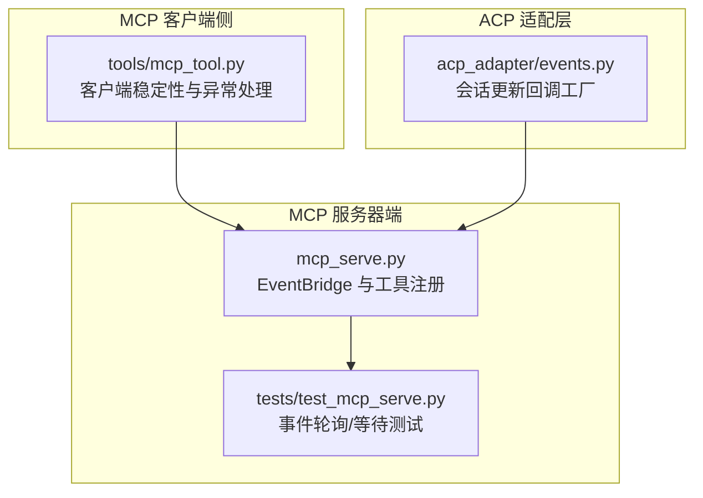
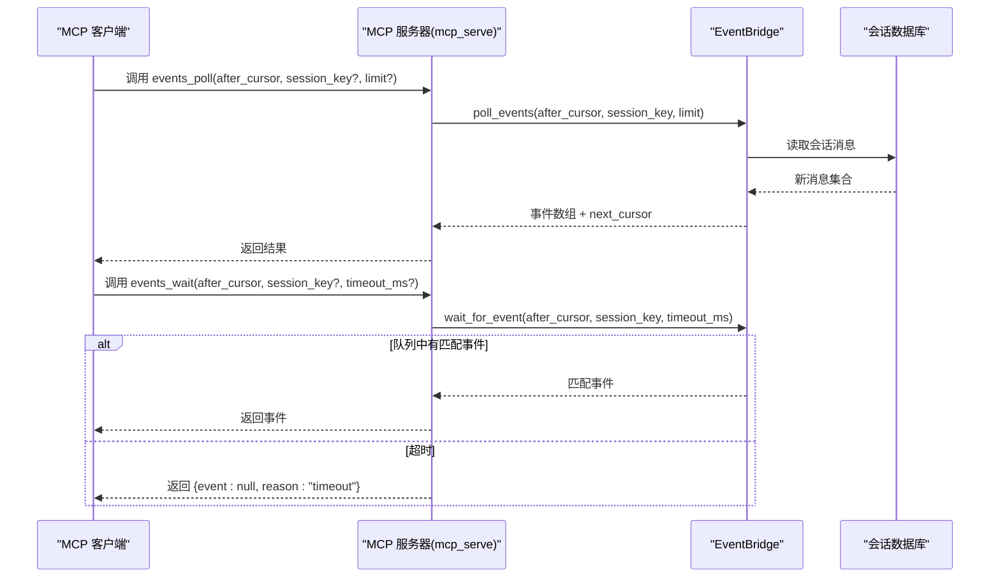
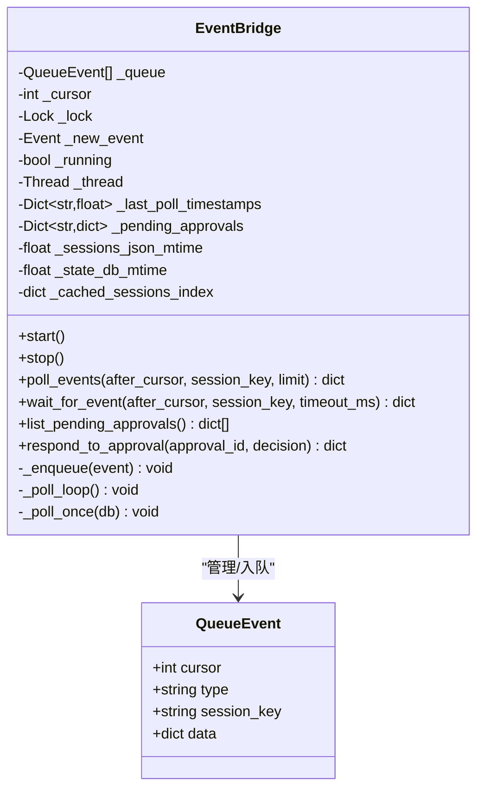
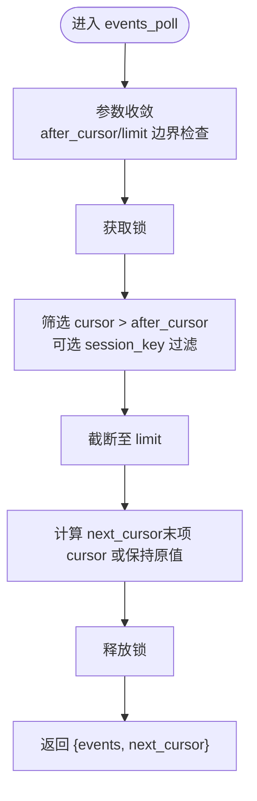
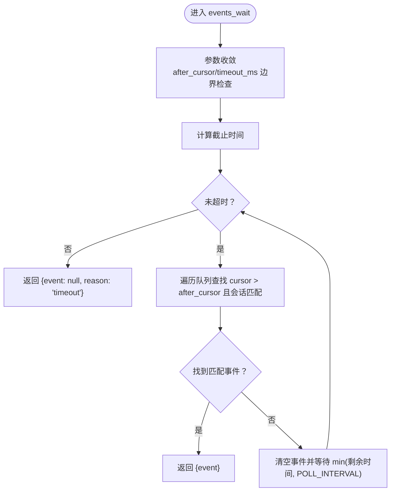
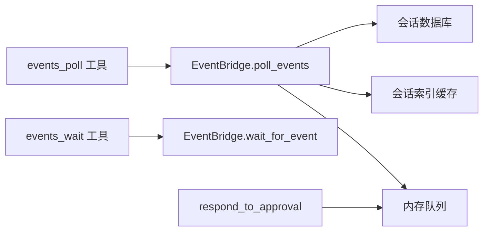

# 事件处理工具

<cite>
**本文引用的文件**
- [mcp_serve.py](file://mcp_serve.py)
- [test_mcp_serve.py](file://tests/test_mcp_serve.py)
- [mcp_tool.py](file://tools/mcp_tool.py)
- [events.py](file://acp_adapter/events.py)
</cite>

## 目录
1. [简介](#简介)
2. [项目结构](#项目结构)
3. [核心组件](#核心组件)
4. [架构总览](#架构总览)
5. [详细组件分析](#详细组件分析)
6. [依赖关系分析](#依赖关系分析)
7. [性能考量](#性能考量)
8. [故障排查指南](#故障排查指南)
9. [结论](#结论)
10. [附录](#附录)

## 简介
本文件为 Hermes MCP 事件处理工具的权威参考文档，聚焦于两个实时事件工具：events_poll 和 events_wait。文档系统性阐述事件轮询机制、游标位置管理与超时处理；解释三种事件类型（message、approval_requested、approval_resolved）的数据结构与触发条件；文档化事件队列的内存管理、事件去重与丢失保护机制；并提供长轮询与短轮询的使用场景与性能对比，以及最佳实践与完整示例。

## 项目结构
事件处理能力由 MCP 服务器端实现，核心位于 mcp_serve.py 中的 EventBridge 与工具函数 events_poll、events_wait；配套测试位于 tests/test_mcp_serve.py；MCP 客户端侧的稳定性与异常处理在 tools/mcp_tool.py 中体现；ACP 适配层的事件桥接逻辑在 acp_adapter/events.py 中。

图表来源
- [mcp_serve.py:1-898](file://mcp_serve.py#L1-L898)
- [test_mcp_serve.py:670-869](file://tests/test_mcp_serve.py#L670-L869)
- [mcp_tool.py:1-800](file://tools/mcp_tool.py#L1-L800)
- [events.py:1-280](file://acp_adapter/events.py#L1-L280)

章节来源
- [mcp_serve.py:1-898](file://mcp_serve.py#L1-L898)
- [test_mcp_serve.py:670-869](file://tests/test_mcp_serve.py#L670-L869)
- [mcp_tool.py:1-800](file://tools/mcp_tool.py#L1-L800)
- [events.py:1-280](file://acp_adapter/events.py#L1-L280)

## 核心组件
- EventBridge：后台轮询器，负责从会话数据库中发现新消息并入队，维护游标、线程安全事件通知、内存队列上限与会话索引缓存。
- events_poll：短轮询工具，返回自 after_cursor 之后的事件列表，并返回 next_cursor 用于下一次轮询。
- events_wait：长轮询工具，阻塞等待匹配事件或超时，支持会话过滤与超时上限。
- QueueEvent：事件数据模型，包含 cursor、type、session_key 与 data 字段。
- 工具参数强制转换：对 after_cursor、limit、timeout_ms 进行边界检查与类型收敛，确保客户端传参异常时仍可稳健运行。

章节来源
- [mcp_serve.py:195-444](file://mcp_serve.py#L195-L444)
- [mcp_serve.py:668-729](file://mcp_serve.py#L668-L729)
- [test_mcp_serve.py:672-791](file://tests/test_mcp_serve.py#L672-L791)

## 架构总览
事件处理采用“轮询 + 内存队列”的轻量架构：EventBridge 后台线程周期性扫描会话数据库，提取新消息并封装为 QueueEvent 入队；MCP 工具通过 poll/wait 接口消费队列，使用 cursor 实现无重复、有序的事件流。

图表来源
- [mcp_serve.py:244-294](file://mcp_serve.py#L244-L294)
- [mcp_serve.py:668-729](file://mcp_serve.py#L668-L729)

## 详细组件分析

### EventBridge 与事件模型
- 数据结构
  - QueueEvent：包含 cursor、type、session_key、data。type 支持 "message"、"approval_requested"、"approval_resolved"。
  - 内部队列：按时间顺序追加，最大长度受 QUEUE_LIMIT 限制，超出时丢弃最早元素，保证内存占用可控。
- 轮询与去重
  - 使用 mtime 缓存跳过无变更的轮询，降低 IO 压力。
  - 按会话维护 last_seen 时间戳，仅推送新消息，避免重复事件。
- 线程安全
  - 使用 threading.Lock 保护队列与状态；使用 threading.Event 在等待时阻塞，唤醒后继续检查。
- 审批事件
  - 通过 respond_to_approval 将审批决策转换为 "approval_resolved" 事件入队，供客户端消费。

图表来源
- [mcp_serve.py:195-444](file://mcp_serve.py#L195-L444)

章节来源
- [mcp_serve.py:195-444](file://mcp_serve.py#L195-L444)

### events_poll：短轮询
- 输入参数
  - after_cursor：游标起点，默认 0。
  - session_key：可选，按会话过滤。
  - limit：最大返回事件数，默认 20，上限 200。
- 处理流程
  - 从队列中筛选 cursor > after_cursor 的事件，按插入顺序截断至 limit。
  - 计算 next_cursor 为返回事件集的最后一个 cursor；若无事件则保持 after_cursor。
- 输出
  - 返回 {"events": [...], "next_cursor": int}。
- 参数收敛
  - 对 after_cursor、limit 进行强制转换与边界约束，避免无效输入导致崩溃。

图表来源
- [mcp_serve.py:668-695](file://mcp_serve.py#L668-L695)
- [mcp_serve.py:244-266](file://mcp_serve.py#L244-L266)

章节来源
- [mcp_serve.py:668-695](file://mcp_serve.py#L668-L695)
- [test_mcp_serve.py:672-721](file://tests/test_mcp_serve.py#L672-L721)

### events_wait：长轮询
- 输入参数
  - after_cursor：游标起点。
  - session_key：可选，按会话过滤。
  - timeout_ms：最长等待毫秒数，默认 30000，上限 300000（5 分钟）。
- 处理流程
  - 计算截止时间；循环检查队列中是否存在匹配事件。
  - 若无匹配，清空事件并等待至多 POLL_INTERVAL（约 200ms），直至超时或有事件。
- 输出
  - 有事件：返回 {"event": {...}}；
  - 超时：返回 {"event": null, "reason": "timeout"}。
- 参数收敛
  - 对 timeout_ms 进行强制转换与上限约束。

图表来源
- [mcp_serve.py:699-729](file://mcp_serve.py#L699-L729)
- [mcp_serve.py:268-294](file://mcp_serve.py#L268-L294)

章节来源
- [mcp_serve.py:699-729](file://mcp_serve.py#L699-L729)
- [test_mcp_serve.py:723-748](file://tests/test_mcp_serve.py#L723-L748)

### 事件类型与数据结构
- message
  - 触发条件：EventBridge 发现某会话的新消息（role 为 user/assistant），内容非空。
  - 数据字段：包含 role、content（截断）、timestamp、message_id。
- approval_requested
  - 触发条件：当前实现中，approval_requested 事件由外部审批流程产生；在 MCP 服务器侧，该事件类型存在于 QueueEvent 的 type 字段定义中，但实际入队逻辑主要见于 approval_resolved 的构造。
- approval_resolved
  - 触发条件：调用 respond_to_approval 将审批决策转换为 approval_resolved 事件入队。
  - 数据字段：approval_id、decision、session_key。

章节来源
- [mcp_serve.py:198-201](file://mcp_serve.py#L198-L201)
- [mcp_serve.py:426-436](file://mcp_serve.py#L426-L436)
- [mcp_serve.py:312-319](file://mcp_serve.py#L312-L319)

### 游标位置管理与超时处理
- 游标
  - _cursor 自增递增，每个入队事件获得唯一 cursor；poll/wait 基于 cursor 实现无重复消费。
  - next_cursor 由最后一次返回事件的 cursor 决定，客户端据此推进 after_cursor。
- 超时
  - events_wait 的 timeout_ms 上限为 300000ms；超过上限将被裁剪。
  - 超时返回统一结构，便于客户端区分“无事件”与“超时”。

章节来源
- [mcp_serve.py:214-216](file://mcp_serve.py#L214-L216)
- [mcp_serve.py:324-326](file://mcp_serve.py#L324-L326)
- [mcp_serve.py:715-721](file://mcp_serve.py#L715-L721)

### 内存管理、去重与丢失保护
- 内存管理
  - 队列长度受 QUEUE_LIMIT 限制，超出时丢弃最旧事件，避免无限增长。
- 去重
  - 通过 cursor 严格递增与“cursor > after_cursor”筛选，确保不会重复返回同一事件。
- 丢失保护
  - mtime 缓存避免频繁扫描；按会话 last_seen 时间戳过滤新消息，减少遗漏。
  - 线程安全的入队/出队与事件通知，保障并发环境下的正确性。

章节来源
- [mcp_serve.py:191-192](file://mcp_serve.py#L191-L192)
- [mcp_serve.py:327-329](file://mcp_serve.py#L327-L329)
- [mcp_serve.py:375-376](file://mcp_serve.py#L375-L376)
- [mcp_serve.py:438-443](file://mcp_serve.py#L438-L443)

### 长轮询 vs 短轮询：使用场景与性能对比
- 长轮询（events_wait）
  - 场景：需要近实时事件推送，降低客户端轮询频率与 CPU 占用。
  - 特点：阻塞等待，超时控制明确；适合低频事件或对延迟敏感的交互。
- 短轮询（events_poll）
  - 场景：事件密度较高或客户端无法接受阻塞等待；需要批量拉取。
  - 特点：无阻塞，适合批处理与高吞吐；需自行控制轮询间隔以平衡延迟与资源消耗。

章节来源
- [mcp_serve.py:668-729](file://mcp_serve.py#L668-L729)
- [test_mcp_serve.py:723-748](file://tests/test_mcp_serve.py#L723-L748)

### 最佳实践
- 游标维护
  - 每次成功消费事件后，使用返回的 next_cursor 更新 after_cursor，避免重复与丢失。
- 错误重试
  - 对 events_wait 超时进行指数退避重试，结合本地缓存减少抖动。
- 连接恢复
  - 客户端侧建议实现自动重连与断线重推；服务端侧通过线程安全与队列上限保障稳定性。
- 会话过滤
  - 在多会话环境中优先使用 session_key 过滤，减少无关事件干扰。
- 超时设置
  - 根据业务延迟容忍度调整 timeout_ms；避免过长导致响应迟滞。

章节来源
- [mcp_serve.py:668-729](file://mcp_serve.py#L668-L729)
- [mcp_tool.py:260-265](file://tools/mcp_tool.py#L260-L265)

### 完整事件处理示例与错误处理策略
- 示例流程
  - 客户端首次调用 events_poll，after_cursor=0，得到 next_cursor=N。
  - 客户端后续每次调用 events_poll，after_cursor=上一次 next_cursor，limit 控制单次数量。
  - 当需要低延迟时，切换到 events_wait，设置合理 timeout_ms，收到事件后立即处理并推进游标。
- 错误处理
  - 参数非法：工具内部强制转换与边界裁剪，保证返回结构稳定。
  - 超时：events_wait 明确返回 {"event": null, "reason": "timeout"}，客户端据此决定重试或降级。
  - 客户端异常：tools/mcp_tool.py 提供连接重试、超时报告与异常屏蔽，提升整体鲁棒性。

章节来源
- [test_mcp_serve.py:672-791](file://tests/test_mcp_serve.py#L672-L791)
- [mcp_serve.py:668-729](file://mcp_serve.py#L668-L729)
- [mcp_tool.py:63-78](file://tools/mcp_tool.py#L63-L78)

## 依赖关系分析
- EventBridge 依赖会话数据库与会话索引缓存，通过 mtime 判断是否需要扫描。
- 事件工具依赖 EventBridge 的 poll_events/wait_for_event 接口。
- 审批相关事件通过 respond_to_approval 构造 approval_resolved 并入队。

图表来源
- [mcp_serve.py:244-294](file://mcp_serve.py#L244-L294)
- [mcp_serve.py:304-319](file://mcp_serve.py#L304-L319)

章节来源
- [mcp_serve.py:244-294](file://mcp_serve.py#L244-L294)
- [mcp_serve.py:304-319](file://mcp_serve.py#L304-L319)

## 性能考量
- 轮询间隔：POLL_INTERVAL 约 200ms，兼顾延迟与 CPU 占用。
- 扫描优化：mtime 缓存避免无变化时的全量扫描，显著降低 IO。
- 队列上限：QUEUE_LIMIT 限制内存占用，防止 OOM。
- 参数收敛：工具入口对参数进行强制转换与裁剪，避免异常输入导致额外开销。

章节来源
- [mcp_serve.py:191-192](file://mcp_serve.py#L191-L192)
- [mcp_serve.py:375-376](file://mcp_serve.py#L375-L376)
- [mcp_serve.py:688-689](file://mcp_serve.py#L688-L689)
- [mcp_serve.py:715-721](file://mcp_serve.py#L715-L721)

## 故障排查指南
- 事件未返回
  - 检查 after_cursor 是否正确推进；确认 session_key 是否匹配。
  - 对于 events_wait，确认 timeout_ms 设置是否过短。
- 超时频繁
  - 调整 POLL_INTERVAL 或改为短轮询；评估业务延迟容忍度。
- 内存占用上升
  - 检查 QUEUE_LIMIT 是否过大；确认客户端是否及时推进游标。
- 审批事件缺失
  - 确认 respond_to_approval 是否被调用；检查 approval_resolved 事件入队逻辑。

章节来源
- [test_mcp_serve.py:723-748](file://tests/test_mcp_serve.py#L723-L748)
- [mcp_serve.py:312-319](file://mcp_serve.py#L312-L319)

## 结论
MCP 事件处理工具通过轻量的轮询与内存队列实现了稳定的实时事件分发：events_poll 适合批处理与高吞吐场景，events_wait 适合低延迟与近实时交互。配合严格的游标管理、参数收敛与内存上限控制，系统在易用性与可靠性之间取得良好平衡。建议在生产环境中结合业务特性选择合适的轮询模式，并完善客户端的重试与断线恢复策略。

## 附录
- ACP 适配层事件桥接：提供会话更新回调工厂，将内部事件转换为 ACP 通知，便于编辑器集成与可视化展示。

章节来源
- [events.py:1-280](file://acp_adapter/events.py#L1-L280)