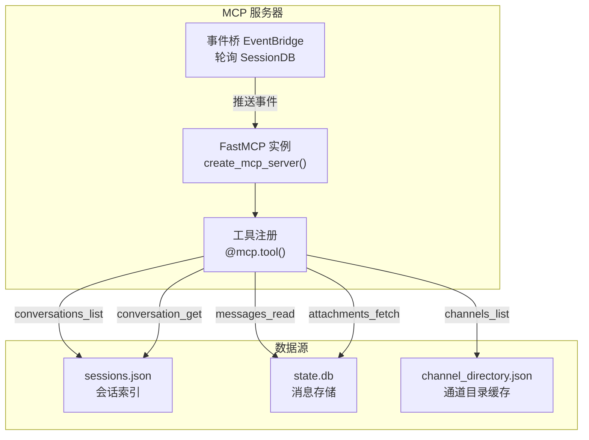
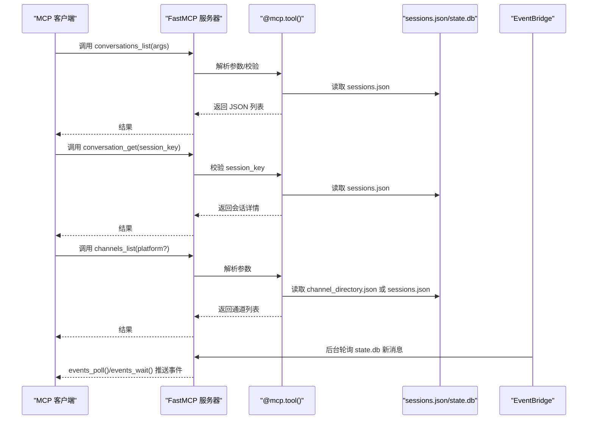
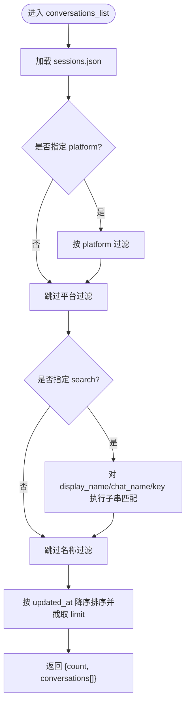
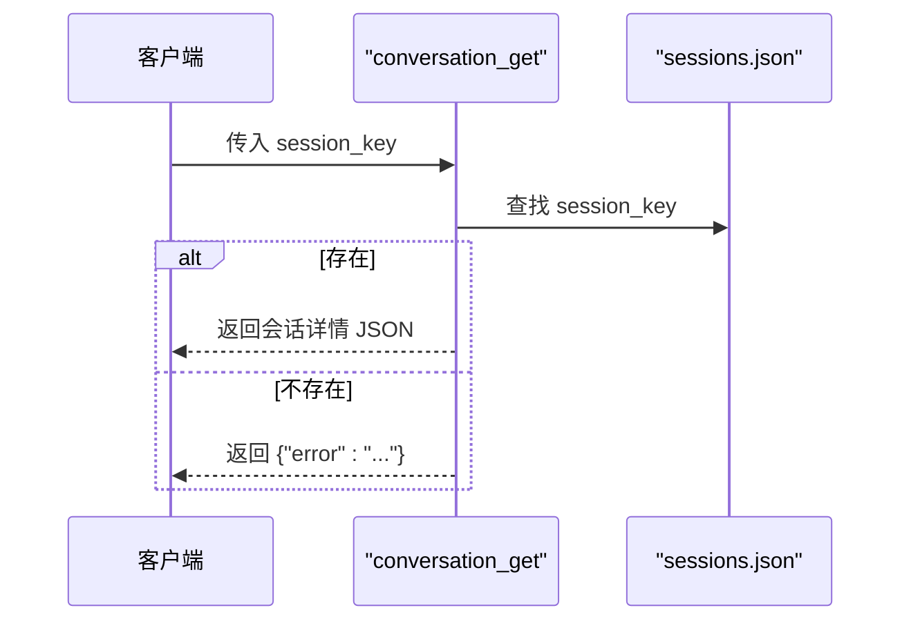
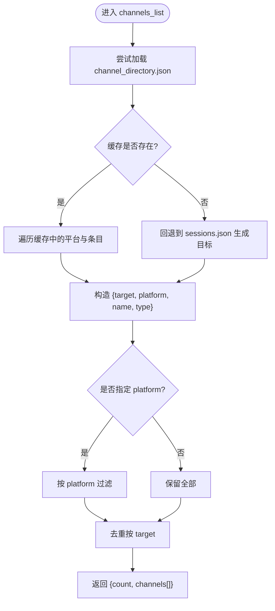
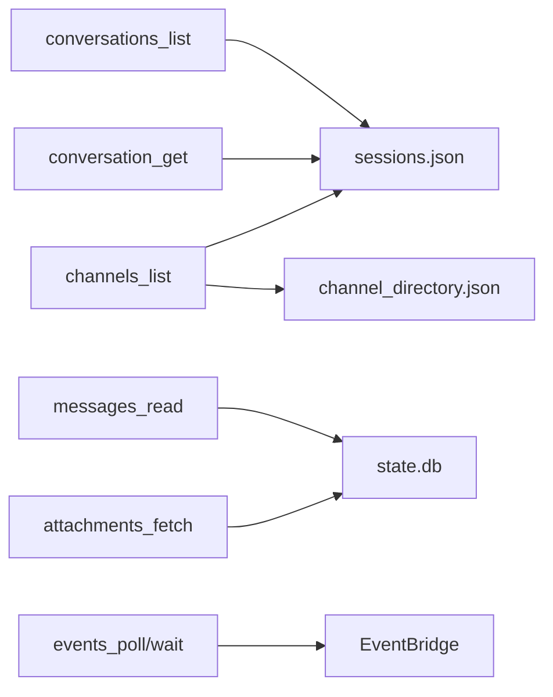

# 对话管理工具

<cite>
**本文引用的文件**
- [mcp_serve.py](file://mcp_serve.py)
- [test_mcp_serve.py](file://tests/test_mcp_serve.py)
- [mcp.md](file://website/docs/user-guide/features/mcp.md)
- [web-dashboard.md](file://website/docs/user-guide/features/web-dashboard.md)
- [mcp-config-reference.md](file://website/i18n/zh-Hans/docusaurus-plugin-content-docs/current/reference/mcp-config-reference.md)
</cite>

## 目录
1. [简介](#简介)
2. [项目结构](#项目结构)
3. [核心组件](#核心组件)
4. [架构总览](#架构总览)
5. [详细组件分析](#详细组件分析)
6. [依赖关系分析](#依赖关系分析)
7. [性能考量](#性能考量)
8. [故障排查指南](#故障排查指南)
9. [结论](#结论)
10. [附录](#附录)

## 简介
本文件为 Hermes MCP 对话管理工具的权威参考文档，聚焦三大核心工具：conversations_list、conversation_get 和 channels_list。文档覆盖参数定义、返回格式、错误处理、使用场景与最佳实践，并提供基于仓库测试用例的实际调用示例路径与流程图，帮助开发者与使用者高效集成与运维。

## 项目结构
- 核心实现位于 mcp_serve.py，提供 FastMCP 服务器与所有 MCP 工具注册逻辑。
- 测试用例 tests/test_mcp_serve.py 展示了 conversations_list、conversation_get、channels_list 的行为边界与典型调用方式。
- 文档 website/docs/user-guide/features/mcp.md 提供工具概览与运行说明。
- 文档 website/docs/user-guide/features/web-dashboard.md 描述与 MCP 相关的管理端点。
- 文档 website/i18n/zh-Hans/docusaurus-plugin-content-docs/current/reference/mcp-config-reference.md 说明 MCP 工具策略与过滤机制。

**图表来源**
- [mcp_serve.py:450-859](file://mcp_serve.py#L450-L859)

**章节来源**
- [mcp_serve.py:1-898](file://mcp_serve.py#L1-L898)
- [mcp.md:689-748](file://website/docs/user-guide/features/mcp.md#L689-L748)

## 核心组件
- conversations_list：按平台过滤与名称搜索列出活动会话，支持分页限制。
- conversation_get：根据会话键获取会话详情，含平台、聊天类型、显示名、时间戳与用量统计。
- channels_list：枚举可用消息通道与目标，支持平台过滤，返回可直接用于 messages_send 的目标字符串。

**章节来源**
- [mcp_serve.py:471-524](file://mcp_serve.py#L471-L524)
- [mcp_serve.py:528-557](file://mcp_serve.py#L528-L557)
- [mcp_serve.py:769-819](file://mcp_serve.py#L769-L819)

## 架构总览
MCP 服务器通过 FastMCP 注册工具，读取会话索引与消息数据库，维护事件队列以支持近实时事件轮询与等待。发送消息工具委托给通用发送基础设施；通道列表工具优先读取缓存目录，回退到会话索引生成目标。

**图表来源**
- [mcp_serve.py:450-859](file://mcp_serve.py#L450-L859)

## 详细组件分析

### conversations_list 工具
- 功能：列出活动会话，支持按平台过滤与名称搜索，限制返回数量。
- 参数
  - platform: 可选，按平台名称过滤（大小写不敏感）
  - limit: 可选，默认 50，最大 200
  - search: 可选，按显示名、聊天名或会话键进行模糊匹配
- 处理逻辑
  - 加载 sessions.json 会话索引
  - 根据 platform 进行平台过滤
  - 使用 search 对 display_name、chat_name、session_key 进行子串匹配
  - 按 updated_at 降序排序，截取 limit 条目
- 返回格式
  - count: 匹配条数
  - conversations: 列表，每项包含
    - session_key、session_id
    - platform、chat_type、display_name、chat_name、user_name
    - updated_at
- 典型调用示例（测试用例路径）
  - 列出全部：[tests/test_mcp_serve.py:530-536](file://tests/test_mcp_serve.py#L530-L536)
  - 按平台过滤（大小写不敏感）：[tests/test_mcp_serve.py:546-556](file://tests/test_mcp_serve.py#L546-L556)
  - 名称搜索：[tests/test_mcp_serve.py:557-567](file://tests/test_mcp_serve.py#L557-L567)
  - 限制数量：[tests/test_mcp_serve.py:568-572](file://tests/test_mcp_serve.py#L568-L572)
- 参数边界与类型转换
  - limit 字符串会被强制转换为整数并在 [1, 200] 之间钳制：[tests/test_mcp_serve.py:749-754](file://tests/test_mcp_serve.py#L749-L754)
- 错误处理
  - 无显式错误返回；当无匹配时 count 为 0
- 性能特征
  - 直接读取 sessions.json，复杂度 O(N) 遍历与筛选
  - 排序按 updated_at，N 通常较小（会话数量）

**图表来源**
- [mcp_serve.py:471-524](file://mcp_serve.py#L471-L524)

**章节来源**
- [mcp_serve.py:471-524](file://mcp_serve.py#L471-L524)
- [test_mcp_serve.py:529-572](file://tests/test_mcp_serve.py#L529-L572)
- [test_mcp_serve.py:749-754](file://tests/test_mcp_serve.py#L749-L754)

### conversation_get 工具
- 功能：根据会话键获取会话详细信息。
- 参数
  - session_key: 必填，来自 conversations_list 的会话键
- 返回格式
  - session_key、session_id、platform、chat_type、display_name、user_name、chat_name、chat_id、thread_id、updated_at、created_at、input_tokens、output_tokens、total_tokens
- 错误处理
  - 若 session_key 不存在：返回包含 error 的 JSON
- 典型调用示例（测试用例路径）
  - 获取存在会话：[tests/test_mcp_serve.py:575-583](file://tests/test_mcp_serve.py#L575-L583)
  - 获取不存在会话：[tests/test_mcp_serve.py:584-589](file://tests/test_mcp_serve.py#L584-L589)

**图表来源**
- [mcp_serve.py:528-557](file://mcp_serve.py#L528-L557)

**章节来源**
- [mcp_serve.py:528-557](file://mcp_serve.py#L528-L557)
- [test_mcp_serve.py:574-589](file://tests/test_mcp_serve.py#L574-L589)

### channels_list 工具
- 功能：列出可用消息通道与目标，支持按平台过滤。
- 参数
  - platform: 可选，按平台名称过滤（大小写不敏感）
- 返回格式
  - count: 通道数量
  - channels: 列表，每项包含
    - target: 平台标识与聊天 ID 组成的目标字符串（如 "platform:chat_id"），可用于 messages_send
    - platform: 平台名
    - name: 显示名或聊天名
    - chat_type: 聊天类型
- 数据来源
  - 优先读取 channel_directory.json 缓存
  - 若缓存不可用，则回退到 sessions.json 中的会话条目生成唯一目标集合
- 平台支持与目标格式
  - 目标字符串格式为 "platform:chat_id"，便于直接传递给 messages_send
  - 支持的平台取决于已配置的通道目录与会话索引
- 典型调用示例（测试用例路径）
  - 列出全部通道：[tests/test_mcp_serve.py:530-536](file://tests/test_mcp_serve.py#L530-L536)
  - 按平台过滤：[tests/test_mcp_serve.py:546-556](file://tests/test_mcp_serve.py#L546-L556)

**图表来源**
- [mcp_serve.py:769-819](file://mcp_serve.py#L769-L819)

**章节来源**
- [mcp_serve.py:769-819](file://mcp_serve.py#L769-L819)
- [test_mcp_serve.py:529-572](file://tests/test_mcp_serve.py#L529-L572)

## 依赖关系分析
- 工具依赖
  - conversations_list/conversation_get：依赖 sessions.json 会话索引
  - messages_read/attachments_fetch：依赖 state.db 消息存储
  - channels_list：优先依赖 channel_directory.json，回退 sessions.json
  - events_poll/events_wait：依赖 EventBridge 后台轮询线程
- 外部接口
  - 发送消息工具委托通用发送基础设施
  - 管理端点提供 MCP 服务器配置与诊断（见 web-dashboard.md）

**图表来源**
- [mcp_serve.py:471-859](file://mcp_serve.py#L471-L859)

**章节来源**
- [mcp_serve.py:471-859](file://mcp_serve.py#L471-L859)
- [web-dashboard.md:445-492](file://website/docs/user-guide/features/web-dashboard.md#L445-L492)

## 性能考量
- 会话列表与通道列表均为内存内 JSON 文件读取，复杂度近似 O(N)，N 为会话/通道数量，通常较小
- 事件轮询采用 mtime 优化与限流（约 200ms 间隔），避免空轮询开销
- limit 与搜索过滤在内存中执行，建议合理设置 limit 与使用 platform 过滤减少数据量
- 发送消息需要网关连接，读取操作无需网关运行

**章节来源**
- [mcp.md:735-740](file://website/docs/user-guide/features/mcp.md#L735-L740)

## 故障排查指南
- 会话键无效
  - 现象：conversation_get 返回 error
  - 排查：确认 session_key 来自 conversations_list 输出
  - 参考：[tests/test_mcp_serve.py:584-589](file://tests/test_mcp_serve.py#L584-L589)
- 通道目录为空
  - 现象：channels_list 返回空列表
  - 排查：检查 channel_directory.json 是否存在且有效；必要时回退到 sessions.json
  - 参考：[mcp_serve.py:769-819](file://mcp_serve.py#L769-L819)
- 参数类型异常
  - 现象：limit、cursor、timeout 等参数被强制转换
  - 排查：确保传入数值或可解析为数字的字符串；超出范围将被钳制
  - 参考：[tests/test_mcp_serve.py:749-791](file://tests/test_mcp_serve.py#L749-L791)
- MCP 服务不可用
  - 现象：启动时报缺少 mcp 包
  - 排查：安装 mcp 包后重试
  - 参考：[mcp_serve.py:866-874](file://mcp_serve.py#L866-L874)

**章节来源**
- [test_mcp_serve.py:574-589](file://tests/test_mcp_serve.py#L574-L589)
- [test_mcp_serve.py:749-791](file://tests/test_mcp_serve.py#L749-L791)
- [mcp_serve.py:866-874](file://mcp_serve.py#L866-L874)

## 结论
conversations_list、conversation_get 与 channels_list 三工具构成 Hermes MCP 对话管理的核心面，分别负责“发现—定位—路由”。通过明确的参数约束、稳定的返回格式与完善的错误处理，它们为 MCP 客户端提供了可靠的会话浏览、检索与通道选择能力。结合事件桥与发送工具，可实现从发现到交互的完整闭环。

## 附录

### API 调用示例（测试用例路径）
- 列出全部会话：[tests/test_mcp_serve.py:530-536](file://tests/test_mcp_serve.py#L530-L536)
- 按平台过滤会话：[tests/test_mcp_serve.py:546-556](file://tests/test_mcp_serve.py#L546-L556)
- 搜索会话名称：[tests/test_mcp_serve.py:557-567](file://tests/test_mcp_serve.py#L557-L567)
- 限制返回数量：[tests/test_mcp_serve.py:568-572](file://tests/test_mcp_serve.py#L568-L572)
- 获取单一会话详情：[tests/test_mcp_serve.py:575-583](file://tests/test_mcp_serve.py#L575-L583)
- 获取不存在会话详情：[tests/test_mcp_serve.py:584-589](file://tests/test_mcp_serve.py#L584-L589)
- 列出通道（含平台过滤）：[tests/test_mcp_serve.py:530-572](file://tests/test_mcp_serve.py#L530-L572)

### 工具策略与过滤（参考）
- 工具策略键 include/exclude 与资源/提示词工具开关：[mcp-config-reference.md:56-141](file://website/i18n/zh-Hans/docusaurus-plugin-content-docs/current/reference/mcp-config-reference.md#L56-L141)