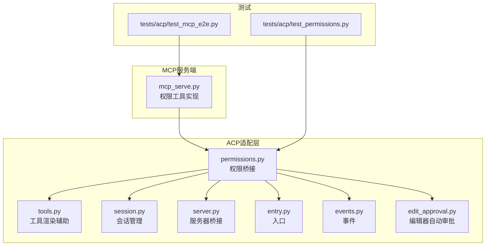
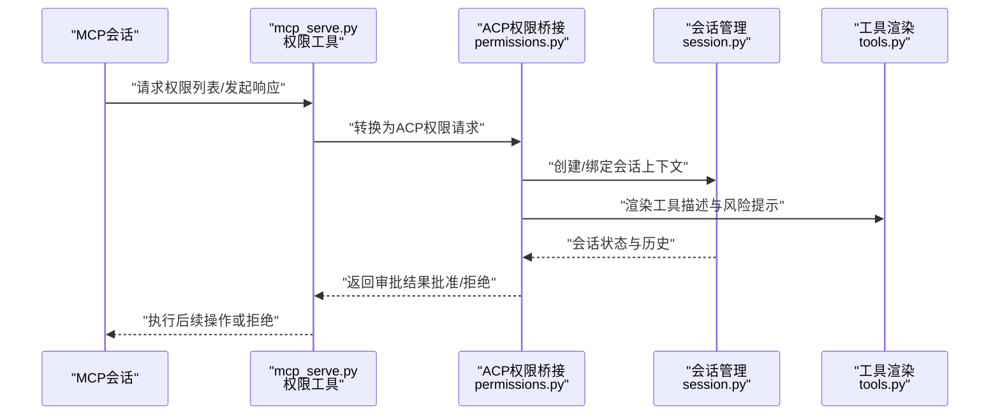
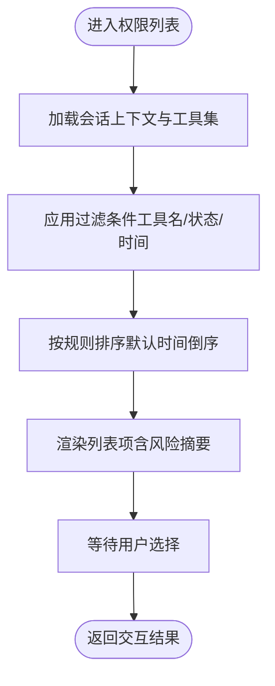
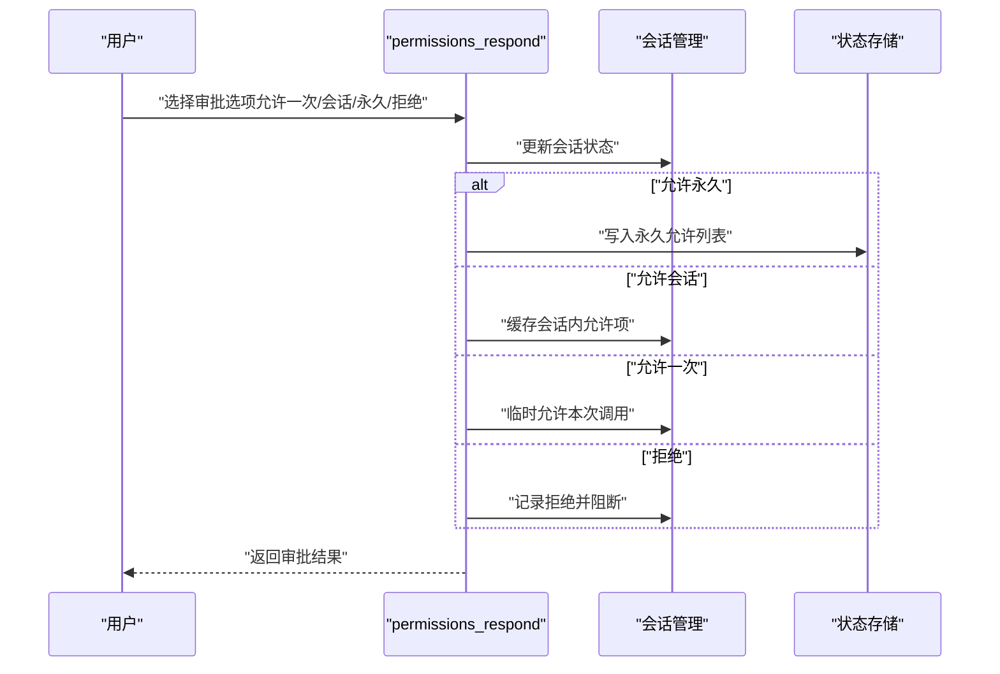
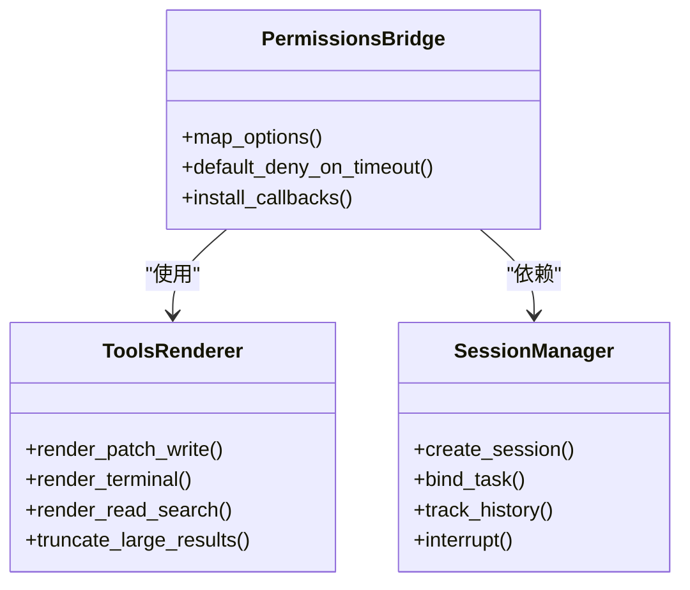
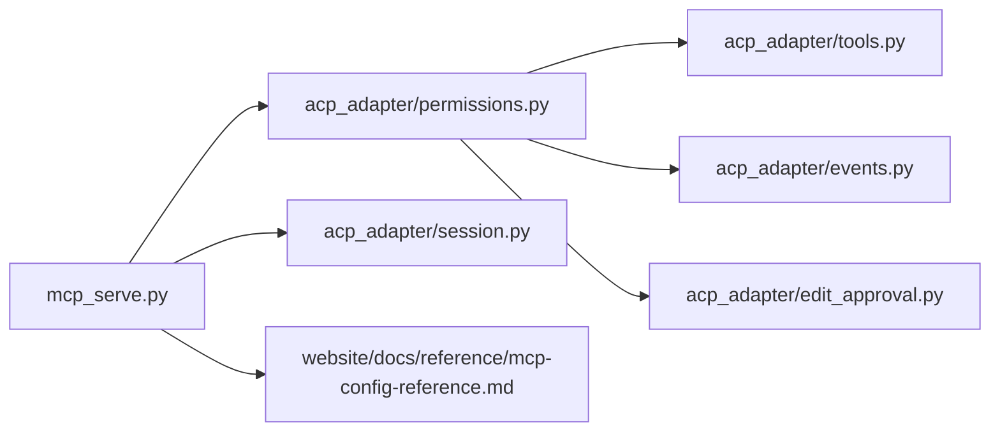

# 权限管理工具

<cite>
**本文引用的文件**
- [mcp_serve.py](file://mcp_serve.py)
- [permissions.py](file://acp_adapter/permissions.py)
- [tools.py](file://acp_adapter/tools.py)
- [session.py](file://acp_adapter/session.py)
- [server.py](file://acp_adapter/server.py)
- [entry.py](file://acp_adapter/entry.py)
- [events.py](file://acp_adapter/events.py)
- [edit_approval.py](file://acp_adapter/edit_approval.py)
- [test_permissions.py](file://tests/acp/test_permissions.py)
- [test_mcp_e2e.py](file://tests/acp/test_mcp_e2e.py)
- [acp.md](file://website/docs/user-guide/features/acp.md)
- [acp-internals.md](file://website/docs/developer-guide/acp-internals.md)
- [mcp-config-reference.md](file://website/docs/reference/mcp-config-reference.md)
- [mcp-config-reference.md（中文）](file://website/i18n/zh-Hans/docusaurus-plugin-content-docs/current/reference/mcp-config-reference.md)
</cite>

## 目录
1. [简介](#简介)
2. [项目结构](#项目结构)
3. [核心组件](#核心组件)
4. [架构总览](#架构总览)
5. [详细组件分析](#详细组件分析)
6. [依赖分析](#依赖分析)
7. [性能考量](#性能考量)
8. [故障排查指南](#故障排查指南)
9. [结论](#结论)
10. [附录](#附录)

## 简介
本文件为MCP权限管理工具的完整参考文档，聚焦于两个关键工具函数：permissions_list_open与permissions_respond。文档系统性阐述权限请求的生命周期、审批状态跟踪与权限范围定义；说明权限列表查询机制、过滤条件与排序规则；解释权限响应处理流程（批准与拒绝）；给出权限验证实现细节与安全考虑；并总结最佳实践（最小权限原则、权限审计与撤销机制），辅以实际示例与常见问题解决方案。

## 项目结构
围绕MCP权限管理的相关模块主要分布在以下位置：
- MCP服务端入口与权限工具实现：mcp_serve.py
- ACP适配层（权限桥接、工具渲染、会话管理等）：acp_adapter/
- 测试用例：tests/acp/

图表来源
- [mcp_serve.py](file://mcp_serve.py)
- [permissions.py](file://acp_adapter/permissions.py)
- [tools.py](file://acp_adapter/tools.py)
- [session.py](file://acp_adapter/session.py)
- [server.py](file://acp_adapter/server.py)
- [entry.py](file://acp_adapter/entry.py)
- [events.py](file://acp_adapter/events.py)
- [edit_approval.py](file://acp_adapter/edit_approval.py)
- [test_permissions.py](file://tests/acp/test_permissions.py)
- [test_mcp_e2e.py](file://tests/acp/test_mcp_e2e.py)

章节来源
- [mcp_serve.py](file://mcp_serve.py)
- [permissions.py](file://acp_adapter/permissions.py)
- [tools.py](file://acp_adapter/tools.py)
- [session.py](file://acp_adapter/session.py)
- [server.py](file://acp_adapter/server.py)
- [entry.py](file://acp_adapter/entry.py)
- [events.py](file://acp_adapter/events.py)
- [edit_approval.py](file://acp_adapter/edit_approval.py)
- [test_permissions.py](file://tests/acp/test_permissions.py)
- [test_mcp_e2e.py](file://tests/acp/test_mcp_e2e.py)

## 核心组件
- permissions_list_open：用于打开并展示待审批的权限请求列表，支持过滤与排序，返回可交互的权限清单。
- permissions_respond：用于对单个或批量权限请求进行响应（批准/拒绝），并记录审批状态与范围。

这两个工具共同构成MCP权限管理的“查询—响应”闭环，贯穿权限生命周期的各个阶段。

章节来源
- [mcp_serve.py](file://mcp_serve.py)

## 架构总览
下图展示了从MCP会话到ACP适配层再到权限工具的整体交互：

图表来源
- [mcp_serve.py](file://mcp_serve.py)
- [permissions.py](file://acp_adapter/permissions.py)
- [session.py](file://acp_adapter/session.py)
- [tools.py](file://acp_adapter/tools.py)

## 详细组件分析

### permissions_list_open 组件分析
- 功能定位：打开权限请求列表，提供可交互的查询界面，支持按工具名、状态、时间等维度过滤与排序。
- 查询机制：
  - 列表查询：基于会话上下文与工具集，筛选出需要用户确认的权限请求。
  - 过滤条件：支持按工具名称白/黑名单、状态（待审/已审）、时间窗口等条件过滤。
  - 排序规则：默认按请求时间倒序，亦可按工具类别、风险等级排序。
- 生命周期集成：与会话状态绑定，确保同一会话内的权限请求可见性与一致性。
- 安全考虑：仅展示必要的工具描述与风险摘要，避免泄露敏感参数。

图表来源
- [mcp_serve.py](file://mcp_serve.py)
- [permissions.py](file://acp_adapter/permissions.py)
- [session.py](file://acp_adapter/session.py)

章节来源
- [mcp_serve.py](file://mcp_serve.py)
- [permissions.py](file://acp_adapter/permissions.py)
- [session.py](file://acp_adapter/session.py)

### permissions_respond 组件分析
- 功能定位：对权限请求进行响应，支持“允许一次/允许本次会话/允许永久/拒绝”等多级策略。
- 审批状态跟踪：
  - 允许一次：仅对当前工具调用有效，不持久化。
  - 允许本次会话：在当前ACP会话内生效，会话结束失效。
  - 允许永久：写入永久允许列表，跨会话生效。
  - 拒绝：当前请求与同类型请求均被拒绝。
- 权限范围定义：
  - 工具级：精确到具体工具名称。
  - 参数级：可限定工具参数子集（如文件路径前缀、命令模式等）。
  - 时间级：可设定有效期或会话范围。
- 安全考虑：超时与桥接失败默认拒绝；拒绝后阻断潜在高危操作链路。

图表来源
- [mcp_serve.py](file://mcp_serve.py)
- [permissions.py](file://acp_adapter/permissions.py)
- [session.py](file://acp_adapter/session.py)

章节来源
- [mcp_serve.py](file://mcp_serve.py)
- [permissions.py](file://acp_adapter/permissions.py)
- [session.py](file://acp_adapter/session.py)
- [acp.md](file://website/docs/user-guide/features/acp.md)

### ACP权限桥接与工具渲染
- 权限桥接：将内部审批语义映射到ACP选项（允许一次/允许会话/允许永久/拒绝），并处理超时与桥接失败默认拒绝。
- 工具渲染：将Hermes工具映射到ACP工具类型，生成面向编辑器的安全内容（如文件diff、命令文本、文本预览等），并对大结果进行截断。
- 会话生命周期：包含会话创建、任务绑定、回调安装、AI代理运行、历史更新与最终消息块发出等步骤。

图表来源
- [permissions.py](file://acp_adapter/permissions.py)
- [tools.py](file://acp_adapter/tools.py)
- [session.py](file://acp_adapter/session.py)
- [acp-internals.md](file://website/docs/developer-guide/acp-internals.md)

章节来源
- [permissions.py](file://acp_adapter/permissions.py)
- [tools.py](file://acp_adapter/tools.py)
- [session.py](file://acp_adapter/session.py)
- [acp-internals.md](file://website/docs/developer-guide/acp-internals.md)

### MCP配置与工具策略
- 工具策略键：
  - include：白名单，仅注册列出的服务器原生MCP工具。
  - exclude：黑名单，排除列出的工具。
  - resources：启用/禁用 list_resources 与 read_resource。
  - prompts：启用/禁用 list_prompts 与 get_prompt。
- 过滤语义与优先级：当同时设置 include 与 exclude 时，include 优先。
- 能力感知注册：仅在MCP会话实际暴露对应能力时才注册相应工具。

章节来源
- [mcp-config-reference.md](file://website/docs/reference/mcp-config-reference.md)
- [mcp-config-reference.md（中文）](file://website/i18n/zh-Hans/docusaurus-plugin-content-docs/current/reference/mcp-config-reference.md)

## 依赖分析
- 组件耦合：
  - permissions_list_open 与 permissions_respond 依赖 ACP权限桥接与会话管理。
  - 权限桥接依赖工具渲染与会话状态存储。
  - MCP配置策略影响工具注册与权限范围。
- 外部依赖：
  - ACP适配层依赖事件系统与编辑器交互接口。
  - 测试覆盖了权限工具的端到端行为与边界场景。

图表来源
- [mcp_serve.py](file://mcp_serve.py)
- [permissions.py](file://acp_adapter/permissions.py)
- [session.py](file://acp_adapter/session.py)
- [tools.py](file://acp_adapter/tools.py)
- [events.py](file://acp_adapter/events.py)
- [edit_approval.py](file://acp_adapter/edit_approval.py)
- [mcp-config-reference.md](file://website/docs/reference/mcp-config-reference.md)

章节来源
- [mcp_serve.py](file://mcp_serve.py)
- [permissions.py](file://acp_adapter/permissions.py)
- [session.py](file://acp_adapter/session.py)
- [tools.py](file://acp_adapter/tools.py)
- [events.py](file://acp_adapter/events.py)
- [edit_approval.py](file://acp_adapter/edit_approval.py)
- [mcp-config-reference.md](file://website/docs/reference/mcp-config-reference.md)

## 性能考量
- 列表查询优化：在权限列表查询时，建议使用索引字段（如工具名、状态、时间）进行过滤，减少全量扫描。
- 渲染截断：对大结果进行截断与分页，避免UI卡顿与内存压力。
- 会话缓存：允许会话级别的权限缓存可减少重复审批开销，但需注意会话结束后的清理。
- 超时控制：合理设置审批超时，避免长时间阻塞会话。

## 故障排查指南
- 审批无响应或超时：
  - 检查ACP桥接是否正确安装回调与事件监听。
  - 确认会话状态未被意外中断或重置。
- 权限未生效：
  - 核对工具策略配置（include/exclude/resources/prompts）与能力感知注册。
  - 验证“允许永久”是否正确写入允许列表，“允许会话”是否在当前会话范围内。
- 列表为空或异常：
  - 确认过滤条件是否过于严格，或工具集是否正确注册。
  - 检查测试用例中的边界场景（如空会话、大量请求、并发响应）。

章节来源
- [test_permissions.py](file://tests/acp/test_permissions.py)
- [test_mcp_e2e.py](file://tests/acp/test_mcp_e2e.py)
- [acp.md](file://website/docs/user-guide/features/acp.md)

## 结论
MCP权限管理工具通过permissions_list_open与permissions_respond实现了从“查询—响应”的闭环，结合ACP权限桥接与会话管理，提供了细粒度的权限范围控制与多层次的审批策略。配合MCP配置策略与工具渲染辅助，既能满足安全要求，又能提升用户体验。建议在生产环境中遵循最小权限原则、强化审计与撤销机制，并通过测试用例持续验证权限行为的正确性与鲁棒性。

## 附录

### 最佳实践
- 最小权限原则：默认拒绝，仅在必要时授予“允许一次/会话”，谨慎授予“允许永久”。
- 权限审计：记录每次审批的时间、主体、工具、参数与决策结果，定期复核。
- 撤销机制：提供一键撤销“允许永久”与批量清理“允许会话”的能力。
- 配置治理：统一维护include/exclude/resources/prompts策略，避免过度放权。

### 实际示例
- 示例一：为新工具添加白名单并限制参数范围（如仅允许特定目录下的文件操作）。
- 示例二：对高危工具（如终端命令）采用“允许一次”策略，并在成功后评估是否升级为“允许会话”。

### 常见问题
- 问：为什么某些工具没有出现在权限列表中？
  - 答：可能未启用对应能力（resources/prompts），或工具不在include列表中。
- 问：如何撤销已授予的“允许永久”？
  - 答：通过配置管理或工具提供的撤销功能移除允许条目。
- 问：会话结束后“允许会话”还有效吗？
  - 答：不会，会话结束后自动清理。