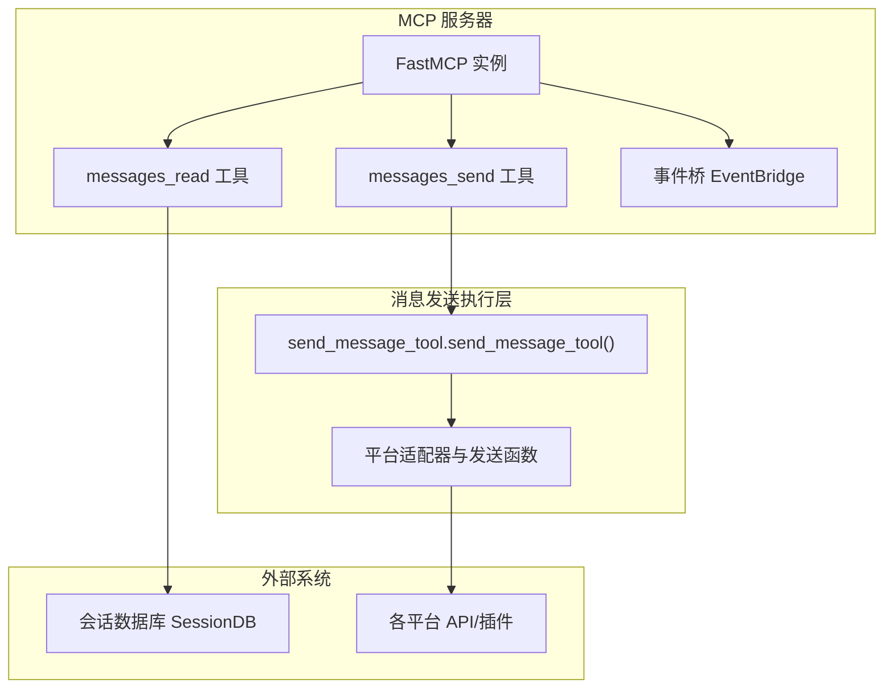
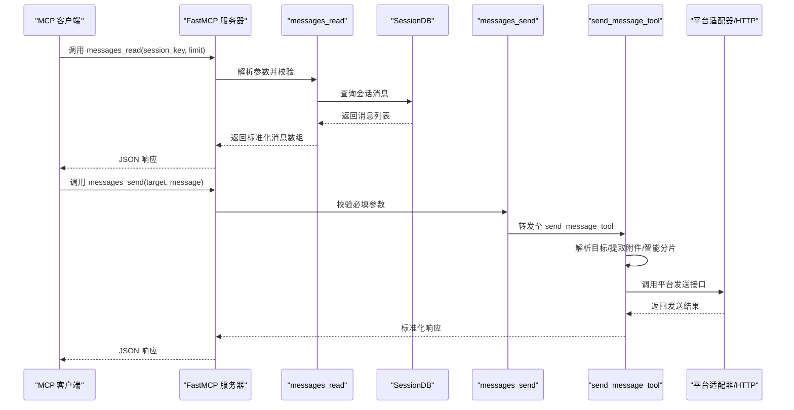
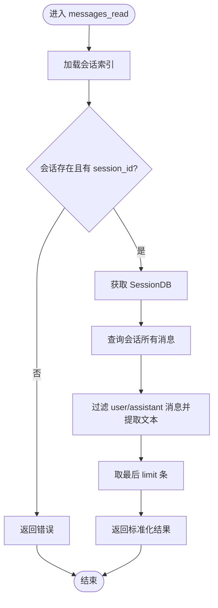
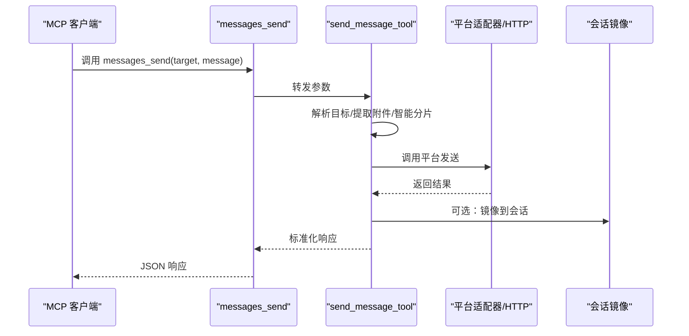
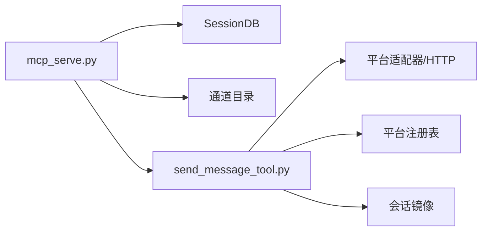

# 消息处理工具

<cite>
**本文档引用的文件**
- [mcp_serve.py](file://mcp_serve.py)
- [send_message_tool.py](file://tools/send_message_tool.py)
- [mcp.md](file://website/docs/user-guide/features/mcp.md)
- [test_mcp_tool.py](file://tests/tools/test_mcp_tool.py)
- [test_send_cmd.py](file://tests/hermes_cli/test_send_cmd.py)
</cite>

## 目录
1. [简介](#简介)
2. [项目结构](#项目结构)
3. [核心组件](#核心组件)
4. [架构总览](#架构总览)
5. [详细组件分析](#详细组件分析)
6. [依赖关系分析](#依赖关系分析)
7. [性能考量](#性能考量)
8. [故障排查指南](#故障排查指南)
9. [结论](#结论)
10. [附录](#附录)

## 简介
本文件为 Hermes MCP 消息处理工具的完整参考文档，重点覆盖以下两个工具：
- messages_read：用于从指定会话中读取最近的历史消息，支持分页与游标机制
- messages_send：用于向任意平台目标发送消息，支持富文本、附件上传与响应处理

文档将从系统架构、数据流、处理逻辑、错误处理、性能特征等多个维度进行深入解析，并提供丰富的使用示例与最佳实践。

## 项目结构
消息处理工具位于 MCP 服务器中，通过 FastMCP 注册为标准工具。核心实现分为两部分：
- MCP 服务器端工具注册与调用桥接：在 mcp_serve.py 中定义
- 实际消息发送执行逻辑：在 tools/send_message_tool.py 中实现

图表来源
- [mcp_serve.py:450-859](file://mcp_serve.py#L450-L859)
- [send_message_tool.py:158-824](file://tools/send_message_tool.py#L158-L824)

章节来源
- [mcp_serve.py:450-859](file://mcp_serve.py#L450-L859)

## 核心组件
- messages_read 工具
  - 参数：session_key（必填）、limit（可选，默认50，最大200）
  - 功能：按时间顺序返回指定会话中的用户/助手消息，过滤空内容并截断文本长度
  - 分页：通过 limit 控制返回数量；历史消息来自会话数据库
- messages_send 工具
  - 参数：target（平台标识符）、message（消息正文）
  - 功能：解析目标标识符，解析并提取附件，路由到对应平台适配器，自动分片发送
  - 平台支持：Telegram、Discord、Slack、Signal、Matrix、Weixin、WeCom、DingTalk、BlueBubbles、SMS/Twilio、Email、Ntfy、Yuanbao 等
  - 附件：通过 MEDIA: 路径标签或直接传入媒体文件，按平台能力进行原生上传

章节来源
- [mcp_serve.py:561-614](file://mcp_serve.py#L561-L614)
- [mcp_serve.py:733-765](file://mcp_serve.py#L733-L765)
- [send_message_tool.py:126-155](file://tools/send_message_tool.py#L126-L155)

## 架构总览
MCP 服务器通过 FastMCP 暴露工具接口，messages_read 直接查询会话数据库，messages_send 将请求委派给 send_message_tool，后者根据目标平台选择对应的适配器或 HTTP 接口完成发送。

图表来源
- [mcp_serve.py:561-614](file://mcp_serve.py#L561-L614)
- [mcp_serve.py:733-765](file://mcp_serve.py#L733-L765)
- [send_message_tool.py:158-824](file://tools/send_message_tool.py#L158-L824)

## 详细组件分析

### messages_read 组件分析
- 输入参数
  - session_key：会话键，来源于 conversations_list 的输出
  - limit：返回消息条数上限，默认50，最大200
- 处理流程
  - 加载会话索引，校验会话存在性与 session_id
  - 获取 SessionDB 实例并查询该会话的所有消息
  - 过滤角色为 user/assistant 的消息，提取文本内容，截断至2000字符
  - 取最新 limit 条消息，返回 count、total_in_session 与消息数组
- 错误处理
  - 会话不存在、无 session_id、数据库不可用时返回错误对象
- 性能特征
  - 直接读取本地会话数据库，避免网络往返
  - 文本截断与过滤在内存中完成，复杂度 O(n)

图表来源
- [mcp_serve.py:561-614](file://mcp_serve.py#L561-L614)

章节来源
- [mcp_serve.py:561-614](file://mcp_serve.py#L561-L614)

### messages_send 组件分析
- 输入参数
  - target：平台标识符，格式为 "platform:identifier"
  - message：要发送的消息正文
- 处理流程
  - 参数校验：target 与 message 必填
  - 调用 send_message_tool，内部解析目标、解析 MEDIA 附件、智能分片、路由到平台适配器
  - 对于 Telegram、Discord、Matrix、Signal、Weixin、Yuanbao、Feishu 等平台，支持原生媒体上传
  - 对于 Slack、SMS、Email、Matrix 等平台，分别应用各自格式化与发送逻辑
  - 支持镜像回写到会话，便于后续 events_poll/events_wait 检测
- 响应格式
  - 成功：包含 success、platform、chat_id、message_id（或 event_id）等字段
  - 失败：包含 error 字段，敏感信息会被脱敏
  - 警告：当某些媒体未被发送或存在速率限制时，返回 warnings 列表
- 平台标识符语法
  - 通用格式：platform:identifier
  - 特定平台示例：
    - Telegram: telegram:chat_id 或 telegram:chat_id:topic_id
    - Discord: discord:channel_id 或 discord:thread_id
    - Slack: slack:channel_id 或 slack:user_id（需先 conversations.open 获取 D...）
    - Signal: signal:+1234567890
    - Matrix: matrix:room_id 或 matrix:@user:server.org
    - Email: email:recipient@example.com
    - SMS: sms:+1234567890
    - Weixin: weixin:chat_id
    - WeCom: wecom:chat_id
    - DingTalk: dingtalk:webhook_url 或 dingtalk:chat_id
    - BlueBubbles: bluebubbles:chat_id
    - Ntfy: ntfy:topic
    - Yuanbao: yuanbao:direct:account_id 或 yuanbao:group:group_code
- 附件上传支持
  - 支持 MEDIA: 路径标签与直接传入媒体文件
  - 平台支持情况：
    - 原生支持：Telegram、Discord、Matrix、Signal、Weixin、Yuanbao、Feishu
    - 其他平台仅文本发送，会附加警告
- 字符限制与特殊字符处理
  - 平台字符限制：内置平台采用适配器的最大长度常量，插件平台从注册表读取
  - Telegram 使用 UTF-16 长度计算，自动分片并保留代码块边界
  - Slack 应用 mrkdwn 格式化
  - SMS 移除 Markdown 标记
  - Email/SMS/Matrix 等平台对特殊字符进行兼容处理
- 错误响应码与错误类型
  - 通用错误：参数缺失、平台未配置、发送失败、速率限制、网络异常
  - 平台特定错误：API 返回的 error 字段，统一脱敏后返回
  - 重试策略：Telegram 对限流与临时错误进行指数退避重试

图表来源
- [mcp_serve.py:733-765](file://mcp_serve.py#L733-L765)
- [send_message_tool.py:158-824](file://tools/send_message_tool.py#L158-L824)

章节来源
- [mcp_serve.py:733-765](file://mcp_serve.py#L733-L765)
- [send_message_tool.py:126-155](file://tools/send_message_tool.py#L126-L155)
- [send_message_tool.py:583-824](file://tools/send_message_tool.py#L583-L824)

## 依赖关系分析
- MCP 服务器依赖
  - FastMCP：注册与运行工具
  - SessionDB：读取历史消息
  - 通道目录：解析人类可读频道名
- 发送工具依赖
  - 各平台适配器：Telegram、Discord、Slack、Signal、Matrix、Weixin、WeCom、DingTalk、BlueBubbles、Ntfy、Yuanbao 等
  - 插件注册表：动态平台扩展
  - 会话镜像：将发送结果回写到会话数据库，供事件桥检测

图表来源
- [mcp_serve.py:450-859](file://mcp_serve.py#L450-L859)
- [send_message_tool.py:158-824](file://tools/send_message_tool.py#L158-L824)

章节来源
- [mcp_serve.py:450-859](file://mcp_serve.py#L450-L859)
- [send_message_tool.py:158-824](file://tools/send_message_tool.py#L158-L824)

## 性能考量
- 读取性能
  - messages_read 直接查询本地会话数据库，延迟低；建议合理设置 limit，避免一次性拉取过多历史
- 发送性能
  - 智能分片：针对 Telegram 等平台按长度自动分片，保留代码块边界与序号提示
  - 速率控制：Signal 使用进程级调度器进行批处理与限速协调
  - 重试策略：Telegram 对限流与临时错误进行指数退避
- 资源占用
  - 附件上传：按平台原生上传，减少中间转换开销
  - 代理与网络：部分平台支持代理，避免区域封锁导致的超时

## 故障排查指南
- 常见错误与诊断
  - 会话不存在：检查 session_key 是否来自 conversations_list
  - 数据库不可用：确认会话数据库文件存在且可访问
  - 平台未配置：检查 ~/.hermes/config.yaml 或环境变量是否正确设置
  - 速率限制：观察 warnings 中的限速提示，适当降低发送频率
  - 附件缺失：确认 MEDIA 路径存在或媒体文件可读
- 测试与验证
  - 单元测试覆盖了中断、错误返回、重复发送跳过等场景
  - CLI 测试验证了参数解析、stdin 读取、错误输出等行为

章节来源
- [test_mcp_tool.py:550-571](file://tests/tools/test_mcp_tool.py#L550-L571)
- [test_send_cmd.py:47-223](file://tests/hermes_cli/test_send_cmd.py#L47-L223)

## 结论
messages_read 与 messages_send 作为 MCP 消息桥的核心工具，提供了稳定的历史读取与跨平台发送能力。前者通过本地数据库快速检索历史消息，后者通过统一的工具接口与平台适配器实现多平台原生发送与附件上传。配合事件桥与会话镜像，可实现近实时的消息感知与回写，满足自动化与集成场景的需求。

## 附录

### 使用示例（基于工具行为与参数）
- 读取消息历史
  - 步骤：先调用 conversations_list 获取 session_key，再调用 messages_read 指定 session_key 与 limit
  - 注意：limit 最大200，超出将被截断
- 发送纯文本消息
  - 目标：telegram:+1234567890
  - 内容：Hello World
- 发送富文本消息
  - 目标：slack:#general
  - 内容：支持 Markdown 格式（如加粗、标题、链接等）
- 发送多媒体消息
  - 目标：telegram:1234567890
  - 内容：包含 MEDIA:/path/to/image.jpg 的消息
  - 行为：Telegram 将原生上传图片，其他平台会附加警告并仅发送文本
- 发送带主题的 Telegram 群组消息
  - 目标：telegram:1234567890:17585
  - 行为：通过 topic_id 发送到指定子话题
- 发送 Signal 群组消息（含附件）
  - 目标：signal:group:abc123==
  - 内容：包含 MEDIA: 的消息
  - 行为：按批处理与速率限制发送，必要时插入内联提示

章节来源
- [mcp_serve.py:561-614](file://mcp_serve.py#L561-L614)
- [mcp_serve.py:733-765](file://mcp_serve.py#L733-L765)
- [mcp.md:691-727](file://website/docs/user-guide/features/mcp.md#L691-L727)