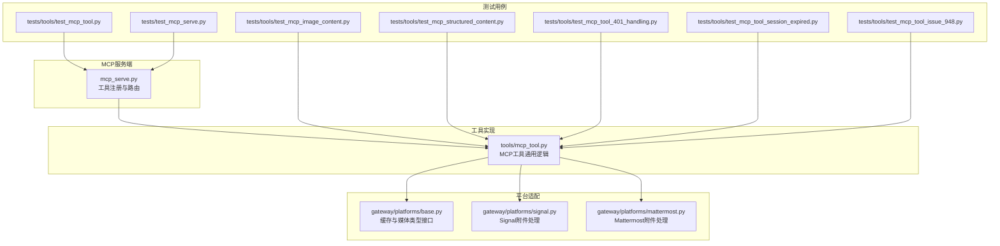
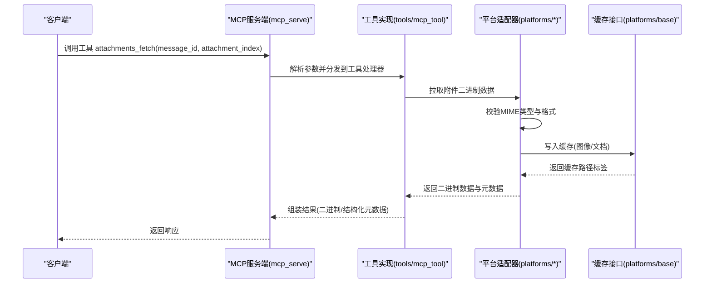
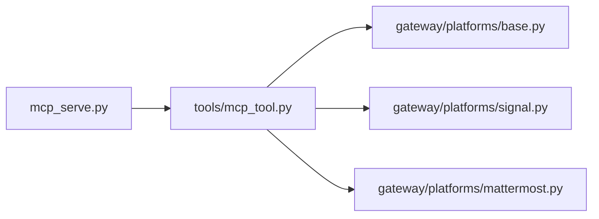

# 附件处理工具

<cite>
**本文引用的文件**
- [mcp_serve.py](file://mcp_serve.py)
- [mcp_tool.py](file://tools/mcp_tool.py)
- [test_mcp_tool.py](file://tests/tools/test_mcp_tool.py)
- [test_mcp_image_content.py](file://tests/tools/test_mcp_image_content.py)
- [test_mcp_structured_content.py](file://tests/tools/test_mcp_structured_content.py)
- [test_mcp_tool_401_handling.py](file://tests/tools/test_mcp_tool_401_handling.py)
- [test_mcp_tool_session_expired.py](file://tests/tools/test_mcp_tool_session_expired.py)
- [test_mcp_tool_issue_948.py](file://tests/tools/test_mcp_tool_issue_948.py)
- [test_mcp_serve.py](file://tests/test_mcp_serve.py)
- [mcp.md](file://website/docs/user-guide/features/mcp.md)
- [mcp_zh.md](file://website/i18n/zh-Hans/docusaurus-plugin-content-docs/current/user-guide/features/mcp.md)
- [platforms/base.py](file://gateway/platforms/base.py)
- [signal.py](file://gateway/platforms/signal.py)
- [mattermost.py](file://gateway/platforms/mattermost.py)
- [discord_document_handling.py](file://tests/gateway/test_discord_document_handling.py)
</cite>

## 目录
1. [简介](#简介)
2. [项目结构](#项目结构)
3. [核心组件](#核心组件)
4. [架构总览](#架构总览)
5. [详细组件分析](#详细组件分析)
6. [依赖关系分析](#依赖关系分析)
7. [性能考量](#性能考量)
8. [故障排查指南](#故障排查指南)
9. [结论](#结论)
10. [附录](#附录)

## 简介
本文件为MCP附件处理工具的专用参考文档，聚焦于attachments_fetch工具的完整能力与使用规范。文档覆盖以下主题：
- 工具参数与调用流程：message_id、attachment_index等关键参数的作用范围与约束
- 返回数据格式：二进制数据的承载方式、结构化元数据的组织形式
- 支持的媒体类型与格式转换规则：图像、文档、音视频等类型的识别与处理
- 文件大小限制与安全机制：下载前校验、格式嗅探、缓存策略与访问控制
- 下载链接生成与跨平台差异：不同平台对附件的处理差异与兼容性说明
- 错误处理场景：附件不存在、格式不支持、权限不足、会话过期等异常路径
- 实际调用示例与响应解析方法：基于测试用例与源码行为的实践指导

## 项目结构
围绕MCP附件处理工具的相关代码主要分布在以下模块：
- MCP服务端入口与工具注册：mcp_serve.py
- MCP工具通用实现与会话管理：tools/mcp_tool.py
- 平台侧附件适配器与缓存接口：gateway/platforms/base.py、gateway/platforms/signal.py、gateway/platforms/mattermost.py
- 针对附件处理的测试用例：tests/tools/test_mcp_tool.py、tests/tools/test_mcp_image_content.py、tests/tools/test_mcp_structured_content.py、tests/tools/test_mcp_tool_401_handling.py、tests/tools/test_mcp_tool_session_expired.py、tests/tools/test_mcp_tool_issue_948.py、tests/test_mcp_serve.py
- 文档与国际化文档：website/docs/user-guide/features/mcp.md、website/i18n/zh-Hans/docusaurus-plugin-content-docs/current/user-guide/features/mcp.md

**图表来源**
- [mcp_serve.py](file://mcp_serve.py)
- [mcp_tool.py](file://tools/mcp_tool.py)
- [platforms/base.py](file://gateway/platforms/base.py)
- [signal.py](file://gateway/platforms/signal.py)
- [mattermost.py](file://gateway/platforms/mattermost.py)
- [test_mcp_tool.py](file://tests/tools/test_mcp_tool.py)
- [test_mcp_image_content.py](file://tests/tools/test_mcp_image_content.py)
- [test_mcp_structured_content.py](file://tests/tools/test_mcp_structured_content.py)
- [test_mcp_tool_401_handling.py](file://tests/tools/test_mcp_tool_401_handling.py)
- [test_mcp_tool_session_expired.py](file://tests/tools/test_mcp_tool_session_expired.py)
- [test_mcp_tool_issue_948.py](file://tests/tools/test_mcp_tool_issue_948.py)
- [test_mcp_serve.py](file://tests/test_mcp_serve.py)

**章节来源**
- [mcp_serve.py](file://mcp_serve.py)
- [mcp_tool.py](file://tools/mcp_tool.py)
- [platforms/base.py](file://gateway/platforms/base.py)
- [signal.py](file://gateway/platforms/signal.py)
- [mattermost.py](file://gateway/platforms/mattermost.py)
- [test_mcp_tool.py](file://tests/tools/test_mcp_tool.py)
- [test_mcp_image_content.py](file://tests/tools/test_mcp_image_content.py)
- [test_mcp_structured_content.py](file://tests/tools/test_mcp_structured_content.py)
- [test_mcp_tool_401_handling.py](file://tests/tools/test_mcp_tool_401_handling.py)
- [test_mcp_tool_session_expired.py](file://tests/tools/test_mcp_tool_session_expired.py)
- [test_mcp_tool_issue_948.py](file://tests/tools/test_mcp_tool_issue_948.py)
- [test_mcp_serve.py](file://tests/test_mcp_serve.py)

## 核心组件
- attachments_fetch工具：从指定消息中提取非文本附件（图片、媒体等），返回二进制数据与结构化元数据
- 工具参数
  - message_id：目标消息的唯一标识符，用于定位附件所在的消息上下文
  - attachment_index：附件在消息中的索引位置，从0开始计数
- 返回数据格式
  - 二进制数据：以字节流形式返回，通常配合媒体类型或文件扩展名进行识别
  - 结构化元数据：包含文件名、文件路径、文件类型等信息；当存在结构化内容时优先使用，否则回退到文本结果
- 媒体类型与格式转换
  - 图像：根据MIME类型识别，支持JPEG/JPG、PNG等；未知或异常类型默认按PNG处理
  - 文档：根据MIME类型识别，如application/pdf等
  - 音频/视频：根据MIME类型识别，如audio/*、video/*
- 缓存策略
  - 图像与文档通过平台提供的缓存函数写入本地缓存目录，返回“MEDIA:”前缀的路径标签
  - 非图像/非文档类型不触发缓存
- 安全机制
  - 格式嗅探：对解码后的字节进行格式验证，若不符合预期则丢弃并记录日志
  - 权限与会话：对未连接、401未授权、会话过期等场景进行明确的错误提示
- 下载链接生成
  - 通过平台适配器拉取附件二进制数据，并结合缓存接口生成可访问的本地路径标签

**章节来源**
- [mcp_serve.py](file://mcp_serve.py)
- [mcp_tool.py](file://tools/mcp_tool.py)
- [test_mcp_image_content.py](file://tests/tools/test_mcp_image_content.py)
- [test_mcp_structured_content.py](file://tests/tools/test_mcp_structured_content.py)
- [test_mcp_tool_401_handling.py](file://tests/tools/test_mcp_tool_401_handling.py)
- [test_mcp_tool_session_expired.py](file://tests/tools/test_mcp_tool_session_expired.py)
- [test_mcp_tool_issue_948.py](file://tests/tools/test_mcp_tool_issue_948.py)

## 架构总览
下图展示了attachments_fetch工具在系统中的调用链路与数据流转：

**图表来源**
- [mcp_serve.py](file://mcp_serve.py)
- [mcp_tool.py](file://tools/mcp_tool.py)
- [platforms/base.py](file://gateway/platforms/base.py)
- [signal.py](file://gateway/platforms/signal.py)
- [mattermost.py](file://gateway/platforms/mattermost.py)

## 详细组件分析

### attachments_fetch工具参数与返回格式
- 参数
  - message_id：消息唯一标识，用于定位附件所在的消息
  - attachment_index：附件在消息中的索引，从0开始
- 返回
  - 二进制数据：字节流，需结合媒体类型或扩展名识别
  - 结构化元数据：包含fileName、filePath、fileType等字段；当存在结构化内容时优先使用，否则回退到文本结果
- 行为依据
  - 工具注册与路由由mcp_serve.py负责
  - 结构化内容与回退逻辑在测试中得到验证

**章节来源**
- [mcp_serve.py](file://mcp_serve.py)
- [test_mcp_structured_content.py](file://tests/tools/test_mcp_structured_content.py)

### 媒体类型识别与格式转换
- 图像类型
  - JPEG/JPG统一映射为.jpg扩展名
  - PNG等其他图像类型按标准扩展名处理
  - 未知或异常类型默认按PNG处理
- 文档类型
  - PDF等文档类型保持完整MIME类型
- 音频/视频类型
  - 保留完整MIME类型前缀，如audio/*、video/*

**章节来源**
- [test_mcp_image_content.py](file://tests/tools/test_mcp_image_content.py)

### 缓存策略与下载链接生成
- 缓存接口
  - 图像：通过平台缓存函数将字节写入本地缓存目录，返回“MEDIA:”前缀路径
  - 文档：通过平台缓存函数将字节写入本地缓存目录，返回“MEDIA:”前缀路径
  - 非图像/非文档类型不触发缓存
- 下载链接生成
  - 通过平台适配器拉取附件二进制数据后，结合缓存接口生成可访问的本地路径标签
  - 测试验证了缓存路径位于图像缓存目录且内容一致

**章节来源**
- [platforms/base.py](file://gateway/platforms/base.py)
- [test_mcp_image_content.py](file://tests/tools/test_mcp_image_content.py)

### 安全机制与格式校验
- 格式嗅探
  - 对解码后的字节进行格式验证，若不符合预期则丢弃并记录日志，避免错误内容传播
- 权限与会话
  - 未连接、401未授权、会话过期等场景返回明确错误信息，便于上层处理
- 异常容错
  - 对于非图像/非文档类型或空数据块，返回空字符串，避免崩溃

**章节来源**
- [test_mcp_image_content.py](file://tests/tools/test_mcp_image_content.py)
- [test_mcp_tool_401_handling.py](file://tests/tools/test_mcp_tool_401_handling.py)
- [test_mcp_tool_session_expired.py](file://tests/tools/test_mcp_tool_session_expired.py)
- [test_mcp_tool_issue_948.py](file://tests/tools/test_mcp_tool_issue_948.py)

### 不同平台的处理差异与兼容性
- Signal
  - 附件拉取返回Base64编码数据，经缓存后返回本地路径
  - 测试覆盖了空响应与字典响应的处理
- Mattermost
  - 附件文件信息包含完整MIME类型，如image/png、application/pdf
  - 通过HTTP请求获取二进制数据并进行缓存
- Discord
  - 多附件场景下，文本内容会被识别并嵌入到消息中
  - 测试验证了多个文本附件的内容提取

**章节来源**
- [signal.py](file://gateway/platforms/signal.py)
- [mattermost.py](file://gateway/platforms/mattermost.py)
- [discord_document_handling.py](file://tests/gateway/test_discord_document_handling.py)

### 错误处理场景
- 附件不存在
  - 平台适配器返回None或空扩展名，工具层应捕获并返回明确错误
- 格式不支持
  - 非图像/非文档类型不触发缓存，工具层应回退到原始二进制数据
- 权限不足
  - 401未授权场景返回错误信息，提示重新认证
- 会话过期
  - 会话过期场景返回错误信息，提示重新建立会话
- 协议版本与连接问题
  - 连接断开或协议版本不匹配时，工具层应返回相应错误

**章节来源**
- [test_mcp_tool_401_handling.py](file://tests/tools/test_mcp_tool_401_handling.py)
- [test_mcp_tool_session_expired.py](file://tests/tools/test_mcp_tool_session_expired.py)
- [test_mcp_tool_issue_948.py](file://tests/tools/test_mcp_tool_issue_948.py)

### 实际调用示例与响应解析
- 调用示例
  - 使用MCP服务端工具注册与路由，传入message_id与attachment_index
  - 参考测试用例中的工具调用方式与参数构造
- 响应解析
  - 若存在结构化内容，优先使用structuredContent中的元数据
  - 否则回退到文本结果，确保兼容性
  - 对于二进制数据，结合媒体类型或扩展名进行识别与展示

**章节来源**
- [test_mcp_serve.py](file://tests/test_mcp_serve.py)
- [test_mcp_structured_content.py](file://tests/tools/test_mcp_structured_content.py)

## 依赖关系分析
- 组件耦合
  - mcp_serve.py依赖tools/mcp_tool.py进行工具注册与路由
  - tools/mcp_tool.py依赖平台适配器完成附件拉取与缓存
  - 平台适配器依赖gateway/platforms/base.py提供的缓存接口
- 外部依赖
  - HTTP客户端与异步会话管理
  - 平台API（Signal、Mattermost、Discord等）
- 潜在循环依赖
  - 当前结构清晰，无明显循环依赖迹象

**图表来源**
- [mcp_serve.py](file://mcp_serve.py)
- [mcp_tool.py](file://tools/mcp_tool.py)
- [platforms/base.py](file://gateway/platforms/base.py)
- [signal.py](file://gateway/platforms/signal.py)
- [mattermost.py](file://gateway/platforms/mattermost.py)

**章节来源**
- [mcp_serve.py](file://mcp_serve.py)
- [mcp_tool.py](file://tools/mcp_tool.py)
- [platforms/base.py](file://gateway/platforms/base.py)
- [signal.py](file://gateway/platforms/signal.py)
- [mattermost.py](file://gateway/platforms/mattermost.py)

## 性能考量
- 缓存命中率：通过本地缓存减少重复下载，提升二次访问性能
- 格式嗅探成本：对大文件进行格式验证可能带来额外开销，建议在必要时启用
- 并发与批处理：多附件场景下，合理拆分批次发送，避免单次超载
- 超时与重试：针对网络不稳定环境，设置合理的超时与重试策略

## 故障排查指南
- 附件为空或不存在
  - 检查message_id与attachment_index是否正确
  - 确认平台适配器返回值与缓存状态
- 格式不支持或无法识别
  - 确认MIME类型是否完整，必要时补充扩展名
  - 检查格式嗅探逻辑是否被触发
- 权限不足或会话过期
  - 重新认证或重建会话
  - 检查工具层错误返回信息
- 协议版本不匹配
  - 确认客户端与服务端协议版本一致性

**章节来源**
- [test_mcp_tool_401_handling.py](file://tests/tools/test_mcp_tool_401_handling.py)
- [test_mcp_tool_session_expired.py](file://tests/tools/test_mcp_tool_session_expired.py)
- [test_mcp_tool_issue_948.py](file://tests/tools/test_mcp_tool_issue_948.py)

## 结论
attachments_fetch工具提供了从MCP消息中提取非文本附件的能力，具备完善的媒体类型识别、格式转换、缓存与安全机制。通过平台适配器与缓存接口，工具实现了跨平台的一致性体验。在实际使用中，建议关注参数准确性、格式兼容性与错误处理流程，以获得稳定可靠的附件处理效果。

## 附录
- 相关文档
  - MCP用户指南（英文）：[mcp.md](file://website/docs/user-guide/features/mcp.md)
  - MCP用户指南（中文）：[mcp_zh.md](file://website/i18n/zh-Hans/docusaurus-plugin-content-docs/current/user-guide/features/mcp.md)