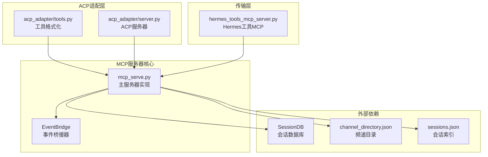
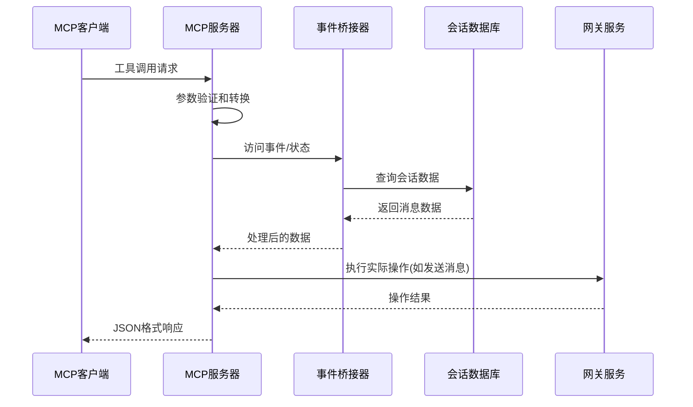
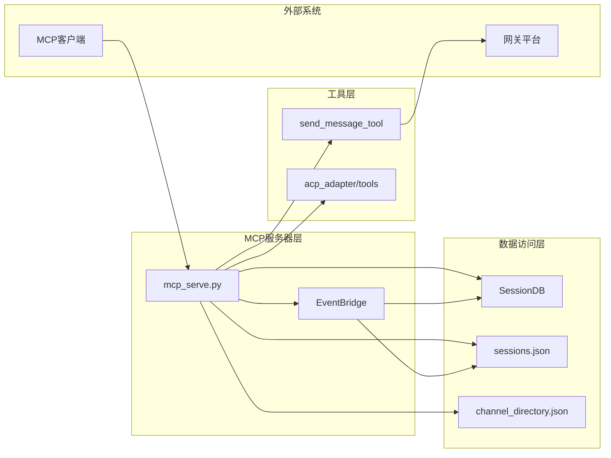

# MCP工具实现

<cite>
**本文档引用的文件**
- [mcp_serve.py](file://mcp_serve.py)
- [acp_adapter/tools.py](file://acp_adapter/tools.py)
- [acp_adapter/server.py](file://acp_adapter/server.py)
- [hermes_tools_mcp_server.py](file://agent/transports/hermes_tools_mcp_server.py)
- [mcp.md](file://website/docs/user-guide/features/mcp.md)
</cite>

## 目录
1. [简介](#简介)
2. [项目结构](#项目结构)
3. [核心组件](#核心组件)
4. [架构概览](#架构概览)
5. [详细组件分析](#详细组件分析)
6. [依赖关系分析](#依赖关系分析)
7. [性能考虑](#性能考虑)
8. [故障排除指南](#故障排除指南)
9. [结论](#结论)

## 简介

本文档详细分析了Hermes MCP服务器的9个核心工具实现，包括conversations_list、conversation_get、messages_read、attachments_fetch、events_poll、events_wait、messages_send、channels_list和permissions_list_open、permissions_respond。这些工具提供了与消息平台的完整集成能力，支持跨平台消息管理、实时事件监控和权限控制。

MCP服务器采用事件驱动架构，通过后台线程轮询会话数据库来实现近实时的消息事件监控。所有工具都实现了统一的参数验证、数据处理和结果格式化机制，确保了良好的用户体验和系统稳定性。

## 项目结构

MCP工具实现主要分布在以下模块中：



**图表来源**
- [mcp_serve.py:450-859](file://mcp_serve.py#L450-L859)
- [acp_adapter/tools.py:1-1292](file://acp_adapter/tools.py#L1-L1292)
- [acp_adapter/server.py:445-800](file://acp_adapter/server.py#L445-L800)

**章节来源**
- [mcp_serve.py:1-898](file://mcp_serve.py#L1-L898)
- [acp_adapter/tools.py:1-1292](file://acp_adapter/tools.py#L1-L1292)

## 核心组件

### 事件桥接器(EventBridge)

EventBridge是MCP服务器的核心组件，负责监控会话数据库变化并维护事件队列：

- **轮询机制**：每200毫秒检查sessions.json和state.db的修改时间戳
- **内存队列**：最多保持1000个事件的循环队列
- **等待机制**：支持超时等待新事件到达
- **批准跟踪**：维护会话期间的待处理批准请求

### 工具执行框架

所有MCP工具都遵循统一的执行模式：
- 参数类型转换和范围限制
- 输入验证和错误处理
- 结果格式化和JSON序列化
- 统一的错误响应格式

**章节来源**
- [mcp_serve.py:195-444](file://mcp_serve.py#L195-L444)
- [mcp_serve.py:118-147](file://mcp_serve.py#L118-L147)

## 架构概览



**图表来源**
- [mcp_serve.py:471-859](file://mcp_serve.py#L471-L859)
- [acp_adapter/server.py:750-800](file://acp_adapter/server.py#L750-L800)

## 详细组件分析

### conversations_list 工具

**功能**：列出所有活跃的消息会话，支持按平台过滤和名称搜索。

**参数验证**：
- `platform`: 字符串，不区分大小写的平台过滤
- `limit`: 整数，范围1-200，默认50
- `search`: 可选字符串，用于会话名称过滤

**数据处理流程**：
1. 加载sessions.json索引文件
2. 过滤满足条件的会话条目
3. 提取平台、聊天类型、显示名称等关键信息
4. 按最后活动时间降序排序
5. 应用限制数量

**结果格式**：
```json
{
  "count": 10,
  "conversations": [
    {
      "session_key": "string",
      "session_id": "string",
      "platform": "string",
      "chat_type": "string",
      "display_name": "string",
      "chat_name": "string",
      "user_name": "string",
      "updated_at": "string"
    }
  ]
}
```

**章节来源**
- [mcp_serve.py:471-524](file://mcp_serve.py#L471-L524)

### conversation_get 工具

**功能**：获取指定会话的详细信息。

**参数验证**：
- `session_key`: 必需参数，必须存在于sessions.json中

**数据提取**：
- 基本信息：session_id、platform、chat_type
- 显示信息：display_name、user_name、chat_name
- 标识信息：chat_id、thread_id
- 使用统计：input_tokens、output_tokens、total_tokens
- 时间信息：created_at、updated_at

**错误处理**：
- 会话不存在时返回明确的错误信息
- 缺少必需字段时提供默认值

**章节来源**
- [mcp_serve.py:528-557](file://mcp_serve.py#L528-L557)

### messages_read 工具

**功能**：读取会话中的最近消息历史。

**参数验证**：
- `session_key`: 必需参数
- `limit`: 整数，范围1-200，默认50

**消息过滤**：
- 仅接受user和assistant角色的消息
- 提取纯文本内容，移除空内容
- 截断过长内容至2000字符
- 保留消息ID、角色、时间戳

**结果结构**：
```json
{
  "session_key": "string",
  "count": 50,
  "total_in_session": 120,
  "messages": [
    {
      "id": "string",
      "role": "string",
      "content": "string",
      "timestamp": "string"
    }
  ]
}
```

**章节来源**
- [mcp_serve.py:561-614](file://mcp_serve.py#L561-L614)

### attachments_fetch 工具

**功能**：提取消息中的非文本附件。

**附件识别**：
- 多部分内容块：image_url、image、file等类型
- 文本中的MEDIA标签：MEDIA:路径
- 图像URL检测
- 文件引用解析

**返回格式**：
```json
{
  "message_id": "string",
  "count": 3,
  "attachments": [
    {
      "type": "image|media|file",
      "url": "string",
      "path": "string",
      "data": "object"
    }
  ]
}
```

**章节来源**
- [mcp_serve.py:618-666](file://mcp_serve.py#L618-L666)

### events_poll 工具

**功能**：轮询自光标位置以来的新事件。

**参数验证**：
- `after_cursor`: 整数，最小0，默认0
- `session_key`: 可选过滤器
- `limit`: 整数，范围1-200，默认20

**事件类型**：
- `message`: 新消息到达
- `approval_requested`: 需要用户批准的操作
- `approval_resolved`: 批准请求已解决

**响应结构**：
```json
{
  "events": [
    {
      "cursor": 123,
      "type": "string",
      "session_key": "string",
      "data": {}
    }
  ],
  "next_cursor": 123
}
```

**章节来源**
- [mcp_serve.py:670-695](file://mcp_serve.py#L670-L695)

### events_wait 工具

**功能**：长时间等待下一个事件（阻塞模式）。

**参数验证**：
- `after_cursor`: 整数，最小0，默认0
- `session_key`: 可选过滤器
- `timeout_ms`: 整数，范围0-300000，默认30000

**等待机制**：
- 使用线程事件实现超时等待
- 最大等待5分钟
- 支持会话级过滤

**响应处理**：
- 有事件到达：返回事件对象
- 超时：返回{"event": None, "reason": "timeout"}

**章节来源**
- [mcp_serve.py:699-729](file://mcp_serve.py#L699-L729)

### messages_send 工具

**功能**：向平台会话发送消息。

**目标格式**：
- `platform:chat_id`格式
- 支持人类可读的频道名称自动解析

**安全验证**：
- 必需参数验证
- 导入保护：防止工具不可用时的错误
- 异常捕获和错误报告

**集成方式**：
- 调用send_message_tool工具
- 复用Hermes代理的相同基础设施
- 支持所有已连接平台

**章节来源**
- [mcp_serve.py:733-765](file://mcp_serve.py#L733-L765)

### channels_list 工具

**功能**：列出可用于发送消息的可用频道和目标。

**数据源选择**：
- 优先使用缓存的channel_directory.json
- 备用方案：从sessions.json生成目标列表
- 去重处理：避免重复的目标字符串

**过滤机制**：
- 可选平台过滤
- 类型化数据提取
- 标准化输出格式

**输出结构**：
```json
{
  "count": 25,
  "channels": [
    {
      "target": "telegram:6308981865",
      "platform": "telegram",
      "name": "General Chat",
      "chat_type": "group"
    }
  ]
}
```

**章节来源**
- [mcp_serve.py:769-819](file://mcp_serve.py#L769-L819)

### permissions_list_open 工具

**功能**：列出当前桥接会话期间观察到的待处理批准请求。

**数据来源**：
- EventBridge内部的批准请求跟踪
- 仅包含会话启动后的新请求
- 排序基于创建时间

**输出格式**：
```json
{
  "count": 3,
  "approvals": [
    {
      "id": "string",
      "session_key": "string",
      "message_id": "string",
      "command": "string",
      "description": "string",
      "created_at": "string"
    }
  ]
}
```

**章节来源**
- [mcp_serve.py:823-835](file://mcp_serve.py#L823-L835)

### permissions_respond 工具

**功能**：响应待处理的批准请求。

**决策验证**：
- 仅接受"allow-once"、"allow-always"、"deny"三种决策
- 错误输入时返回明确的错误信息

**处理流程**：
- 在EventBridge中查找对应的批准请求
- 移除已处理的请求
- 发出approval_resolved事件
- 返回处理结果

**错误处理**：
- 未找到请求时返回错误
- 决策验证失败时返回错误

**章节来源**
- [mcp_serve.py:839-857](file://mcp_serve.py#L839-L857)

## 依赖关系分析



**图表来源**
- [mcp_serve.py:71-116](file://mcp_serve.py#L71-L116)
- [acp_adapter/tools.py:871-908](file://acp_adapter/tools.py#L871-L908)

**章节来源**
- [mcp_serve.py:450-859](file://mcp_serve.py#L450-L859)
- [acp_adapter/tools.py:1017-1274](file://acp_adapter/tools.py#L1017-L1274)

## 性能考虑

### 轮询优化策略

1. **mtime缓存**：使用文件修改时间戳跳过无变化的轮询
2. **批量处理**：每次轮询处理所有会话的消息
3. **内存限制**：事件队列最大1000个事件，自动清理旧事件
4. **超时控制**：最长5分钟的等待时间，防止资源泄漏

### 数据库访问优化

1. **索引文件优先**：sessions.json提供快速的会话元数据访问
2. **增量更新**：仅处理自上次轮询以来的新消息
3. **内容截断**：避免传输过大的消息内容
4. **类型转换**：统一时间戳格式，提高比较效率

### 内存管理

1. **循环队列**：固定大小的事件队列，自动移除最旧事件
2. **字符串截断**：长文本内容自动截断，控制内存使用
3. **对象复用**：重用Python对象，减少垃圾回收压力

## 故障排除指南

### 常见问题及解决方案

**1. 会话数据库不可用**
- 症状：messages_read、conversations_list等工具返回错误
- 解决方案：检查~/.hermes/state.db文件是否存在和可访问

**2. 事件轮询无响应**
- 症状：events_poll返回空事件，events_wait长时间等待
- 解决方案：确认EventBridge已启动，检查sessions.json修改时间

**3. 消息发送失败**
- 症状：messages_send返回错误
- 解决方案：验证目标格式，确认网关服务运行正常

**4. 权限批准无效**
- 症状：permissions_respond返回"Approval not found"
- 解决方案：使用permissions_list_open确认批准ID存在

### 日志和调试

- 启用详细日志：使用--verbose标志启动MCP服务器
- 检查事件队列：监控EventBridge的状态和队列长度
- 验证数据源：确认sessions.json和channel_directory.json的完整性

**章节来源**
- [mcp_serve.py:866-898](file://mcp_serve.py#L866-L898)

## 结论

Hermes MCP服务器提供了完整的消息平台集成解决方案，具有以下特点：

1. **全面的功能覆盖**：涵盖消息读取、发送、附件处理、事件监控和权限管理
2. **高性能设计**：采用轮询优化和内存限制，确保系统稳定性
3. **统一的接口**：所有工具遵循相同的参数验证和结果格式化标准
4. **强大的扩展性**：基于事件驱动架构，易于添加新的平台和功能

这些工具为开发者提供了强大的消息平台自动化能力，支持从简单的消息查询到复杂的事件驱动工作流。通过合理的错误处理和性能优化，确保了在生产环境中的可靠运行。