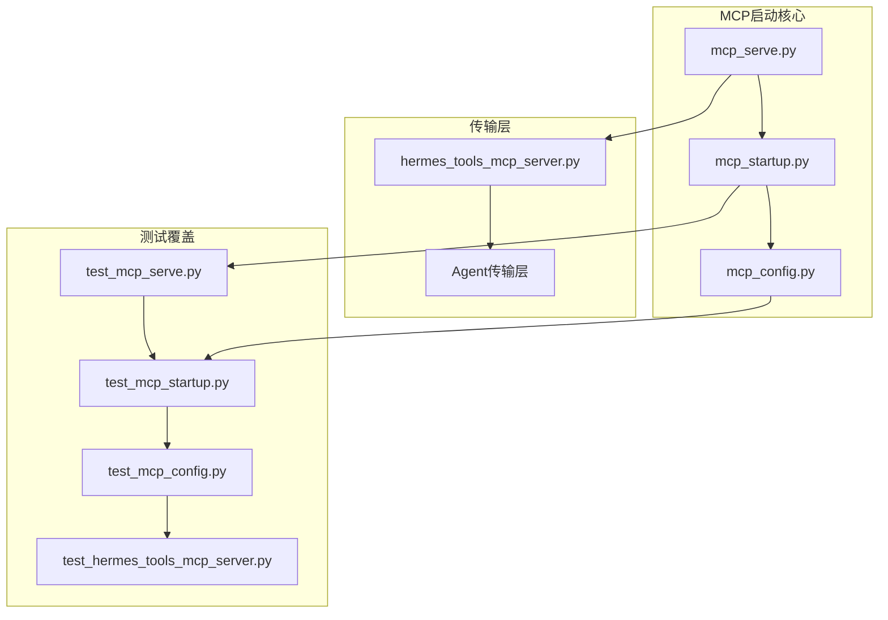
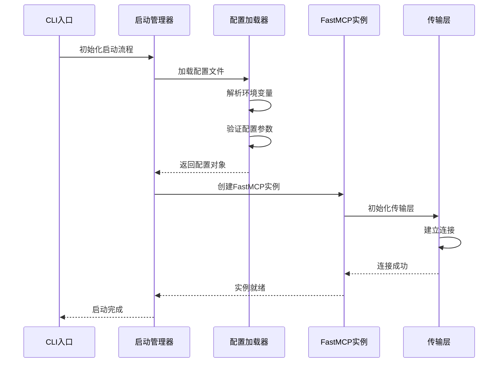
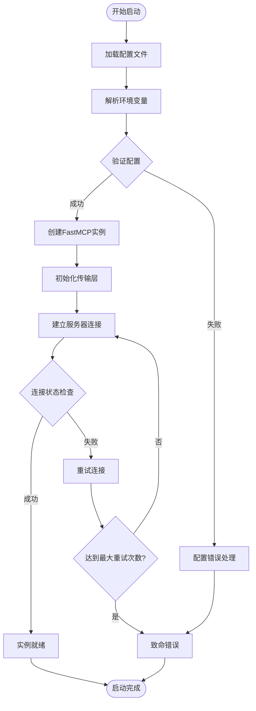
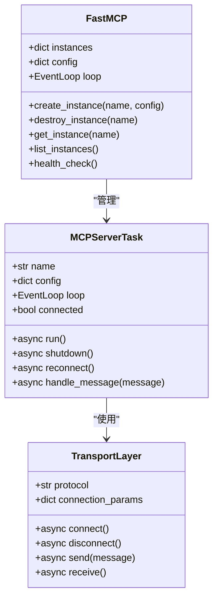
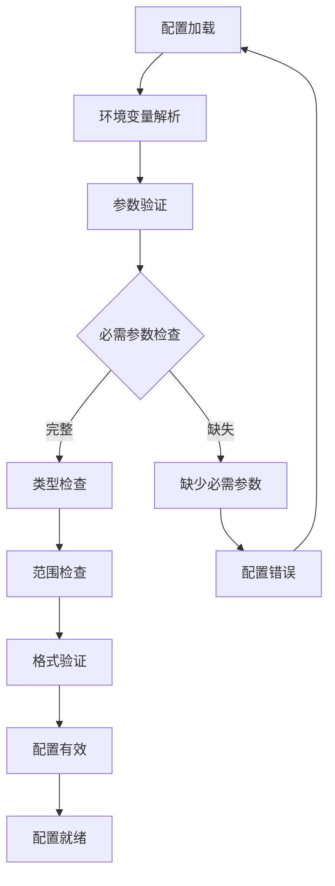
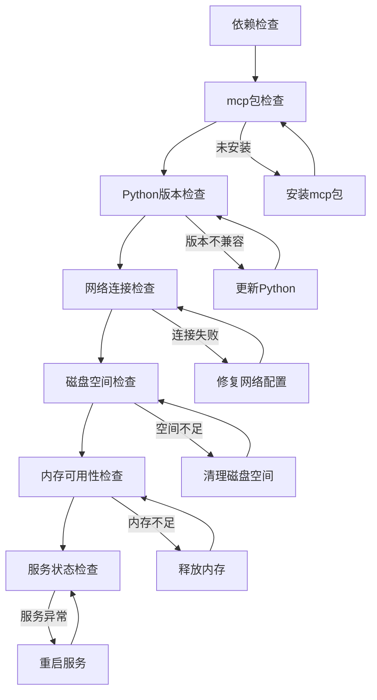
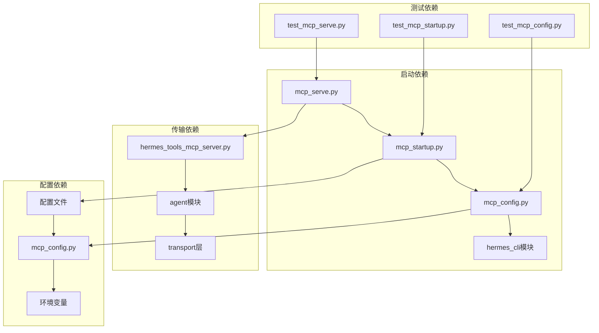
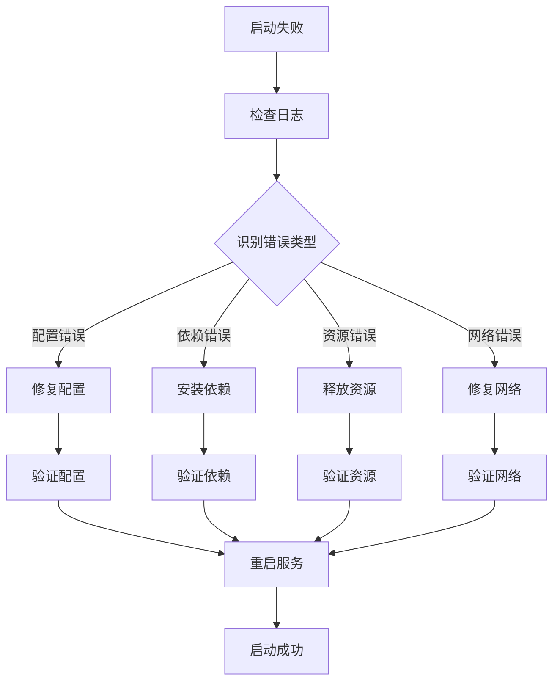

# MCP服务器启动流程

<cite>
**本文档引用的文件**
- [mcp_serve.py](file://mcp_serve.py)
- [mcp_startup.py](file://hermes_cli/mcp_startup.py)
- [mcp_config.py](file://hermes_cli/mcp_config.py)
- [hermes_tools_mcp_server.py](file://agent/transports/hermes_tools_mcp_server.py)
- [test_mcp_serve.py](file://tests/test_mcp_serve.py)
- [test_mcp_startup.py](file://tests/hermes_cli/test_mcp_startup.py)
- [test_mcp_config.py](file://tests/hermes_cli/test_mcp_config.py)
- [test_hermes_tools_mcp_server.py](file://tests/agent/transports/test_hermes_tools_mcp_server.py)
</cite>

## 目录
1. [简介](#简介)
2. [项目结构](#项目结构)
3. [核心组件](#核心组件)
4. [架构概览](#架构概览)
5. [详细组件分析](#详细组件分析)
6. [依赖分析](#依赖分析)
7. [性能考虑](#性能考虑)
8. [故障排除指南](#故障排除指南)
9. [结论](#结论)

## 简介

本文档详细阐述了MCP（Model Context Protocol）服务器在Hermes Agent中的启动流程。MCP服务器是实现智能体与外部工具和服务交互的关键组件，通过标准化协议提供工具发现、调用和管理功能。

系统通过FastMCP实例创建、依赖检查和配置加载三个主要阶段来启动MCP服务器，确保服务器能够在各种环境下稳定运行并提供可靠的工具服务。

## 项目结构

MCP服务器启动相关的代码分布在以下关键模块中：

**图表来源**
- [mcp_serve.py](file://mcp_serve.py)
- [mcp_startup.py](file://hermes_cli/mcp_startup.py)
- [mcp_config.py](file://hermes_cli/mcp_config.py)
- [hermes_tools_mcp_server.py](file://agent/transports/hermes_tools_mcp_server.py)

**章节来源**
- [mcp_serve.py](file://mcp_serve.py)
- [mcp_startup.py](file://hermes_cli/mcp_startup.py)
- [mcp_config.py](file://hermes_cli/mcp_config.py)
- [hermes_tools_mcp_server.py](file://agent/transports/hermes_tools_mcp_server.py)

## 核心组件

### FastMCP实例管理

FastMCP是MCP服务器的核心实现，负责管理多个MCP服务器实例。每个实例都有独立的生命周期管理和资源隔离。

### 配置管理系统

配置系统支持多种配置源，包括文件配置、环境变量和运行时参数。配置加载采用优先级机制，确保灵活性和可维护性。

### 传输层适配器

传输层负责MCP协议的消息传递和连接管理，支持多种传输方式以适应不同的部署场景。

**章节来源**
- [mcp_serve.py](file://mcp_serve.py)
- [mcp_startup.py](file://hermes_cli/mcp_startup.py)
- [mcp_config.py](file://hermes_cli/mcp_config.py)

## 架构概览

MCP服务器启动采用分层架构设计，从底层的FastMCP实例到上层的配置管理，形成完整的启动流程：

**图表来源**
- [mcp_serve.py](file://mcp_serve.py)
- [mcp_startup.py](file://hermes_cli/mcp_startup.py)
- [mcp_config.py](file://hermes_cli/mcp_config.py)

## 详细组件分析

### FastMCP实例创建流程

FastMCP实例创建是启动流程的核心步骤，涉及多个关键组件的协调工作：

**图表来源**
- [mcp_serve.py](file://mcp_serve.py)
- [mcp_startup.py](file://hermes_cli/mcp_startup.py)

#### FastMCP类结构

**图表来源**
- [mcp_serve.py](file://mcp_serve.py)
- [hermes_tools_mcp_server.py](file://agent/transports/hermes_tools_mcp_server.py)

**章节来源**
- [mcp_serve.py](file://mcp_serve.py)
- [hermes_tools_mcp_server.py](file://agent/transports/hermes_tools_mcp_server.py)

### 配置加载与验证机制

配置系统采用多层验证策略，确保启动参数的完整性和正确性：

**图表来源**
- [mcp_config.py](file://hermes_cli/mcp_config.py)
- [mcp_startup.py](file://hermes_cli/mcp_startup.py)

**章节来源**
- [mcp_config.py](file://hermes_cli/mcp_config.py)
- [mcp_startup.py](file://hermes_cli/mcp_startup.py)

### 依赖检查与错误处理

系统实现了多层次的依赖检查机制，确保所有必要组件都已正确安装和配置：

**图表来源**
- [mcp_serve.py](file://mcp_serve.py)
- [mcp_startup.py](file://hermes_cli/mcp_startup.py)

**章节来源**
- [mcp_serve.py](file://mcp_serve.py)
- [mcp_startup.py](file://hermes_cli/mcp_startup.py)

## 依赖分析

MCP服务器启动流程涉及多个模块间的复杂依赖关系：

**图表来源**
- [mcp_serve.py](file://mcp_serve.py)
- [mcp_startup.py](file://hermes_cli/mcp_startup.py)
- [mcp_config.py](file://hermes_cli/mcp_config.py)
- [hermes_tools_mcp_server.py](file://agent/transports/hermes_tools_mcp_server.py)

**章节来源**
- [mcp_serve.py](file://mcp_serve.py)
- [mcp_startup.py](file://hermes_cli/mcp_startup.py)
- [mcp_config.py](file://hermes_cli/mcp_config.py)
- [hermes_tools_mcp_server.py](file://agent/transports/hermes_tools_mcp_server.py)

## 性能考虑

MCP服务器启动流程在设计时充分考虑了性能优化：

### 启动时间优化
- 异步配置加载减少阻塞时间
- 并行依赖检查提高效率
- 缓存机制避免重复计算

### 资源管理
- 内存使用监控防止过度占用
- 连接池管理优化网络资源
- 文件句柄限制防止泄漏

### 可扩展性设计
- 模块化架构支持动态扩展
- 插件机制便于功能添加
- 配置热重载支持运行时调整

## 故障排除指南

### 常见启动失败原因

#### 配置相关问题
- **配置文件格式错误**：检查YAML语法和字段完整性
- **环境变量缺失**：确认必要的环境变量已设置
- **权限不足**：验证配置文件和目录访问权限

#### 依赖相关问题
- **mcp包未安装**：执行`pip install mcp`重新安装
- **Python版本不兼容**：检查Python版本要求
- **网络连接失败**：验证防火墙和代理设置

#### 资源相关问题
- **端口被占用**：更改端口号或停止占用进程
- **磁盘空间不足**：清理临时文件释放空间
- **内存不足**：关闭其他应用程序释放内存

### 故障诊断流程

**章节来源**
- [test_mcp_serve.py](file://tests/test_mcp_serve.py)
- [test_mcp_startup.py](file://tests/hermes_cli/test_mcp_startup.py)
- [test_mcp_config.py](file://tests/hermes_cli/test_mcp_config.py)

## 结论

MCP服务器启动流程通过精心设计的架构和完善的错误处理机制，确保了系统的稳定性和可靠性。该流程具有以下特点：

1. **模块化设计**：清晰的职责分离便于维护和扩展
2. **健壮性保障**：多层次的错误检查和恢复机制
3. **性能优化**：异步处理和资源管理提升启动效率
4. **可诊断性**：详细的日志记录和状态监控

通过遵循本文档的指导，开发者可以有效地理解和优化MCP服务器的启动流程，确保系统在各种环境下都能稳定运行。