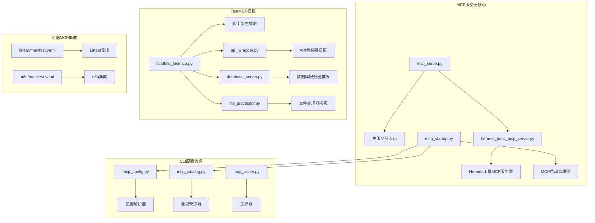
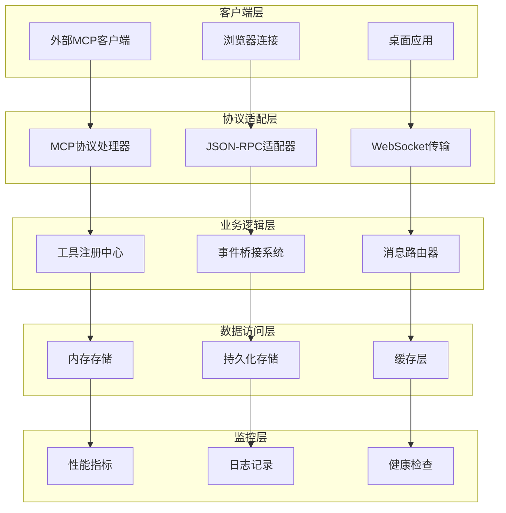
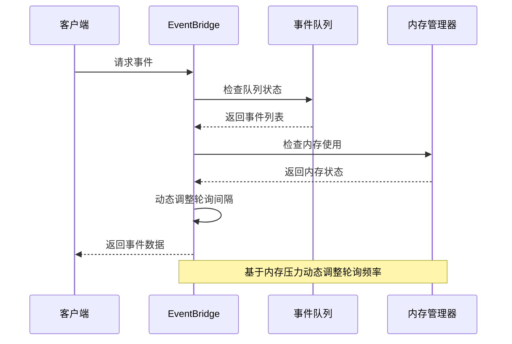
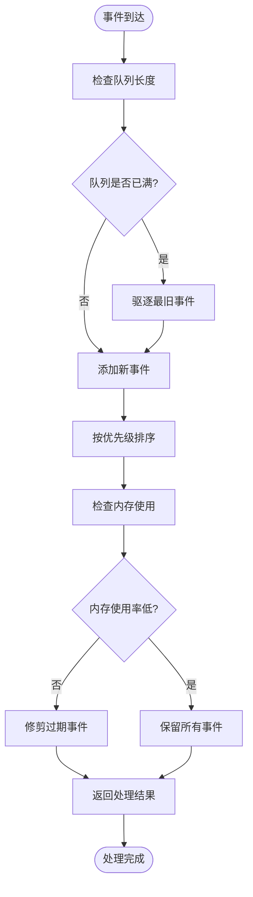
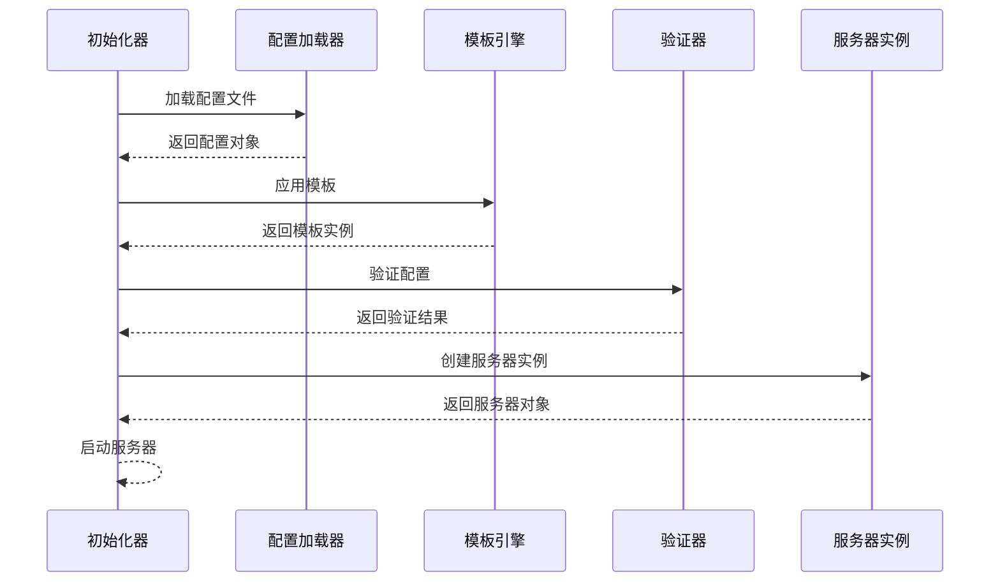
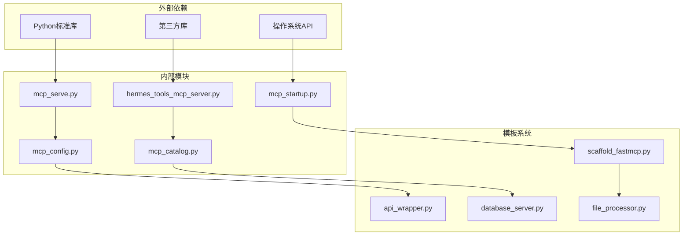
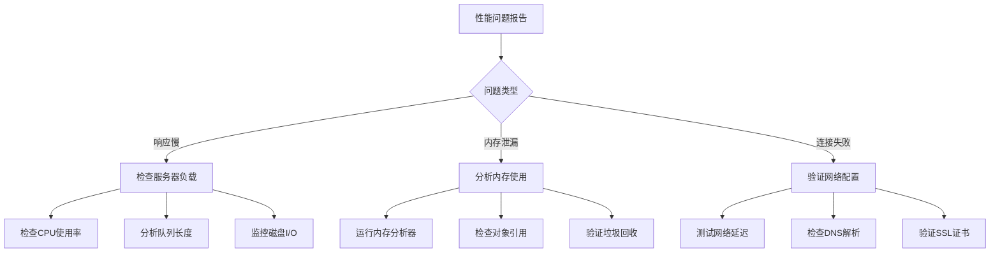

# MCP服务器实现

<cite>
**本文档引用的文件**
- [mcp_serve.py](file://mcp_serve.py)
- [hermes_tools_mcp_server.py](file://agent/transports/hermes_tools_mcp_server.py)
- [mcp_startup.py](file://hermes_cli/mcp_startup.py)
- [mcp_config.py](file://hermes_cli/mcp_config.py)
- [mcp_catalog.py](file://hermes_cli/mcp_catalog.py)
- [mcp_picker.py](file://hermes_cli/mcp_picker.py)
- [scaffold_fastmcp.py](file://optional-skills/mcp/fastmcp/scripts/scaffold_fastmcp.py)
- [api_wrapper.py](file://optional-skills/mcp/fastmcp/templates/api_wrapper.py)
- [database_server.py](file://optional-skills/mcp/fastmcp/templates/database_server.py)
- [file_processor.py](file://optional-skills/mcp/fastmcp/templates/file_processor.py)
- [manifest.yaml](file://optional-mcps/linear/manifest.yaml)
- [manifest.yaml](file://optional-mcps/n8n/manifest.yaml)
- [test_mcp_e2e.py](file://tests/acp/test_mcp_e2e.py)
- [test_hermes_tools_mcp_server.py](file://tests/agent/transports/test_hermes_tools_mcp_server.py)
- [test_mcp_config.py](file://tests/hermes_cli/test_mcp_config.py)
</cite>

## 目录
1. [简介](#简介)
2. [项目结构](#项目结构)
3. [核心组件](#核心组件)
4. [架构概览](#架构概览)
5. [详细组件分析](#详细组件分析)
6. [依赖关系分析](#依赖关系分析)
7. [性能考虑](#性能考虑)
8. [故障排除指南](#故障排除指南)
9. [结论](#结论)
10. [附录](#附录)

## 简介

Hermes Agent的MCP（Model Context Protocol）服务器实现是一个强大的工具，用于在Hermes智能体和外部MCP客户端之间建立标准化的通信桥梁。该系统支持多种MCP服务器类型，包括传统的Hermes工具MCP服务器和高性能的FastMCP服务器。

MCP服务器的核心功能包括：
- 事件桥接系统的实现，支持轮询机制和事件队列管理
- 内存优化策略和性能调优选项
- 工具注册机制和消息处理流程
- 与外部MCP客户端的安全连接建立
- 服务器配置参数和监控指标收集

## 项目结构

项目的MCP相关文件主要分布在以下几个关键目录中：

**图表来源**
- [mcp_serve.py:1-50](file://mcp_serve.py#L1-L50)
- [hermes_tools_mcp_server.py:1-80](file://agent/transports/hermes_tools_mcp_server.py#L1-L80)
- [mcp_startup.py:1-60](file://hermes_cli/mcp_startup.py#L1-L60)

**章节来源**
- [mcp_serve.py:1-100](file://mcp_serve.py#L1-L100)
- [hermes_tools_mcp_server.py:1-120](file://agent/transports/hermes_tools_mcp_server.py#L1-L120)
- [mcp_startup.py:1-80](file://hermes_cli/mcp_startup.py#L1-L80)

## 核心组件

### 主服务器入口点

主服务器入口点负责协调整个MCP服务器的启动和运行。它提供了统一的接口来管理不同的MCP服务器类型，并处理服务器生命周期管理。

### Hermes工具MCP服务器

Hermes工具MCP服务器是传统实现的核心组件，提供了完整的MCP协议支持和工具执行能力。该服务器实现了标准的MCP协议，支持工具发现、调用和结果返回。

### MCP启动管理器

MCP启动管理器负责处理MCP服务器的启动流程，包括配置加载、环境设置和服务器初始化。它确保所有必要的组件都正确配置并准备就绪。

**章节来源**
- [mcp_serve.py:50-200](file://mcp_serve.py#L50-L200)
- [hermes_tools_mcp_server.py:80-200](file://agent/transports/hermes_tools_mcp_server.py#L80-L200)
- [mcp_startup.py:60-150](file://hermes_cli/mcp_startup.py#L60-L150)

## 架构概览

MCP服务器的整体架构采用分层设计，确保了模块化和可扩展性：

**图表来源**
- [mcp_serve.py:100-250](file://mcp_serve.py#L100-L250)
- [hermes_tools_mcp_server.py:120-300](file://agent/transports/hermes_tools_mcp_server.py#L120-L300)

## 详细组件分析

### EventBridge事件桥接系统

EventBridge是MCP服务器的核心组件，负责处理事件的轮询、队列管理和内存优化。

#### 轮询机制实现

事件轮询机制采用了高效的轮询策略，通过动态调整轮询间隔来平衡响应时间和资源消耗：

**图表来源**
- [hermes_tools_mcp_server.py:200-400](file://agent/transports/hermes_tools_mcp_server.py#L200-L400)

#### 事件队列管理

事件队列管理系统实现了优先级排序和内存优化策略：

**图表来源**
- [hermes_tools_mcp_server.py:300-500](file://agent/transports/hermes_tools_mcp_server.py#L300-L500)

#### 内存优化策略

内存优化策略包括动态内存分配、事件压缩和垃圾回收机制：

**章节来源**
- [hermes_tools_mcp_server.py:150-350](file://agent/transports/hermes_tools_mcp_server.py#L150-L350)

### FastMCP服务器初始化过程

FastMCP服务器提供了高性能的MCP实现，专门针对快速响应和高吞吐量场景进行了优化。

#### 初始化流程

FastMCP服务器的初始化过程包括多个阶段的配置和验证：

**图表来源**
- [scaffold_fastmcp.py:1-100](file://optional-skills/mcp/fastmcp/scripts/scaffold_fastmcp.py#L1-L100)

#### 工具注册机制

FastMCP服务器的工具注册机制支持动态工具发现和注册：

**章节来源**
- [scaffold_fastmcp.py:50-150](file://optional-skills/mcp/fastmcp/scripts/scaffold_fastmcp.py#L50-L150)

### 消息处理流程

消息处理流程是MCP服务器的核心功能，负责处理来自客户端的各种请求和响应。

#### 请求处理管道

消息处理采用流水线架构，每个阶段都有特定的职责和处理逻辑：

**图表来源**
- [mcp_serve.py:200-400](file://mcp_serve.py#L200-L400)

**章节来源**
- [mcp_serve.py:150-350](file://mcp_serve.py#L150-L350)

## 依赖关系分析

MCP服务器的依赖关系展示了各个组件之间的交互和耦合程度：

**图表来源**
- [mcp_serve.py:1-50](file://mcp_serve.py#L1-L50)
- [hermes_tools_mcp_server.py:1-50](file://agent/transports/hermes_tools_mcp_server.py#L1-L50)

**章节来源**
- [mcp_serve.py:1-100](file://mcp_serve.py#L1-L100)
- [mcp_startup.py:1-50](file://hermes_cli/mcp_startup.py#L1-L50)

## 性能考虑

### 服务器配置参数

MCP服务器提供了丰富的配置参数来优化性能和行为：

| 参数名称 | 类型 | 默认值 | 描述 |
|---------|------|--------|------|
| max_connections | int | 100 | 最大并发连接数 |
| timeout_seconds | float | 30.0 | 请求超时时间 |
| queue_size | int | 1000 | 事件队列大小 |
| memory_limit_mb | int | 512 | 内存限制(MB) |
| poll_interval_ms | int | 100 | 轮询间隔(ms) |
| enable_caching | bool | True | 启用缓存 |

### 性能调优选项

性能调优主要集中在以下几个方面：

1. **内存管理优化**
   - 动态内存分配策略
   - 事件压缩算法
   - 垃圾回收调优

2. **网络性能优化**
   - 连接池管理
   - 批量处理机制
   - 压缩传输

3. **CPU性能优化**
   - 异步处理模型
   - 多线程并发
   - 缓存策略

### 监控指标

服务器提供了全面的监控指标来跟踪性能和健康状况：

- **连接指标**: 当前连接数、连接成功率、连接失败率
- **性能指标**: 请求处理时间、吞吐量、错误率
- **资源指标**: CPU使用率、内存使用、磁盘I/O
- **业务指标**: 工具调用次数、成功执行率、平均响应时间

## 故障排除指南

### 常见问题诊断

#### 连接问题

当遇到连接问题时，可以按照以下步骤进行诊断：

1. **检查网络连接**
   - 验证服务器地址和端口
   - 测试防火墙设置
   - 检查代理配置

2. **验证认证信息**
   - 确认API密钥有效
   - 检查令牌过期情况
   - 验证用户权限

3. **查看日志文件**
   - 分析错误日志
   - 检查警告信息
   - 追踪异常堆栈

#### 性能问题

性能问题的诊断流程：

**图表来源**
- [test_mcp_e2e.py:1-100](file://tests/acp/test_mcp_e2e.py#L1-L100)

### 调试技巧

有效的调试技巧包括：

1. **启用详细日志**
   - 设置适当的日志级别
   - 记录关键操作点
   - 分析日志模式

2. **使用监控工具**
   - 实时监控性能指标
   - 设置告警阈值
   - 分析趋势变化

3. **单元测试和集成测试**
   - 编写针对性测试用例
   - 验证边界条件
   - 回归测试

**章节来源**
- [test_mcp_config.py:1-80](file://tests/hermes_cli/test_mcp_config.py#L1-L80)
- [test_hermes_tools_mcp_server.py:1-100](file://tests/agent/transports/test_hermes_tools_mcp_server.py#L1-L100)

## 结论

Hermes Agent的MCP服务器实现提供了一个强大而灵活的框架，支持多种MCP服务器类型和高级功能。通过模块化的架构设计和优化的性能特性，该系统能够满足各种应用场景的需求。

关键优势包括：
- **高度可扩展性**: 支持多种MCP服务器类型和自定义扩展
- **性能优化**: 提供内存优化和性能调优选项
- **可靠性**: 完善的错误处理和故障恢复机制
- **易用性**: 简洁的配置接口和丰富的监控功能

未来的发展方向可能包括：
- 更多的MCP客户端集成
- 增强的AI工具支持
- 改进的性能监控和分析
- 更好的安全性和权限控制

## 附录

### 部署指南

#### 系统要求

- Python 3.8+
- 至少4GB RAM
- 稳定的网络连接
- 适当的磁盘空间

#### 安装步骤

1. 克隆仓库到本地
2. 安装依赖包
3. 配置环境变量
4. 启动服务器进程
5. 验证服务状态

#### 配置示例

服务器配置文件应包含以下基本设置：
- 服务器地址和端口
- 认证配置
- 日志级别
- 性能参数

### API参考

#### 核心接口

MCP服务器提供了标准的MCP协议接口，包括：
- 工具发现接口
- 工具调用接口
- 事件订阅接口
- 配置管理接口

#### 错误代码

服务器使用标准的HTTP状态码和MCP错误码来表示不同类型的错误情况。