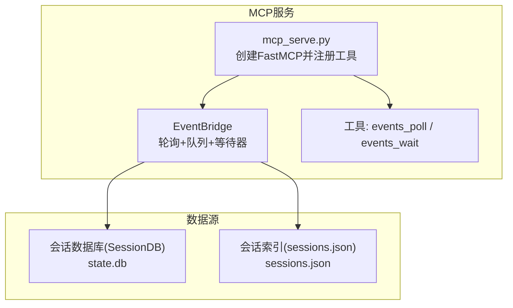
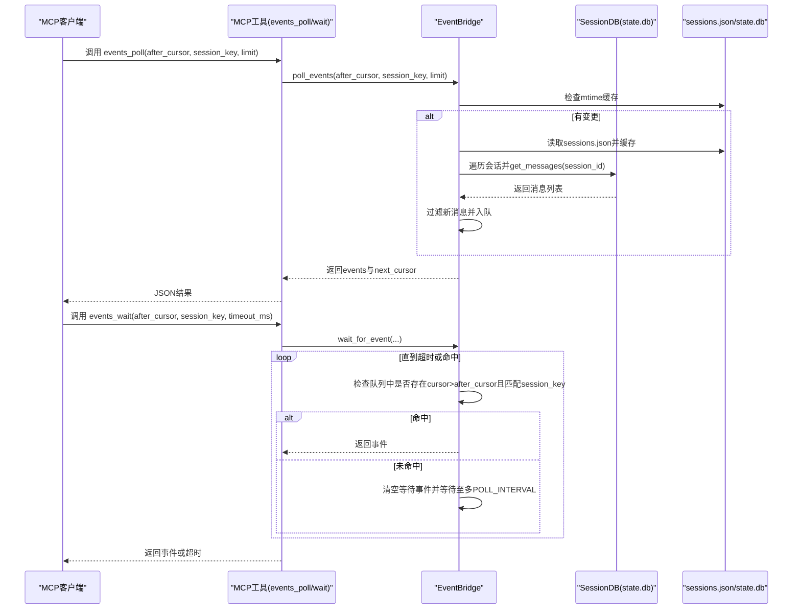
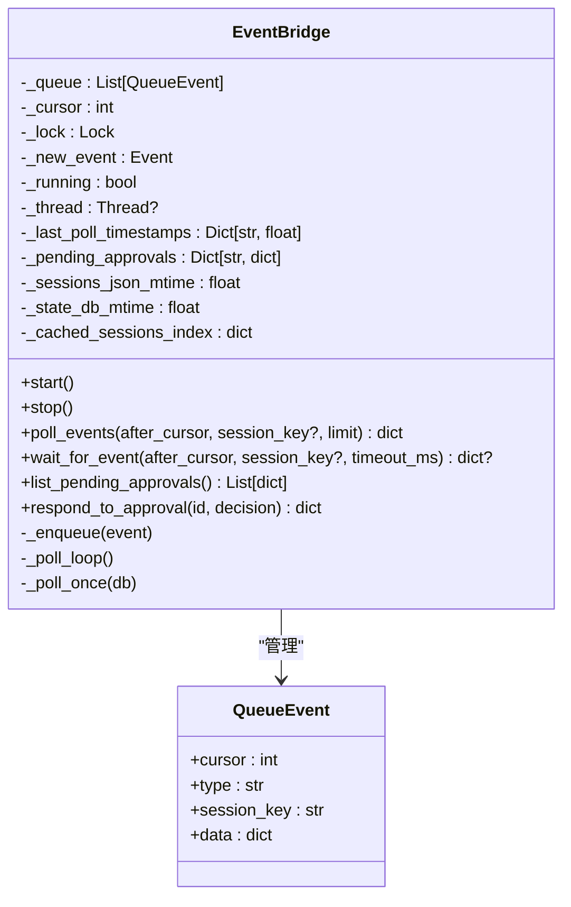
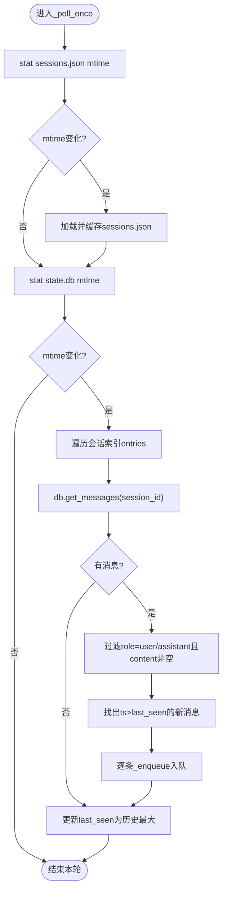
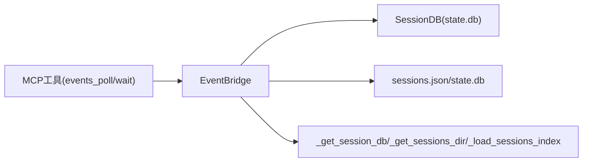

# 事件桥接系统

<cite>
**本文档引用的文件**
- [mcp_serve.py](file://mcp_serve.py)
- [approval.py](file://tools/approval.py)
- [mcp.md](file://website/docs/user-guide/features/mcp.md)
</cite>

## 目录
1. [简介](#简介)
2. [项目结构](#项目结构)
3. [核心组件](#核心组件)
4. [架构总览](#架构总览)
5. [详细组件分析](#详细组件分析)
6. [依赖关系分析](#依赖关系分析)
7. [性能考量](#性能考量)
8. [故障排除指南](#故障排除指南)
9. [结论](#结论)
10. [附录](#附录)

## 简介
本文件面向MCP服务器的事件桥接系统，聚焦EventBridge类的设计与实现，系统性阐述其轮询机制、事件队列管理、内存优化策略、后台轮询线程工作原理、数据库轮询间隔、mtime缓存机制、事件类型与过滤逻辑，并提供监控指标、性能调优与故障排除建议。该系统通过轮询会话数据库，将新消息转换为内存中的事件队列，供MCP客户端通过events_poll/events_wait近实时获取。

## 项目结构
事件桥接系统位于MCP服务入口文件中，核心类为EventBridge，配套工具函数负责会话索引加载、通道目录加载、消息内容提取与附件解析等。MCP工具注册处暴露events_poll与events_wait两个关键工具，分别用于非阻塞轮询与长轮询等待。

图表来源
- [mcp_serve.py:450-859](file://mcp_serve.py#L450-L859)
- [mcp_serve.py:204-444](file://mcp_serve.py#L204-L444)

章节来源
- [mcp_serve.py:1-898](file://mcp_serve.py#L1-L898)

## 核心组件
- EventBridge：后台轮询器，维护内存事件队列、游标、等待事件、批准状态跟踪与mtime缓存，提供poll_events与wait_for_event接口。
- MCP工具：events_poll与events_wait，前者非阻塞返回指定游标之后的事件，后者阻塞等待匹配事件或超时。
- 会话数据库与索引：从state.db读取消息，从sessions.json获取会话元信息；mtime缓存避免重复扫描。
- 批准事件：通过respond_to_approval生成approval_resolved事件，配合permissions_list_open/permissions_respond在MCP侧呈现。

章节来源
- [mcp_serve.py:204-444](file://mcp_serve.py#L204-L444)
- [mcp_serve.py:668-729](file://mcp_serve.py#L668-L729)
- [mcp_serve.py:821-857](file://mcp_serve.py#L821-L857)

## 架构总览
EventBridge在启动时创建守护线程，周期性检查state.db与sessions.json的mtime变化，若未变更则跳过扫描；一旦发现变更，则遍历会话索引，查询对应会话的消息列表，筛选用户/助手消息并按时间戳增量入队，同时更新每个会话的最后轮询时间戳。MCP工具通过共享的EventBridge实例进行事件查询与等待。

图表来源
- [mcp_serve.py:244-294](file://mcp_serve.py#L244-L294)
- [mcp_serve.py:332-444](file://mcp_serve.py#L332-L444)
- [mcp_serve.py:668-729](file://mcp_serve.py#L668-L729)

## 详细组件分析

### EventBridge类设计与数据结构
- 数据结构
  - 队列：List[QueueEvent]，按入队顺序存储事件，支持游标自增与上限裁剪。
  - 游标：cursor整数，单调递增，作为事件位置标识。
  - 等待事件：threading.Event，用于wait_for_event阻塞唤醒。
  - 互斥锁：threading.Lock，保护队列与状态的并发访问。
  - 会话最后轮询时间：Dict[str, float]，以会话键为单位记录上次轮询的最新时间戳。
  - mtime缓存：sessions_json_mtime与state_db_mtime，避免重复扫描。
  - 批准状态：_pending_approvals，记录当前桥接会话内观察到的待决批准请求。
- 关键字段与默认值
  - QUEUE_LIMIT=1000：队列容量上限，超过后丢弃最早事件。
  - POLL_INTERVAL=0.2：后台轮询间隔（秒）。
  - _last_poll_timestamps：会话级时间戳缓存。
  - _sessions_json_mtime/_state_db_mtime：文件mtime缓存。
  - _cached_sessions_index：sessions.json缓存字典。

图表来源
- [mcp_serve.py:195-226](file://mcp_serve.py#L195-L226)
- [mcp_serve.py:204-331](file://mcp_serve.py#L204-L331)

章节来源
- [mcp_serve.py:191-226](file://mcp_serve.py#L191-L226)
- [mcp_serve.py:204-331](file://mcp_serve.py#L204-L331)

### 后台轮询线程与数据库轮询
- 启动与停止
  - start()创建守护线程执行_poll_loop，stop()设置运行标志并唤醒等待者，随后join线程。
- 轮询循环
  - _poll_loop每轮sleep POLL_INTERVAL后调用_poll_once(db)，异常被捕获但不中断循环。
- 单次轮询策略
  - 读取sessions.json与state.db的mtime，若与缓存一致则直接返回，跳过昂贵扫描。
  - 若有变化，重新加载sessions.json到缓存，并遍历每个会话：
    - 从SessionDB.get_messages(session_id)读取消息；
    - 过滤role为"user"/"assistant"且content非空的消息；
    - 将新消息按时间戳增量入队，最多保留最近QUEUE_LIMIT条；
    - 更新该会话的last_seen时间戳为最大时间戳。
- 时间戳归一化
  - 支持int/float/ISO字符串三种格式，统一转换为浮点秒，便于比较。

图表来源
- [mcp_serve.py:346-444](file://mcp_serve.py#L346-L444)

章节来源
- [mcp_serve.py:227-243](file://mcp_serve.py#L227-L243)
- [mcp_serve.py:332-345](file://mcp_serve.py#L332-L345)
- [mcp_serve.py:346-444](file://mcp_serve.py#L346-L444)

### 事件队列管理与游标
- 入队策略
  - _enqueue原子性地自增cursor并分配给事件，然后追加到队尾，随后循环裁剪队首元素直至不超过QUEUE_LIMIT。
- 查询与等待
  - poll_events根据after_cursor与可选session_key过滤事件，限制返回数量，返回events与next_cursor。
  - wait_for_event在超时前循环检查队列，命中即返回；否则清空等待事件并等待至多POLL_INTERVAL，再继续循环直到超时。
- 内存优化
  - 固定容量队列，超出即丢弃最旧事件，避免无限增长。
  - mtime缓存使轮询在无变更时几乎零开销。

章节来源
- [mcp_serve.py:244-294](file://mcp_serve.py#L244-L294)
- [mcp_serve.py:321-331](file://mcp_serve.py#L321-L331)

### 事件类型与过滤逻辑
- 事件类型
  - message：来自用户或助手的新消息，包含role、content、timestamp、message_id等数据。
  - approval_requested：由外部批准流程触发（在当前文件中未见直接生成逻辑，但类型定义存在）。
  - approval_resolved：通过respond_to_approval生成，表示对某批准请求的处理结果。
- 过滤逻辑
  - poll_events支持按after_cursor与session_key过滤。
  - wait_for_event支持按after_cursor与session_key过滤，阻塞等待直至命中或超时。
- 事件数据
  - message事件的data包含role、content（截断至500字符）、timestamp、message_id。
  - approval_resolved事件的data包含approval_id与decision。

章节来源
- [mcp_serve.py:196-201](file://mcp_serve.py#L196-L201)
- [mcp_serve.py:422-436](file://mcp_serve.py#L422-L436)
- [mcp_serve.py:304-319](file://mcp_serve.py#L304-L319)
- [mcp_serve.py:678-695](file://mcp_serve.py#L678-L695)
- [mcp_serve.py:705-729](file://mcp_serve.py#L705-L729)

### 批准请求与事件桥接
- 当前桥接会话内的批准请求可通过permissions_list_open列出，使用permissions_respond进行响应。
- respond_to_approval会从内部_pending_approvals取出对应条目并生成approval_resolved事件入队，以便MCP客户端通过events_poll/events_wait感知。

章节来源
- [mcp_serve.py:296-319](file://mcp_serve.py#L296-L319)
- [mcp_serve.py:821-857](file://mcp_serve.py#L821-L857)

## 依赖关系分析
- 外部依赖
  - SessionDB：从state.db读取消息，提供get_messages(session_id)。
  - hermes_constants：获取HERMES_HOME路径，拼接state.db与sessions.json路径。
  - hermes_state：导入SessionDB类。
- 内部依赖
  - 工具函数：_get_session_db、_get_sessions_dir、_load_sessions_index、_extract_message_content、_extract_attachments。
  - MCP工具：events_poll与events_wait依赖EventBridge的poll_events与wait_for_event。

图表来源
- [mcp_serve.py:71-116](file://mcp_serve.py#L71-L116)
- [mcp_serve.py:450-859](file://mcp_serve.py#L450-L859)

章节来源
- [mcp_serve.py:71-116](file://mcp_serve.py#L71-L116)
- [mcp_serve.py:450-859](file://mcp_serve.py#L450-L859)

## 性能考量
- 轮询间隔与CPU占用
  - POLL_INTERVAL=0.2秒，后台线程sleep该时长，确保低CPU占用。
- 文件系统扫描优化
  - mtime缓存避免重复stat与读取sessions.json，state.db变更检测同样基于mtime。
- 内存占用控制
  - 队列容量固定为1000，超出即丢弃最旧事件，防止内存膨胀。
- 数据库访问频率
  - 仅在mtime变化时才遍历会话并查询消息，减少不必要的数据库压力。
- 时间戳处理
  - 统一归一化为浮点秒，避免字符串比较带来的额外成本。

## 故障排除指南
- SessionDB不可用
  - 现象：轮询线程日志出现“SessionDB unavailable”，事件桥接被禁用。
  - 排查：确认state.db存在且可读；检查HERMES_HOME配置是否正确。
- sessions.json缺失或无法读取
  - 现象：sessions.json不存在或读取失败，导致索引为空。
  - 排查：确认sessions.json存在且可读；检查文件权限与路径。
- 事件未到达
  - 现象：MCP客户端events_poll/events_wait无事件。
  - 排查：确认after_cursor是否正确；检查session_key过滤条件；确认mtime缓存是否阻止了轮询；验证消息role为"user"/"assistant"且content非空。
- 等待超时
  - 现象：events_wait返回timeout。
  - 排查：确认POLL_INTERVAL与timeout设置；检查是否有匹配的事件；确认队列未被过快消费导致游标推进过快。
- 批准事件未显示
  - 现象：permissions_list_open无待决批准，或respond_to_approval未生成approval_resolved。
  - 排查：确认批准请求确实在桥接会话期间产生；检查respond_to_approval调用与事件入队逻辑。

章节来源
- [mcp_serve.py:334-344](file://mcp_serve.py#L334-L344)
- [mcp_serve.py:352-378](file://mcp_serve.py#L352-L378)
- [mcp_serve.py:412-444](file://mcp_serve.py#L412-L444)
- [mcp_serve.py:268-294](file://mcp_serve.py#L268-L294)

## 结论
EventBridge通过轻量的后台轮询与mtime缓存，实现了对会话数据库的高效增量扫描；通过固定容量的内存队列与游标管理，提供了稳定的事件分发能力；通过阻塞等待与超时控制，满足MCP客户端的近实时需求。配合批准请求的桥接，系统在安全与可用性之间取得平衡，适合在生产环境中稳定运行。

## 附录

### 事件类型与处理流程摘要
- message事件
  - 条件：role为"user"/"assistant"且content非空。
  - 数据：包含role、content、timestamp、message_id。
  - 流程：过滤后入队，游标自增，等待者被唤醒。
- approval_resolved事件
  - 条件：通过respond_to_approval生成。
  - 数据：包含approval_id与decision。
  - 流程：生成后入队，MCP客户端可events_poll/events_wait获取。

章节来源
- [mcp_serve.py:412-436](file://mcp_serve.py#L412-L436)
- [mcp_serve.py:304-319](file://mcp_serve.py#L304-L319)

### 监控指标建议
- 队列长度：当前队列事件数量，应接近上限时需关注。
- 轮询间隔：实际轮询耗时与POLL_INTERVAL对比，评估系统负载。
- mtime命中率：mtime未变化的轮询次数占比，反映缓存效果。
- 事件产出速率：单位时间内入队的message事件数量。
- 等待超时率：events_wait超时次数占比，评估延迟与客户端行为。
- 批准事件统计：approval_resolved事件数量与决策分布。

### 性能调优建议
- 调整POLL_INTERVAL：在延迟与CPU占用间权衡，较短间隔提升实时性但增加CPU。
- 调整QUEUE_LIMIT：根据业务峰值适当增大，避免频繁丢弃事件。
- 优化mtime缓存：确保文件系统mtime更新及时，避免误判无变更。
- 减少无关消息：通过更严格的过滤条件减少入队事件数量。