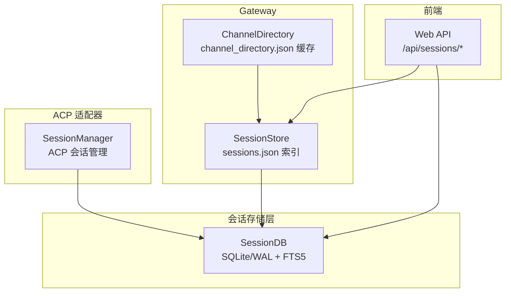
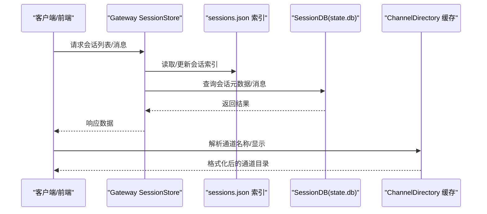
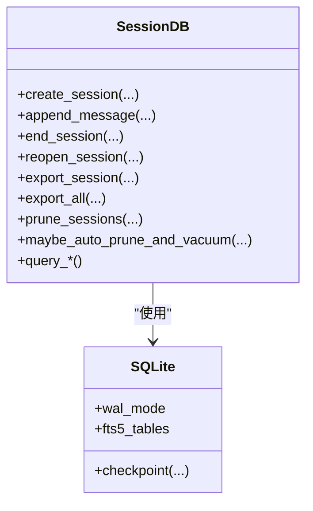
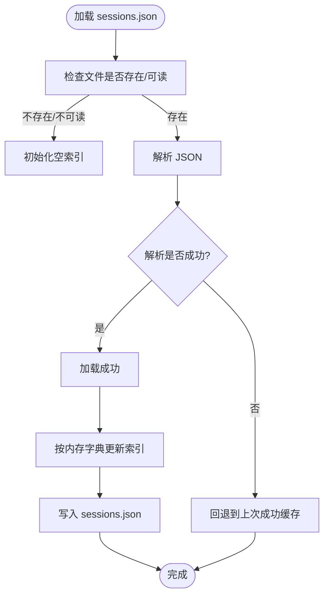
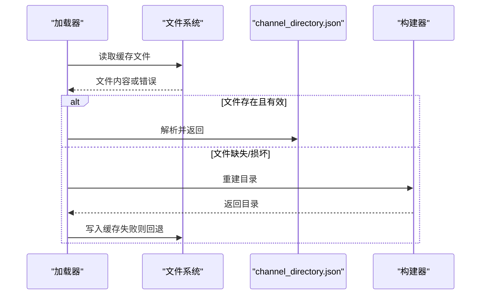
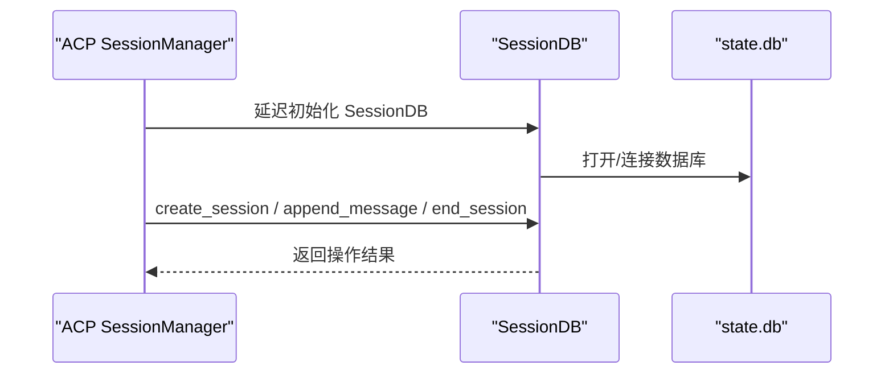
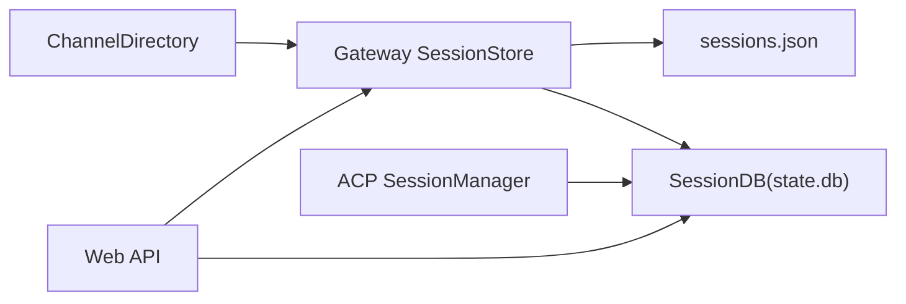

# 会话数据访问

<cite>
**本文引用的文件**
- [hermes_state.py](file://hermes_state.py)
- [gateway/session.py](file://gateway/session.py)
- [gateway/channel_directory.py](file://gateway/channel_directory.py)
- [acp_adapter/session.py](file://acp_adapter/session.py)
- [web/src/lib/api.ts](file://web/src/lib/api.ts)
- [website/docs/developer-guide/session-storage.md](file://website/docs/developer-guide/session-storage.md)
- [website/i18n/zh-Hans/docusaurus-plugin-content-docs/current/developer-guide/session-storage.md](file://website/i18n/zh-Hans/docusaurus-plugin-content-docs/current/developer-guide/session-storage.md)
- [website/docs/user-guide/sessions.md](file://website/docs/user-guide/sessions.md)
- [website/i18n/zh-Hans/docusaurus-plugin-content-docs/current/user-guide/sessions.md](file://website/i18n/zh-Hans/docusaurus-plugin-content-docs/current/user-guide/sessions.md)
- [tests/gateway/test_channel_directory.py](file://tests/gateway/test_channel_directory.py)
- [tests/gateway/test_session_store_prune.py](file://tests/gateway/test_session_store_prune.py)
- [tests/acp/test_session_db_private_access.py](file://tests/acp/test_session_db_private_access.py)
- [cli.py](file://cli.py)
</cite>

## 目录
1. [简介](#简介)
2. [项目结构](#项目结构)
3. [核心组件](#核心组件)
4. [架构总览](#架构总览)
5. [详细组件分析](#详细组件分析)
6. [依赖分析](#依赖分析)
7. [性能考虑](#性能考虑)
8. [故障排除指南](#故障排除指南)
9. [结论](#结论)
10. [附录](#附录)

## 简介
本文件聚焦MCP服务器（以及更广泛的会话数据体系）的会话数据访问机制，系统性阐述以下主题：
- 会话数据库访问模式：以SessionDB为核心的SQLite/WAL持久化、FTS5全文检索、并发写入控制与自动清理。
- sessions.json索引加载与通道目录缓存：Gateway侧的会话路由索引与通道目录缓存的加载、校验与回退策略。
- 性能优化策略：mtime缓存、文件监控与增量更新机制。
- 会话数据结构定义、字段映射与数据转换逻辑。
- 数据一致性保证、并发访问控制与错误恢复机制。
- 监控指标、性能基准与故障排除指南。

## 项目结构
围绕会话数据访问的核心文件分布如下：
- hermes_state.py：定义SessionDB类，提供SQLite/WAL持久化、FTS5全文检索、批量导出与清理等能力。
- gateway/session.py：Gateway侧会话存储与路由索引（sessions.json）管理，含内存字典与磁盘索引的维护。
- gateway/channel_directory.py：通道目录缓存（channel_directory.json）的构建、加载与显示格式化。
- acp_adapter/session.py：ACP适配器的会话管理与与SessionDB的持久化集成。
- web/src/lib/api.ts：前端会话API（列表、消息、删除、批量删除、重命名、导出、清理等）。
- 文档：developer-guide/session-storage.md与user-guide/sessions.md，提供架构、Schema与运维建议。
- 测试：test_channel_directory.py与test_session_store_prune.py等，验证索引与清理行为。

图表来源
- [hermes_state.py](file://hermes_state.py)
- [gateway/session.py](file://gateway/session.py)
- [gateway/channel_directory.py](file://gateway/channel_directory.py)
- [acp_adapter/session.py](file://acp_adapter/session.py)
- [web/src/lib/api.ts](file://web/src/lib/api.ts)

章节来源
- [website/docs/developer-guide/session-storage.md](file://website/docs/developer-guide/session-storage.md)
- [website/i18n/zh-Hans/docusaurus-plugin-content-docs/current/developer-guide/session-storage.md](file://website/i18n/zh-Hans/docusaurus-plugin-content-docs/current/developer-guide/session-storage.md)
- [website/docs/user-guide/sessions.md](file://website/docs/user-guide/sessions.md)
- [website/i18n/zh-Hans/docusaurus-plugin-content-docs/current/user-guide/sessions.md](file://website/i18n/zh-Hans/docusaurus-plugin-content-docs/current/user-guide/sessions.md)

## 核心组件
- SessionDB（hermes_state.py）
  - SQLite/WAL模式，支持并发读取与单写入。
  - FTS5虚拟表支持全文检索（messages_fts、messages_fts_trigram）。
  - 提供会话创建、消息追加、结束/重开、导出、清理、统计查询等接口。
  - 写入竞争处理：短超时、应用层重试、BEGIN IMMEDIATE、周期性WAL检查点。
- Gateway SessionStore（gateway/session.py）
  - 维护内存会话字典与sessions.json索引文件。
  - 支持按平台/聊天ID/线程ID/用户ID构造会话键，实现路由与恢复。
  - 支持会话清理（prune_old_entries），保留挂起与活跃进程会话。
- ChannelDirectory（gateway/channel_directory.py）
  - 加载/构建channel_directory.json缓存，提供通道名称解析与展示格式化。
  - 对损坏文件进行容错处理，保留旧缓存。
- ACP SessionManager（acp_adapter/session.py）
  - 跟踪ACP活跃会话，持久化至共享SessionDB（state.db）。
  - 与AIAgent回调桥接，支持fork、取消、工作目录绑定等。
- Web API（web/src/lib/api.ts）
  - 提供会话列表、消息获取、删除、批量删除、重命名、导出、清理等REST接口。

章节来源
- [hermes_state.py](file://hermes_state.py)
- [gateway/session.py](file://gateway/session.py)
- [gateway/channel_directory.py](file://gateway/channel_directory.py)
- [acp_adapter/session.py](file://acp_adapter/session.py)
- [web/src/lib/api.ts](file://web/src/lib/api.ts)

## 架构总览
下图展示了会话数据在不同组件间的流向与一致性约束：

图表来源
- [gateway/session.py](file://gateway/session.py)
- [gateway/channel_directory.py](file://gateway/channel_directory.py)
- [hermes_state.py](file://hermes_state.py)

## 详细组件分析

### SessionDB（会话数据库）
- 数据结构与Schema
  - sessions表：会话元数据（id、source、user_id、model、title、timestamps、token counts等）。
  - messages表：完整消息历史（role、content、tool_calls、tool_name、token_count）。
  - messages_fts/messages_fts_trigram：FTS5虚拟表，支持全文检索与CJK子串检索。
  - state_meta/schema_version：元数据与迁移版本跟踪。
- 关键能力
  - 会话创建/结束/重开、消息追加、导出单个/全部会话、清理过期会话、统计查询。
  - WAL模式与FTS5提升并发与检索效率。
- 并发与一致性
  - 短SQLite超时（1秒）、应用层重试（20–150ms，最多15次）、BEGIN IMMEDIATE事务、每50次写入一次WAL检查点（PASSIVE）。
  - 避免“车队效应”（convoy effect），降低锁竞争导致的全局退避。
- 数据清理与维护
  - 支持按older_than_days清理已结束会话，清理后执行VACUUM回收空间。
  - 最小间隔控制（min_interval_hours）防止频繁清理。

图表来源
- [hermes_state.py](file://hermes_state.py)
- [website/docs/developer-guide/session-storage.md](file://website/docs/developer-guide/session-storage.md)
- [website/i18n/zh-Hans/docusaurus-plugin-content-docs/current/developer-guide/session-storage.md](file://website/i18n/zh-Hans/docusaurus-plugin-content-docs/current/developer-guide/session-storage.md)

章节来源
- [hermes_state.py](file://hermes_state.py)
- [website/docs/developer-guide/session-storage.md](file://website/docs/developer-guide/session-storage.md)
- [website/i18n/zh-Hans/docusaurus-plugin-content-docs/current/developer-guide/session-storage.md](file://website/i18n/zh-Hans/docusaurus-plugin-content-docs/current/developer-guide/session-storage.md)

### Gateway SessionStore 与 sessions.json 索引
- 会话键构造
  - 基于平台、聊天ID、线程ID、用户ID组合生成稳定键，用于路由与恢复。
- 内存字典与磁盘索引
  - 内存中维护会话字典，定期写入sessions.json，确保重启后可恢复。
  - sessions.json包含updated_at、过期标记、来源元数据等。
- 清理策略
  - 保留挂起（suspended）会话与存在活跃进程的会话。
  - 以updated_at为准判断过期，支持按max_age_days裁剪。
- 错误恢复
  - 写入失败时保留旧缓存，避免丢失。

图表来源
- [gateway/session.py](file://gateway/session.py)
- [tests/gateway/test_session_store_prune.py](file://tests/gateway/test_session_store_prune.py)

章节来源
- [gateway/session.py](file://gateway/session.py)
- [tests/gateway/test_session_store_prune.py](file://tests/gateway/test_session_store_prune.py)

### ChannelDirectory 与通道目录缓存
- 功能
  - 构建/加载channel_directory.json，提供平台通道名称解析与展示格式化。
  - 支持从sessions表与平台特定规则构建目录。
- 容错
  - 损坏文件时返回空/旧缓存，避免影响服务启动。
- 测试覆盖
  - 验证缺失文件、有效文件、损坏文件、写入失败保留旧缓存等场景。

图表来源
- [gateway/channel_directory.py](file://gateway/channel_directory.py)
- [tests/gateway/test_channel_directory.py](file://tests/gateway/test_channel_directory.py)

章节来源
- [gateway/channel_directory.py](file://gateway/channel_directory.py)
- [tests/gateway/test_channel_directory.py](file://tests/gateway/test_channel_directory.py)

### ACP 会话管理与 SessionDB 持久化
- 会话管理
  - SessionManager跟踪ACP活跃会话，支持创建、获取、移除、fork、列表、清理、工作目录更新等。
- 与SessionDB集成
  - 通过延迟初始化SessionDB实例，将ACP会话持久化到共享state.db，实现跨进程恢复与搜索。
- 并发与一致性
  - 依赖SessionDB的写入竞争处理与WAL模式，确保多进程并发写入的安全性。

图表来源
- [acp_adapter/session.py](file://acp_adapter/session.py)
- [hermes_state.py](file://hermes_state.py)

章节来源
- [acp_adapter/session.py](file://acp_adapter/session.py)
- [tests/acp/test_session_db_private_access.py](file://tests/acp/test_session_db_private_access.py)

### Web API 与会话数据访问
- 接口能力
  - 列表、消息、删除、批量删除、重命名、导出、清理等。
- 会话数据来源
  - Gateway侧sessions.json索引与SessionDB（state.db）共同支撑。
- 安全与鉴权
  - 前端通过会话令牌头传递，配合后端鉴权策略。

章节来源
- [web/src/lib/api.ts](file://web/src/lib/api.ts)
- [website/docs/user-guide/sessions.md](file://website/docs/user-guide/sessions.md)
- [website/i18n/zh-Hans/docusaurus-plugin-content-docs/current/user-guide/sessions.md](file://website/i18n/zh-Hans/docusaurus-plugin-content-docs/current/user-guide/sessions.md)

## 依赖分析
- 组件耦合
  - Gateway SessionStore依赖sessions.json索引与SessionDB。
  - ChannelDirectory依赖Gateway会话信息与平台规则。
  - ACP SessionManager依赖SessionDB实现跨进程持久化。
  - Web API同时依赖Gateway索引与SessionDB。
- 外部依赖
  - SQLite/WAL与FTS5（SessionDB）。
  - 文件系统（sessions.json、channel_directory.json、state.db）。
- 循环依赖
  - 无直接循环依赖；各组件通过SessionDB形成统一数据源。

图表来源
- [gateway/session.py](file://gateway/session.py)
- [gateway/channel_directory.py](file://gateway/channel_directory.py)
- [acp_adapter/session.py](file://acp_adapter/session.py)
- [web/src/lib/api.ts](file://web/src/lib/api.ts)
- [hermes_state.py](file://hermes_state.py)

章节来源
- [gateway/session.py](file://gateway/session.py)
- [gateway/channel_directory.py](file://gateway/channel_directory.py)
- [acp_adapter/session.py](file://acp_adapter/session.py)
- [web/src/lib/api.ts](file://web/src/lib/api.ts)
- [hermes_state.py](file://hermes_state.py)

## 性能考虑
- mtime缓存与文件监控
  - sessions.json与channel_directory.json采用mtime缓存，减少频繁IO。
  - 文件变更触发增量更新，避免全量重建。
- 并发写入优化
  - SessionDB使用短超时与应用层重试，BEGIN IMMEDIATE暴露锁竞争，WAL检查点降低写放大。
- 检索加速
  - FTS5虚拟表支持全文检索，messages_fts_trigram增强CJK与子串匹配。
- 清理与空间回收
  - prune_sessions后执行VACUUM回收空间，min_interval_hours限制清理频率。
- 前端与网关协同
  - Gateway索引与SessionDB双写，前端优先读取索引，必要时回退到数据库。

章节来源
- [website/docs/developer-guide/session-storage.md](file://website/docs/developer-guide/session-storage.md)
- [website/i18n/zh-Hans/docusaurus-plugin-content-docs/current/developer-guide/session-storage.md](file://website/i18n/zh-Hans/docusaurus-plugin-content-docs/current/developer-guide/session-storage.md)
- [gateway/session.py](file://gateway/session.py)
- [gateway/channel_directory.py](file://gateway/channel_directory.py)

## 故障排除指南
- sessions.json损坏或写入失败
  - 现象：Gateway启动或更新索引失败。
  - 处理：检查文件权限与磁盘空间；若写入失败，系统会回退到上次成功缓存。
  - 参考测试：验证写入失败保留旧缓存的行为。
- channel_directory.json异常
  - 现象：通道名称解析为空或报错。
  - 处理：确认缓存文件可读；若损坏，系统会回退到上次缓存；必要时重建。
  - 参考测试：缺失/损坏/有效文件场景。
- SessionDB写入冲突
  - 现象：并发写入报超时或重试。
  - 处理：确认重试配置与WAL检查点策略；避免短时间大量写入。
- 清理策略误判
  - 现象：会话被提前清理。
  - 处理：检查max_age_days、suspended标记与活跃进程状态；确认updated_at逻辑。
- CLI/Gateway启动慢
  - 现象：启动时进行自动清理或索引重建。
  - 处理：调整min_interval_hours与retention_days；检查state.db大小与WAL状态。

章节来源
- [tests/gateway/test_channel_directory.py](file://tests/gateway/test_channel_directory.py)
- [tests/gateway/test_session_store_prune.py](file://tests/gateway/test_session_store_prune.py)
- [website/docs/developer-guide/session-storage.md](file://website/docs/developer-guide/session-storage.md)
- [website/i18n/zh-Hans/docusaurus-plugin-content-docs/current/developer-guide/session-storage.md](file://website/i18n/zh-Hans/docusaurus-plugin-content-docs/current/developer-guide/session-storage.md)

## 结论
本文从架构、组件、性能与运维四个维度梳理了MCP服务器的会话数据访问机制。SessionDB作为核心存储，结合Gateway索引与通道缓存，实现了高并发、可恢复、可搜索的会话管理。通过mtime缓存、增量更新、FTS5检索与写入竞争处理，系统在复杂多进程场景下仍能保持一致性和稳定性。建议在生产环境中合理配置清理策略与监控指标，持续优化写入负载与检索性能。

## 附录
- 数据访问监控指标建议
  - SessionDB：写入QPS、平均写入耗时、重试次数、WAL检查点频率、VACUUM耗时。
  - Gateway：索引加载耗时、sessions.json写入失败率、活跃会话数量、清理条目数。
  - ChannelDirectory：缓存命中率、重建次数、解析失败率。
  - Web API：会话列表/消息响应时间、删除/导出成功率、错误码分布。
- 性能基准
  - 建议在与生产相近的硬件与负载条件下，评估不同清理策略、索引大小与FTS5检索对吞吐与延迟的影响。
- 相关实现参考
  - SessionDB写入竞争处理与清理逻辑。
  - Gateway索引加载与清理策略。
  - 通道目录缓存加载与容错。
  - ACP会话管理与SessionDB集成。