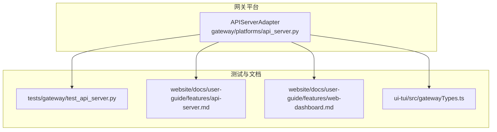
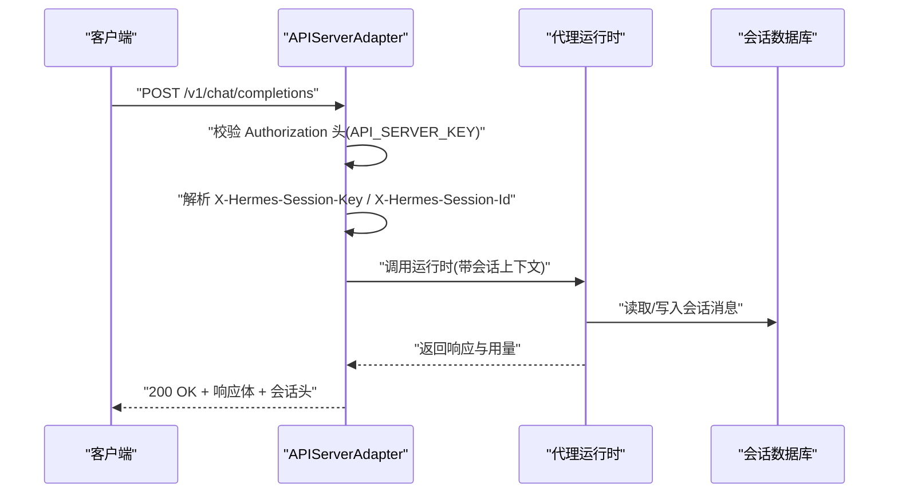
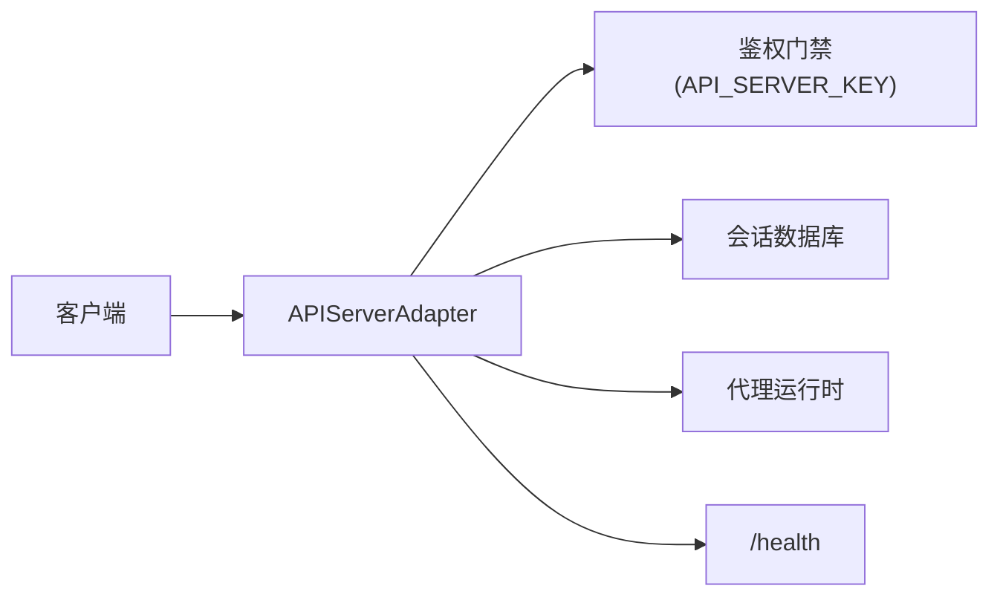

# REST API

<cite>
**本文引用的文件**
- [api_server.py](file://gateway/platforms/api_server.py)
- [test_api_server.py](file://tests/gateway/test_api_server.py)
- [test_session_api.py](file://tests/gateway/test_session_api.py)
- [api-server.md](file://website/docs/user-guide/features/api-server.md)
- [web-dashboard.md](file://website/docs/user-guide/features/web-dashboard.md)
- [gatewayTypes.ts](file://ui-tui/src/gatewayTypes.ts)
- [test_webhook_signature_rate_limit.py](file://tests/gateway/test_webhook_signature_rate_limit.py)
</cite>

## 目录
1. [简介](#简介)
2. [项目结构](#项目结构)
3. [核心组件](#核心组件)
4. [架构总览](#架构总览)
5. [详细组件分析](#详细组件分析)
6. [依赖关系分析](#依赖关系分析)
7. [性能考量](#性能考量)
8. [故障排查指南](#故障排查指南)
9. [结论](#结论)
10. [附录](#附录)

## 简介
本文件为 Hermes Agent 的 REST API 文档，覆盖以下核心端点与能力：
- /v1/chat/completions：OpenAI 兼容的聊天补全接口
- /v1/responses：OpenAI Responses API 兼容接口
- /v1/models：模型列表查询
- /api/sessions/*：会话生命周期与消息历史管理
- /health：健康检查

文档内容基于仓库中的测试用例、用户指南与类型定义，涵盖认证方式、请求头规范、数据格式、状态码、错误处理、速率限制与版本控制，并提供面向 OpenAI 兼容前端的集成建议。

## 项目结构
Hermes 的 API 服务由网关平台模块提供，核心适配器负责路由注册、鉴权与业务编排；相关行为通过测试用例与用户指南明确。

图表来源
- [api_server.py](file://gateway/platforms/api_server.py)
- [test_api_server.py](file://tests/gateway/test_api_server.py)
- [api-server.md](file://website/docs/user-guide/features/api-server.md)
- [web-dashboard.md](file://website/docs/user-guide/features/web-dashboard.md)
- [gatewayTypes.ts](file://ui-tui/src/gatewayTypes.ts)

章节来源
- [api_server.py](file://gateway/platforms/api_server.py)
- [test_api_server.py](file://tests/gateway/test_api_server.py)
- [api-server.md](file://website/docs/user-guide/features/api-server.md)

## 核心组件
- APIServerAdapter：负责加载配置、注册路由、执行鉴权与会话控制、调用代理运行时并返回结果。
- 认证与安全：统一通过 API_SERVER_KEY 进行鉴权；部分绑定策略对网络可达性进行安全约束。
- 会话管理：支持创建、读取、更新、删除、分支、消息历史查询与单轮同步/流式对话。
- OpenAI 兼容：/v1/chat/completions 与 /v1/responses 提供 OpenAI 风格的输入输出结构。

章节来源
- [api_server.py](file://gateway/platforms/api_server.py)
- [test_api_server.py](file://tests/gateway/test_api_server.py)
- [api-server.md](file://website/docs/user-guide/features/api-server.md)

## 架构总览
下图展示了客户端与 API 服务器之间的交互流程，以及关键的鉴权与会话头处理逻辑。

图表来源
- [api_server.py](file://gateway/platforms/api_server.py)
- [test_api_server.py](file://tests/gateway/test_api_server.py)

## 详细组件分析

### /v1/chat/completions（OpenAI 兼容）
- 方法与路径
  - POST /v1/chat/completions
- 请求头
  - Authorization: Bearer API_SERVER_KEY
  - 可选：X-Hermes-Session-Key（内存作用域）、X-Hermes-Session-Id（转录作用域）
- 请求体字段
  - model: 字符串，目标模型标识
  - messages: 数组，每项包含 role 与 content
  - 其他 OpenAI 兼容字段按需支持（具体以实现为准）
- 响应体
  - 包含最终回复、消息链、调用次数等字段
  - 返回头可能包含 X-Hermes-Session-Key 与 X-Hermes-Session-Id
- 状态码
  - 200 成功
  - 400 参数无效或 JSON 解析失败
  - 401 缺少或无效 API_SERVER_KEY
  - 403 会话键未授权（无 API_SERVER_KEY 时拒绝外部传入的会话键）
  - 429 速率限制
- 安全与会话
  - 会话键与会话 ID 分离，分别控制记忆范围与对话历史范围
  - 会话键中若包含控制字符将被拒绝
- 错误处理
  - 输入缺失、JSON 非法、签名验证失败（如适用）等场景返回 400
  - 鉴权失败返回 401
  - 无权限设置会话键返回 403
  - 超出配额返回 429
- 示例
  - 请求：携带 Authorization 与可选会话头，messages 采用 OpenAI 风格
  - 响应：包含最终回复与用量统计

章节来源
- [test_api_server.py](file://tests/gateway/test_api_server.py)
- [api-server.md](file://website/docs/user-guide/features/api-server.md)

### /v1/responses（OpenAI Responses API 兼容）
- 方法与路径
  - POST /v1/responses
- 请求头
  - Authorization: Bearer API_SERVER_KEY
- 请求体字段
  - model: 字符串
  - input: 支持字符串或结构化数组（多模态时包含文本与图像）
  - previous_response_id: 可选，用于链式续写
- 响应体
  - 包含响应对象、状态、输出序列（含函数调用、工具结果、消息等）与用量
- 状态码
  - 200 成功
  - 400 缺少 input 或 JSON 非法
  - 401 缺少或无效 API_SERVER_KEY
  - 429 速率限制
- 示例
  - 单轮请求：input 为字符串或结构化数组
  - 多轮续写：携带 previous_response_id 以重建完整上下文

章节来源
- [test_api_server.py](file://tests/gateway/test_api_server.py)
- [api-server.md](file://website/docs/user-guide/features/api-server.md)

### /v1/models（模型列表）
- 方法与路径
  - GET /v1/models
- 请求头
  - Authorization: Bearer API_SERVER_KEY
- 响应体
  - 模型列表，字段结构遵循 OpenAI 兼容风格
- 状态码
  - 200 成功
  - 401 缺少或无效 API_SERVER_KEY
  - 429 速率限制
- 示例
  - 返回可用模型清单，便于前端选择与显示

章节来源
- [test_api_server.py](file://tests/gateway/test_api_server.py)
- [api-server.md](file://website/docs/user-guide/features/api-server.md)

### /api/sessions/*（会话管理）
- 方法与路径
  - GET /api/sessions：列出会话（支持分页与过滤）
  - POST /api/sessions：创建空会话
  - GET /api/sessions/{id}：读取会话元数据
  - PATCH /api/sessions/{id}：更新标题或结束原因
  - DELETE /api/sessions/{id}：删除会话
  - GET /api/sessions/{id}/messages：获取会话消息历史
  - POST /api/sessions/{id}/fork：分支会话
  - POST /api/sessions/{id}/chat：单轮同步对话
  - POST /api/sessions/{id}/chat/stream：SSE 流式事件
- 请求头
  - Authorization: Bearer API_SERVER_KEY
  - 可选：X-Hermes-Session-Key（当需要外部控制记忆作用域时，必须同时提供 API_SERVER_KEY）
- 响应体
  - 各端点返回结构参考类型定义与用户指南
- 状态码
  - 200 成功
  - 400 参数无效或 JSON 非法
  - 401 缺少或无效 API_SERVER_KEY
  - 403 无 API_SERVER_KEY 时拒绝外部传入的会话键
  - 404 会话不存在
  - 429 速率限制
- 示例
  - 分支并运行一轮：先 fork，再 chat
  - 流式对话：SSE 推送 assistant.delta、tool.started、tool.completed、run.completed

章节来源
- [test_session_api.py](file://tests/gateway/test_session_api.py)
- [api-server.md](file://website/docs/user-guide/features/api-server.md)
- [gatewayTypes.ts](file://ui-tui/src/gatewayTypes.ts)

### /health（健康检查）
- 方法与路径
  - GET /health
- 请求头
  - 不需要 API_SERVER_KEY
- 响应体
  - 200 OK 表示服务健康
- 状态码
  - 200 成功
  - 其他：异常情况

章节来源
- [test_api_server.py](file://tests/gateway/test_api_server.py)

## 依赖关系分析
- 组件耦合
  - APIServerAdapter 依赖配置加载、鉴权门禁、会话数据库与代理运行时
  - 会话 API 与聊天补全共享相同的鉴权与速率限制机制
- 外部依赖
  - 测试用例依赖 aiohttp TestClient/TestServer 进行端到端验证
  - 用户指南与类型定义为前端集成提供契约与示例

图表来源
- [api_server.py](file://gateway/platforms/api_server.py)
- [test_api_server.py](file://tests/gateway/test_api_server.py)

章节来源
- [api_server.py](file://gateway/platforms/api_server.py)
- [test_api_server.py](file://tests/gateway/test_api_server.py)

## 性能考量
- 速率限制
  - 鉴权失败与有效请求均受速率限制保护，窗口内尝试次数过多将触发 429
- 并发与绑定安全
  - 对外网绑定与回环绑定设置了安全阈值，需配合 API_SERVER_KEY 使用
- 流式传输
  - /api/sessions/{id}/chat/stream 采用 SSE，适合长轮询与实时反馈场景

章节来源
- [test_api_server.py](file://tests/gateway/test_api_server.py)
- [test_webhook_signature_rate_limit.py](file://tests/gateway/test_webhook_signature_rate_limit.py)

## 故障排查指南
- 401 未授权
  - 检查 Authorization 头是否为 Bearer API_SERVER_KEY
- 403 会话键拒绝
  - 无 API_SERVER_KEY 时，外部提供的 X-Hermes-Session-Key 将被拒绝
- 400 参数错误
  - 确认 JSON 格式正确，必要字段齐全（如 /v1/responses 的 input）
- 429 速率限制
  - 观察短时间内请求频率，适当退避重试
- 绑定安全
  - 对外网绑定或回环绑定需配置 API_SERVER_KEY，否则连接会被拒绝

章节来源
- [test_api_server.py](file://tests/gateway/test_api_server.py)
- [test_session_api.py](file://tests/gateway/test_session_api.py)
- [test_webhook_signature_rate_limit.py](file://tests/gateway/test_webhook_signature_rate_limit.py)

## 结论
Hermes Agent 的 REST API 以 OpenAI 兼容为核心，辅以细粒度的会话控制与严格的安全边界。通过统一的 API_SERVER_KEY 鉴权与会话头分离设计，既满足外部 UI 的会话管理需求，又确保了安全性与可扩展性。建议在生产环境中：
- 明确区分会话键与会话 ID 的作用域
- 在对外网暴露时务必配置 API_SERVER_KEY
- 使用速率限制与健康检查保障稳定性
- 优先采用 /api/sessions/* 进行会话生命周期管理，结合 /v1/chat/completions 实现多轮对话

## 附录

### 版本控制与兼容性
- OpenAI 兼容端点：/v1/chat/completions、/v1/responses、/v1/models
- 会话管理端点：/api/sessions/*
- 健康检查：/health

章节来源
- [api-server.md](file://website/docs/user-guide/features/api-server.md)
- [web-dashboard.md](file://website/docs/user-guide/features/web-dashboard.md)