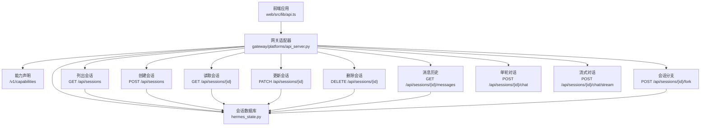
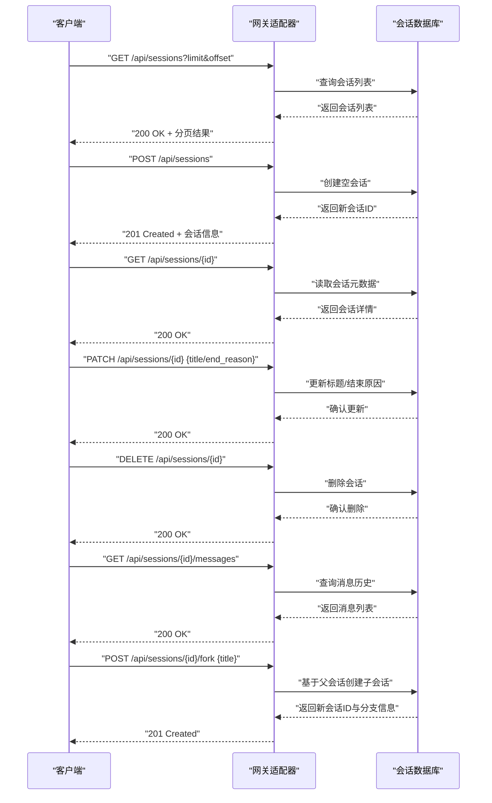
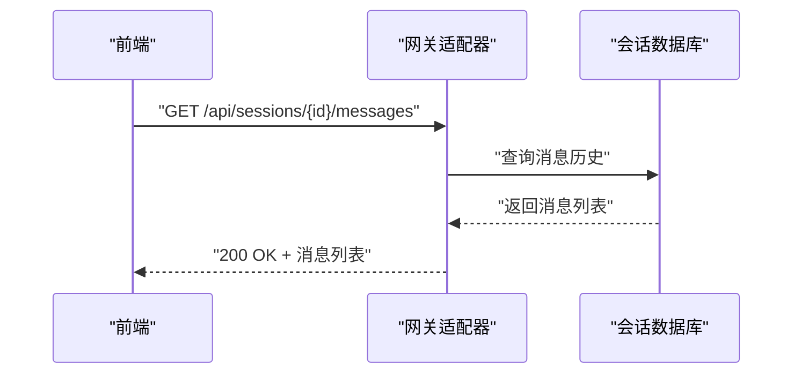
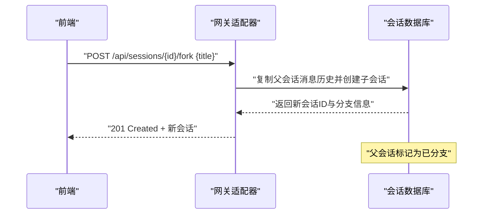
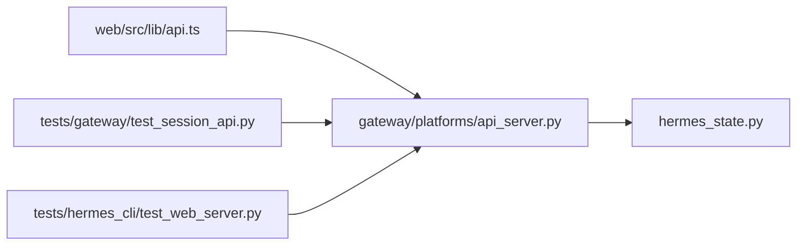

# 会话管理端点

<cite>
**本文引用的文件**
- [api_server.py](file://gateway/platforms/api_server.py)
- [api.ts](file://web/src/lib/api.ts)
- [api-server.md](file://website/docs/user-guide/features/api-server.md)
- [test_session_api.py](file://tests/gateway/test_session_api.py)
- [test_web_server.py](file://tests/hermes_cli/test_web_server.py)
- [hermes_state.py](file://hermes_state.py)
</cite>

## 目录
1. [简介](#简介)
2. [项目结构](#项目结构)
3. [核心组件](#核心组件)
4. [架构总览](#架构总览)
5. [详细组件分析](#详细组件分析)
6. [依赖关系分析](#依赖关系分析)
7. [性能考虑](#性能考虑)
8. [故障排查指南](#故障排查指南)
9. [结论](#结论)
10. [附录](#附录)

## 简介
本文件面向会话管理相关REST端点的使用者与维护者，系统性梳理以下接口族的规范与实现要点：
- 会话列表与创建：GET /api/sessions、POST /api/sessions
- 会话元数据：GET/PATCH/DELETE /api/sessions/{session_id}
- 消息历史：GET /api/sessions/{session_id}/messages
- 会话分支：POST /api/sessions/{session_id}/fork
- 能力声明：GET /v1/capabilities（用于前端检测能力）

同时，文档覆盖会话ID生成机制、状态管理与持久化策略、并发控制与一致性保障，并提供完整的调用示例与最佳实践建议。

## 项目结构
会话管理端点由网关平台适配器统一暴露，前端通过fetch封装进行调用，测试用例验证行为与路由顺序约束，后端状态存储由会话数据库模块负责。

图表来源
- [api_server.py](file://gateway/platforms/api_server.py)
- [api.ts](file://web/src/lib/api.ts)
- [hermes_state.py](file://hermes_state.py)

章节来源
- [api_server.py](file://gateway/platforms/api_server.py)
- [api.ts](file://web/src/lib/api.ts)
- [hermes_state.py](file://hermes_state.py)

## 核心组件
- 网关适配器：注册并实现所有会话相关端点，提供能力声明与鉴权门面。
- 会话数据库：提供会话创建、读取、更新、删除、消息追加与查询等底层能力。
- 前端API封装：统一的HTTP客户端，封装分页、消息历史、分支、批量删除等调用。
- 测试套件：覆盖鉴权、路由顺序、分支语义、消息一致性等关键行为。

章节来源
- [api_server.py](file://gateway/platforms/api_server.py)
- [hermes_state.py](file://hermes_state.py)
- [api.ts](file://web/src/lib/api.ts)
- [test_session_api.py](file://tests/gateway/test_session_api.py)

## 架构总览
会话管理端点遵循“能力先行、鉴权前置、路由明确”的设计原则：
- 能力声明：通过/v1/capabilities暴露支持的会话能力与端点路径，便于前端动态适配。
- 鉴权：所有会话端点均受API_SERVER_KEY保护，未携带或错误的密钥将返回401。
- 路由：严格定义了批量删除、空会话清理等特殊路由，避免与模板化{id}路由冲突。
- 数据一致性：基于会话数据库的行级操作与事务特性，确保分支、删除、更新的原子性。

图表来源
- [api_server.py](file://gateway/platforms/api_server.py)
- [hermes_state.py](file://hermes_state.py)

## 详细组件分析

### 会话列表与创建
- 列出会话
  - 方法与路径：GET /api/sessions
  - 查询参数：limit（默认值见实现）、offset（默认值见实现）、source（过滤来源）、include_children（是否包含子会话）
  - 返回：分页对象，包含会话数组及计数
  - 鉴权：需要API_SERVER_KEY
- 创建空会话
  - 方法与路径：POST /api/sessions
  - 请求体：可选字段如title、model等（以实现为准）
  - 返回：新建会话的完整信息
  - 鉴权：需要API_SERVER_KEY

章节来源
- [api_server.py](file://gateway/platforms/api_server.py)
- [api.ts](file://web/src/lib/api.ts)
- [test_session_api.py](file://tests/gateway/test_session_api.py)

### 会话元数据：读取、更新、删除
- 读取会话
  - 方法与路径：GET /api/sessions/{session_id}
  - 返回：会话元数据（含消息计数、标题、创建时间等）
- 更新会话
  - 方法与路径：PATCH /api/sessions/{session_id}
  - 请求体：title（重命名）、end_reason（结束原因）等
  - 返回：更新后的会话信息
- 删除会话
  - 方法与路径：DELETE /api/sessions/{session_id}
  - 返回：删除确认对象
  - 并发注意：删除可能触发分支会话的end_reason标记（参见分支章节）

章节来源
- [api_server.py](file://gateway/platforms/api_server.py)
- [api.ts](file://web/src/lib/api.ts)
- [test_session_api.py](file://tests/gateway/test_session_api.py)

### 消息历史获取
- 接口：GET /api/sessions/{session_id}/messages
- 行为：返回指定会话的消息历史列表，按插入顺序排列
- 使用场景：UI渲染、调试、导出、分析
- 前端封装：web/src/lib/api.ts中提供getSessionMessages方法，支持分页参数

图表来源
- [api_server.py](file://gateway/platforms/api_server.py)
- [hermes_state.py](file://hermes_state.py)
- [api.ts](file://web/src/lib/api.ts)

章节来源
- [api_server.py](file://gateway/platforms/api_server.py)
- [api.ts](file://web/src/lib/api.ts)
- [test_session_api.py](file://tests/gateway/test_session_api.py)

### 会话分支（fork）
- 接口：POST /api/sessions/{session_id}/fork
- 请求体：title（子会话标题），其他字段以实现为准
- 行为：
  - 基于父会话复制当前消息历史
  - 设置子会话的parent_session_id指向父会话
  - 将父会话的end_reason标记为“branched”，防止后续继续写入
- 使用场景：探索不同思路、A/B对比、并行实验
- 并发注意：fork操作在数据库层面保证原子性；前端应避免在fork后立即对父会话写入

图表来源
- [api_server.py](file://gateway/platforms/api_server.py)
- [hermes_state.py](file://hermes_state.py)
- [test_session_api.py](file://tests/gateway/test_session_api.py)

章节来源
- [api_server.py](file://gateway/platforms/api_server.py)
- [test_session_api.py](file://tests/gateway/test_session_api.py)

### 能力声明与路由顺序
- 能力声明：GET /v1/capabilities
  - 返回：包含session_*能力标志与endpoint条目，前端据此动态启用/降级
- 路由顺序约束：
  - POST /api/sessions/bulk-delete必须优先于模板路由 /api/sessions/{session_id}，避免被重写
  - 测试用例确保该契约不被回退

章节来源
- [api_server.py](file://gateway/platforms/api_server.py)
- [test_web_server.py](file://tests/hermes_cli/test_web_server.py)

## 依赖关系分析
- 网关适配器依赖会话数据库模块完成CRUD与分支操作
- 前端API封装依赖网关适配器提供的端点
- 测试用例覆盖鉴权、路由顺序、分支一致性等关键路径

图表来源
- [api_server.py](file://gateway/platforms/api_server.py)
- [hermes_state.py](file://hermes_state.py)
- [api.ts](file://web/src/lib/api.ts)
- [test_session_api.py](file://tests/gateway/test_session_api.py)
- [test_web_server.py](file://tests/hermes_cli/test_web_server.py)

章节来源
- [api_server.py](file://gateway/platforms/api_server.py)
- [hermes_state.py](file://hermes_state.py)
- [api.ts](file://web/src/lib/api.ts)
- [test_session_api.py](file://tests/gateway/test_session_api.py)
- [test_web_server.py](file://tests/hermes_cli/test_web_server.py)

## 性能考虑
- 分页与过滤：列表接口支持limit/offset/source/include_children，建议前端按需分页，避免一次性拉取过多数据
- 批量操作：提供批量删除与空会话清理端点，减少请求次数
- 流式对话：POST /api/sessions/{id}/chat/stream通过SSE传输，适合长文本与工具执行反馈
- 并发控制：分支与删除涉及状态变更，建议在UI层做防重复提交与乐观锁提示
- 存储优化：消息历史按插入顺序存储，建议定期归档或清理非活跃会话以降低查询开销

## 故障排查指南
- 401 未授权
  - 现象：所有会话端点返回401
  - 原因：缺少或错误的API_SERVER_KEY
  - 处理：检查Authorization头或配置项
- 路由冲突
  - 现象：POST /api/sessions/bulk-delete被解释为{id}模板
  - 原因：路由注册顺序不当
  - 处理：确保bulk-delete路由在{id}之前注册（测试已覆盖）
- 分支后父会话继续写入
  - 现象：fork后父会话仍可写入
  - 原因：预期行为是标记end_reason为“branched”
  - 处理：fork后请在子会话上继续交互
- 消息历史不一致
  - 现象：读取消息与实际UI显示不符
  - 原因：并发写入或缓存问题
  - 处理：刷新页面或重新获取消息历史

章节来源
- [test_web_server.py](file://tests/hermes_cli/test_web_server.py)
- [test_session_api.py](file://tests/gateway/test_session_api.py)

## 结论
会话管理端点提供了完整的生命周期管理能力：从创建、读取、更新到删除，再到消息历史查询与分支探索。通过能力声明与严格的路由顺序，前端可以安全地进行功能降级与适配。配合会话数据库的原子性操作与一致性保障，用户可以在多场景下高效、可靠地管理对话会话。

## 附录

### API端点一览与示例
- 列出会话
  - 方法：GET
  - 路径：/api/sessions
  - 示例：curl -H "Authorization: Bearer $API_SERVER_KEY" "$BASE/api/sessions?limit=20&offset=0"
- 创建空会话
  - 方法：POST
  - 路径：/api/sessions
  - 示例：curl -X POST -H "Authorization: Bearer $API_SERVER_KEY" -d '{}' "$BASE/api/sessions"
- 读取会话
  - 方法：GET
  - 路径：/api/sessions/{session_id}
- 更新会话
  - 方法：PATCH
  - 路径：/api/sessions/{session_id}
  - 示例：curl -X PATCH -H "Authorization: Bearer $API_SERVER_KEY" -d '{"title":"新标题"}' "$BASE/api/sessions/{session_id}"
- 删除会话
  - 方法：DELETE
  - 路径：/api/sessions/{session_id}
- 获取消息历史
  - 方法：GET
  - 路径：/api/sessions/{session_id}/messages
- 分支会话
  - 方法：POST
  - 路径：/api/sessions/{session_id}/fork
  - 示例：curl -X POST -H "Authorization: Bearer $API_SERVER_KEY" -d '{"title":"分支标题"}' "$BASE/api/sessions/{session_id}/fork"
- 单轮对话
  - 方法：POST
  - 路径：/api/sessions/{session_id}/chat
- 流式对话
  - 方法：POST
  - 路径：/api/sessions/{session_id}/chat/stream

章节来源
- [api-server.md](file://website/docs/user-guide/features/api-server.md)
- [api.ts](file://web/src/lib/api.ts)
- [test_session_api.py](file://tests/gateway/test_session_api.py)

### 会话ID生成机制与状态管理
- 生成机制
  - 会话ID由会话数据库模块负责生成与分配，确保全局唯一
  - 分支场景下，子会话ID与父会话ID存在父子关系标识
- 状态管理
  - end_reason：用于标记会话结束原因，如“branched”、“done”等
  - archived：归档状态，影响列表过滤与清理
  - message_count：消息计数，用于列表展示与统计
- 持久化策略
  - 会话元数据与消息历史持久化至数据库
  - 支持批量删除与空会话清理，减少磁盘占用

章节来源
- [hermes_state.py](file://hermes_state.py)
- [test_session_api.py](file://tests/gateway/test_session_api.py)