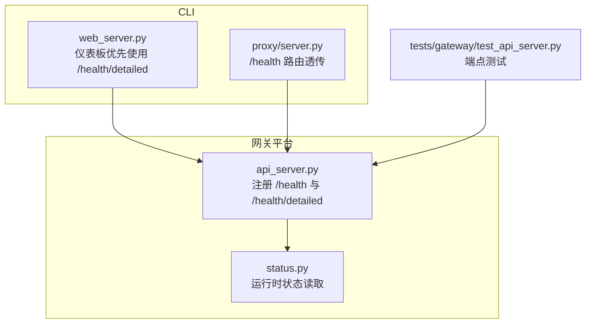
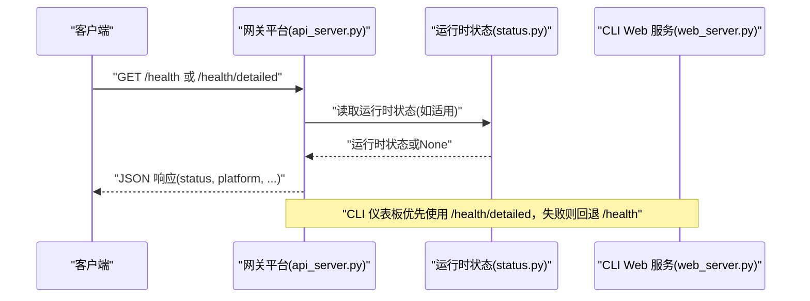
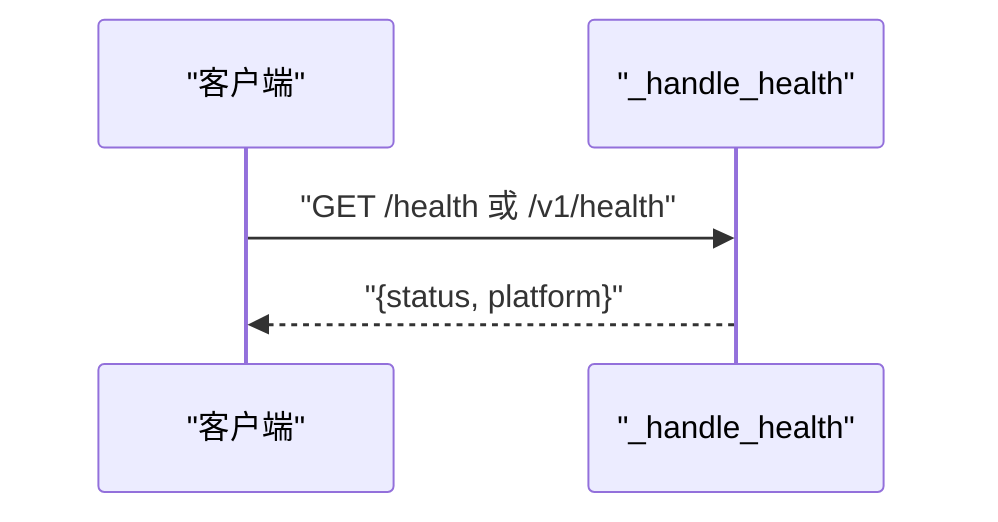
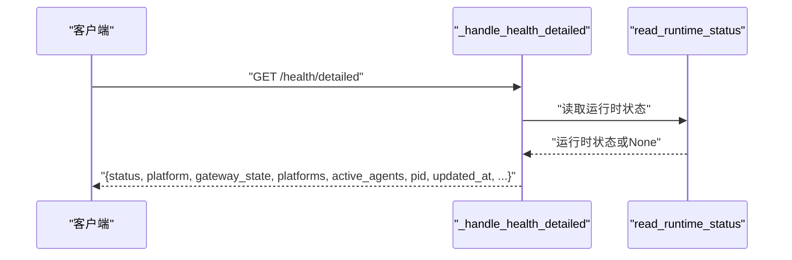
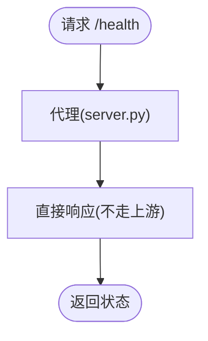
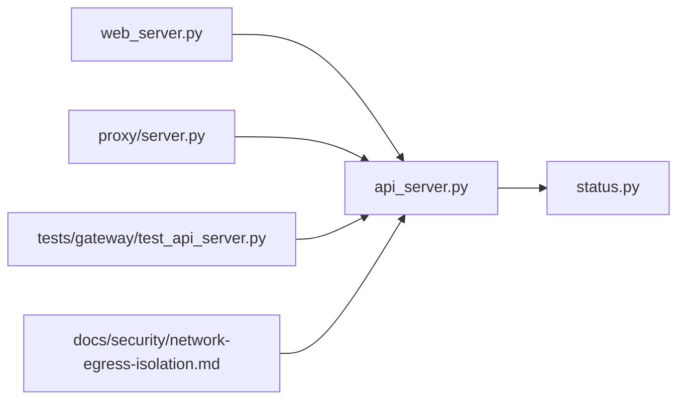

# 健康检查和监控端点

<cite>
**本文引用的文件**
- [gateway/platforms/api_server.py](file://gateway/platforms/api_server.py)
- [gateway/status.py](file://gateway/status.py)
- [hermes_cli/web_server.py](file://hermes_cli/web_server.py)
- [hermes_cli/proxy/server.py](file://hermes_cli/proxy/server.py)
- [tests/gateway/test_api_server.py](file://tests/gateway/test_api_server.py)
- [website/docs/user-guide/skills/optional/health/health-fitness-nutrition.md](file://website/docs/user-guide/skills/optional/health/health-fitness-nutrition.md)
- [website/docs/user-guide/skills/optional/health/health-neuroskill-bci.md](file://website/docs/user-guide/skills/optional/health/health-neuroskill-bci.md)
- [docs/security/network-egress-isolation.md](file://docs/security/network-egress-isolation.md)
</cite>

## 目录
1. [简介](#简介)
2. [项目结构](#项目结构)
3. [核心组件](#核心组件)
4. [架构总览](#架构总览)
5. [详细组件分析](#详细组件分析)
6. [依赖关系分析](#依赖关系分析)
7. [性能考量](#性能考量)
8. [故障排查指南](#故障排查指南)
9. [结论](#结论)
10. [附录](#附录)

## 简介
本文件面向健康检查与监控相关端点的使用者与运维人员，系统化梳理 /health 与 /health/detailed 两个端点的功能、触发条件、响应格式与状态判断逻辑，并提供在 Kubernetes、Docker Compose 等环境中的集成示例与最佳实践。同时给出监控指标的含义、采集频率与告警阈值建议，帮助实现稳定可靠的自愈与可观测体系。

## 项目结构
与健康检查和监控直接相关的模块分布如下：
- 网关平台层：提供 /health 与 /health/detailed 的路由注册与处理逻辑
- 运行时状态：提供运行态聚合信息（如网关状态、平台连接状态、活跃代理数等）
- CLI Web 服务：在仪表板场景中优先使用 /health/detailed 并回退到 /health
- 测试用例：覆盖端点返回字段与行为
- 文档与示例：包含网络可达性健康检查示例与健康技能文档

图表来源
- [gateway/platforms/api_server.py:1035-1045](file://gateway/platforms/api_server.py#L1035-L1045)
- [gateway/status.py](file://gateway/status.py)
- [hermes_cli/web_server.py:699-705](file://hermes_cli/web_server.py#L699-L705)
- [hermes_cli/proxy/server.py:234-235](file://hermes_cli/proxy/server.py#L234-L235)
- [tests/gateway/test_api_server.py:493-551](file://tests/gateway/test_api_server.py#L493-L551)

章节来源
- [gateway/platforms/api_server.py:21-22](file://gateway/platforms/api_server.py#L21-L22)
- [gateway/platforms/api_server.py:1035-1045](file://gateway/platforms/api_server.py#L1035-L1045)
- [gateway/platforms/api_server.py:4103-4105](file://gateway/platforms/api_server.py#L4103-L4105)
- [gateway/status.py](file://gateway/status.py)
- [hermes_cli/web_server.py:699-705](file://hermes_cli/web_server.py#L699-L705)
- [hermes_cli/proxy/server.py:234-235](file://hermes_cli/proxy/server.py#L234-L235)
- [tests/gateway/test_api_server.py:493-551](file://tests/gateway/test_api_server.py#L493-L551)

## 核心组件
- /health 端点
  - 功能：快速健康检查，返回服务可用性与平台标识
  - 响应字段：status、platform
  - 触发条件：HTTP GET 请求
  - 状态判断：HTTP 200 表示健康；测试断言 status=ok、platform=hermes-agent
- /health/detailed 端点
  - 功能：返回丰富的运行时状态，便于跨容器仪表板探测
  - 响应字段：status、platform、gateway_state、platforms、active_agents、pid、updated_at 等
  - 触发条件：HTTP GET 请求
  - 状态判断：HTTP 200 表示健康；当运行时状态缺失时，部分字段为 None
- v1 兼容别名
  - /v1/health 与 /health 返回相同内容

章节来源
- [gateway/platforms/api_server.py:21-22](file://gateway/platforms/api_server.py#L21-L22)
- [gateway/platforms/api_server.py:1035-1045](file://gateway/platforms/api_server.py#L1035-L1045)
- [gateway/platforms/api_server.py:1136-1137](file://gateway/platforms/api_server.py#L1136-L1137)
- [gateway/platforms/api_server.py:4103-4105](file://gateway/platforms/api_server.py#L4103-L4105)
- [tests/gateway/test_api_server.py:493-551](file://tests/gateway/test_api_server.py#L493-L551)

## 架构总览
下图展示了从客户端到网关平台再到运行时状态读取的整体调用链路，以及 CLI 在仪表板场景中的选择策略。

图表来源
- [gateway/platforms/api_server.py:1035-1045](file://gateway/platforms/api_server.py#L1035-L1045)
- [gateway/status.py](file://gateway/status.py)
- [hermes_cli/web_server.py:699-705](file://hermes_cli/web_server.py#L699-L705)

## 详细组件分析

### /health 端点
- 路由注册与处理
  - 注册路径：/health、/v1/health
  - 处理函数：_handle_health
- 响应格式
  - 必填字段：status、platform
  - 字段含义：status 表示健康状态；platform 标识平台名称
- 状态判断逻辑
  - HTTP 200 表示健康
  - 测试断言：status=ok、platform=hermes-agent
- 兼容性
  - /v1/health 与 /health 返回一致内容

图表来源
- [gateway/platforms/api_server.py:1035-1045](file://gateway/platforms/api_server.py#L1035-L1045)
- [gateway/platforms/api_server.py:4103-4105](file://gateway/platforms/api_server.py#L4103-L4105)
- [tests/gateway/test_api_server.py:493-510](file://tests/gateway/test_api_server.py#L493-L510)

章节来源
- [gateway/platforms/api_server.py:21-22](file://gateway/platforms/api_server.py#L21-L22)
- [gateway/platforms/api_server.py:1035-1045](file://gateway/platforms/api_server.py#L1035-L1045)
- [gateway/platforms/api_server.py:4103-4105](file://gateway/platforms/api_server.py#L4103-L4105)
- [tests/gateway/test_api_server.py:493-510](file://tests/gateway/test_api_server.py#L493-L510)

### /health/detailed 端点
- 路由注册与处理
  - 注册路径：/health/detailed
  - 处理函数：_handle_health_detailed
- 响应格式
  - 必填字段：status、platform
  - 可选字段：gateway_state、platforms、active_agents、pid、updated_at 等
  - 当运行时状态文件缺失时，运行时相关字段为 None
- 状态判断逻辑
  - HTTP 200 表示健康
  - 测试断言：status=ok、platform=hermes-agent、包含 pid、updated_at 等
- CLI 仪表板回退策略
  - 优先使用 /health/detailed，失败时回退到 /health

图表来源
- [gateway/platforms/api_server.py:1039-1045](file://gateway/platforms/api_server.py#L1039-L1045)
- [gateway/status.py](file://gateway/status.py)
- [tests/gateway/test_api_server.py:517-551](file://tests/gateway/test_api_server.py#L517-L551)
- [hermes_cli/web_server.py:699-705](file://hermes_cli/web_server.py#L699-L705)

章节来源
- [gateway/platforms/api_server.py:21-22](file://gateway/platforms/api_server.py#L21-L22)
- [gateway/platforms/api_server.py:1039-1045](file://gateway/platforms/api_server.py#L1039-L1045)
- [gateway/platforms/api_server.py:4103-4105](file://gateway/platforms/api_server.py#L4103-L4105)
- [gateway/status.py](file://gateway/status.py)
- [tests/gateway/test_api_server.py:517-551](file://tests/gateway/test_api_server.py#L517-L551)
- [hermes_cli/web_server.py:699-705](file://hermes_cli/web_server.py#L699-L705)

### CLI 代理与 /health
- 代理行为
  - /health 不经上游转发，直接由代理处理
- 用途
  - 用于 CLI 侧对网关健康状态的快速探测

图表来源
- [hermes_cli/proxy/server.py:234-235](file://hermes_cli/proxy/server.py#L234-L235)

章节来源
- [hermes_cli/proxy/server.py:234-235](file://hermes_cli/proxy/server.py#L234-L235)

## 依赖关系分析
- 组件耦合
  - 网关平台层负责路由与处理，运行时状态通过 status 模块读取
  - CLI Web 服务依赖网关平台端点，采用“优先详细、回退简单”的策略
- 外部依赖
  - 测试用例依赖网关平台与运行时状态模块
  - 文档示例展示外部健康检查工具对 /health 的调用

图表来源
- [gateway/platforms/api_server.py:1035-1045](file://gateway/platforms/api_server.py#L1035-L1045)
- [gateway/status.py](file://gateway/status.py)
- [hermes_cli/web_server.py:699-705](file://hermes_cli/web_server.py#L699-L705)
- [hermes_cli/proxy/server.py:234-235](file://hermes_cli/proxy/server.py#L234-L235)
- [tests/gateway/test_api_server.py:493-551](file://tests/gateway/test_api_server.py#L493-L551)
- [docs/security/network-egress-isolation.md:166-166](file://docs/security/network-egress-isolation.md#L166-L166)

章节来源
- [gateway/platforms/api_server.py:1035-1045](file://gateway/platforms/api_server.py#L1035-L1045)
- [gateway/status.py](file://gateway/status.py)
- [hermes_cli/web_server.py:699-705](file://hermes_cli/web_server.py#L699-L705)
- [hermes_cli/proxy/server.py:234-235](file://hermes_cli/proxy/server.py#L234-L235)
- [tests/gateway/test_api_server.py:493-551](file://tests/gateway/test_api_server.py#L493-L551)
- [docs/security/network-egress-isolation.md:166-166](file://docs/security/network-egress-isolation.md#L166-L166)

## 性能考量
- 端点开销
  - /health 仅读取最小必要信息，适合高频探测
  - /health/detailed 需要聚合运行时状态，适合低频仪表板探测
- 探测频率建议
  - /health：每 15–30 秒一次
  - /health/detailed：每 1–5 分钟一次
- 资源影响
  - 避免在高并发场景下频繁拉取 /health/detailed
  - 对于容器编排，建议将 /health 作为存活探针，/health/detailed 作为就绪探针

## 故障排查指南
- 常见问题
  - /health 返回非 200：检查网关进程是否正常、端口是否开放
  - /health/detailed 字段为 None：确认运行时状态文件是否存在且可读
  - CLI 无法访问 /health：确认代理路由配置
- 定位步骤
  - 使用 curl 直接访问 /health 与 /health/detailed，观察响应字段
  - 查看网关日志定位异常
  - 在容器内执行内部可达性检查示例
- 自动恢复
  - 结合存活/就绪探针与编排器的重启策略，实现故障自愈

章节来源
- [tests/gateway/test_api_server.py:493-551](file://tests/gateway/test_api_server.py#L493-L551)
- [docs/security/network-egress-isolation.md:166-166](file://docs/security/network-egress-isolation.md#L166-L166)

## 结论
/health 与 /health/detailed 提供了从基础到详尽的健康检查能力，满足不同场景的监控需求。通过合理的探测频率与编排配置，可构建稳定、可观测的服务健康体系。

## 附录

### API 定义与响应格式
- /health
  - 方法：GET
  - 路径：/health、/v1/health
  - 成功响应：HTTP 200，JSON 包含 status、platform
  - 状态判断：status=ok 表示健康
- /health/detailed
  - 方法：GET
  - 路径：/health/detailed
  - 成功响应：HTTP 200，JSON 包含 status、platform、gateway_state、platforms、active_agents、pid、updated_at 等
  - 状态判断：status=ok 表示健康；运行时状态缺失时，运行时相关字段为 None

章节来源
- [gateway/platforms/api_server.py:21-22](file://gateway/platforms/api_server.py#L21-L22)
- [gateway/platforms/api_server.py:1035-1045](file://gateway/platforms/api_server.py#L1035-L1045)
- [gateway/platforms/api_server.py:1039-1045](file://gateway/platforms/api_server.py#L1039-L1045)
- [gateway/platforms/api_server.py:4103-4105](file://gateway/platforms/api_server.py#L4103-L4105)
- [tests/gateway/test_api_server.py:493-551](file://tests/gateway/test_api_server.py#L493-L551)

### 监控指标与采集频率建议
- 指标含义
  - status：健康状态标志
  - platform：平台标识
  - gateway_state：网关整体运行状态
  - platforms：各平台连接状态
  - active_agents：活跃代理数量
  - pid：进程 ID
  - updated_at：状态更新时间戳
- 采集频率
  - /health：每 15–30 秒
  - /health/detailed：每 1–5 分钟
- 告警阈值建议
  - HTTP 非 200：立即告警
  - status 非 ok：立即告警
  - updated_at 超过阈值未更新：延迟告警
  - active_agents 持续为 0：延迟告警

章节来源
- [gateway/platforms/api_server.py:1039-1045](file://gateway/platforms/api_server.py#L1039-L1045)
- [gateway/status.py](file://gateway/status.py)
- [tests/gateway/test_api_server.py:517-551](file://tests/gateway/test_api_server.py#L517-L551)

### 集成示例

#### Kubernetes
- 存活探针（Liveness）
  - 路径：/health
  - 初始延迟：5 秒
  - 周期：15 秒
  - 超时：5 秒
  - 重试：3 次
- 就绪探针（Readiness）
  - 路径：/health/detailed
  - 初始延迟：10 秒
  - 周期：30 秒
  - 超时：5 秒
  - 重试：3 次
- Pod 启动后，先通过 /health/detailed 确认运行时状态稳定，再标记就绪

章节来源
- [gateway/platforms/api_server.py:1039-1045](file://gateway/platforms/api_server.py#L1039-L1045)
- [hermes_cli/web_server.py:699-705](file://hermes_cli/web_server.py#L699-L705)

#### Docker Compose
- 使用 healthcheck 检查 /health
  - 每 30 秒探测一次
  - 超时 5 秒
  - 重试 3 次
- 通过 /health/detailed 辅助诊断，仅在需要时调用

章节来源
- [gateway/platforms/api_server.py:1035-1045](file://gateway/platforms/api_server.py#L1035-L1045)

#### 外部健康检查示例
- 容器内部可达性检查
  - 示例命令：curl -sf --max-time 5 http://hermes-dashboard:9119/health
- 仪表板集成
  - CLI Web 服务优先使用 /health/detailed，失败回退 /health

章节来源
- [docs/security/network-egress-isolation.md:166-166](file://docs/security/network-egress-isolation.md#L166-L166)
- [hermes_cli/web_server.py:699-705](file://hermes_cli/web_server.py#L699-L705)

### 最佳实践与自动恢复
- 最佳实践
  - 将 /health 作为存活探针，/health/detailed 作为就绪探针
  - 为 /health/detailed 设置更宽松的超时与周期
  - 在仪表板与自动化脚本中结合两种端点
- 自动恢复
  - 编排器根据探针结果进行重启或扩缩容
  - 结合日志与指标进行根因分析与告警联动

章节来源
- [gateway/platforms/api_server.py:1035-1045](file://gateway/platforms/api_server.py#L1035-L1045)
- [gateway/platforms/api_server.py:1039-1045](file://gateway/platforms/api_server.py#L1039-L1045)
- [hermes_cli/web_server.py:699-705](file://hermes_cli/web_server.py#L699-L705)

### 健康技能参考
- 健康与营养技能文档可用于理解健康类业务场景下的指标与流程
- 文档路径：
  - [health-fitness-nutrition.md](file://website/docs/user-guide/skills/optional/health/health-fitness-nutrition.md)
  - [health-neuroskill-bci.md](file://website/docs/user-guide/skills/optional/health/health-neuroskill-bci.md)

章节来源
- [website/docs/user-guide/skills/optional/health/health-fitness-nutrition.md](file://website/docs/user-guide/skills/optional/health/health-fitness-nutrition.md)
- [website/docs/user-guide/skills/optional/health/health-neuroskill-bci.md](file://website/docs/user-guide/skills/optional/health/health-neuroskill-bci.md)