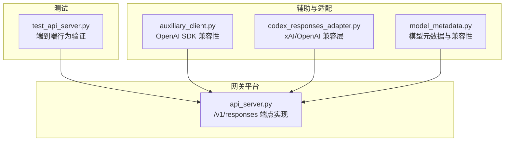
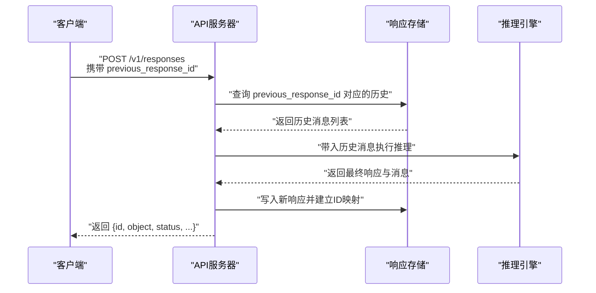
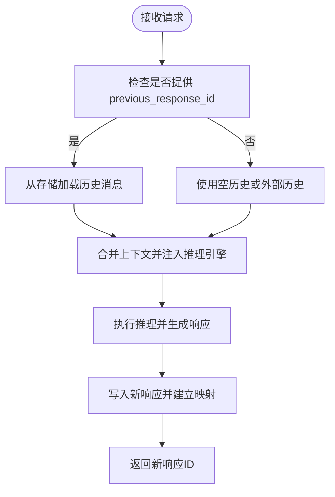
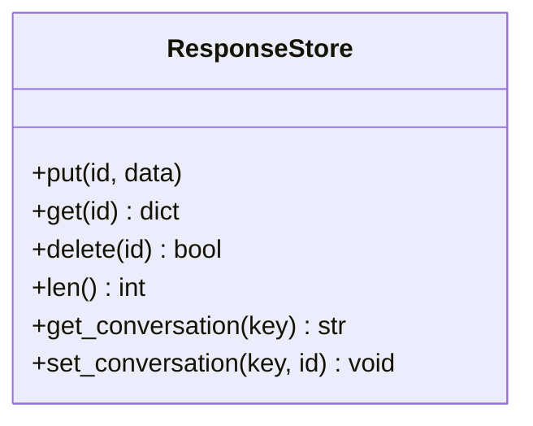
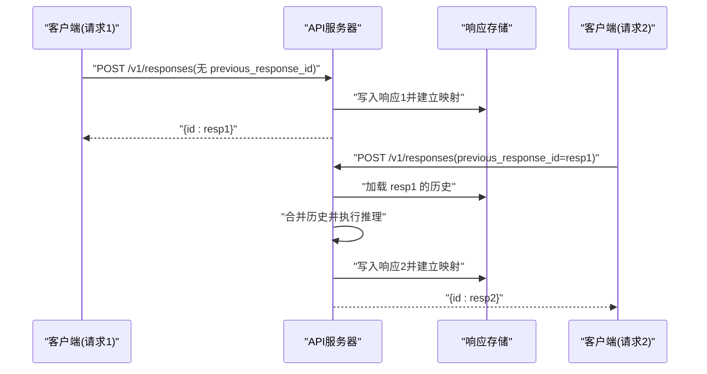
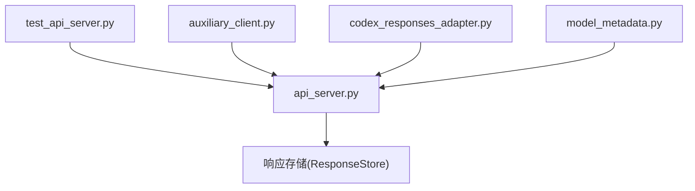

# 响应管理端点

<cite>
**本文档引用的文件**
- [api_server.py](file://gateway/platforms/api_server.py)
- [test_api_server.py](file://tests/gateway/test_api_server.py)
- [auxiliary_client.py](file://agent/auxiliary_client.py)
- [codex_responses_adapter.py](file://agent/codex_responses_adapter.py)
- [model_metadata.py](file://agent/model_metadata.py)
</cite>

## 目录
1. [简介](#简介)
2. [项目结构](#项目结构)
3. [核心组件](#核心组件)
4. [架构概览](#架构概览)
5. [详细组件分析](#详细组件分析)
6. [依赖关系分析](#依赖关系分析)
7. [性能考虑](#性能考虑)
8. [故障排除指南](#故障排除指南)
9. [结论](#结论)
10. [附录](#附录)

## 简介
本文件为响应管理相关端点的详细API文档，重点覆盖 `/v1/responses` 端点的状态化对话能力，包括：
- POST 创建响应：支持通过 `previous_response_id` 参数进行状态化对话链接
- GET 获取响应：根据响应ID检索已存储的对话结果
- DELETE 删除响应：清理指定响应及其关联的历史记录

文档还将解释 `previous_response_id` 在状态化对话中的工作机制，如何通过响应ID链构建连续的对话历史；同时介绍响应存储的内存结构、LRU淘汰机制与访问时间更新策略，并提供在OpenAI兼容前端中集成状态化对话的完整使用示例。

## 项目结构
响应管理端点位于网关平台模块中，核心实现集中在 `gateway/platforms/api_server.py` 文件，配套测试位于 `tests/gateway/test_api_server.py`。此外，辅助客户端与适配器文件展示了该端点在OpenAI兼容前端中的集成方式。

**图表来源**
- [api_server.py:1-50](file://gateway/platforms/api_server.py#L1-L50)
- [test_api_server.py:1-50](file://tests/gateway/test_api_server.py#L1-L50)
- [auxiliary_client.py:1900-1920](file://agent/auxiliary_client.py#L1900-L1920)
- [codex_responses_adapter.py:890-905](file://agent/codex_responses_adapter.py#L890-L905)
- [model_metadata.py:250-265](file://agent/model_metadata.py#L250-L265)

**章节来源**
- [api_server.py:1-50](file://gateway/platforms/api_server.py#L1-L50)
- [test_api_server.py:1-50](file://tests/gateway/test_api_server.py#L1-L50)

## 核心组件
- 网关平台API服务器：提供 `/v1/responses` 的POST/GET/DELETE端点，负责状态化对话的请求处理、历史拼接与响应存储。
- 测试套件：覆盖状态化对话链路、存储行为（LRU）、删除清理等关键场景。
- OpenAI兼容层：辅助客户端与适配器确保前端SDK能够正确调用 `/v1/responses` 并利用 `previous_response_id` 进行会话延续。

**章节来源**
- [api_server.py:2752-2850](file://gateway/platforms/api_server.py#L2752-L2850)
- [test_api_server.py:1680-1750](file://tests/gateway/test_api_server.py#L1680-L1750)
- [auxiliary_client.py:1913-1913](file://agent/auxiliary_client.py#L1913-L1913)
- [codex_responses_adapter.py:898-898](file://agent/codex_responses_adapter.py#L898-L898)

## 架构概览
下图展示了 `/v1/responses` 端点在状态化对话中的工作流程：客户端发送包含 `previous_response_id` 的请求，服务端解析并加载前一响应的历史，将其注入到当前请求的上下文中，随后执行推理并将结果写入响应存储，最终返回新的响应ID以供后续链路使用。

**图表来源**
- [api_server.py:2776-2831](file://gateway/platforms/api_server.py#L2776-L2831)
- [api_server.py:2830-2831](file://gateway/platforms/api_server.py#L2830-L2831)

**章节来源**
- [api_server.py:2776-2831](file://gateway/platforms/api_server.py#L2776-L2831)

## 详细组件分析

### 端点定义与行为
- POST `/v1/responses`
  - 功能：创建新的响应，支持通过 `previous_response_id` 链接前一响应的历史，实现状态化对话。
  - 关键约束：`conversation` 与 `previous_response_id` 互斥；若两者同时提供，优先使用 `conversation_history`。
  - 返回：包含新响应ID与状态信息的对象。
- GET `/v1/responses/{response_id}`
  - 功能：按ID检索已存储的响应。
  - 返回：响应对象或404错误。
- DELETE `/v1/responses/{response_id}`
  - 功能：删除指定响应及其关联的映射。
  - 返回：成功或失败状态。

**章节来源**
- [api_server.py:5-7](file://gateway/platforms/api_server.py#L5-L7)
- [api_server.py:2780-2782](file://gateway/platforms/api_server.py#L2780-L2782)
- [api_server.py:2809-2810](file://gateway/platforms/api_server.py#L2809-L2810)
- [api_server.py:2830-2831](file://gateway/platforms/api_server.py#L2830-L2831)

### previous_response_id 工作机制
- 当客户端提供 `previous_response_id` 时，服务端会从响应存储中加载对应的历史消息，并将其作为当前请求的上下文注入推理引擎。
- 若同时提供 `conversation` 与 `previous_response_id`，系统会优先使用 `conversation_history`，并忽略 `previous_response_id`。
- 该机制允许在不显式传递完整历史的情况下，通过响应ID链构建连续的对话历史，从而实现状态化对话。

**图表来源**
- [api_server.py:2776-2831](file://gateway/platforms/api_server.py#L2776-L2831)

**章节来源**
- [api_server.py:2776-2831](file://gateway/platforms/api_server.py#L2776-L2831)

### 响应存储结构与行为
- 存储结构：响应存储采用内存结构保存响应内容与映射关系，包含响应ID、对话历史、会话键等字段。
- 访问与更新：每次访问响应会更新其最近访问时间，用于LRU淘汰策略。
- LRU淘汰：当存储达到最大容量时，最久未访问的响应会被淘汰，确保内存占用可控。
- 删除清理：删除响应时，会清理与之关联的会话映射，防止悬挂引用。

**图表来源**
- [api_server.py:341-360](file://gateway/platforms/api_server.py#L341-L360)

**章节来源**
- [api_server.py:341-360](file://gateway/platforms/api_server.py#L341-L360)
- [test_api_server.py:80-110](file://tests/gateway/test_api_server.py#L80-L110)

### 状态化对话链路验证
- 连续请求：第二次请求携带第一次响应的ID作为 `previous_response_id`，服务端会自动加载第一次的历史并注入到第二次请求中。
- 输出隔离：响应输出不会重复播放之前的工具产物，确保每轮输出仅包含当前轮次的内容。
- 会话一致性：同一会话链路中的多次请求共享同一个会话键，保证上下文的一致性。

**图表来源**
- [test_api_server.py:1689-1718](file://tests/gateway/test_api_server.py#L1689-L1718)
- [test_api_server.py:1720-1743](file://tests/gateway/test_api_server.py#L1720-L1743)

**章节来源**
- [test_api_server.py:1689-1718](file://tests/gateway/test_api_server.py#L1689-L1718)
- [test_api_server.py:1720-1743](file://tests/gateway/test_api_server.py#L1720-L1743)

### OpenAI兼容前端集成示例
- OpenAI SDK兼容：辅助客户端明确指出 `/v1/responses` 端点遵循OpenAI Responses API格式，可直接在OpenAI兼容前端中使用。
- 适配器支持：适配器文件展示了与xAI/OpenAI生态的兼容性，便于在不同前端环境中无缝集成。
- 模型元数据：模型元数据文件确认了对 `/v1/responses` 的兼容性验证日期，确保接口稳定性。

**章节来源**
- [auxiliary_client.py:1913-1913](file://agent/auxiliary_client.py#L1913-L1913)
- [codex_responses_adapter.py:898-898](file://agent/codex_responses_adapter.py#L898-L898)
- [model_metadata.py:257-257](file://agent/model_metadata.py#L257-L257)

## 依赖关系分析
- API服务器依赖响应存储模块进行历史加载与写入。
- 测试套件覆盖端点行为、状态化链路与存储策略。
- OpenAI兼容层确保前端SDK能够正确调用端点并利用 `previous_response_id`。

**图表来源**
- [api_server.py:341-360](file://gateway/platforms/api_server.py#L341-L360)
- [test_api_server.py:1-50](file://tests/gateway/test_api_server.py#L1-L50)
- [auxiliary_client.py:1913-1913](file://agent/auxiliary_client.py#L1913-L1913)
- [codex_responses_adapter.py:898-898](file://agent/codex_responses_adapter.py#L898-L898)
- [model_metadata.py:257-257](file://agent/model_metadata.py#L257-L257)

**章节来源**
- [api_server.py:341-360](file://gateway/platforms/api_server.py#L341-L360)
- [test_api_server.py:1-50](file://tests/gateway/test_api_server.py#L1-L50)
- [auxiliary_client.py:1913-1913](file://agent/auxiliary_client.py#L1913-L1913)
- [codex_responses_adapter.py:898-898](file://agent/codex_responses_adapter.py#L898-L898)
- [model_metadata.py:257-257](file://agent/model_metadata.py#L257-L257)

## 性能考虑
- 内存存储：响应存储为内存结构，适合短期状态化对话；对于大规模并发或持久化需求，建议结合外部存储方案。
- LRU淘汰：通过最近访问时间控制淘汰，避免内存无限增长；合理设置最大容量以平衡性能与资源占用。
- 历史注入：每次状态化请求都会加载并合并历史，建议控制历史长度以减少注入开销。
- 会话一致性：同一会话链路共享会话键，有助于缓存命中与上下文复用。

## 故障排除指南
- 404 错误：当提供的 `previous_response_id` 不存在时，端点返回404。请确认ID有效且未被删除。
- 400 错误：同时提供 `conversation` 与 `previous_response_id` 会导致参数冲突，需二选一。
- 输出重复问题：若发现响应输出重复播放历史工具产物，请检查前端是否正确传递 `previous_response_id`，并确保后端未混用外部历史。
- 删除后查询不到：删除响应后，相关映射已被清理；如需继续链路，请重新发起请求并使用最新响应ID。

**章节来源**
- [test_api_server.py:1842-1854](file://tests/gateway/test_api_server.py#L1842-L1854)
- [api_server.py:2780-2782](file://gateway/platforms/api_server.py#L2780-L2782)
- [test_api_server.py:1720-1743](file://tests/gateway/test_api_server.py#L1720-L1743)

## 结论
`/v1/responses` 端点通过 `previous_response_id` 实现了OpenAI兼容的状态化对话能力，配合内存响应存储与LRU淘汰策略，能够在保持低延迟的同时维护连续的对话历史。测试用例验证了链路的正确性与健壮性，OpenAI兼容层则确保了前端集成的便利性。建议在生产环境中结合外部存储与监控策略，进一步提升可用性与可观测性。

## 附录

### API规范摘要
- POST `/v1/responses`
  - 请求体字段：`model`、`input`、`previous_response_id`、`conversation`、`store` 等（具体以实现为准）
  - 行为：根据 `previous_response_id` 加载历史并注入推理，返回新响应ID
- GET `/v1/responses/{response_id}`
  - 行为：返回指定ID的响应对象
- DELETE `/v1/responses/{response_id}`
  - 行为：删除响应并清理相关映射

**章节来源**
- [api_server.py:5-7](file://gateway/platforms/api_server.py#L5-L7)
- [api_server.py:2776-2831](file://gateway/platforms/api_server.py#L2776-L2831)