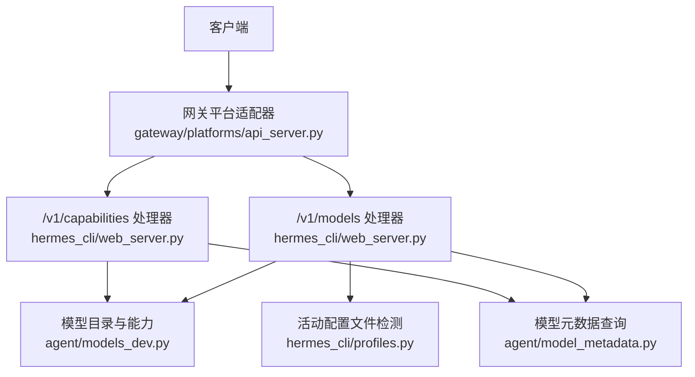
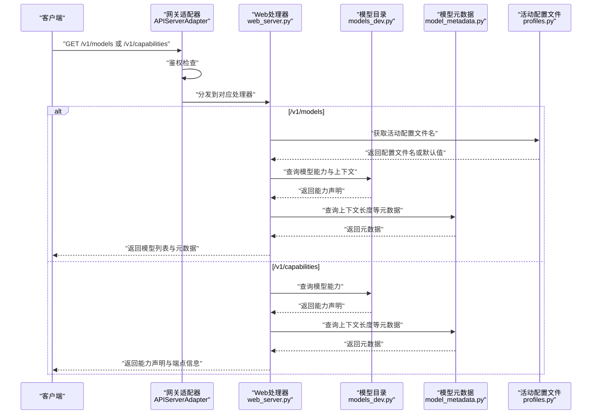
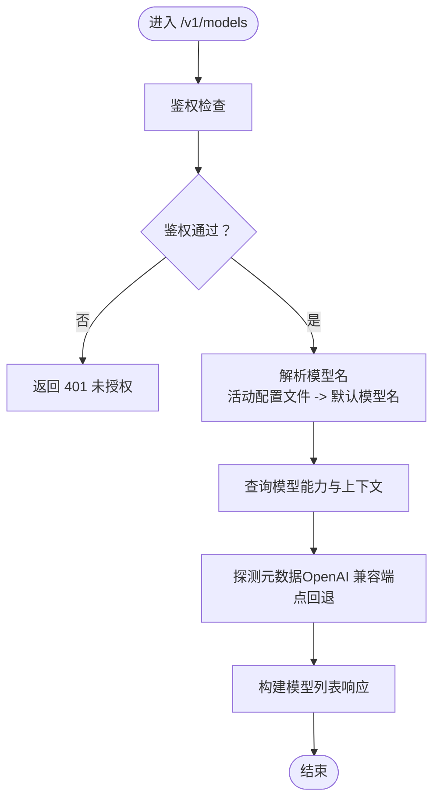
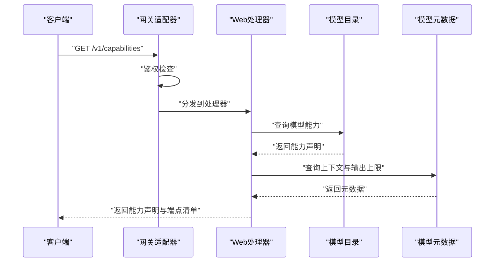
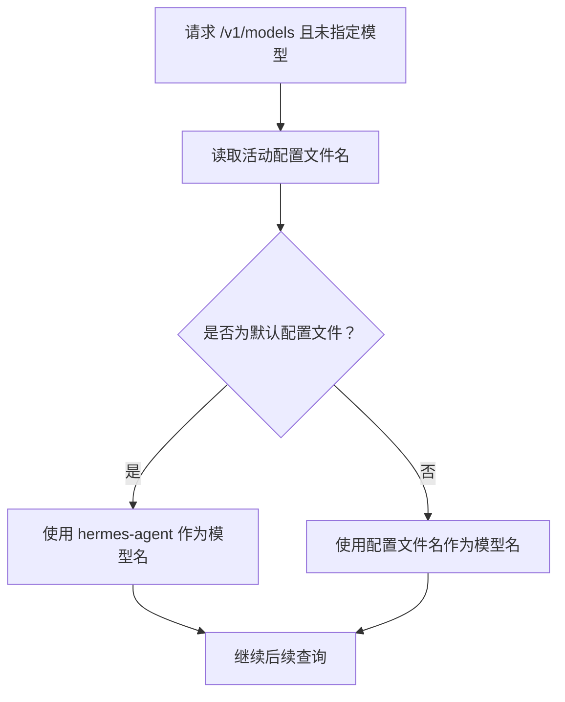
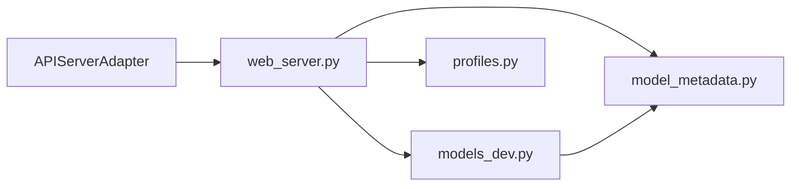

# 模型和能力端点

<cite>
**本文引用的文件**
- [hermes_cli/web_server.py](file://hermes_cli/web_server.py)
- [gateway/platforms/api_server.py](file://gateway/platforms/api_server.py)
- [agent/models_dev.py](file://agent/models_dev.py)
- [agent/model_metadata.py](file://agent/model_metadata.py)
- [hermes_cli/profiles.py](file://hermes_cli/profiles.py)
- [tests/gateway/test_api_server.py](file://tests/gateway/test_api_server.py)
- [tests/hermes_cli/test_web_server.py](file://tests/hermes_cli/test_web_server.py)
- [tests/agent/test_models_dev.py](file://tests/agent/test_models_dev.py)
</cite>

## 目录
1. [简介](#简介)
2. [项目结构](#项目结构)
3. [核心组件](#核心组件)
4. [架构总览](#架构总览)
5. [详细组件分析](#详细组件分析)
6. [依赖关系分析](#依赖关系分析)
7. [性能考量](#性能考量)
8. [故障排查指南](#故障排查指南)
9. [结论](#结论)
10. [附录](#附录)

## 简介
本文件为 Hermes Agent 的模型与能力查询端点提供权威、可操作的技术文档，覆盖以下要点：
- /v1/models：返回可用模型列表，包含单一模型 hermes-agent 的标识与元数据。
- /v1/capabilities：提供机器可读的 API 能力声明，涵盖支持的功能特性、参数范围与行为约束。
- 模型名称解析逻辑：配置覆盖、活动配置文件检测与回退机制。
- 完整响应示例：展示与 OpenAI 兼容的模型列表与能力声明格式。
- 兼容性说明、版本演进策略与客户端集成最佳实践。

## 项目结构
与本主题直接相关的核心模块与文件如下：
- 网关平台适配器：负责注册 /v1/models 与 /v1/capabilities 等路由，并进行鉴权校验。
- 模型目录与能力：提供模型能力查询与上下文长度等元数据。
- 配置与模型名解析：从活动配置文件推导默认模型名，支持覆盖与回退。
- 测试用例：验证鉴权、模型名解析、能力字段与错误处理。

图表来源
- [gateway/platforms/api_server.py](file://gateway/platforms/api_server.py)
- [hermes_cli/web_server.py](file://hermes_cli/web_server.py)
- [agent/models_dev.py](file://agent/models_dev.py)
- [agent/model_metadata.py](file://agent/model_metadata.py)
- [hermes_cli/profiles.py](file://hermes_cli/profiles.py)

章节来源
- [gateway/platforms/api_server.py](file://gateway/platforms/api_server.py)
- [hermes_cli/web_server.py](file://hermes_cli/web_server.py)
- [agent/models_dev.py](file://agent/models_dev.py)
- [agent/model_metadata.py](file://agent/model_metadata.py)
- [hermes_cli/profiles.py](file://hermes_cli/profiles.py)

## 核心组件
- 网关平台适配器（APIServerAdapter）
  - 注册 /v1/models 与 /v1/capabilities 路由，统一鉴权入口。
  - 提供模型名解析逻辑：当请求中未指定模型时，依据活动配置文件决定默认模型名。
- 模型目录与能力（models_dev）
  - 维护各供应商模型能力映射，提供模型能力查询函数。
- 模型元数据（model_metadata）
  - 查询模型上下文长度、输出上限等元数据；对 OpenAI 兼容端点进行探测与回退。
- 配置与模型名解析（profiles）
  - 检测当前活动配置文件名，作为默认模型名的来源之一。

章节来源
- [gateway/platforms/api_server.py](file://gateway/platforms/api_server.py)
- [hermes_cli/web_server.py](file://hermes_cli/web_server.py)
- [agent/models_dev.py](file://agent/models_dev.py)
- [agent/model_metadata.py](file://agent/model_metadata.py)
- [hermes_cli/profiles.py](file://hermes_cli/profiles.py)

## 架构总览
下图展示了 /v1/models 与 /v1/capabilities 的调用链路与关键处理步骤。

图表来源
- [gateway/platforms/api_server.py](file://gateway/platforms/api_server.py)
- [hermes_cli/web_server.py](file://hermes_cli/web_server.py)
- [agent/models_dev.py](file://agent/models_dev.py)
- [agent/model_metadata.py](file://agent/model_metadata.py)
- [hermes_cli/profiles.py](file://hermes_cli/profiles.py)

## 详细组件分析

### /v1/models 端点
- 功能概述
  - 返回可用模型列表，包含单一模型 hermes-agent 的标识与元数据。
  - 支持 OpenAI 兼容格式，便于现有客户端无缝对接。
- 请求与响应
  - 方法：GET
  - 认证：需要有效的 API 密钥（当启用鉴权时）。
  - 响应体：包含模型数组，每个模型对象包含标识、描述、上下文长度、输出上限等元数据。
- 模型名称解析逻辑
  - 当请求未指定模型时，优先使用活动配置文件名作为默认模型名；若为默认配置文件，则回退到 hermes-agent。
  - 解析过程通过测试用例验证：默认配置文件回退至 hermes-agent；命名配置文件使用其名称作为模型名。
- OpenAI 兼容性
  - 对 OpenAI 兼容端点进行探测与回退，确保在不同后端环境下稳定获取上下文长度等元数据。
- 错误处理
  - 鉴权失败返回 401。
  - 元数据解析异常时，返回零值而非 500，保证前端可继续工作。

图表来源
- [gateway/platforms/api_server.py](file://gateway/platforms/api_server.py)
- [hermes_cli/web_server.py](file://hermes_cli/web_server.py)
- [agent/model_metadata.py](file://agent/model_metadata.py)
- [tests/gateway/test_api_server.py](file://tests/gateway/test_api_server.py)

章节来源
- [gateway/platforms/api_server.py](file://gateway/platforms/api_server.py)
- [hermes_cli/web_server.py](file://hermes_cli/web_server.py)
- [agent/model_metadata.py](file://agent/model_metadata.py)
- [tests/gateway/test_api_server.py](file://tests/gateway/test_api_server.py)

### /v1/capabilities 端点
- 功能概述
  - 提供机器可读的 API 能力声明，包括支持的功能特性（如工具、视觉、推理）、参数范围与行为约束。
  - 同步返回端点清单与鉴权状态，便于客户端自检与动态配置。
- 请求与响应
  - 方法：GET
  - 认证：需要有效的 API 密钥（当启用鉴权时）。
  - 响应体：包含能力声明、端点清单、鉴权要求等。
- 能力字段与约束
  - 支持工具（supports_tools）、支持视觉（supports_vision）、支持推理（supports_reasoning）、最大输出令牌数（max_output_tokens）、模型家族（model_family）等。
  - 上下文长度与输出上限来自模型目录与元数据查询。
- OpenAI 兼容性
  - 能力声明遵循 OpenAI 风格的关键字段，便于迁移与互操作。

图表来源
- [gateway/platforms/api_server.py](file://gateway/platforms/api_server.py)
- [hermes_cli/web_server.py](file://hermes_cli/web_server.py)
- [agent/models_dev.py](file://agent/models_dev.py)
- [agent/model_metadata.py](file://agent/model_metadata.py)
- [tests/gateway/test_api_server.py](file://tests/gateway/test_api_server.py)

章节来源
- [gateway/platforms/api_server.py](file://gateway/platforms/api_server.py)
- [hermes_cli/web_server.py](file://hermes_cli/web_server.py)
- [agent/models_dev.py](file://agent/models_dev.py)
- [agent/model_metadata.py](file://agent/model_metadata.py)
- [tests/gateway/test_api_server.py](file://tests/gateway/test_api_server.py)

### 模型名称解析逻辑
- 触发条件
  - 当请求未携带模型参数时，触发解析流程。
- 解析规则
  - 获取活动配置文件名；若为默认配置文件，回退到 hermes-agent；否则使用配置文件名作为模型名。
- 回退机制
  - 若无法获取活动配置文件名，回退到 hermes-agent。
- 行为验证
  - 测试用例覆盖默认配置文件回退与命名配置文件使用场景，确保行为一致。

图表来源
- [tests/gateway/test_api_server.py](file://tests/gateway/test_api_server.py)
- [hermes_cli/profiles.py](file://hermes_cli/profiles.py)

章节来源
- [tests/gateway/test_api_server.py](file://tests/gateway/test_api_server.py)
- [hermes_cli/profiles.py](file://hermes_cli/profiles.py)

### OpenAI 兼容性与版本演进
- 兼容性要点
  - /v1/models 与 /v1/capabilities 的响应结构与字段尽量与 OpenAI 兼容，便于现有客户端无需修改即可接入。
  - 对 OpenAI 兼容端点进行探测与回退，提升跨后端稳定性。
- 版本演进策略
  - 保持向后兼容：新增字段以扩展能力，不破坏既有字段语义。
  - 逐步引入新能力声明与端点，配合测试用例验证兼容性与回退路径。
- 客户端集成最佳实践
  - 优先使用 /v1/capabilities 自检端点，动态适配能力与端点清单。
  - 在 /v1/models 中按需读取上下文长度与输出上限，避免硬编码。
  - 对于鉴权环境，始终携带有效 API 密钥；在本地开发时谨慎开放网络绑定。

章节来源
- [agent/model_metadata.py](file://agent/model_metadata.py)
- [hermes_cli/web_server.py](file://hermes_cli/web_server.py)

## 依赖关系分析
- 组件耦合
  - 网关适配器与 Web 处理器：前者负责路由与鉴权，后者负责具体业务逻辑。
  - Web 处理器依赖模型目录与元数据模块，用于能力与上下文信息的聚合。
  - 模型目录与元数据模块相互独立，分别承担“能力声明”与“元数据探测”的职责。
- 外部依赖
  - OpenAI 兼容端点：用于探测上下文长度等元数据，存在回退策略以应对不同后端。
- 潜在循环依赖
  - 未发现直接循环导入；模块间通过函数调用解耦。

图表来源
- [gateway/platforms/api_server.py](file://gateway/platforms/api_server.py)
- [hermes_cli/web_server.py](file://hermes_cli/web_server.py)
- [agent/models_dev.py](file://agent/models_dev.py)
- [agent/model_metadata.py](file://agent/model_metadata.py)
- [hermes_cli/profiles.py](file://hermes_cli/profiles.py)

章节来源
- [gateway/platforms/api_server.py](file://gateway/platforms/api_server.py)
- [hermes_cli/web_server.py](file://hermes_cli/web_server.py)
- [agent/models_dev.py](file://agent/models_dev.py)
- [agent/model_metadata.py](file://agent/model_metadata.py)
- [hermes_cli/profiles.py](file://hermes_cli/profiles.py)

## 性能考量
- 探测与回退
  - OpenAI 兼容端点探测可能带来额外网络开销；建议在客户端侧缓存能力声明与元数据，减少重复探测。
- 并发访问
  - 网关适配器与 Web 处理器采用异步模式，适合高并发场景；注意控制并发度与资源占用。
- 缓存策略
  - 将模型能力与上下文长度缓存于内存或持久化存储，结合 TTL 控制更新频率，降低查询延迟。

## 故障排查指南
- 鉴权失败（401）
  - 确认已设置 API 密钥并在请求头中携带 Authorization: Bearer <密钥>。
  - 检查网关绑定地址与访问来源是否满足鉴权边界要求。
- 元数据解析异常
  - 当模型元数据不可用时，系统会返回零值而非抛出错误；请检查后端服务连通性与端点可用性。
- 模型名解析异常
  - 确认活动配置文件是否存在；默认配置文件将回退到 hermes-agent。
- 能力声明字段缺失
  - 新增能力字段时需确保模型目录与元数据模块同步更新；参考测试用例验证字段覆盖情况。

章节来源
- [tests/gateway/test_api_server.py](file://tests/gateway/test_api_server.py)
- [tests/hermes_cli/test_web_server.py](file://tests/hermes_cli/test_web_server.py)
- [tests/agent/test_models_dev.py](file://tests/agent/test_models_dev.py)

## 结论
本文档系统性地梳理了 /v1/models 与 /v1/capabilities 的实现与使用方式，明确了模型名称解析、能力声明与元数据查询的流程，并提供了 OpenAI 兼容性说明、版本演进策略与客户端集成最佳实践。建议在生产环境中结合缓存与自检端点，持续优化性能与稳定性。

## 附录
- 响应示例（概念性说明）
  - /v1/models 示例：包含模型标识、描述、上下文长度、输出上限等字段，遵循 OpenAI 兼容风格。
  - /v1/capabilities 示例：包含 supports_tools、supports_vision、supports_reasoning、max_output_tokens、model_family、端点清单与鉴权要求等。
- 参考测试
  - 模型名解析与鉴权行为：见测试用例。
  - 能力字段与错误处理：见测试用例。

章节来源
- [tests/gateway/test_api_server.py](file://tests/gateway/test_api_server.py)
- [tests/hermes_cli/test_web_server.py](file://tests/hermes_cli/test_web_server.py)
- [tests/agent/test_models_dev.py](file://tests/agent/test_models_dev.py)