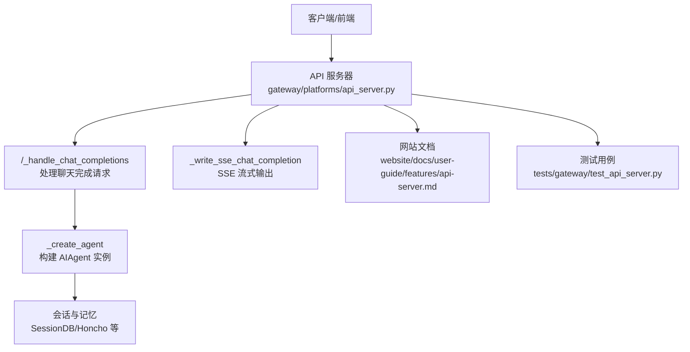
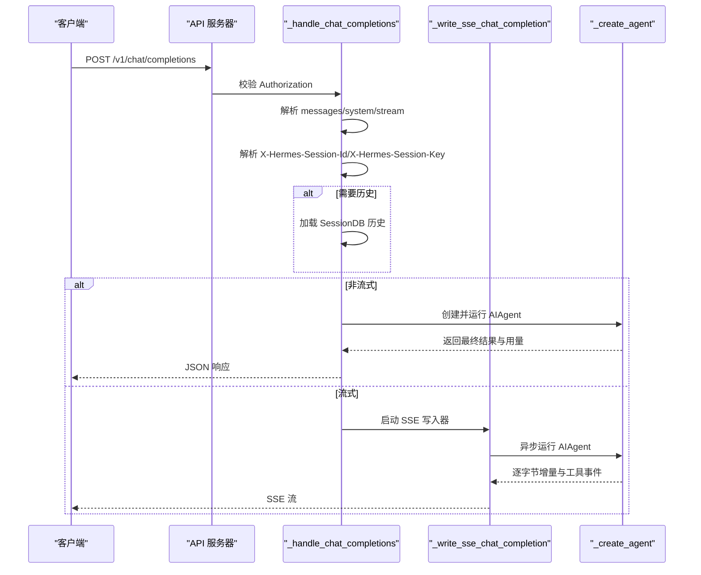
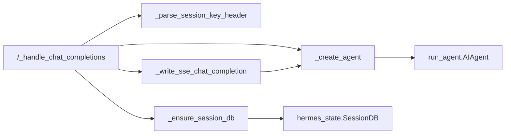

# 聊天完成端点

<cite>
**本文档引用的文件**
- [api_server.py](file://gateway/platforms/api_server.py)
- [api-server.md](file://website/docs/user-guide/features/api-server.md)
- [test_api_server.py](file://tests/gateway/test_api_server.py)
- [sessions.md](file://website/docs/user-guide/sessions.md)
- [i18n_zh_Hans_sessions.md](file://website/i18n/zh-Hans/docusaurus-plugin-content-docs/current/user-guide/sessions.md)
</cite>

## 目录
1. [简介](#简介)
2. [项目结构](#项目结构)
3. [核心组件](#核心组件)
4. [架构总览](#架构总览)
5. [详细组件分析](#详细组件分析)
6. [依赖关系分析](#依赖关系分析)
7. [性能考量](#性能考量)
8. [故障排查指南](#故障排查指南)
9. [结论](#结论)
10. [附录](#附录)

## 简介
本文件为 Hermes Agent 的 OpenAI 兼容聊天完成端点 /v1/chat/completions 提供完整 API 文档。重点覆盖：
- 请求方法与路径：POST /v1/chat/completions
- 请求体字段：messages、model、temperature、max_tokens、stream 等
- 请求头规范：Authorization、X-Hermes-Session-Id（会话连续性）、X-Hermes-Session-Key（长期记忆作用域）
- 响应格式：非流式与流式（SSE）差异
- 示例场景：单轮对话、多轮对话、流式输出
- 错误处理与状态码
- 常见问题与排障建议

## 项目结构
该端点由网关平台适配器实现，核心逻辑集中在 gateway 平台模块，并通过网站文档与测试用例补充了行为与约束。

图示来源
- [api_server.py:1683-2002](file://gateway/platforms/api_server.py#L1683-L2002)
- [api-server.md:56-114](file://website/docs/user-guide/features/api-server.md#L56-L114)

章节来源
- [api_server.py:1-120](file://gateway/platforms/api_server.py#L1-L120)
- [api-server.md:1-50](file://website/docs/user-guide/features/api-server.md#L1-L50)

## 核心组件
- 网关适配器：提供 /v1/chat/completions 端点，负责认证、请求解析、会话与记忆集成、代理调用与 SSE 输出。
- 处理器：/_handle_chat_completions 解析 messages、system 提示、stream 参数；根据是否提供 X-Hermes-Session-Id 决定是否加载历史；根据 X-Hermes-Session-Key 注入长期记忆作用域。
- SSE 写入器：/_write_sse_chat_completion 将 token 逐字节推送，同时发出自定义事件（如工具进度）。
- 会话键解析：/_parse_session_key_header 校验并提取 X-Hermes-Session-Key，确保安全启用。
- 文档与测试：网站文档给出请求/响应示例与特性说明；测试用例覆盖认证、流式、会话键等关键行为。

章节来源
- [api_server.py:894-944](file://gateway/platforms/api_server.py#L894-L944)
- [api_server.py:1683-2002](file://gateway/platforms/api_server.py#L1683-L2002)
- [api_server.py:2004-2154](file://gateway/platforms/api_server.py#L2004-L2154)
- [api-server.md:56-114](file://website/docs/user-guide/features/api-server.md#L56-L114)
- [test_api_server.py:846-862](file://tests/gateway/test_api_server.py#L846-L862)

## 架构总览
下图展示了从客户端到 Agent 的调用链路，以及会话键与会话 ID 的作用边界。

图示来源
- [api_server.py:1683-2002](file://gateway/platforms/api_server.py#L1683-L2002)
- [api_server.py:2004-2154](file://gateway/platforms/api_server.py#L2004-L2154)

## 详细组件分析

### 请求规范
- 方法与路径
  - POST /v1/chat/completions
- 认证
  - Authorization: Bearer <API_SERVER_KEY>
- 请求头
  - Authorization: Bearer <密钥>
  - X-Hermes-Session-Id: 可选，用于会话连续性（需已配置 API_SERVER_KEY）
  - X-Hermes-Session-Key: 可选，用于长期记忆作用域（需已配置 API_SERVER_KEY）
  - Idempotency-Key: 可选，用于幂等缓存指纹
  - Content-Type: application/json
- 请求体字段
  - model: 字符串（服务端实际模型由配置决定，此字段仅用于兼容）
  - messages: 数组，元素包含 role（system/user/assistant）与 content（字符串或含类型部分的数组）
  - temperature: 数值（可选）
  - max_tokens: 整数（可选）
  - stream: 布尔值（可选，默认 false）

章节来源
- [api-server.md:56-114](file://website/docs/user-guide/features/api-server.md#L56-L114)
- [api_server.py:1683-1702](file://gateway/platforms/api_server.py#L1683-L1702)
- [api_server.py:1744-1796](file://gateway/platforms/api_server.py#L1744-L1796)

### 请求体结构详解
- messages
  - system：作为临时系统提示叠加在核心系统提示之上
  - user/assistant：content 支持纯文本或包含 text/image_url 等类型的数组
  - content 类型规范化：支持 text/input_text/output_text 与 image_url/input_image；对 data:image/... 与 http(s) 图片 URL 进行校验
- temperature/max_tokens
  - 透传给底层模型调用（若模型支持）
- stream
  - true：返回 SSE 流
  - false：返回完整 JSON 响应

章节来源
- [api_server.py:111-167](file://gateway/platforms/api_server.py#L111-L167)
- [api_server.py:1708-1737](file://gateway/platforms/api_server.py#L1708-L1737)
- [api-server.md:56-114](file://website/docs/user-guide/features/api-server.md#L56-L114)

### 请求头规范
- Authorization
  - 必填，Bearer 方式；未通过认证返回 401
- X-Hermes-Session-Id
  - 可选，启用会话连续性：服务端会从 SessionDB 加载历史
  - 安全要求：必须配置 API_SERVER_KEY，否则拒绝会话续接并返回 403
  - 值长度限制与控制字符校验：最大 256 字符，禁止 \r\n\x00
- X-Hermes-Session-Key
  - 可选，用于长期记忆作用域（如 Honcho），与会话 ID 解耦
  - 安全要求：必须配置 API_SERVER_KEY，否则拒绝并返回 403
  - 值长度限制与控制字符校验：最大 256 字符，禁止 \r\n\x00
- Idempotency-Key
  - 可选，用于幂等缓存；指纹基于 model/messages/tools/tool_choice/stream

章节来源
- [api_server.py:1744-1796](file://gateway/platforms/api_server.py#L1744-L1796)
- [api_server.py:894-944](file://gateway/platforms/api_server.py#L894-L944)
- [api_server.py:1904-1914](file://gateway/platforms/api_server.py#L1904-L1914)

### 响应格式
- 非流式（stream=false）
  - JSON 结构遵循 OpenAI Chat Completions 规范
  - 包含 id/object/created/model/choices/usage
  - choices[0].message.role=assistant，content 为最终回复
  - finish_reason：stop/length/error
  - 当出现截断或失败时，响应头包含 X-Hermes-Completed/X-Hermes-Partial/X-Hermes-Error
- 流式（stream=true）
  - Server-Sent Events（SSE）
  - 初始事件：chat.completion.chunk（role=assistant）
  - 后续事件：delta.content（逐字节增量）
  - 工具事件：hermes.tool.progress（工具开始/完成）
  - 结束事件：chat.completion.chunk（finish_reason=stop），随后 [DONE]
  - 响应头包含 X-Hermes-Session-Id 与 X-Hermes-Session-Key（若提供）

章节来源
- [api_server.py:1968-2002](file://gateway/platforms/api_server.py#L1968-L2002)
- [api_server.py:2004-2154](file://gateway/platforms/api_server.py#L2004-L2154)
- [api-server.md:109-113](file://website/docs/user-guide/features/api-server.md#L109-L113)

### 示例场景

#### 单轮对话（非流式）
- 请求
  - POST /v1/chat/completions
  - Authorization: Bearer <API_SERVER_KEY>
  - Content-Type: application/json
  - 请求体：包含 model 与 messages（至少包含一条 user 消息）
- 响应
  - JSON：包含 choices[0].message.content 与 usage

章节来源
- [api-server.md:62-88](file://website/docs/user-guide/features/api-server.md#L62-L88)
- [test_api_server.py:1307-1320](file://tests/gateway/test_api_server.py#L1307-L1320)

#### 多轮对话（会话连续性）
- 使用 X-Hermes-Session-Id
  - 第一次请求：可不带 X-Hermes-Session-Id，服务端派生稳定会话 ID
  - 后续请求：携带 X-Hermes-Session-Id，服务端从 SessionDB 加载历史
- 使用 X-Hermes-Session-Key
  - 用于长期记忆作用域（如不同用户/频道），与会话 ID 解耦

章节来源
- [api_server.py:1748-1796](file://gateway/platforms/api_server.py#L1748-L1796)
- [api-server.md:358-370](file://website/docs/user-guide/features/api-server.md#L358-L370)
- [test_api_server.py:3324-3376](file://tests/gateway/test_api_server.py#L3324-L3376)

#### 流式输出
- 请求
  - stream=true
- 响应
  - SSE：逐字节 delta.content，工具开始/完成事件，结束时 finish_reason=stop

章节来源
- [api_server.py:1801-1892](file://gateway/platforms/api_server.py#L1801-L1892)
- [api_server.py:2004-2154](file://gateway/platforms/api_server.py#L2004-L2154)
- [api-server.md:109-113](file://website/docs/user-guide/features/api-server.md#L109-L113)

### 错误处理与状态码
- 400
  - 缺少/无效 messages
  - messages 中无有效用户消息
  - 无效 JSON
  - 无效的图片 URL 或不支持的内容类型
  - 无效的会话 ID/会话键（控制字符/超长）
- 401
  - 未提供或无效的 Authorization
- 403
  - 使用会话续接或会话键但未配置 API_SERVER_KEY
- 413
  - 请求体过大（超过内置上限）
- 500/502/504
  - 服务内部错误或上游超时/不可达
  - 502：当最终无可用回复且存在失败标记时，返回 OpenAI 风格错误体

章节来源
- [api_server.py:1695-1700](file://gateway/platforms/api_server.py#L1695-L1700)
- [api_server.py:1733-1737](file://gateway/platforms/api_server.py#L1733-L1737)
- [api_server.py:1692-1693](file://gateway/platforms/api_server.py#L1692-L1693)
- [api_server.py:253-268](file://gateway/platforms/api_server.py#L253-L268)
- [api_server.py:1757-1775](file://gateway/platforms/api_server.py#L1757-L1775)
- [api_server.py:1763-1768](file://gateway/platforms/api_server.py#L1763-L1768)
- [api_server.py:1947-1963](file://gateway/platforms/api_server.py#L1947-L1963)
- [test_api_server.py:846-862](file://tests/gateway/test_api_server.py#L846-L862)

## 依赖关系分析
- 组件耦合
  - _handle_chat_completions 依赖认证检查、会话键解析、SessionDB、Agent 创建与 SSE 写入
  - SSE 写入器与 Agent 回调解耦，通过队列传递增量
- 外部依赖
  - hermes_state.SessionDB：会话历史持久化
  - run_agent.AIAgent：执行智能体与工具调用
  - hermes_cli 配置：模型与工具集解析

图示来源
- [api_server.py:1683-1796](file://gateway/platforms/api_server.py#L1683-L1796)
- [api_server.py:2004-2154](file://gateway/platforms/api_server.py#L2004-L2154)

章节来源
- [api_server.py:950-1029](file://gateway/platforms/api_server.py#L950-L1029)

## 性能考量
- SSE 保活：空闲时发送 keepalive，避免代理/浏览器超时
- 流式批处理：文本增量可能合并以减少渲染风暴（针对 Responses API 的批处理策略）
- 幂等缓存：Idempotency-Key 下对相同请求进行缓存，降低重复计算
- 请求体大小限制：防止异常大请求占用资源

章节来源
- [api_server.py:69-71](file://gateway/platforms/api_server.py#L69-L71)
- [api_server.py:2089-2091](file://gateway/platforms/api_server.py#L2089-L2091)
- [api_server.py:1904-1914](file://gateway/platforms/api_server.py#L1904-L1914)
- [api_server.py:558-571](file://gateway/platforms/api_server.py#L558-L571)

## 故障排查指南
- 401 未授权
  - 确认 Authorization: Bearer <API_SERVER_KEY> 是否正确设置
- 403 会话续接/会话键被拒
  - 确认已配置 API_SERVER_KEY；否则无法使用 X-Hermes-Session-Id 或 X-Hermes-Session-Key
- 400 请求参数错误
  - 检查 messages 是否为空或缺少用户消息
  - 检查图片 URL 是否为 http(s) 或 data:image/...；不支持上传文件
  - 检查会话 ID/会话键是否包含控制字符或过长
- 413 请求体过大
  - 减小消息长度或分段发送
- 502 无可用回复
  - 若最终无可用回复且存在失败标记，服务端返回 OpenAI 风格错误体
- 流式中断
  - 客户端断开连接时，服务端会中断 Agent 并取消任务，同时持久化不完整快照

章节来源
- [api_server.py:1685-1693](file://gateway/platforms/api_server.py#L1685-L1693)
- [api_server.py:1757-1775](file://gateway/platforms/api_server.py#L1757-L1775)
- [api_server.py:1947-1963](file://gateway/platforms/api_server.py#L1947-L1963)
- [api_server.py:2120-2136](file://gateway/platforms/api_server.py#L2120-L2136)
- [api-server.md:489-494](file://website/docs/user-guide/features/api-server.md#L489-L494)

## 结论
/v1/chat/completions 端点提供了 OpenAI 兼容的聊天完成能力，支持非流式与流式两种模式，并通过 X-Hermes-Session-Id 与 X-Hermes-Session-Key 实现会话连续性与长期记忆作用域分离。配合幂等缓存与严格的输入校验，可在多前端接入场景下提供稳定、可扩展的对话体验。

## 附录

### 会话与记忆要点
- 会话键（X-Hermes-Session-Key）用于长期记忆作用域，独立于会话 ID（X-Hermes-Session-Id）
- 会话 ID 会在 /new 等操作时旋转，而会话键可跨转录保持稳定
- SessionDB 负责会话历史持久化，支持跨平台会话统一管理

章节来源
- [api-server.md:358-370](file://website/docs/user-guide/features/api-server.md#L358-L370)
- [sessions.md:1-34](file://website/docs/user-guide/sessions.md#L1-L34)
- [i18n_zh_Hans_sessions.md:1-472](file://website/i18n/zh-Hans/docusaurus-plugin-content-docs/current/user-guide/sessions.md#L1-L472)