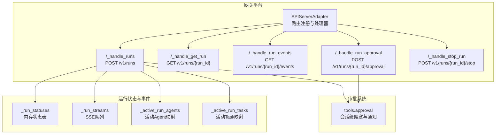
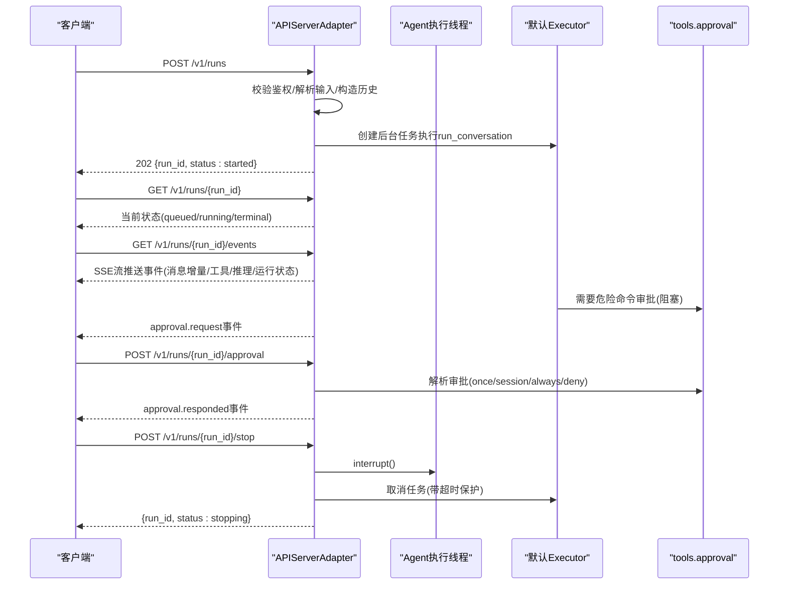
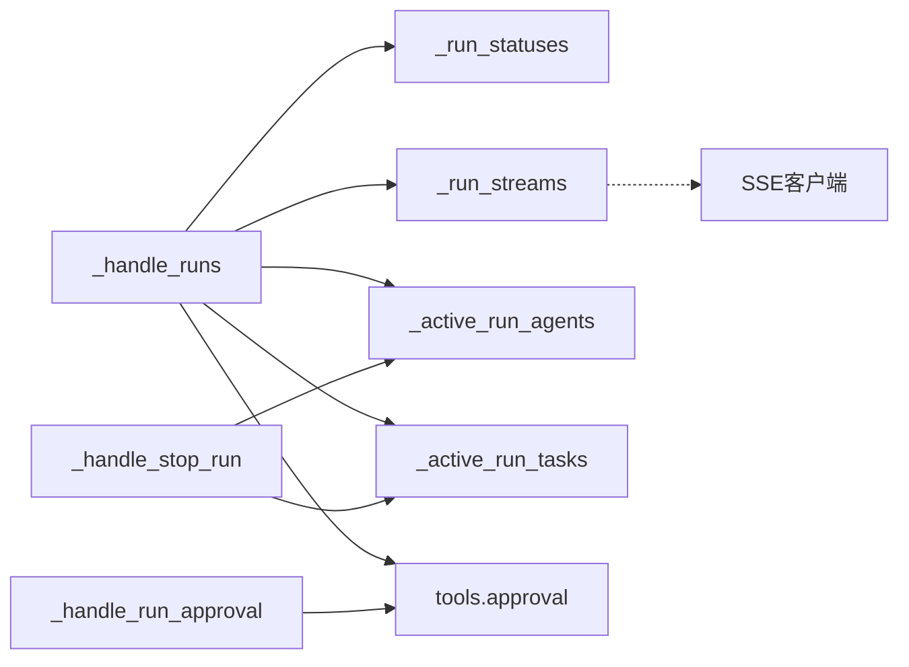

# 运行执行端点

<cite>
**本文引用的文件**
- [api_server.py](file://gateway/platforms/api_server.py)
- [test_api_server_runs.py](file://tests/gateway/test_api_server_runs.py)
- [approval.py](file://tools/approval.py)
- [api-server.md](file://website/docs/user-guide/features/api-server.md)
</cite>

## 目录
1. [简介](#简介)
2. [项目结构](#项目结构)
3. [核心组件](#核心组件)
4. [架构总览](#架构总览)
5. [详细组件分析](#详细组件分析)
6. [依赖关系分析](#依赖关系分析)
7. [性能考量](#性能考量)
8. [故障排查指南](#故障排查指南)
9. [结论](#结论)
10. [附录](#附录)

## 简介
本文件为运行执行端点的完整API文档，覆盖/v1/runs端点集合：POST启动运行（立即返回run_id）、GET获取运行状态、GET事件流（SSE）获取生命周期事件、POST批准运行、POST停止运行。重点说明运行状态跟踪机制、SSE事件流格式与事件类型定义、运行审批流程、中断机制与错误处理策略、运行ID生命周期管理、超时与资源清理，并提供异步任务处理、状态轮询与事件监听的实践模式与监控建议。

## 项目结构
/v1/runs相关实现位于网关平台适配器中，配套测试覆盖了启动、状态轮询、SSE事件流、审批与停止等关键路径；审批逻辑由工具模块提供，支持会话级阻塞与异步通知。

图表来源
- [api_server.py:3566-4139](file://gateway/platforms/api_server.py#L3566-L4139)

章节来源
- [api_server.py:3497-4150](file://gateway/platforms/api_server.py#L3497-L4150)
- [test_api_server_runs.py:1-530](file://tests/gateway/test_api_server_runs.py#L1-L530)

## 核心组件
- 运行状态存储：维护每个run_id的状态对象，包含对象标识、run_id、状态、更新时间、创建时间、会话ID、模型名、输出、用量、最后事件等字段。
- SSE事件队列：每个运行维护一个异步队列，用于推送结构化事件（消息增量、工具调用开始/完成、推理可用、运行完成/失败/取消、审批请求/响应等）。
- 审批系统：基于会话键的阻塞等待队列，支持一次性、会话级、永久允许或拒绝；通过网关回调通知UI或外部系统。
- 中断与停止：对活动Agent调用中断，同时取消后台任务并设置“停止中”状态；超时保护避免长时间阻塞。
- 资源清理：定时清扫未消费的事件流、过期状态、取消中的任务与会话通知。

章节来源
- [api_server.py:3505-3518](file://gateway/platforms/api_server.py#L3505-L3518)
- [api_server.py:3520-3564](file://gateway/platforms/api_server.py#L3520-L3564)
- [api_server.py:3927-4013](file://gateway/platforms/api_server.py#L3927-L4013)
- [api_server.py:4015-4053](file://gateway/platforms/api_server.py#L4015-L4053)
- [api_server.py:4055-4089](file://gateway/platforms/api_server.py#L4055-L4089)

## 架构总览
下图展示/v1/runs端点的端到端交互：客户端发起POST启动运行，服务端立即返回run_id；随后客户端可轮询状态或订阅SSE事件；在需要时进行审批决策；必要时发送停止请求以中断运行。

图表来源
- [api_server.py:3566-3860](file://gateway/platforms/api_server.py#L3566-L3860)
- [api_server.py:3862-3875](file://gateway/platforms/api_server.py#L3862-L3875)
- [api_server.py:3877-3924](file://gateway/platforms/api_server.py#L3877-L3924)
- [api_server.py:3927-4013](file://gateway/platforms/api_server.py#L3927-L4013)
- [api_server.py:4015-4053](file://gateway/platforms/api_server.py#L4015-L4053)

## 详细组件分析

### POST /v1/runs 启动运行
- 请求体字段
  - input：必填，字符串或消息数组；当为数组时，除最后一个元素外其余作为对话历史。
  - instructions：可选，系统提示词。
  - conversation_history：可选，显式传入的历史消息数组（优先于previous_response_id）。
  - previous_response_id：可选，引用已存储响应以复用其历史与指令。
  - session_id：可选，关联会话；若未提供则回退至存储会话或run_id。
  - model：可选，覆盖默认模型名。
- 行为
  - 鉴权校验与会话键解析。
  - 并发限制检查（最大并发运行数）。
  - 输入校验与历史构建；将多消息数组的用户消息提取为最终用户消息，其余作为历史。
  - 生成run_id，初始化状态为“排队”，并建立SSE队列。
  - 在默认Executor中创建后台任务执行run_conversation，注册审批通知回调，将消息增量与工具进度事件写入队列。
  - 返回202，包含run_id与初始状态。
- 错误与边界
  - 缺少input或无有效用户消息返回400。
  - 并发超限返回429。
  - 鉴权失败返回401。
  - 历史格式不合法返回400且不分配run资源。

章节来源
- [api_server.py:3566-3860](file://gateway/platforms/api_server.py#L3566-L3860)
- [test_api_server_runs.py:101-191](file://tests/gateway/test_api_server_runs.py#L101-L191)

### GET /v1/runs/{run_id} 获取运行状态
- 行为
  - 鉴权后查询_run_statuses，返回当前状态对象。
  - 若run_id不存在返回404。
- 状态保留
  - 终止状态（completed/failed/cancelled）在一定时间窗口内保留以便轮询与UI重连。

章节来源
- [api_server.py:3862-3875](file://gateway/platforms/api_server.py#L3862-L3875)
- [api_server.py:4081-4089](file://gateway/platforms/api_server.py#L4081-L4089)
- [test_api_server_runs.py:198-271](file://tests/gateway/test_api_server_runs.py#L198-L271)

### GET /v1/runs/{run_id}/events SSE事件流
- 行为
  - 鉴权后等待run_streams中对应run_id的队列；若尚未注册，最多等待短暂时间后返回404。
  - 以SSE格式持续推送事件，包含心跳与关闭信号；事件到达后写入data:行。
  - 超时默认30秒，保持长连接；流结束发送注释行表示“stream closed”。
- 事件类型与负载
  - message.delta：消息增量事件，携带run_id、时间戳与delta文本。
  - tool.started：工具调用开始，携带run_id、时间戳、工具名与预览。
  - tool.completed：工具调用完成，携带run_id、时间戳、工具名、耗时、是否错误标记。
  - reasoning.available：推理可用，携带run_id、时间戳与文本预览。
  - run.completed：运行完成，携带run_id、时间戳、输出文本与用量统计。
  - run.failed：运行失败，携带run_id、时间戳与错误信息。
  - run.cancelled：运行被取消，携带run_id、时间戳。
  - approval.request：需要审批，携带run_id、时间戳、可选项列表。
  - approval.responded：审批响应，携带run_id、时间戳、选择与影响数量。
- 心跳与关闭
  - 超时发送空事件维持连接；完成后发送注释行并关闭。

章节来源
- [api_server.py:3877-3924](file://gateway/platforms/api_server.py#L3877-L3924)
- [api_server.py:3520-3564](file://gateway/platforms/api_server.py#L3520-L3564)
- [test_api_server_runs.py:278-371](file://tests/gateway/test_api_server_runs.py#L278-L371)

### POST /v1/runs/{run_id}/approval 运行审批
- 请求体字段
  - choice：必填，取值为once、session、always、deny之一；支持别名approve/approved/allow。
  - all或resolve_all：布尔或字符串形式的false/true，控制是否一次性解决队列中所有待决审批。
- 行为
  - 校验run_id存在性与审批会话键有效性。
  - 调用tools.approval.resolve_gateway_approval按FIFO或批量解析。
  - 更新状态为running并推送approval.responded事件。
- 错误
  - 无待决审批返回409。
  - 无效choice返回400。
  - 会话键不存在返回409。

章节来源
- [api_server.py:3927-4013](file://gateway/platforms/api_server.py#L3927-L4013)
- [approval.py:615-641](file://tools/approval.py#L615-L641)
- [test_api_server_runs.py:309-356](file://tests/gateway/test_api_server_runs.py#L309-L356)

### POST /v1/runs/{run_id}/stop 停止运行
- 行为
  - 校验run_id存在（活动Agent或Task任一存在即视为活跃）。
  - 设置状态为“停止中”，尝试调用Agent.interrupt()。
  - 取消后台任务并在受控时间内等待；超时记录警告但不崩溃。
  - 返回{run_id, status: stopping}。
- 清理
  - 异常情况下仍会触发清理：取消会话通知、移除队列与映射、发送终止事件。

章节来源
- [api_server.py:4015-4053](file://gateway/platforms/api_server.py#L4015-L4053)
- [test_api_server_runs.py:378-529](file://tests/gateway/test_api_server_runs.py#L378-L529)

### 运行ID生命周期管理与资源清理
- 生命周期
  - 创建：生成run_id，初始化状态为queued，建立SSE队列与会话键映射。
  - 执行：状态切换为running，推送事件；完成后进入completed/failed/cancelled。
  - 清理：定时清扫未消费的事件流（超过TTL），清理过期状态（超过状态TTL）。
- TTL与并发
  - RUN_STREAM_TTL：孤儿运行流的存活时间，到期自动清理。
  - RUN_STATUS_TTL：终端状态保留时间，便于轮询与重连。
  - MAX_CONCURRENT_RUNS：并发运行上限，防止资源耗尽。

章节来源
- [api_server.py:3501-3503](file://gateway/platforms/api_server.py#L3501-L3503)
- [api_server.py:4055-4089](file://gateway/platforms/api_server.py#L4055-L4089)

### 运行状态跟踪机制
- 状态对象字段
  - object、run_id、status、updated_at、created_at、session_id、model、output、usage、last_event等。
- 状态流转
  - queued → running → completed/failed/cancelled；失败/取消时推送run.failed/run.cancelled事件并写入错误信息。
- 轮询与SSE互补
  - 轮询适合简单集成与断线重连；SSE适合实时交互与事件驱动UI。

章节来源
- [api_server.py:3505-3518](file://gateway/platforms/api_server.py#L3505-L3518)
- [api_server.py:3766-3790](file://gateway/platforms/api_server.py#L3766-L3790)

### 审批流程与会话隔离
- 会话键绑定
  - 使用上下文变量与会话环境变量绑定审批会话键，确保并发运行不共享进程态。
- 阻塞与通知
  - run_conversation在检测到危险命令时阻塞等待，通过网关回调向SSE推送approval.request事件。
- 决策与持久化
  - once：仅本次调用有效；session：会话范围内有效；always：永久允许（受配置与策略约束）；deny：拒绝。
  - 永久允许列表来自配置文件，支持加载与保存。

章节来源
- [api_server.py:3691-3707](file://gateway/platforms/api_server.py#L3691-L3707)
- [approval.py:590-641](file://tools/approval.py#L590-L641)
- [approval.py:721-765](file://tools/approval.py#L721-L765)

### 中断机制与超时保护
- 中断路径
  - 停止请求触发Agent.interrupt()与任务取消；若executor线程仍在等待审批，同样通过清理流程释放等待。
- 超时策略
  - 停止处理中对任务等待设置上限，避免长时间阻塞。
- 资源回收
  - 清扫器定期移除孤儿队列、过期状态与会话通知，保证系统稳定。

章节来源
- [api_server.py:4030-4051](file://gateway/platforms/api_server.py#L4030-L4051)
- [api_server.py:4055-4089](file://gateway/platforms/api_server.py#L4055-L4089)

## 依赖关系分析
- 处理器依赖
  - _handle_runs依赖工具模块的Agent创建、会话上下文、审批通知与默认Executor。
  - _handle_run_approval依赖tools.approval的解析接口。
  - _handle_stop_run依赖活动Agent与任务映射。
- 数据结构耦合
  - _run_statuses与_run_streams是事件驱动的核心数据容器，与SSE回调紧密耦合。
- 外部依赖
  - aiohttp应用与中间件；会话与安全头中间件；请求体大小限制中间件。

图表来源
- [api_server.py:3566-4139](file://gateway/platforms/api_server.py#L3566-L4139)

章节来源
- [api_server.py:4100-4150](file://gateway/platforms/api_server.py#L4100-L4150)

## 性能考量
- 并发控制：通过MAX_CONCURRENT_RUNS限制同时运行数量，避免资源争用。
- 队列与事件：使用异步队列承载SSE事件，避免阻塞主线程；心跳保活减少连接中断。
- 清扫策略：定期清理孤儿队列与过期状态，降低内存占用与查找成本。
- 超时与保护：停止处理中的任务等待设置上限，防止慢任务拖垮服务。

## 故障排查指南
- 启动失败
  - 缺少input或无效历史：检查请求体字段与格式。
  - 并发超限：降低并发或扩容实例。
  - 鉴权失败：确认Authorization头或会话键。
- 状态轮询异常
  - run_not_found：确认run_id正确且未过期。
  - 状态滞留：检查RUN_STATUS_TTL与清理任务是否正常。
- SSE事件流问题
  - 订阅过早：等待短暂窗口后重试；或先轮询一次再订阅。
  - 连接中断：利用心跳与断线重连；确认代理/网关SSE支持。
- 审批无响应
  - 无待决审批：确认run确实触发了危险命令；检查会话键绑定。
  - 解析失败：核对choice取值与resolve_all参数。
- 停止无效
  - 已完成：已完成的run_refs已被清理，再次停止返回404属预期。
  - 中断异常：Agent.interrupt抛出异常不会导致停止失败，但可能无法即时中断。

章节来源
- [test_api_server_runs.py:127-191](file://tests/gateway/test_api_server_runs.py#L127-L191)
- [test_api_server_runs.py:258-271](file://tests/gateway/test_api_server_runs.py#L258-L271)
- [test_api_server_runs.py:358-371](file://tests/gateway/test_api_server_runs.py#L358-L371)
- [test_api_server_runs.py:421-462](file://tests/gateway/test_api_server_runs.py#L421-L462)
- [test_api_server_runs.py:463-494](file://tests/gateway/test_api_server_runs.py#L463-L494)

## 结论
/v1/runs端点提供了面向长会话与复杂工具调用的结构化事件流能力，结合会话级审批与受控中断，满足生产级运行管理需求。通过合理的并发控制、TTL与清扫策略，系统在稳定性与可观测性之间取得平衡。建议在客户端侧采用断线重连、事件去重与状态缓存策略，以获得最佳用户体验。

## 附录

### API规范摘要
- POST /v1/runs
  - 请求体：input、instructions、conversation_history、previous_response_id、session_id、model
  - 成功：202 {run_id, status: started}
  - 错误：400/401/429
- GET /v1/runs/{run_id}
  - 成功：200 状态对象
  - 错误：404
- GET /v1/runs/{run_id}/events
  - 成功：200 text/event-stream
  - 错误：404
- POST /v1/runs/{run_id}/approval
  - 请求体：choice、all/resolve_all
  - 成功：200 {object, run_id, choice, resolved}
  - 错误：400/404/409
- POST /v1/runs/{run_id}/stop
  - 成功：200 {run_id, status: stopping}
  - 错误：404

章节来源
- [api_server.py:3566-4139](file://gateway/platforms/api_server.py#L3566-L4139)
- [api-server.md:232-269](file://website/docs/user-guide/features/api-server.md#L232-L269)