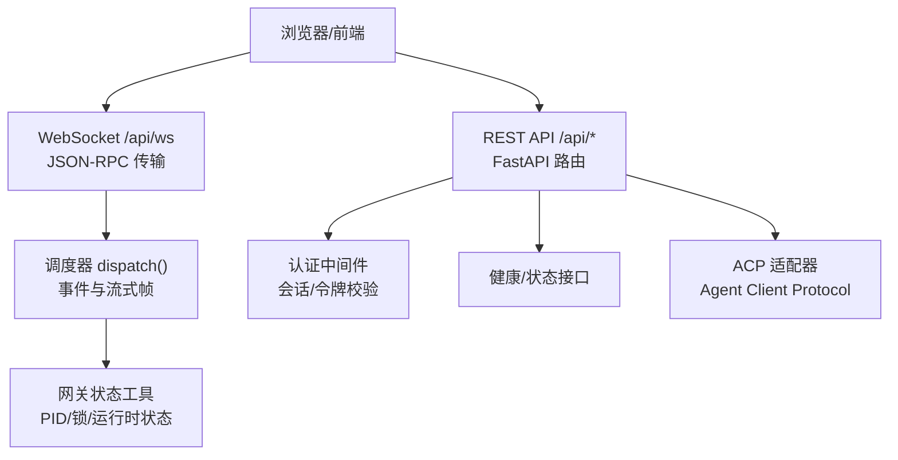
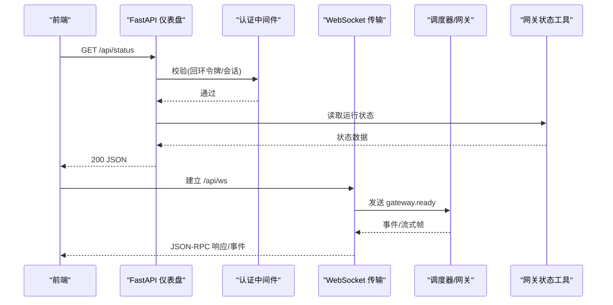
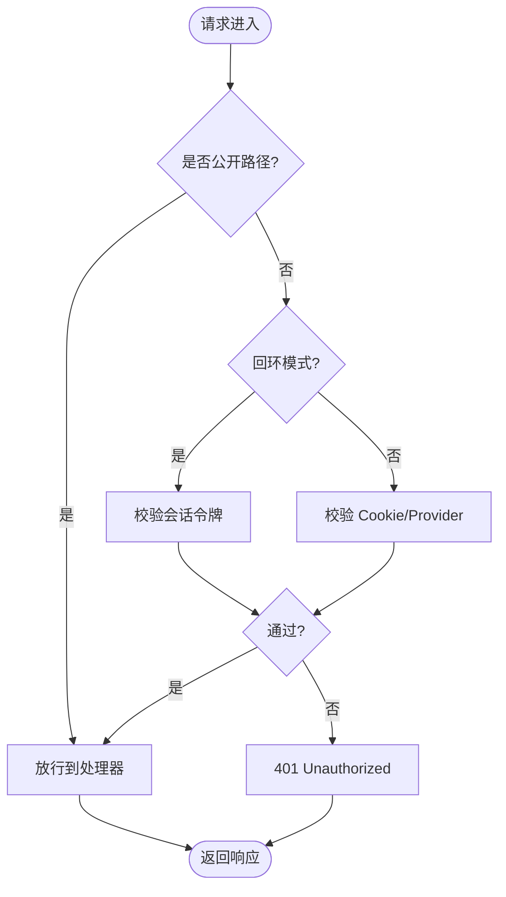
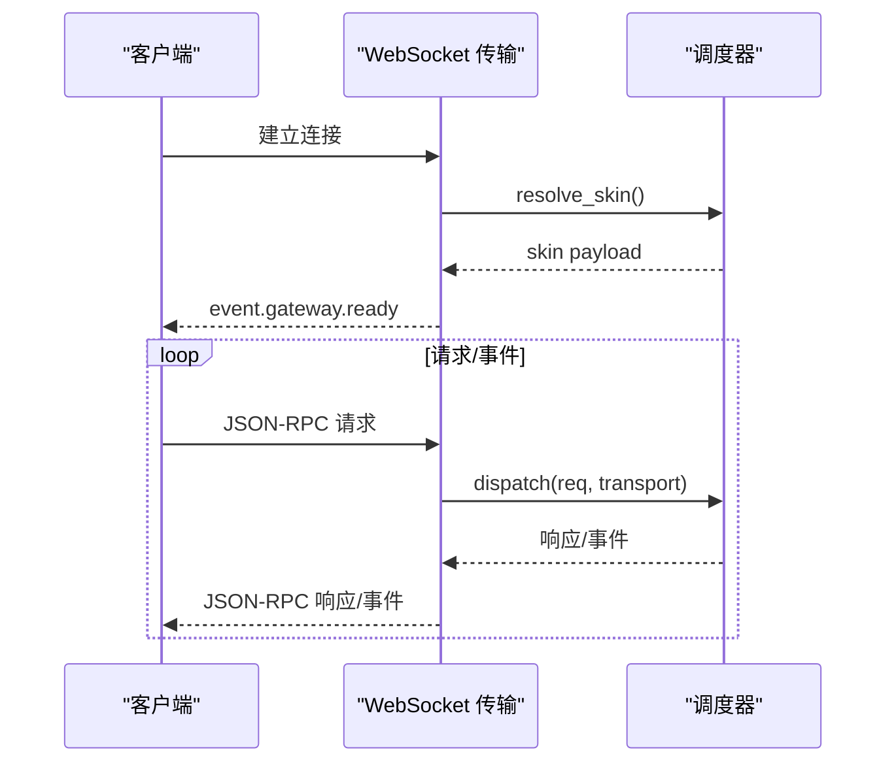
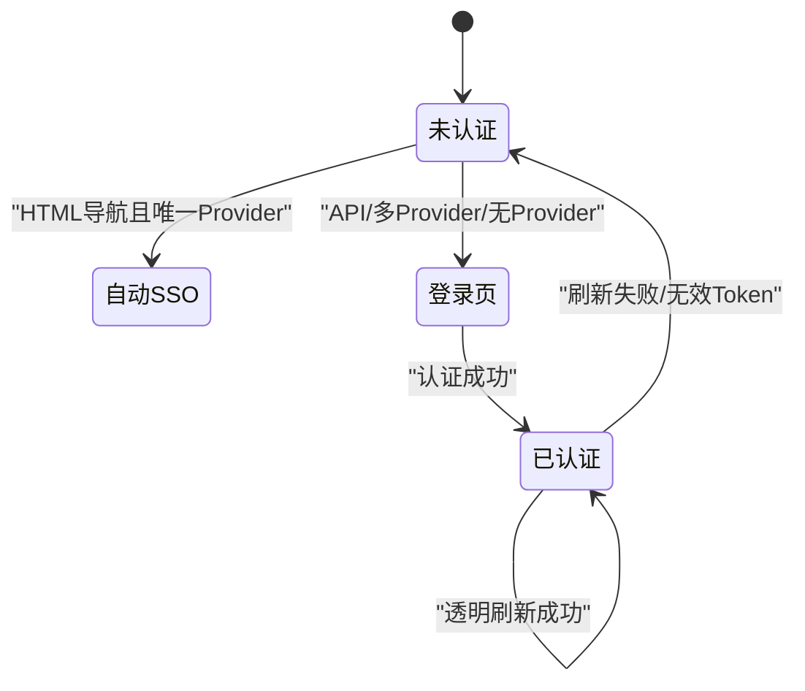
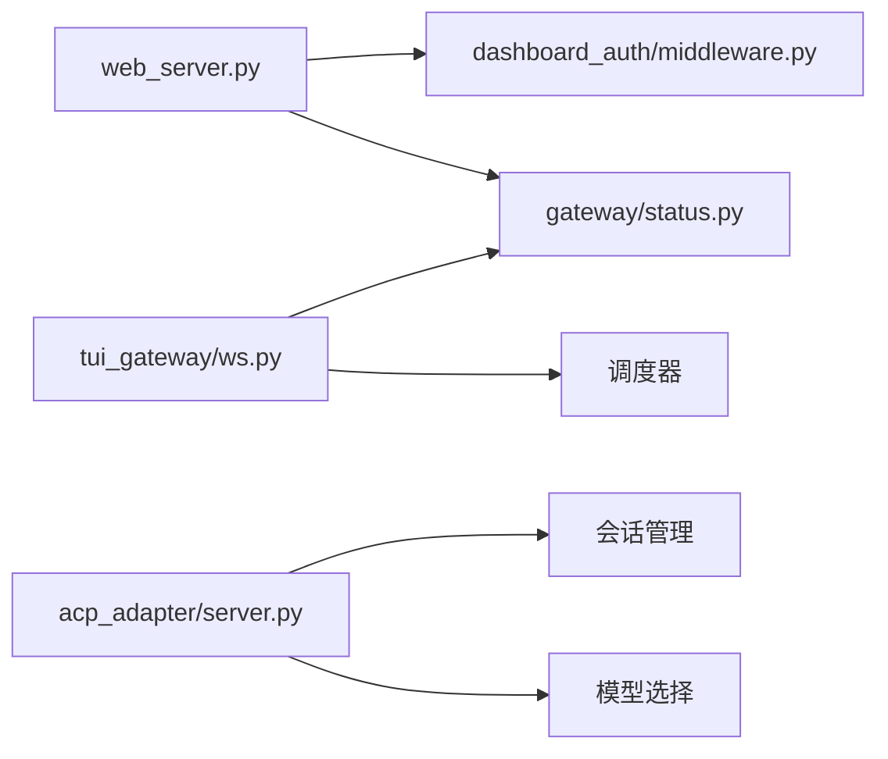

# API 集成

<cite>
**本文引用的文件**
- [web_server.py](file://hermes_cli/web_server.py)
- [ws.py](file://tui_gateway/ws.py)
- [middleware.py](file://hermes_cli/dashboard_auth/middleware.py)
- [public_paths.py](file://hermes_cli/dashboard_auth/public_paths.py)
- [status.py](file://gateway/status.py)
- [server.py](file://acp_adapter/server.py)
</cite>

## 目录
1. [简介](#简介)
2. [项目结构](#项目结构)
3. [核心组件](#核心组件)
4. [架构总览](#架构总览)
5. [详细组件分析](#详细组件分析)
6. [依赖关系分析](#依赖关系分析)
7. [性能考量](#性能考量)
8. [故障排查指南](#故障排查指南)
9. [结论](#结论)
10. [附录：API 规范与最佳实践](#附录api-规范与最佳实践)

## 简介
本文件面向 Web 仪表板的前后端集成，系统性说明 REST API、WebSocket、实时事件与流式响应、认证授权与会话管理、错误处理策略，以及客户端 SDK 使用建议、连接池与重连机制。文档基于仓库中的 FastAPI 仪表盘服务、TUI Gateway WebSocket 传输、Dashboard 认证中间件、网关状态工具与 ACP 适配器进行梳理，帮助系统集成与第三方应用开发实现稳定可靠的对接。

## 项目结构
- Web 仪表盘后端（FastAPI）：提供静态 SPA 托管、REST API、WebSocket 路由、CORS、健康检查、会话令牌注入等能力。
- TUI Gateway WebSocket：以 JSON-RPC 协议承载 RPC 调用、事件推送与流式 token 输出，具备帧合并与低延迟优化。
- Dashboard 认证中间件：在非回环绑定模式下启用 OAuth/密码登录的会话校验、自动刷新与重定向；在回环模式使用会话令牌。
- 网关状态工具：读取/写入 PID、锁、运行时状态，提供进程存活检测与风暴保护。
- ACP 适配器：对外暴露 Agent Client Protocol，封装会话、模型选择、资源附件、命令与流式事件。

**图示来源**
- [web_server.py:313-671](file://hermes_cli/web_server.py#L313-L671)
- [ws.py:286-477](file://tui_gateway/ws.py#L286-L477)
- [middleware.py:323-531](file://hermes_cli/dashboard_auth/middleware.py#L323-L531)
- [status.py:583-617](file://gateway/status.py#L583-L617)
- [server.py:566-800](file://acp_adapter/server.py#L566-L800)

**章节来源**
- [web_server.py:1-135](file://hermes_cli/web_server.py#L1-L135)
- [ws.py:1-68](file://tui_gateway/ws.py#L1-L68)
- [middleware.py:1-65](file://hermes_cli/dashboard_auth/middleware.py#L1-L65)
- [public_paths.py:1-61](file://hermes_cli/dashboard_auth/public_paths.py#L1-L61)
- [status.py:1-129](file://gateway/status.py#L1-L129)
- [server.py:1-87](file://acp_adapter/server.py#L1-L87)

## 核心组件
- FastAPI 仪表盘服务
  - 生命周期管理：初始化事件通道、PTY 清理、自测任务、自动归档等后台任务。
  - 安全与访问控制：CORS、Host 头校验、插件 API 运行时门控、OAuth/令牌双轨认证。
  - 公开路径白名单：仅允许最小化只读端点免认证访问。
- WebSocket 传输层
  - JSON-RPC 协议：服务端连接后立刻发送 gateway.ready，后续按请求返回响应或事件。
  - 流式帧合并：高频 token 类事件聚合发送，降低事件循环唤醒开销。
  - 健壮性：Nagle 关闭、写超时、异常捕获、连接断开后的会话回收。
- 认证与授权
  - 回环模式：通过注入的会话令牌（Header 或查询参数）鉴权。
  - 非回环模式：Cookie/OAuth 会话校验，支持自动 SSO 跳转、透明刷新、Provider 不可达降级。
  - 公共路径：统一白名单避免两个鉴权路径不一致导致探针失败。
- 网关状态与守护
  - PID/锁/运行时状态文件的读写与校验，跨平台进程存活检测，重启风暴保护。
- ACP 适配器
  - 将 Hermes Agent 能力以标准协议暴露，包含会话管理、模型选择、资源附件、命令与流式事件。

**章节来源**
- [web_server.py:217-313](file://hermes_cli/web_server.py#L217-L313)
- [web_server.py:373-671](file://hermes_cli/web_server.py#L373-L671)
- [ws.py:70-257](file://tui_gateway/ws.py#L70-L257)
- [middleware.py:323-531](file://hermes_cli/dashboard_auth/middleware.py#L323-L531)
- [public_paths.py:33-60](file://hermes_cli/dashboard_auth/public_paths.py#L33-L60)
- [status.py:583-617](file://gateway/status.py#L583-L617)
- [server.py:566-800](file://acp_adapter/server.py#L566-L800)

## 架构总览
下图展示前端与后端的主要交互路径：REST 用于配置、状态、会话管理等；WebSocket 用于实时事件与流式输出；认证中间件保障安全；状态工具支撑守护与健康检查；ACP 适配器为外部系统提供标准化接口。

**图示来源**
- [web_server.py:398-671](file://hermes_cli/web_server.py#L398-L671)
- [ws.py:286-337](file://tui_gateway/ws.py#L286-L337)
- [status.py:583-617](file://gateway/status.py#L583-L617)

## 详细组件分析

### REST API 端点与安全
- 公开端点（无需认证）
  - /api/health：进程级健康探针
  - /api/status：版本、网关状态、活跃会话数、认证门形状
  - /api/config/defaults、/api/config/schema：配置默认值与 Schema
  - /api/model/info：模型元信息
  - /api/dashboard/themes、/api/dashboard/plugins：主题与插件清单
  - /api/cron/fire：受 NAS JWT 保护的定时任务触发回调
- 受保护端点
  - 所有 /api/* 其他路径需通过会话令牌或 OAuth 会话验证
  - 支持两种鉴权方式：
    - 回环模式：X-Hermes-Session-Token 或 Authorization: Bearer <token>
    - 非回环模式：Cookie 会话 + Provider 校验，支持自动 SSO 跳转与透明刷新
- Host 头校验与 CORS
  - 限制 Host 头匹配绑定地址，防止 DNS Rebinding
  - CORS 仅允许 localhost/127.0.0.1 同源访问

**图示来源**
- [web_server.py:398-671](file://hermes_cli/web_server.py#L398-L671)
- [middleware.py:323-531](file://hermes_cli/dashboard_auth/middleware.py#L323-L531)
- [public_paths.py:33-60](file://hermes_cli/dashboard_auth/public_paths.py#L33-L60)

**章节来源**
- [web_server.py:373-671](file://hermes_cli/web_server.py#L373-L671)
- [middleware.py:112-163](file://hermes_cli/dashboard_auth/middleware.py#L112-L163)
- [public_paths.py:33-60](file://hermes_cli/dashboard_auth/public_paths.py#L33-L60)

### WebSocket 连接与实时事件
- 连接建立
  - 客户端连接 /api/ws，服务端发送 gateway.ready，携带皮肤信息与变更事件开关
- 协议
  - 双向 JSON-RPC：请求/响应与事件均按行分隔的 JSON 帧
  - 高频 token 事件（message.delta、reasoning.delta、thinking.delta）采用合并发送，约 30fps 刷新
- 健壮性与性能
  - 关闭 Nagle 保证小帧即时发出
  - 写超时保护事件循环阻塞场景
  - 异常捕获与统计：解析错误、调度崩溃、发送失败计数
  - 连接断开时回收会话并释放资源

**图示来源**
- [ws.py:286-477](file://tui_gateway/ws.py#L286-L477)

**章节来源**
- [ws.py:70-257](file://tui_gateway/ws.py#L70-L257)
- [ws.py:286-477](file://tui_gateway/ws.py#L286-L477)

### 认证授权与会话管理
- 回环模式（本地绑定）
  - 通过注入的会话令牌鉴权，支持 Header 与查询参数（下载链接等场景）
- 非回环模式（公网/局域网）
  - 强制启用 OAuth/密码登录，未认证 HTML 页面重定向至 /login，API 返回结构化 401
  - 支持自动 SSO 跳转（单 Provider 且为 OAuth），避免多余点击
  - 透明刷新：Access Token 过期时使用 Refresh Token 轮换，成功则静默续期
  - Provider 不可达：返回 503 而非强制登出，便于客户端重试
- 公共路径白名单
  - 统一维护，避免两个鉴权路径不一致导致探针失败

**图示来源**
- [middleware.py:166-241](file://hermes_cli/dashboard_auth/middleware.py#L166-L241)
- [middleware.py:323-531](file://hermes_cli/dashboard_auth/middleware.py#L323-L531)

**章节来源**
- [middleware.py:112-163](file://hermes_cli/dashboard_auth/middleware.py#L112-L163)
- [middleware.py:166-241](file://hermes_cli/dashboard_auth/middleware.py#L166-L241)
- [middleware.py:323-531](file://hermes_cli/dashboard_auth/middleware.py#L323-L531)
- [public_paths.py:33-60](file://hermes_cli/dashboard_auth/public_paths.py#L33-L60)

### 错误处理策略
- HTTP 层
  - Host 头不匹配：400，提示必须使用绑定主机名
  - 插件 API 禁用：404，防止枚举插件名称
  - 未认证：401，API 返回结构化错误体含 login_url
  - Provider 不可达：503，指示临时故障
  - 内部错误：5xx 被健康中间件记录，供 /api/status 组件健康快照
- WebSocket 层
  - 解析错误：返回 JSON-RPC 错误码 -32700
  - 调度崩溃：返回 -32603 内部错误
  - 发送失败：记录统计并终止连接
- 状态与守护
  - PID/锁/运行时状态文件损坏或不一致：忽略并尝试恢复
  - 重启风暴：指数退避，避免频繁拉起

**章节来源**
- [web_server.py:538-671](file://hermes_cli/web_server.py#L538-L671)
- [ws.py:359-428](file://tui_gateway/ws.py#L359-L428)
- [status.py:71-129](file://gateway/status.py#L71-L129)

### 流式响应与实时事件
- 事件类型
  - message.delta、reasoning.delta、thinking.delta：高频 token 事件，合并发送
- 合并策略
  - 缓冲高频帧，定时器批量 flush，保持顺序一致性
  - 非流式帧会先清空缓冲再发送，确保时序正确
- 性能优化
  - 关闭 Nagle，减少首包延迟
  - 线程安全写：从工作线程安全写入，避免事件循环阻塞

**章节来源**
- [ws.py:44-61](file://tui_gateway/ws.py#L44-L61)
- [ws.py:118-187](file://tui_gateway/ws.py#L118-L187)
- [ws.py:189-226](file://tui_gateway/ws.py#L189-L226)

### 客户端 SDK 使用示例与最佳实践
- REST 调用
  - 本地绑定：在请求头添加 X-Hermes-Session-Token 或使用 Authorization: Bearer
  - 公网绑定：遵循 401 结构化响应，跳转到 login_url 完成登录
  - 下载链接：使用 ?token= 查询参数传递会话令牌
- WebSocket 连接
  - 连接 /api/ws，等待 gateway.ready 后再发起 RPC
  - 订阅 delta 事件，注意合并频率与顺序
  - 处理解析错误与调度错误，做好重连与降级
- 重连与连接池
  - 指数退避重连：首次快速重试，随后逐步增加间隔
  - 连接池：为不同用户/会话复用连接，避免频繁握手
  - 心跳与保活：定期发送轻量请求或 ping，检测链路健康
- 错误处理
  - 区分网络错误、认证错误、服务端错误，分别采取重连、跳转登录或上报
  - 对 Provider 不可达（503）做短暂等待后重试

[本节为通用指导，不直接分析具体文件]

## 依赖关系分析
- FastAPI 仪表盘依赖：
  - 认证中间件（回环令牌/非回环 OAuth）
  - 健康与状态工具（PID/锁/运行时状态）
  - 插件 API 运行时门控
- WebSocket 传输依赖：
  - 调度器（RPC 方法、事件、流式帧）
  - 状态工具（皮肤、变更事件）
- ACP 适配器依赖：
  - 会话管理器、模型选择、资源附件、命令与流式事件

**图示来源**
- [web_server.py:313-671](file://hermes_cli/web_server.py#L313-L671)
- [ws.py:286-477](file://tui_gateway/ws.py#L286-L477)
- [server.py:566-800](file://acp_adapter/server.py#L566-L800)

**章节来源**
- [web_server.py:313-671](file://hermes_cli/web_server.py#L313-L671)
- [ws.py:286-477](file://tui_gateway/ws.py#L286-L477)
- [server.py:566-800](file://acp_adapter/server.py#L566-L800)

## 性能考量
- 冷启动预热：提前导入重型模块，避免首次请求卡顿
- 事件循环保护：长耗时操作放入线程池，避免阻塞事件循环
- 流式帧合并：高频 token 事件批量发送，降低事件循环唤醒次数
- 写超时与死锁防护：从工作线程写入时设置超时，避免永久阻塞
- 健康自检：周期性内省认证路径可用性，及时暴露退化状态

**章节来源**
- [web_server.py:171-206](file://hermes_cli/web_server.py#L171-L206)
- [ws.py:118-187](file://tui_gateway/ws.py#L118-L187)
- [web_server.py:770-800](file://hermes_cli/web_server.py#L770-L800)

## 故障排查指南
- 401 Unauthorized
  - 检查是否携带正确的会话令牌或 Cookie
  - 确认路径是否在公开白名单中
  - 查看 login_url 并引导用户重新登录
- 503 Provider 不可达
  - 检查 IDP/JWKS 可达性
  - 客户端应重试而非强制登出
- WebSocket 解析错误
  - 检查消息格式是否为合法 JSON-RPC
  - 关注 -32700 错误码
- 连接断开与资源泄漏
  - 确认连接关闭时是否回收会话
  - 观察统计指标：parse_errors、dispatch_crashes、send_failures

**章节来源**
- [web_server.py:398-671](file://hermes_cli/web_server.py#L398-L671)
- [ws.py:359-477](file://tui_gateway/ws.py#L359-L477)
- [middleware.py:323-531](file://hermes_cli/dashboard_auth/middleware.py#L323-L531)

## 结论
本集成方案通过 FastAPI 仪表盘、WebSocket 传输、认证中间件与状态工具，提供了安全、可靠、高性能的 Web 仪表板 API。结合 ACP 适配器，可对外暴露标准化的 Agent 能力。建议客户端遵循公开路径、正确处理 401/503、实现稳健的重连与连接池，以获得最佳用户体验与系统稳定性。

## 附录：API 规范与最佳实践
- REST 端点
  - /api/health：GET，返回进程健康状态
  - /api/status：GET，返回版本、网关状态、活跃会话数、认证门形状
  - /api/config/defaults、/api/config/schema：GET，返回配置默认值与 Schema
  - /api/model/info：GET，返回模型元信息
  - /api/dashboard/themes、/api/dashboard/plugins：GET，返回主题与插件清单
  - /api/cron/fire：POST，携带 NAS 签发的 JWT，触发定时任务
- WebSocket
  - /api/ws：建立连接后接收 gateway.ready，随后按 JSON-RPC 协议通信
  - 事件类型：message.delta、reasoning.delta、thinking.delta（高频合并）
- 状态码与错误码
  - 400：Host 头不匹配
  - 401：未认证（API 返回结构化错误体含 login_url）
  - 404：插件 API 禁用或不存在
  - 500/5xx：内部错误（健康中间件记录）
  - 503：Provider 不可达（临时故障）
  - JSON-RPC 错误码：-32700（解析错误）、-32603（内部错误）
- 客户端最佳实践
  - 本地绑定使用会话令牌；公网绑定遵循 401 流程跳转登录
  - WebSocket 连接后等待 gateway.ready 再发起 RPC
  - 实现指数退避重连与连接池，监控错误指标
  - 对 503 做短暂等待后重试，避免立即登出

[本节为通用规范总结，不直接分析具体文件]