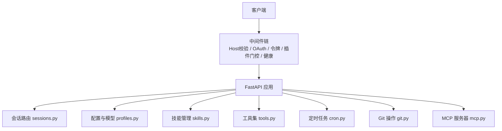
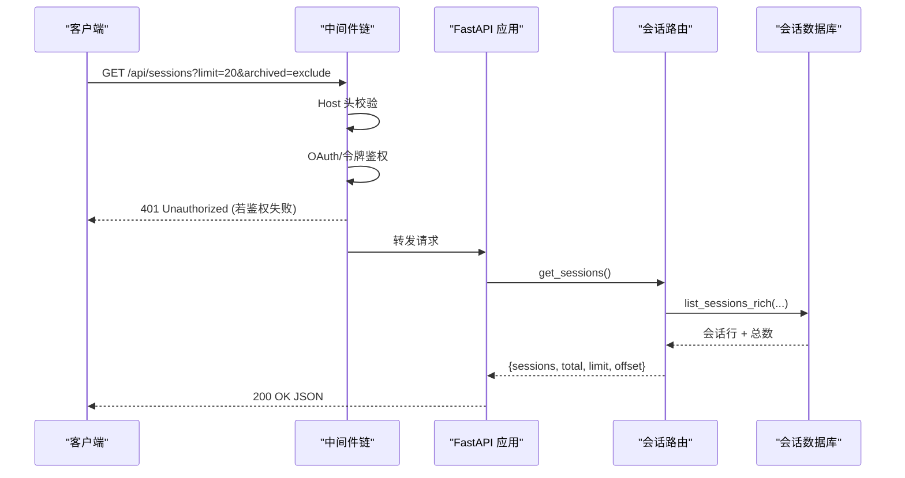

# REST API 端点

<cite>
**本文引用的文件**
- [web_server.py](file://hermes_cli/web_server.py)
- [sessions.py](file://hermes_cli/web_routers/sessions.py)
- [skills.py](file://hermes_cli/web_routers/skills.py)
- [profiles.py](file://hermes_cli/web_routers/profiles.py)
- [tools.py](file://hermes_cli/web_routers/tools.py)
- [cron.py](file://hermes_cli/web_routers/cron.py)
- [git.py](file://hermes_cli/web_routers/git.py)
- [mcp.py](file://hermes_cli/web_routers/mcp.py)
</cite>

## 目录
1. [简介](#简介)
2. [项目结构](#项目结构)
3. [核心组件](#核心组件)
4. [架构总览](#架构总览)
5. [详细组件分析](#详细组件分析)
6. [依赖关系分析](#依赖关系分析)
7. [性能考虑](#性能考虑)
8. [故障排查指南](#故障排查指南)
9. [结论](#结论)
10. [附录](#附录)

## 简介
本文件面向第三方应用集成，提供 Hermes Agent Web 服务（FastAPI）的完整 REST API 规范。覆盖会话管理、配置与模型设置、技能管理、定时任务、Git 操作、MCP 服务器管理等核心模块。文档包含：
- 每个端点的 HTTP 方法、URL、请求参数、响应结构与状态码
- 认证机制、权限控制与错误处理策略
- 成功/失败示例（JSON 结构说明）
- 最佳实践与常见问题排查

## 项目结构
Web 服务由 FastAPI 应用承载，路由按功能拆分为多个子路由器，统一挂载到主应用中。安全层通过中间件实现：Host 头校验、OAuth/会话令牌鉴权、插件运行时门控、健康监控等。

**图示来源**
- [web_server.py:313-685](file://hermes_cli/web_server.py#L313-L685)
- [sessions.py:53-788](file://hermes_cli/web_routers/sessions.py#L53-L788)
- [profiles.py:373-800](file://hermes_cli/web_routers/profiles.py#L373-L800)
- [skills.py:58-512](file://hermes_cli/web_routers/skills.py#L58-L512)
- [tools.py:57-785](file://hermes_cli/web_routers/tools.py#L57-L785)
- [cron.py:52-246](file://hermes_cli/web_routers/cron.py#L52-L246)
- [git.py:32-139](file://hermes_cli/web_routers/git.py#L32-L139)
- [mcp.py:61-517](file://hermes_cli/web_routers/mcp.py#L61-L517)

**章节来源**
- [web_server.py:313-685](file://hermes_cli/web_server.py#L313-L685)

## 核心组件
- 认证与安全
  - Host 头校验：防止 DNS 重绑定攻击，仅接受绑定的主机名或回环地址
  - 会话令牌鉴权：非公开路径需携带 X-Hermes-Session-Token 或 Bearer 令牌；部分下载链接支持 ?token= 查询参数
  - OAuth 门禁：非回环绑定强制启用 OAuth/密码门禁；已认证请求跳过令牌检查
  - 插件运行时门控：禁用插件的路径返回 404，避免信息泄露
  - 健康监控：记录未处理异常与 5xx，周期性自测受保护端点

- 路由组织
  - 会话：列表、搜索、详情、消息、批量删除、导入导出、统计、归档清理
  - 配置与模型：Profile CRUD、活跃 Profile、SOUL.md、描述、模型设置、自动描述生成、导出/导入
  - 技能：Hub 安装/卸载/更新/搜索/预览/扫描，本地技能 CRUD 与内容编辑
  - 工具集：工具集开关、提供者选择、环境变量保存、模型目录与选择、终端后端选择、Computer Use 权限
  - 定时任务：作业 CRUD、运行历史、触发、暂停/恢复、蓝图清单与实例化、外部 fire webhook
  - Git：仓库状态、分支、工作树、审查、提交、推送、PR 创建
  - MCP：服务器 CRUD、测试连接、OAuth 流程、目录浏览与安装

**章节来源**
- [web_server.py:398-685](file://hermes_cli/web_server.py#L398-L685)
- [sessions.py:53-788](file://hermes_cli/web_routers/sessions.py#L53-L788)
- [profiles.py:373-800](file://hermes_cli/web_routers/profiles.py#L373-L800)
- [skills.py:58-512](file://hermes_cli/web_routers/skills.py#L58-L512)
- [tools.py:57-785](file://hermes_cli/web_routers/tools.py#L57-L785)
- [cron.py:52-246](file://hermes_cli/web_routers/cron.py#L52-L246)
- [git.py:32-139](file://hermes_cli/web_routers/git.py#L32-L139)
- [mcp.py:61-517](file://hermes_cli/web_routers/mcp.py#L61-L517)

## 架构总览
下图展示一次受保护的会话列表请求在中间件与路由间的流转过程。

**图示来源**
- [web_server.py:538-685](file://hermes_cli/web_server.py#L538-L685)
- [sessions.py:53-167](file://hermes_cli/web_routers/sessions.py#L53-L167)

**章节来源**
- [web_server.py:538-685](file://hermes_cli/web_server.py#L538-L685)
- [sessions.py:53-167](file://hermes_cli/web_routers/sessions.py#L53-L167)

## 详细组件分析

### 会话管理 API
- 列表会话
  - 方法/路径：GET /api/sessions
  - 查询参数：limit(0-100)、offset(≥0)、min_messages(≥0)、archived(exclude|only|include)、order(created|recent)、source、sources(csv)、exclude_sources(csv)、cwd_prefix、full(bool)、profile
  - 成功响应：{sessions: [...], total: number, limit: number, offset: number}
  - 错误：400（参数非法）、500（内部错误）
  - 示例（成功）：{"sessions": [{"id":"...","title":"...","model":"...","started_at":1710000000,"last_active":1710000060,"is_active":true,"archived":false,"pinned":false,"profile":"default"}],"total":120,"limit":20,"offset":0}
  - 示例（错误）：{"detail":"archived must be one of: exclude, only, include"}

- 搜索会话
  - 方法/路径：GET /api/sessions/search
  - 查询参数：q、limit(1-100)、profile、source、sources(csv)、exclude_sources(csv)
  - 成功响应：{results: [{session_id, lineage_root, snippet, role, source, model, session_started}, ...]}
  - 错误：500（搜索失败）

- 批量删除
  - 方法/路径：POST /api/sessions/bulk-delete
  - 请求体：{ids: string[], profile?: string}
  - 成功响应：{ok: true, deleted: number}
  - 错误：400（ids 超过上限）、500

- 导入会话
  - 方法/路径：POST /api/sessions/import
  - 请求体：{profile?: string, sessions: any[]}
  - 成功响应：{ok: true, ...}
  - 错误：400（无效负载）、500

- 空会话计数/删除
  - GET /api/sessions/empty/count → {count: number}
  - DELETE /api/sessions/empty → {ok: true, deleted: number}

- 统计
  - GET /api/sessions/stats → {total, active_store, archived, messages, by_source: {}}

- 会话详情
  - GET /api/sessions/{session_id} → 会话对象（含 profile、is_default_profile）
  - 错误：404（不存在）

- 最新后代
  - GET /api/sessions/{session_id}/latest-descendant → {requested_session_id, session_id, path: [], changed: bool}

- 消息分页
  - GET /api/sessions/{session_id}/messages?limit=&offset=&order=(oldest|latest)
  - 成功响应：{session_id, messages: [...], pagination: {limit, offset, order, returned}}

- 删除会话
  - DELETE /api/sessions/{session_id} → {ok: true | {already_absent: true}}

- 重命名/归档/置顶
  - PATCH /api/sessions/{session_id}
  - 请求体：{title?, archived?, pinned?, profile?}
  - 成功响应：{ok: true, title, archived?, pinned?}

- 导出
  - GET /api/sessions/{session_id}/export → Streaming JSON（元数据+消息流式输出）

- 修剪
  - POST /api/sessions/prune → 根据过滤条件删除已结束会话

**章节来源**
- [sessions.py:53-788](file://hermes_cli/web_routers/sessions.py#L53-L788)

### 配置与模型设置 API（Profiles）
- 列出 Profiles
  - GET /api/profiles → {profiles: [...]}

- 创建 Profile
  - POST /api/profiles
  - 请求体：{name, clone_from?, clone_all?, no_skills?, description?, provider?, model?, mcp_servers?, keep_skills?, hub_skills?}
  - 成功响应：{ok: true, name, path, model_set: bool, mcp_written: number, skills_disabled: number, hub_installs: []}

- 聚合会话（跨 Profile）
  - GET /api/profiles/sessions?limit&offset&min_messages&archived&order&profile&source&sources&exclude_sources&full
  - 成功响应：{sessions: [...], total, profile_totals: {}, limit, offset, errors: []}

- 侧边栏聚合
  - GET /api/profiles/sessions/sidebar?recents_profile&recents_limit&recents_exclude&cron_limit&messaging_limit&messaging_exclude
  - 成功响应：{recents:{sessions,truncated}, cron:{sessions}, messaging:{sessions,total}, errors:[]}

- 活跃 Profile
  - GET /api/profiles/active → {active, current}
  - POST /api/profiles/active → {ok: true, active}

- 打开终端
  - POST /api/profiles/{name}/open-terminal → {ok: true, command}

- SOUL.md
  - GET /api/profiles/{name}/soul → {content, exists}
  - PUT /api/profiles/{name}/soul → {ok: true}

- 描述
  - PUT /api/profiles/{name}/description → {ok: true, description, description_auto: false}

- 模型设置
  - PUT /api/profiles/{name}/model → {ok: true, provider, model}

- 自动描述
  - POST /api/profiles/{name}/describe-auto → {ok, reason, description, description_auto}

- 导出/导入
  - POST /api/profiles/{name}/export → {ok: true, archive}
  - POST /api/profiles/import → {ok: true, profile_dir}

**章节来源**
- [profiles.py:373-800](file://hermes_cli/web_routers/profiles.py#L373-L800)

### 技能管理 API
- Hub 安装/卸载/更新
  - POST /api/skills/hub/install → {ok: true, pid, name}
  - POST /api/skills/hub/uninstall → {ok: true, pid, name}
  - POST /api/skills/hub/update → {ok: true, pid, name}

- Hub 源与搜索
  - GET /api/skills/hub/sources → {sources:[{id,label,rate_limited?,available?,searchable}], index_available, featured:[], installed:[]}
  - GET /api/skills/hub/search?q&source&limit&profile → {results:[], source_counts:{}, timed_out:[], installed:{}}

- 预览/扫描
  - GET /api/skills/hub/preview?identifier → {name, description, source, identifier, trust_level, repo, tags:[], skill_md, files:[]}
  - GET /api/skills/hub/scan?identifier → {name, identifier, source, trust_level, verdict, summary, policy, policy_reason, findings:[], severity_counts:{}}

- 本地技能
  - GET /api/skills → 技能列表（含 enabled、usage、provenance）
  - PUT /api/skills/toggle → {ok: true, name, enabled}
  - GET /api/skills/content?name → {name, content, path}
  - POST /api/skills → {success, ...}
  - PUT /api/skills/content → {success, ...}

**章节来源**
- [skills.py:58-512](file://hermes_cli/web_routers/skills.py#L58-L512)

### 工具集与终端后端 API
- 工具集
  - GET /api/tools/toolsets → [{name, label, description, platform, platform_label, enabled, available, configured, tools:[]}]
  - PUT /api/tools/toolsets/{name} → {ok: true, name, platform, enabled}
  - GET /api/tools/toolsets/{name}/config → {name, has_category, providers:[], active_provider, active_search_backend?, active_extract_backend?}
  - GET /api/tools/toolsets/{name}/models → {name, has_models, provider, plugin, models:[], current, default}
  - PUT /api/tools/toolsets/{name}/model → {ok: true, name, model, plugin}
  - PUT /api/tools/toolsets/{name}/provider → {ok: true, name, provider, capability?, needs_nous_auth?, feature?}
  - PUT /api/tools/toolsets/{name}/env → {ok: true, name, saved:[], skipped:[], is_set:{}}
  - POST /api/tools/toolsets/{name}/post-setup → {ok: true, pid, name, key}

- 终端后端
  - GET /api/tools/terminal/backends → {active, backends:[{name,label,description,active,status,detail}]}
  - PUT /api/tools/terminal/backend → {ok: true, backend}

- Computer Use
  - GET /api/tools/computer-use/status → 平台就绪状态
  - POST /api/tools/computer-use/permissions/grant → {ok: true, pid, name}（macOS）

**章节来源**
- [tools.py:57-785](file://hermes_cli/web_routers/tools.py#L57-L785)

### 定时任务 API（Cron）
- 作业
  - GET /api/cron/jobs?profile=all → 作业列表
  - GET /api/cron/jobs/{job_id}?profile? → 作业详情
  - GET /api/cron/jobs/{job_id}/runs?profile?&limit=20 → 运行历史
  - POST /api/cron/jobs → 创建作业
  - PUT /api/cron/jobs/{job_id} → 更新作业
  - POST /api/cron/jobs/{job_id}/pause → 暂停
  - POST /api/cron/jobs/{job_id}/resume → 恢复
  - POST /api/cron/jobs/{job_id}/trigger → 手动触发
  - DELETE /api/cron/jobs/{job_id} → 删除

- 投递目标
  - GET /api/cron/delivery-targets → {targets:[{id,name,home_target_set,home_env_var}]}

- Fire Webhook（NAS→Agent）
  - POST /api/cron/fire
  - 认证：Authorization: Bearer <JWT>（由 Chronos 签发）
  - 请求体：{job_id}
  - 成功响应：202 {status:"accepted", job_id}
  - 错误：401（无效令牌）、400（缺少 job_id）、200（gone）

- 蓝图
  - GET /api/cron/blueprints → {blueprints:[...]}
  - POST /api/cron/blueprints/instantiate → 基于蓝图创建作业

**章节来源**
- [cron.py:52-246](file://hermes_cli/web_routers/cron.py#L52-L246)

### Git 操作 API
- 状态/分支/工作树
  - GET /api/git/status?path
  - GET /api/git/worktrees?path
  - GET /api/git/branches?path
  - GET /api/git/base-branches?path

- 审查
  - GET /api/git/review/list?path&scope&base
  - GET /api/git/review/diff?path&file&scope&base&staged
  - GET /api/git/file-diff?path&file
  - GET /api/git/review/commit-context?path
  - GET /api/git/review/rev-parse?path&ref
  - GET /api/git/review/ship-info?path
  - POST /api/git/review/stage → {file}
  - POST /api/git/review/unstage → {file}
  - POST /api/git/review/revert → {file}
  - POST /api/git/review/commit → {message,push?}
  - POST /api/git/review/push → {path}
  - POST /api/git/review/create-pr → {path}

- 工作树/分支切换
  - POST /api/git/worktree/add → {name,branch,base,existingBranch?}
  - POST /api/git/worktree/remove → {worktreePath,force?}
  - POST /api/git/branch/switch → {branch}

**章节来源**
- [git.py:32-139](file://hermes_cli/web_routers/git.py#L32-L139)

### MCP 服务器管理 API
- 服务器
  - GET /api/mcp/servers?profile? → {servers:[...]}
  - POST /api/mcp/servers → 新增（支持 bearer token 写入 headers）
  - PUT /api/mcp/servers → 替换整个映射
  - DELETE /api/mcp/servers/{name} → 删除
  - POST /api/mcp/servers/{name}/test → {ok, tools:[], prompts?, resources?}
  - PUT /api/mcp/servers/{name}/enabled → {ok, name, enabled}

- OAuth 流程
  - POST /api/mcp/servers/{name}/auth → 启动 OAuth，返回 flow snapshot（含授权 URL）
  - GET /api/mcp/oauth/flows/{flow_id} → 查询流程状态（含 tools）
  - GET /api/mcp/oauth/callback/{server_name}?code&state|error → 回调页面

- 目录
  - GET /api/mcp/catalog → {entries:[], diagnostics:[...]}
  - POST /api/mcp/catalog/install → {ok, name, background, action?}

**章节来源**
- [mcp.py:61-517](file://hermes_cli/web_routers/mcp.py#L61-L517)

## 依赖关系分析
- 中间件顺序（从外到内）：Host 头校验 → OAuth 门禁 → 令牌鉴权 → 插件门控 → 健康监控
- 路由注册顺序影响匹配优先级（如 /api/sessions/stats 需在 /api/sessions/{session_id} 之前注册）
- 配置写操作使用进程级锁序列化，避免并发写入导致的数据竞争
- 网络/IO 密集操作通过线程池执行，避免阻塞事件循环

**图示来源**
- [web_server.py:538-685](file://hermes_cli/web_server.py#L538-L685)

**章节来源**
- [web_server.py:538-685](file://hermes_cli/web_server.py#L538-L685)

## 性能考虑
- 列表与搜索均限制页大小，避免全表扫描
- 会话消息导出采用键集分页流式输出，降低大会话内存占用
- 跨 Profile 聚合查询对每个 state.db 只打开一次，减少 I/O
- 长耗时操作（Hub 搜索、工具集后装、MCP 测试/安装、Computer Use 授权）以后台任务或异步方式执行
- 配置写操作加锁串行化，避免并发冲突

[本节为通用指导，不直接分析具体文件]

## 故障排查指南
- 401 Unauthorized
  - 原因：缺少有效会话令牌或 OAuth 未通过
  - 处理：确保请求携带 X-Hermes-Session-Token 或 Authorization: Bearer；非回环绑定需启用 OAuth
- 400 Bad Request
  - 常见：参数非法（如 archived/order 枚举）、未知工具集/提供者、缺少必填字段
  - 处理：核对查询参数与请求体结构
- 404 Not Found
  - 常见：会话/作业/MCP 服务器不存在；插件被禁用
  - 处理：确认资源存在且未被禁用
- 422 Unprocessable Entity
  - 常见：蓝图实例化字段校验失败
  - 处理：根据错误信息修正表单字段
- 500/502 Internal Server Error
  - 常见：后端 IO 失败、网络超时、插件不可用
  - 处理：查看服务端日志；重试或降级调用

**章节来源**
- [web_server.py:398-685](file://hermes_cli/web_server.py#L398-L685)
- [sessions.py:53-788](file://hermes_cli/web_routers/sessions.py#L53-L788)
- [cron.py:52-246](file://hermes_cli/web_routers/cron.py#L52-L246)
- [mcp.py:61-517](file://hermes_cli/web_routers/mcp.py#L61-L517)

## 结论
本规范提供了 Hermes Agent Web 服务的完整 REST API 视图，涵盖会话、配置、技能、工具集、定时任务、Git 与 MCP 等关键能力。建议第三方集成遵循以下最佳实践：
- 始终携带有效的会话令牌或通过 OAuth 完成鉴权
- 严格校验请求参数，遵循枚举与范围约束
- 对长耗时操作进行轮询或监听后台任务状态
- 合理分页与限流，避免对服务端造成压力
- 关注错误码与响应结构，做好容错与重试

[本节为总结性内容，不直接分析具体文件]

## 附录
- 认证机制要点
  - 回环绑定：注入临时会话令牌至前端，请求需携带 X-Hermes-Session-Token 或 Authorization: Bearer
  - 非回环绑定：强制 OAuth/密码门禁，已认证请求跳过令牌检查
  - 下载链接：允许通过 ?token= 传递会话令牌
- 错误处理策略
  - 参数错误：400，返回 detail 说明
  - 资源缺失：404，返回 detail
  - 业务校验失败：422（蓝图实例化等）
  - 系统错误：500/502，返回 detail
- 第三方集成建议
  - 使用最小权限原则，仅访问必要端点
  - 缓存可幂等的读接口结果，减少重复请求
  - 对写接口增加幂等性与重试退避
  - 监控健康端点，及时发现服务退化

[本节为补充说明，不直接分析具体文件]