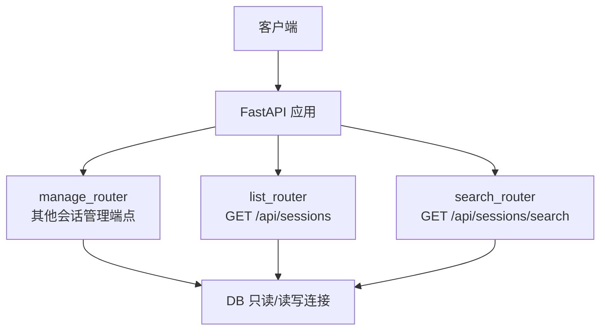
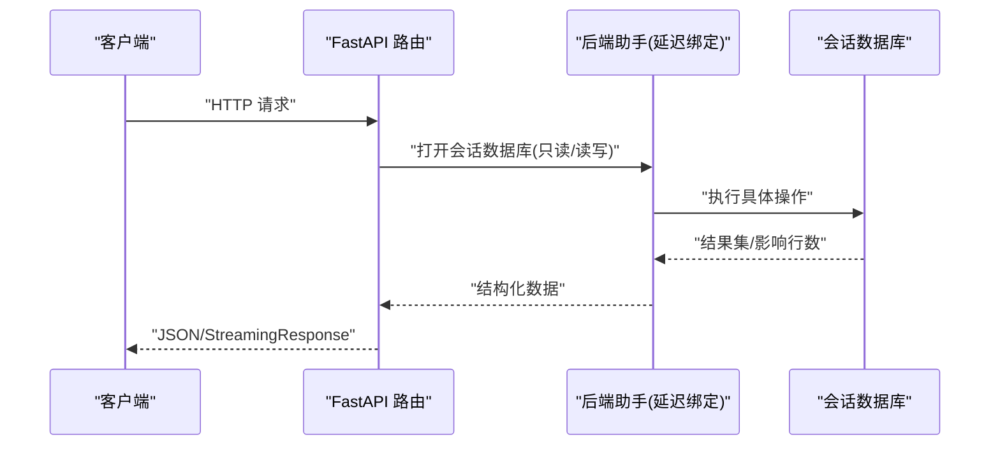
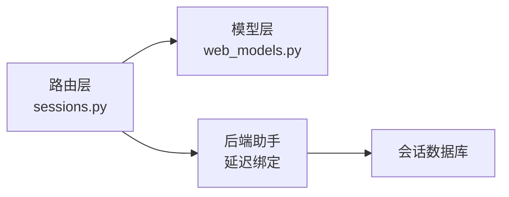

# 会话管理 API

<cite>
**本文引用的文件**
- [hermes_cli/web_routers/sessions.py](file://hermes_cli/web_routers/sessions.py)
- [hermes_cli/web_models.py](file://hermes_cli/web_models.py)
</cite>

## 目录
1. [简介](#简介)
2. [项目结构](#项目结构)
3. [核心组件](#核心组件)
4. [架构总览](#架构总览)
5. [详细端点文档](#详细端点文档)
6. [依赖关系分析](#依赖关系分析)
7. [性能注意事项](#性能注意事项)
8. [故障排查指南](#故障排查指南)
9. [结论](#结论)

## 简介
本文件为“会话管理”相关 HTTP 接口的完整技术文档，覆盖以下端点：
- GET /api/sessions（列出会话）
- GET /api/sessions/search（搜索会话）
- POST /api/sessions/bulk-delete（批量删除）
- POST /api/sessions/import（导入会话）
- GET /api/sessions/empty/count（空会话计数）
- DELETE /api/sessions/empty（删除空会话）
- GET /api/sessions/stats（统计信息）
- GET /api/sessions/{session_id}（获取会话详情）
- GET /api/sessions/{session_id}/latest-descendant（获取最新子会话）
- GET /api/sessions/{session_id}/messages（获取消息列表）
- DELETE /api/sessions/{session_id}（删除会话）
- PATCH /api/sessions/{session_id}（更新会话）
- GET /api/sessions/{session_id}/export（导出会话）
- POST /api/sessions/prune（清理会话）

这些接口由 FastAPI 路由提供，通过延迟绑定的后端助手访问会话数据库与业务逻辑。

## 项目结构
会话管理路由集中在一个模块中，按功能拆分为三个路由器：
- list_router：负责列表与分页（GET /api/sessions）
- search_router：负责全文检索（GET /api/sessions/search）
- manage_router：负责增删改查、导入导出、统计与清理等

图表来源
- [hermes_cli/web_routers/sessions.py:36-38](file://hermes_cli/web_routers/sessions.py#L36-L38)
- [hermes_cli/web_routers/sessions.py:53-166](file://hermes_cli/web_routers/sessions.py#L53-L166)
- [hermes_cli/web_routers/sessions.py:169-392](file://hermes_cli/web_routers/sessions.py#L169-L392)
- [hermes_cli/web_routers/sessions.py:395-788](file://hermes_cli/web_routers/sessions.py#L395-L788)

章节来源
- [hermes_cli/web_routers/sessions.py:1-13](file://hermes_cli/web_routers/sessions.py#L1-L13)

## 核心组件
- 路由层：定义所有 /api/sessions/* 的 HTTP 端点，参数校验、错误处理、响应封装。
- 模型层：使用 Pydantic 模型对请求体进行强类型校验（如批量删除、导入、重命名、清理等）。
- 后端辅助：通过延迟绑定调用会话数据库操作（打开 DB、查询、写入、统计、清理等），避免循环依赖并便于测试替换。

章节来源
- [hermes_cli/web_routers/sessions.py:21-50](file://hermes_cli/web_routers/sessions.py#L21-L50)
- [hermes_cli/web_models.py:306-357](file://hermes_cli/web_models.py#L306-L357)

## 架构总览
会话管理 API 的整体流程如下：
- 客户端发起 HTTP 请求到 FastAPI 路由。
- 路由解析参数或请求体，必要时进行校验。
- 通过延迟绑定的后端助手打开会话数据库连接（只读或读写）。
- 执行数据库操作（列表、搜索、统计、导入、导出、删除、清理等）。
- 返回 JSON 或流式响应（导出）。

图表来源
- [hermes_cli/web_routers/sessions.py:53-166](file://hermes_cli/web_routers/sessions.py#L53-L166)
- [hermes_cli/web_routers/sessions.py:169-392](file://hermes_cli/web_routers/sessions.py#L169-L392)
- [hermes_cli/web_routers/sessions.py:395-788](file://hermes_cli/web_routers/sessions.py#L395-L788)

## 详细端点文档

### GET /api/sessions（列出会话）
- 作用：分页列出会话，支持归档过滤、排序、来源过滤、最小消息数过滤、是否包含完整字段等。
- 查询参数
  - limit: 整数，默认 20，范围 0..100
  - offset: 整数，默认 0
  - min_messages: 整数，默认 0
  - archived: 枚举字符串，可选 exclude/only/include，默认 exclude
  - order: 枚举字符串，可选 created/recent，默认 created
  - source: 字符串，可选
  - sources: 逗号分隔字符串，可选
  - exclude_sources: 逗号分隔字符串，可选
  - cwd_prefix: 字符串，可选
  - full: 布尔，默认 false；为 true 时返回完整行（包含 system_prompt/model_config 等）
  - profile: 字符串，可选，指定目标 profile
- 成功响应
  - sessions: 数组，每个元素包含会话基本信息及 is_active/profile/is_default_profile/archived/pinned 等字段
  - total: 总数
  - limit: 本次限制
  - offset: 本次偏移
- 状态码
  - 200: 成功
  - 400: 参数非法（例如 archived/order 不在允许值）
  - 500: 内部错误
- 示例
  - GET /api/sessions?limit=20&offset=0&archived=exclude&order=created&full=false

章节来源
- [hermes_cli/web_routers/sessions.py:53-166](file://hermes_cli/web_routers/sessions.py#L53-L166)

### GET /api/sessions/search（搜索会话）
- 作用：基于会话 ID 和消息内容（FTS5）搜索会话，自动去重并按压缩 lineage 归并。
- 查询参数
  - q: 字符串，搜索关键词（可为空）
  - limit: 整数，默认 20，上限 100
  - profile: 字符串，可选
  - source: 字符串，可选
  - sources: 逗号分隔字符串，可选
  - exclude_sources: 逗号分隔字符串，可选
- 成功响应
  - results: 数组，每项包含 snippet/role/source/model/session_started/id/session_id/lineage_root 等
- 状态码
  - 200: 成功（q 为空时返回空结果）
  - 500: 搜索失败
- 示例
  - GET /api/sessions/search?q=python*&limit=50

章节来源
- [hermes_cli/web_routers/sessions.py:169-392](file://hermes_cli/web_routers/sessions.py#L169-L392)

### POST /api/sessions/bulk-delete（批量删除）
- 作用：在单个事务中删除多个会话，用于仪表盘的批量选择删除。
- 请求体（BulkDeleteSessions）
  - ids: 字符串数组，最多 500 项
  - profile: 字符串，可选
- 成功响应
  - ok: 布尔
  - deleted: 整数，实际删除数量
- 状态码
  - 200: 成功
  - 400: ids 超过 500 或无效
  - 500: 内部错误
- 示例
  - POST /api/sessions/bulk-delete
    - Body: {"ids": ["sid1","sid2"], "profile": "default"}

章节来源
- [hermes_cli/web_routers/sessions.py:395-446](file://hermes_cli/web_routers/sessions.py#L395-L446)
- [hermes_cli/web_models.py:306-309](file://hermes_cli/web_models.py#L306-L309)

### POST /api/sessions/import（导入会话）
- 作用：从导出的会话数据导入一个或多个会话。
- 请求体（SessionImport）
  - sessions: 对象数组，每个对象为一个会话的数据
  - profile: 字符串，可选
- 成功响应
  - 由后端导入逻辑返回，通常包含 ok 与细节
- 状态码
  - 200: 成功
  - 400: 请求体无效或导入失败
  - 500: 内部错误
- 示例
  - POST /api/sessions/import
    - Body: {"sessions": [...], "profile": "default"}

章节来源
- [hermes_cli/web_routers/sessions.py:448-471](file://hermes_cli/web_routers/sessions.py#L448-L471)
- [hermes_cli/web_models.py:311-314](file://hermes_cli/web_models.py#L311-L314)

### GET /api/sessions/empty/count（空会话计数）
- 作用：统计已结束、非归档且 message_count 为 0 的空会话数量。
- 查询参数
  - profile: 字符串，可选
- 成功响应
  - count: 整数
- 状态码
  - 200: 成功
- 示例
  - GET /api/sessions/empty/count

章节来源
- [hermes_cli/web_routers/sessions.py:474-490](file://hermes_cli/web_routers/sessions.py#L474-L490)

### DELETE /api/sessions/empty（删除空会话）
- 作用：在一个事务中删除所有空会话（已结束、非归档）。
- 查询参数
  - profile: 字符串，可选
- 成功响应
  - ok: 布尔
  - deleted: 整数，实际删除数量
- 状态码
  - 200: 成功
  - 500: 内部错误
- 示例
  - DELETE /api/sessions/empty

章节来源
- [hermes_cli/web_routers/sessions.py:492-521](file://hermes_cli/web_routers/sessions.py#L492-L521)

### GET /api/sessions/stats（统计信息）
- 作用：返回会话存储的统计信息，包括总数、活跃存储、归档数、消息总数、按来源分布等。
- 查询参数
  - profile: 字符串，可选
- 成功响应
  - total: 整数
  - active_store: 整数
  - archived: 整数
  - messages: 整数
  - by_source: 对象，键为来源名，值为数量
- 状态码
  - 200: 成功
- 示例
  - GET /api/sessions/stats

章节来源
- [hermes_cli/web_routers/sessions.py:523-553](file://hermes_cli/web_routers/sessions.py#L523-L553)

### GET /api/sessions/{session_id}（获取会话详情）
- 作用：根据会话 ID 或唯一前缀获取会话详情，并附加所属 profile 信息。
- 路径参数
  - session_id: 字符串
- 查询参数
  - profile: 字符串，可选
- 成功响应
  - 会话对象，包含 id/title/source/model/started_at/ended_at/last_active/message_count/tool_call_count/input_tokens/output_tokens/preview/parent_session_id/archived 以及 profile/is_default_profile 等
- 状态码
  - 200: 成功
  - 404: 未找到会话
- 示例
  - GET /api/sessions/abc123

章节来源
- [hermes_cli/web_routers/sessions.py:555-576](file://hermes_cli/web_routers/sessions.py#L555-L576)

### GET /api/sessions/{session_id}/latest-descendant（获取最新子会话）
- 作用：查找给定会话的最新后代（常用于压缩链或分支场景），并返回路径与是否变更。
- 路径参数
  - session_id: 字符串
- 查询参数
  - profile: 字符串，可选
- 成功响应
  - requested_session_id: 原始请求的会话 ID
  - session_id: 最新后代会话 ID
  - path: 路径数组
  - changed: 布尔，表示是否与原始不同
- 状态码
  - 200: 成功
  - 404: 未找到会话
- 示例
  - GET /api/sessions/abc123/latest-descendant

章节来源
- [hermes_cli/web_routers/sessions.py:578-599](file://hermes_cli/web_routers/sessions.py#L578-L599)

### GET /api/sessions/{session_id}/messages（获取消息列表）
- 作用：分页获取会话的消息列表，默认返回最新一页，支持 oldest/latest 排序。
- 路径参数
  - session_id: 字符串
- 查询参数
  - profile: 字符串，可选
  - limit: 整数，默认 500（当未显式设置时），最大 500
  - offset: 整数，默认 0
  - order: 枚举字符串，可选 oldest/latest；省略时默认 latest
- 成功响应
  - session_id: 最终解析后的会话 ID
  - messages: 消息数组
  - pagination: 包含 limit/offset/order/returned
- 状态码
  - 200: 成功
  - 400: order 非法
  - 404: 未找到会话
- 示例
  - GET /api/sessions/abc123/messages?limit=200&offset=0&order=oldest

章节来源
- [hermes_cli/web_routers/sessions.py:601-653](file://hermes_cli/web_routers/sessions.py#L601-L653)

### DELETE /api/sessions/{session_id}（删除会话）
- 作用：删除指定会话；若会话已不存在则幂等成功。
- 路径参数
  - session_id: 字符串
- 查询参数
  - profile: 字符串，可选
- 成功响应
  - ok: 布尔
  - already_absent: 布尔（当会话已不存在时为 true）
- 状态码
  - 200: 成功
  - 500: 内部错误
- 示例
  - DELETE /api/sessions/abc123

章节来源
- [hermes_cli/web_routers/sessions.py:655-681](file://hermes_cli/web_routers/sessions.py#L655-L681)

### PATCH /api/sessions/{session_id}（更新会话）
- 作用：更新会话标题、归档状态、置顶标志。
- 路径参数
  - session_id: 字符串
- 请求体（SessionRename）
  - title: 字符串或 null，设置为空/null 清除标题
  - archived: 布尔或 null
  - pinned: 布尔或 null
  - profile: 字符串，可选，用于跨 profile 修改
- 成功响应
  - ok: 布尔
  - title: 当前标题
  - archived: 布尔（如果请求中包含）
  - pinned: 布尔（如果请求中包含）
- 状态码
  - 200: 成功
  - 400: 未提供任何可更新字段或标题无效
  - 404: 未找到会话
- 示例
  - PATCH /api/sessions/abc123
    - Body: {"title": "新标题", "archived": false, "pinned": true}

章节来源
- [hermes_cli/web_routers/sessions.py:683-720](file://hermes_cli/web_routers/sessions.py#L683-L720)
- [hermes_cli/web_models.py:318-327](file://hermes_cli/web_models.py#L318-L327)

### GET /api/sessions/{session_id}/export（导出会话）
- 作用：以流式方式导出单个会话的元数据与消息（JSON 格式）。
- 路径参数
  - session_id: 字符串
- 查询参数
  - profile: 字符串，可选
- 成功响应
  - StreamingResponse，媒体类型为 application/json，内容为 {metadata, messages[]}
- 状态码
  - 200: 开始流式传输
  - 404: 未找到会话
- 示例
  - GET /api/sessions/abc123/export

章节来源
- [hermes_cli/web_routers/sessions.py:722-782](file://hermes_cli/web_routers/sessions.py#L722-L782)

### POST /api/sessions/prune（清理会话）
- 作用：按多种条件清理已结束会话，支持 dry_run 预览。
- 请求体（SessionPrune）
  - older_than_days: 浮点数，默认 90
  - source: 字符串，可选
  - profile: 字符串，可选
  - started_before/started_after: 时间戳，可选
  - title_like: 字符串，可选
  - end_reason: 字符串，可选
  - cwd_prefix: 字符串，可选
  - min_messages/max_messages: 整数，可选
  - model_like/provider/user_id/chat_id/chat_type/branch_like: 字符串，可选
  - min_tokens/max_tokens/min_cost/max_cost/min_tool_calls/max_tool_calls: 数值，可选
  - include_archived: 布尔，默认 false
  - dry_run: 布尔，默认 false
- 成功响应
  - 由后端清理逻辑返回，通常包含 ok 与受影响数量
- 状态码
  - 200: 成功
  - 400: 参数非法
  - 500: 内部错误
- 示例
  - POST /api/sessions/prune
    - Body: {"older_than_days": 30, "dry_run": true}

章节来源
- [hermes_cli/web_routers/sessions.py:784-788](file://hermes_cli/web_routers/sessions.py#L784-L788)
- [hermes_cli/web_models.py:331-357](file://hermes_cli/web_models.py#L331-L357)

## 依赖关系分析
- 路由与模型
  - 路由层依赖 Pydantic 模型进行请求体验证（批量删除、导入、重命名、清理）。
- 路由与后端助手
  - 路由通过延迟绑定调用后端助手，避免循环依赖并支持测试替换。
- 后端助手与数据库
  - 后端助手封装了会话数据库的只读/读写连接与具体操作（列表、搜索、统计、导入、导出、删除、清理等）。

图表来源
- [hermes_cli/web_routers/sessions.py:21-50](file://hermes_cli/web_routers/sessions.py#L21-L50)
- [hermes_cli/web_models.py:306-357](file://hermes_cli/web_models.py#L306-L357)

章节来源
- [hermes_cli/web_routers/sessions.py:21-50](file://hermes_cli/web_routers/sessions.py#L21-L50)
- [hermes_cli/web_models.py:306-357](file://hermes_cli/web_models.py#L306-L357)

## 性能注意事项
- 列表与搜索
  - 列表接口限制 limit 最大 100，防止单次请求拉取过多数据。
  - 搜索接口对 FTS 查询采用前缀匹配与去重策略，避免重复结果。
- 消息分页
  - 消息接口默认返回最新一页，limit 最大 500，避免加载超大会话导致内存压力。
- 导出流式
  - 导出接口使用 StreamingResponse 分块输出，降低大会话导出时的内存占用。
- 批量操作
  - 批量删除限制 ids 最多 500，避免长时间事务锁表。
- 统计与计数
  - 统计接口使用轻量级聚合查询，适合仪表盘展示。

[本节为通用性能建议，不直接分析具体文件]

## 故障排查指南
- 常见错误
  - 400 参数非法：检查 archived/order/limit/offset/order 等参数是否在允许范围内。
  - 404 未找到：确认 session_id 是否存在或可解析。
  - 500 内部错误：查看服务端日志，定位数据库或后端助手异常。
- 调试建议
  - 对于搜索接口，先验证 q 是否为空，再逐步缩小关键词范围。
  - 对于导出接口，关注网络超时与大响应体的分段读取。
  - 对于批量删除，确保 ids 不超过 500，并分批提交以避免阻塞。

章节来源
- [hermes_cli/web_routers/sessions.py:85-94](file://hermes_cli/web_routers/sessions.py#L85-L94)
- [hermes_cli/web_routers/sessions.py:432-436](file://hermes_cli/web_routers/sessions.py#L432-L436)
- [hermes_cli/web_routers/sessions.py:609-613](file://hermes_cli/web_routers/sessions.py#L609-L613)

## 结论
会话管理 API 提供了完整的会话生命周期管理能力，涵盖列表、搜索、导入导出、统计、清理与单会话的增删改查。通过严格的参数校验、分页与流式响应设计，兼顾了易用性与性能。建议在集成时遵循参数约束与错误处理规范，以获得稳定可靠的交互体验。