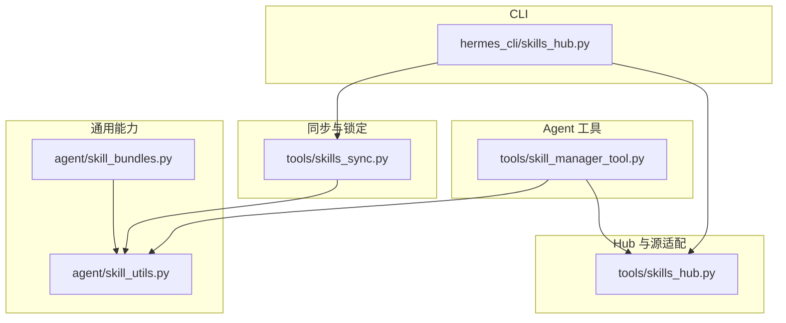
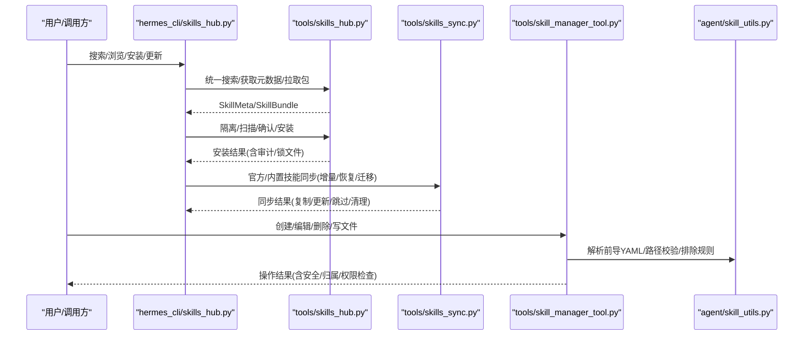
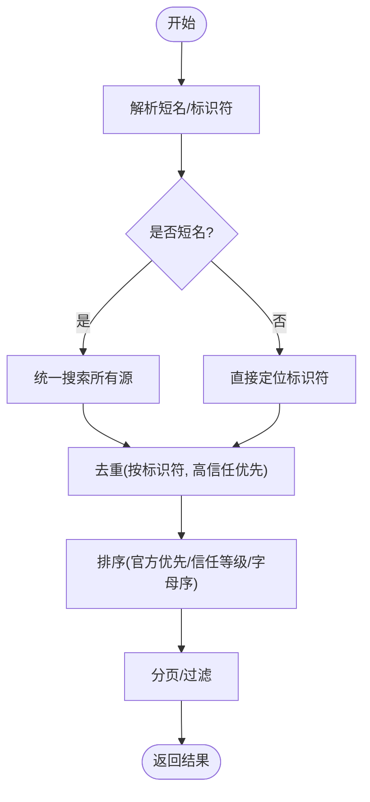
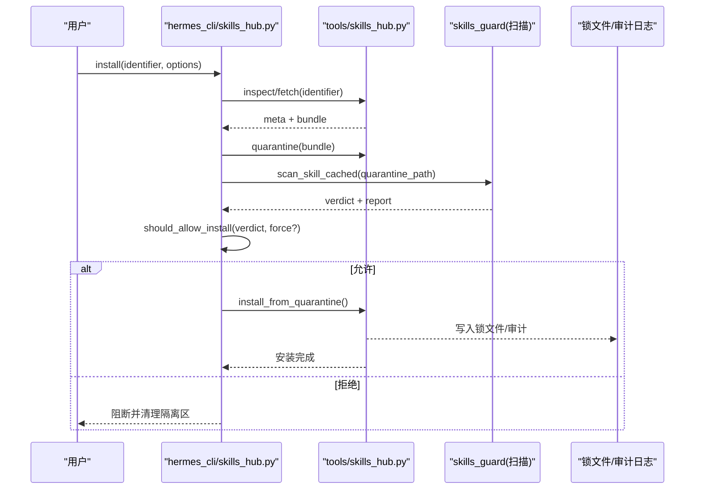
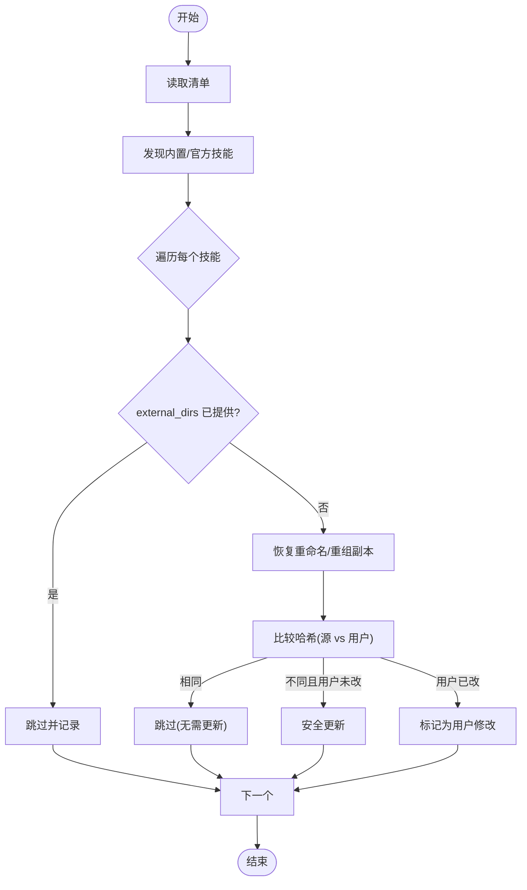
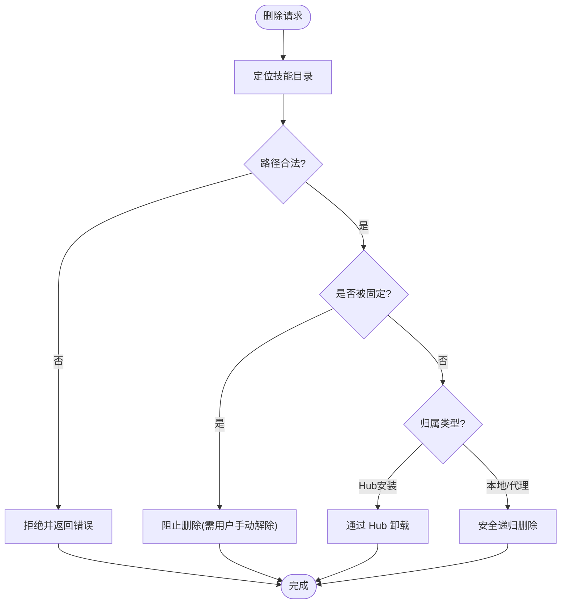
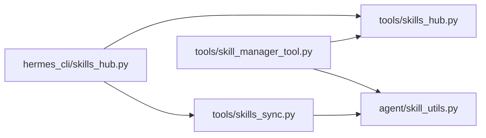

# 技能管理 API

<cite>
**本文引用的文件**
- [tools/skill_manager_tool.py](file://tools/skill_manager_tool.py)
- [hermes_cli/skills_hub.py](file://hermes_cli/skills_hub.py)
- [tools/skills_hub.py](file://tools/skills_hub.py)
- [agent/skill_bundles.py](file://agent/skill_bundles.py)
- [tools/skills_sync.py](file://tools/skills_sync.py)
- [agent/skill_utils.py](file://agent/skill_utils.py)
</cite>

## 目录
1. [简介](#简介)
2. [项目结构](#项目结构)
3. [核心组件](#核心组件)
4. [架构总览](#架构总览)
5. [详细组件分析](#详细组件分析)
6. [依赖关系分析](#依赖关系分析)
7. [性能考虑](#性能考虑)
8. [故障排查指南](#故障排查指南)
9. [结论](#结论)
10. [附录](#附录)

## 简介
本文件面向“技能管理 API”，覆盖技能的安装、卸载、更新与配置，说明技能包结构与依赖/版本控制机制，并给出技能市场集成、社区技能发现、质量评估与安全隔离策略。同时提供技能开发的接口规范与扩展点说明，帮助开发者编写可被系统识别、安全扫描、统一分发和受控执行的可复用“技能”。

## 项目结构
技能管理由 CLI 层、Hub 源适配层、本地同步层、Agent 工具层与通用工具模块共同组成：
- CLI 入口与用户交互：hermes_cli/skills_hub.py
- Hub 源适配与状态管理：tools/skills_hub.py
- 内置/官方可选技能同步：tools/skills_sync.py
- Agent 侧技能创建/编辑/删除工具：tools/skill_manager_tool.py
- 技能包聚合（Bundle）加载：agent/skill_bundles.py
- 通用技能解析与路径过滤：agent/skill_utils.py

图表来源
- [hermes_cli/skills_hub.py:250-794](file://hermes_cli/skills_hub.py#L250-L794)
- [tools/skills_hub.py:126-200](file://tools/skills_hub.py#L126-L200)
- [tools/skills_sync.py:675-800](file://tools/skills_sync.py#L675-L800)
- [tools/skill_manager_tool.py:523-740](file://tools/skill_manager_tool.py#L523-L740)
- [agent/skill_bundles.py:168-250](file://agent/skill_bundles.py#L168-L250)
- [agent/skill_utils.py:102-148](file://agent/skill_utils.py#L102-L148)

章节来源
- [hermes_cli/skills_hub.py:250-794](file://hermes_cli/skills_hub.py#L250-L794)
- [tools/skills_hub.py:126-200](file://tools/skills_hub.py#L126-L200)
- [tools/skills_sync.py:675-800](file://tools/skills_sync.py#L675-L800)
- [tools/skill_manager_tool.py:523-740](file://tools/skill_manager_tool.py#L523-L740)
- [agent/skill_bundles.py:168-250](file://agent/skill_bundles.py#L168-L250)
- [agent/skill_utils.py:102-148](file://agent/skill_utils.py#L102-L148)

## 核心组件
- 技能市场与发现
  - 搜索与浏览：支持多源并行检索、去重、信任等级排序与分页展示。
  - 短名解析：将简短名称解析为唯一标识符，避免跨注册表歧义。
- 安装与更新
  - 下载→隔离→扫描→确认→安装；支持强制覆盖、缓存失效与蓝图自动化建议。
  - 官方/内置技能通过清单进行增量同步，尊重用户自定义与外部目录优先。
- 卸载与删除
  - Hub 安装的技能由锁文件记录归属，仅 Hub 可卸载；本地/代理创建的技能由 Agent 工具删除，含多重安全校验。
- 配置与组织共享
  - 支持组织镜像与自动提议回提；支持按平台禁用/启用技能。
- Bundle 聚合
  - 将多个技能打包为一个斜杠命令一次性加载，支持缺失与禁用提示。

章节来源
- [hermes_cli/skills_hub.py:250-794](file://hermes_cli/skills_hub.py#L250-L794)
- [tools/skills_hub.py:126-200](file://tools/skills_hub.py#L126-L200)
- [tools/skills_sync.py:675-800](file://tools/skills_sync.py#L675-L800)
- [tools/skill_manager_tool.py:523-740](file://tools/skill_manager_tool.py#L523-L740)
- [agent/skill_bundles.py:168-250](file://agent/skill_bundles.py#L168-L250)

## 架构总览
技能从“源”到“可用”的完整链路如下：

图表来源
- [hermes_cli/skills_hub.py:250-794](file://hermes_cli/skills_hub.py#L250-L794)
- [tools/skills_hub.py:126-200](file://tools/skills_hub.py#L126-L200)
- [tools/skills_sync.py:675-800](file://tools/skills_sync.py#L675-L800)
- [tools/skill_manager_tool.py:523-740](file://tools/skill_manager_tool.py#L523-L740)
- [agent/skill_utils.py:102-148](file://agent/skill_utils.py#L102-L148)

## 详细组件分析

### 技能市场与发现（搜索/浏览/短名解析）
- 统一搜索：并行查询多个源，合并结果并按信任等级排序，支持分页与超时保护。
- 短名解析：当传入无斜杠的短名时，尝试在所有源中精确匹配，若存在歧义则列出候选并要求使用完整标识符。
- 浏览：官方技能优先显示，支持按提供者过滤，展示来源、信任等级与完整标识符以便复制安装。

图表来源
- [hermes_cli/skills_hub.py:250-488](file://hermes_cli/skills_hub.py#L250-L488)

章节来源
- [hermes_cli/skills_hub.py:250-488](file://hermes_cli/skills_hub.py#L250-L488)

### 安装流程（下载→隔离→扫描→确认→安装）
- 下载与元数据：根据标识符从对应源获取元数据与包内容。
- 隔离与扫描：将包放入隔离区，运行安全扫描并输出报告；根据策略决定是否允许安装。
- 确认与安装：对官方/第三方技能分别展示提示，确认后写入用户技能目录，并更新锁文件与索引缓存。
- 蓝图检测：若技能声明了自动化蓝图，则加入建议列表供用户后续调度。

图表来源
- [hermes_cli/skills_hub.py:490-794](file://hermes_cli/skills_hub.py#L490-L794)
- [tools/skills_hub.py:126-200](file://tools/skills_hub.py#L126-L200)

章节来源
- [hermes_cli/skills_hub.py:490-794](file://hermes_cli/skills_hub.py#L490-L794)
- [tools/skills_hub.py:126-200](file://tools/skills_hub.py#L126-L200)

### 更新与同步（官方/内置技能）
- 清单驱动：维护 v2 清单（name:hash），实现新增、更新、删除与清理的幂等处理。
- 变更检测：对比源目录哈希与用户目录哈希，仅在用户未修改时安全更新。
- 重命名/重组恢复：上游移动或重分类后，自动将旧副本移动到新的规范路径。
- 外部目录优先：若 external_dirs 已提供同名技能，则跳过本地写入，避免冲突。

图表来源
- [tools/skills_sync.py:675-800](file://tools/skills_sync.py#L675-L800)

章节来源
- [tools/skills_sync.py:675-800](file://tools/skills_sync.py#L675-L800)

### 卸载与删除（Hub 与本地）
- Hub 安装的技能：由锁文件记录归属，仅 Hub 可卸载；删除会移除锁记录与文件。
- 本地/代理创建的技能：由 Agent 工具删除，包含多重安全校验（路径必须在已知根内、禁止删除根目录、拒绝符号链接/连接点）。
- 保护机制：被“固定”的技能不允许被自动归档或代理删除；后台审查分支对非本地技能有额外限制。

图表来源
- [tools/skill_manager_tool.py:213-271](file://tools/skill_manager_tool.py#L213-L271)
- [tools/skill_manager_tool.py:274-298](file://tools/skill_manager_tool.py#L274-L298)

章节来源
- [tools/skill_manager_tool.py:213-298](file://tools/skill_manager_tool.py#L213-L298)

### 配置与组织共享
- 组织镜像：位于 _org/<org_id>/，通过标记文件授权加载；支持本地编辑与自动提议回提。
- 平台禁用：可按平台或全局禁用技能；Bundle 加载时会重新应用禁用列表。
- 前置校验：新建/编辑/补丁/删除等操作均会进行前导 YAML 校验、大小限制与内容格式检查。

章节来源
- [agent/skill_utils.py:52-68](file://agent/skill_utils.py#L52-L68)
- [agent/skill_bundles.py:253-368](file://agent/skill_bundles.py#L253-L368)
- [tools/skill_manager_tool.py:566-635](file://tools/skill_manager_tool.py#L566-L635)

### Bundle 聚合（批量加载）
- 定义：YAML 文件声明一组技能与可选指令，生成一个斜杠命令。
- 加载：按顺序加载成员技能，忽略缺失与禁用的技能，并在消息头中提示。
- 优先级：若 Bundle 与技能同名，Bundle 优先。

章节来源
- [agent/skill_bundles.py:1-41](file://agent/skill_bundles.py#L1-L41)
- [agent/skill_bundles.py:168-250](file://agent/skill_bundles.py#L168-L250)
- [agent/skill_bundles.py:253-368](file://agent/skill_bundles.py#L253-L368)

## 依赖关系分析
- CLI 层依赖 Hub 源适配器进行检索与拉取，依赖同步模块处理官方/内置技能。
- Hub 层依赖安全扫描器与 URL 安全策略，负责隔离、审计与锁文件管理。
- Agent 工具依赖通用工具进行前导 YAML 解析、路径排除与归属判断。
- 同步模块依赖通用工具以识别外部目录与排除路径，确保不覆盖用户工作。

图表来源
- [hermes_cli/skills_hub.py:250-794](file://hermes_cli/skills_hub.py#L250-L794)
- [tools/skills_hub.py:126-200](file://tools/skills_hub.py#L126-L200)
- [tools/skills_sync.py:675-800](file://tools/skills_sync.py#L675-L800)
- [tools/skill_manager_tool.py:523-740](file://tools/skill_manager_tool.py#L523-L740)
- [agent/skill_utils.py:102-148](file://agent/skill_utils.py#L102-L148)

章节来源
- [hermes_cli/skills_hub.py:250-794](file://hermes_cli/skills_hub.py#L250-L794)
- [tools/skills_hub.py:126-200](file://tools/skills_hub.py#L126-L200)
- [tools/skills_sync.py:675-800](file://tools/skills_sync.py#L675-L800)
- [tools/skill_manager_tool.py:523-740](file://tools/skill_manager_tool.py#L523-L740)
- [agent/skill_utils.py:102-148](file://agent/skill_utils.py#L102-L148)

## 性能考虑
- 并行检索：浏览与搜索时对多源并行拉取，设置每源限制与整体超时，避免长时间阻塞。
- 缓存与去重：索引缓存与结果去重减少重复网络请求；离线/首次运行时降级到外部源。
- 懒加载与轻量导入：关键模块延迟导入，降低启动开销；Bundle 与技能加载按需触发。
- 原子写入：清单与锁文件采用临时文件+替换写入，防止中断导致损坏。

[本节为通用指导，不直接分析具体文件]

## 故障排查指南
- 安装被阻断
  - 现象：扫描报告指出风险，安装被拒绝。
  - 处理：查看扫描报告详情，调整技能内容或显式强制安装（谨慎使用）。
- GitHub 速率限制
  - 现象：无法从 GitHub 源拉取。
  - 处理：配置认证令牌或使用 gh CLI 提升限额。
- 短名歧义
  - 现象：多个技能同名但来自不同源。
  - 处理：使用完整标识符安装，或在提示中选择目标源。
- 同步未生效
  - 现象：官方/内置技能未更新。
  - 处理：检查清单与用户目录哈希差异；确认未被 external_dirs 覆盖或被抑制。
- 删除失败
  - 现象：删除被拒绝。
  - 处理：检查是否为 Hub 安装技能（需 Hub 卸载）、是否被固定、路径是否合法。

章节来源
- [hermes_cli/skills_hub.py:547-565](file://hermes_cli/skills_hub.py#L547-L565)
- [hermes_cli/skills_hub.py:679-689](file://hermes_cli/skills_hub.py#L679-L689)
- [tools/skills_sync.py:776-800](file://tools/skills_sync.py#L776-L800)
- [tools/skill_manager_tool.py:213-271](file://tools/skill_manager_tool.py#L213-L271)

## 结论
该技能管理 API 提供了从发现、安装、更新到配置与删除的完整闭环，并通过隔离、扫描、锁文件与清单机制保障安全性与一致性。Bundle 聚合提升了多技能组合的使用效率，组织镜像与平台禁用满足了企业级治理需求。开发者可基于统一的 SKILL.md 前导字段与目录约定，快速构建可被系统识别与分发的技能。

[本节为总结性内容，不直接分析具体文件]

## 附录

### 技能包结构与开发规范
- 必需文件
  - SKILL.md：包含 YAML 前导（至少 name、description）与正文说明。
- 支持目录
  - references、templates、scripts、assets、examples：用于存放参考材料、模板、脚本与资源。
- 命名与路径
  - 名称需符合文件系统安全与 URL 友好要求；类别目录为单段名称。
- 前导校验
  - 新技能描述长度受限以保证路由信号不被截断；编辑/补丁路径放宽限制以兼容历史技能。
- 平台与禁用
  - 可通过平台配置禁用技能；Bundle 加载时会重新应用禁用列表。

章节来源
- [tools/skill_manager_tool.py:523-635](file://tools/skill_manager_tool.py#L523-L635)
- [agent/skill_utils.py:102-148](file://agent/skill_utils.py#L102-L148)

### 依赖管理与版本控制
- 清单与哈希
  - 使用 v2 清单（name:hash）跟踪内置/官方技能；通过目录哈希检测变更。
- 锁文件与审计
  - Hub 安装的技能在 lock.json 中记录来源、信任等级、内容与时间戳；审计日志记录安装/阻断事件。
- 外部目录优先
  - external_dirs 提供的技能优先于本地树，避免冲突；同步时跳过并清理陈旧影子。

章节来源
- [tools/skills_sync.py:113-197](file://tools/skills_sync.py#L113-L197)
- [tools/skills_sync.py:675-800](file://tools/skills_sync.py#L675-L800)
- [tools/skills_hub.py:126-200](file://tools/skills_hub.py#L126-L200)

### 技能市场集成与社区发现
- 多源统一检索：支持 official、github、clawhub、lobehub、browse-sh 等源。
- 信任等级与排序：builtin/trusted/community，官方优先。
- 短名解析与完整标识符：避免跨注册表歧义，便于脚本化安装。

章节来源
- [hermes_cli/skills_hub.py:250-488](file://hermes_cli/skills_hub.py#L250-L488)

### 质量评估与安全隔离
- 隔离区：下载后的包先放入隔离目录，再扫描与确认。
- 安全扫描：基于规则集评估风险，输出报告与决策；支持缓存与来源溯源。
- 路径与引用校验：限制支持目录引用，防止路径穿越与不安全链接。

章节来源
- [hermes_cli/skills_hub.py:639-689](file://hermes_cli/skills_hub.py#L639-L689)
- [tools/skills_hub.py:155-193](file://tools/skills_hub.py#L155-L193)

### 执行环境的安全隔离与资源限制
- 路径边界：删除与写入严格限制在已知技能根目录下，拒绝符号链接/连接点。
- 内容大小限制：SKILL.md 与支持文件上限，避免过大负载影响性能。
- 后台审查限制：后台分支对非本地技能与受保护技能有更严格的写限制，防止自主维护误改。

章节来源
- [tools/skill_manager_tool.py:200-271](file://tools/skill_manager_tool.py#L200-L271)
- [tools/skill_manager_tool.py:513-520](file://tools/skill_manager_tool.py#L513-L520)
- [tools/skill_manager_tool.py:301-421](file://tools/skill_manager_tool.py#L301-L421)