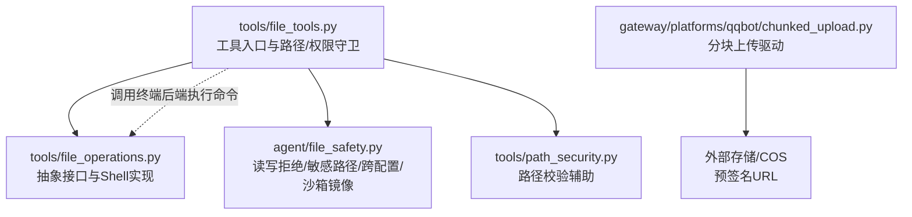
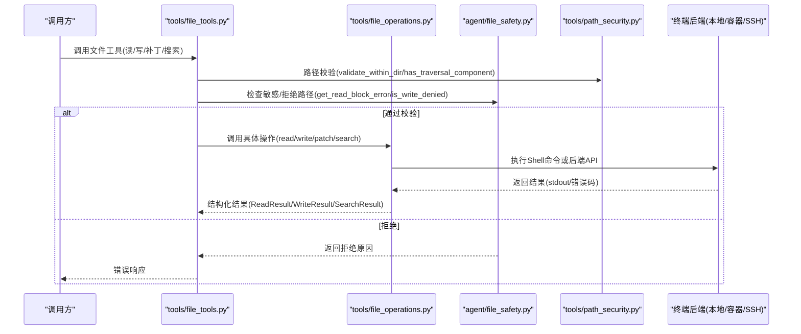
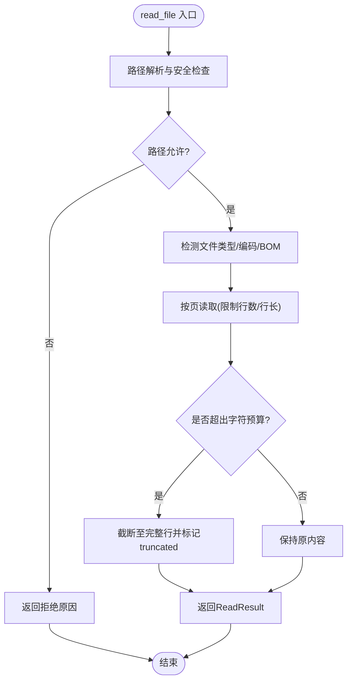
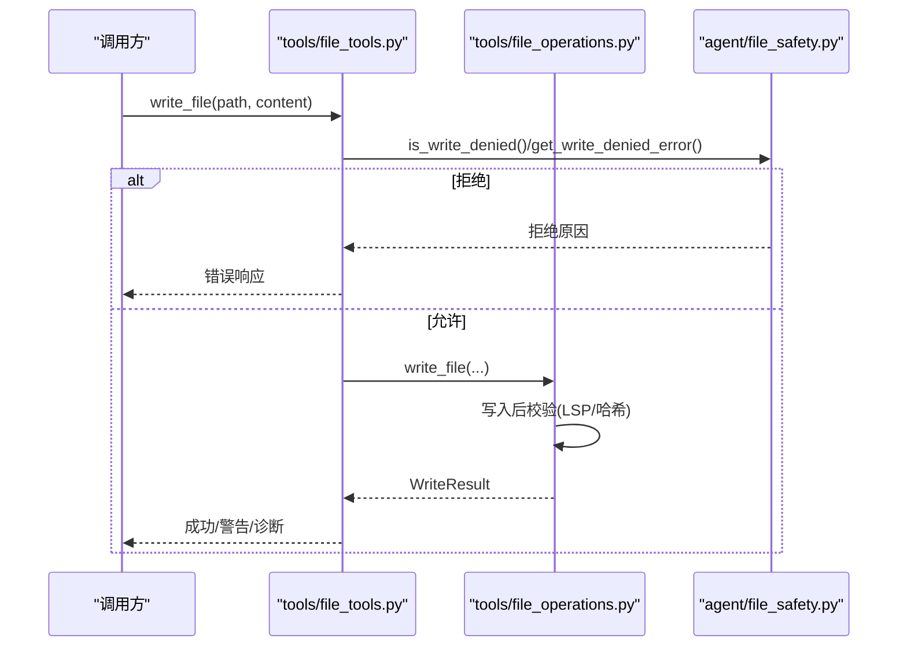
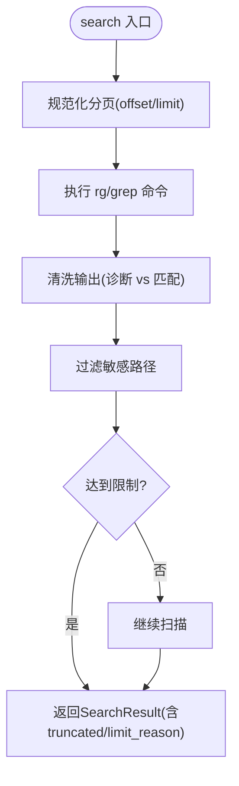
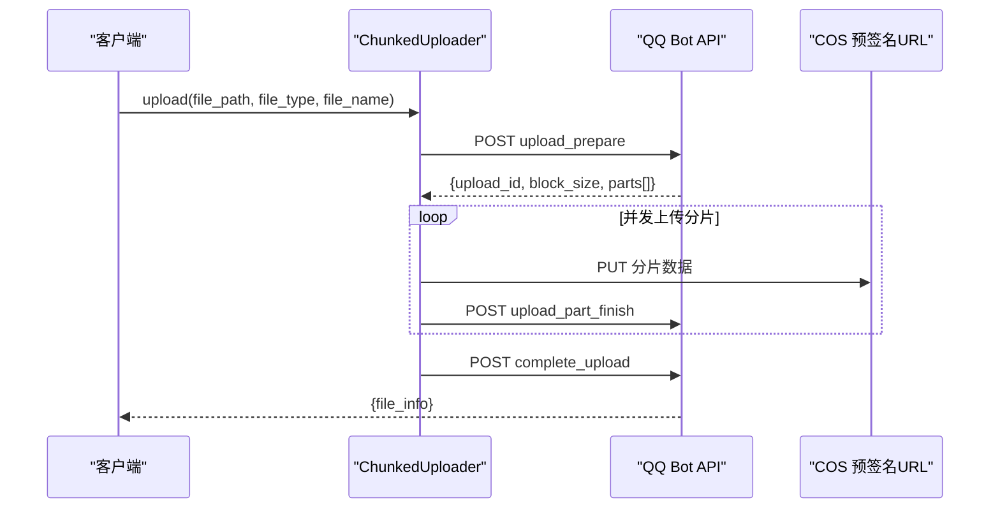
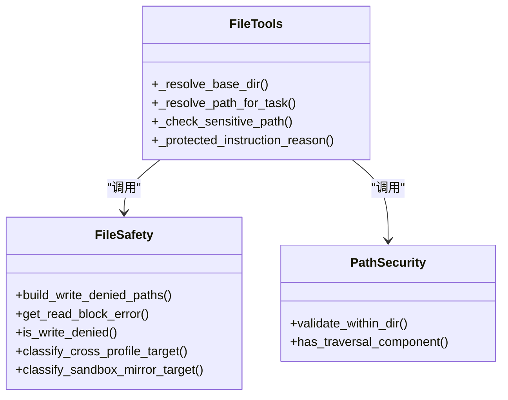
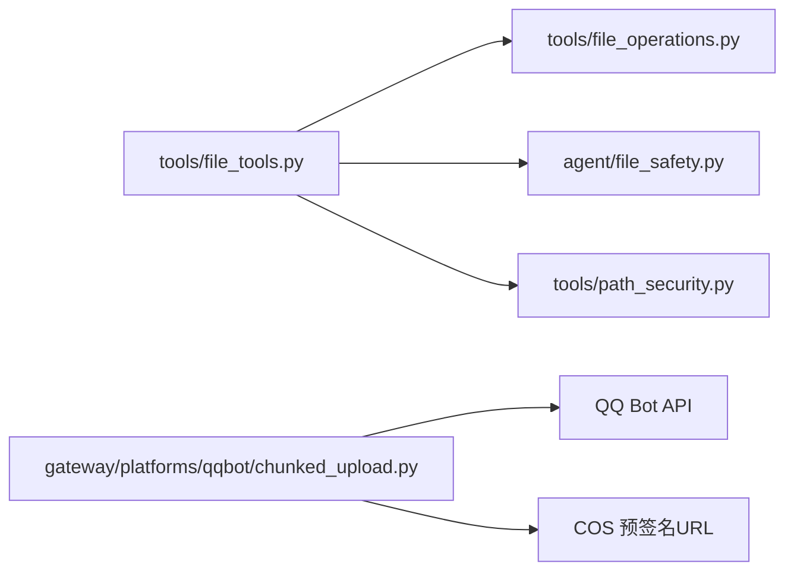

# 文件操作 API

<cite>
**本文引用的文件**
- [tools/file_operations.py](file://tools/file_operations.py)
- [tools/file_tools.py](file://tools/file_tools.py)
- [agent/file_safety.py](file://agent/file_safety.py)
- [tools/path_security.py](file://tools/path_security.py)
- [gateway/platforms/qqbot/chunked_upload.py](file://gateway/platforms/qqbot/chunked_upload.py)
</cite>

## 目录
1. [简介](#简介)
2. [项目结构](#项目结构)
3. [核心组件](#核心组件)
4. [架构总览](#架构总览)
5. [详细组件分析](#详细组件分析)
6. [依赖关系分析](#依赖关系分析)
7. [性能考量](#性能考量)
8. [故障排查指南](#故障排查指南)
9. [结论](#结论)
10. [附录](#附录)

## 简介
本文件面向“文件操作 API”的文档，覆盖文件读取、写入、补丁（patch）、搜索、删除、移动等能力，并重点说明：
- 路径安全验证与权限控制（读写白名单/黑名单、敏感系统路径、工作区隔离）
- 大文件处理、流式传输与断点续传（以分块上传为例）
- 错误处理、日志记录与审计跟踪（含敏感信息脱敏）
- 与文件系统的安全交互模式与最佳实践

该 API 通过工具层统一封装，底层可适配多种终端后端（本地、Docker、SSH、Singularity、Modal、Daytona、Vercel Sandbox），保证跨环境一致性与安全性。

## 项目结构
围绕文件操作的代码主要分布在以下模块：
- tools/file_operations.py：抽象接口与基于 Shell 的统一实现（读/写/补丁/搜索/删除/移动/校验）
- tools/file_tools.py：面向 LLM Agent 的工具入口，负责路径解析、大小限制、设备路径拦截、敏感路径保护、提示词指令文件保护、工作区根目录判定等
- agent/file_safety.py：共享的文件安全规则（读写拒绝列表、Hermes 内部状态保护、跨配置/沙箱镜像/容器镜像写入警告）
- tools/path_security.py：通用路径校验辅助（目录内校验、穿越路径检测）
- gateway/platforms/qqbot/chunked_upload.py：平台侧大文件分块上传流程（准备→并发分片 PUT→完成），体现流式与断点续传思想

图表来源
- [tools/file_tools.py:152-400](file://tools/file_tools.py#L152-L400)
- [tools/file_operations.py:450-514](file://tools/file_operations.py#L450-L514)
- [agent/file_safety.py:28-178](file://agent/file_safety.py#L28-L178)
- [tools/path_security.py:15-44](file://tools/path_security.py#L15-L44)
- [gateway/platforms/qqbot/chunked_upload.py:200-305](file://gateway/platforms/qqbot/chunked_upload.py#L200-L305)

章节来源
- [tools/file_operations.py:1-120](file://tools/file_operations.py#L1-L120)
- [tools/file_tools.py:1-150](file://tools/file_tools.py#L1-L150)
- [agent/file_safety.py:1-100](file://agent/file_safety.py#L1-L100)
- [tools/path_security.py:1-44](file://tools/path_security.py#L1-L44)
- [gateway/platforms/qqbot/chunked_upload.py:1-60](file://gateway/platforms/qqbot/chunked_upload.py#L1-L60)

## 核心组件
- 抽象接口与实现（FileOperations / ShellFileOperations）
  - 提供 read_file/read_file_raw/read_file_bytes/write_file/patch_replace/patch_v4a/delete_file/move_file/search 等统一方法
  - 内置分页、行长度限制、二进制/图片识别、BOM/换行符处理、搜索输出清洗、超时与限流
- 工具入口（file_tools）
  - 路径解析到任务工作区根目录，避免 worktree/cwd 漂移导致误写
  - 设备路径/进程内存路径拦截，防止挂起或泄露
  - 敏感系统路径与 Hermes 配置文件保护
  - 受保护的提示词指令文件（如 AGENTS.md 等）强制审批
  - 大文件读取字符预算截断与提示
- 安全规则（file_safety）
  - 构建写拒绝路径/前缀（密钥、认证、系统关键文件）
  - 读拒绝策略（Hermes 内部缓存、凭据文件、项目 .env）
  - 跨配置/沙箱镜像/容器镜像写入软守卫（告警+引导）
- 路径校验（path_security）
  - validate_within_dir：确保目标在允许目录内
  - has_traversal_component：快速检测 .. 穿越
- 分块上传（chunked_upload）
  - 三阶段：upload_prepare → 并发 PUT 分片 + upload_part_finish → complete_upload
  - 支持重试、并发度控制、进度统计、每日配额/单文件大小限制异常

章节来源
- [tools/file_operations.py:450-514](file://tools/file_operations.py#L450-L514)
- [tools/file_tools.py:152-400](file://tools/file_tools.py#L152-L400)
- [agent/file_safety.py:28-178](file://agent/file_safety.py#L28-L178)
- [tools/path_security.py:15-44](file://tools/path_security.py#L15-L44)
- [gateway/platforms/qqbot/chunked_upload.py:200-305](file://gateway/platforms/qqbot/chunked_upload.py#L200-L305)

## 架构总览
文件操作 API 采用“工具入口 + 抽象接口 + 安全规则 + 平台扩展”的分层设计：
- 工具入口负责参数校验、路径解析、权限与安全守卫
- 抽象接口定义统一能力，屏蔽不同终端后端的差异
- 安全规则集中管理拒绝列表与告警逻辑
- 平台扩展（如 QQ Bot 分块上传）对接外部服务，提供大文件能力

图表来源
- [tools/file_tools.py:152-400](file://tools/file_tools.py#L152-L400)
- [tools/file_operations.py:450-514](file://tools/file_operations.py#L450-L514)
- [agent/file_safety.py:194-337](file://agent/file_safety.py#L194-L337)
- [tools/path_security.py:15-44](file://tools/path_security.py#L15-L44)

## 详细组件分析

### 文件读取 API
- 能力
  - 分页读取（offset/limit），行长度限制，最大行数限制
  - 自动检测并保留原始换行符（CRLF/LF），处理 UTF-8 BOM
  - 二进制/图片识别，图片尺寸与 MIME 类型返回
  - 大文件字符预算截断，提示使用分页继续读取
- 安全
  - 设备路径/进程内存路径拦截（/dev/*, /proc/*）
  - 读拒绝：Hermes 内部缓存、凭据文件、项目 .env 等
- 性能
  - 行级限制与内容清洗，避免超大输出阻塞
  - 搜索输出按形状分类，过滤诊断信息，减少误解析

图表来源
- [tools/file_operations.py:724-800](file://tools/file_operations.py#L724-L800)
- [tools/file_tools.py:516-604](file://tools/file_tools.py#L516-L604)
- [agent/file_safety.py:194-337](file://agent/file_safety.py#L194-L337)

章节来源
- [tools/file_operations.py:158-176](file://tools/file_operations.py#L158-L176)
- [tools/file_operations.py:724-800](file://tools/file_operations.py#L724-L800)
- [tools/file_tools.py:516-604](file://tools/file_tools.py#L516-L604)
- [agent/file_safety.py:194-337](file://agent/file_safety.py#L194-L337)

### 文件写入与补丁 API
- 能力
  - write_file：创建目录、写入文本、可选 pre_content；支持 LSP 语义诊断
  - patch_replace：模糊匹配替换，支持全部替换
  - patch_v4a：应用 V4A 格式补丁，自动重写头路径为宿主绝对路径
  - delete_file/move_file：删除与移动
- 安全
  - 写拒绝：敏感系统路径、Hermes 配置、凭据目录、跨配置/沙箱镜像写入告警
  - 受保护指令文件（AGENTS.md 等）强制审批
- 性能
  - 写入后校验（sha256sum 可用时）
  - 语言特定 LSP 诊断（TypeScript/Go/Rust 等）

图表来源
- [tools/file_operations.py:178-241](file://tools/file_operations.py#L178-L241)
- [tools/file_tools.py:641-703](file://tools/file_tools.py#L641-L703)
- [agent/file_safety.py:28-178](file://agent/file_safety.py#L28-L178)

章节来源
- [tools/file_operations.py:178-241](file://tools/file_operations.py#L178-L241)
- [tools/file_tools.py:641-703](file://tools/file_tools.py#L641-L703)
- [agent/file_safety.py:28-178](file://agent/file_safety.py#L28-L178)

### 文件搜索 API
- 能力
  - 内容/文件名搜索，支持 glob 过滤、上下文行、去重计数
  - 搜索输出清洗：分离诊断信息与真实匹配，处理超时与多行正则限制
- 安全
  - 过滤搜索结果中的敏感路径（凭据/缓存/.env）
- 性能
  - 限制匹配数量与偏移，避免全量扫描
  - 对大量匹配进行“密集化”渲染，降低负载

图表来源
- [tools/file_operations.py:357-418](file://tools/file_operations.py#L357-L418)
- [tools/file_tools.py:592-638](file://tools/file_tools.py#L592-L638)

章节来源
- [tools/file_operations.py:357-418](file://tools/file_operations.py#L357-L418)
- [tools/file_tools.py:592-638](file://tools/file_tools.py#L592-L638)

### 大文件处理、流式传输与断点续传
- 分块上传（QQ Bot 示例）
  - 步骤：upload_prepare → 并发 PUT 分片 + upload_part_finish → complete_upload
  - 特性：并发度控制、重试退避、进度统计、每日配额/单文件大小限制异常
  - 适用场景：大文件上传、网络不稳定、需要断点续传的场景
- 流式读取/写入
  - 读取端：分页读取、字符预算截断，避免一次性加载大文件
  - 写入端：分块写入（由后端实现），配合校验与 LSP 诊断

图表来源
- [gateway/platforms/qqbot/chunked_upload.py:200-305](file://gateway/platforms/qqbot/chunked_upload.py#L200-L305)
- [gateway/platforms/qqbot/chunked_upload.py:346-491](file://gateway/platforms/qqbot/chunked_upload.py#L346-L491)
- [gateway/platforms/qqbot/chunked_upload.py:494-528](file://gateway/platforms/qqbot/chunked_upload.py#L494-L528)

章节来源
- [gateway/platforms/qqbot/chunked_upload.py:200-305](file://gateway/platforms/qqbot/chunked_upload.py#L200-L305)
- [gateway/platforms/qqbot/chunked_upload.py:346-491](file://gateway/platforms/qqbot/chunked_upload.py#L346-L491)
- [gateway/platforms/qqbot/chunked_upload.py:494-528](file://gateway/platforms/qqbot/chunked_upload.py#L494-L528)

### 路径安全验证与权限控制
- 路径解析与工作区隔离
  - 优先使用任务会话 cwd 记录，其次注册的任务 cwd 覆盖，最后 TERMINAL_CWD
  - 相对路径必须解析到工作区内，否则发出警告
- 设备/进程路径拦截
  - 阻止 /dev/* 与 /proc/* 中可能挂起或泄露的路径
- 敏感路径与受保护文件
  - 写拒绝：系统关键路径、Hermes 配置、凭据目录
  - 读拒绝：Hermes 内部缓存、凭据文件、项目 .env
  - 受保护指令文件：强制审批，防止持久化提示注入

图表来源
- [tools/file_tools.py:152-400](file://tools/file_tools.py#L152-L400)
- [agent/file_safety.py:28-178](file://agent/file_safety.py#L28-L178)
- [tools/path_security.py:15-44](file://tools/path_security.py#L15-L44)

章节来源
- [tools/file_tools.py:152-400](file://tools/file_tools.py#L152-L400)
- [agent/file_safety.py:28-178](file://agent/file_safety.py#L28-L178)
- [tools/path_security.py:15-44](file://tools/path_security.py#L15-L44)

## 依赖关系分析
- tools/file_tools.py 依赖：
  - tools/file_operations.py：统一文件操作接口
  - agent/file_safety.py：读写拒绝与敏感路径规则
  - tools/path_security.py：路径校验辅助
- tools/file_operations.py 依赖：
  - agent/file_safety.py：写拒绝列表
  - tools.binary_extensions：二进制扩展判断
- gateway/platforms/qqbot/chunked_upload.py 依赖：
  - 外部 HTTP 客户端（用于 PUT 预签名 URL）
  - QQ Bot API（upload_prepare/upload_part_finish/complete_upload）

图表来源
- [tools/file_tools.py:152-400](file://tools/file_tools.py#L152-L400)
- [tools/file_operations.py:450-514](file://tools/file_operations.py#L450-L514)
- [agent/file_safety.py:28-178](file://agent/file_safety.py#L28-L178)
- [tools/path_security.py:15-44](file://tools/path_security.py#L15-L44)
- [gateway/platforms/qqbot/chunked_upload.py:200-305](file://gateway/platforms/qqbot/chunked_upload.py#L200-L305)

章节来源
- [tools/file_tools.py:152-400](file://tools/file_tools.py#L152-L400)
- [tools/file_operations.py:450-514](file://tools/file_operations.py#L450-L514)
- [agent/file_safety.py:28-178](file://agent/file_safety.py#L28-L178)
- [tools/path_security.py:15-44](file://tools/path_security.py#L15-L44)
- [gateway/platforms/qqbot/chunked_upload.py:200-305](file://gateway/platforms/qqbot/chunked_upload.py#L200-L305)

## 性能考量
- 读取
  - 分页与字符预算截断，避免单次返回过大内容
  - 行长度限制与内容清洗，减少模型上下文压力
- 写入
  - 写入后校验（哈希/LSP），尽早发现错误
  - 语言特定 LSP 诊断，提高准确性
- 搜索
  - 限制匹配数量与偏移，避免全量扫描
  - 输出密集化，减少冗余
- 上传
  - 并发分片上传与重试退避，提升吞吐与鲁棒性
  - 进度统计与配额限制，便于监控与限流

[本节为通用指导，不直接分析具体文件]

## 故障排查指南
- 常见错误
  - 路径拒绝：检查是否命中敏感路径/凭据目录/工作区外路径
  - 读取失败：确认非设备/进程路径，且未被读拒绝策略拦截
  - 写入失败：检查权限、LSP 诊断、哈希校验失败
  - 搜索超时：检查正则是否跨行（需启用多行模式），或限制 offset/limit
- 日志与审计
  - 分块上传包含详细日志（分片编号、大小、重试次数）
  - 工具层对错误信息进行敏感信息脱敏，避免泄露密钥
- 建议
  - 使用分页读取大文件，结合 next_offset 继续
  - 对敏感路径变更走审批流程（受保护指令文件）
  - 上传大文件时使用分块上传，关注每日配额与单文件大小限制

章节来源
- [gateway/platforms/qqbot/chunked_upload.py:250-305](file://gateway/platforms/qqbot/chunked_upload.py#L250-L305)
- [tools/file_tools.py:516-604](file://tools/file_tools.py#L516-L604)
- [tools/file_operations.py:357-418](file://tools/file_operations.py#L357-L418)

## 结论
本文件操作 API 通过分层设计与严格的安全规则，提供了跨终端后端的统一文件管理能力。其特点包括：
- 强路径安全与权限控制，防止误写与敏感信息泄露
- 大文件友好：分页读取、字符预算截断、分块上传与重试
- 完善的错误处理与日志记录，支持审计与排障
- 可扩展的平台集成（如 QQ Bot 分块上传），满足多样化需求

建议在实际使用中遵循：
- 始终使用工作区绝对路径，避免相对路径漂移
- 对敏感路径变更走审批流程
- 大文件操作优先使用分页与分块机制
- 关注日志与配额限制，及时调优性能

[本节为总结，不直接分析具体文件]

## 附录
- 术语
  - 工作区根目录：任务实际工作的目录（会话 cwd 记录/注册覆盖/TERMINAL_CWD）
  - 分块上传：将大文件切分为多个分片并行上传，最后合并
  - 读/写拒绝：基于路径黑名单与白名单的安全策略
- 参考
  - 路径校验：validate_within_dir、has_traversal_component
  - 安全规则：build_write_denied_paths、get_read_block_error、is_write_denied
  - 分块上传：ChunkedUploader.upload 流程

[本节为补充说明，不直接分析具体文件]