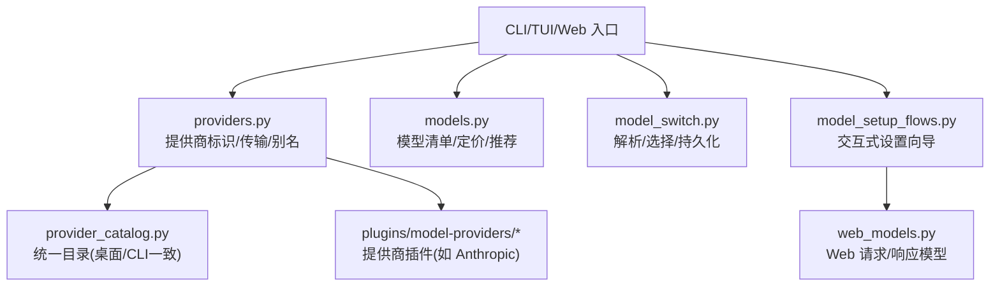
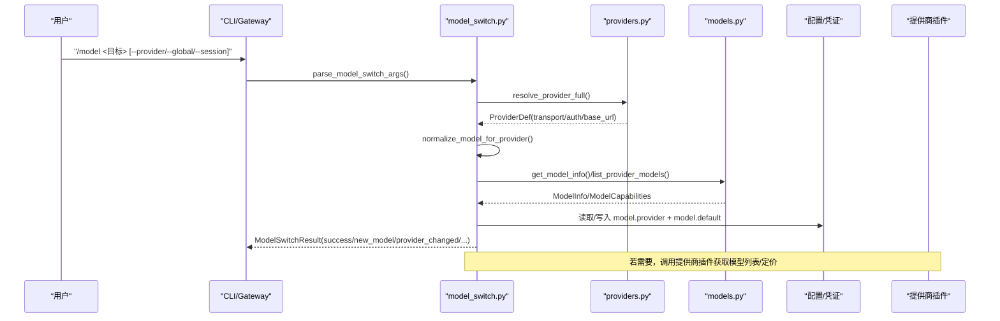
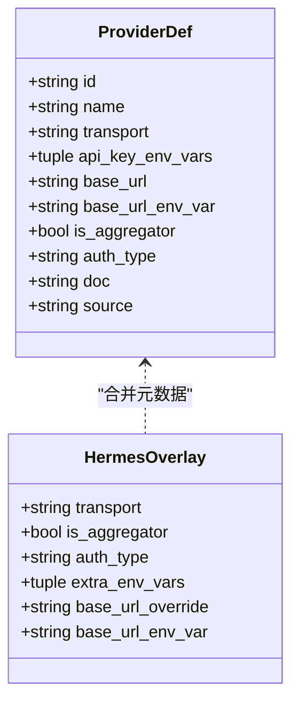
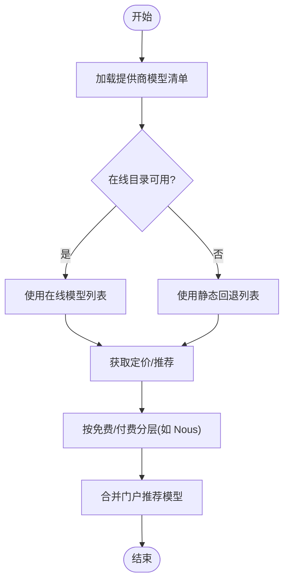
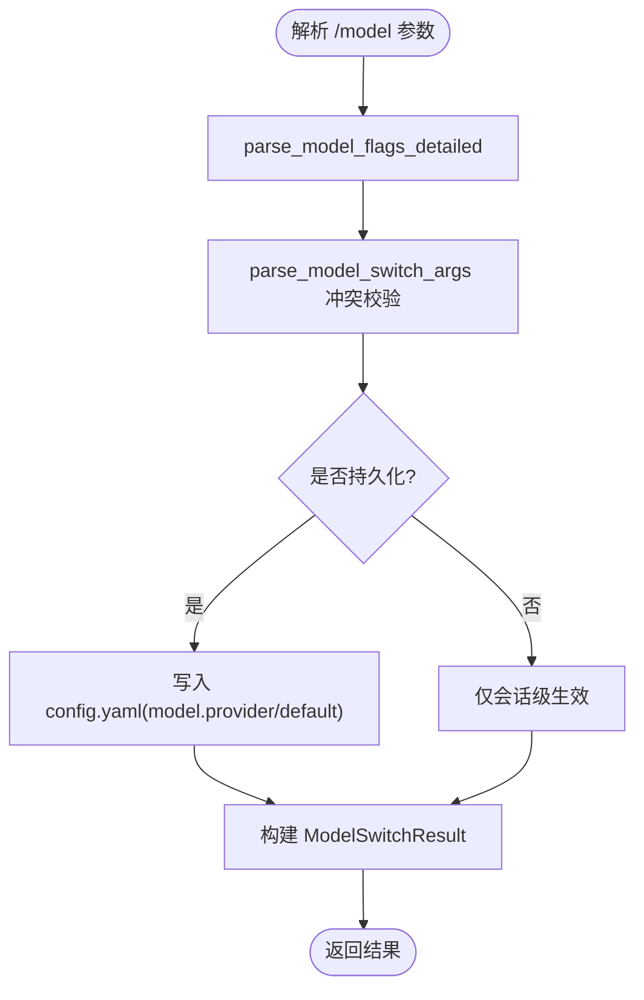
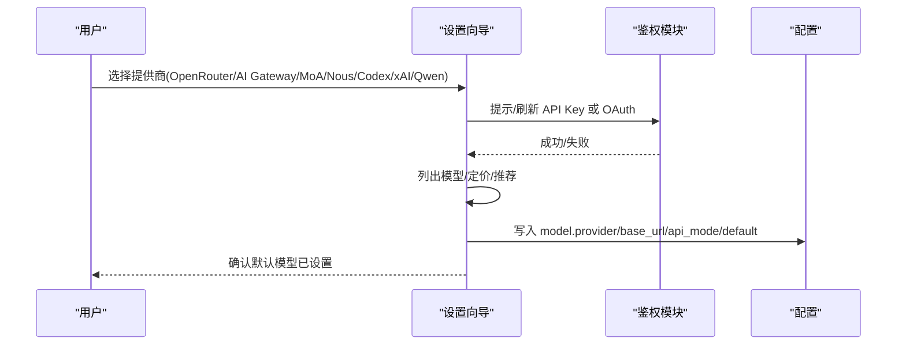
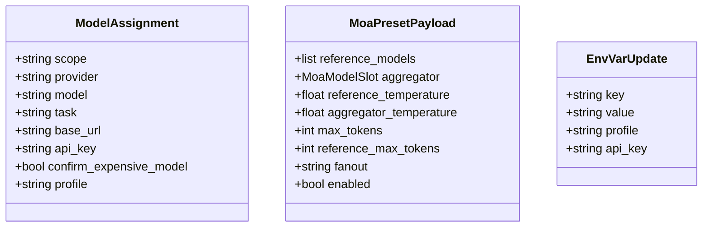
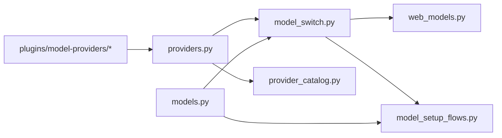

# 模型设置 API

<cite>
**本文引用的文件**
- [hermes_cli/model_setup_flows.py](file://hermes_cli/model_setup_flows.py)
- [hermes_cli/model_switch.py](file://hermes_cli/model_switch.py)
- [hermes_cli/models.py](file://hermes_cli/models.py)
- [hermes_cli/providers.py](file://hermes_cli/providers.py)
- [hermes_cli/provider_catalog.py](file://hermes_cli/provider_catalog.py)
- [hermes_cli/web_models.py](file://hermes_cli/web_models.py)
- [plugins/model-providers/anthropic/__init__.py](file://plugins/model-providers/anthropic/__init__.py)
</cite>

## 目录
1. [简介](#简介)
2. [项目结构](#项目结构)
3. [核心组件](#核心组件)
4. [架构总览](#架构总览)
5. [详细组件分析](#详细组件分析)
6. [依赖关系分析](#依赖关系分析)
7. [性能与可用性](#性能与可用性)
8. [故障排查指南](#故障排查指南)
9. [结论](#结论)
10. [附录：开发指南与自定义提供商](#附录：开发指南与自定义提供商)

## 简介
本文件面向“模型设置 API”的完整实现，覆盖模型配置、提供商管理与模型切换三大能力。文档说明支持的模型提供商（OpenAI、Anthropic、本地模型等）、API 密钥管理、模型参数配置与性能调优选项；并解释模型选择策略、负载均衡与故障转移机制。最后提供模型集成的开发指南与自定义提供商的实现方法，帮助开发者快速扩展新的模型提供方或聚合器。

## 项目结构
围绕模型设置的核心代码分布在 CLI 层与提供商抽象层：
- 提供商统一标识与传输协议映射：providers.py
- 提供商目录与桌面端展示一致性：provider_catalog.py
- 模型清单、定价与推荐：models.py
- 模型切换流程与持久化策略：model_switch.py
- 各提供商交互式设置向导：model_setup_flows.py
- Web 接口数据模型（用于 Dashboard/桌面端）：web_models.py
- 特定提供商插件（如 Anthropic）：plugins/model-providers/anthropic/__init__.py

图表来源
- [hermes_cli/providers.py:46-248](file://hermes_cli/providers.py#L46-L248)
- [hermes_cli/models.py:221-622](file://hermes_cli/models.py#L221-L622)
- [hermes_cli/model_switch.py:494-743](file://hermes_cli/model_switch.py#L494-L743)
- [hermes_cli/model_setup_flows.py:178-800](file://hermes_cli/model_setup_flows.py#L178-L800)
- [hermes_cli/provider_catalog.py:83-176](file://hermes_cli/provider_catalog.py#L83-L176)
- [hermes_cli/web_models.py:122-215](file://hermes_cli/web_models.py#L122-L215)
- [plugins/model-providers/anthropic/__init__.py:14-54](file://plugins/model-providers/anthropic/__init__.py#L14-L54)

章节来源
- [hermes_cli/providers.py:46-248](file://hermes_cli/providers.py#L46-L248)
- [hermes_cli/models.py:221-622](file://hermes_cli/models.py#L221-L622)
- [hermes_cli/model_switch.py:494-743](file://hermes_cli/model_switch.py#L494-L743)
- [hermes_cli/model_setup_flows.py:178-800](file://hermes_cli/model_setup_flows.py#L178-L800)
- [hermes_cli/provider_catalog.py:83-176](file://hermes_cli/provider_catalog.py#L83-L176)
- [hermes_cli/web_models.py:122-215](file://hermes_cli/web_models.py#L122-L215)
- [plugins/model-providers/anthropic/__init__.py:14-54](file://plugins/model-providers/anthropic/__init__.py#L14-L54)

## 核心组件
- 提供商定义与传输映射：通过 ProviderDef 与 HermesOverlay 将 models.dev 目录与 Hermes 特有元数据合并，确定传输类型（openai_chat、anthropic_messages、codex_responses、bedrock_converse）及认证方式。
- 提供商目录：provider_catalog.py 将 CLI 与桌面端“账户/密钥”标签页统一到同一套提供商集合，避免不同步问题。
- 模型清单与定价：models.py 维护各提供商的模型列表、静态回退、推荐模型与定价信息，支持按免费/付费分层显示。
- 模型切换：model_switch.py 负责解析 /model 命令、别名解析、提供商解析、凭证解析、模型名规范化、元数据查询与结果构建，并决定持久化范围（once/session/global）。
- 设置向导：model_setup_flows.py 为 OpenRouter、Vercel AI Gateway、MoA、Nous、OpenAI Codex、xAI OAuth、Qwen 等提供商提供交互式引导，完成鉴权、模型选择与配置写入。
- Web 接口模型：web_models.py 定义了 Dashboard/桌面端使用的 Pydantic 请求/响应模型，包括模型分配、MoA 预设、环境变量更新等。
- 提供商插件：以 Anthropic 为例，提供 fetch_models 等能力，使用原生头部与版本头拉取模型列表。

章节来源
- [hermes_cli/providers.py:254-268](file://hermes_cli/providers.py#L254-L268)
- [hermes_cli/providers.py:435-440](file://hermes_cli/providers.py#L435-L440)
- [hermes_cli/provider_catalog.py:83-176](file://hermes_cli/provider_catalog.py#L83-L176)
- [hermes_cli/models.py:221-622](file://hermes_cli/models.py#L221-L622)
- [hermes_cli/model_switch.py:460-478](file://hermes_cli/model_switch.py#L460-L478)
- [hermes_cli/model_setup_flows.py:178-800](file://hermes_cli/model_setup_flows.py#L178-L800)
- [hermes_cli/web_models.py:122-215](file://hermes_cli/web_models.py#L122-L215)
- [plugins/model-providers/anthropic/__init__.py:14-54](file://plugins/model-providers/anthropic/__init__.py#L14-L54)

## 架构总览
下图展示了从用户输入到最终模型选择的端到端流程，涵盖提供商解析、别名解析、凭证解析、模型名规范化、元数据查询与结果构建。

图表来源
- [hermes_cli/model_switch.py:697-743](file://hermes_cli/model_switch.py#L697-L743)
- [hermes_cli/providers.py:455-528](file://hermes_cli/providers.py#L455-L528)
- [hermes_cli/models.py:221-622](file://hermes_cli/models.py#L221-L622)
- [hermes_cli/model_setup_flows.py:178-800](file://hermes_cli/model_setup_flows.py#L178-L800)

## 详细组件分析

### 提供商管理与传输协议
- 提供商标识与别名：normalize_provider 将人类友好名称映射到规范 ID；ALIASES 提供历史兼容别名。
- 传输协议映射：TRANSPORT_TO_API_MODE 将 openai_chat/anthropic_messages/codex_responses/bedrock_converse 映射到具体 API 模式。
- 主机强制协议：host_mandated_api_mode 对特定主机（如 OpenAI 官方、Anthropic、Bedrock）强制指定协议，避免错误路由。
- 双协议提供商：Nous Portal 根据模型前缀选择 Messages 或 Chat Completions。

图表来源
- [hermes_cli/providers.py:34-44](file://hermes_cli/providers.py#L34-L44)
- [hermes_cli/providers.py:254-268](file://hermes_cli/providers.py#L254-L268)
- [hermes_cli/providers.py:435-440](file://hermes_cli/providers.py#L435-L440)
- [hermes_cli/providers.py:614-704](file://hermes_cli/providers.py#L614-L704)

章节来源
- [hermes_cli/providers.py:445-528](file://hermes_cli/providers.py#L445-L528)
- [hermes_cli/providers.py:549-704](file://hermes_cli/providers.py#L549-L704)

### 模型清单、定价与推荐
- 提供商模型清单：_PROVIDER_MODELS 维护各提供商的模型列表，部分由动态目录或插件生成（如 Anthropic 的 fetch_models）。
- 静态回退：当在线目录不可用时，使用内置快照（如 OpenRouter、Vercel AI Gateway、xAI 等）保证可用性。
- 定价与分层：get_pricing_for_provider 返回定价；Nous Portal 免费/付费模型分区，结合 portal 推荐增强选择体验。
- 推荐模型：union_with_portal_free/paid_recommendations 将门户推荐的模型追加到清单，提升时效性。

图表来源
- [hermes_cli/models.py:221-622](file://hermes_cli/models.py#L221-L622)
- [hermes_cli/models.py:632-799](file://hermes_cli/models.py#L632-L799)
- [plugins/model-providers/anthropic/__init__.py:14-54](file://plugins/model-providers/anthropic/__init__.py#L14-L54)

章节来源
- [hermes_cli/models.py:221-622](file://hermes_cli/models.py#L221-L622)
- [hermes_cli/models.py:632-799](file://hermes_cli/models.py#L632-L799)
- [plugins/model-providers/anthropic/__init__.py:14-54](file://plugins/model-providers/anthropic/__init__.py#L14-L54)

### 模型切换与持久化策略
- 命令解析：parse_model_flags_detailed 解析 --global/--session/--refresh/--once/--provider。
- 冲突校验：parse_model_switch_args 校验 --once 与 --global 互斥，以及 --once 必须带目标。
- 持久化决策：resolve_persist_behavior 依据 flags 与 config.yaml 中的 model.persist_switch_by_default 决定是否持久化。
- 有效模型优先级：resolve_effective_model 遵循 session > channel > global 的优先级规则。
- 结果构建：ModelSwitchResult 包含 new_model、target_provider、capabilities、warning_message 等字段。

图表来源
- [hermes_cli/model_switch.py:494-561](file://hermes_cli/model_switch.py#L494-L561)
- [hermes_cli/model_switch.py:697-743](file://hermes_cli/model_switch.py#L697-L743)
- [hermes_cli/model_switch.py:580-623](file://hermes_cli/model_switch.py#L580-L623)
- [hermes_cli/model_switch.py:760-784](file://hermes_cli/model_switch.py#L760-L784)
- [hermes_cli/model_switch.py:460-478](file://hermes_cli/model_switch.py#L460-L478)

章节来源
- [hermes_cli/model_switch.py:494-743](file://hermes_cli/model_switch.py#L494-L743)
- [hermes_cli/model_switch.py:580-623](file://hermes_cli/model_switch.py#L580-L623)
- [hermes_cli/model_switch.py:760-784](file://hermes_cli/model_switch.py#L760-L784)
- [hermes_cli/model_switch.py:460-478](file://hermes_cli/model_switch.py#L460-L478)

### 提供商设置向导与鉴权
- OpenRouter：提示 API Key，列出模型并选择，写入 provider/base_url/api_mode，清理旧凭据。
- Vercel AI Gateway：提示 API Key，列出模型并选择，写入 provider/base_url/api_mode。
- MoA（虚拟提供商）：选择预设，写入 provider=default，清理 endpoint 凭据。
- Nous Portal：登录/续期，列出精选模型，按免费/付费分层，写入 provider/base_url/default。
- OpenAI Codex：OAuth 登录，列出模型，写入 provider/base_url。
- xAI OAuth：OAuth 登录，列出模型，写入 provider/base_url。
- Qwen OAuth：复用本地登录，列出模型，写入 provider/base_url。

图表来源
- [hermes_cli/model_setup_flows.py:178-800](file://hermes_cli/model_setup_flows.py#L178-L800)

章节来源
- [hermes_cli/model_setup_flows.py:178-800](file://hermes_cli/model_setup_flows.py#L178-L800)

### Web 接口与配置更新
- 模型分配：POST /api/model/set 支持 main/auxiliary 槽位，可设置 provider/model/base_url/api_key，并支持一次性/全局/会话级作用域。
- MoA 配置：MoaConfigPayload 支持预设、参考模型、聚合器、温度、最大 token、超时等。
- 环境变量更新：EnvVarUpdate/EnvVarDelete/EnvVarReveal 支持 profile 作用域与自定义端点连通性探测。
- 其他：MemoryProvider、Skill、Toolset、Profile 等配置项也通过 Pydantic 模型统一管理。

图表来源
- [hermes_cli/web_models.py:122-215](file://hermes_cli/web_models.py#L122-L215)

章节来源
- [hermes_cli/web_models.py:122-215](file://hermes_cli/web_models.py#L122-L215)

## 依赖关系分析
- providers.py 作为提供商身份与传输协议的单一事实源，被 model_switch.py、provider_catalog.py、model_setup_flows.py 广泛引用。
- models.py 提供模型清单与定价，供 model_setup_flows.py 与 provider_catalog.py 使用。
- model_switch.py 整合 providers.py、models.py 与配置模块，形成统一的切换管线。
- web_models.py 为 Dashboard/桌面端提供一致的请求/响应契约。
- 提供商插件（如 Anthropic）通过 register_provider 注册能力，参与模型枚举与元数据获取。

图表来源
- [hermes_cli/providers.py:455-528](file://hermes_cli/providers.py#L455-L528)
- [hermes_cli/model_switch.py:494-743](file://hermes_cli/model_switch.py#L494-L743)
- [hermes_cli/models.py:221-622](file://hermes_cli/models.py#L221-L622)
- [hermes_cli/provider_catalog.py:83-176](file://hermes_cli/provider_catalog.py#L83-L176)
- [hermes_cli/web_models.py:122-215](file://hermes_cli/web_models.py#L122-L215)
- [plugins/model-providers/anthropic/__init__.py:14-54](file://plugins/model-providers/anthropic/__init__.py#L14-L54)

章节来源
- [hermes_cli/providers.py:455-528](file://hermes_cli/providers.py#L455-L528)
- [hermes_cli/model_switch.py:494-743](file://hermes_cli/model_switch.py#L494-L743)
- [hermes_cli/models.py:221-622](file://hermes_cli/models.py#L221-L622)
- [hermes_cli/provider_catalog.py:83-176](file://hermes_cli/provider_catalog.py#L83-L176)
- [hermes_cli/web_models.py:122-215](file://hermes_cli/web_models.py#L122-L215)
- [plugins/model-providers/anthropic/__init__.py:14-54](file://plugins/model-providers/anthropic/__init__.py#L14-L54)

## 性能与可用性
- 目录缓存与回退：当在线目录不可用时，使用静态回退列表（OpenRouter、Vercel AI Gateway、xAI），确保离线或网络异常时的可用性。
- 非阻塞定价：定价获取采用非阻塞方式，失败时降级为空字典，不影响模型选择流程。
- 按需刷新：模型清单支持 force_refresh，避免频繁网络请求；同时支持 discover_models 控制是否探测自定义端点的模型列表。
- 协议强制：host_mandated_api_mode 针对特定主机强制协议，减少无效重试与错误路径。
- 会话级切换：--once/--session 允许临时切换而不污染全局配置，降低误操作风险。

[本节为通用指导，不直接分析具体文件]

## 故障排查指南
- 提供商未识别：检查 normalize_provider 与 ALIASES，确认传入名称是否已被正确映射到规范 ID。
- 协议不匹配：若出现 400/415 等错误，检查 host_mandated_api_mode 是否正确强制了协议（如 OpenAI 官方主机需 Responses API）。
- 模型列表为空：确认提供商插件是否成功 fetch_models，或是否启用了 discover_models；必要时启用 force_refresh。
- 配置未持久化：检查 resolve_persist_behavior 的 flags 与 config.yaml 中 model.persist_switch_by_default 的设置。
- 自定义端点连通性：使用 EnvVarUpdate 的 api_key 字段进行连通性探测，确保 /v1/models 可访问且受鉴权保护。

章节来源
- [hermes_cli/providers.py:614-704](file://hermes_cli/providers.py#L614-L704)
- [hermes_cli/model_switch.py:580-623](file://hermes_cli/model_switch.py#L580-L623)
- [hermes_cli/web_models.py:23-33](file://hermes_cli/web_models.py#L23-L33)
- [plugins/model-providers/anthropic/__init__.py:14-54](file://plugins/model-providers/anthropic/__init__.py#L14-L54)

## 结论
模型设置 API 通过 providers.py 的统一提供商抽象、models.py 的模型清单与定价、model_switch.py 的切换管线、model_setup_flows.py 的交互式向导以及 web_models.py 的 Web 契约，实现了跨多提供商的模型配置、管理与切换。系统具备离线回退、协议强制、会话级切换与按需刷新等特性，兼顾可用性与灵活性。开发者可通过提供商插件与自定义提供商扩展新提供方，满足多样化集成需求。

[本节为总结，不直接分析具体文件]

## 附录：开发指南与自定义提供商

### 新增提供商步骤
1. 在 providers.py 中添加 HermesOverlay（如需覆盖传输、认证、base_url/env）。
2. 在 models.py 中添加该提供商的模型清单或动态获取逻辑。
3. 若需要交互设置向导，在 model_setup_flows.py 中实现 _model_flow_<provider>。
4. 若需要桌面端展示一致性，确保 provider_catalog.py 能正确解析该提供商。
5. 若通过 Web 配置，确保 web_models.py 的请求/响应模型覆盖所需字段。

章节来源
- [hermes_cli/providers.py:46-248](file://hermes_cli/providers.py#L46-L248)
- [hermes_cli/models.py:221-622](file://hermes_cli/models.py#L221-L622)
- [hermes_cli/model_setup_flows.py:178-800](file://hermes_cli/model_setup_flows.py#L178-L800)
- [hermes_cli/provider_catalog.py:83-176](file://hermes_cli/provider_catalog.py#L83-L176)
- [hermes_cli/web_models.py:122-215](file://hermes_cli/web_models.py#L122-L215)

### 自定义提供商（custom）
- 通过 config.yaml 的 custom_providers 或 providers 段添加自定义端点。
- 使用 model_switch.py 的 _save_discovered_models_to_config 保存探测到的模型列表。
- 使用 web_models.py 的 CustomEndpointUpdate 在 Dashboard 中配置自定义端点（含 base_url、api_key、discover_models、models）。

章节来源
- [hermes_cli/model_switch.py:129-183](file://hermes_cli/model_switch.py#L129-L183)
- [hermes_cli/web_models.py:53-63](file://hermes_cli/web_models.py#L53-L63)

### 负载均衡与故障转移
- 聚合器（如 OpenRouter、OpenCode Zen/Go、KiloCode、HuggingFace、Novita）可将请求路由到多个后端，实现负载分担与容错。
- 提供商标记 is_aggregator=True 表示其为聚合器；is_routing_aggregator 区分真正的路由聚合器与扁平命名空间转售商。
- 通过 provider_catalog.py 与 providers.py 的元数据，GUI/CLI 可统一展示聚合器能力。

章节来源
- [hermes_cli/providers.py:549-590](file://hermes_cli/providers.py#L549-L590)
- [hermes_cli/provider_catalog.py:83-176](file://hermes_cli/provider_catalog.py#L83-L176)