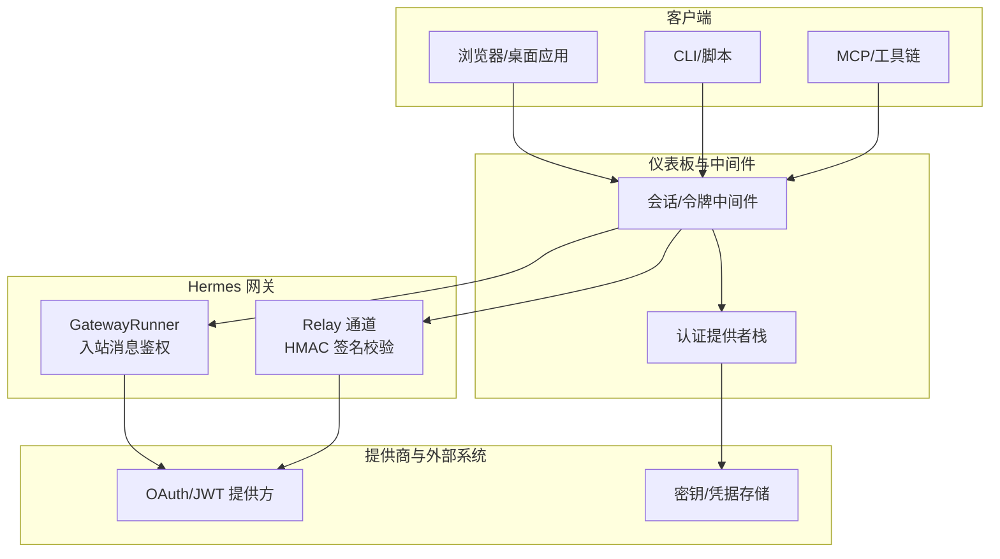
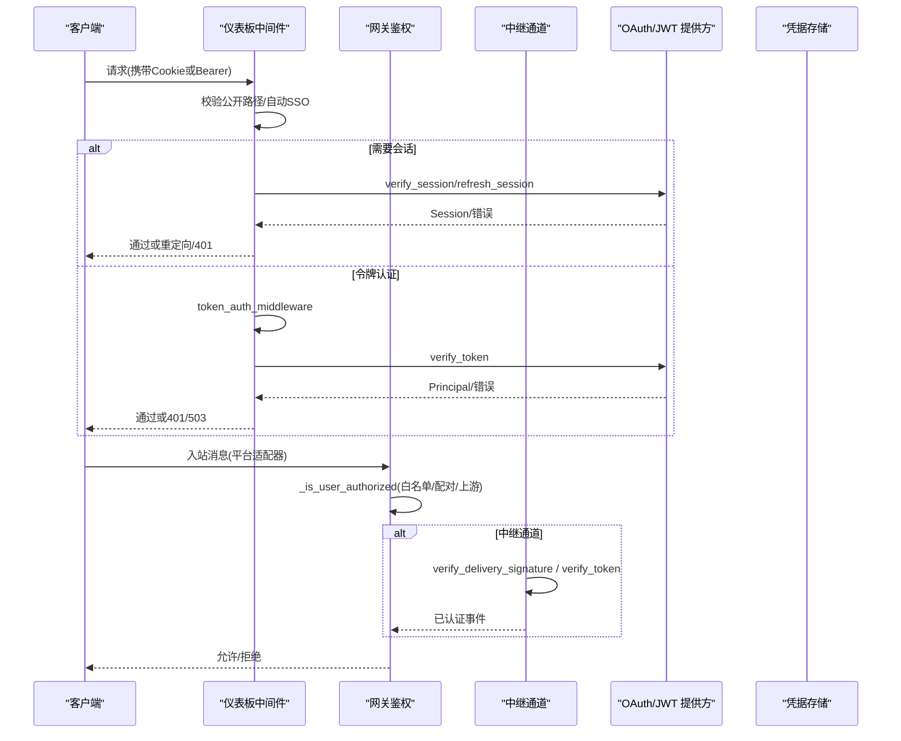
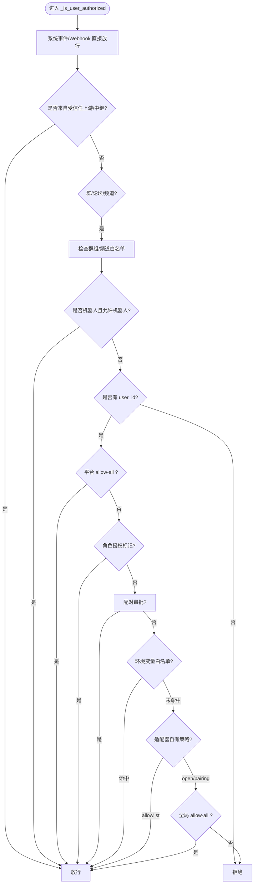
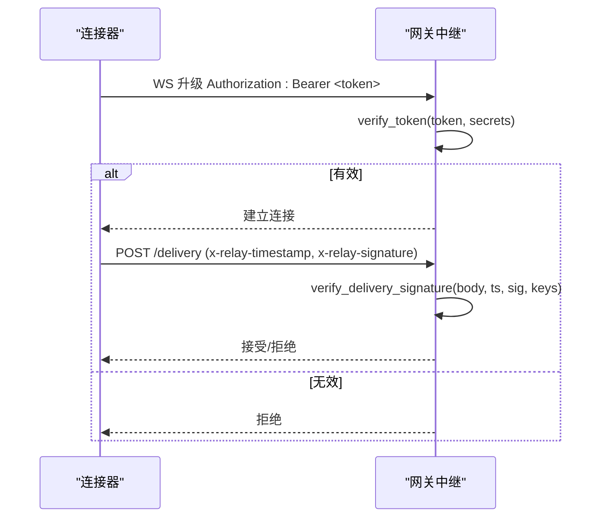
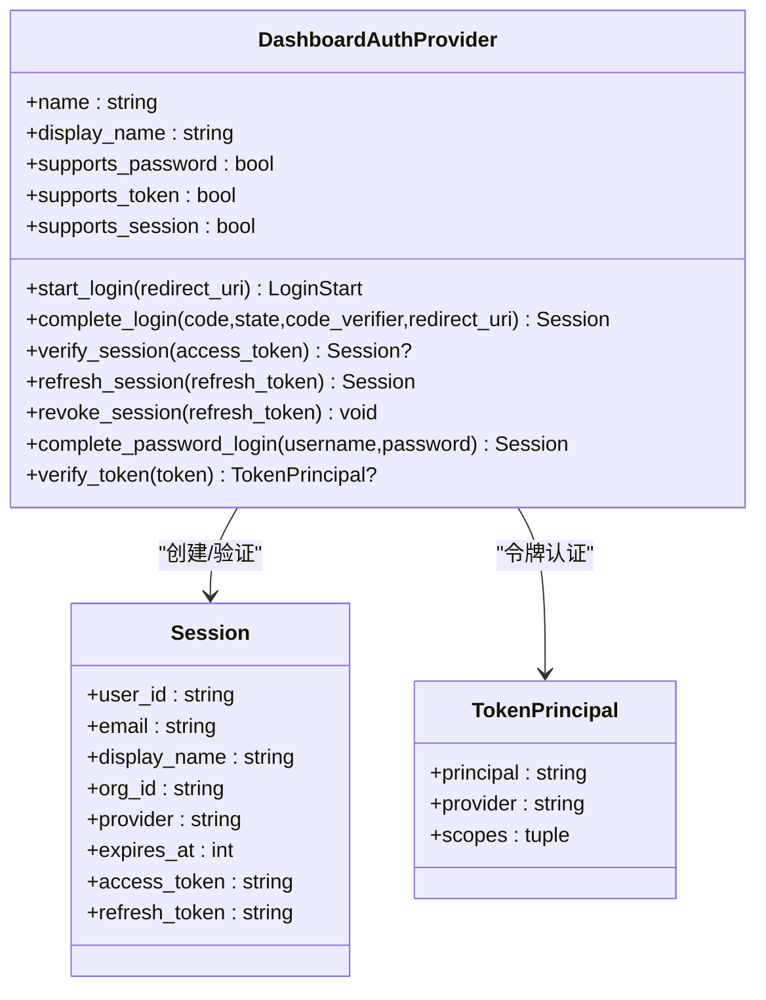
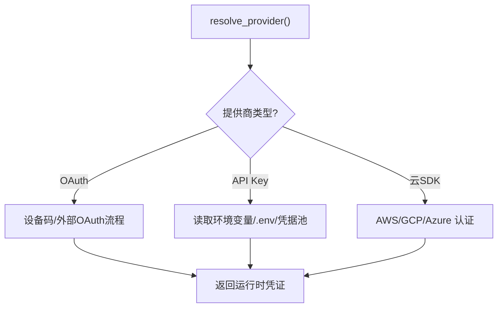
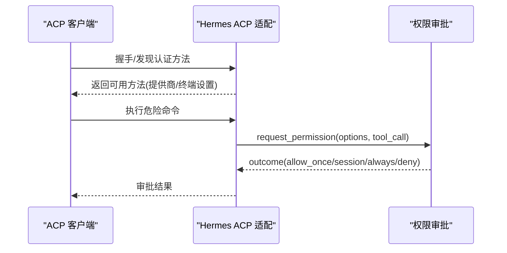
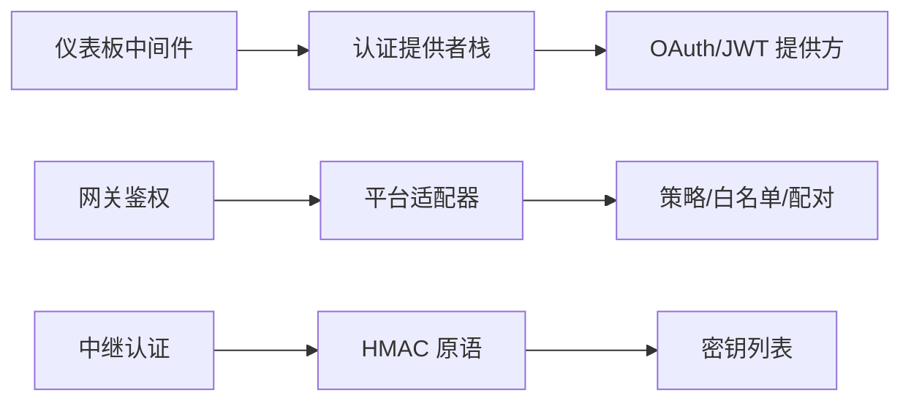

# 认证授权 API

<cite>
**本文引用的文件**
- [acp_adapter/auth.py](file://acp_adapter/auth.py)
- [gateway/authz_mixin.py](file://gateway/authz_mixin.py)
- [gateway/relay/auth.py](file://gateway/relay/auth.py)
- [hermes_cli/auth.py](file://hermes_cli/auth.py)
- [hermes_cli/dashboard_auth/middleware.py](file://hermes_cli/dashboard_auth/middleware.py)
- [hermes_cli/dashboard_auth/base.py](file://hermes_cli/dashboard_auth/base.py)
- [hermes_cli/dashboard_auth/token_auth.py](file://hermes_cli/dashboard_auth/token_auth.py)
- [acp_adapter/permissions.py](file://acp_adapter/permissions.py)
</cite>

## 目录
1. [简介](#简介)
2. [项目结构](#项目结构)
3. [核心组件](#核心组件)
4. [架构总览](#架构总览)
5. [详细组件分析](#详细组件分析)
6. [依赖关系分析](#依赖关系分析)
7. [性能考虑](#性能考虑)
8. [故障排查指南](#故障排查指南)
9. [结论](#结论)
10. [附录](#附录)

## 简介
本文件面向“认证授权 API”的完整说明，覆盖用户身份验证、权限控制与会话管理。内容基于仓库中的网关鉴权、仪表板会话与令牌认证、ACP（Agent Control Protocol）集成、以及多提供商认证能力等实现进行梳理，帮助读者理解：
- 支持的认证方式：OAuth（设备码/外部 OAuth）、JWT（调用型 JWT）、API Key、服务间 Bearer Token、平台适配器自管策略、中继 HMAC 签名等
- 角色与访问控制：按平台与环境变量的白名单、配对审批、上游授权委托、组/频道级策略
- 多租户与会话持久化：多配置隔离、刷新令牌轮换、跨域安全处理
- 第三方集成与安全最佳实践：对接模型提供商、MCP/OAuth、Dashboard SSO、中继通道安全

## 项目结构
围绕认证授权的代码主要分布在以下模块：
- 网关侧入站消息鉴权与策略：gateway/authz_mixin.py
- 中继通道双向 HMAC 认证：gateway/relay/auth.py
- 仪表板交互式会话与令牌认证：hermes_cli/dashboard_auth/*
- 多提供商认证与运行时密钥解析：hermes_cli/auth.py
- ACP 认证方法发现与危险命令审批桥接：acp_adapter/auth.py、acp_adapter/permissions.py

图表来源
- [gateway/authz_mixin.py:386-783](file://gateway/authz_mixin.py#L386-L783)
- [gateway/relay/auth.py:51-169](file://gateway/relay/auth.py#L51-L169)
- [hermes_cli/dashboard_auth/middleware.py:323-531](file://hermes_cli/dashboard_auth/middleware.py#L323-L531)
- [hermes_cli/dashboard_auth/token_auth.py:144-195](file://hermes_cli/dashboard_auth/token_auth.py#L144-L195)

章节来源
- [gateway/authz_mixin.py:386-783](file://gateway/authz_mixin.py#L386-L783)
- [gateway/relay/auth.py:51-169](file://gateway/relay/auth.py#L51-L169)
- [hermes_cli/dashboard_auth/middleware.py:323-531](file://hermes_cli/dashboard_auth/middleware.py#L323-L531)
- [hermes_cli/dashboard_auth/token_auth.py:144-195](file://hermes_cli/dashboard_auth/token_auth.py#L144-L195)

## 核心组件
- 网关入站鉴权（GatewayAuthorizationMixin）
  - 负责判断某用户/聊天是否被允许与 Agent 交互
  - 支持环境变量白名单、平台级 allow-all、配对审批、上游授权委托、组/频道策略、机器人流量放行等
- 中继通道认证（Relay Auth）
  - WebSocket 升级令牌与入站交付签名的 HMAC-SHA256 校验，支持密钥轮换窗口
- 仪表板会话与令牌认证（Dashboard Auth）
  - 交互式会话：登录、回调、验证、刷新、注销
  - 非交互式令牌：Bearer Token 认证，适用于服务到服务调用
- 多提供商认证（CLI Auth）
  - 统一注册表管理多种提供商（OAuth、API Key、外部 OAuth、AWS/GCP/Azure 等），解析运行时密钥并支持刷新
- ACP 集成
  - 认证方法发现与终端设置入口
  - 危险命令审批桥接到 ACP 权限机制

章节来源
- [gateway/authz_mixin.py:31-783](file://gateway/authz_mixin.py#L31-L783)
- [gateway/relay/auth.py:51-169](file://gateway/relay/auth.py#L51-L169)
- [hermes_cli/dashboard_auth/base.py:9-270](file://hermes_cli/dashboard_auth/base.py#L9-L270)
- [hermes_cli/dashboard_auth/middleware.py:323-531](file://hermes_cli/dashboard_auth/middleware.py#L323-L531)
- [hermes_cli/dashboard_auth/token_auth.py:104-195](file://hermes_cli/dashboard_auth/token_auth.py#L104-L195)
- [hermes_cli/auth.py:194-540](file://hermes_cli/auth.py#L194-L540)
- [acp_adapter/auth.py:11-79](file://acp_adapter/auth.py#L11-L79)
- [acp_adapter/permissions.py:18-183](file://acp_adapter/permissions.py#L18-L183)

## 架构总览
下图展示从客户端到网关再到提供商的认证授权流程，包括会话 Cookie、Bearer Token、平台白名单、中继 HMAC 校验等关键路径。

图表来源
- [hermes_cli/dashboard_auth/middleware.py:323-531](file://hermes_cli/dashboard_auth/middleware.py#L323-L531)
- [hermes_cli/dashboard_auth/token_auth.py:144-195](file://hermes_cli/dashboard_auth/token_auth.py#L144-L195)
- [gateway/authz_mixin.py:386-783](file://gateway/authz_mixin.py#L386-L783)
- [gateway/relay/auth.py:51-169](file://gateway/relay/auth.py#L51-L169)

## 详细组件分析

### 组件A：网关入站鉴权（GatewayAuthorizationMixin）
职责与要点：
- 判定用户/聊天是否可访问 Agent
- 支持环境变量白名单、平台 allow-all、配对审批、上游授权委托、组/频道策略、机器人流量放行
- 对未配置白名单时默认拒绝，除非明确启用 allow-all 或适配器自身策略为 allowlist

图表来源
- [gateway/authz_mixin.py:386-783](file://gateway/authz_mixin.py#L386-L783)

章节来源
- [gateway/authz_mixin.py:386-783](file://gateway/authz_mixin.py#L386-L783)

### 组件B：中继通道认证（Relay Auth）
职责与要点：
- WebSocket 升级令牌：使用 gateway_id + secret 生成带过期时间的 base64url 令牌
- 入站交付签名：对请求体与时间戳做 HMAC-SHA256，支持密钥轮换列表与时间偏差窗口
- 提供 make_token/verify_token/sign/verify_signature/verify_delivery_signature 等原语

图表来源
- [gateway/relay/auth.py:51-169](file://gateway/relay/auth.py#L51-L169)

章节来源
- [gateway/relay/auth.py:51-169](file://gateway/relay/auth.py#L51-L169)

### 组件C：仪表板会话与令牌认证（Dashboard Auth）
职责与要点：
- 会话流：start_login → complete_login → verify_session → refresh_session → revoke_session
- 令牌流：register_token_route → token_auth_middleware → verify_token
- 中间件：gated_auth_middleware 负责公开路径放行、自动 SSO、Bearer 与 Cookie 双路径、刷新与审计

图表来源
- [hermes_cli/dashboard_auth/base.py:9-270](file://hermes_cli/dashboard_auth/base.py#L9-L270)
- [hermes_cli/dashboard_auth/middleware.py:323-531](file://hermes_cli/dashboard_auth/middleware.py#L323-L531)
- [hermes_cli/dashboard_auth/token_auth.py:104-195](file://hermes_cli/dashboard_auth/token_auth.py#L104-L195)

章节来源
- [hermes_cli/dashboard_auth/base.py:9-270](file://hermes_cli/dashboard_auth/base.py#L9-L270)
- [hermes_cli/dashboard_auth/middleware.py:323-531](file://hermes_cli/dashboard_auth/middleware.py#L323-L531)
- [hermes_cli/dashboard_auth/token_auth.py:104-195](file://hermes_cli/dashboard_auth/token_auth.py#L104-L195)

### 组件D：多提供商认证与运行时密钥（CLI Auth）
职责与要点：
- ProviderConfig 注册表统一管理多种提供商（OAuth、API Key、外部 OAuth、云厂商 SDK）
- 解析运行时密钥：优先 .env，其次进程环境，再凭据池；支持特定提供商的端点探测与基址选择
- 支持设备码流程、外部 OAuth、短生命周期令牌提前刷新等策略

图表来源
- [hermes_cli/auth.py:194-540](file://hermes_cli/auth.py#L194-L540)

章节来源
- [hermes_cli/auth.py:194-540](file://hermes_cli/auth.py#L194-L540)

### 组件E：ACP 认证方法与权限桥接
职责与要点：
- 检测当前 Hermes 运行时提供商并通告可用认证方法（含终端设置入口）
- 将危险命令审批映射到 ACP 权限选项，支持一次性/会话/永久允许与拒绝

图表来源
- [acp_adapter/auth.py:11-79](file://acp_adapter/auth.py#L11-L79)
- [acp_adapter/permissions.py:41-183](file://acp_adapter/permissions.py#L41-L183)

章节来源
- [acp_adapter/auth.py:11-79](file://acp_adapter/auth.py#L11-L79)
- [acp_adapter/permissions.py:41-183](file://acp_adapter/permissions.py#L41-L183)

## 依赖关系分析
- 组件耦合
  - 仪表板中间件依赖认证提供者栈（Session/TokenPrincipal）
  - 网关鉴权依赖平台适配器策略与配对存储
  - 中继认证独立于业务逻辑，仅依赖 HMAC 原语与密钥列表
- 外部依赖
  - OAuth/JWT 提供方（Nous Portal、OpenAI Codex、xAI、Qwen 等）
  - 云平台 SDK（AWS Bedrock、Google Vertex、Azure Foundry）
  - MCP/OAuth 集成（通过插件与路由注册）

图表来源
- [hermes_cli/dashboard_auth/middleware.py:323-531](file://hermes_cli/dashboard_auth/middleware.py#L323-L531)
- [gateway/authz_mixin.py:386-783](file://gateway/authz_mixin.py#L386-L783)
- [gateway/relay/auth.py:51-169](file://gateway/relay/auth.py#L51-L169)

章节来源
- [hermes_cli/dashboard_auth/middleware.py:323-531](file://hermes_cli/dashboard_auth/middleware.py#L323-L531)
- [gateway/authz_mixin.py:386-783](file://gateway/authz_mixin.py#L386-L783)
- [gateway/relay/auth.py:51-169](file://gateway/relay/auth.py#L51-L169)

## 性能考虑
- 令牌刷新与缓存
  - 短生命周期令牌（如 xAI）提前刷新以减少空窗期
  - 端点探测并行化（Z.AI）减少启动延迟
- 鉴权路径优化
  - 快速失败：无 user_id 或无白名单时尽早拒绝
  - 上游授权委托：中继与可信上游直接放行，避免重复校验
- 并发与超时
  - ACP 权限请求设置超时，避免阻塞
  - 中间件在不可达提供商时返回 503，避免误判为凭证错误

[本节为通用指导，不直接分析具体文件]

## 故障排查指南
常见问题与定位建议：
- 401 未认证
  - 检查仪表板中间件的公开路径与自动 SSO 行为
  - 确认 Bearer Token 是否正确传递与注册为 token route
- 503 提供商不可达
  - 检查 OIDC/JWKS 或后端凭据存储可用性
  - 区分“不可达”与“凭证无效”，避免强制登出
- 中继签名失败
  - 核对时间戳偏差窗口与密钥轮换列表
  - 确保请求体字节一致（不重新序列化）
- 网关鉴权拒绝
  - 检查平台白名单、allow-all、配对审批、上游授权标志
  - 对于群组/频道，确认 group_allowed_chats 与 allow_from 配置

章节来源
- [hermes_cli/dashboard_auth/middleware.py:112-163](file://hermes_cli/dashboard_auth/middleware.py#L112-L163)
- [hermes_cli/dashboard_auth/token_auth.py:144-195](file://hermes_cli/dashboard_auth/token_auth.py#L144-L195)
- [gateway/relay/auth.py:142-169](file://gateway/relay/auth.py#L142-L169)
- [gateway/authz_mixin.py:386-783](file://gateway/authz_mixin.py#L386-L783)

## 结论
该认证授权体系以“分层鉴权 + 多提供商抽象 + 安全默认拒绝”为核心：
- 网关层严格管控入站消息，结合环境变量、配对与上游委托实现细粒度访问控制
- 仪表板层提供交互式会话与非交互式令牌两种认证路径，支持刷新与审计
- 中继通道通过 HMAC 签名保障通道安全，支持密钥轮换
- 多提供商抽象简化了 OAuth/JWT/API Key/云 SDK 的统一接入
- 通过 ACP 集成，危险命令审批与权限策略可无缝桥接到外部客户端

[本节为总结性内容，不直接分析具体文件]

## 附录
- 第三方认证集成指南
  - OAuth：设备码流程（Nous Portal）、外部 OAuth（OpenAI Codex、xAI、Qwen）
  - JWT：调用型 JWT（inference:invoke 范围）
  - API Key：各提供商环境变量与 .env 优先级
  - 云 SDK：AWS Bedrock、Google Vertex、Azure Foundry
- 安全最佳实践
  - 默认拒绝：未配置白名单时拒绝访问
  - 最小权限：按需启用 allow-all 或开放策略
  - 密钥轮换：中继与提供商均支持多密钥验证窗口
  - 审计：登录、刷新、失败事件记录
  - 跨域安全：中间件对 next 参数进行同源校验，防止开放重定向

[本节为通用指导，不直接分析具体文件]