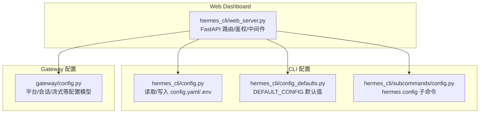
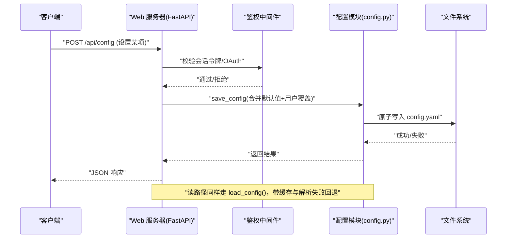
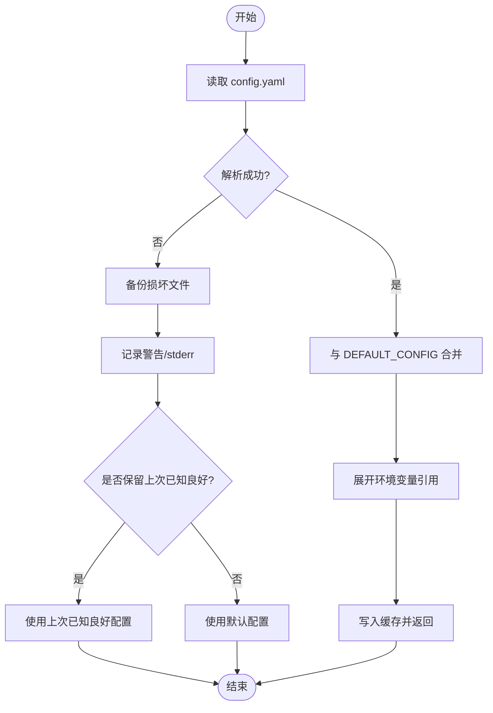
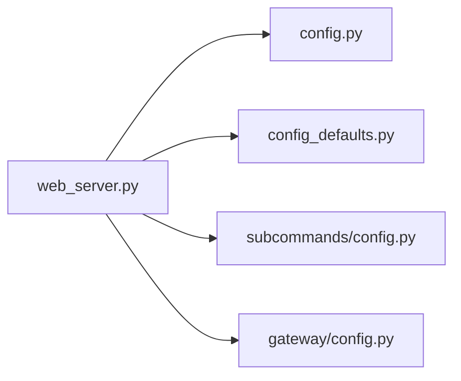

# 配置管理 API

<cite>
**本文引用的文件**
- [hermes_cli/config.py](file://hermes_cli/config.py)
- [hermes_cli/config_defaults.py](file://hermes_cli/config_defaults.py)
- [hermes_cli/subcommands/config.py](file://hermes_cli/subcommands/config.py)
- [gateway/config.py](file://gateway/config.py)
- [hermes_cli/web_server.py](file://hermes_cli/web_server.py)
</cite>

## 目录
1. [简介](#简介)
2. [项目结构](#项目结构)
3. [核心组件](#核心组件)
4. [架构总览](#架构总览)
5. [详细组件分析](#详细组件分析)
6. [依赖关系分析](#依赖关系分析)
7. [性能考虑](#性能考虑)
8. [故障排查指南](#故障排查指南)
9. [结论](#结论)
10. [附录](#附录)

## 简介
本文件面向“配置管理 API”，系统性说明 Hermes Agent 的配置读取、更新与管理接口，覆盖以下方面：
- 配置文件与默认值：config.yaml 与默认配置合并策略、迁移与校验
- 类型验证与规范化：布尔、整数、浮点、枚举、字典等类型的严格/宽松处理
- 环境变量集成：.env 注入、敏感变量白名单/黑名单、运行时作用域
- 动态加载与热重载：MCP 自动重载、配置变更检测与缓存失效
- 安全与权限控制：Dashboard 认证、Host 头校验、写路径限制、敏感信息脱敏
- 最佳实践：如何安全地管理密钥、避免误改关键环境、在受管环境中正确修改配置

## 项目结构
配置体系由 CLI 层与 Gateway 层共同组成，Web Dashboard 通过 REST API 暴露读写能力。

图表来源
- [hermes_cli/config.py:1-120](file://hermes_cli/config.py#L1-L120)
- [hermes_cli/config_defaults.py:1-120](file://hermes_cli/config_defaults.py#L1-L120)
- [hermes_cli/subcommands/config.py:1-69](file://hermes_cli/subcommands/config.py#L1-L69)
- [gateway/config.py:1-120](file://gateway/config.py#L1-L120)
- [hermes_cli/web_server.py:1-120](file://hermes_cli/web_server.py#L1-L120)

章节来源
- [hermes_cli/config.py:1-120](file://hermes_cli/config.py#L1-L120)
- [hermes_cli/config_defaults.py:1-120](file://hermes_cli/config_defaults.py#L1-L120)
- [hermes_cli/subcommands/config.py:1-69](file://hermes_cli/subcommands/config.py#L1-L69)
- [gateway/config.py:1-120](file://gateway/config.py#L1-L120)
- [hermes_cli/web_server.py:1-120](file://hermes_cli/web_server.py#L1-L120)

## 核心组件
- 配置存储与解析
  - 主配置文件：~/.hermes/config.yaml（用户覆盖）
  - 环境变量：~/.hermes/.env（密钥与敏感值）
  - 默认配置：DEFAULT_CONFIG（纯数据模块，便于合并与展示）
- 配置模型与校验
  - Gateway 侧使用 dataclass 定义平台、会话重置、流式传输等配置模型，并提供 from_dict/to_dict 与多种 coerce 函数
- Web API 与鉴权
  - FastAPI 提供 /api/* 配置相关端点；通过会话令牌或 OAuth 门控保护敏感操作
  - Host 头校验与 CORS 限制本地访问
- 动态加载与热重载
  - MCP 自动重载：监听配置变化并重建工具集
  - 配置缓存按文件 mtime/size 失效，支持进程内“上次已知良好”回退

章节来源
- [hermes_cli/config.py:1-120](file://hermes_cli/config.py#L1-L120)
- [hermes_cli/config_defaults.py:1-120](file://hermes_cli/config_defaults.py#L1-L120)
- [gateway/config.py:1-120](file://gateway/config.py#L1-L120)
- [hermes_cli/web_server.py:313-470](file://hermes_cli/web_server.py#L313-L470)

## 架构总览
下图展示了从 Web 请求到配置读取/更新的完整链路，包括鉴权、配置缓存、文件原子写入与错误回退。

图表来源
- [hermes_cli/web_server.py:398-470](file://hermes_cli/web_server.py#L398-L470)
- [hermes_cli/config.py:235-260](file://hermes_cli/config.py#L235-L260)
- [hermes_cli/config.py:45-156](file://hermes_cli/config.py#L45-L156)

## 详细组件分析

### 配置读取与合并（load_config）
- 读取顺序
  - 读取用户 config.yaml
  - 与 DEFAULT_CONFIG 深度合并
  - 展开环境变量引用（如 ${VAR}），并在 .env 引用变化时失效缓存
- 缓存机制
  - 基于 (path, mtime_ns, size) 的缓存键，命中则直接返回深拷贝，避免重复解析
  - 写路径使用原子替换，产生新 inode，下次读取自动失效
- 解析失败处理
  - 首次失败会尝试备份损坏的 config.yaml
  - 日志与 stderr 输出警告，并可选择保留“上次已知良好”配置

图表来源
- [hermes_cli/config.py:45-156](file://hermes_cli/config.py#L45-L156)
- [hermes_cli/config.py:235-260](file://hermes_cli/config.py#L235-L260)

章节来源
- [hermes_cli/config.py:45-156](file://hermes_cli/config.py#L45-L156)
- [hermes_cli/config.py:235-260](file://hermes_cli/config.py#L235-L260)

### 配置写入与保存（save_config）
- 原子写入：避免并发写入导致部分写入
- 权限与安全：
  - 对目录设置受限权限（非受管模式）
  - 环境变量写入存在严格的“写路径黑名单”，禁止危险变量名（如 LD_PRELOAD、PATH、SHELL 等）
- 受管模式：NixOS/Homebrew 等受包管理器管理的安装路径下，禁止直接写配置，需通过包管理器更新

章节来源
- [hermes_cli/config.py:765-795](file://hermes_cli/config.py#L765-L795)
- [hermes_cli/config.py:158-233](file://hermes_cli/config.py#L158-L233)

### 环境变量集成与敏感信息
- .env 文件用于存放密钥，支持可选键集合与额外键集合
- 读取优先级：当前秘密作用域 > 环境变量 > 默认值
- 写路径限制：
  - 黑名单变量名不可通过 Dashboard 写入（防止 RCE/劫持）
  - 允许 HERMES_* 前缀的集成密钥（如 HERMES_LANGFUSE_*）
- 敏感信息脱敏：终端工具输出与错误信息中会对疑似凭据进行脱敏

章节来源
- [hermes_cli/config.py:261-327](file://hermes_cli/config.py#L261-L327)
- [gateway/config.py:234-254](file://gateway/config.py#L234-L254)
- [tests/tools/test_terminal_error_redaction.py:1-154](file://tests/tools/test_terminal_error_redaction.py#L1-L154)

### 类型验证与规范化
- 布尔：支持字符串 true/false/on/off/1/0 等，空值回退默认
- 整数/浮点：容错解析，非法值记录警告并回退
- 枚举：平台枚举支持动态成员（插件平台），并缓存身份稳定比较
- 字典：缺失或非 dict 时回退为空 dict，保证调用方安全写入

章节来源
- [gateway/config.py:26-112](file://gateway/config.py#L26-L112)
- [gateway/config.py:272-373](file://gateway/config.py#L272-L373)
- [gateway/config.py:193-205](file://gateway/config.py#L193-L205)

### 动态配置加载与热重载
- MCP 自动重载：当配置文件中 mcp_servers 变化时，自动重建工具集
- 配置缓存失效：写路径原子替换后，下一次读取自动失效
- 进程内回退：解析失败时保留上次已知良好配置，避免服务中断

章节来源
- [hermes_cli/config_defaults.py:531-543](file://hermes_cli/config_defaults.py#L531-L543)
- [hermes_cli/config.py:235-260](file://hermes_cli/config.py#L235-L260)
- [hermes_cli/config.py:45-156](file://hermes_cli/config.py#L45-L156)

### Web API 与鉴权
- 端点分组
  - 公开端点：仅健康检查等只读、低风险接口
  - 受保护端点：所有 /api/* 默认需要会话令牌或 OAuth 认证
- 认证方式
  - 本地回环绑定：注入会话令牌到前端，通过 Header 或 Bearer 校验
  - 非回环绑定：强制启用 OAuth/密码门控，禁止无认证访问
- Host 头校验：防御 DNS Rebinding 攻击，仅接受绑定的主机名
- CORS：限制为 localhost/127.0.0.1

章节来源
- [hermes_cli/web_server.py:313-470](file://hermes_cli/web_server.py#L313-L470)
- [hermes_cli/web_server.py:538-671](file://hermes_cli/web_server.py#L538-L671)

### CLI 配置子命令
- hermes config show：显示当前配置
- hermes config edit：打开编辑器编辑
- hermes config get/set/unset：读取、设置、删除配置项
- hermes config path/env-path：打印配置文件路径
- hermes config check/migrate：检查与迁移配置

章节来源
- [hermes_cli/subcommands/config.py:1-69](file://hermes_cli/subcommands/config.py#L1-L69)

## 依赖关系分析
- Web 服务器依赖 CLI 配置模块进行读取/写入
- Gateway 配置模块提供平台/会话/流式等结构化模型
- 默认配置作为纯数据模块被 CLI/Gateway 共享
- 测试用例确保终端输出中的敏感信息被脱敏

图表来源
- [hermes_cli/web_server.py:60-100](file://hermes_cli/web_server.py#L60-L100)
- [hermes_cli/config.py:1-120](file://hermes_cli/config.py#L1-L120)
- [hermes_cli/config_defaults.py:1-120](file://hermes_cli/config_defaults.py#L1-L120)
- [gateway/config.py:1-120](file://gateway/config.py#L1-L120)

章节来源
- [hermes_cli/web_server.py:60-100](file://hermes_cli/web_server.py#L60-L100)
- [hermes_cli/config.py:1-120](file://hermes_cli/config.py#L1-L120)
- [hermes_cli/config_defaults.py:1-120](file://hermes_cli/config_defaults.py#L1-L120)
- [gateway/config.py:1-120](file://gateway/config.py#L1-L120)

## 性能考虑
- 配置读取缓存：基于文件 mtime/size 的缓存，避免重复解析与合并
- 原子写入：减少并发写入竞争，提升稳定性
- 解析失败快速回退：保障服务可用性
- 敏感信息脱敏：避免泄露的同时保持输出可读性

[本节为通用指导，不直接分析具体文件]

## 故障排查指南
- 配置解析失败
  - 现象：服务启动或运行时报错，提示 YAML 解析失败
  - 处理：查看日志与 stderr 警告；检查备份文件；修复 YAML 后重启
- 环境变量写入被拒绝
  - 现象：尝试通过 Dashboard 写入某些环境变量被拒绝
  - 处理：确认变量是否在黑名单；如需写入，请手动编辑 .env
- 非回环绑定未认证
  - 现象：外部访问 Dashboard 被 401
  - 处理：启用 OAuth/密码门控；或使用回环绑定并通过隧道访问
- 终端输出泄露敏感信息
  - 现象：错误信息中包含密钥片段
  - 处理：系统已自动脱敏；若发现未脱敏，检查相关开关与版本

章节来源
- [hermes_cli/config.py:45-156](file://hermes_cli/config.py#L45-L156)
- [hermes_cli/config.py:158-233](file://hermes_cli/config.py#L158-L233)
- [hermes_cli/web_server.py:398-470](file://hermes_cli/web_server.py#L398-L470)
- [tests/tools/test_terminal_error_redaction.py:1-154](file://tests/tools/test_terminal_error_redaction.py#L1-L154)

## 结论
Hermes Agent 的配置管理体系以“默认值 + 用户覆盖 + 环境变量”为核心，结合严格的类型校验、安全的写路径限制与健壮的解析失败回退，提供了可靠的配置管理能力。Web Dashboard 通过鉴权与 Host 头校验保障安全，同时支持动态加载与热重载，满足生产环境的运维需求。建议在生产中遵循最小权限原则，将敏感信息置于 .env 或通过秘密管理服务注入，并仅在必要时开放非回环绑定。

[本节为总结，不直接分析具体文件]

## 附录
- 常用配置项示例（来自默认配置）
  - agent.gateway_timeout：网关超时
  - terminal.backend：终端后端
  - web.search_backend/web.extract_backend：网络能力后端
  - checkpoints.enabled/max_total_size_mb：快照策略
  - compression.threshold/target_ratio：上下文压缩阈值
  - prompt_caching.cache_ttl：提示词缓存 TTL
- 平台与流式配置
  - Platform 枚举：内置与插件平台
  - StreamingConfig：传输模式、编辑间隔、缓冲区阈值等

章节来源
- [hermes_cli/config_defaults.py:1-120](file://hermes_cli/config_defaults.py#L1-L120)
- [gateway/config.py:272-373](file://gateway/config.py#L272-L373)
- [gateway/config.py:720-800](file://gateway/config.py#L720-L800)