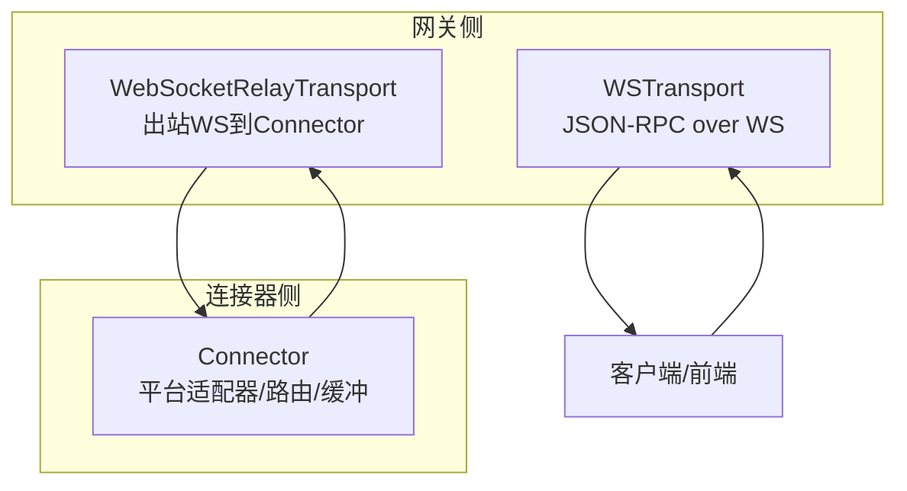
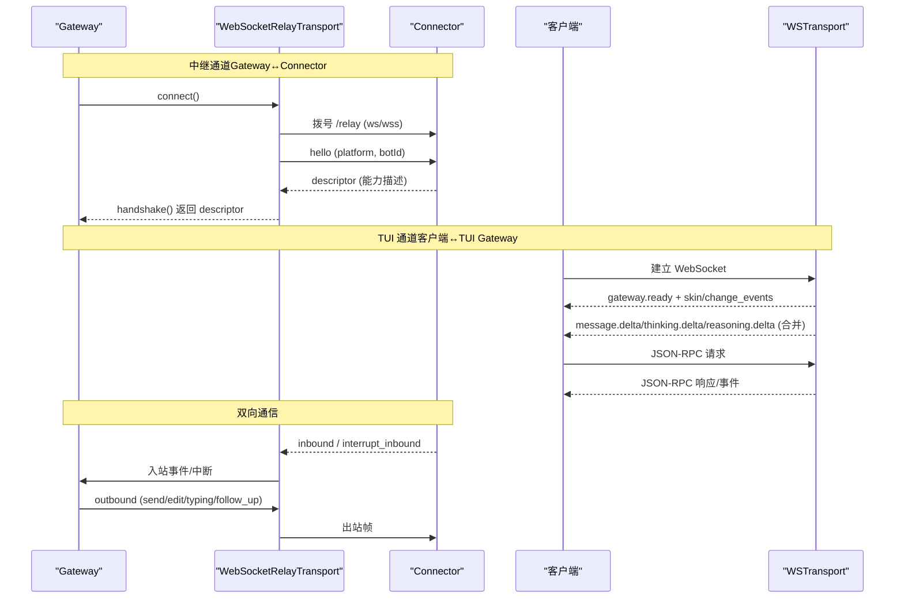
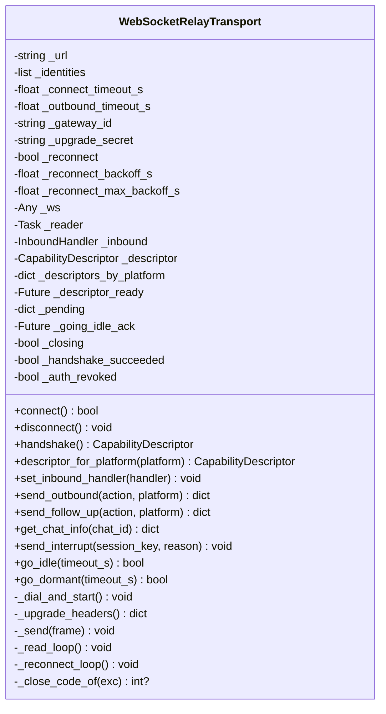
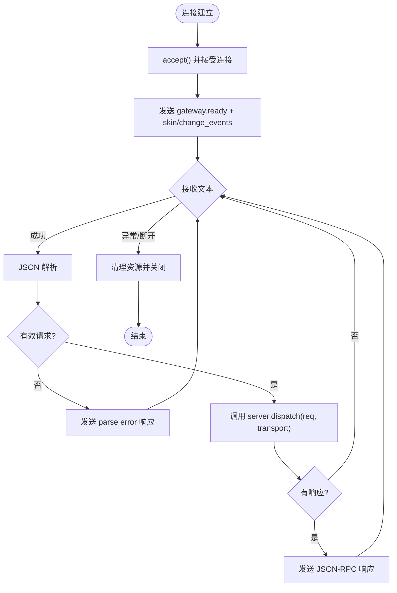
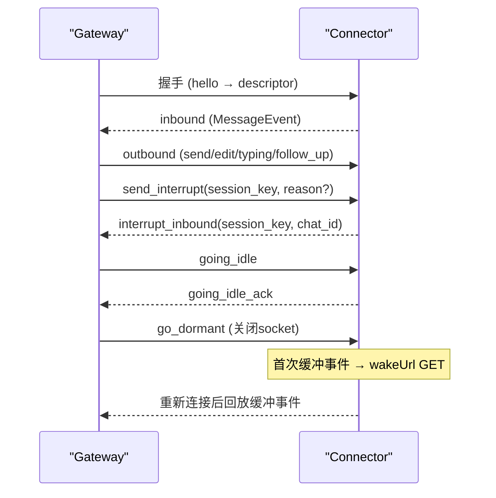
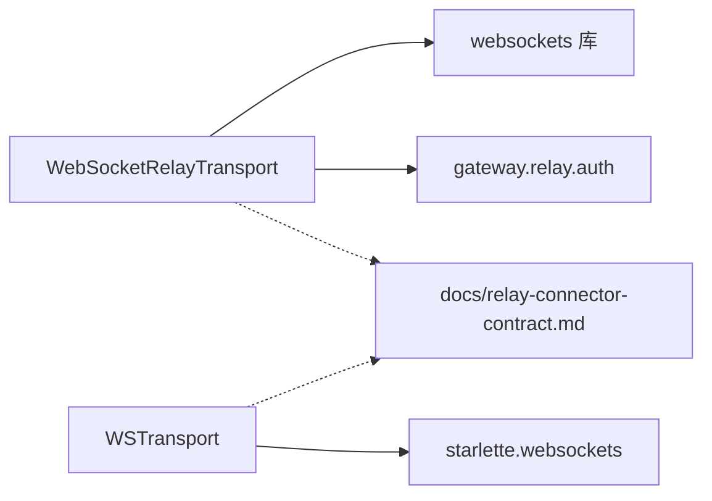

# WebSocket 通信

<cite>
**本文引用的文件**
- [gateway/relay/ws_transport.py](file://gateway/relay/ws_transport.py)
- [tui_gateway/ws.py](file://tui_gateway/ws.py)
- [docs/relay-connector-contract.md](file://docs/relay-connector-contract.md)
</cite>

## 目录
1. [简介](#简介)
2. [项目结构](#项目结构)
3. [核心组件](#核心组件)
4. [架构总览](#架构总览)
5. [详细组件分析](#详细组件分析)
6. [依赖关系分析](#依赖关系分析)
7. [性能考量](#性能考量)
8. [故障排查指南](#故障排查指南)
9. [结论](#结论)
10. [附录](#附录)

## 简介
本文件面向实时通信与 WebSocket 集成，覆盖两类实现：
- Gateway ↔ Connector 的 WebSocket 中继通道（出站连接、握手、认证、事件与动作、重连与休眠唤醒）
- TUI Gateway 的 JSON-RPC over WebSocket（客户端与服务端的双向消息、流式事件合并与发送）

文档将说明连接建立流程、认证机制、事件类型与消息结构、流式响应处理、实时状态更新、双向通信模式、连接管理、重连机制、错误处理与性能优化策略，并提供客户端连接示例、事件监听实现与消息处理模式的指导。

## 项目结构
围绕 WebSocket 的关键代码位于以下位置：
- gateway/relay/ws_transport.py：Gateway 到 Connector 的 WebSocket 传输层，负责拨号、握手、鉴权、帧收发、请求-响应、中断、空闲/休眠、重连等
- tui_gateway/ws.py：TUI Gateway 的 WebSocket 传输层，提供 JSON-RPC 协议、事件推送、流式 token 合并与发送
- docs/relay-connector-contract.md：Gateway 与 Connector 之间的正式契约，定义握手、能力描述、入站/出站帧、认证、中断、缓冲翻转、唤醒等

图表来源
- [gateway/relay/ws_transport.py:339-541](file://gateway/relay/ws_transport.py#L339-L541)
- [tui_gateway/ws.py:70-226](file://tui_gateway/ws.py#L70-L226)
- [docs/relay-connector-contract.md:21-32](file://docs/relay-connector-contract.md#L21-L32)

章节来源
- [gateway/relay/ws_transport.py:1-120](file://gateway/relay/ws_transport.py#L1-L120)
- [tui_gateway/ws.py:1-70](file://tui_gateway/ws.py#L1-L70)
- [docs/relay-connector-contract.md:1-32](file://docs/relay-connector-contract.md#L1-L32)

## 核心组件
- WebSocketRelayTransport（Gateway→Connector）
  - 出站 WebSocket 连接，支持多身份 hello、能力协商、请求-响应、中断、空闲/休眠、重连、授权撤销检测
- WSTransport（TUI Gateway）
  - JSON-RPC over WebSocket，支持高并发写入、流式 token 合并、Nagle 禁用、错误与断开处理
- 契约文档（docs/relay-connector-contract.md）
  - 定义握手、能力描述、入站/出站帧、认证、中断、缓冲翻转、唤醒、管理平面等

章节来源
- [gateway/relay/ws_transport.py:339-541](file://gateway/relay/ws_transport.py#L339-L541)
- [tui_gateway/ws.py:70-226](file://tui_gateway/ws.py#L70-L226)
- [docs/relay-connector-contract.md:21-132](file://docs/relay-connector-contract.md#L21-L132)

## 架构总览
Gateway 通过 WebSocketRelayTransport 主动拨号到 Connector 的 /relay 端点，完成握手后以“出站帧”发送动作，以“入站帧”接收消息；同时支持中断、缓冲翻转与唤醒。TUI Gateway 通过 WSTransport 为前端提供 JSON-RPC 服务，推送 gateway.ready 及各类事件，并对高频 token 流进行合并以降低开销。

图表来源
- [docs/relay-connector-contract.md:21-32](file://docs/relay-connector-contract.md#L21-L32)
- [docs/relay-connector-contract.md:94-132](file://docs/relay-connector-contract.md#L94-L132)
- [docs/relay-connector-contract.md:386-547](file://docs/relay-connector-contract.md#L386-L547)
- [tui_gateway/ws.py:286-337](file://tui_gateway/ws.py#L286-L337)
- [tui_gateway/ws.py:44-60](file://tui_gateway/ws.py#L44-L60)

## 详细组件分析

### 组件A：WebSocketRelayTransport（Gateway↔Connector）
职责
- 出站 WebSocket 连接与握手（hello → descriptor）
- 认证升级（Authorization Bearer，基于 per-gateway secret）
- 入站帧解析（inbound、interrupt_inbound、passthrough_forward）
- 出站动作（send/edit/typing/follow_up/get_chat_info 等）
- 中断（send_interrupt）
- 空闲/休眠（going_idle/go_dormant）
- 重连（指数退避、dormant 慢轮询）
- 授权撤销检测（4401 终止重连）

关键数据与流程
- 握手：connect → _dial_and_start → send hello(s) → await descriptor
- 入站：_read_loop 解析 newline-delimited JSON，分发到 handler
- 出站：_request_response 生成 requestId 并等待 outbound_result
- 空闲/休眠：go_idle 发送 going_idle，等待 going_idle_ack；go_dormant 关闭 socket 但保持重连任务
- 重连：_reconnect_loop 在意外关闭时重拨并重握手
- 认证：_upgrade_headers 构造 Authorization Bearer；收到 4401 且已握手成功则标记 auth_revoked 并停止重连

图表来源
- [gateway/relay/ws_transport.py:339-541](file://gateway/relay/ws_transport.py#L339-L541)
- [gateway/relay/ws_transport.py:567-729](file://gateway/relay/ws_transport.py#L567-L729)
- [gateway/relay/ws_transport.py:731-800](file://gateway/relay/ws_transport.py#L731-L800)

章节来源
- [gateway/relay/ws_transport.py:339-541](file://gateway/relay/ws_transport.py#L339-L541)
- [gateway/relay/ws_transport.py:567-729](file://gateway/relay/ws_transport.py#L567-L729)
- [gateway/relay/ws_transport.py:731-800](file://gateway/relay/ws_transport.py#L731-L800)

### 组件B：WSTransport（TUI Gateway JSON-RPC over WebSocket）
职责
- 每连接传输对象，线程安全写（从工作线程或事件循环线程）
- 流式 token 合并（message.delta/reasoning.delta/thinking.delta），降低事件循环唤醒频率
- 禁用 Nagle，保证小帧即时发出
- 错误与断开处理，统计指标记录

关键数据与流程
- write(obj)：判断是否流式帧，若是则缓存并在定时器触发时批量发送；否则立即发送
- write_async(obj)：从事件循环线程发送，确保顺序
- handle_ws(ws)：接受连接，发送 gateway.ready，进入读循环，解析 JSON-RPC，调度 server.dispatch，处理错误与断开

图表来源
- [tui_gateway/ws.py:286-477](file://tui_gateway/ws.py#L286-L477)
- [tui_gateway/ws.py:70-226](file://tui_gateway/ws.py#L70-L226)

章节来源
- [tui_gateway/ws.py:70-226](file://tui_gateway/ws.py#L70-L226)
- [tui_gateway/ws.py:286-477](file://tui_gateway/ws.py#L286-L477)

### 组件C：Gateway↔Connector 契约（帧与事件）
- 握手：gateway 发起 connect/handshake，connector 返回 CapabilityDescriptor
- 入站帧：inbound（MessageEvent）、interrupt_inbound、passthrough_forward
- 出站动作：send/edit/typing/follow_up/send_media/prompt/react/thread_create/thread_rename
- 认证：WS 升级携带 Authorization Bearer（per-gateway secret），失败关闭 4401
- 空闲/休眠：going_idle → going_idle_ack；go_dormant 关闭 socket 并保持重连任务
- 唤醒：当 buffered-only 实例收到首个事件时，connector 向注册的 wakeUrl 发 GET 唤醒
- 信任边界：connector 验证/解密平台签名，剥离共享凭证，仅转发标准化 MessageEvent

图表来源
- [docs/relay-connector-contract.md:21-32](file://docs/relay-connector-contract.md#L21-L32)
- [docs/relay-connector-contract.md:94-132](file://docs/relay-connector-contract.md#L94-L132)
- [docs/relay-connector-contract.md:386-547](file://docs/relay-connector-contract.md#L386-L547)
- [docs/relay-connector-contract.md:260-332](file://docs/relay-connector-contract.md#L260-L332)
- [docs/relay-connector-contract.md:550-564](file://docs/relay-connector-contract.md#L550-L564)
- [docs/relay-connector-contract.md:607-627](file://docs/relay-connector-contract.md#L607-L627)

章节来源
- [docs/relay-connector-contract.md:21-132](file://docs/relay-connector-contract.md#L21-L132)
- [docs/relay-connector-contract.md:386-547](file://docs/relay-connector-contract.md#L386-L547)
- [docs/relay-connector-contract.md:260-332](file://docs/relay-connector-contract.md#L260-L332)
- [docs/relay-connector-contract.md:550-564](file://docs/relay-connector-contract.md#L550-L564)
- [docs/relay-connector-contract.md:607-627](file://docs/relay-connector-contract.md#L607-L627)

## 依赖关系分析
- WebSocketRelayTransport 依赖 websockets 包（可选依赖，缺失时报错）
- 认证依赖 gateway.relay.auth.make_upgrade_token（仅在配置了 per-gateway secret 时使用）
- TUI WSTransport 依赖 Starlette WebSocket（导入时可选，运行时使用）
- 契约文档定义了双方必须遵循的消息结构与行为约束

图表来源
- [gateway/relay/ws_transport.py:46-51](file://gateway/relay/ws_transport.py#L46-L51)
- [gateway/relay/ws_transport.py:486-501](file://gateway/relay/ws_transport.py#L486-L501)
- [tui_gateway/ws.py:62-67](file://tui_gateway/ws.py#L62-L67)
- [docs/relay-connector-contract.md:1-32](file://docs/relay-connector-contract.md#L1-L32)

章节来源
- [gateway/relay/ws_transport.py:46-51](file://gateway/relay/ws_transport.py#L46-L51)
- [tui_gateway/ws.py:62-67](file://tui_gateway/ws.py#L62-L67)
- [docs/relay-connector-contract.md:1-32](file://docs/relay-connector-contract.md#L1-L32)

## 性能考量
- 流式 token 合并：TUI WSTransport 对 message.delta/reasoning.delta/thinking.delta 进行短时缓冲合并，减少事件循环唤醒与 GIL 竞争
- 禁用 Nagle：为 GUI/WS 场景设置 TCP_NODELAY，避免小帧被内核合并导致延迟抖动
- 超时与预算：
  - 握手与出站响应超时（_HANDSHAKE_TIMEOUT_S/_OUTBOUND_TIMEOUT_S）
  - 关闭阶段各等待限制（_TEARDOWN_AWAIT_TIMEOUT_S）防止挂起
- 重连退避：指数退避 + dormant 慢轮询，避免频繁重拨与平台暂停窗口冲突
- 带宽与体积：媒体上传大小上限（25 MB），按引用传递，避免大负载直接跨线

章节来源
- [tui_gateway/ws.py:44-60](file://tui_gateway/ws.py#L44-L60)
- [tui_gateway/ws.py:268-283](file://tui_gateway/ws.py#L268-L283)
- [gateway/relay/ws_transport.py:53-59](file://gateway/relay/ws_transport.py#L53-L59)
- [gateway/relay/ws_transport.py:791-800](file://gateway/relay/ws_transport.py#L791-L800)
- [docs/relay-connector-contract.md:406-421](file://docs/relay-connector-contract.md#L406-L421)

## 故障排查指南
- 无法握手/无 descriptor
  - 检查 URL 规范化（scheme/path）与 /relay 挂载
  - 确认 websockets 包可用
  - 查看握手超时与 _descriptor_ready 是否 resolved
- 认证失败（4401）
  - 若发生在握手成功后，视为授权撤销（opt-out/deprovision），不再重连
  - 若发生在握手前，可能是冷启动竞态，可重试
- 入站丢失/重复
  - 使用 going_idle → going_idle_ack 切换至 buffered-only，再关闭 socket
  - 重连后 connector 会按 bufferId 有序回放未 ack 的条目
- 流式卡顿/掉帧
  - 确认启用 token 合并与禁用 Nagle
  - 检查事件循环是否被阻塞（长时间任务导致 write 超时）
- 断开与重连
  - 观察 _read_loop 异常与 _reconnect_loop 是否被调度
  - 确认 _closing 标志与 supervisor 状态

章节来源
- [gateway/relay/ws_transport.py:69-95](file://gateway/relay/ws_transport.py#L69-L95)
- [gateway/relay/ws_transport.py:486-501](file://gateway/relay/ws_transport.py#L486-L501)
- [gateway/relay/ws_transport.py:745-775](file://gateway/relay/ws_transport.py#L745-L775)
- [docs/relay-connector-contract.md:260-332](file://docs/relay-connector-contract.md#L260-L332)
- [tui_gateway/ws.py:118-187](file://tui_gateway/ws.py#L118-L187)

## 结论
本项目提供了两套 WebSocket 通信路径：
- Gateway↔Connector 的中继通道，具备完善的握手、认证、事件/动作、中断、缓冲翻转与唤醒、重连与授权撤销处理
- TUI Gateway 的 JSON-RPC over WebSocket，提供高效稳定的流式事件推送与客户端交互

通过契约文档与实现细节，开发者可以可靠地集成实时功能，获得低延迟、高吞吐、强一致性的通信体验。

## 附录

### 协议规范速查
- 握手：hello → descriptor
- 入站帧：inbound、interrupt_inbound、passthrough_forward
- 出站动作：send/edit/typing/follow_up/send_media/prompt/react/thread_create/thread_rename
- 认证：Authorization Bearer（per-gateway secret），失败关闭 4401
- 空闲/休眠：going_idle → going_idle_ack；go_dormant 关闭 socket 并保持重连
- 唤醒：buffered-only 首个事件触发 wakeUrl GET

章节来源
- [docs/relay-connector-contract.md:21-32](file://docs/relay-connector-contract.md#L21-L32)
- [docs/relay-connector-contract.md:94-132](file://docs/relay-connector-contract.md#L94-L132)
- [docs/relay-connector-contract.md:386-547](file://docs/relay-connector-contract.md#L386-L547)
- [docs/relay-connector-contract.md:260-332](file://docs/relay-connector-contract.md#L260-L332)
- [docs/relay-connector-contract.md:607-627](file://docs/relay-connector-contract.md#L607-L627)

### 客户端连接示例（概念性步骤）
- 建立 WebSocket 连接到 TUI Gateway 的 /api/ws
- 接收 gateway.ready 事件，初始化 UI 与皮肤
- 订阅 message.delta/reasoning.delta/thinking.delta 等流式事件
- 发送 JSON-RPC 请求（如会话列表、命令执行等），处理响应与事件
- 处理断开与重连逻辑，保持 UI 一致性

章节来源
- [tui_gateway/ws.py:286-337](file://tui_gateway/ws.py#L286-L337)
- [tui_gateway/ws.py:44-60](file://tui_gateway/ws.py#L44-L60)

### 事件监听实现与消息处理模式
- 流式事件：采用合并缓冲，按类型识别（delta 类）并定时批量发送
- 控制事件：非流式帧（RPC 响应、状态变更）立即发送，保证顺序
- 错误处理：解析错误、调度崩溃、发送失败均记录日志并尝试恢复
- 断开处理：清理传输、释放会话、统计指标输出

章节来源
- [tui_gateway/ws.py:118-187](file://tui_gateway/ws.py#L118-L187)
- [tui_gateway/ws.py:286-477](file://tui_gateway/ws.py#L286-L477)