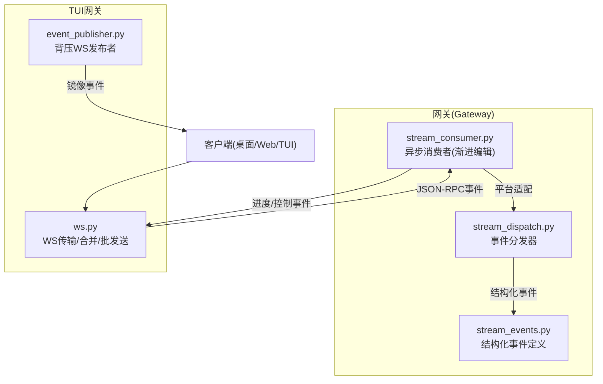
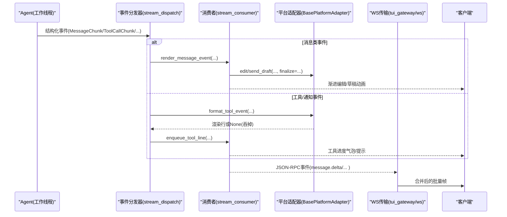
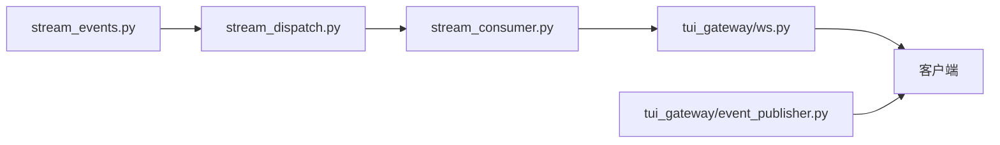
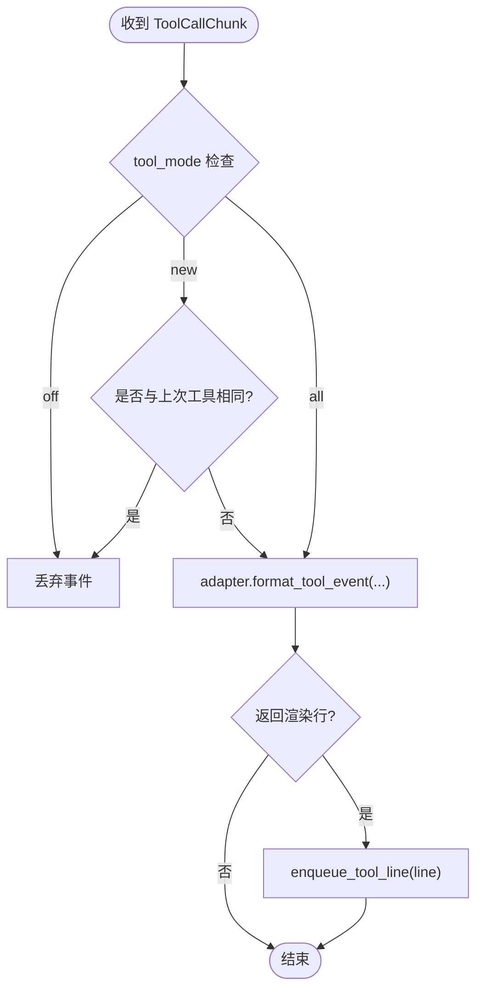
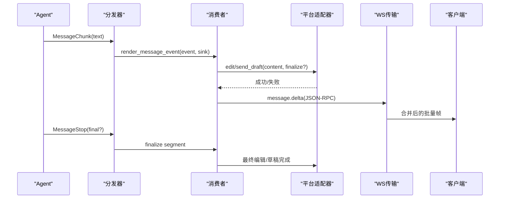

# 事件系统

<cite>
**本文引用的文件**
- [gateway/stream_events.py](file://gateway/stream_events.py)
- [gateway/stream_dispatch.py](file://gateway/stream_dispatch.py)
- [gateway/stream_consumer.py](file://gateway/stream_consumer.py)
- [tui_gateway/ws.py](file://tui_gateway/ws.py)
- [tui_gateway/event_publisher.py](file://tui_gateway/event_publisher.py)
- [apps/shared/src/json-rpc-gateway.ts](file://apps/shared/src/json-rpc-gateway.ts)
</cite>

## 目录
1. [简介](#简介)
2. [项目结构](#项目结构)
3. [核心组件](#核心组件)
4. [架构总览](#架构总览)
5. [详细组件分析](#详细组件分析)
6. [依赖关系分析](#依赖关系分析)
7. [性能考量](#性能考量)
8. [故障排查指南](#故障排查指南)
9. [结论](#结论)
10. [附录](#附录)

## 简介
本文件面向 WebSocket 事件系统，聚焦以下目标：
- 事件类型定义、事件发布/订阅机制与处理流程
- GatewayEvent 接口、事件名称枚举与事件载荷结构
- 流式事件处理、批量事件发送与事件过滤机制
- 事件监听器注册、事件路由与错误传播
- 事件处理示例、自定义事件开发与调试技巧

该系统的核心思想是“结构化事件 + 适配器渲染”：上游（Agent）只负责产生稳定的、与平台无关的领域事件；Gateway 负责将这些事件路由到具体平台并决定如何呈现。WebSocket 层则提供低延迟、可合并的高频帧传输能力，确保 UI/TUI/Web 客户端获得流畅的实时体验。

## 项目结构
围绕事件系统的代码主要分布在 gateway 与 tui_gateway 两个子系统中：
- gateway 侧：定义结构化事件、将事件分发到平台适配器、消费并渐进式编辑消息
- tui_gateway 侧：提供 WebSocket 传输、JSON-RPC 事件广播、高频 token 帧合并与批发送

**图表来源**
- [gateway/stream_events.py:1-172](file://gateway/stream_events.py#L1-L172)
- [gateway/stream_dispatch.py:1-133](file://gateway/stream_dispatch.py#L1-L133)
- [gateway/stream_consumer.py:156-800](file://gateway/stream_consumer.py#L156-L800)
- [tui_gateway/ws.py:70-256](file://tui_gateway/ws.py#L70-L256)
- [tui_gateway/event_publisher.py:40-127](file://tui_gateway/event_publisher.py#L40-L127)

**章节来源**
- [gateway/stream_events.py:1-172](file://gateway/stream_events.py#L1-L172)
- [gateway/stream_dispatch.py:1-133](file://gateway/stream_dispatch.py#L1-L133)
- [gateway/stream_consumer.py:156-800](file://gateway/stream_consumer.py#L156-L800)
- [tui_gateway/ws.py:70-256](file://tui_gateway/ws.py#L70-L256)
- [tui_gateway/event_publisher.py:40-127](file://tui_gateway/event_publisher.py#L40-L127)

## 核心组件
- 结构化事件模型：在 gateway/stream_events.py 中定义，包含助手文本增量、工具调用、通知等事件类型，保证跨线程安全与无平台知识。
- 事件分发器：在 gateway/stream_dispatch.py 中实现，按事件类型路由到平台适配器或队列，支持“仅新工具变更”去重模式。
- 异步消费者：在 gateway/stream_consumer.py 中实现，将同步回调转换为异步任务，进行缓冲、限速、渐进式编辑、草稿流式传输与最终交付。
- WebSocket 传输：在 tui_gateway/ws.py 中实现，对高频 token 帧进行合并与批发送，保障顺序与低延迟。
- 背压发布者：在 tui_gateway/event_publisher.py 中实现，通过队列+守护线程将事件镜像到 Dashboard 的 /api/events。

**章节来源**
- [gateway/stream_events.py:41-159](file://gateway/stream_events.py#L41-L159)
- [gateway/stream_dispatch.py:40-133](file://gateway/stream_dispatch.py#L40-L133)
- [gateway/stream_consumer.py:156-800](file://gateway/stream_consumer.py#L156-L800)
- [tui_gateway/ws.py:70-256](file://tui_gateway/ws.py#L70-L256)
- [tui_gateway/event_publisher.py:40-127](file://tui_gateway/event_publisher.py#L40-L127)

## 架构总览
下图展示了从 Agent 到平台展示的全链路：Agent 产生结构化事件，经由分发器路由到适配器；消息类事件进入消费者进行渐进式编辑；工具与通知事件由分发器或消费者驱动 UI 更新；WebSocket 层负责将高频事件合并后推送给客户端。

**图表来源**
- [gateway/stream_dispatch.py:88-133](file://gateway/stream_dispatch.py#L88-L133)
- [gateway/stream_consumer.py:156-800](file://gateway/stream_consumer.py#L156-L800)
- [tui_gateway/ws.py:118-226](file://tui_gateway/ws.py#L118-L226)

## 详细组件分析

### 事件类型与载荷结构
- 助手文本事件
  - MessageChunk：增量文本片段，用于逐步渲染
  - MessageStop：段落结束标记，final=True 表示整轮结束
  - Commentary：完整的中间评论文本，作为独立消息呈现
- 工具调用事件
  - ToolCallChunk：工具开始或状态变化，携带 tool_name、preview、args、index
  - ToolCallFinished：工具完成，携带 duration、ok、index
- 网关控制/生命周期事件
  - LongToolHint：长运行工具的引导提示
  - GatewayNotice：网关级通知（如 restart/online/long_run），含 kind、text、extra

这些事件为不可变数据类，便于跨线程传递且无副作用。

**章节来源**
- [gateway/stream_events.py:41-159](file://gateway/stream_events.py#L41-L159)

### 事件分发器（GatewayEventDispatcher）
职责：
- 接收结构化事件并按类型路由
- 消息类事件交由适配器渲染并送入消费者
- 工具事件根据 tool_mode 进行去重（new 模式仅在新工具时上报）
- 长工具与通知事件通过钩子回调交给网关决策是否展示

关键行为：
- dispatch() 包裹异常，确保不会中断 Agent 工作线程
- _dispatch() 使用 isinstance 分支处理不同事件类型
- 工具事件可通过 adapter.format_tool_event 返回 None 以“吃掉”事件

**章节来源**
- [gateway/stream_dispatch.py:40-133](file://gateway/stream_dispatch.py#L40-L133)

### 异步消费者（GatewayStreamConsumer）
职责：
- 将同步回调 on_delta 转为异步任务 run()
- 缓冲、限速、渐进式编辑消息，支持原生草稿流式传输
- 维护分段状态、溢出拆分、最终交付一致性
- 过滤思考标签（think/reasoning），避免泄露推理内容
- 提供 flush_pending_sync 屏障，确保阻塞交互前已送达

关键行为：
- run() 循环读取队列，选择 draft/edit 两种传输策略
- _filter_and_accumulate 处理 think 标签边界，丢弃内部内容
- has_delivered_text/delivered_final_matches 防止重复发送最终答案
- on_segment_break/on_commentary 管理消息段边界

**章节来源**
- [gateway/stream_consumer.py:156-800](file://gateway/stream_consumer.py#L156-L800)

### WebSocket 传输与合并（WSTransport）
职责：
- 提供线程安全的 write()，支持从任意线程写入
- 对高频 token 帧（message.delta/reasoning.delta/thinking.delta）进行合并
- 非流式帧会先清空缓冲区，保证顺序不越界
- 关闭连接时清理定时器与锁，记录统计指标

关键行为：
- _is_streaming_frame 识别可合并帧类型
- write() 内判断是否在事件循环线程，避免死锁
- _flush_tokens 定时批量发送，约 30fps
- write_async() 从循环线程发送，等待帧上链

**章节来源**
- [tui_gateway/ws.py:70-256](file://tui_gateway/ws.py#L70-L256)

### 背压发布者（WsPublisherTransport）
职责：
- 将 PTY 侧 gateway 的事件镜像到 Dashboard 的 /api/events
- 使用队列+守护线程 best-effort 发送，失败即短路后续写入
- 关闭时停止工作线程并尝试关闭 WS

关键行为：
- write() 序列化 JSON 入队，满队则丢弃
- _drain() 循环取出并发送，捕获异常置 dead
- close() 发送停止信号并 join 线程

**章节来源**
- [tui_gateway/event_publisher.py:40-127](file://tui_gateway/event_publisher.py#L40-L127)

### GatewayEvent 接口与前端契约
前端共享库定义了 GatewayEvent 泛型接口，用于承载事件名与载荷，供桌面端与 Web 端统一解析。后端通过 JSON-RPC event 方法推送事件，客户端据此订阅与处理。

**章节来源**
- [apps/shared/src/json-rpc-gateway.ts:25-25](file://apps/shared/src/json-rpc-gateway.ts#L25-L25)

## 依赖关系分析
- stream_events.py 被 stream_dispatch.py 导入，作为事件类型来源
- stream_dispatch.py 依赖 BasePlatformAdapter 的渲染钩子，将事件转化为平台可见内容
- stream_consumer.py 依赖 BasePlatformAdapter 的消息编辑/草稿能力，并可选地触发 on_new_message/on_before_finalize
- tui_gateway/ws.py 与 server.py 协作，将 JSON-RPC 事件转发给已注册的传输对象
- tui_gateway/event_publisher.py 独立于主 WS 会话，提供后台镜像通道

**图表来源**
- [gateway/stream_events.py:1-172](file://gateway/stream_events.py#L1-L172)
- [gateway/stream_dispatch.py:1-133](file://gateway/stream_dispatch.py#L1-L133)
- [gateway/stream_consumer.py:156-800](file://gateway/stream_consumer.py#L156-L800)
- [tui_gateway/ws.py:70-256](file://tui_gateway/ws.py#L70-L256)
- [tui_gateway/event_publisher.py:40-127](file://tui_gateway/event_publisher.py#L40-L127)

**章节来源**
- [gateway/stream_events.py:1-172](file://gateway/stream_events.py#L1-L172)
- [gateway/stream_dispatch.py:1-133](file://gateway/stream_dispatch.py#L1-L133)
- [gateway/stream_consumer.py:156-800](file://gateway/stream_consumer.py#L156-L800)
- [tui_gateway/ws.py:70-256](file://tui_gateway/ws.py#L70-L256)
- [tui_gateway/event_publisher.py:40-127](file://tui_gateway/event_publisher.py#L40-L127)

## 性能考量
- 高频 token 帧合并：WS 层对 message.delta/reasoning.delta/thinking.delta 进行合并，降低事件循环唤醒次数，提升吞吐
- 批发送顺序保证：非流式帧会先清空缓冲区再发送，确保顺序不被打乱
- 自适应编辑间隔：消费者根据平台限制与失败情况调整编辑频率，避免速率限制
- 背压与丢包：发布者使用固定大小队列，满队时丢弃，避免阻塞 Agent 主循环
- 草稿流式传输：优先使用原生草稿减少频繁编辑，失败自动降级为编辑路径

[本节为通用性能讨论，不直接分析具体文件]

## 故障排查指南
常见问题与定位要点：
- 事件未到达客户端
  - 检查 WS 连接状态与 peer 日志，确认 handle_ws 接受连接并发送 ready 事件
  - 查看 WSTransport.write/write_async 返回值与关闭标志
- 流式卡顿或丢失
  - 确认 _STREAMING_EVENT_TYPES 是否覆盖所有高频事件
  - 检查 _flush_tokens 定时器是否被取消或事件循环停滞
- 最终答案重复发送
  - 核对 delivered_final_matches 与 has_delivered_text 的判断逻辑
  - 关注多消息溢出时的 _turn_split_delivery 与 _stream_ledger 记录
- 工具进度不显示或被吞掉
  - 检查 tool_mode 是否为 off/new，以及 adapter.format_tool_event 是否返回 None
- 思考标签泄露
  - 验证 _filter_and_accumulate 是否正确识别 open/close 标签边界
  - 确认 _strip_orphan_close_tags 清理了孤立闭合标签

**章节来源**
- [tui_gateway/ws.py:286-477](file://tui_gateway/ws.py#L286-L477)
- [gateway/stream_consumer.py:614-758](file://gateway/stream_consumer.py#L614-L758)
- [gateway/stream_dispatch.py:88-133](file://gateway/stream_dispatch.py#L88-L133)

## 结论
本事件系统通过“结构化事件 + 适配器渲染 + 异步消费者 + WS 合并”的分层设计，实现了高内聚、低耦合的实时通信能力。Agent 专注业务语义，Gateway 专注呈现与路由，WS 层保障低延迟与顺序性。扩展新事件或平台时，只需遵循事件契约与适配器接口，即可无缝接入。

[本节为总结性内容，不直接分析具体文件]

## 附录

### 事件处理流程图（工具调用）

**图表来源**
- [gateway/stream_dispatch.py:101-114](file://gateway/stream_dispatch.py#L101-L114)

### 流式事件处理序列图（助手文本）

**图表来源**
- [gateway/stream_dispatch.py:96-99](file://gateway/stream_dispatch.py#L96-L99)
- [gateway/stream_consumer.py:760-800](file://gateway/stream_consumer.py#L760-L800)
- [tui_gateway/ws.py:118-226](file://tui_gateway/ws.py#L118-L226)

### 事件监听器注册与路由
- 事件监听器注册：通过适配器实现 render_message_event/format_tool_event 钩子，或由消费者回调 on_new_message/on_before_finalize 注入
- 事件路由：分发器依据事件类型选择消息路径或工具路径；消费者根据传输策略选择草稿或编辑
- 错误传播：分发器捕获异常并记录日志；消费者在回调中吞错以保证稳定性；WS 层记录发送失败并关闭连接

**章节来源**
- [gateway/stream_dispatch.py:88-133](file://gateway/stream_dispatch.py#L88-L133)
- [gateway/stream_consumer.py:371-384](file://gateway/stream_consumer.py#L371-L384)
- [tui_gateway/ws.py:228-247](file://tui_gateway/ws.py#L228-L247)

### 自定义事件开发建议
- 新增事件类型：在 stream_events.py 中添加新的 dataclass，并在 StreamEvent 联合类型中注册
- 分发逻辑：在 stream_dispatch.py 的 _dispatch 中添加对应分支，决定路由到消息路径、工具路径或钩子
- 消费者处理：如需渐进展示，可在 stream_consumer.py 中增加对应处理逻辑与 UI 反馈
- WS 事件：如需前端直推，可在 WS 层添加对应 JSON-RPC event 方法，并确保客户端订阅

[本节为概念性指导，不直接分析具体文件]

### 调试技巧
- 启用详细日志：观察 stream_events、stream_consumer、ws 的 debug/info 日志
- 监控队列长度：检查 event_publisher 的队列是否持续积压
- 断点位置：分发器入口、消费者 run() 循环、WS write()/write_async()
- 模拟故障：断开 WS、伪造慢网络、注入异常适配器，验证降级与恢复

[本节为通用调试建议，不直接分析具体文件]