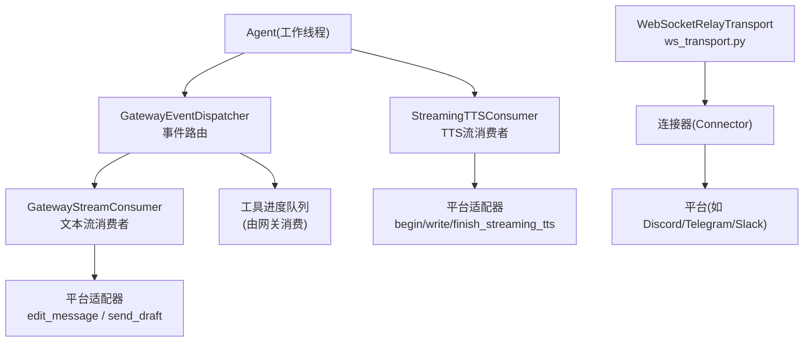
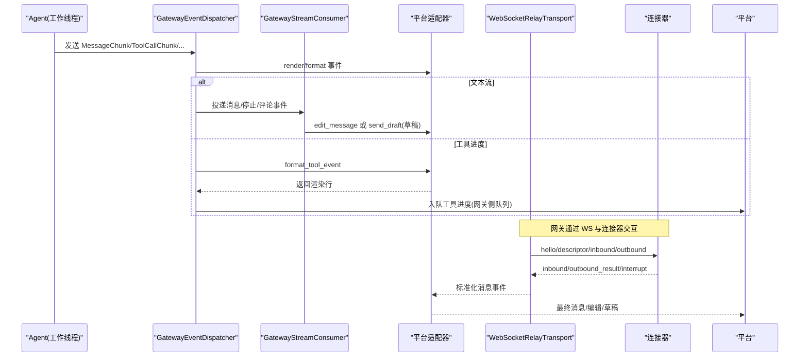
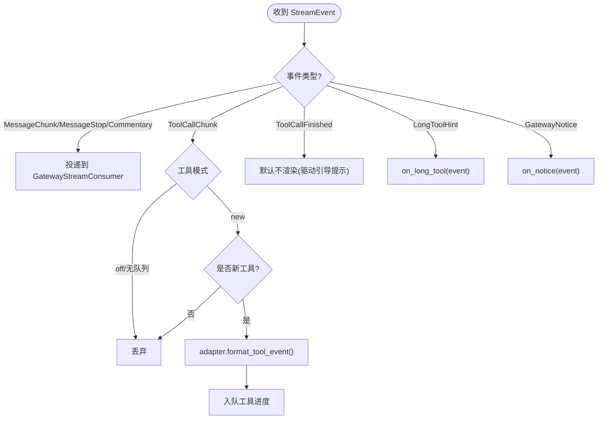
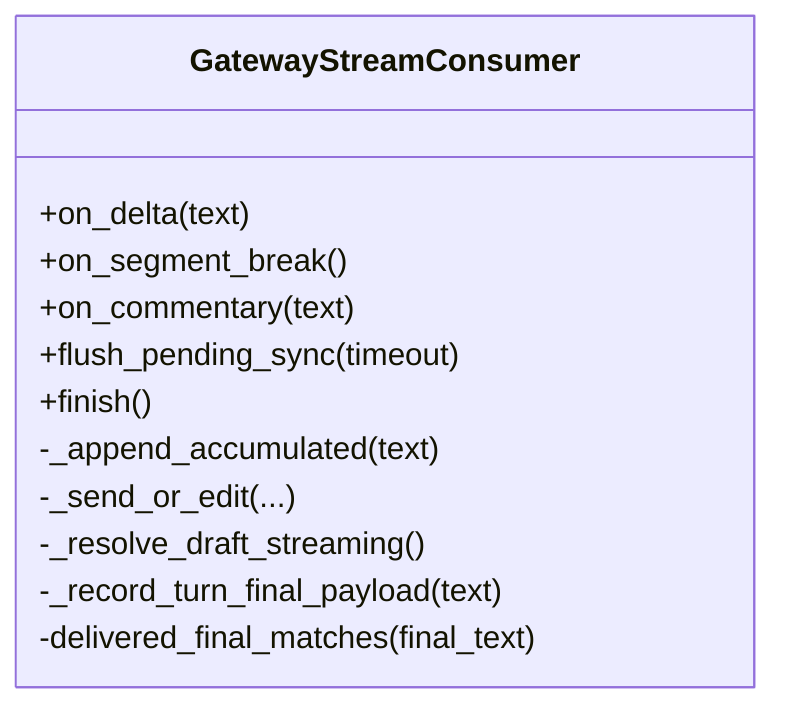
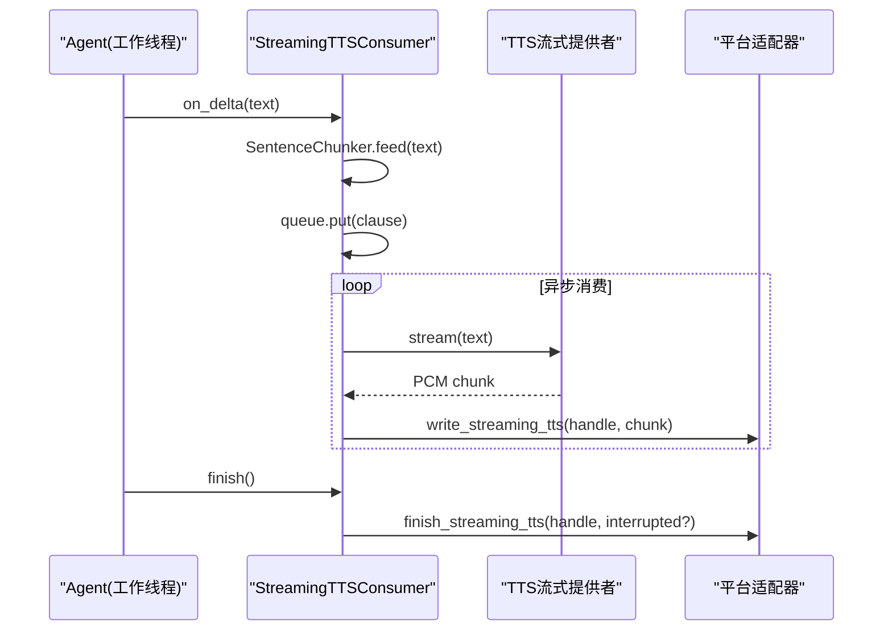
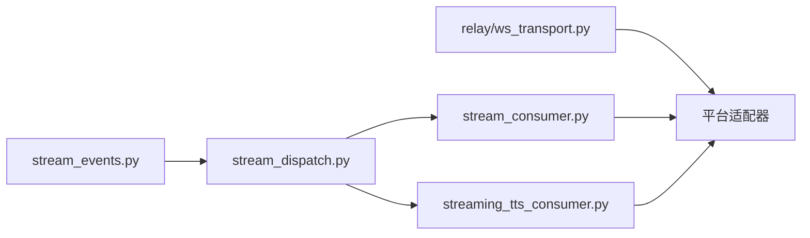

# 流式通信

<cite>
**本文引用的文件**
- [gateway/stream_consumer.py](file://gateway/stream_consumer.py)
- [gateway/stream_dispatch.py](file://gateway/stream_dispatch.py)
- [gateway/stream_events.py](file://gateway/stream_events.py)
- [gateway/relay/ws_transport.py](file://gateway/relay/ws_transport.py)
- [gateway/streaming_tts_consumer.py](file://gateway/streaming_tts_consumer.py)
</cite>

## 目录
1. [简介](#简介)
2. [项目结构](#项目结构)
3. [核心组件](#核心组件)
4. [架构总览](#架构总览)
5. [详细组件分析](#详细组件分析)
6. [依赖关系分析](#依赖关系分析)
7. [性能与内存管理](#性能与内存管理)
8. [故障排查指南](#故障排查指南)
9. [结论](#结论)
10. [附录：API 调用示例与进度回调](#附录api-调用示例与进度回调)

## 简介
本文件面向 WebSocket 流式通信，聚焦于“增量数据分块传输、进度跟踪、状态同步、背压控制、错误恢复”等关键主题。基于仓库中的网关层实现，文档解释：
- 服务端如何以结构化事件形式将 LLM 的增量文本、工具调用进度和提示性通知推送到平台适配器；
- 客户端（平台）如何通过编辑消息或原生草稿流进行渐进式渲染；
- 跨线程与异步任务之间的队列缓冲与背压策略；
- TTS 流式音频的增量合成与播放；
- 通过 WebSocket 中继在网关与连接器之间建立可靠、可重连的实时通道。

## 项目结构
围绕流式通信的关键模块集中在 gateway 目录：
- 结构化事件定义：stream_events.py
- 事件分发器：stream_dispatch.py
- 文本流消费者（逐条编辑/草稿流）：stream_consumer.py
- 语音流消费者（TTS 增量 PCM）：streaming_tts_consumer.py
- WebSocket 中继传输（网关到连接器）：relay/ws_transport.py



图表来源
- [gateway/stream_dispatch.py:40-133](file://gateway/stream_dispatch.py#L40-L133)
- [gateway/stream_consumer.py:156-800](file://gateway/stream_consumer.py#L156-L800)
- [gateway/streaming_tts_consumer.py:55-424](file://gateway/streaming_tts_consumer.py#L55-L424)
- [gateway/relay/ws_transport.py:339-800](file://gateway/relay/ws_transport.py#L339-L800)

章节来源
- [gateway/stream_events.py:1-172](file://gateway/stream_events.py#L1-L172)
- [gateway/stream_dispatch.py:1-133](file://gateway/stream_dispatch.py#L1-L133)
- [gateway/stream_consumer.py:1-800](file://gateway/stream_consumer.py#L1-L800)
- [gateway/streaming_tts_consumer.py:1-424](file://gateway/streaming_tts_consumer.py#L1-L424)
- [gateway/relay/ws_transport.py:1-800](file://gateway/relay/ws_transport.py#L1-L800)

## 核心组件
- 结构化事件（MessageChunk/MessageStop/Commentary/ToolCallChunk/ToolCallFinished/LongToolHint/GatewayNotice）：描述“发生了什么”，不绑定具体投递方式，便于多平台适配。
- GatewayEventDispatcher：从 Agent 工作线程安全地接收事件并路由到平台适配器渲染钩子或工具进度队列。
- GatewayStreamConsumer：将增量文本累积为完整内容，按平台能力选择“原生草稿流”或“原地编辑”进行渐进式展示，支持分段、评论、溢出拆分、最终一致性校验。
- StreamingTTSConsumer：将文本切分为句子片段，流式合成 PCM 并通过适配器写入播放器，支持中断、完成、部分完成与回退策略。
- WebSocketRelayTransport：网关与连接器之间的 WebSocket 传输层，负责握手、入站解析、出站请求响应、断线重连、鉴权撤销处理、休眠唤醒等。

章节来源
- [gateway/stream_events.py:41-159](file://gateway/stream_events.py#L41-L159)
- [gateway/stream_dispatch.py:40-133](file://gateway/stream_dispatch.py#L40-L133)
- [gateway/stream_consumer.py:127-800](file://gateway/stream_consumer.py#L127-L800)
- [gateway/streaming_tts_consumer.py:55-424](file://gateway/streaming_tts_consumer.py#L55-L424)
- [gateway/relay/ws_transport.py:339-800](file://gateway/relay/ws_transport.py#L339-L800)

## 架构总览
下图展示了从 Agent 到平台用户的端到端流式路径，以及 WebSocket 中继在网关与连接器之间的作用。



图表来源
- [gateway/stream_dispatch.py:88-133](file://gateway/stream_dispatch.py#L88-L133)
- [gateway/stream_consumer.py:760-800](file://gateway/stream_consumer.py#L760-L800)
- [gateway/relay/ws_transport.py:441-541](file://gateway/relay/ws_transport.py#L441-L541)
- [gateway/relay/ws_transport.py:692-730](file://gateway/relay/ws_transport.py#L692-L730)

## 详细组件分析

### 结构化事件与事件分发
- 事件类型覆盖助手文本增量、段落结束、工具调用开始/结束、长运行提示、网关通知等。
- 分发器对工具模式（all/new/verbose/off）做去重与裁剪，避免重复刷屏。
- 分发器无平台知识，仅负责路由；渲染细节交由适配器决定。



图表来源
- [gateway/stream_dispatch.py:88-133](file://gateway/stream_dispatch.py#L88-L133)
- [gateway/stream_events.py:41-159](file://gateway/stream_events.py#L41-L159)

章节来源
- [gateway/stream_dispatch.py:40-133](file://gateway/stream_dispatch.py#L40-L133)
- [gateway/stream_events.py:1-172](file://gateway/stream_events.py#L1-L172)

### 文本流消费者（GatewayStreamConsumer）
- 线程安全 on_delta：从 Agent 工作线程接收增量文本，放入队列；异步 run 任务消费队列，按配置节流、合并、截断与发送。
- 传输策略：优先使用“原生草稿流”（如 Telegram DM），否则回退到“原地编辑”。
- 分段与评论：工具边界触发分段，保证工具进度气泡与正文气泡顺序正确。
- 溢出与最终一致性：超长内容拆分为多条消息；最终完成后对比已送达内容，避免重复发送。
- 思考标签过滤：屏蔽模型输出的推理标签，保持用户可见内容整洁。



图表来源
- [gateway/stream_consumer.py:156-800](file://gateway/stream_consumer.py#L156-L800)

章节来源
- [gateway/stream_consumer.py:127-800](file://gateway/stream_consumer.py#L127-L800)

### 流式 TTS 消费者（StreamingTTSConsumer）
- 将文本切分为句子片段，流式合成 PCM 并写入适配器；支持中断、完成、部分完成与回退。
- 队列满时丢弃片段并标记 dropped，保障整体流程不被阻塞。
- 首次可听后抑制整文件 TTS 回退，避免重复播放。



图表来源
- [gateway/streaming_tts_consumer.py:55-424](file://gateway/streaming_tts_consumer.py#L55-L424)

章节来源
- [gateway/streaming_tts_consumer.py:1-424](file://gateway/streaming_tts_consumer.py#L1-L424)

### WebSocket 中继传输（WebSocketRelayTransport）
- 连接与握手：规范化 URL，发送 hello，等待 descriptor，支持多身份声明。
- 入站处理：解析标准化消息事件，注入上下文、回复信息等。
- 出站请求：带 requestId 的请求-响应匹配，超时处理。
- 重连与鉴权撤销：非预期断开自动重连；4401 鉴权撤销后不再重连。
- 休眠与唤醒：go_idle/go_dormant 配合连接器缓冲与回放，实现 scale-to-zero。

```mermaid
sequenceDiagram
participant GW as "网关"
participant RT as "WebSocketRelayTransport"
participant CONN as "连接器"
GW->>RT : connect()
RT->>CONN : ws.connect(url)
RT->>CONN : hello(platform,botId,...)
CONN-->>RT : descriptor
RT-->>GW : handshake() 完成
GW->>RT : send_outbound(action)
RT->>CONN : outbound(requestId, action)
CONN-->>RT : outbound_result(requestId, result)
RT-->>GW : 返回结果
Note over RT,CONN : 断线后根据策略重连; 4401 视为鉴权撤销
```

图表来源
- [gateway/relay/ws_transport.py:441-541](file://gateway/relay/ws_transport.py#L441-L541)
- [gateway/relay/ws_transport.py:692-730](file://gateway/relay/ws_transport.py#L692-L730)
- [gateway/relay/ws_transport.py:731-800](file://gateway/relay/ws_transport.py#L731-L800)

章节来源
- [gateway/relay/ws_transport.py:1-800](file://gateway/relay/ws_transport.py#L1-L800)

## 依赖关系分析
- 事件解耦：stream_events.py 定义纯数据结构，stream_dispatch.py 仅做路由，降低耦合。
- 消费者抽象：GatewayStreamConsumer 与 StreamingTTSConsumer 分别处理文本与音频流，均通过适配器接口与平台解耦。
- 传输抽象：WebSocketRelayTransport 封装网络细节，上层只关心事件与结果。



图表来源
- [gateway/stream_events.py:41-159](file://gateway/stream_events.py#L41-L159)
- [gateway/stream_dispatch.py:40-133](file://gateway/stream_dispatch.py#L40-L133)
- [gateway/stream_consumer.py:156-800](file://gateway/stream_consumer.py#L156-L800)
- [gateway/streaming_tts_consumer.py:55-424](file://gateway/streaming_tts_consumer.py#L55-L424)
- [gateway/relay/ws_transport.py:339-800](file://gateway/relay/ws_transport.py#L339-L800)

章节来源
- [gateway/stream_events.py:1-172](file://gateway/stream_events.py#L1-L172)
- [gateway/stream_dispatch.py:1-133](file://gateway/stream_dispatch.py#L1-L133)
- [gateway/stream_consumer.py:1-800](file://gateway/stream_consumer.py#L1-L800)
- [gateway/streaming_tts_consumer.py:1-424](file://gateway/streaming_tts_consumer.py#L1-L424)
- [gateway/relay/ws_transport.py:1-800](file://gateway/relay/ws_transport.py#L1-L800)

## 性能与内存管理
- 队列与背压
  - 文本流：GatewayStreamConsumer 使用线程安全的 queue.Queue 缓冲增量，run 任务按时间间隔与缓冲区阈值进行节流与批量编辑，避免频繁 API 调用。
  - TTS 流：StreamingTTSConsumer 使用有界队列（maxsize=256），满时丢弃片段并标记 dropped，防止阻塞 Agent 工作线程。
- 自适应退避
  - 连续失败（如平台限流）会逐步增大编辑间隔，并在达到上限后暂时禁用渐进编辑，转为更稳健的发送策略。
- 溢出拆分与最终一致性
  - 超长内容按平台限制拆分，最终完成后比对已送达内容，避免重复发送。
- 思考标签过滤
  - 流式阶段即过滤推理标签，减少无效渲染与内存占用。
- WebSocket 重连与鉴权撤销
  - 非预期断开自动重连；鉴权撤销（4401）后停止重连，避免无效重试。

[本节提供通用指导，无需特定文件引用]

## 故障排查指南
- 文本流未更新
  - 检查 on_delta 是否被调用；确认队列是否堵塞；查看编辑器节流参数与平台限制。
  - 参考：[gateway/stream_consumer.py:590-604](file://gateway/stream_consumer.py#L590-L604)、[gateway/stream_consumer.py:760-800](file://gateway/stream_consumer.py#L760-L800)
- 工具进度不显示
  - 检查 tool_mode 是否为 off；确认 enqueue_tool_line 是否可用；查看 adapter.format_tool_event 返回值。
  - 参考：[gateway/stream_dispatch.py:101-114](file://gateway/stream_dispatch.py#L101-L114)
- TTS 无声或中断
  - 检查 supports_streaming_tts；确认 begin_streaming_tts 成功；观察 audible 标志；查看 abort 原因。
  - 参考：[gateway/streaming_tts_consumer.py:218-316](file://gateway/streaming_tts_consumer.py#L218-L316)、[gateway/streaming_tts_consumer.py:368-424](file://gateway/streaming_tts_consumer.py#L368-L424)
- WebSocket 断线或鉴权撤销
  - 关注 read_loop 异常与 close code；4401 表示鉴权撤销，不应再重连。
  - 参考：[gateway/relay/ws_transport.py:731-800](file://gateway/relay/ws_transport.py#L731-L800)

章节来源
- [gateway/stream_consumer.py:590-800](file://gateway/stream_consumer.py#L590-L800)
- [gateway/stream_dispatch.py:101-114](file://gateway/stream_dispatch.py#L101-L114)
- [gateway/streaming_tts_consumer.py:218-424](file://gateway/streaming_tts_consumer.py#L218-L424)
- [gateway/relay/ws_transport.py:731-800](file://gateway/relay/ws_transport.py#L731-L800)

## 结论
该流式通信体系通过“结构化事件 + 专用消费者 + 传输抽象”实现了高内聚、低耦合的实时推送：
- 文本流支持草稿流与原地编辑两种策略，兼顾体验与兼容性；
- TTS 流支持增量合成与播放，具备中断与回退机制；
- WebSocket 中继提供可靠的跨实例通信，支持重连与鉴权撤销；
- 背压与节流确保在高负载下系统稳定。

[本节总结性内容，无需特定文件引用]

## 附录：API 调用示例与进度回调
以下示例以“调用路径”的形式说明如何使用各组件，不直接粘贴代码。

- 文本流式对话
  - 创建消费者：构造 GatewayStreamConsumer(adapter, chat_id, config, metadata)。
  - 设置回调：将 consumer.on_delta 作为 Agent 的 stream_delta_callback。
  - 启动任务：创建 asyncio 任务运行 consumer.run()。
  - 结束流：调用 consumer.finish() 并等待任务完成。
  - 参考路径：[gateway/stream_consumer.py:156-220](file://gateway/stream_consumer.py#L156-L220)、[gateway/stream_consumer.py:760-800](file://gateway/stream_consumer.py#L760-L800)

- 工具进度回调
  - 使用 GatewayEventDispatcher 将 ToolCallChunk 转换为平台友好的进度行，并入队到网关的工具进度队列。
  - 参考路径：[gateway/stream_dispatch.py:101-114](file://gateway/stream_dispatch.py#L101-L114)

- TTS 流式播放
  - 初始化 StreamingTTSConsumer(adapter, chat_id, tts_config, loop, metadata)。
  - 设置 Agent 的 stream_delta_callback 为 consumer.on_delta。
  - 启动异步任务：consumer.start()。
  - 结束流：consumer.finish() 并等待 complete。
  - 参考路径：[gateway/streaming_tts_consumer.py:55-116](file://gateway/streaming_tts_consumer.py#L55-L116)、[gateway/streaming_tts_consumer.py:218-316](file://gateway/streaming_tts_consumer.py#L218-L316)

- WebSocket 中继通信
  - 连接：transport.connect() 并 await handshake()。
  - 发送：transport.send_outbound(action) 获取结果。
  - 重连：非预期断开自动重连；鉴权撤销（4401）后停止重连。
  - 参考路径：[gateway/relay/ws_transport.py:441-541](file://gateway/relay/ws_transport.py#L441-L541)、[gateway/relay/ws_transport.py:692-730](file://gateway/relay/ws_transport.py#L692-L730)、[gateway/relay/ws_transport.py:731-800](file://gateway/relay/ws_transport.py#L731-L800)

章节来源
- [gateway/stream_consumer.py:156-800](file://gateway/stream_consumer.py#L156-L800)
- [gateway/stream_dispatch.py:101-114](file://gateway/stream_dispatch.py#L101-L114)
- [gateway/streaming_tts_consumer.py:55-316](file://gateway/streaming_tts_consumer.py#L55-L316)
- [gateway/relay/ws_transport.py:441-800](file://gateway/relay/ws_transport.py#L441-L800)