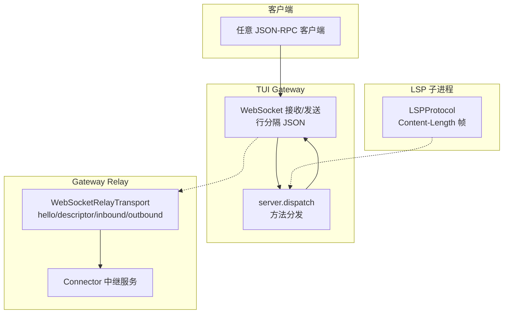
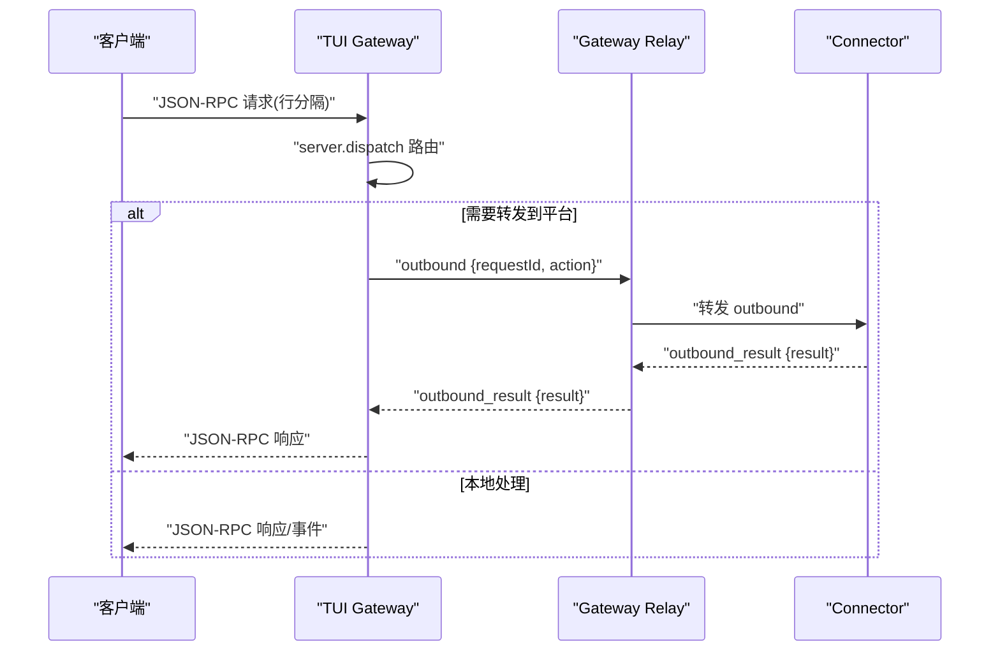
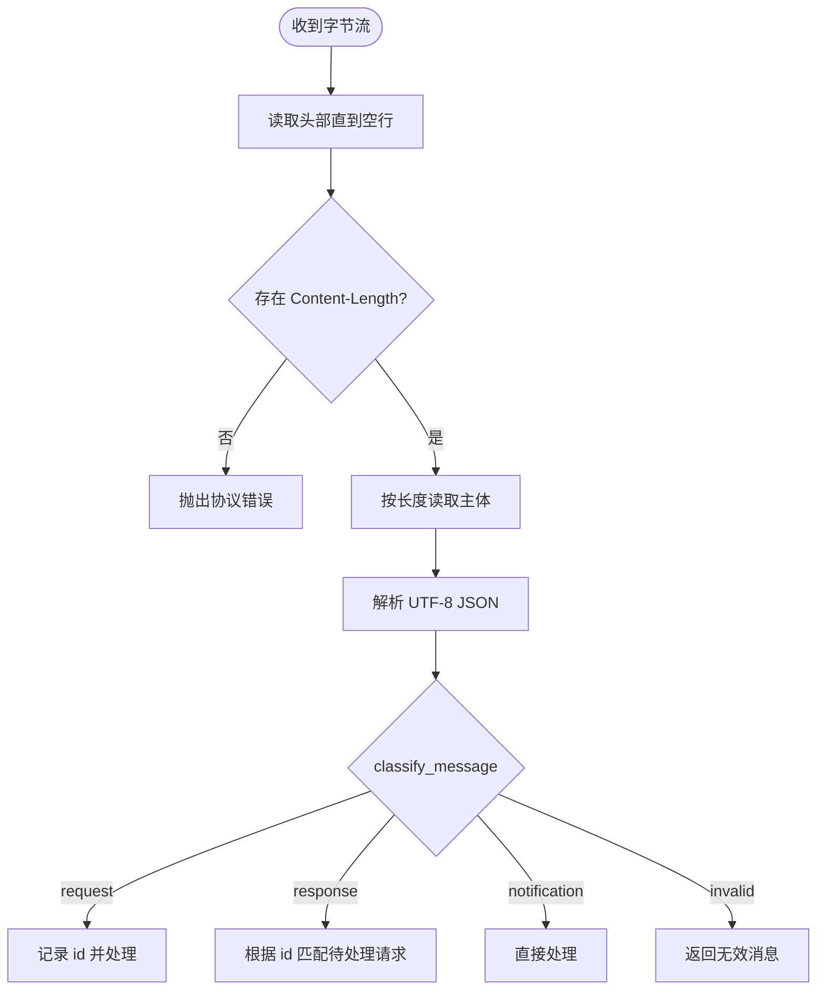
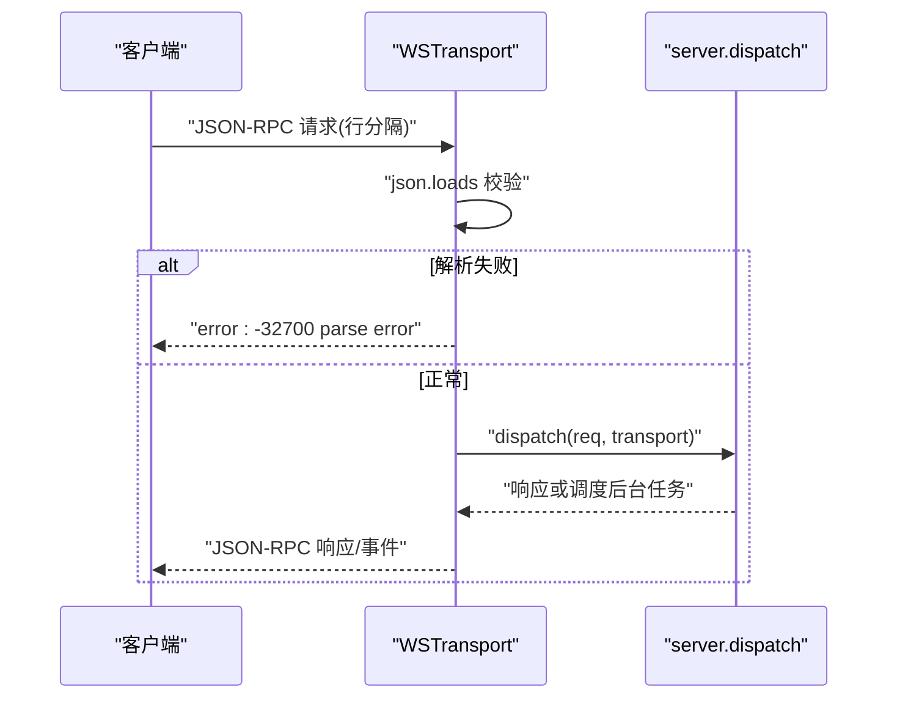
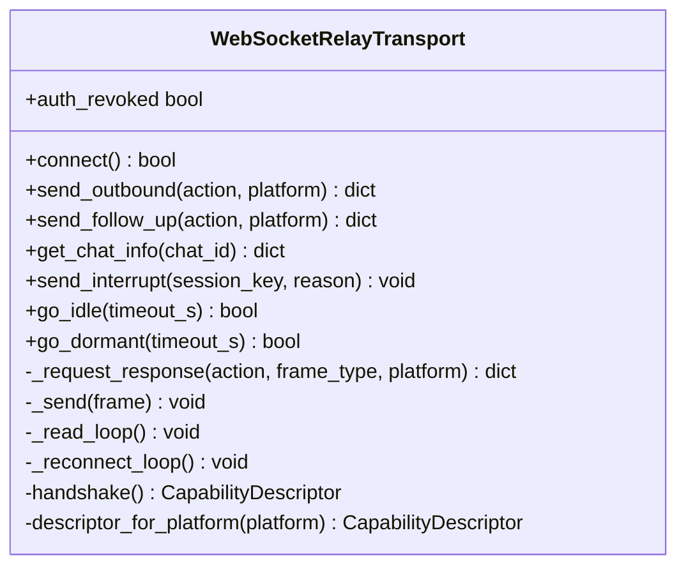
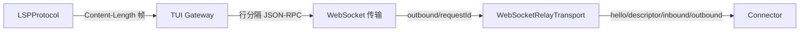

# 消息格式

<cite>
**本文引用的文件**
- [agent/lsp/protocol.py](file://agent/lsp/protocol.py)
- [tui_gateway/ws.py](file://tui_gateway/ws.py)
- [gateway/relay/ws_transport.py](file://gateway/relay/ws_transport.py)
- [agent/copilot_acp_client.py](file://agent/copilot_acp_client.py)
</cite>

## 目录
1. [简介](#简介)
2. [项目结构](#项目结构)
3. [核心组件](#核心组件)
4. [架构总览](#架构总览)
5. [详细组件分析](#详细组件分析)
6. [依赖关系分析](#依赖关系分析)
7. [性能考量](#性能考量)
8. [故障排查指南](#故障排查指南)
9. [结论](#结论)
10. [附录](#附录)

## 简介
本文件面向 WebSocket 与 JSON-RPC 2.0 的消息格式，覆盖协议规范、消息结构与数据序列化格式。重点说明：
- 请求消息格式、响应消息结构与错误消息格式
- 消息 ID 生成、请求-响应关联与异步消息处理
- 消息验证规则、数据类型定义与版本兼容性
- 消息构造示例、协议解析代码位置与调试工具使用建议

本仓库中存在三类与“JSON-RPC + WebSocket/流式传输”相关的实现：
- LSP 风格的 JSON-RPC 2.0（Content-Length 帧）
- TUI Gateway 的 WebSocket JSON-RPC（行分隔 JSON）
- Gateway Relay 的 WebSocket 自定义帧（行分隔 JSON，用于网关与连接器之间）

## 项目结构
围绕消息格式的关键模块如下：
- agent/lsp/protocol.py：实现 LSP 的 JSON-RPC 2.0 编解码、消息分类与错误封装
- tui_gateway/ws.py：实现 TUI Gateway 的 WebSocket JSON-RPC 服务端，行分隔 JSON，事件与 RPC 共用同一通道
- gateway/relay/ws_transport.py：实现 Gateway 与 Connector 之间的 WebSocket 帧协议（hello/descriptor/inbound/outbound/interrupt 等）
- agent/copilot_acp_client.py：在 ACP 客户端中构造 JSON-RPC 错误响应，体现标准字段用法

图表来源
- [tui_gateway/ws.py:286-477](file://tui_gateway/ws.py#L286-L477)
- [gateway/relay/ws_transport.py:339-800](file://gateway/relay/ws_transport.py#L339-L800)
- [agent/lsp/protocol.py:54-197](file://agent/lsp/protocol.py#L54-L197)

章节来源
- [tui_gateway/ws.py:286-477](file://tui_gateway/ws.py#L286-L477)
- [gateway/relay/ws_transport.py:339-800](file://gateway/relay/ws_transport.py#L339-L800)
- [agent/lsp/protocol.py:54-197](file://agent/lsp/protocol.py#L54-L197)

## 核心组件
- LSP JSON-RPC 2.0 编解码器
  - 负责 Content-Length 帧的编码与读取、JSON-RPC 信封构建与分类、错误响应封装
  - 提供 make_request/make_notification/make_response/make_error_response/classify_message 等工具函数
- TUI Gateway WebSocket JSON-RPC
  - 以行分隔 JSON 承载 JSON-RPC 请求/通知/响应与事件
  - 连接建立后立刻推送 gateway.ready 事件；后续所有入站请求经 server.dispatch 分发
  - 对高频 token 流进行合并缓冲，降低事件循环抖动
- Gateway Relay WebSocket 帧
  - 使用行分隔 JSON 帧，包含 hello/descriptor/inbound/outbound/outbound_result/interrupt 等
  - 通过 requestId 将 outbound 请求与 outbound_result 响应关联
  - 支持握手能力描述、认证头、断线重连、空闲/休眠模式、授权撤销检测

章节来源
- [agent/lsp/protocol.py:54-197](file://agent/lsp/protocol.py#L54-L197)
- [tui_gateway/ws.py:1-120](file://tui_gateway/ws.py#L1-L120)
- [tui_gateway/ws.py:286-477](file://tui_gateway/ws.py#L286-L477)
- [gateway/relay/ws_transport.py:1-28](file://gateway/relay/ws_transport.py#L1-L28)
- [gateway/relay/ws_transport.py:339-800](file://gateway/relay/ws_transport.py#L339-L800)

## 架构总览
下图展示三种典型路径的消息流转：
- 客户端到 TUI Gateway：行分隔 JSON-RPC，统一由 server.dispatch 处理
- TUI Gateway 到 Gateway Relay：outbound 请求携带 requestId，等待 outbound_result 响应
- LSP 子进程：Content-Length 帧包裹 JSON-RPC 2.0 信封

图表来源
- [tui_gateway/ws.py:286-477](file://tui_gateway/ws.py#L286-L477)
- [gateway/relay/ws_transport.py:692-729](file://gateway/relay/ws_transport.py#L692-L729)

章节来源
- [tui_gateway/ws.py:286-477](file://tui_gateway/ws.py#L286-L477)
- [gateway/relay/ws_transport.py:692-729](file://gateway/relay/ws_transport.py#L692-L729)

## 详细组件分析

### LSP JSON-RPC 2.0 协议（Content-Length 帧）
- 帧格式
  - 头部：Content-Length: <字节数>\r\n\r\n
  - 主体：UTF-8 编码的紧凑 JSON（无多余空白）
- 信封字段
  - jsonrpc: "2.0"
  - id: 请求标识（响应必须回显）
  - method: 方法名（请求/通知）
  - params: 参数（可选）
  - result/error: 响应体（二选一）
- 消息分类
  - 有 id 且有 method → 请求
  - 有 id 且有 result 或 error → 响应
  - 有 method 且无 id → 通知
  - 其他 → 无效
- 错误封装
  - 标准错误对象包含 code、message，可选 data
- 版本兼容
  - 严格校验 jsonrpc 为 "2.0"，否则视为无效

图表来源
- [agent/lsp/protocol.py:54-197](file://agent/lsp/protocol.py#L54-L197)

章节来源
- [agent/lsp/protocol.py:54-197](file://agent/lsp/protocol.py#L54-L197)

### TUI Gateway WebSocket JSON-RPC（行分隔 JSON）
- 传输层
  - 每行一个 JSON 文本，两端均按行解析
  - 连接建立后立即推送 gateway.ready 事件（含 skin 与 change_events）
- 请求/响应/通知
  - 遵循 JSON-RPC 2.0 信封；id 用于请求-响应关联
  - 解析失败时返回标准 parse error（code -32700）
  - 分发异常时返回 internal error（code -32603）
- 高频流优化
  - message.delta/reasoning.delta/thinking.delta 等高频 token 帧会被短时合并，避免频繁唤醒事件循环
  - 非流式帧会先冲刷 token 缓冲，保证顺序一致
- 关闭与清理
  - 连接断开时释放会话、注销传输、统计指标

图表来源
- [tui_gateway/ws.py:286-477](file://tui_gateway/ws.py#L286-L477)

章节来源
- [tui_gateway/ws.py:286-477](file://tui_gateway/ws.py#L286-L477)

### Gateway Relay WebSocket 帧（网关与连接器）
- 帧类型
  - hello：网关向连接器声明身份（platform、botId），连接器回复 descriptor
  - inbound：归一化的平台消息事件
  - outbound：发送/编辑/打字/跟进等操作，带 requestId
  - outbound_result：outbound 的响应结果
  - interrupt：中断当前会话
  - going_idle / going_idle_ack：进入仅缓冲模式与确认
  - inbound_ack：确认已持久化收到的缓冲入站事件
- 请求-响应关联
  - outbound 帧携带 requestId；outbound_result 通过相同 requestId 关联
  - 内部维护 pending 表，超时则返回错误
- 握手与能力
  - hello 后等待 descriptor，支持多平台能力描述
- 认证与鉴权
  - 可选升级头 Authorization Bearer，基于 per-gateway secret
  - 若握手成功后收到 4401 关闭码，视为授权撤销，停止重连
- 断线重连与休眠
  - 支持指数退避重连；go_dormant 配合平台 suspend 策略
  - 重新连接后连接器回放缓冲入站，保障不丢消息

图表来源
- [gateway/relay/ws_transport.py:339-800](file://gateway/relay/ws_transport.py#L339-L800)

章节来源
- [gateway/relay/ws_transport.py:339-800](file://gateway/relay/ws_transport.py#L339-L800)

### JSON-RPC 错误响应构造（ACP 客户端）
- 使用标准错误对象：{code, message, data?}
- 保持 jsonrpc 版本为 "2.0"，并回显 id
- 便于上层统一捕获与展示

章节来源
- [agent/copilot_acp_client.py:114-122](file://agent/copilot_acp_client.py#L114-L122)

## 依赖关系分析
- LSP 协议模块独立于网络栈，专注于 Content-Length 帧与信封
- TUI Gateway 复用同一 dispatch 逻辑，屏蔽底层 stdio/WebSocket 差异
- Gateway Relay 作为网关与连接器之间的可靠通道，承担握手、能力协商、请求关联、重连与鉴权
- 三者共同构成“客户端—网关—连接器—平台”的消息通路

图表来源
- [agent/lsp/protocol.py:54-197](file://agent/lsp/protocol.py#L54-L197)
- [tui_gateway/ws.py:286-477](file://tui_gateway/ws.py#L286-L477)
- [gateway/relay/ws_transport.py:339-800](file://gateway/relay/ws_transport.py#L339-L800)

章节来源
- [agent/lsp/protocol.py:54-197](file://agent/lsp/protocol.py#L54-L197)
- [tui_gateway/ws.py:286-477](file://tui_gateway/ws.py#L286-L477)
- [gateway/relay/ws_transport.py:339-800](file://gateway/relay/ws_transport.py#L339-L800)

## 性能考量
- 高频 token 合并：TUI Gateway 对 delta 类事件进行短时合并，减少事件循环唤醒次数
- 写锁与批量发送：WSTransport 使用 send_lock 保证批内顺序，避免并发写入导致乱序
- 超时控制：
  - LSP 头部大小限制与主体大小上限，防止恶意或异常报文
  - Relay outbound 请求默认超时，避免挂起
- 重连与休眠：
  - Relay 支持指数退避重连与 go_dormant，适配平台 suspend 窗口
  - 授权撤销（4401）后不再重连，避免无效重试

[本节为通用指导，无需特定文件引用]

## 故障排查指南
- 解析错误
  - TUI Gateway 在 JSON 解析失败时返回 -32700 parse error，检查客户端是否发送了合法 JSON-RPC 信封
- 分发崩溃
  - 内部错误返回 -32603 internal error，查看服务端日志定位具体方法
- 协议违规
  - LSP 端对缺失 Content-Length、非法头部、截断主体、非 UTF-8 等情况抛出协议错误
- 请求超时
  - Relay outbound 超时返回错误，检查远端是否及时返回 outbound_result
- 授权撤销
  - Relay 在握手成功后收到 4401 关闭码，视为授权撤销，不再重连；需检查密钥配置与实例状态

章节来源
- [tui_gateway/ws.py:359-418](file://tui_gateway/ws.py#L359-L418)
- [agent/lsp/protocol.py:66-129](file://agent/lsp/protocol.py#L66-L129)
- [gateway/relay/ws_transport.py:731-775](file://gateway/relay/ws_transport.py#L731-L775)

## 结论
本仓库实现了三套与 JSON-RPC 2.0 相关的高效通信方案：
- LSP 子进程间采用 Content-Length 帧，确保边界清晰与健壮解析
- TUI Gateway 通过 WebSocket 行分隔 JSON 统一承载 RPC 与事件，并对高频流做合并优化
- Gateway Relay 在网关与连接器之间提供可靠的请求-响应关联、握手能力协商、断线重连与鉴权机制

这些组件共同保证了跨平台、跨进程的消息传递一致性、可观测性与高可用。

[本节为总结性内容，无需特定文件引用]

## 附录

### 消息格式速查
- JSON-RPC 2.0 信封
  - 请求：{jsonrpc, id, method, params?}
  - 响应：{jsonrpc, id, result? | error?}
  - 通知：{jsonrpc, method, params?}
- LSP 帧
  - 头部：Content-Length: <n>\r\n\r\n
  - 主体：UTF-8 紧凑 JSON
- TUI Gateway 帧
  - 行分隔 JSON，首条为 gateway.ready 事件
- Gateway Relay 帧
  - hello/descriptor/inbound/outbound/outbound_result/interrupt/going_idle/going_idle_ack/inbound_ack

章节来源
- [agent/lsp/protocol.py:132-158](file://agent/lsp/protocol.py#L132-L158)
- [tui_gateway/ws.py:314-326](file://tui_gateway/ws.py#L314-L326)
- [gateway/relay/ws_transport.py:1-28](file://gateway/relay/ws_transport.py#L1-L28)

### 消息 ID 生成与关联
- LSP：由调用方提供 id，响应必须回显
- TUI Gateway：沿用 JSON-RPC id 进行关联
- Gateway Relay：outbound 使用随机 requestId，outbound_result 通过相同 id 关联；内部维护 pending 表并在超时后清理

章节来源
- [agent/lsp/protocol.py:132-158](file://agent/lsp/protocol.py#L132-L158)
- [tui_gateway/ws.py:389-418](file://tui_gateway/ws.py#L389-L418)
- [gateway/relay/ws_transport.py:692-729](file://gateway/relay/ws_transport.py#L692-L729)

### 消息验证规则
- LSP：严格校验 jsonrpc 版本、Content-Length、UTF-8 主体
- TUI Gateway：JSON 解析失败返回 parse error；分发异常返回 internal error
- Gateway Relay：hello/descriptor 握手；outbound 必须有 requestId；inbound 归一化为 MessageEvent；未知字段安全忽略

章节来源
- [agent/lsp/protocol.py:66-129](file://agent/lsp/protocol.py#L66-L129)
- [tui_gateway/ws.py:359-418](file://tui_gateway/ws.py#L359-L418)
- [gateway/relay/ws_transport.py:172-288](file://gateway/relay/ws_transport.py#L172-L288)

### 数据类型与版本兼容
- jsonrpc 固定为 "2.0"
- 平台枚举与消息类型在 Relay 侧做容错映射（未知类型回退为 TEXT）
- 多平台能力描述通过 descriptor 暴露，避免硬编码限制

章节来源
- [agent/lsp/protocol.py:161-180](file://agent/lsp/protocol.py#L161-L180)
- [gateway/relay/ws_transport.py:172-288](file://gateway/relay/ws_transport.py#L172-L288)
- [gateway/relay/ws_transport.py:536-553](file://gateway/relay/ws_transport.py#L536-L553)

### 消息构造示例（路径指引）
- 构造请求：见 LSP 的 make_request
- 构造通知：见 LSP 的 make_notification
- 构造成功响应：见 LSP 的 make_response
- 构造错误响应：见 LSP 的 make_error_response 与 ACP 客户端的 _jsonrpc_error
- 发送 outbound：见 Relay 的 send_outbound/_request_response

章节来源
- [agent/lsp/protocol.py:132-158](file://agent/lsp/protocol.py#L132-L158)
- [agent/copilot_acp_client.py:114-122](file://agent/copilot_acp_client.py#L114-L122)
- [gateway/relay/ws_transport.py:567-729](file://gateway/relay/ws_transport.py#L567-L729)

### 协议解析代码位置
- LSP 帧读取与解析：read_message
- TUI Gateway 接收与分发：handle_ws
- Relay 读循环与帧处理：_read_loop

章节来源
- [agent/lsp/protocol.py:66-129](file://agent/lsp/protocol.py#L66-L129)
- [tui_gateway/ws.py:286-477](file://tui_gateway/ws.py#L286-L477)
- [gateway/relay/ws_transport.py:731-775](file://gateway/relay/ws_transport.py#L731-L775)

### 调试工具使用建议
- 抓包与日志
  - 使用网络抓包工具观察 WebSocket 帧；关注 hello/descriptor/outbound/outbound_result
  - 启用服务端日志，关注 parse error、internal error、超时与 4401 关闭码
- 最小化测试
  - 先用 TUI Gateway 发送简单 RPC，验证 gateway.ready 与响应
  - 再切换到 Relay，验证 handshake 与 outbound 关联
- 常见问题
  - 解析错误：检查 JSON 合法性与信封字段
  - 超时：检查远端是否及时返回结果
  - 授权撤销：检查 per-gateway secret 与实例状态

[本节为通用指导，无需特定文件引用]