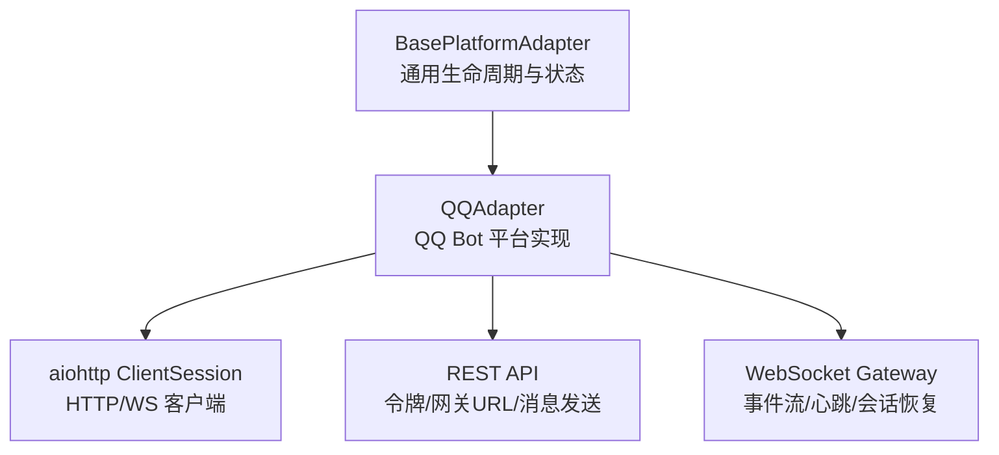
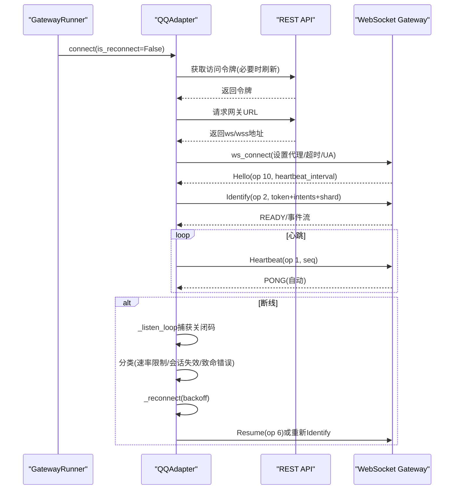
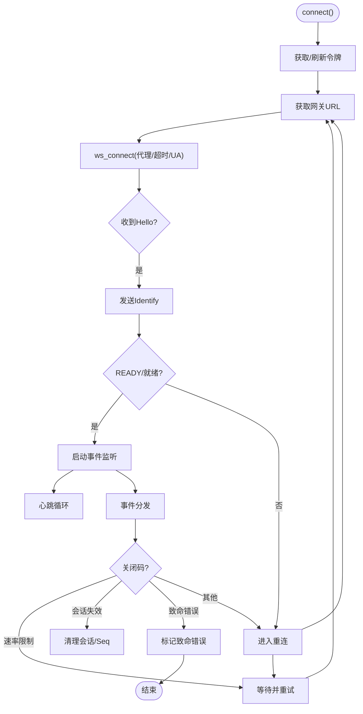
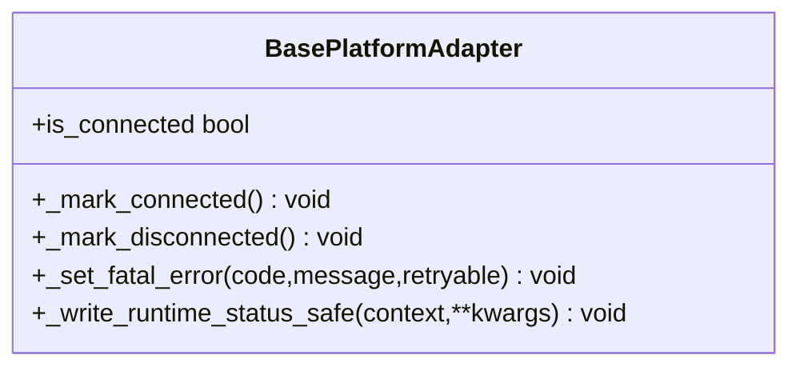
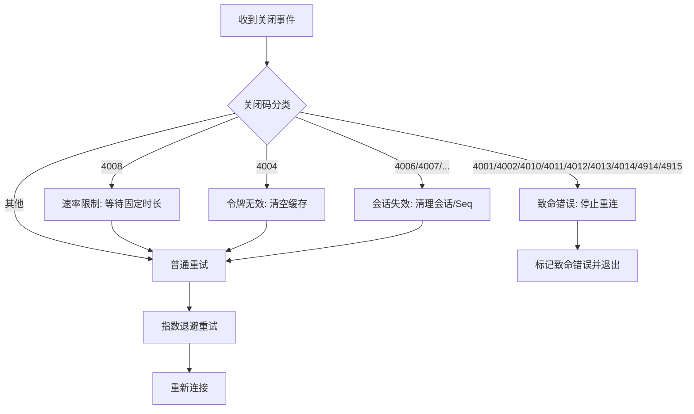
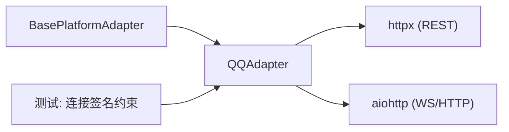
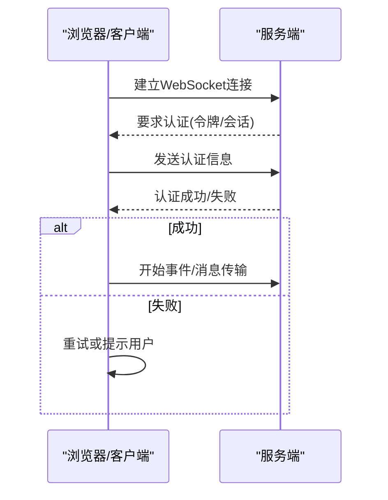

# 连接管理

<cite>
**本文引用的文件**
- [gateway/platforms/base.py](file://gateway/platforms/base.py)
- [gateway/platforms/qqbot/adapter.py](file://gateway/platforms/qqbot/adapter.py)
- [tests/gateway/test_adapter_connect_is_reconnect_contract.py](file://tests/gateway/test_adapter_connect_is_reconnect_contract.py)
</cite>

## 目录
1. [简介](#简介)
2. [项目结构](#项目结构)
3. [核心组件](#核心组件)
4. [架构总览](#架构总览)
5. [详细组件分析](#详细组件分析)
6. [依赖关系分析](#依赖关系分析)
7. [性能考量](#性能考量)
8. [故障排除指南](#故障排除指南)
9. [结论](#结论)
10. [附录](#附录)

## 简介
本文件聚焦于 WebSocket 连接管理，覆盖连接建立、认证机制与生命周期管理。重点说明平台适配器（以 QQ Bot 为例）的 connect() 流程：令牌获取与刷新、URL 构建、握手与鉴权、心跳保活、断线重连、错误分类与致命错误处理。同时给出重试策略、超时控制、状态标记与可观测性写入等实现要点，并提供配置示例、认证流程图与排障建议。

## 项目结构
- 平台适配层位于 gateway/platforms，提供统一的 BasePlatformAdapter 抽象与通用生命周期方法（连接/断开/致命错误/状态写入）。
- 具体平台实现（如 QQ Bot）在各自子模块中封装协议细节（WebSocket 握手、识别/恢复消息、心跳、事件分发）。
- 测试用例对 connect() 签名进行静态约束，确保网关重连路径能统一注入 is_reconnect 参数。

**图示来源**
- [gateway/platforms/base.py:3178-3230](file://gateway/platforms/base.py#L3178-L3230)
- [gateway/platforms/qqbot/adapter.py:485-515](file://gateway/platforms/qqbot/adapter.py#L485-L515)

**章节来源**
- [gateway/platforms/base.py:3178-3230](file://gateway/platforms/base.py#L3178-L3230)
- [gateway/platforms/qqbot/adapter.py:485-515](file://gateway/platforms/qqbot/adapter.py#L485-L515)

## 核心组件
- BasePlatformAdapter
  - 提供 _mark_connected/_mark_disconnected/_set_fatal_error 等生命周期方法，统一更新运行状态并写入运行时状态文件。
  - 暴露 is_connected 属性用于外部查询连接状态。
- QQAdapter
  - 实现 connect()、_open_ws()、_listen_loop()、_reconnect()、_heartbeat_loop()、_send_identify()、_send_resume() 等关键方法。
  - 负责令牌缓存与刷新、网关 URL 获取、WebSocket 握手、事件读取、心跳、断线重连与错误分类。

**章节来源**
- [gateway/platforms/base.py:3178-3230](file://gateway/platforms/base.py#L3178-L3230)
- [gateway/platforms/qqbot/adapter.py:309-360](file://gateway/platforms/qqbot/adapter.py#L309-L360)
- [gateway/platforms/qqbot/adapter.py:485-515](file://gateway/platforms/qqbot/adapter.py#L485-L515)
- [gateway/platforms/qqbot/adapter.py:516-715](file://gateway/platforms/qqbot/adapter.py#L516-L715)
- [gateway/platforms/qqbot/adapter.py:742-829](file://gateway/platforms/qqbot/adapter.py#L742-L829)

## 架构总览
下图展示从 connect() 到 WebSocket 握手、认证、心跳与重连的整体流程。

**图示来源**
- [gateway/platforms/qqbot/adapter.py:309-360](file://gateway/platforms/qqbot/adapter.py#L309-L360)
- [gateway/platforms/qqbot/adapter.py:485-515](file://gateway/platforms/qqbot/adapter.py#L485-L515)
- [gateway/platforms/qqbot/adapter.py:516-715](file://gateway/platforms/qqbot/adapter.py#L516-L715)
- [gateway/platforms/qqbot/adapter.py:742-829](file://gateway/platforms/qqbot/adapter.py#L742-L829)

## 详细组件分析

### QQAdapter.connect() 与连接生命周期
- 入口与职责
  - connect() 负责初始化连接所需资源、获取令牌、构造网关 URL、打开 WebSocket、启动监听与心跳循环，并在异常时进入重连流程。
- 令牌认证
  - 通过 REST 接口获取访问令牌；若收到无效令牌码，则清空缓存并刷新。
- URL 构建
  - 通过 REST 接口获取 WebSocket 网关地址；支持代理环境变量（WS_PROXY/HTTPS_PROXY/ALL_PROXY 等）。
- 握手与认证
  - 接收 Hello 后发送 Identify（携带 token、intents、shard），成功后进入事件流。
  - 支持 Resume 以恢复会话（session_id、seq）。
- 心跳保活
  - 基于 Hello 中的 heartbeat_interval 定时发送心跳（op 1），携带最新 seq。
- 断线与重连
  - 监听循环捕获关闭码，按策略区分致命错误、速率限制、会话失效等。
  - 使用指数退避的重试队列，达到最大尝试次数后标记断开。
- 状态管理
  - 成功连接调用 _mark_connected，失败或致命错误调用 _mark_disconnected/_set_fatal_error，并写入运行时状态。

**图示来源**
- [gateway/platforms/qqbot/adapter.py:309-360](file://gateway/platforms/qqbot/adapter.py#L309-L360)
- [gateway/platforms/qqbot/adapter.py:485-515](file://gateway/platforms/qqbot/adapter.py#L485-L515)
- [gateway/platforms/qqbot/adapter.py:516-715](file://gateway/platforms/qqbot/adapter.py#L516-L715)
- [gateway/platforms/qqbot/adapter.py:742-829](file://gateway/platforms/qqbot/adapter.py#L742-L829)

**章节来源**
- [gateway/platforms/qqbot/adapter.py:309-360](file://gateway/platforms/qqbot/adapter.py#L309-L360)
- [gateway/platforms/qqbot/adapter.py:485-515](file://gateway/platforms/qqbot/adapter.py#L485-L515)
- [gateway/platforms/qqbot/adapter.py:516-715](file://gateway/platforms/qqbot/adapter.py#L516-L715)
- [gateway/platforms/qqbot/adapter.py:742-829](file://gateway/platforms/qqbot/adapter.py#L742-L829)

### 基础类生命周期与状态写入
- _mark_connected/_mark_disconnected：设置内部运行标志，并写入运行时状态（connected/disconnected）。
- _set_fatal_error：记录致命错误码与消息，标记不可重试，并写入 fatal 状态。
- _write_runtime_status_safe：幂等且抑制重复告警的状态写入，失败时降级为调试日志。

**图示来源**
- [gateway/platforms/base.py:3178-3230](file://gateway/platforms/base.py#L3178-L3230)

**章节来源**
- [gateway/platforms/base.py:3178-3230](file://gateway/platforms/base.py#L3178-L3230)

### 连接重试策略与错误分类
- 快速断线检测：短时间内频繁断线触发告警，可能指向权限或配置问题。
- 速率限制：特定关闭码触发固定延时后重试。
- 会话失效：清理 session_id 与 seq，下次 Hello 后重新 Identify。
- 致命错误：不可恢复的错误码直接标记致命错误，停止重连。
- 退避策略：使用预定义退避序列，达到最大尝试次数后退出。

**图示来源**
- [gateway/platforms/qqbot/adapter.py:516-715](file://gateway/platforms/qqbot/adapter.py#L516-L715)

**章节来源**
- [gateway/platforms/qqbot/adapter.py:516-715](file://gateway/platforms/qqbot/adapter.py#L516-L715)

### 浏览器端与服务端握手过程（概念性说明）
- 浏览器发起 WebSocket 连接至服务端地址（ws/wss）。
- 服务端根据请求头与查询参数完成身份校验（例如令牌、会话标识）。
- 校验通过后建立双向通道，开始事件/消息传输。
- 若校验失败，服务端返回关闭码或拒绝连接，客户端需根据错误提示重试或提示用户。

[本节为概念性说明，不直接映射到具体源码文件]

## 依赖关系分析
- 适配器与基础类的耦合
  - QQAdapter 继承自 BasePlatformAdapter，复用生命周期管理与状态写入能力。
- 外部依赖
  - aiohttp：HTTP/WS 客户端，负责连接、代理、超时与消息收发。
  - httpx：用于 REST 调用（令牌、网关 URL、消息发送等）。
- 网关重连契约
  - 所有平台适配器的 connect() 必须接受 is_reconnect 关键字参数，以便网关重连器统一注入。

**图示来源**
- [gateway/platforms/base.py:3178-3230](file://gateway/platforms/base.py#L3178-L3230)
- [gateway/platforms/qqbot/adapter.py:485-515](file://gateway/platforms/qqbot/adapter.py#L485-L515)
- [tests/gateway/test_adapter_connect_is_reconnect_contract.py:1-145](file://tests/gateway/test_adapter_connect_is_reconnect_contract.py#L1-L145)

**章节来源**
- [tests/gateway/test_adapter_connect_is_reconnect_contract.py:1-145](file://tests/gateway/test_adapter_connect_is_reconnect_contract.py#L1-L145)

## 性能考量
- 连接池与会话复用
  - 使用 aiohttp.ClientSession 复用底层连接，减少握手开销；在断线时仅关闭 WS，保留 HTTP 会话以提升后续 REST 调用效率。
- 超时与代理
  - 连接超时通过 CONNECT_TIMEOUT_SECONDS 控制；代理通过环境变量注入，避免直连导致的超时或路由失败。
- 心跳间隔
  - 依据 Hello 返回的 heartbeat_interval 动态调整，保持安全阈值内发送心跳，降低网络拥塞风险。
- 快速断线保护
  - 短时间多次断线会触发告警并可能标记致命错误，避免 CPU 空转与资源耗尽。

[本节提供一般性指导，不直接分析具体文件]

## 故障排除指南
- 无法连接或频繁断线
  - 检查代理环境变量（WS_PROXY/HTTPS_PROXY/ALL_PROXY）是否正确。
  - 确认令牌是否有效，必要时清空缓存并刷新。
  - 关注快速断线告警，排查权限或配置问题。
- 速率限制
  - 遇到 4008 关闭码将触发固定延时重试；若持续受限，请降低消息频率或申请配额。
- 会话失效
  - 遇到 4006/4007/49xx 系列关闭码会清理会话与序列号，下次 Hello 后重新 Identify。
- 致命错误
  - 遇到 4001/4002/4010/4011/4012/4013/4014/4914/4915 等关闭码将标记致命错误并停止重连；需修复平台侧配置或账号状态。
- 状态写入失败
  - 运行时状态写入失败会被降级为调试日志；首次失败会以警告级别输出，便于定位磁盘或权限问题。

**章节来源**
- [gateway/platforms/qqbot/adapter.py:516-715](file://gateway/platforms/qqbot/adapter.py#L516-L715)
- [gateway/platforms/base.py:3198-3230](file://gateway/platforms/base.py#L3198-L3230)

## 结论
本项目通过 BasePlatformAdapter 统一了连接生命周期与状态管理，QQAdapter 实现了完整的 WebSocket 握手、认证、心跳与重连机制。结合严格的错误分类与退避策略，系统在弱网与平台波动下具备良好鲁棒性。遵循 is_reconnect 契约与代理/超时配置，可在多平台场景下稳定运行。

## 附录

### 连接配置示例（QQ Bot）
- 启用平台与基本参数
  - platforms.qq.enabled: true
  - platforms.qq.extra.app_id / client_secret
- 可选增强
  - markdown_support: true
  - dm_policy/group_policy: open | allowlist | disabled | pairing
  - stt.provider/model/baseUrl/apiKey（语音转文本）
- 环境变量
  - QQ_APP_ID / QQ_CLIENT_SECRET
  - QQ_STT_*（语音转文本密钥）
  - WS_PROXY / HTTPS_PROXY / ALL_PROXY（代理）

[本节为配置说明，不直接引用源码]

### 认证流程图（概念性）

[本节为概念性流程图，不直接映射到具体源码文件]