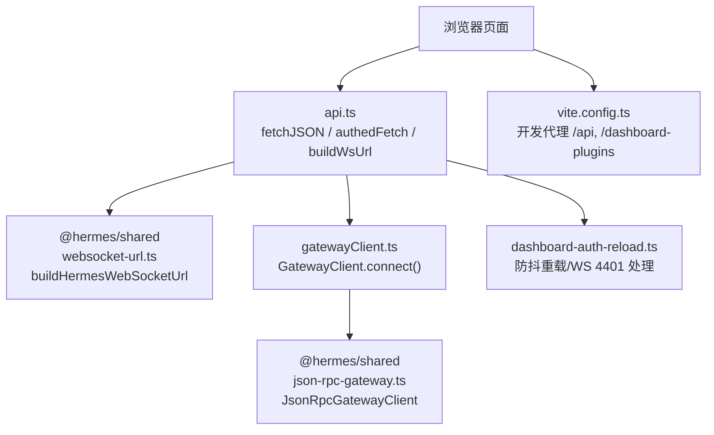
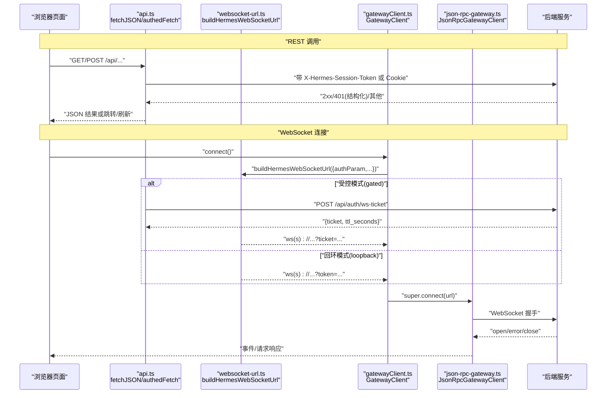
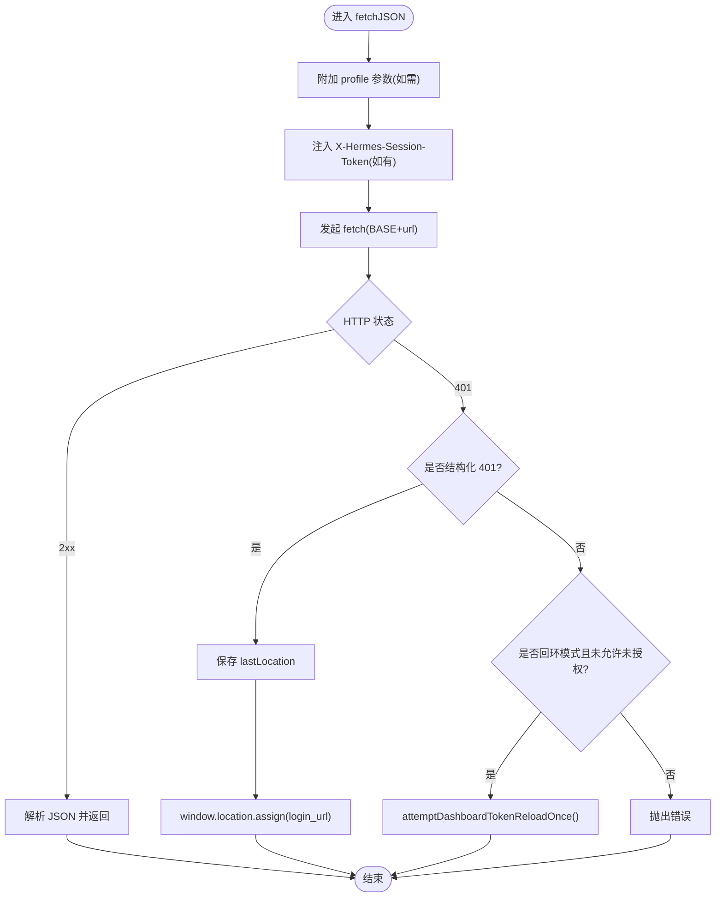
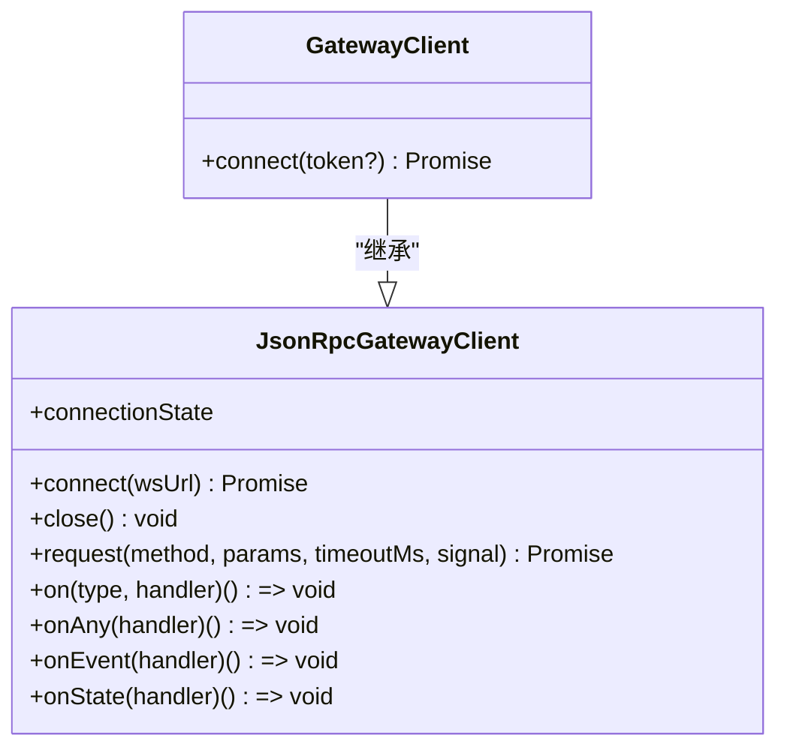
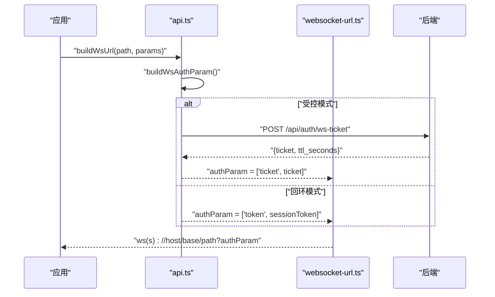
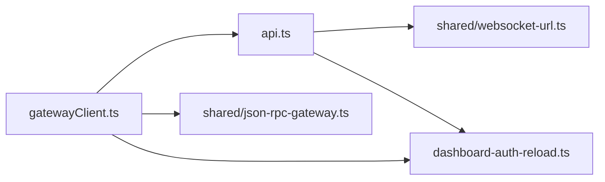

# Web 前端 SDK

<cite>
**本文引用的文件**
- [web/src/lib/api.ts](file://web/src/lib/api.ts)
- [web/src/lib/gatewayClient.ts](file://web/src/lib/gatewayClient.ts)
- [apps/shared/src/json-rpc-gateway.ts](file://apps/shared/src/json-rpc-gateway.ts)
- [apps/shared/src/websocket-url.ts](file://apps/shared/src/websocket-url.ts)
- [web/src/lib/dashboard-auth-reload.ts](file://web/src/lib/dashboard-auth-reload.ts)
- [web/vite.config.ts](file://web/vite.config.ts)
- [web/src/components/AuthWidget.tsx](file://web/src/components/AuthWidget.tsx)
</cite>

## 目录
1. [简介](#简介)
2. [项目结构](#项目结构)
3. [核心组件](#核心组件)
4. [架构总览](#架构总览)
5. [详细组件分析](#详细组件分析)
6. [依赖关系分析](#依赖关系分析)
7. [性能与优化建议](#性能与优化建议)
8. [故障排查指南](#故障排查指南)
9. [结论](#结论)
10. [附录：TypeScript 类型与 API 参考](#附录typescript-类型与-api-参考)

## 简介
本文件面向在浏览器环境中集成 Hermes Web 前端 SDK 的开发者，聚焦以下目标：
- 说明 fetchJSON 与 authedFetch 的使用方式、会话令牌管理与自动重定向机制。
- 解释 WebSocket 连接建立流程，区分“单票证认证模式”和“循环（回环）模式”。
- 提供完整的 TypeScript 类型定义说明与接口参数/返回值约定。
- 给出在 React/Vue 等框架中的集成示例思路。
- 说明跨域配置、CORS 设置与代理配置的最佳实践。
- 提供常见问题解决方案与性能优化建议。

## 项目结构
Web 前端 SDK 的核心位于 web 应用与共享库中：
- web/src/lib/api.ts：封装 HTTP 请求（fetchJSON/authedFetch）、WebSocket URL 构建、会话令牌注入、401 处理与自动刷新。
- web/src/lib/gatewayClient.ts：基于共享库 JsonRpcGatewayClient 的浏览器端 JSON-RPC WebSocket 客户端。
- apps/shared/src/json-rpc-gateway.ts：通用 JSON-RPC WebSocket 客户端实现（连接、请求、事件、超时、错误）。
- apps/shared/src/websocket-url.ts：构建 ws/wss URL、OAuth 单票证刷新、URL 规范化。
- web/src/lib/dashboard-auth-reload.ts：防止重复刷新、检测并处理回环模式下 WS 认证失败的重载逻辑。
- web/vite.config.ts：开发服务器代理、插件注入 session token、生产构建产物路径。
- web/src/components/AuthWidget.tsx：展示登录态、触发登出流程。

**图示来源**
- [web/src/lib/api.ts:102-283](file://web/src/lib/api.ts#L102-L283)
- [apps/shared/src/websocket-url.ts:135-151](file://apps/shared/src/websocket-url.ts#L135-L151)
- [web/src/lib/gatewayClient.ts:29-63](file://web/src/lib/gatewayClient.ts#L29-L63)
- [apps/shared/src/json-rpc-gateway.ts:72-220](file://apps/shared/src/json-rpc-gateway.ts#L72-L220)
- [web/src/lib/dashboard-auth-reload.ts:34-69](file://web/src/lib/dashboard-auth-reload.ts#L34-L69)
- [web/vite.config.ts:135-145](file://web/vite.config.ts#L135-L145)

**章节来源**
- [web/src/lib/api.ts:1-283](file://web/src/lib/api.ts#L1-L283)
- [apps/shared/src/json-rpc-gateway.ts:1-220](file://apps/shared/src/json-rpc-gateway.ts#L1-L220)
- [apps/shared/src/websocket-url.ts:1-151](file://apps/shared/src/websocket-url.ts#L1-L151)
- [web/src/lib/gatewayClient.ts:1-63](file://web/src/lib/gatewayClient.ts#L1-L63)
- [web/src/lib/dashboard-auth-reload.ts:1-69](file://web/src/lib/dashboard-auth-reload.ts#L1-L69)
- [web/vite.config.ts:1-148](file://web/vite.config.ts#L1-L148)

## 核心组件
- HTTP 客户端封装
  - fetchJSON：统一注入会话头、处理 401 自动跳转或回环模式下的单次刷新、返回解析后的 JSON。
  - authedFetch：返回原始 Response，用于二进制流/表单上传等场景，不抛错、不自动跳转。
- WebSocket 客户端
  - GatewayClient：继承 JsonRpcGatewayClient，负责构造 ws 地址、选择认证参数（ticket/token），管理连接生命周期。
  - JsonRpcGatewayClient：通用 JSON-RPC over WebSocket 客户端，支持请求超时、取消信号、事件分发、状态变更。
- URL 构建与认证
  - buildHermesWebSocketUrl：根据协议/主机/基础路径/查询参数构建 ws/wss URL。
  - resolveGatewayWsUrl/getWsTicket/buildWsAuthParam：在受控模式下获取一次性 ticket，或在回环模式下使用 token。
- 认证与重载
  - dashboard-auth-reload：避免重复刷新；当 WS 以特定关闭码（如 4401）断开时尝试一次全量刷新。
- 开发体验
  - vite.config.ts：开发环境代理 /api 与 /dashboard-plugins，并在 dev HTML 中注入 session token。

**章节来源**
- [web/src/lib/api.ts:102-283](file://web/src/lib/api.ts#L102-L283)
- [web/src/lib/gatewayClient.ts:29-63](file://web/src/lib/gatewayClient.ts#L29-L63)
- [apps/shared/src/json-rpc-gateway.ts:72-429](file://apps/shared/src/json-rpc-gateway.ts#L72-L429)
- [apps/shared/src/websocket-url.ts:39-94](file://apps/shared/src/websocket-url.ts#L39-L94)
- [web/src/lib/dashboard-auth-reload.ts:34-69](file://web/src/lib/dashboard-auth-reload.ts#L34-L69)
- [web/vite.config.ts:18-58](file://web/vite.config.ts#L18-L58)

## 架构总览
下图展示了浏览器到后端的完整交互链路，包括 REST 与 WebSocket 两条通道，以及两种认证模式。

**图示来源**
- [web/src/lib/api.ts:102-283](file://web/src/lib/api.ts#L102-L283)
- [apps/shared/src/websocket-url.ts:135-151](file://apps/shared/src/websocket-url.ts#L135-L151)
- [web/src/lib/gatewayClient.ts:40-61](file://web/src/lib/gatewayClient.ts#L40-L61)
- [apps/shared/src/json-rpc-gateway.ts:100-220](file://apps/shared/src/json-rpc-gateway.ts#L100-L220)

## 详细组件分析

### HTTP 客户端：fetchJSON 与 authedFetch
- 功能要点
  - 自动注入会话令牌：通过 X-Hermes-Session-Token 头携带一次性令牌（回环模式）；受控模式下依赖 Cookie。
  - 401 处理：若服务端返回结构化 401（包含 error/login_url），则保存当前路由并跳转到登录页；否则在回环模式下尝试一次全量刷新以获取新令牌。
  - 非 JSON 响应：authedFetch 返回原生 Response，供 blob/formData/stream 等场景使用，不抛错、不跳转。
  - 管理资料片作用域：对部分 /api/* 路径自动追加 ?profile=... 以限定操作范围。
- 典型用法
  - 普通 JSON 请求：调用 fetchJSON，自动处理认证与错误。
  - 文件上传/下载：调用 authedFetch，自行读取 .blob()/formData()。
  - 构建 WS URL：调用 buildWsUrl，内部会按模式决定 ticket 或 token。

**图示来源**
- [web/src/lib/api.ts:102-183](file://web/src/lib/api.ts#L102-L183)
- [web/src/lib/dashboard-auth-reload.ts:34-57](file://web/src/lib/dashboard-auth-reload.ts#L34-L57)

**章节来源**
- [web/src/lib/api.ts:102-283](file://web/src/lib/api.ts#L102-L283)
- [web/src/lib/dashboard-auth-reload.ts:1-69](file://web/src/lib/dashboard-auth-reload.ts#L1-L69)

### WebSocket 客户端：GatewayClient 与 JsonRpcGatewayClient
- 连接建立
  - GatewayClient.connect：根据 window.__HERMES_AUTH_REQUIRED__ 决定使用 ticket 还是 token；通过 buildHermesWebSocketUrl 生成 ws/wss URL；调用父类 connect。
  - JsonRpcGatewayClient.connect：校验 URL、创建 WebSocket、监听 open/error/close、设置连接超时、维护 pending 请求映射。
- 请求与事件
  - request(method, params, timeoutMs, signal)：发送 JSON-RPC 2.0 请求，支持超时与 AbortSignal 取消；收到响应或错误后清理定时器并 resolve/reject。
  - on/onAny/onEvent：订阅事件；onState：订阅连接状态变化。
- 错误与恢复
  - close：关闭 socket，拒绝所有 pending 请求。
  - handleMessage：解析消息，匹配 id 进行响应回调，或派发 event。
- 回环模式 WS 认证失败
  - onSocketClose：当关闭码为 4401 时，尝试一次全量刷新以重新注入令牌。

**图示来源**
- [apps/shared/src/json-rpc-gateway.ts:72-429](file://apps/shared/src/json-rpc-gateway.ts#L72-L429)
- [web/src/lib/gatewayClient.ts:29-63](file://web/src/lib/gatewayClient.ts#L29-L63)

**章节来源**
- [web/src/lib/gatewayClient.ts:1-63](file://web/src/lib/gatewayClient.ts#L1-L63)
- [apps/shared/src/json-rpc-gateway.ts:1-429](file://apps/shared/src/json-rpc-gateway.ts#L1-L429)

### WebSocket URL 构建与认证模式
- 受控模式（gated）
  - 通过 POST /api/auth/ws-ticket 获取一次性 ticket（TTL 短），再拼接为 ?ticket=...。
  - 适用于需要 OAuth 门控的场景，浏览器无法在 WS 升级时设置 Authorization，因此需先走 REST 换取 ticket。
- 回环模式（loopback）
  - 直接使用页面注入的 session token，拼接为 ?token=...。
- URL 构建
  - buildHermesWebSocketUrl：根据 protocol/host/basePath/path/authParam/params 组装最终 ws/wss 地址。
  - resolveGatewayWsUrl：在受控模式下优先刷新 ticket；失败时抛出 GatewayReauthRequiredError。

**图示来源**
- [web/src/lib/api.ts:202-283](file://web/src/lib/api.ts#L202-L283)
- [apps/shared/src/websocket-url.ts:39-94](file://apps/shared/src/websocket-url.ts#L39-L94)
- [apps/shared/src/websocket-url.ts:135-151](file://apps/shared/src/websocket-url.ts#L135-L151)

**章节来源**
- [web/src/lib/api.ts:202-283](file://web/src/lib/api.ts#L202-L283)
- [apps/shared/src/websocket-url.ts:1-151](file://apps/shared/src/websocket-url.ts#L1-L151)

### 认证与重载：AuthWidget 与令牌刷新
- AuthWidget：仅在受控模式下显示登录信息，并提供登出按钮；登出后导航至 /login。
- 令牌刷新：
  - fetchJSON 遇到 401 且非结构化错误时，在回环模式下尝试一次全量刷新以获取新的注入令牌。
  - WS 关闭码 4401 时，尝试一次全量刷新以恢复认证上下文。

**章节来源**
- [web/src/components/AuthWidget.tsx:1-161](file://web/src/components/AuthWidget.tsx#L1-L161)
- [web/src/lib/api.ts:123-183](file://web/src/lib/api.ts#L123-L183)
- [web/src/lib/dashboard-auth-reload.ts:34-69](file://web/src/lib/dashboard-auth-reload.ts#L34-L69)

## 依赖关系分析
- api.ts 依赖：
  - @hermes/shared 的 buildHermesWebSocketUrl。
  - dashboard-auth-reload 的防抖刷新逻辑。
  - 全局 window 变量 __HERMES_SESSION_TOKEN__/__HERMES_AUTH_REQUIRED__。
- gatewayClient.ts 依赖：
  - @hermes/shared 的 JsonRpcGatewayClient 及类型。
  - api.ts 的 HERMES_BASE_PATH 与 buildWsAuthParam。
  - dashboard-auth-reload 的 maybeReloadForLoopbackWsAuthFailure。
- shared/json-rpc-gateway.ts：
  - 纯前端实现，无外部依赖，仅依赖浏览器 WebSocket。
- shared/websocket-url.ts：
  - 纯函数式工具，依赖 window.location（可安全降级）。

**图示来源**
- [web/src/lib/api.ts:1-283](file://web/src/lib/api.ts#L1-L283)
- [web/src/lib/gatewayClient.ts:1-63](file://web/src/lib/gatewayClient.ts#L1-L63)
- [apps/shared/src/json-rpc-gateway.ts:1-429](file://apps/shared/src/json-rpc-gateway.ts#L1-L429)
- [apps/shared/src/websocket-url.ts:1-151](file://apps/shared/src/websocket-url.ts#L1-L151)
- [web/src/lib/dashboard-auth-reload.ts:1-69](file://web/src/lib/dashboard-auth-reload.ts#L1-L69)

**章节来源**
- [web/src/lib/api.ts:1-283](file://web/src/lib/api.ts#L1-L283)
- [web/src/lib/gatewayClient.ts:1-63](file://web/src/lib/gatewayClient.ts#L1-L63)
- [apps/shared/src/json-rpc-gateway.ts:1-429](file://apps/shared/src/json-rpc-gateway.ts#L1-L429)
- [apps/shared/src/websocket-url.ts:1-151](file://apps/shared/src/websocket-url.ts#L1-L151)
- [web/src/lib/dashboard-auth-reload.ts:1-69](file://web/src/lib/dashboard-auth-reload.ts#L1-L69)

## 性能与优化建议
- 请求层
  - 合理设置 requestTimeoutMs，避免长耗时请求阻塞 UI；必要时传入 AbortSignal 支持取消。
  - 批量/分页：尽量使用服务端分页与过滤，减少首屏数据量。
- WebSocket 层
  - 复用连接：避免频繁 connect/disconnect；利用 onState 监听状态变化。
  - 事件去重：对高频事件（如 message.delta）做节流/合并渲染。
- 构建与加载
  - 使用 Vite 的代码分割策略，将重型依赖拆分为独立 chunk，按需加载。
  - 开发环境使用代理转发 /api 与 /dashboard-plugins，避免 CORS 问题。
- 缓存与重试
  - 对静态资源启用强缓存；对易变数据采用短 TTL 缓存与失效策略。
  - 网络异常时实施指数退避重试，避免雪崩。

[本节为通用指导，无需具体文件引用]

## 故障排查指南
- 401 未跳转或无限刷新
  - 检查是否为结构化 401（含 login_url）；受控模式应跳转，回环模式应触发一次刷新。
  - 确认 __HERMES_AUTH_REQUIRED__ 与 __HERMES_SESSION_TOKEN__ 是否正确注入。
- WebSocket 连接失败
  - 检查 URL 协议（ws/wss）与 host/port；确保受控模式已获取有效 ticket。
  - 关注连接超时与错误事件；必要时增大 connectTimeoutMs。
- WS 关闭码 4401
  - 表示回环模式认证失败，将触发一次全量刷新；若仍失败，检查后端会话与令牌注入。
- 开发环境代理
  - 确认 vite.config.ts 中 /api 与 /dashboard-plugins 代理目标正确；确保后端服务运行正常。

**章节来源**
- [web/src/lib/api.ts:123-183](file://web/src/lib/api.ts#L123-L183)
- [web/src/lib/dashboard-auth-reload.ts:59-69](file://web/src/lib/dashboard-auth-reload.ts#L59-L69)
- [apps/shared/src/json-rpc-gateway.ts:100-220](file://apps/shared/src/json-rpc-gateway.ts#L100-L220)
- [web/vite.config.ts:135-145](file://web/vite.config.ts#L135-L145)

## 结论
本 SDK 提供了统一的 HTTP 与 WebSocket 客户端能力，内置会话令牌管理、自动重定向与错误处理，并支持受控与回环两种认证模式。通过清晰的类型定义与模块化设计，可在 React/Vue 等框架中快速集成，配合 Vite 代理与代码分割，获得良好的开发与用户体验。

[本节为总结性内容，无需具体文件引用]

## 附录：TypeScript 类型与 API 参考
- HTTP 客户端
  - fetchJSON<T>(url, init?, options?): Promise<T>
    - url：相对路径（将被 BASE 前缀拼接）
    - init：RequestInit
    - options：可选，包含 allowUnauthorized 等控制项
    - 返回：解析后的 JSON 对象
  - authedFetch(url, init?): Promise<Response>
    - 返回：原始 Response，便于读取 blob/formData/stream
  - getWsTicket(): Promise<{ ticket: string; ttl_seconds: number }>
  - buildWsAuthParam(): Promise<[string, string]>
  - buildWsUrl(path, params?): Promise<string>
- WebSocket 客户端
  - GatewayClient
    - connect(token?): Promise<void>
    - request(method, params, timeoutMs?, signal?): Promise<T>
    - on/onAny/onEvent/onState：事件与状态订阅
  - JsonRpcGatewayClient（共享库）
    - 连接状态：idle | connecting | open | closed | error
    - 事件类型：message.start/delta/complete、tool.*、status.update、error 等
    - 请求帧：{ jsonrpc: '2.0', id, method, params }
- URL 构建与认证
  - buildHermesWebSocketUrl(options): string
    - options：path, basePath?, authParam?, params?, protocol?, host?
  - resolveGatewayWsUrl(deps, conn): Promise<string>
  - isGatewayReauthRequired(error): boolean
  - GatewayReauthRequiredError：needsOauthLogin 标记
- 开发配置
  - vite.config.ts：代理 /api 与 /dashboard-plugins；dev 注入 session token；构建输出至 hermes_cli/web_dist

**章节来源**
- [web/src/lib/api.ts:102-283](file://web/src/lib/api.ts#L102-L283)
- [web/src/lib/gatewayClient.ts:29-63](file://web/src/lib/gatewayClient.ts#L29-L63)
- [apps/shared/src/json-rpc-gateway.ts:1-429](file://apps/shared/src/json-rpc-gateway.ts#L1-L429)
- [apps/shared/src/websocket-url.ts:1-151](file://apps/shared/src/websocket-url.ts#L1-L151)
- [web/vite.config.ts:18-58](file://web/vite.config.ts#L18-L58)
- [web/vite.config.ts:86-145](file://web/vite.config.ts#L86-L145)