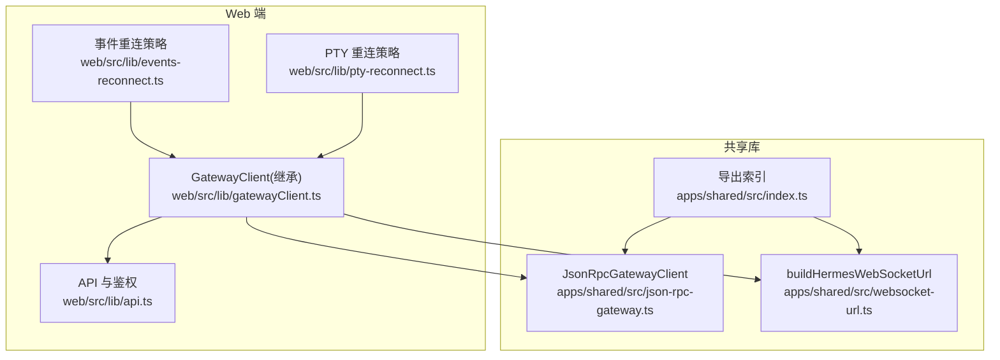
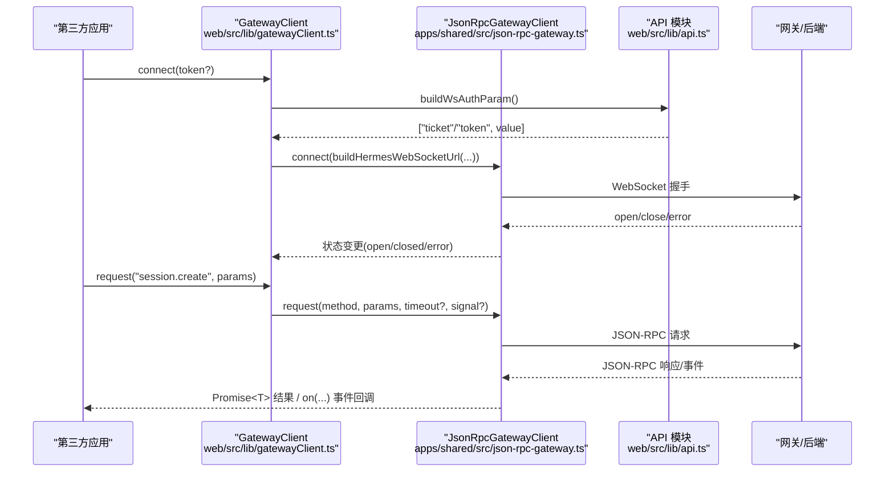
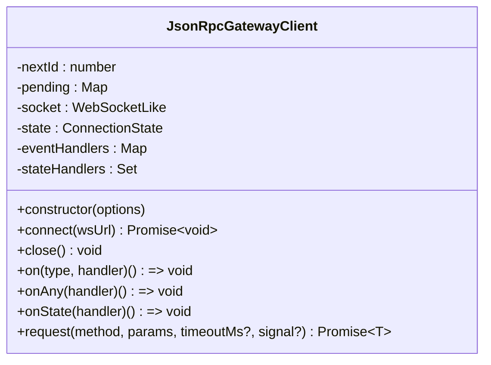
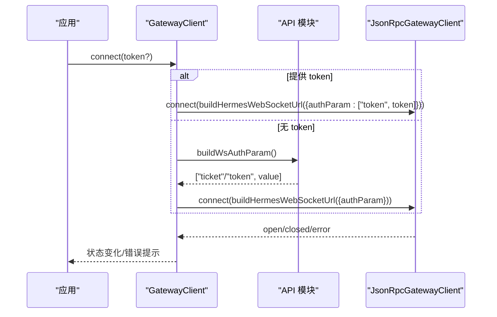
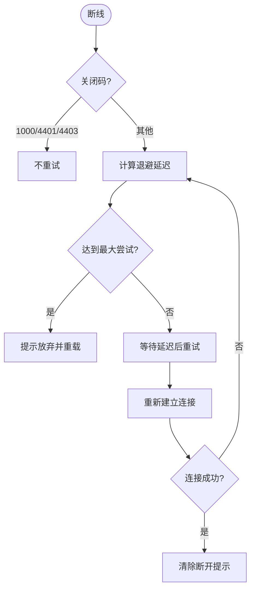
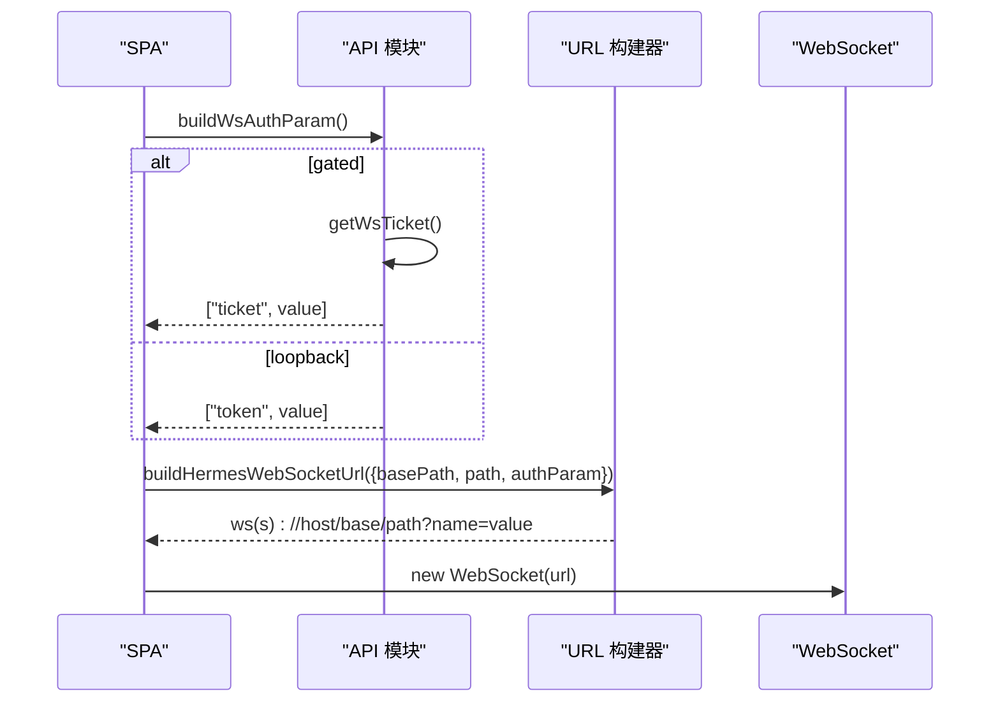
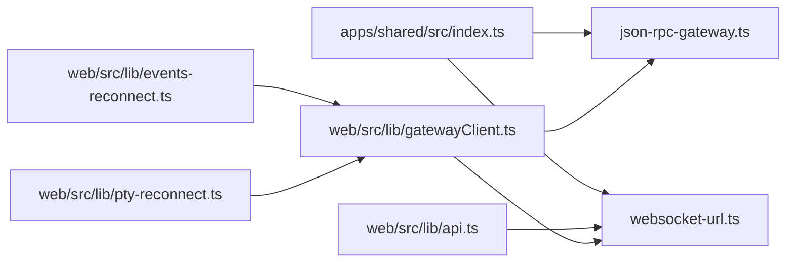

# 客户端 SDK 集成

<cite>
**本文引用的文件**
- [web/src/lib/gatewayClient.ts](file://web/src/lib/gatewayClient.ts)
- [apps/shared/src/json-rpc-gateway.ts](file://apps/shared/src/json-rpc-gateway.ts)
- [apps/shared/src/websocket-url.ts](file://apps/shared/src/websocket-url.ts)
- [apps/shared/src/index.ts](file://apps/shared/src/index.ts)
- [web/src/lib/api.ts](file://web/src/lib/api.ts)
- [web/src/lib/events-reconnect.ts](file://web/src/lib/events-reconnect.ts)
- [web/src/lib/pty-reconnect.ts](file://web/src/lib/pty-reconnect.ts)
- [web/package.json](file://web/package.json)
</cite>

## 目录
1. [简介](#简介)
2. [项目结构](#项目结构)
3. [核心组件](#核心组件)
4. [架构总览](#架构总览)
5. [详细组件分析](#详细组件分析)
6. [依赖关系分析](#依赖关系分析)
7. [性能考虑](#性能考虑)
8. [故障排查指南](#故障排查指南)
9. [结论](#结论)
10. [附录：集成模板与最佳实践](#附录集成模板与最佳实践)

## 简介
本文件面向第三方应用开发者，提供基于本仓库前端代码的“客户端 SDK 集成”完整方案。内容覆盖：
- JavaScript/TypeScript SDK 的使用方式、API 封装与错误处理机制
- WebSocket 连接管理（连接超时、关闭处理、鉴权参数）
- 请求重试与离线支持策略（指数退避、最大尝试次数、页面恢复重连）
- TypeScript 类型定义、Promise 接口与异步处理模式
- 完整的集成示例、最佳实践与性能优化建议

该方案以共享库中的 JSON-RPC 网关客户端为核心，结合 Web 端的认证与 URL 构建能力，形成可复用的 SDK 层，便于在浏览器或 Node 环境中集成。

## 项目结构
本仓库中与客户端 SDK 直接相关的代码主要位于：
- apps/shared：跨端共享的 JSON-RPC 客户端、WebSocket URL 构建工具与类型定义
- web：Web 端对共享库的扩展，包括鉴权参数获取、WebSocket URL 组装、事件与 PTY 重连策略

**图表来源**
- [apps/shared/src/json-rpc-gateway.ts:72-429](file://apps/shared/src/json-rpc-gateway.ts#L72-L429)
- [apps/shared/src/websocket-url.ts:135-151](file://apps/shared/src/websocket-url.ts#L135-L151)
- [apps/shared/src/index.ts:37-68](file://apps/shared/src/index.ts#L37-L68)
- [web/src/lib/gatewayClient.ts:29-62](file://web/src/lib/gatewayClient.ts#L29-L62)
- [web/src/lib/api.ts:102-283](file://web/src/lib/api.ts#L102-L283)
- [web/src/lib/events-reconnect.ts:9-82](file://web/src/lib/events-reconnect.ts#L9-L82)
- [web/src/lib/pty-reconnect.ts:1-87](file://web/src/lib/pty-reconnect.ts#L1-L87)

**章节来源**
- [web/src/lib/gatewayClient.ts:1-64](file://web/src/lib/gatewayClient.ts#L1-L64)
- [apps/shared/src/json-rpc-gateway.ts:1-430](file://apps/shared/src/json-rpc-gateway.ts#L1-L430)
- [apps/shared/src/websocket-url.ts:1-152](file://apps/shared/src/websocket-url.ts#L1-L152)
- [apps/shared/src/index.ts:1-69](file://apps/shared/src/index.ts#L1-L69)
- [web/src/lib/api.ts:1-283](file://web/src/lib/api.ts#L1-L283)
- [web/src/lib/events-reconnect.ts:1-83](file://web/src/lib/events-reconnect.ts#L1-L83)
- [web/src/lib/pty-reconnect.ts:1-87](file://web/src/lib/pty-reconnect.ts#L1-L87)

## 核心组件
- JsonRpcGatewayClient：实现 JSON-RPC over WebSocket 的请求/响应、事件分发、状态机、超时与中止信号支持
- GatewayClient（Web 扩展）：封装鉴权参数获取与 WebSocket URL 构建，统一连接入口
- buildHermesWebSocketUrl：根据协议、主机、基础路径、鉴权参数与额外查询参数生成 ws/wss URL
- API 模块：提供 REST 接口封装、会话令牌注入、单票证 WS 鉴权流程
- 重连策略：事件流与 PTY 通道分别提供指数退避、最大尝试次数、页面恢复触发等逻辑

**章节来源**
- [apps/shared/src/json-rpc-gateway.ts:72-429](file://apps/shared/src/json-rpc-gateway.ts#L72-L429)
- [web/src/lib/gatewayClient.ts:29-62](file://web/src/lib/gatewayClient.ts#L29-L62)
- [apps/shared/src/websocket-url.ts:135-151](file://apps/shared/src/websocket-url.ts#L135-L151)
- [web/src/lib/api.ts:102-283](file://web/src/lib/api.ts#L102-L283)
- [web/src/lib/events-reconnect.ts:9-82](file://web/src/lib/events-reconnect.ts#L9-L82)
- [web/src/lib/pty-reconnect.ts:1-87](file://web/src/lib/pty-reconnect.ts#L1-L87)

## 架构总览
下图展示了从调用方到后端网关的端到端流程：调用方通过 GatewayClient 发起连接与请求，内部使用 JsonRpcGatewayClient 进行 JSON-RPC 通信；鉴权参数由 Web API 模块动态获取并拼接到 WebSocket URL。

**图表来源**
- [web/src/lib/gatewayClient.ts:40-62](file://web/src/lib/gatewayClient.ts#L40-L62)
- [apps/shared/src/json-rpc-gateway.ts:100-220](file://apps/shared/src/json-rpc-gateway.ts#L100-L220)
- [apps/shared/src/json-rpc-gateway.ts:266-352](file://apps/shared/src/json-rpc-gateway.ts#L266-L352)
- [apps/shared/src/websocket-url.ts:135-151](file://apps/shared/src/websocket-url.ts#L135-L151)
- [web/src/lib/api.ts:218-283](file://web/src/lib/api.ts#L218-L283)

## 详细组件分析

### JsonRpcGatewayClient（JSON-RPC 客户端）
- 连接生命周期：validate URL → 创建 WebSocket → open/close/error 监听 → 状态机 idle/connecting/open/closed/error
- 请求模型：request(method, params, timeoutMs?, signal?) 返回 Promise<T>，支持 AbortSignal 取消与默认超时
- 事件模型：on(type, handler)、onAny(handler)、onState(handler)，支持任意事件名
- 错误处理：连接失败、关闭、未连接请求、请求超时、服务端 error 帧均会拒绝 Promise 或触发回调
- 可扩展点：socketFactory、createRequestId、自定义错误消息、连接/请求超时配置

**图表来源**
- [apps/shared/src/json-rpc-gateway.ts:72-429](file://apps/shared/src/json-rpc-gateway.ts#L72-L429)

**章节来源**
- [apps/shared/src/json-rpc-gateway.ts:72-429](file://apps/shared/src/json-rpc-gateway.ts#L72-L429)

### GatewayClient（Web 扩展）
- 继承 JsonRpcGatewayClient，统一错误消息前缀与请求 ID 前缀
- 连接时优先使用单票证鉴权（gated mode），否则回退为注入 token
- 使用 buildHermesWebSocketUrl 构造 ws/wss URL，自动处理 basePath 与协议

**图表来源**
- [web/src/lib/gatewayClient.ts:29-62](file://web/src/lib/gatewayClient.ts#L29-L62)
- [apps/shared/src/websocket-url.ts:135-151](file://apps/shared/src/websocket-url.ts#L135-L151)
- [web/src/lib/api.ts:218-283](file://web/src/lib/api.ts#L218-L283)

**章节来源**
- [web/src/lib/gatewayClient.ts:29-62](file://web/src/lib/gatewayClient.ts#L29-L62)
- [apps/shared/src/websocket-url.ts:135-151](file://apps/shared/src/websocket-url.ts#L135-L151)
- [web/src/lib/api.ts:218-283](file://web/src/lib/api.ts#L218-L283)

### 事件与 PTY 重连策略
- 事件流重连：指数退避（1s→2s→4s…上限 30s），最大尝试次数 15；区分正常关闭与鉴权拒绝；提供断开/重连/放弃文案
- PTY 重连：页面恢复时防抖合并重连；连接中卡死检测（8s 超时强制关闭以恢复）；输入阻塞直到连接打开

**图表来源**
- [web/src/lib/events-reconnect.ts:9-82](file://web/src/lib/events-reconnect.ts#L9-L82)
- [web/src/lib/pty-reconnect.ts:1-87](file://web/src/lib/pty-reconnect.ts#L1-L87)

**章节来源**
- [web/src/lib/events-reconnect.ts:9-82](file://web/src/lib/events-reconnect.ts#L9-L82)
- [web/src/lib/pty-reconnect.ts:1-87](file://web/src/lib/pty-reconnect.ts#L1-L87)

### 认证与 URL 构建
- 认证模式：gated 模式下通过 REST 获取一次性 ticket；loopback 模式使用注入的 session token
- URL 构建：buildHermesWebSocketUrl 自动选择 ws/wss、拼接 basePath、path 与 authParam，保证安全与一致性
- REST 封装：fetchJSON/authedFetch 统一注入会话头、处理 401 跳转与轮询刷新

**图表来源**
- [web/src/lib/api.ts:202-283](file://web/src/lib/api.ts#L202-L283)
- [apps/shared/src/websocket-url.ts:135-151](file://apps/shared/src/websocket-url.ts#L135-L151)

**章节来源**
- [web/src/lib/api.ts:202-283](file://web/src/lib/api.ts#L202-L283)
- [apps/shared/src/websocket-url.ts:135-151](file://apps/shared/src/websocket-url.ts#L135-L151)

## 依赖关系分析
- 共享库导出：类型、客户端类、URL 构建函数集中导出，供 Web 端与桌面端复用
- Web 端依赖：GatewayClient 依赖 JsonRpcGatewayClient 与 URL 构建器；API 模块负责鉴权与 REST 封装
- 重连策略：events-reconnect 与 pty-reconnect 提供纯函数式策略，便于测试与组合

**图表来源**
- [apps/shared/src/index.ts:37-68](file://apps/shared/src/index.ts#L37-L68)
- [web/src/lib/gatewayClient.ts:29-62](file://web/src/lib/gatewayClient.ts#L29-L62)
- [web/src/lib/api.ts:102-283](file://web/src/lib/api.ts#L102-L283)
- [web/src/lib/events-reconnect.ts:9-82](file://web/src/lib/events-reconnect.ts#L9-L82)
- [web/src/lib/pty-reconnect.ts:1-87](file://web/src/lib/pty-reconnect.ts#L1-L87)

**章节来源**
- [apps/shared/src/index.ts:37-68](file://apps/shared/src/index.ts#L37-L68)
- [web/src/lib/gatewayClient.ts:29-62](file://web/src/lib/gatewayClient.ts#L29-L62)
- [web/src/lib/api.ts:102-283](file://web/src/lib/api.ts#L102-L283)
- [web/src/lib/events-reconnect.ts:9-82](file://web/src/lib/events-reconnect.ts#L9-L82)
- [web/src/lib/pty-reconnect.ts:1-87](file://web/src/lib/pty-reconnect.ts#L1-L87)

## 性能考虑
- 连接超时：默认连接超时 15s，避免长时间卡在 connecting 状态；请求默认超时 120s，可按需调整
- 事件去抖：页面恢复时的 PTY 重连存在节流，防止多次事件触发导致重连风暴
- 输入阻塞：PTY 在非 open 状态下阻止输入，减少无效操作
- 网络友好：事件重连采用指数退避与最大延迟上限，降低服务器压力
- 资源释放：close 时清理所有待处理请求定时器与监听器，避免内存泄漏

[本节为通用指导，无需特定文件引用]

## 故障排查指南
- 连接失败：检查 WebSocket URL 是否合法（ws/wss）、鉴权参数是否正确（ticket/token）、反向代理 basePath 是否配置正确
- 401 未授权：gated 模式下需先获取 ticket；若 cookie 过期，REST 层会引导登录；确保 credentials: include 已启用
- 频繁断线：关注关闭码，1000 为正常关闭，4401/4403 为鉴权拒绝；其他情况按指数退避重试
- 请求超时：适当增大 requestTimeoutMs；或使用 AbortSignal 主动取消长耗时请求
- PTY 卡顿：连接超过 8s 视为卡死，将强制关闭并恢复；确认网络与代理设置

**章节来源**
- [apps/shared/src/json-rpc-gateway.ts:100-220](file://apps/shared/src/json-rpc-gateway.ts#L100-L220)
- [apps/shared/src/json-rpc-gateway.ts:266-352](file://apps/shared/src/json-rpc-gateway.ts#L266-L352)
- [web/src/lib/events-reconnect.ts:9-82](file://web/src/lib/events-reconnect.ts#L9-L82)
- [web/src/lib/pty-reconnect.ts:1-87](file://web/src/lib/pty-reconnect.ts#L1-L87)
- [web/src/lib/api.ts:102-183](file://web/src/lib/api.ts#L102-L183)

## 结论
本 SDK 以共享库的 JSON-RPC 客户端为核心，配合 Web 端的鉴权与 URL 构建能力，提供了稳定、可扩展且易于集成的前端通信层。通过统一的类型定义、Promise 接口与完善的错误处理，开发者可以快速接入后端服务，并在复杂网络环境下保持良好体验。

[本节为总结性内容，无需特定文件引用]

## 附录：集成模板与最佳实践

- 初始化与连接
  - 使用 GatewayClient 实例，调用 connect(token?)；在 gated 模式下无需传入 token，内部会自动获取 ticket
  - 监听 onState 与 on('error')，处理连接状态与错误提示

- 发送请求
  - 使用 request(method, params, timeoutMs?, signal?) 发送 JSON-RPC 请求，返回 Promise<T>
  - 对于长耗时请求，传入 AbortSignal 以便取消；合理设置超时时间

- 订阅事件
  - 使用 on(type, handler) 订阅具体事件；使用 onAny(handler) 捕获所有事件
  - 注意在组件卸载时移除监听器，避免内存泄漏

- 重连与离线
  - 事件流：使用 events-reconnect 提供的退避与最大尝试次数策略
  - PTY：使用 pty-reconnect 的策略，结合页面可见性与在线状态触发重连
  - 用户反馈：根据策略输出断开/重连/放弃提示，提升用户体验

- 认证与 URL
  - 始终通过 buildWsAuthParam 与 buildHermesWebSocketUrl 构建连接参数，避免硬编码
  - 确保 basePath 与协议正确，特别是在反向代理与 HTTPS 场景

- 性能优化
  - 合理设置连接与请求超时，避免长时间阻塞
  - 使用节流与去抖减少重连风暴
  - 及时清理定时器与监听器，避免内存泄漏

- 类型与异步
  - 充分利用 TypeScript 类型定义，提高开发体验与安全性
  - 使用 async/await 与 Promise 链式调用，保持代码清晰

**章节来源**
- [web/src/lib/gatewayClient.ts:29-62](file://web/src/lib/gatewayClient.ts#L29-L62)
- [apps/shared/src/json-rpc-gateway.ts:72-429](file://apps/shared/src/json-rpc-gateway.ts#L72-L429)
- [apps/shared/src/websocket-url.ts:135-151](file://apps/shared/src/websocket-url.ts#L135-L151)
- [web/src/lib/api.ts:202-283](file://web/src/lib/api.ts#L202-L283)
- [web/src/lib/events-reconnect.ts:9-82](file://web/src/lib/events-reconnect.ts#L9-L82)
- [web/src/lib/pty-reconnect.ts:1-87](file://web/src/lib/pty-reconnect.ts#L1-L87)
- [web/package.json:17-18](file://web/package.json#L17-L18)