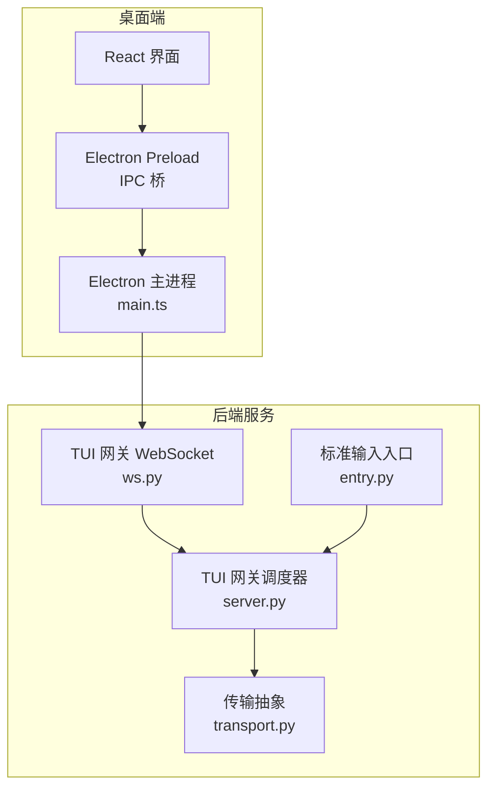
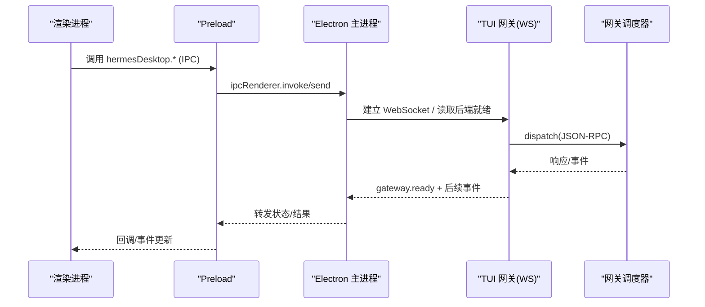
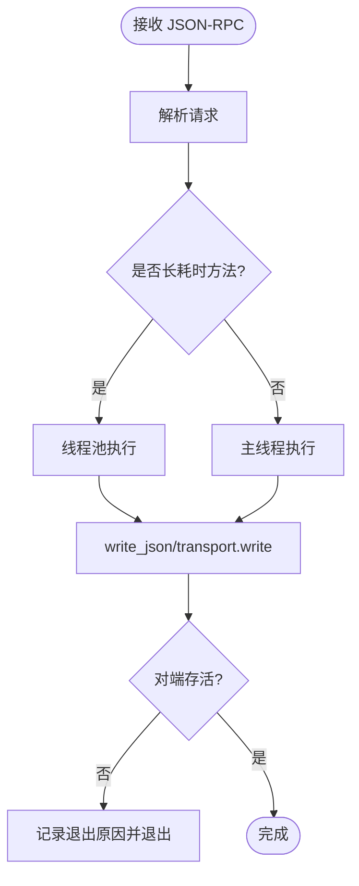
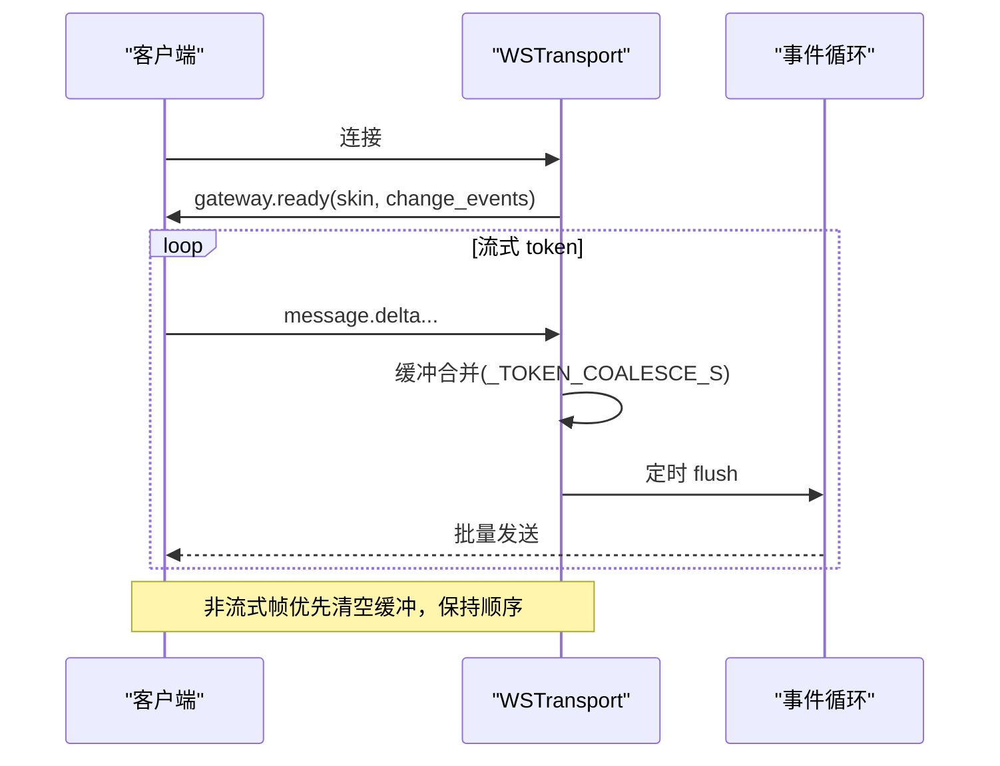
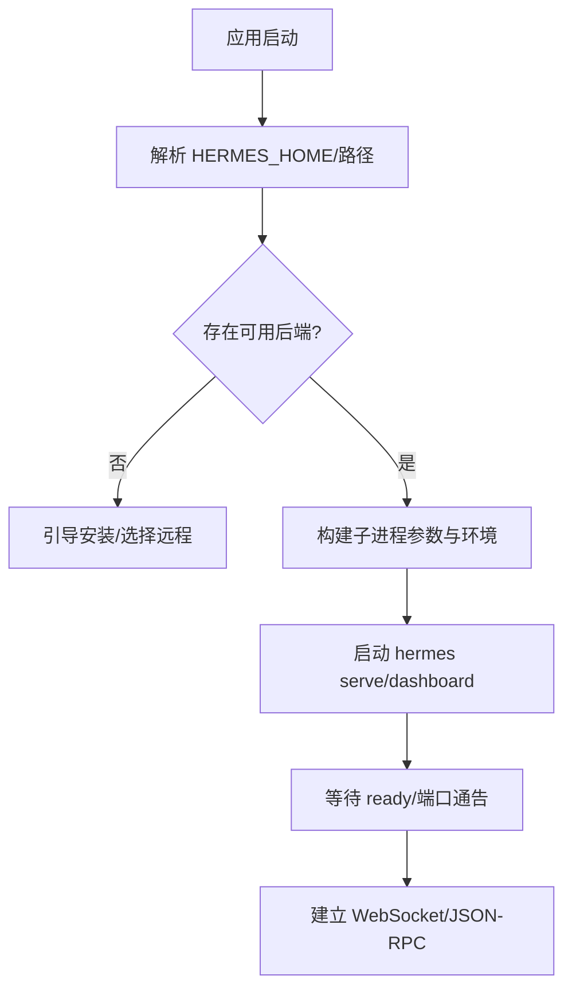
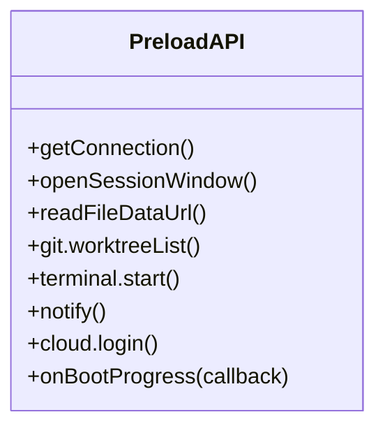
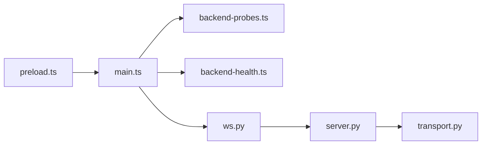

# 桌面应用集成

<cite>
**本文引用的文件**
- [apps/desktop/README.md](file://apps/desktop/README.md)
- [tui_gateway/server.py](file://tui_gateway/server.py)
- [tui_gateway/transport.py](file://tui_gateway/transport.py)
- [tui_gateway/ws.py](file://tui_gateway/ws.py)
- [tui_gateway/entry.py](file://tui_gateway/entry.py)
- [apps/desktop/electron/main.ts](file://apps/desktop/electron/main.ts)
- [apps/desktop/electron/preload.ts](file://apps/desktop/electron/preload.ts)
</cite>

## 目录
1. [简介](#简介)
2. [项目结构](#项目结构)
3. [核心组件](#核心组件)
4. [架构总览](#架构总览)
5. [详细组件分析](#详细组件分析)
6. [依赖关系分析](#依赖关系分析)
7. [性能考量](#性能考量)
8. [故障排除指南](#故障排除指南)
9. [结论](#结论)
10. [附录](#附录)

## 简介
本文件面向希望将 Hermes Agent 与 Electron 等桌面框架集成的开发者，系统性说明：
- TUI 网关的工作原理：进程间通信、消息传递与状态同步机制
- 代理服务器（Gateway）的作用：端口转发、安全认证与请求路由
- 桌面应用的完整集成示例：主进程与渲染进程的通信模式
- IPC 通道使用方法：事件监听、数据序列化与错误处理
- 桌面特有功能：文件系统访问、原生模块集成与系统通知
- 调试技巧与故障排除：日志查看与性能分析

## 项目结构
Hermes Desktop 由三层边界组成：
- Electron：负责后端可执行文件的解析与验证、原生能力（文件系统/Git/窗口）、以及暴露给渲染进程的窄桥接接口
- React：负责桌面路由、面板交互状态与对话转录展示
- Hermes Agent：以无头 hermes serve 进程运行，并通过 tui_gateway 的 JSON-RPC/WebSocket API 对外暴露能力；渲染层通过 apps/shared 连接

**图示来源**
- [apps/desktop/electron/main.ts:1-250](file://apps/desktop/electron/main.ts#L1-L250)
- [tui_gateway/ws.py:1-120](file://tui_gateway/ws.py#L1-L120)
- [tui_gateway/server.py:140-330](file://tui_gateway/server.py#L140-L330)
- [tui_gateway/transport.py:1-120](file://tui_gateway/transport.py#L1-L120)
- [tui_gateway/entry.py:420-491](file://tui_gateway/entry.py#L420-L491)

**章节来源**
- [apps/desktop/README.md:88-123](file://apps/desktop/README.md#L88-L123)

## 核心组件
- TUI 网关（Python）
  - server.py：会话管理、RPC 分发、长任务线程池、斜杠命令子进程、崩溃与信号处理
  - transport.py：统一传输抽象（StdioTransport/TeeTransport），屏蔽 stdio 与 WS 差异
  - ws.py：WebSocket 接入、JSON-RPC 帧收发、流式 token 合并、连接生命周期管理
  - entry.py：stdio 入口、侧车发布、MCP 发现等待、优雅退出
- Electron 主进程（TypeScript）
  - main.ts：后端启动/探测、环境配置、窗口与主题、更新、远程连接、安全加固
  - preload.ts：向渲染进程暴露安全的 IPC API 集合（文件、Git、终端、通知、云登录等）

**章节来源**
- [tui_gateway/server.py:140-330](file://tui_gateway/server.py#L140-L330)
- [tui_gateway/transport.py:1-120](file://tui_gateway/transport.py#L1-L120)
- [tui_gateway/ws.py:1-120](file://tui_gateway/ws.py#L1-L120)
- [tui_gateway/entry.py:420-491](file://tui_gateway/entry.py#L420-L491)
- [apps/desktop/electron/main.ts:1-250](file://apps/desktop/electron/main.ts#L1-L250)
- [apps/desktop/electron/preload.ts:1-120](file://apps/desktop/electron/preload.ts#L1-L120)

## 架构总览
桌面应用通过 Electron 主进程拉起或连接 Hermes 后端。后端以 tui_gateway 提供 JSON-RPC/WebSocket 接口。渲染进程通过 preload 暴露的 IPC 调用主进程能力，或直接通过共享库连接远端 Gateway。

**图示来源**
- [tui_gateway/ws.py:286-337](file://tui_gateway/ws.py#L286-L337)
- [tui_gateway/server.py:184-296](file://tui_gateway/server.py#L184-L296)
- [apps/desktop/electron/preload.ts:1-120](file://apps/desktop/electron/preload.ts#L1-L120)
- [apps/desktop/electron/main.ts:250-430](file://apps/desktop/electron/main.ts#L250-L430)

## 详细组件分析

### TUI 网关：进程间通信与消息传递
- 传输抽象
  - StdioTransport：将 JSON-RPC 帧写入 stdout，区分“对端消失”与真实 I/O 错误，避免误判为断开
  - TeeTransport：将输出同时投递到主通道与旁路（如 dashboard 侧边栏 WS）
- 会话与 RPC
  - server.py 维护会话表、方法表、待处理队列与答案缓存
  - 长耗时 RPC（slash.exec、shell.exec、session.resume、model.options 等）被路由到线程池，避免阻塞读循环
  - 斜杠命令通过 _SlashWorker 子进程执行，隔离环境与资源
- 崩溃与信号
  - 全局异常钩子与线程异常钩子将未处理异常追加到 crash log，并输出摘要到 stderr
  - entry.py 安装信号处理器，记录堆栈并在宽限期内优雅关闭，必要时硬退出防止死锁

**图示来源**
- [tui_gateway/server.py:184-296](file://tui_gateway/server.py#L184-L296)
- [tui_gateway/transport.py:100-180](file://tui_gateway/transport.py#L100-L180)
- [tui_gateway/entry.py:233-253](file://tui_gateway/entry.py#L233-L253)

**章节来源**
- [tui_gateway/server.py:140-330](file://tui_gateway/server.py#L140-L330)
- [tui_gateway/transport.py:1-180](file://tui_gateway/transport.py#L1-L180)
- [tui_gateway/entry.py:48-65](file://tui_gateway/entry.py#L48-L65)

### TUI 网关：WebSocket 与流式传输
- 连接建立后发送 gateway.ready，携带 skin 与 change_events 标志
- 高频率 token 帧（message.delta/reasoning.delta/thinking.delta）进行合并缓冲，降低事件循环唤醒开销
- 非流式帧会先清空 token 缓冲，保证顺序一致
- 写超时保护：当事件循环停滞时不永久标记传输关闭，避免“假死”

**图示来源**
- [tui_gateway/ws.py:70-187](file://tui_gateway/ws.py#L70-L187)
- [tui_gateway/ws.py:286-337](file://tui_gateway/ws.py#L286-L337)

**章节来源**
- [tui_gateway/ws.py:1-120](file://tui_gateway/ws.py#L1-L120)
- [tui_gateway/ws.py:286-477](file://tui_gateway/ws.py#L286-L477)

### Electron 主进程：后端启动、探测与环境
- 后端解析优先级：环境变量 > 开发源码 > 已安装运行时 > PATH > 系统 Python > 首次启动引导安装
- 启动前探针：验证 CLI、检查 venv、检测 Git Bash、平台策略与安全加固
- 环境变量与路径：HERMES_HOME、ACTIVE_HERMES_ROOT、VENV_ROOT、日志路径、主题与透明度持久化
- Windows 特殊处理：GPU 沙箱崩溃恢复、ACL 修复、用户环境变量读取

**图示来源**
- [apps/desktop/electron/main.ts:525-630](file://apps/desktop/electron/main.ts#L525-L630)
- [apps/desktop/electron/main.ts:329-428](file://apps/desktop/electron/main.ts#L329-L428)

**章节来源**
- [apps/desktop/electron/main.ts:250-430](file://apps/desktop/electron/main.ts#L250-L430)
- [apps/desktop/electron/main.ts:525-630](file://apps/desktop/electron/main.ts#L525-L630)

### Electron Preload：IPC 通道与桌面能力
- 暴露 hermesDesktop 命名空间，封装所有跨进程调用
- 文件与预览：读取 Data URL、文本、目录、监听文件变化、打开外部链接
- Git 操作：分支、工作树、提交、PR 创建、仓库扫描
- 终端：启动/写入/调整大小、数据与退出事件
- 通知与系统：系统通知、剪贴板、麦克风权限、缩放、主题、电源状态
- 云与连接：Hermes Cloud 登录/登出/发现、连接配置测试与应用、SSH 主机解析
- 事件订阅：返回取消函数，避免内存泄漏

**图示来源**
- [apps/desktop/electron/preload.ts:1-356](file://apps/desktop/electron/preload.ts#L1-L356)

**章节来源**
- [apps/desktop/electron/preload.ts:1-356](file://apps/desktop/electron/preload.ts#L1-L356)

### 代理服务器（Gateway）：端口转发、认证与路由
- 端口与协议
  - 通过 WebSocket 暴露 JSON-RPC，与 stdio 协议一致，便于复用同一套分发逻辑
  - 支持 sidecar 发布：将网关输出镜像到 dashboard 侧边栏
- 认证与会话
  - 首次连接发送 gateway.ready，携带皮肤与变更事件开关
  - 会话在断连后可短暂保留以便快速重连；长时间无活动则回收
- 路由与分发
  - 所有 RPC 与方法均经 server.dispatch 分发，长耗时任务走线程池
  - 斜杠命令通过独立子进程执行，隔离环境与资源

**章节来源**
- [tui_gateway/ws.py:286-337](file://tui_gateway/ws.py#L286-L337)
- [tui_gateway/server.py:184-296](file://tui_gateway/server.py#L184-L296)
- [tui_gateway/entry.py:48-65](file://tui_gateway/entry.py#L48-L65)

## 依赖关系分析
- 组件耦合
  - ws.py 依赖 server.py 的 dispatch 与皮肤 watcher
  - server.py 依赖 transport.py 的统一写入接口，屏蔽 stdio/WS 差异
  - main.ts 依赖 backend-probes/backend-health 等模块进行后端探测与健康检查
  - preload.ts 仅暴露必要能力，减少攻击面
- 外部依赖
  - Electron 原生模块（clipboard、Notification、systemPreferences 等）
  - node-pty 用于终端会话
  - 可选 Starlette WebSocket 类型（导入失败时回退）

**图示来源**
- [apps/desktop/electron/main.ts:1-250](file://apps/desktop/electron/main.ts#L1-L250)
- [tui_gateway/ws.py:1-120](file://tui_gateway/ws.py#L1-L120)
- [tui_gateway/server.py:140-330](file://tui_gateway/server.py#L140-L330)
- [tui_gateway/transport.py:1-120](file://tui_gateway/transport.py#L1-L120)
- [apps/desktop/electron/preload.ts:1-120](file://apps/desktop/electron/preload.ts#L1-L120)

**章节来源**
- [apps/desktop/electron/main.ts:1-250](file://apps/desktop/electron/main.ts#L1-L250)
- [tui_gateway/ws.py:1-120](file://tui_gateway/ws.py#L1-L120)
- [tui_gateway/server.py:140-330](file://tui_gateway/server.py#L140-L330)
- [tui_gateway/transport.py:1-120](file://tui_gateway/transport.py#L1-L120)
- [apps/desktop/electron/preload.ts:1-120](file://apps/desktop/electron/preload.ts#L1-L120)

## 性能考量
- 流式 token 合并：高频 delta 事件按 ~30fps 批次发送，降低事件循环压力
- 长任务分流：slash/exec/shell/模型选项等耗时 RPC 走线程池，避免阻塞读循环
- 写超时保护：WS 写超时会记录警告但不立即关闭传输，避免“假死”
- 背景节流：渲染进程在后台时降低轮询频率，仅在活跃时取消节流
- 日志与旋转：desktop.log 限制大小与备份数量，防止磁盘耗尽

**章节来源**
- [tui_gateway/ws.py:44-61](file://tui_gateway/ws.py#L44-L61)
- [tui_gateway/server.py:184-296](file://tui_gateway/server.py#L184-L296)
- [tui_gateway/ws.py:165-187](file://tui_gateway/ws.py#L165-L187)
- [apps/desktop/electron/main.ts:430-450](file://apps/desktop/electron/main.ts#L430-L450)
- [apps/desktop/electron/main.ts:625-649](file://apps/desktop/electron/main.ts#L625-L649)

## 故障排除指南
- 启动失败
  - 查看 desktop.log（位于 HERMES_HOME/logs），包含后端输出与最近 Python 回溯
  - 清理引导标记或重建 venv 以恢复首次引导流程
- 网关崩溃
  - 未处理异常会被记录到 tui_gateway_crash.log，并在 stderr 输出一行摘要
  - 信号处理会记录主线程与所有线程堆栈，便于定位 SIGPIPE/SIGTERM/SIGHUP 等问题
- 连接问题
  - 使用 preload 的连接配置测试与探针，确认 HTTP 与 WebSocket 连通性
  - 检查远端 Gateway 的 gateway.ready 是否到达，关注 parse_errors 与 send_failures
- 性能问题
  - 观察流式 token 合并是否生效，必要时调整 _TOKEN_COALESCE_S
  - 检查长耗时 RPC 是否命中线程池，避免阻塞读循环

**章节来源**
- [apps/desktop/README.md:176-200](file://apps/desktop/README.md#L176-L200)
- [tui_gateway/server.py:62-133](file://tui_gateway/server.py#L62-L133)
- [tui_gateway/entry.py:89-172](file://tui_gateway/entry.py#L89-L172)
- [tui_gateway/ws.py:339-477](file://tui_gateway/ws.py#L339-L477)

## 结论
Hermes Desktop 通过 Electron 主进程与 tui_gateway 的 JSON-RPC/WebSocket 接口解耦了前端与后端，提供了稳定、可扩展且高性能的桌面集成方案。借助统一的传输抽象、流式优化与完善的崩溃/信号处理，开发者可以专注于业务逻辑与用户体验。结合 preload 提供的丰富 IPC 能力，可实现文件系统、Git、终端、通知与云登录等桌面特性。

## 附录
- 常用 IPC 通道（部分）
  - 连接与会话：getConnection、openSessionWindow、getGatewayWsUrl
  - 文件与预览：readFileDataUrl、watchDirectory、openDir
  - Git：worktreeList、branchSwitch、repoStatus、createPr
  - 终端：start、write、resize、onData、onExit
  - 通知与系统：notify、requestMicrophoneAccess、setNativeTheme、setTranslucency
  - 云与连接：cloud.login、discover、agentSignIn、testConnectionConfig
- 调试建议
  - 启用渲染调试端口（DEV_CDP），便于附加调试工具
  - 使用 getBootProgress/onBootProgress 跟踪引导进度
  - 通过 onBackendExit 与 onConnectionApplied 处理后端退出与连接切换

**章节来源**
- [apps/desktop/electron/preload.ts:1-356](file://apps/desktop/electron/preload.ts#L1-L356)
- [apps/desktop/electron/main.ts:296-317](file://apps/desktop/electron/main.ts#L296-L317)