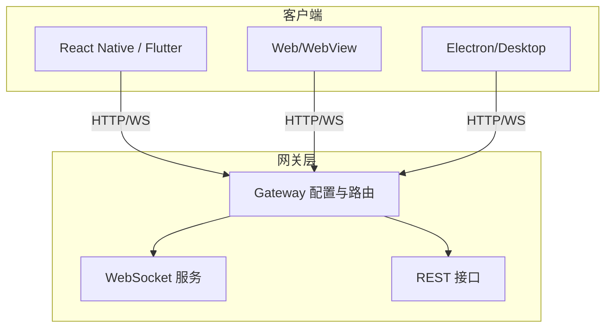
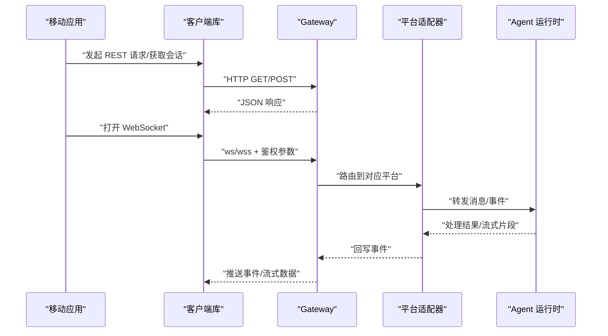
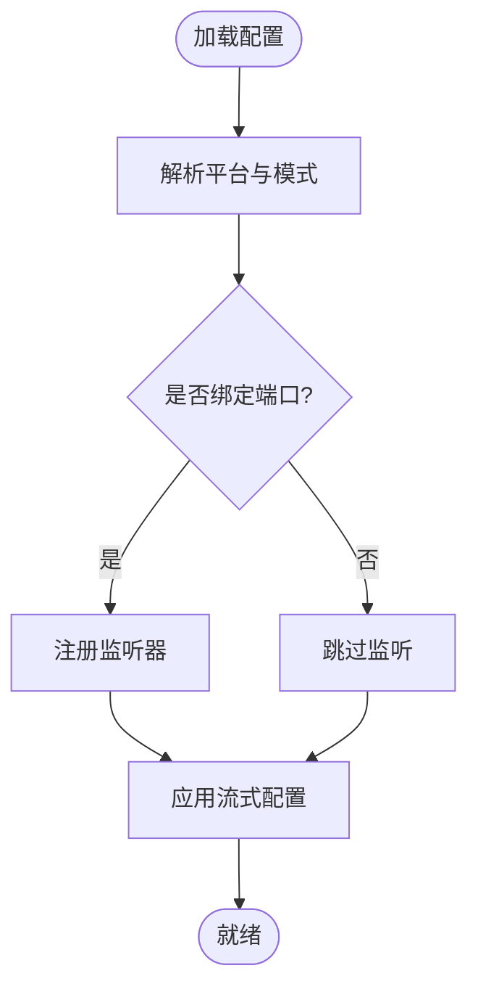
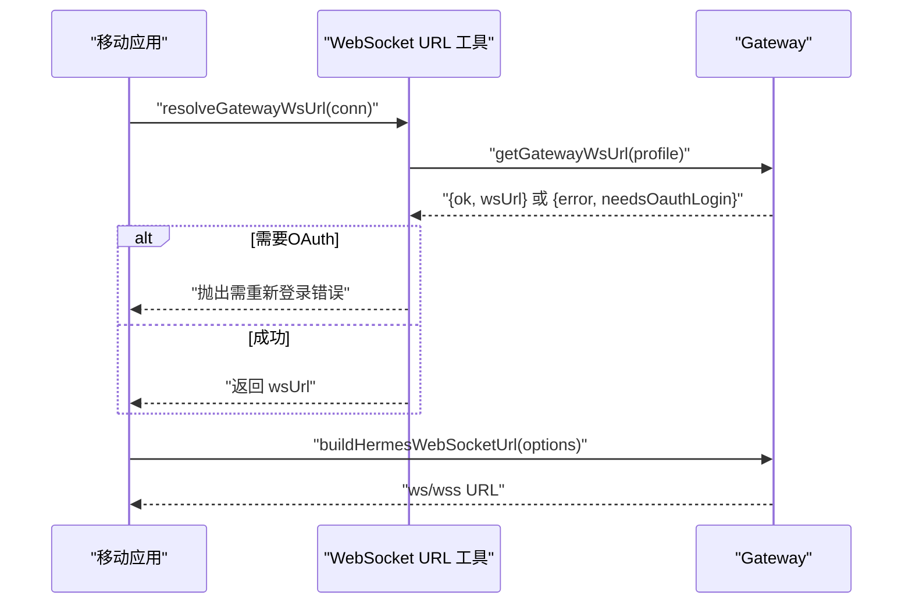
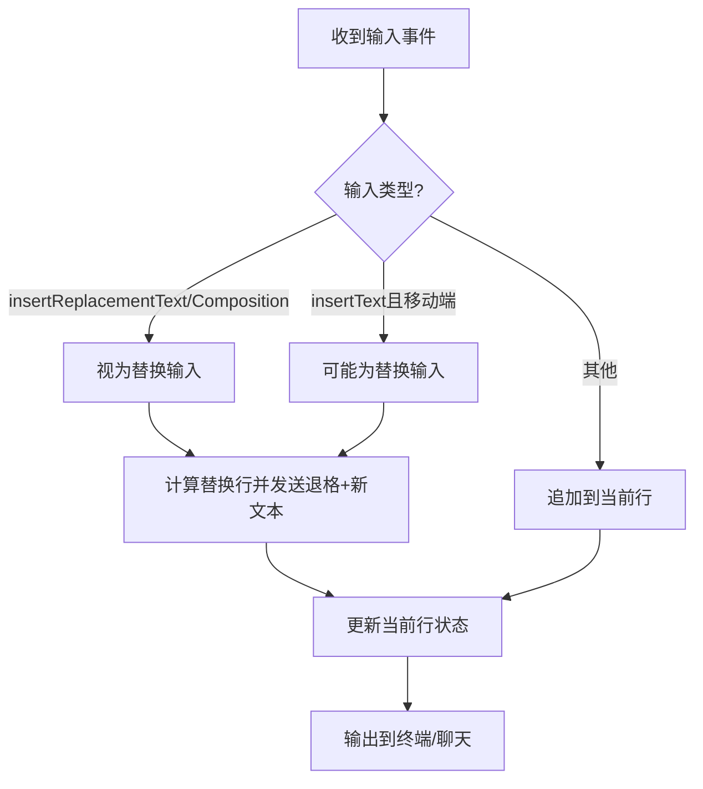
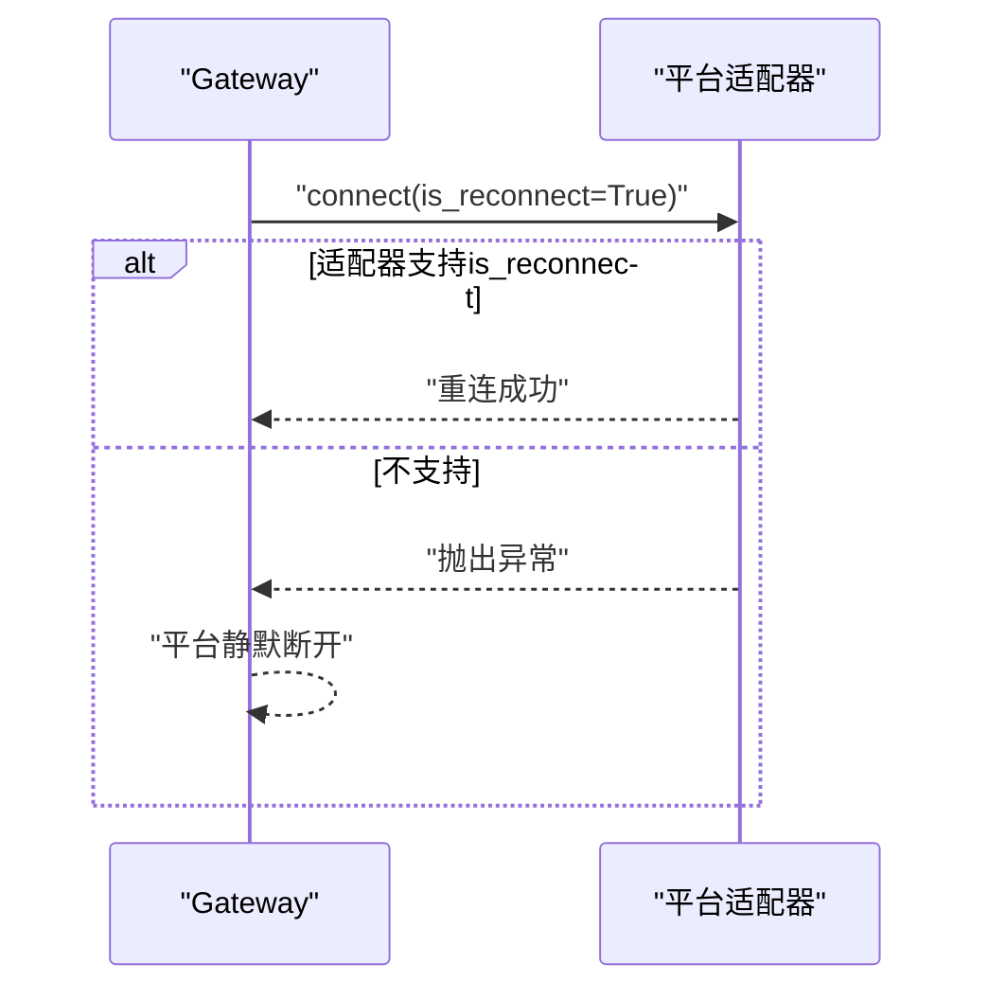
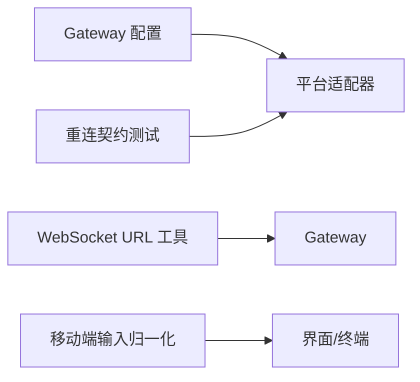

# 移动应用集成

<cite>
**本文引用的文件**
- [gateway/config.py](file://gateway/config.py)
- [apps/shared/src/websocket-url.ts](file://apps/shared/src/websocket-url.ts)
- [apps/desktop/src/hooks/use-mobile.ts](file://apps/desktop/src/hooks/use-mobile.ts)
- [web/src/lib/pty-mobile-input.ts](file://web/src/lib/pty-mobile-input.ts)
- [tests/gateway/test_adapter_connect_is_reconnect_contract.py](file://tests/gateway/test_adapter_connect_is_reconnect_contract.py)
</cite>

## 目录
1. [简介](#简介)
2. [项目结构](#项目结构)
3. [核心组件](#核心组件)
4. [架构总览](#架构总览)
5. [详细组件分析](#详细组件分析)
6. [依赖关系分析](#依赖关系分析)
7. [性能考虑](#性能考虑)
8. [故障排查指南](#故障排查指南)
9. [结论](#结论)
10. [附录](#附录)

## 简介
本文件面向移动端（iOS、Android）与跨平台框架（React Native、Flutter）的开发者，提供与 Hermes Agent Gateway 集成的完整方案。内容覆盖：
- REST API 的移动端适配：网络请求封装、缓存策略与离线支持
- WebSocket 在移动环境下的使用：连接保活、断线重连与电池优化
- 跨平台框架集成示例：原生模块桥接与本地存储
- 移动应用特有功能：推送通知、后台任务与权限管理
- 移动端性能优化：网络、内存与用户体验
- 调试工具与测试策略

## 项目结构
仓库中与移动端集成密切相关的代码主要分布在以下位置：
- Gateway 配置与平台能力：gateway/config.py
- 前端共享的 WebSocket URL 构建与鉴权：apps/shared/src/websocket-url.ts
- 桌面端对“移动端”检测与输入处理：apps/desktop/src/hooks/use-mobile.ts、web/src/lib/pty-mobile-input.ts
- 平台适配器重连契约保障：tests/gateway/test_adapter_connect_is_reconnect_contract.py

图表来源
- [gateway/config.py:272-394](file://gateway/config.py#L272-L394)
- [apps/shared/src/websocket-url.ts:39-94](file://apps/shared/src/websocket-url.ts#L39-L94)

章节来源
- [gateway/config.py:272-394](file://gateway/config.py#L272-L394)
- [apps/shared/src/websocket-url.ts:39-94](file://apps/shared/src/websocket-url.ts#L39-L94)

## 核心组件
- Gateway 配置与平台枚举：定义支持的通信平台、端口绑定策略与流式输出行为，为移动端接入提供统一后端能力。
- WebSocket URL 构建与鉴权：提供统一的 URL 生成与 OAuth 票据刷新机制，确保移动端在不同部署环境下稳定连接。
- 移动端输入与交互：针对移动端 IME/替换输入进行归一化，提升终端类交互体验。
- 平台适配器重连契约：通过静态检查保证所有平台适配器的 connect() 接受 is_reconnect 参数，保障断线重连可靠性。

章节来源
- [gateway/config.py:272-394](file://gateway/config.py#L272-L394)
- [apps/shared/src/websocket-url.ts:39-94](file://apps/shared/src/websocket-url.ts#L39-L94)
- [web/src/lib/pty-mobile-input.ts:75-136](file://web/src/lib/pty-mobile-input.ts#L75-L136)
- [tests/gateway/test_adapter_connect_is_reconnect_contract.py:114-145](file://tests/gateway/test_adapter_connect_is_reconnect_contract.py#L114-L145)

## 架构总览
移动端通过 HTTP/HTTPS 访问 Gateway 的 REST 接口，并通过 WebSocket 建立实时通道。Gateway 根据配置选择平台适配器，将消息路由到后端 Agent 并返回结果。

图表来源
- [apps/shared/src/websocket-url.ts:135-151](file://apps/shared/src/websocket-url.ts#L135-L151)
- [gateway/config.py:272-394](file://gateway/config.py#L272-L394)

## 详细组件分析

### Gateway 配置与平台能力
- 平台枚举与端口绑定：明确哪些平台会绑定监听端口，避免多实例冲突；对飞书等条件模式进行区分。
- 流式输出配置：控制编辑间隔、缓冲阈值与最终消息替换策略，影响移动端实时体验。
- 环境变量与密钥注入：通过受控方式读取配置，便于容器化与多租户部署。

图表来源
- [gateway/config.py:376-417](file://gateway/config.py#L376-L417)
- [gateway/config.py:720-800](file://gateway/config.py#L720-L800)

章节来源
- [gateway/config.py:376-417](file://gateway/config.py#L376-L417)
- [gateway/config.py:720-800](file://gateway/config.py#L720-L800)

### WebSocket URL 构建与鉴权
- 统一 URL 构建：根据协议、主机、基础路径与查询参数生成 ws/wss URL，自动处理 HTTPS→WSS 映射。
- OAuth 票据刷新：当鉴权模式为 OAuth 时，动态获取一次性票据，失败时抛出需重新登录的错误类型。
- 兼容多种部署：支持反向代理子路径、自定义协议与主机名。

图表来源
- [apps/shared/src/websocket-url.ts:39-94](file://apps/shared/src/websocket-url.ts#L39-L94)
- [apps/shared/src/websocket-url.ts:135-151](file://apps/shared/src/websocket-url.ts#L135-L151)

章节来源
- [apps/shared/src/websocket-url.ts:39-94](file://apps/shared/src/websocket-url.ts#L39-L94)
- [apps/shared/src/websocket-url.ts:135-151](file://apps/shared/src/websocket-url.ts#L135-L151)

### 移动端输入与交互优化
- IME/替换输入识别：在移动端输入法场景下，将多次字符事件合并为一次替换，减少重复与抖动。
- 行级状态追踪：维护当前输入行，处理删除、换行与控制序列，保证终端交互一致性。
- 移动端判定：基于媒体查询判断是否为移动端，从而启用特定输入归一化逻辑。

图表来源
- [web/src/lib/pty-mobile-input.ts:75-136](file://web/src/lib/pty-mobile-input.ts#L75-L136)
- [apps/desktop/src/hooks/use-mobile.ts:1-4](file://apps/desktop/src/hooks/use-mobile.ts#L1-L4)

章节来源
- [web/src/lib/pty-mobile-input.ts:75-136](file://web/src/lib/pty-mobile-input.ts#L75-L136)
- [apps/desktop/src/hooks/use-mobile.ts:1-4](file://apps/desktop/src/hooks/use-mobile.ts#L1-L4)

### 平台适配器重连契约
- 强制签名校验：通过 AST 静态检查确保每个平台适配器的 connect() 方法接受 is_reconnect 关键字参数。
- 网关重连流程：网关在每次重试时传递 is_reconnect=True，若适配器不支持则会导致静默断开。
- 回归测试：对所有平台适配器目录执行检查，防止新增适配器遗漏该契约。

图表来源
- [tests/gateway/test_adapter_connect_is_reconnect_contract.py:114-145](file://tests/gateway/test_adapter_connect_is_reconnect_contract.py#L114-L145)

章节来源
- [tests/gateway/test_adapter_connect_is_reconnect_contract.py:114-145](file://tests/gateway/test_adapter_connect_is_reconnect_contract.py#L114-L145)

## 依赖关系分析
- Gateway 配置驱动平台能力与流式行为，直接影响移动端实时体验。
- WebSocket URL 工具依赖 Gateway 提供的鉴权能力，确保移动端在不同部署下可正确连接。
- 移动端输入归一化依赖“移动端判定”，用于启用特定交互优化。
- 平台适配器重连契约由测试保障，确保网关与适配器之间的兼容性。

图表来源
- [gateway/config.py:272-394](file://gateway/config.py#L272-L394)
- [apps/shared/src/websocket-url.ts:39-94](file://apps/shared/src/websocket-url.ts#L39-L94)
- [web/src/lib/pty-mobile-input.ts:75-136](file://web/src/lib/pty-mobile-input.ts#L75-L136)
- [tests/gateway/test_adapter_connect_is_reconnect_contract.py:114-145](file://tests/gateway/test_adapter_connect_is_reconnect_contract.py#L114-L145)

章节来源
- [gateway/config.py:272-394](file://gateway/config.py#L272-L394)
- [apps/shared/src/websocket-url.ts:39-94](file://apps/shared/src/websocket-url.ts#L39-L94)
- [web/src/lib/pty-mobile-input.ts:75-136](file://web/src/lib/pty-mobile-input.ts#L75-L136)
- [tests/gateway/test_adapter_connect_is_reconnect_contract.py:114-145](file://tests/gateway/test_adapter_connect_is_reconnect_contract.py#L114-L145)

## 性能考虑
- 网络请求优化
  - 使用连接池与复用 WebSocket 长连接，减少握手开销。
  - 合理设置超时与重试策略，结合指数退避降低瞬时压力。
  - 对大对象采用分块传输与压缩，减少带宽占用。
- 内存管理
  - 及时释放不再使用的资源（如图片、音频、视频）。
  - 避免在高频回调中创建大量临时对象，必要时复用缓冲区。
- 用户体验改进
  - 利用流式输出配置缩短首字延迟，提升即时感。
  - 在弱网环境下提供降级策略（如仅文本、降低频率）。
  - 对移动端输入进行归一化处理，减少误触与重复输入。

[本节为通用指导，不直接分析具体文件]

## 故障排查指南
- 无法连接 WebSocket
  - 检查 URL 构建是否正确（协议、主机、路径、查询参数）。
  - 确认 OAuth 票据是否有效，必要时触发重新登录流程。
- 频繁断线重连
  - 验证平台适配器是否支持 is_reconnect 参数。
  - 观察网关日志，定位重连失败原因。
- 移动端输入异常
  - 确认是否启用了移动端输入归一化逻辑。
  - 检查 IME 事件类型与替换窗口是否匹配。

章节来源
- [apps/shared/src/websocket-url.ts:39-94](file://apps/shared/src/websocket-url.ts#L39-L94)
- [tests/gateway/test_adapter_connect_is_reconnect_contract.py:114-145](file://tests/gateway/test_adapter_connect_is_reconnect_contract.py#L114-L145)
- [web/src/lib/pty-mobile-input.ts:75-136](file://web/src/lib/pty-mobile-input.ts#L75-L136)

## 结论
通过 Gateway 的统一配置与平台抽象、WebSocket URL 工具的鉴权与部署兼容、移动端输入归一化以及平台适配器重连契约，本项目为移动端与跨平台框架提供了稳定、高效、易用的集成基础。建议在实际项目中结合上述最佳实践，持续优化网络、内存与用户体验，并完善调试与测试体系。

[本节为总结性内容，不直接分析具体文件]

## 附录
- 推荐集成步骤
  - 初始化 Gateway 配置，启用所需平台与流式输出。
  - 在移动端调用 WebSocket URL 工具获取连接地址并完成鉴权。
  - 实现网络请求封装，支持缓存与离线队列。
  - 接入推送通知与后台任务，确保关键操作不被系统回收。
  - 编写单元测试与集成测试，覆盖重连、鉴权失败与输入归一化场景。

[本节为补充说明，不直接分析具体文件]