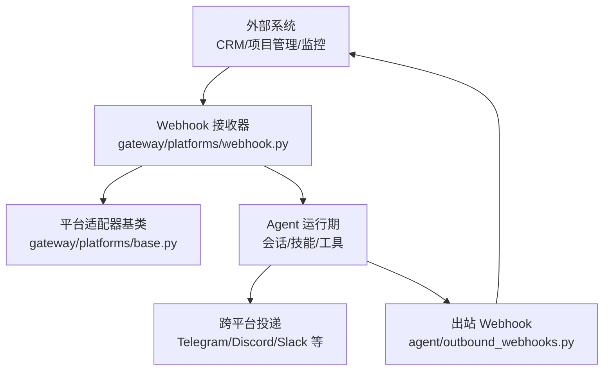
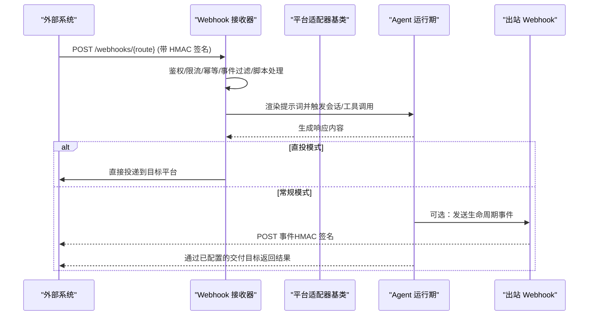
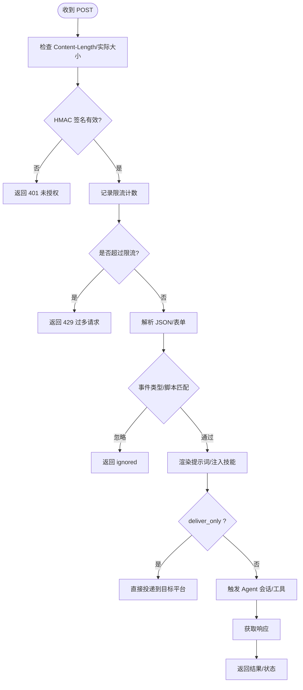
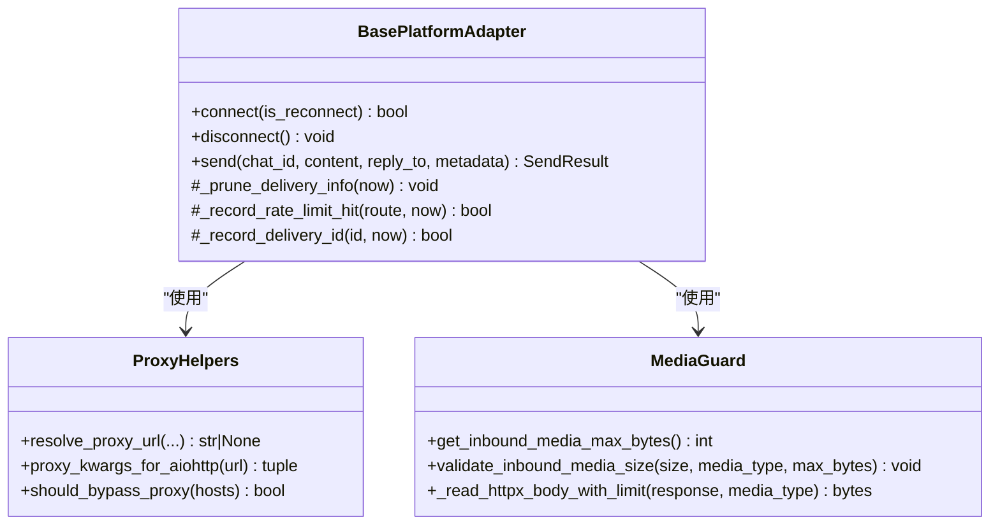
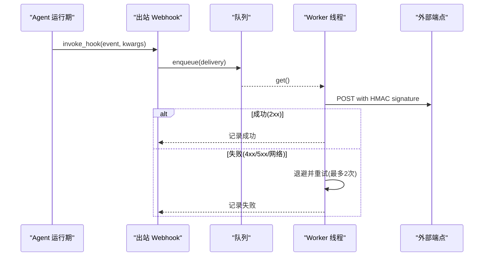
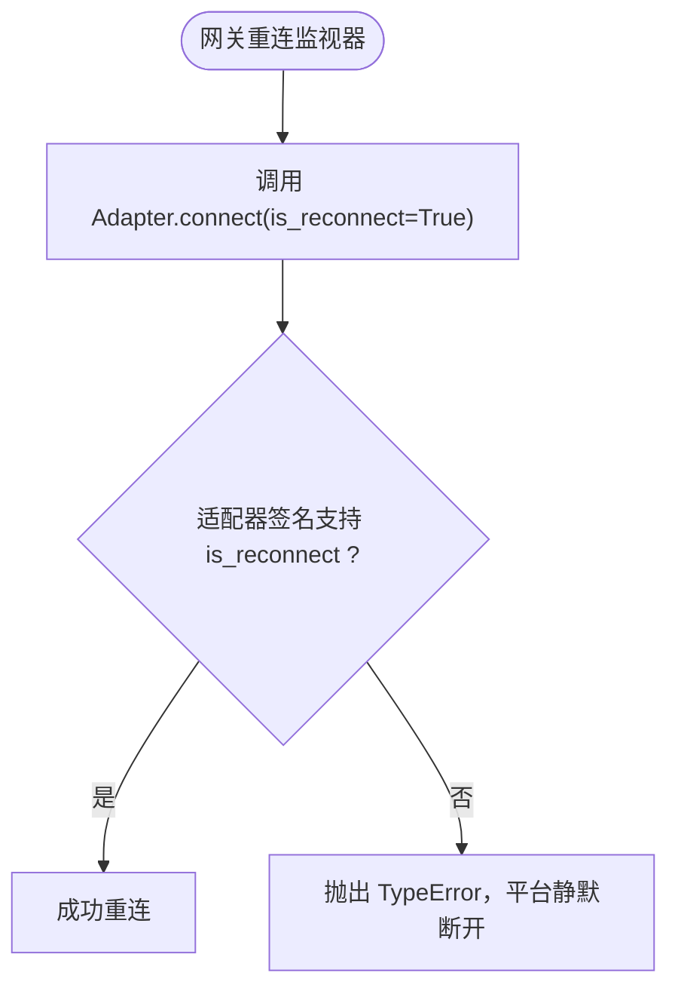
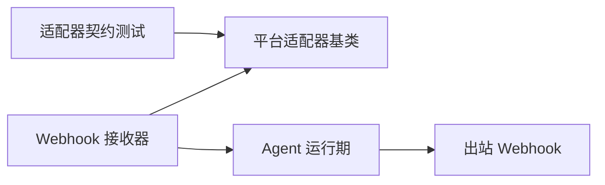

# 第三方系统集成

<cite>
**本文引用的文件**
- [README.md](file://README.md)
- [base.py](file://gateway/platforms/base.py)
- [webhook.py](file://gateway/platforms/webhook.py)
- [outbound_webhooks.py](file://agent/outbound_webhooks.py)
- [test_adapter_connect_is_reconnect_contract.py](file://tests/gateway/test_adapter_connect_is_reconnect_contract.py)
</cite>

## 目录
1. [简介](#简介)
2. [项目结构](#项目结构)
3. [核心组件](#核心组件)
4. [架构总览](#架构总览)
5. [详细组件分析](#详细组件分析)
6. [依赖关系分析](#依赖关系分析)
7. [性能考虑](#性能考虑)
8. [故障排查指南](#故障排查指南)
9. [结论](#结论)
10. [附录](#附录)

## 简介
本文件面向需要将 Hermes Agent 与外部系统（如 CRM、项目管理工具、监控系统等）集成的开发者，提供 REST API 与 Webhook 的集成方案说明。内容涵盖：
- 认证机制：HMAC 签名校验、安全模式与本地回环限制
- 请求格式与响应处理：Webhook 路由、事件过滤、模板渲染、幂等与限流
- 实时通信：通过 Webhook 实现“事件驱动”的准实时集成；结合平台适配器连接/重连契约保障稳定性
- 数据同步策略：增量触发、去重与冲突规避建议
- 错误处理与重试：出站 Webhook 的重试与退避、入站限流与拒绝策略
- 集成测试与监控：基于现有测试用例与可观测性能力进行验证与观测

## 项目结构
围绕第三方集成，关键代码分布在以下模块：
- gateway/platforms/base.py：平台适配器的基础能力（代理、媒体大小限制、TTS 输出路径、URL 安全等），为各平台统一行为提供支撑
- gateway/platforms/webhook.py：通用 Webhook 接收器，负责路由、鉴权、限流、幂等、事件过滤、提示词渲染与跨平台投递
- agent/outbound_webhooks.py：出站 Webhook 通知，将内部生命周期事件推送到外部 HTTP 端点
- tests/gateway/test_adapter_connect_is_reconnect_contract.py：对平台适配器 connect() 接口的静态契约检查，确保网关重连时能正确传递 is_reconnect 参数

图表来源
- [webhook.py:177-344](file://gateway/platforms/webhook.py#L177-L344)
- [base.py:738-800](file://gateway/platforms/base.py#L738-L800)
- [outbound_webhooks.py:156-207](file://agent/outbound_webhooks.py#L156-L207)

章节来源
- [README.md:105-184](file://README.md#L105-L184)

## 核心组件
- Webhook 接收器（入站）
  - 启动 aiohttp 服务，注册 /health 与 /webhooks/{route_name} 路由
  - 支持多租户/多配置文件的 URL 前缀 /p/{profile}/webhooks/{route_name}
  - HMAC 签名校验（V1/V2）、速率限制、幂等缓存、脚本预处理、事件类型过滤、提示词模板渲染
  - 支持 deliver_only 直投模式，跳过 LLM 推理直接推送通知
- 平台适配器基类（通用能力）
  - 代理解析与绕过（NO_PROXY/no_proxy）、aiohttp/connector 代理注入
  - 入站媒体大小上限与读取保护，防止 OOM
  - TTS 输出路径选择（MP3/Ogg）与流式 TTS 句柄
  - URL 安全校验与重定向防护
- 出站 Webhook（通知）
  - 从配置中注册钩子，将生命周期事件以 JSON POST 推送到外部端点
  - HMAC-SHA256 签名、队列化异步投递、有限重试与退避、禁止跟随重定向

章节来源
- [webhook.py:177-344](file://gateway/platforms/webhook.py#L177-L344)
- [webhook.py:584-800](file://gateway/platforms/webhook.py#L584-L800)
- [base.py:417-517](file://gateway/platforms/base.py#L417-L517)
- [base.py:738-800](file://gateway/platforms/base.py#L738-L800)
- [outbound_webhooks.py:156-207](file://agent/outbound_webhooks.py#L156-L207)
- [outbound_webhooks.py:520-570](file://agent/outbound_webhooks.py#L520-L570)

## 架构总览
下图展示了外部系统与 Hermes Agent 的集成流程：外部系统通过 Webhook 触发 Agent 执行，Agent 完成处理后通过跨平台或出站 Webhook 将结果反馈给外部系统。

图表来源
- [webhook.py:584-800](file://gateway/platforms/webhook.py#L584-L800)
- [outbound_webhooks.py:404-455](file://agent/outbound_webhooks.py#L404-L455)

## 详细组件分析

### Webhook 接收器（入站）
- 启动与路由
  - 监听默认端口，注册健康检查与 Webhook 路由，支持多配置文件前缀
  - 动态订阅文件热加载，合并静态与动态路由
- 安全与可靠性
  - HMAC 签名校验（支持 V2 时间戳绑定防重放）
  - 入站载荷大小限制与 chunked 体保护
  - 每路由固定窗口限流、幂等去重（delivery_id）
  - 脚本预处理（超时隔离）与事件类型过滤
- 业务编排
  - 提示词模板渲染，可选注入技能内容
  - deliver_only 直投模式：跳过 LLM，直接投递通知
  - 跨平台投递：将结果发送到 Telegram/Discord/Slack 等

图表来源
- [webhook.py:584-800](file://gateway/platforms/webhook.py#L584-L800)
- [webhook.py:177-344](file://gateway/platforms/webhook.py#L177-L344)

章节来源
- [webhook.py:177-344](file://gateway/platforms/webhook.py#L177-L344)
- [webhook.py:584-800](file://gateway/platforms/webhook.py#L584-L800)

### 平台适配器基类（通用能力）
- 代理与网络
  - 解析环境变量与 macOS 系统代理，支持 SOCKS/HTTP
  - NO_PROXY/no_proxy 匹配与绕过
  - aiohttp connector 注入，避免 DNS 污染
- 媒体与资源保护
  - 入站媒体大小上限与流式读取保护，防止内存溢出
  - URL 安全校验与重定向防护，避免 SSRF
- TTS 与音频
  - 根据平台选择 MP3/Ogg 输出路径，保证语音气泡兼容性
  - 流式 TTS 句柄与会话级抑制键，避免重复播报

图表来源
- [base.py:417-517](file://gateway/platforms/base.py#L417-L517)
- [base.py:738-800](file://gateway/platforms/base.py#L738-L800)

章节来源
- [base.py:417-517](file://gateway/platforms/base.py#L417-L517)
- [base.py:738-800](file://gateway/platforms/base.py#L738-L800)

### 出站 Webhook（通知）
- 配置与注册
  - 从配置 hooks.outbound 解析目标、事件列表、可选 matcher、超时与密钥
  - 通过插件管理器注册回调，进程内队列+单线程 worker 异步投递
- 负载与签名
  - 标准 JSON 负载，包含 delivery_id、timestamp、session/cwd 等上下文
  - HMAC-SHA256 签名头 X-Hermes-Signature-256
- 投递与重试
  - 禁止跟随重定向，4xx 不重试，5xx/网络错误最多重试两次并指数退避
  - 队列满时丢弃事件并记录告警，进程退出时尝试 flush

图表来源
- [outbound_webhooks.py:156-207](file://agent/outbound_webhooks.py#L156-L207)
- [outbound_webhooks.py:404-455](file://agent/outbound_webhooks.py#L404-L455)
- [outbound_webhooks.py:520-570](file://agent/outbound_webhooks.py#L520-L570)

章节来源
- [outbound_webhooks.py:156-207](file://agent/outbound_webhooks.py#L156-L207)
- [outbound_webhooks.py:404-455](file://agent/outbound_webhooks.py#L404-L455)
- [outbound_webhooks.py:520-570](file://agent/outbound_webhooks.py#L520-L570)

### 平台适配器连接/重连契约
- 所有平台适配器的 connect() 必须接受关键字参数 is_reconnect
- 网关重连监视器在每次重试时传入 is_reconnect=True，若适配器不支持该参数，会导致首次断线后无法恢复
- 通过 AST 静态检查确保所有适配器遵守契约

图表来源
- [test_adapter_connect_is_reconnect_contract.py:1-145](file://tests/gateway/test_adapter_connect_is_reconnect_contract.py#L1-L145)

章节来源
- [test_adapter_connect_is_reconnect_contract.py:1-145](file://tests/gateway/test_adapter_connect_is_reconnect_contract.py#L1-L145)

## 依赖关系分析
- Webhook 接收器依赖平台适配器基类的通用能力（代理、媒体保护、TTS）
- 出站 Webhook 通过插件管理器与 Agent 生命周期钩子解耦，避免阻塞主循环
- 平台适配器契约由测试覆盖，确保网关重连路径稳定

图表来源
- [webhook.py:177-344](file://gateway/platforms/webhook.py#L177-L344)
- [base.py:417-517](file://gateway/platforms/base.py#L417-L517)
- [outbound_webhooks.py:156-207](file://agent/outbound_webhooks.py#L156-L207)
- [test_adapter_connect_is_reconnect_contract.py:1-145](file://tests/gateway/test_adapter_connect_is_reconnect_contract.py#L1-L145)

章节来源
- [webhook.py:177-344](file://gateway/platforms/webhook.py#L177-L344)
- [base.py:417-517](file://gateway/platforms/base.py#L417-L517)
- [outbound_webhooks.py:156-207](file://agent/outbound_webhooks.py#L156-L207)
- [test_adapter_connect_is_reconnect_contract.py:1-145](file://tests/gateway/test_adapter_connect_is_reconnect_contract.py#L1-L145)

## 性能考虑
- 入站载荷限制：通过 client_max_size 与运行时长度检查双重保护，避免大体积 payload 导致 OOM
- 限流与幂等：固定窗口限流与 delivery_id 去重，降低重复处理与风暴风险
- 异步与非阻塞：出站 Webhook 使用队列与后台线程，避免阻塞 Agent 主循环
- 代理与 DNS：优先使用 connector 方式注入代理，确保远程 DNS 解析走代理，减少污染影响
- 媒体处理：入站媒体按流式读取并限制最大字节数，避免一次性缓冲过大

[本节为通用指导，无需具体文件引用]

## 故障排查指南
- 入站 Webhook 鉴权失败
  - 检查路由 secret 是否配置，非本地回环绑定不允许 INSECURE_NO_AUTH
  - 确认签名头与算法（V1/V2），注意时间戳与重放保护
- 入站被限流或忽略
  - 查看事件类型过滤与脚本预处理是否命中
  - 检查固定窗口限流计数是否超限
- 出站 Webhook 投递失败
  - 确认目标 URL 为 https（http 会警告），且不被重定向
  - 观察重试日志与退避行为，确认 4xx 不重试、5xx/网络错误最多重试两次
- 平台适配器重连异常
  - 确保 connect() 签名包含 is_reconnect 关键字参数，否则首次断线后无法恢复

章节来源
- [webhook.py:248-344](file://gateway/platforms/webhook.py#L248-L344)
- [webhook.py:584-800](file://gateway/platforms/webhook.py#L584-L800)
- [outbound_webhooks.py:520-570](file://agent/outbound_webhooks.py#L520-L570)
- [test_adapter_connect_is_reconnect_contract.py:1-145](file://tests/gateway/test_adapter_connect_is_reconnect_contract.py#L1-L145)

## 结论
Hermes Agent 提供了完善的第三方系统集成能力：通过 Webhook 接收器实现高安全、高可靠的入站事件驱动；借助平台适配器基类提供统一的网络与媒体保护；通过出站 Webhook 将内部状态变化通知外部系统。配合严格的鉴权、限流、幂等与重试机制，以及适配器连接契约测试，能够支撑 CRM、项目管理、监控等场景的稳定集成。

[本节为总结，无需具体文件引用]

## 附录

### REST API 使用方法（Webhook 接收器）
- 端点
  - GET /health：健康检查
  - POST /webhooks/{route_name}：触发 Agent 执行
  - POST /p/{profile}/webhooks/{route_name}：指定配置文件的 Webhook 路由
- 认证
  - 每个路由需配置 secret，支持 V1（X-Webhook-Signature）与 V2（X-Webhook-Signature-V2，含时间戳）
  - 仅本地回环允许 INSECURE_NO_AUTH
- 请求格式
  - JSON 或表单编码，支持事件类型过滤与脚本预处理
  - 支持 skills 注入与 prompt 模板渲染
- 响应处理
  - 支持 deliver_only 直投模式，跳过 LLM 直接投递
  - 跨平台投递至 Telegram/Discord/Slack 等

章节来源
- [webhook.py:177-344](file://gateway/platforms/webhook.py#L177-L344)
- [webhook.py:584-800](file://gateway/platforms/webhook.py#L584-L800)

### WebSocket 实时通信说明
- 本项目通过 Webhook 实现“事件驱动”的准实时集成，而非传统长连接 WebSocket
- 如需真正的双向实时通道，可在外部系统中维护 WebSocket 客户端，订阅由出站 Webhook 触发的消息，再由外部系统转发给前端或其他组件

[本节为概念性说明，无需具体文件引用]

### 常见集成场景示例
- CRM 系统：通过 Webhook 接收客户事件（如新线索创建），触发 Agent 生成跟进建议，再通过出站 Webhook 将结果写回 CRM
- 项目管理工具：接收任务变更事件，触发 Agent 分析依赖与风险，将报告投递到聊天平台或邮件
- 监控系统：告警事件经 Webhook 进入 Agent，进行根因分析与处置建议，再推送至运维群或工单系统

[本节为概念性说明，无需具体文件引用]

### 数据同步策略
- 增量同步：利用 Webhook 的事件驱动特性，仅在数据变更时触发处理，避免全量轮询
- 冲突解决：基于 delivery_id 幂等去重，避免重复处理；必要时在外部系统侧引入版本戳或操作序列号
- 一致性保证：出站 Webhook 的 HMAC 签名与不可重放时间戳，确保事件真实性和顺序性；4xx 不重试，5xx/网络错误有限重试

[本节为概念性说明，无需具体文件引用]

### 错误处理与重试机制
- 入站：鉴权失败返回 401，载荷过大返回 413，限流返回 429，事件忽略返回 200 但标记 ignored
- 出站：禁止跟随重定向，4xx 不重试，5xx/网络错误最多重试两次并退避；队列满时丢弃并告警

章节来源
- [webhook.py:584-800](file://gateway/platforms/webhook.py#L584-L800)
- [outbound_webhooks.py:520-570](file://agent/outbound_webhooks.py#L520-L570)

### 集成测试方法与性能监控
- 集成测试
  - 使用 Webhook 接收器的 /health 与健康检查逻辑验证服务可用性
  - 构造带 HMAC 签名的请求，验证鉴权、限流、幂等与事件过滤
  - 使用适配器契约测试确保 connect() 支持 is_reconnect，避免重连失败
- 性能监控
  - 关注入站载荷大小、限流命中率、幂等缓存命中率
  - 观察出站 Webhook 投递成功率与重试次数
  - 结合平台适配器基类的媒体保护与代理设置，评估网络与内存压力

章节来源
- [webhook.py:177-344](file://gateway/platforms/webhook.py#L177-L344)
- [test_adapter_connect_is_reconnect_contract.py:1-145](file://tests/gateway/test_adapter_connect_is_reconnect_contract.py#L1-L145)