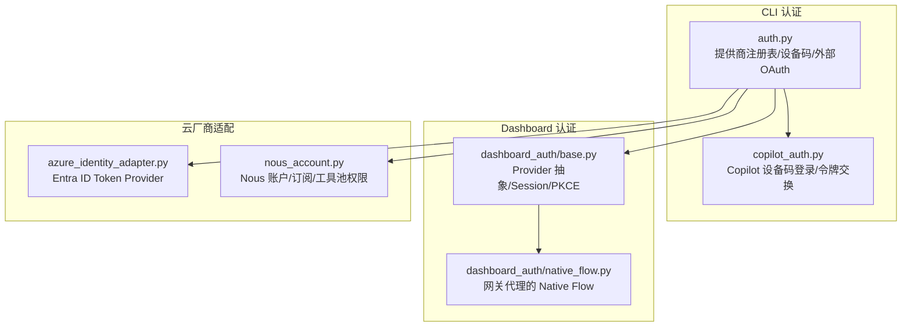
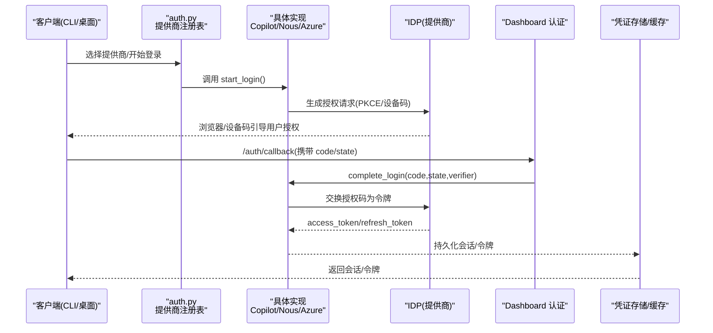
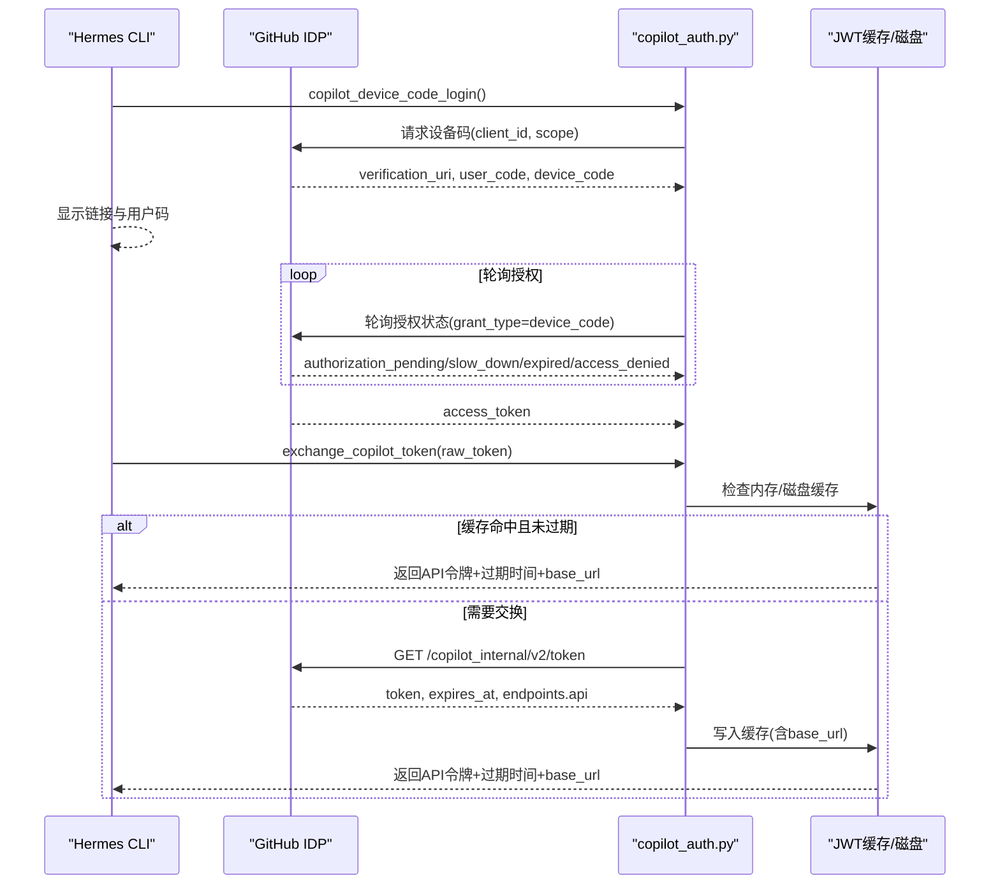
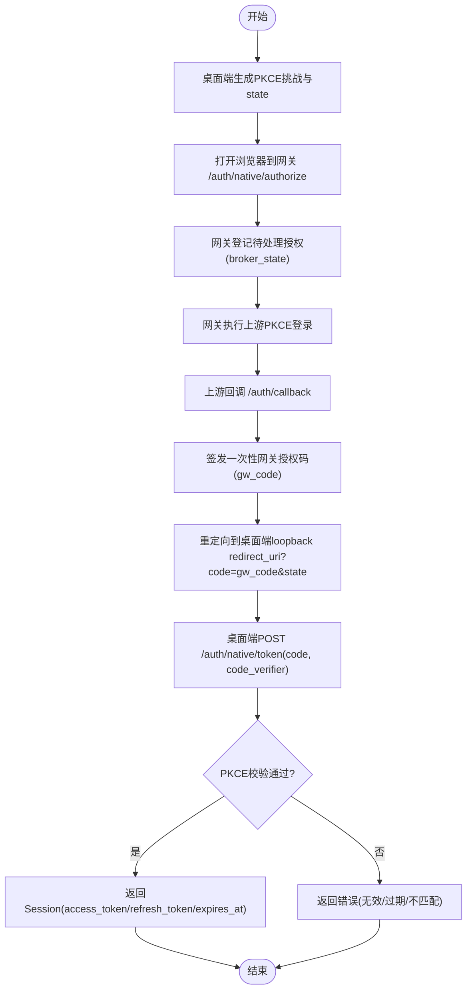
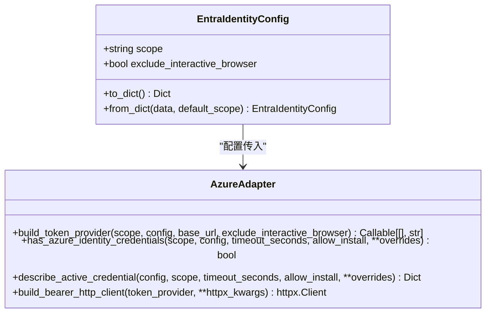
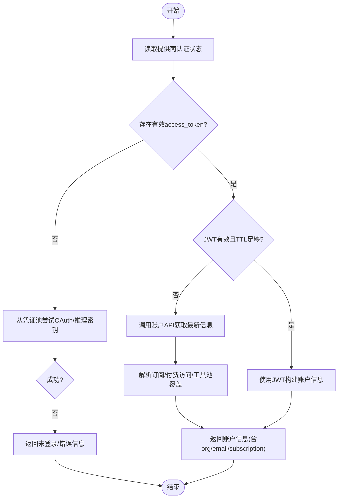
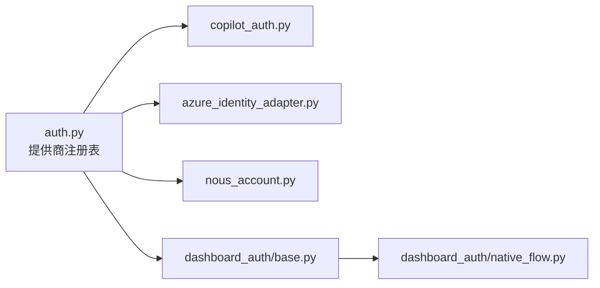

# OAuth 认证

<cite>
**本文引用的文件**
- [hermes_cli/auth.py](file://hermes_cli/auth.py)
- [hermes_cli/copilot_auth.py](file://hermes_cli/copilot_auth.py)
- [agent/azure_identity_adapter.py](file://agent/azure_identity_adapter.py)
- [hermes_cli/dashboard_auth/base.py](file://hermes_cli/dashboard_auth/base.py)
- [hermes_cli/dashboard_auth/native_flow.py](file://hermes_cli/dashboard_auth/native_flow.py)
- [hermes_cli/nous_account.py](file://hermes_cli/nous_account.py)
</cite>

## 目录
1. [简介](#简介)
2. [项目结构](#项目结构)
3. [核心组件](#核心组件)
4. [架构总览](#架构总览)
5. [详细组件分析](#详细组件分析)
6. [依赖关系分析](#依赖关系分析)
7. [性能考量](#性能考量)
8. [故障排查指南](#故障排查指南)
9. [结论](#结论)
10. [附录：提供商配置与集成示例](#附录：提供商配置与集成示例)

## 简介
本文件面向在 Hermes Agent 中集成和使用 OAuth 认证的工程师与运维人员，系统说明已支持的 OAuth 提供商（Nous、GitHub Copilot、Azure Entra ID 等）及其认证流程。文档覆盖 OAuth 2.0 授权码流程、PKCE 扩展、令牌交换、用户信息获取、错误处理、令牌刷新与会话管理，并提供多租户环境下的最佳实践与配置要点。

## 项目结构
围绕 OAuth 的核心代码分布在以下模块：
- CLI 层多提供商认证与注册表：hermes_cli/auth.py
- GitHub Copilot 设备码登录与令牌交换：hermes_cli/copilot_auth.py
- Azure Foundry/Entra ID 无密钥认证适配器：agent/azure_identity_adapter.py
- Dashboard 认证提供者抽象与协议：hermes_cli/dashboard_auth/base.py
- 桌面端原生应用 OAuth 代理流程（RFC 8252）：hermes_cli/dashboard_auth/native_flow.py
- Nous Portal 账户信息与权限解析：hermes_cli/nous_account.py

**图表来源**
- [hermes_cli/auth.py:194-507](file://hermes_cli/auth.py#L194-L507)
- [hermes_cli/copilot_auth.py:181-304](file://hermes_cli/copilot_auth.py#L181-L304)
- [hermes_cli/dashboard_auth/base.py:105-207](file://hermes_cli/dashboard_auth/base.py#L105-L207)
- [hermes_cli/dashboard_auth/native_flow.py:163-290](file://hermes_cli/dashboard_auth/native_flow.py#L163-L290)
- [agent/azure_identity_adapter.py:215-253](file://agent/azure_identity_adapter.py#L215-L253)
- [hermes_cli/nous_account.py:343-449](file://hermes_cli/nous_account.py#L343-L449)

**章节来源**
- [hermes_cli/auth.py:194-507](file://hermes_cli/auth.py#L194-L507)
- [hermes_cli/copilot_auth.py:181-304](file://hermes_cli/copilot_auth.py#L181-L304)
- [agent/azure_identity_adapter.py:215-253](file://agent/azure_identity_adapter.py#L215-L253)
- [hermes_cli/dashboard_auth/base.py:105-207](file://hermes_cli/dashboard_auth/base.py#L105-L207)
- [hermes_cli/dashboard_auth/native_flow.py:163-290](file://hermes_cli/dashboard_auth/native_flow.py#L163-L290)
- [hermes_cli/nous_account.py:343-449](file://hermes_cli/nous_account.py#L343-L449)

## 核心组件
- 提供商注册表与统一解析：通过 ProviderConfig 集中声明各提供商的认证类型、基础 URL、客户端标识、作用域与环境变量，运行时按优先级解析并选择活跃提供商。
- 设备码登录（Device Code）：适用于无浏览器或受限环境的 CLI 场景（如 Nous、Copilot）。
- 外部 OAuth 与令牌交换：对不支持直接 SDK 的提供商，采用外部流程换取短期令牌（如 Copilot 内部令牌交换）。
- Dashboard 认证提供者抽象：定义 start_login/complete_login/verify_session/refresh_session/revoke_session 标准生命周期，支持 PKCE、密码登录与令牌验证扩展点。
- 原生应用 OAuth 代理（Native Flow）：桌面端通过网关代理上游 OAuth，使用 PKCE 与一次性授权码完成安全令牌回传。
- Azure Entra ID 令牌提供者：基于 azure-identity 的 DefaultAzureCredential 链式认证，提供每请求刷新能力。
- Nous 账户与权限：从 JWT 或账户 API 解析订阅、付费访问与工具池覆盖范围，用于功能门控与计费提示。

**章节来源**
- [hermes_cli/auth.py:194-507](file://hermes_cli/auth.py#L194-L507)
- [hermes_cli/copilot_auth.py:181-304](file://hermes_cli/copilot_auth.py#L181-L304)
- [hermes_cli/dashboard_auth/base.py:105-207](file://hermes_cli/dashboard_auth/base.py#L105-L207)
- [hermes_cli/dashboard_auth/native_flow.py:163-290](file://hermes_cli/dashboard_auth/native_flow.py#L163-L290)
- [agent/azure_identity_adapter.py:215-253](file://agent/azure_identity_adapter.py#L215-L253)
- [hermes_cli/nous_account.py:343-449](file://hermes_cli/nous_account.py#L343-L449)

## 架构总览
下图展示了典型的多提供商 OAuth 认证路径：CLI/Dashboard/桌面端发起登录，经由提供商注册表路由到具体实现；Dashboard 提供统一的会话与令牌刷新；Azure 通过可调用令牌提供者实现每请求刷新；Nous 通过 JWT/账户 API 获取账户与权限。

**图表来源**
- [hermes_cli/auth.py:194-507](file://hermes_cli/auth.py#L194-L507)
- [hermes_cli/copilot_auth.py:181-304](file://hermes_cli/copilot_auth.py#L181-L304)
- [hermes_cli/dashboard_auth/base.py:105-207](file://hermes_cli/dashboard_auth/base.py#L105-L207)
- [hermes_cli/dashboard_auth/native_flow.py:163-290](file://hermes_cli/dashboard_auth/native_flow.py#L163-L290)

## 详细组件分析

### 组件A：Copilot 设备码登录与令牌交换
- 设备码流程：请求设备码→展示验证链接与用户码→轮询授权完成→获取访问令牌。
- 令牌交换：将原始 GitHub 令牌交换为 Copilot 内部 API 令牌，附带过期时间与账户专属 base_url；具备进程内与磁盘两级缓存，失败时快速回退至原始令牌。
- 错误处理：区分授权挂起、慢速轮询、过期、拒绝与超时；对网络抖动进行有限重试，对永久拒绝（401/403/404）快速失败并缓存负结果。

**图表来源**
- [hermes_cli/copilot_auth.py:181-304](file://hermes_cli/copilot_auth.py#L181-L304)
- [hermes_cli/copilot_auth.py:480-615](file://hermes_cli/copilot_auth.py#L480-L615)

**章节来源**
- [hermes_cli/copilot_auth.py:181-304](file://hermes_cli/copilot_auth.py#L181-L304)
- [hermes_cli/copilot_auth.py:480-615](file://hermes_cli/copilot_auth.py#L480-L615)

### 组件B：Dashboard 认证提供者抽象与原生流程
- 抽象接口：start_login/complete_login/verify_session/refresh_session/revoke_session，支持 PKCE、密码登录与令牌验证扩展点。
- 原生流程（RFC 8252）：桌面端生成 PKCE 挑战，打开系统浏览器到网关授权端点；网关代理上游 OAuth；回调后签发一次性网关授权码；桌面端用 code_verifier 兑换会话；全程无 Cookie，令牌由桌面端本地保存。
- 安全属性：PKCE 绑定、一次性授权码、短 TTL、高熵句柄、无敏感日志。

**图表来源**
- [hermes_cli/dashboard_auth/base.py:105-207](file://hermes_cli/dashboard_auth/base.py#L105-L207)
- [hermes_cli/dashboard_auth/native_flow.py:163-290](file://hermes_cli/dashboard_auth/native_flow.py#L163-L290)

**章节来源**
- [hermes_cli/dashboard_auth/base.py:105-207](file://hermes_cli/dashboard_auth/base.py#L105-L207)
- [hermes_cli/dashboard_auth/native_flow.py:163-290](file://hermes_cli/dashboard_auth/native_flow.py#L163-L290)

### 组件C：Azure Entra ID 令牌提供者
- 无密钥认证：基于 azure-identity 的 DefaultAzureCredential 链（环境变量服务主体→工作负载身份→托管身份→VS Code→Azure CLI→azd→PowerShell→broker）。
- 每请求刷新：build_token_provider 返回零参可调用对象，OpenAI/Anthropic SDK 在每个请求前调用以获取新鲜 Bearer JWT。
- 诊断与探测：describe_active_credential 与 has_azure_identity_credentials 提供健康检查与诊断信息。

**图表来源**
- [agent/azure_identity_adapter.py:122-171](file://agent/azure_identity_adapter.py#L122-L171)
- [agent/azure_identity_adapter.py:215-253](file://agent/azure_identity_adapter.py#L215-L253)
- [agent/azure_identity_adapter.py:478-556](file://agent/azure_identity_adapter.py#L478-L556)

**章节来源**
- [agent/azure_identity_adapter.py:215-253](file://agent/azure_identity_adapter.py#L215-L253)
- [agent/azure_identity_adapter.py:478-556](file://agent/azure_identity_adapter.py#L478-L556)

### 组件D：Nous 账户与权限解析
- 数据来源：优先使用有效 JWT 的本地快照，必要时调用账户 API 刷新；支持从凭证池读取 OAuth 条目或推理密钥。
- 权限模型：付费访问、订阅层级、工具池覆盖类别（firecrawl/fal/openai-audio/browser-use/modal），用于功能门控与计费提示。
- 错误与提示：当无法验证付费访问或余额不足时，给出清晰的用户指引与账单页链接。

**图表来源**
- [hermes_cli/nous_account.py:343-449](file://hermes_cli/nous_account.py#L343-L449)
- [hermes_cli/nous_account.py:600-685](file://hermes_cli/nous_account.py#L600-L685)

**章节来源**
- [hermes_cli/nous_account.py:343-449](file://hermes_cli/nous_account.py#L343-L449)
- [hermes_cli/nous_account.py:600-685](file://hermes_cli/nous_account.py#L600-L685)

## 依赖关系分析
- 提供商注册表与运行时解析：auth.py 中的 PROVIDER_REGISTRY 集中声明各提供商的认证类型、基础 URL、客户端标识与作用域；resolve_* 函数负责选择与刷新。
- Dashboard 认证提供者：base.py 定义统一接口，native_flow.py 实现桌面端代理流程，确保 PKCE 与一次性授权码的安全属性。
- Azure 适配器：依赖 azure-identity 包，仅在启用 Entra ID 路径时加载；提供诊断与健康检查。
- Nous 账户：依赖 auth.py 提供的认证状态与令牌，结合账户 API 与 JWT 解析权限。

**图表来源**
- [hermes_cli/auth.py:194-507](file://hermes_cli/auth.py#L194-L507)
- [hermes_cli/dashboard_auth/base.py:105-207](file://hermes_cli/dashboard_auth/base.py#L105-L207)
- [hermes_cli/dashboard_auth/native_flow.py:163-290](file://hermes_cli/dashboard_auth/native_flow.py#L163-L290)
- [agent/azure_identity_adapter.py:215-253](file://agent/azure_identity_adapter.py#L215-L253)
- [hermes_cli/nous_account.py:343-449](file://hermes_cli/nous_account.py#L343-L449)

**章节来源**
- [hermes_cli/auth.py:194-507](file://hermes_cli/auth.py#L194-L507)
- [hermes_cli/dashboard_auth/base.py:105-207](file://hermes_cli/dashboard_auth/base.py#L105-L207)
- [hermes_cli/dashboard_auth/native_flow.py:163-290](file://hermes_cli/dashboard_auth/native_flow.py#L163-L290)
- [agent/azure_identity_adapter.py:215-253](file://agent/azure_identity_adapter.py#L215-L253)
- [hermes_cli/nous_account.py:343-449](file://hermes_cli/nous_account.py#L343-L449)

## 性能考量
- 令牌缓存与刷新：
  - Copilot 令牌交换具备进程内与磁盘两级缓存，并在接近过期时提前刷新，减少网络开销。
  - Azure 令牌提供者通过 azure-identity 内部缓存与每请求刷新，避免重复认证。
  - Nous 账户信息使用短 TTL 缓存，优先使用 JWT 快照降低延迟。
- 失败快速回退：
  - Copilot 交换失败时回退到原始令牌，保证基本可用性。
  - 对网络抖动进行有限重试，对永久拒绝快速失败并缓存负结果，避免阻塞启动。
- 资源限制：
  - 原生流程对 pending 与 issued 条目设置容量上限与 TTL，防止恶意滥用。
  - Azure 探针使用线程超时，避免慢令牌服务阻塞调用方。

[本节为通用指导，无需特定文件引用]

## 故障排查指南
- 设备码登录失败：
  - 检查设备码是否过期、用户是否拒绝授权、轮询间隔是否遵循 slow_down 指示。
  - 参考：设备码流程的错误分支与超时处理。
- 令牌交换失败：
  - 检查网络连通性、账户是否具备 Copilot 访问权限、企业代理配置是否正确。
  - 参考：交换失败的重试与负缓存策略。
- Azure 令牌提供者不可用：
  - 确认 azure-identity 已安装、环境变量正确、az login 状态有效。
  - 使用 describe_active_credential 输出诊断信息。
- Nous 账户权限不足：
  - 检查 JWT 或账户 API 返回的付费访问与工具池覆盖；根据提示前往账单页充值或升级。
  - 参考：账户信息解析与错误消息生成。

**章节来源**
- [hermes_cli/copilot_auth.py:181-304](file://hermes_cli/copilot_auth.py#L181-L304)
- [hermes_cli/copilot_auth.py:480-615](file://hermes_cli/copilot_auth.py#L480-L615)
- [agent/azure_identity_adapter.py:261-331](file://agent/azure_identity_adapter.py#L261-L331)
- [hermes_cli/nous_account.py:172-317](file://hermes_cli/nous_account.py#L172-L317)

## 结论
Hermes Agent 的 OAuth 体系通过统一的提供商注册表与抽象接口，实现了多提供商的一致体验与安全特性（PKCE、一次性授权码、短 TTL、缓存与刷新）。针对 CLI、Dashboard 与桌面端的不同场景，提供了设备码登录、令牌交换与原生流程代理。Azure 的无密钥认证与 Nous 的账户权限解析进一步增强了企业级与商业化场景的支持。建议在生产环境中结合缓存、重试与诊断工具，确保高可用与可观测性。

[本节为总结，无需特定文件引用]

## 附录：提供商配置与集成示例
- Nous Portal（设备码/OAuth）
  - 关键参数：portal_base_url、inference_base_url、client_id、scope（如 inference:invoke）、设备码源标识。
  - 回调 URL：网关 /auth/callback，需与提供商注册表一致。
  - 权限范围：依据业务需求最小化授权（如仅推理调用）。
  - 参考：提供商注册表与账户信息解析。
- GitHub Copilot（设备码/令牌交换）
  - 关键参数：client_id、scope（read:user）、设备码轮询间隔与超时。
  - 令牌交换：/copilot_internal/v2/token，返回 API 令牌、过期时间与账户专属 base_url。
  - 回调 URL：桌面端 loopback 地址，由 native_flow 代理。
  - 参考：设备码登录与交换流程。
- Azure Foundry/Entra ID（无密钥）
  - 关键参数：scope（https://ai.azure.com/.default）、exclude_interactive_browser、AZURE_* 环境变量。
  - 集成方式：将 build_token_provider 返回值作为 api_key 传入 OpenAI/Anthropic SDK，实现每请求刷新。
  - 参考：令牌提供者构建与 HTTP 注入。
- Dashboard 认证提供者（自定义）
  - 实现 start_login/complete_login/verify_session/refresh_session/revoke_session。
  - 支持 PKCE、密码登录与令牌验证扩展点。
  - 参考：抽象接口与协议合规检查。

**章节来源**
- [hermes_cli/auth.py:194-507](file://hermes_cli/auth.py#L194-L507)
- [hermes_cli/copilot_auth.py:181-304](file://hermes_cli/copilot_auth.py#L181-L304)
- [hermes_cli/copilot_auth.py:480-615](file://hermes_cli/copilot_auth.py#L480-L615)
- [agent/azure_identity_adapter.py:215-253](file://agent/azure_identity_adapter.py#L215-L253)
- [hermes_cli/dashboard_auth/base.py:105-207](file://hermes_cli/dashboard_auth/base.py#L105-L207)