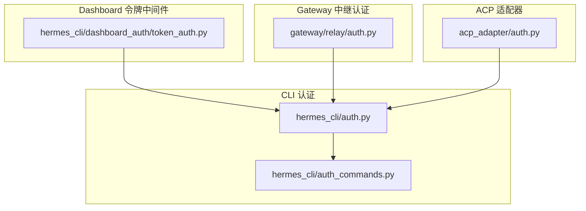
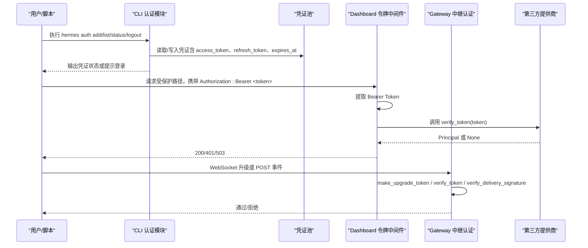
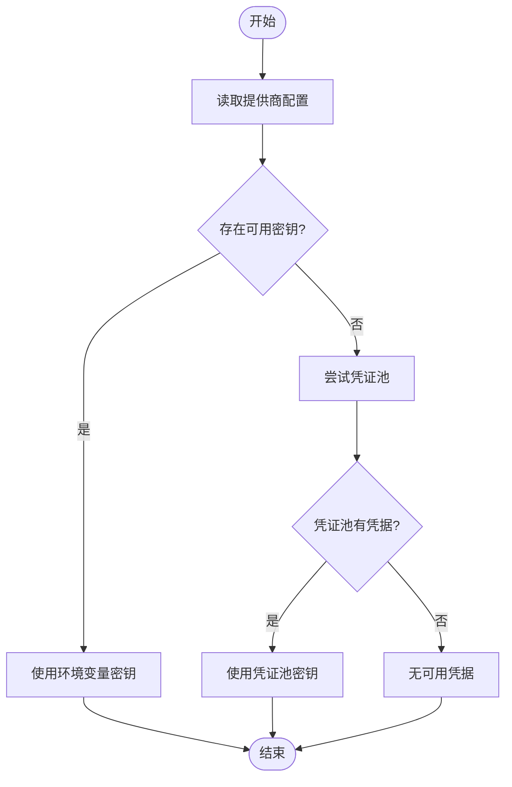
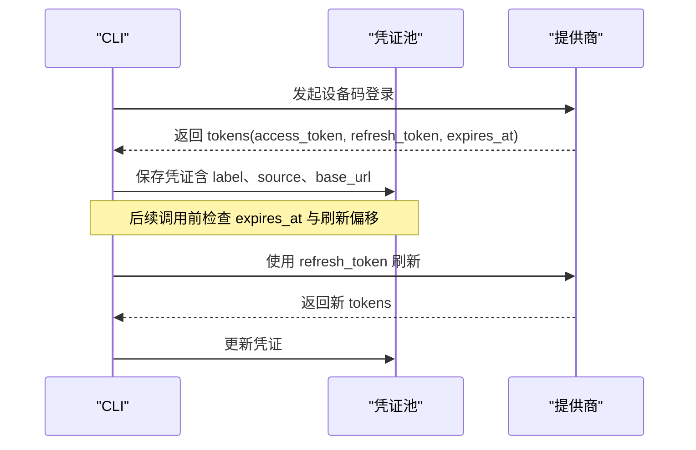
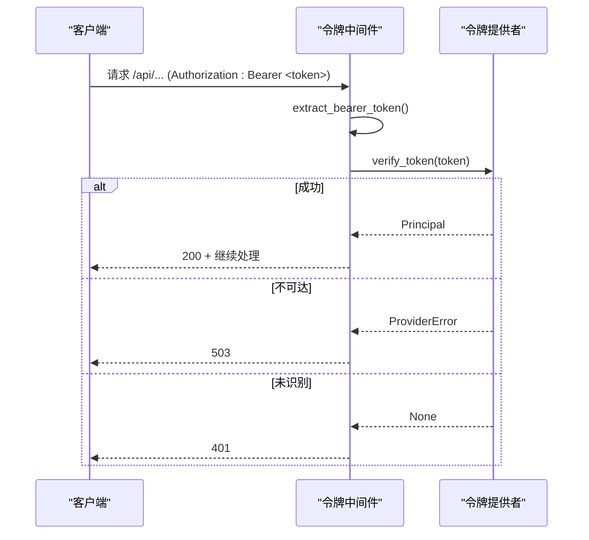
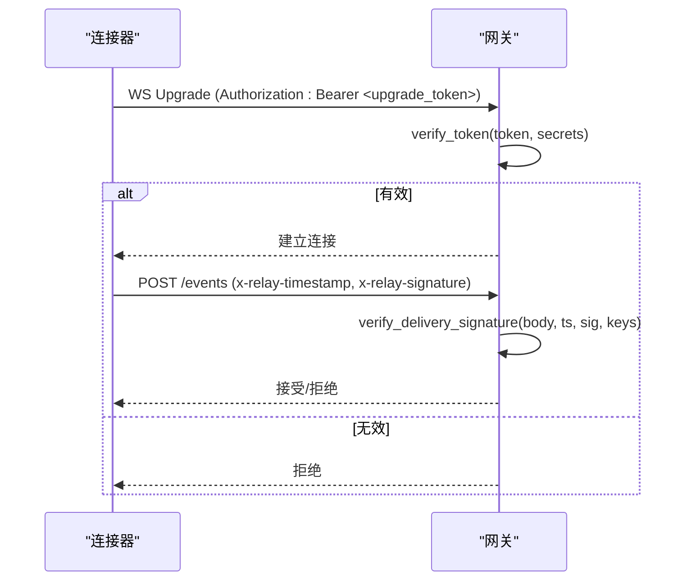
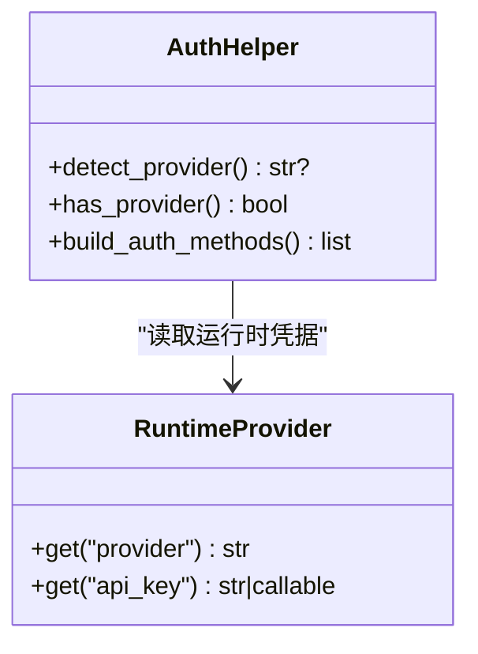
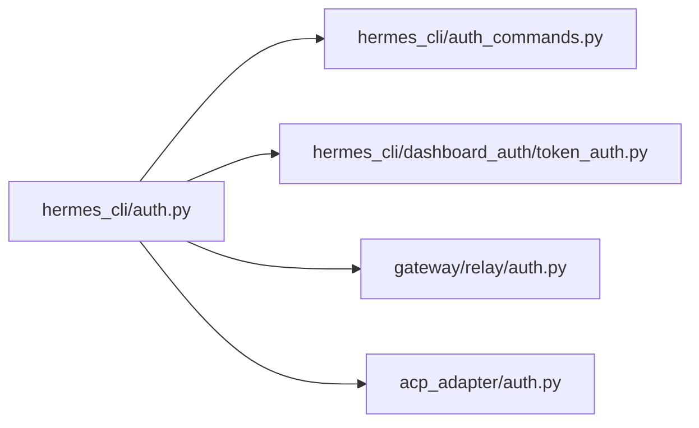

# 令牌认证

<cite>
**本文引用的文件**
- [hermes_cli/auth.py](file://hermes_cli/auth.py)
- [hermes_cli/auth_commands.py](file://hermes_cli/auth_commands.py)
- [hermes_cli/dashboard_auth/token_auth.py](file://hermes_cli/dashboard_auth/token_auth.py)
- [gateway/relay/auth.py](file://gateway/relay/auth.py)
- [acp_adapter/auth.py](file://acp_adapter/auth.py)
</cite>

## 目录
1. [简介](#简介)
2. [项目结构](#项目结构)
3. [核心组件](#核心组件)
4. [架构总览](#架构总览)
5. [详细组件分析](#详细组件分析)
6. [依赖关系分析](#依赖关系分析)
7. [性能考虑](#性能考虑)
8. [故障排查指南](#故障排查指南)
9. [结论](#结论)
10. [附录](#附录)

## 简介
本文件面向“令牌认证”主题，系统化说明本项目中三类认证机制：API 密钥认证、JWT/访问令牌验证与会话令牌管理。内容覆盖令牌的生成、存储、验证与刷新；作用域控制、过期策略与安全考量；命令行操作、API 调用中的令牌传递与错误处理；以及为自动化脚本和系统集成提供的最佳实践。

## 项目结构
围绕令牌认证的关键代码分布在以下模块：
- CLI 多提供商认证与凭证池管理：hermes_cli/auth.py、hermes_cli/auth_commands.py
- Dashboard 非交互式 Bearer 令牌认证中间件：hermes_cli/dashboard_auth/token_auth.py
- Gateway 中继通道 HMAC 令牌与签名校验：gateway/relay/auth.py
- ACP 适配器认证能力探测与声明：acp_adapter/auth.py

**图表来源**
- [hermes_cli/auth.py:194-507](file://hermes_cli/auth.py#L194-L507)
- [hermes_cli/auth_commands.py:164-434](file://hermes_cli/auth_commands.py#L164-L434)
- [hermes_cli/dashboard_auth/token_auth.py:60-195](file://hermes_cli/dashboard_auth/token_auth.py#L60-L195)
- [gateway/relay/auth.py:51-169](file://gateway/relay/auth.py#L51-L169)
- [acp_adapter/auth.py:11-79](file://acp_adapter/auth.py#L11-L79)

**章节来源**
- [hermes_cli/auth.py:194-507](file://hermes_cli/auth.py#L194-L507)
- [hermes_cli/auth_commands.py:164-434](file://hermes_cli/auth_commands.py#L164-L434)
- [hermes_cli/dashboard_auth/token_auth.py:60-195](file://hermes_cli/dashboard_auth/token_auth.py#L60-L195)
- [gateway/relay/auth.py:51-169](file://gateway/relay/auth.py#L51-L169)
- [acp_adapter/auth.py:11-79](file://acp_adapter/auth.py#L11-L79)

## 核心组件
- 多提供商注册表与密钥解析：集中定义各提供商的鉴权类型、基础 URL、环境变量键与作用域，支持 API Key、OAuth Device Code、外部 OAuth、AWS SDK、Vertex 等模式。
- 凭证池与命令：提供添加、列出、移除、重置、状态查看与登出等操作，支持多种提供商的 OAuth 流程与 API Key 录入。
- Dashboard 令牌中间件：对已注册的精确路径进行 Bearer Token 认证，支持多提供者堆叠、不可达时返回 503、未识别时返回 401。
- Gateway 中继认证：使用 HMAC 签名的升级令牌与入站投递签名，支持密钥轮换与重放窗口检查。
- ACP 适配器认证探测：检测当前运行时提供商与凭据可用性，并对外声明可用的认证方法。

**章节来源**
- [hermes_cli/auth.py:194-507](file://hermes_cli/auth.py#L194-L507)
- [hermes_cli/auth_commands.py:164-434](file://hermes_cli/auth_commands.py#L164-L434)
- [hermes_cli/dashboard_auth/token_auth.py:60-195](file://hermes_cli/dashboard_auth/token_auth.py#L60-L195)
- [gateway/relay/auth.py:51-169](file://gateway/relay/auth.py#L51-L169)
- [acp_adapter/auth.py:11-79](file://acp_adapter/auth.py#L11-L79)

## 架构总览
下图展示了从 CLI 到 Dashboard 与 Gateway 的令牌流转与验证路径。

**图表来源**
- [hermes_cli/auth_commands.py:164-434](file://hermes_cli/auth_commands.py#L164-L434)
- [hermes_cli/dashboard_auth/token_auth.py:90-195](file://hermes_cli/dashboard_auth/token_auth.py#L90-L195)
- [gateway/relay/auth.py:83-169](file://gateway/relay/auth.py#L83-L169)

## 详细组件分析

### 组件一：API 密钥认证与提供商注册
- 提供商注册表集中声明鉴权类型、基础 URL、环境变量键与作用域，便于统一解析与自动扩展。
- 密钥解析优先顺序：本地 .env > 进程环境 > 凭证池，避免被父进程污染。
- 特殊提供商（如 Copilot、Kimi、Z.AI）具备端点探测或专用解析逻辑，确保选择正确的推理端点。

**图表来源**
- [hermes_cli/auth.py:630-671](file://hermes_cli/auth.py#L630-L671)
- [hermes_cli/auth.py:194-507](file://hermes_cli/auth.py#L194-L507)

**章节来源**
- [hermes_cli/auth.py:194-507](file://hermes_cli/auth.py#L194-L507)
- [hermes_cli/auth.py:630-671](file://hermes_cli/auth.py#L630-L671)

### 组件二：JWT/访问令牌验证与刷新
- 支持多种 OAuth 设备码流程（Nous、OpenAI Codex、xAI、Qwen、MiniMax），将 access_token、refresh_token、expires_at 持久化到凭证池。
- 刷新策略：在过期前一定时间提前刷新，减少运行期失效；不同提供商有不同的刷新偏移量。
- 作用域控制：按提供商定义 scope，例如 Nous 的 inference:invoke、billing:manage 等。

**图表来源**
- [hermes_cli/auth_commands.py:250-434](file://hermes_cli/auth_commands.py#L250-L434)
- [hermes_cli/auth.py:71-132](file://hermes_cli/auth.py#L71-L132)

**章节来源**
- [hermes_cli/auth_commands.py:250-434](file://hermes_cli/auth_commands.py#L250-L434)
- [hermes_cli/auth.py:71-132](file://hermes_cli/auth.py#L71-L132)

### 组件三：Dashboard 会话令牌管理（Bearer Token 中间件）
- 路由级白名单：仅对显式注册的路径启用令牌认证，避免扩大攻击面。
- 提供者堆叠：按注册顺序依次验证，任一提供者接受即放行；若所有提供者不可达则返回 503，否则返回 401。
- 审计日志：失败时记录原因、路径与客户端 IP。

**图表来源**
- [hermes_cli/dashboard_auth/token_auth.py:60-195](file://hermes_cli/dashboard_auth/token_auth.py#L60-L195)

**章节来源**
- [hermes_cli/dashboard_auth/token_auth.py:60-195](file://hermes_cli/dashboard_auth/token_auth.py#L60-L195)

### 组件四：Gateway 中继认证（HMAC 令牌与签名）
- 升级令牌：WebSocket 升级时使用 Authorization: Bearer <token>，token 由 gateway_id 与 secret 生成，带 TTL。
- 入站投递签名：连接器对每个 POST 用 delivery key 签名，网关校验 x-relay-timestamp 与 x-relay-signature，防止重放。
- 密钥轮换：支持多密钥验证列表，主密钥优先，次密钥用于轮换窗口，保证不中断服务。

**图表来源**
- [gateway/relay/auth.py:83-169](file://gateway/relay/auth.py#L83-L169)

**章节来源**
- [gateway/relay/auth.py:83-169](file://gateway/relay/auth.py#L83-L169)

### 组件五：ACP 适配器认证能力探测
- 检测当前运行时提供商与凭据可用性，支持字符串密钥或可调用密钥（如 Azure Foundry Entra ID）。
- 对外声明认证方法：当已有凭据时，声明对应提供商的运行时凭据方法；否则提供终端设置方法引导用户配置。

**图表来源**
- [acp_adapter/auth.py:11-79](file://acp_adapter/auth.py#L11-L79)

**章节来源**
- [acp_adapter/auth.py:11-79](file://acp_adapter/auth.py#L11-L79)

## 依赖关系分析
- CLI 认证模块依赖提供商注册表与环境变量解析，支撑 API Key 与 OAuth 流程。
- Dashboard 令牌中间件依赖令牌提供者接口，实现路由级 Bearer Token 认证。
- Gateway 中继认证依赖 HMAC 工具函数与密钥轮换策略，保障连接器与网关间通信安全。
- ACP 适配器依赖运行时提供商解析，以正确声明认证能力。

**图表来源**
- [hermes_cli/auth.py:194-507](file://hermes_cli/auth.py#L194-L507)
- [hermes_cli/auth_commands.py:164-434](file://hermes_cli/auth_commands.py#L164-L434)
- [hermes_cli/dashboard_auth/token_auth.py:60-195](file://hermes_cli/dashboard_auth/token_auth.py#L60-L195)
- [gateway/relay/auth.py:51-169](file://gateway/relay/auth.py#L51-L169)
- [acp_adapter/auth.py:11-79](file://acp_adapter/auth.py#L11-L79)

**章节来源**
- [hermes_cli/auth.py:194-507](file://hermes_cli/auth.py#L194-L507)
- [hermes_cli/auth_commands.py:164-434](file://hermes_cli/auth_commands.py#L164-L434)
- [hermes_cli/dashboard_auth/token_auth.py:60-195](file://hermes_cli/dashboard_auth/token_auth.py#L60-L195)
- [gateway/relay/auth.py:51-169](file://gateway/relay/auth.py#L51-L169)
- [acp_adapter/auth.py:11-79](file://acp_adapter/auth.py#L11-L79)

## 性能考虑
- 令牌刷新偏移：为长生命周期工作负载（如网关/定时任务）设置较大的提前刷新窗口，避免短暂失效导致的抖动。
- 并行端点探测：对 Z.AI 等多端点场景采用线程池并行探测，快速选择可用端点并尽早返回。
- 中间件短路：Dashboard 令牌中间件在未注册路径直接放行，降低无关请求的开销。
- 密钥轮换：支持多密钥验证列表，避免轮换期间出现断流。

[本节为通用指导，不直接分析具体文件]

## 故障排查指南
- 401 未认证：检查是否向已注册路径发送了有效的 Bearer Token；确认令牌提供者是否识别该令牌。
- 503 服务不可用：令牌提供者后端不可达；检查网络与提供者健康状态。
- 令牌过期：确认 expires_at 与刷新偏移；必要时触发 refresh_token 刷新流程。
- 中继签名失败：核对 x-relay-timestamp 与 x-relay-signature；检查密钥轮换窗口与重放容忍度。
- 提供商选择错误：对于 Kimi/Z.AI 等特殊提供商，确认端点探测结果与 base_url 设置。

**章节来源**
- [hermes_cli/dashboard_auth/token_auth.py:104-195](file://hermes_cli/dashboard_auth/token_auth.py#L104-L195)
- [gateway/relay/auth.py:109-169](file://gateway/relay/auth.py#L109-L169)
- [hermes_cli/auth.py:734-800](file://hermes_cli/auth.py#L734-L800)

## 结论
本项目实现了覆盖 CLI、Dashboard 与 Gateway 的多层次令牌认证体系：以提供商注册表为核心，结合凭证池管理与中间件化验证，既支持灵活的 API Key 与 OAuth 流程，又提供了安全的中继通道认证。通过作用域控制、过期策略与密钥轮换，满足生产环境的稳定性与安全性要求。

[本节为总结性内容，不直接分析具体文件]

## 附录

### 命令行令牌操作速查
- 添加凭据：hermes auth add <provider> [--type api-key|oauth] [--label <name>]
- 列出凭据：hermes auth list [--provider <name>]
- 移除凭据：hermes auth remove <provider> [--target <index|id|label>]
- 重置冷却：hermes auth reset <provider>
- 查看状态：hermes auth status <provider>
- 登出：hermes auth logout <provider>

**章节来源**
- [hermes_cli/auth_commands.py:164-531](file://hermes_cli/auth_commands.py#L164-L531)

### API 调用中的令牌传递
- Dashboard 受保护路径：在请求头中携带 Authorization: Bearer <token>，路径需预先注册为令牌认证路径。
- Gateway 中继：
  - WebSocket 升级：Authorization: Bearer <upgrade_token>
  - 入站事件：x-relay-timestamp、x-relay-signature 与 body 一致

**章节来源**
- [hermes_cli/dashboard_auth/token_auth.py:90-195](file://hermes_cli/dashboard_auth/token_auth.py#L90-L195)
- [gateway/relay/auth.py:83-169](file://gateway/relay/auth.py#L83-L169)

### 作用域控制与过期策略
- 作用域：按提供商定义 scope，如 Nous 的 inference:invoke、billing:manage；最小权限原则。
- 过期策略：access token 过期前一定时间刷新；不同提供商有不同偏移量；网关中继使用 TTL 与重放窗口。

**章节来源**
- [hermes_cli/auth.py:71-132](file://hermes_cli/auth.py#L71-L132)
- [gateway/relay/auth.py:83-169](file://gateway/relay/auth.py#L83-L169)

### 安全考虑
- 默认拒绝：未配置允许列表或未识别令牌时拒绝访问。
- 密钥轮换：支持多密钥验证列表，避免单点失效。
- 重放防护：网关中继校验时间戳与签名，限制重放窗口。
- 敏感信息脱敏：错误输出与日志中避免泄露密钥形状字符串。

**章节来源**
- [hermes_cli/dashboard_auth/token_auth.py:144-195](file://hermes_cli/dashboard_auth/token_auth.py#L144-L195)
- [gateway/relay/auth.py:142-169](file://gateway/relay/auth.py#L142-L169)

### 自动化脚本与系统集成最佳实践
- 使用凭证池管理多凭据与轮换策略，避免硬编码密钥。
- 在脚本中显式设置 Authorization 头或使用 SDK 提供的凭据注入方式。
- 监控令牌过期与刷新失败，及时告警与重试。
- 对网关中继使用独立密钥与严格的时间同步，确保签名校验通过。

[本节为通用指导，不直接分析具体文件]