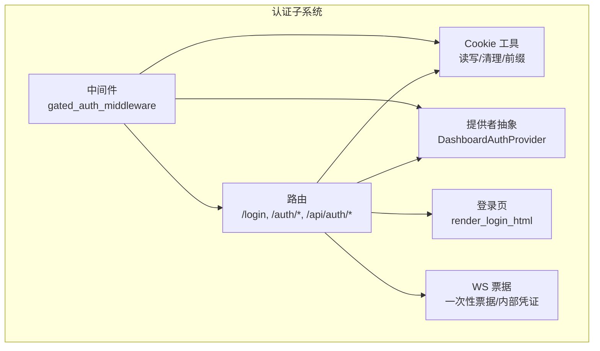
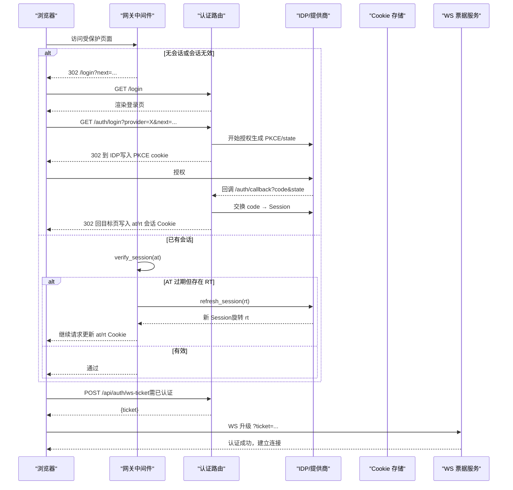
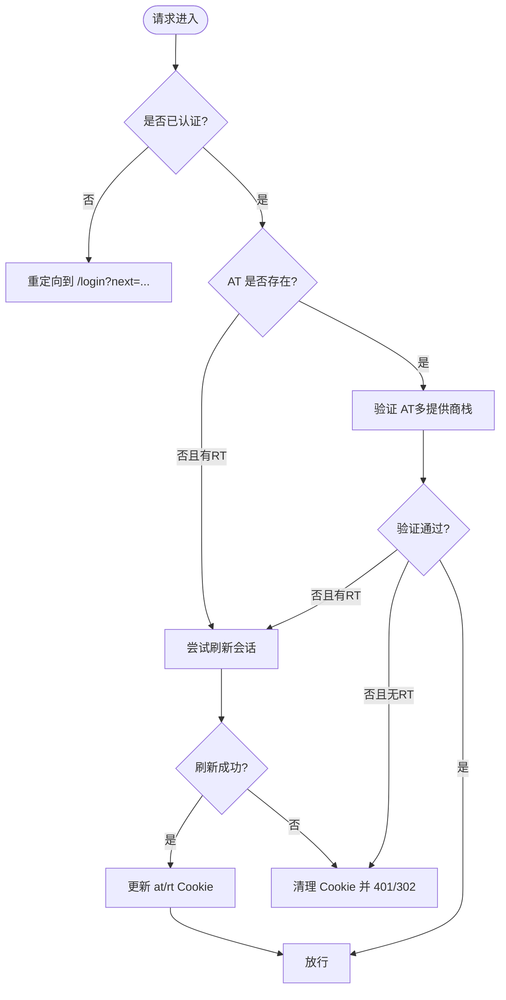
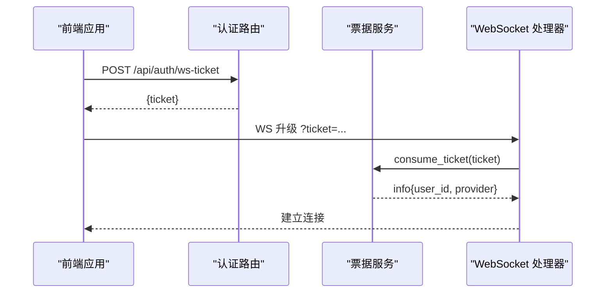
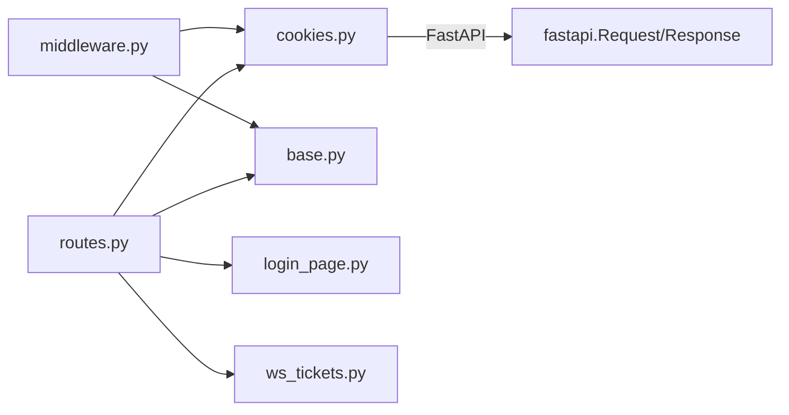

# 会话认证

<cite>
**本文引用的文件**
- [dashboard_auth/base.py](file://hermes_cli/dashboard_auth/base.py)
- [dashboard_auth/cookies.py](file://hermes_cli/dashboard_auth/cookies.py)
- [dashboard_auth/middleware.py](file://hermes_cli/dashboard_auth/middleware.py)
- [dashboard_auth/routes.py](file://hermes_cli/dashboard_auth/routes.py)
- [dashboard_auth/login_page.py](file://hermes_cli/dashboard_auth/login_page.py)
- [dashboard_auth/ws_tickets.py](file://hermes_cli/dashboard_auth/ws_tickets.py)
</cite>

## 目录
1. [简介](#简介)
2. [项目结构](#项目结构)
3. [核心组件](#核心组件)
4. [架构总览](#架构总览)
5. [详细组件分析](#详细组件分析)
6. [依赖关系分析](#依赖关系分析)
7. [性能考虑](#性能考虑)
8. [故障排查指南](#故障排查指南)
9. [结论](#结论)
10. [附录](#附录)

## 简介
本文件系统性说明基于 Cookie 的会话管理、登录页面流程与 WebSocket 票据系统，覆盖会话创建、维护与销毁全过程；解释会话安全属性（HttpOnly、SameSite、Secure、前缀策略）、跨站请求伪造防护（PKCE/state 校验、CSRF nonce）与会话固定攻击防护（短生命周期 PKCE cookie、刷新令牌轮换）；并给出登录页自定义、会话超时处理与自动重定向机制的实现要点。最后提供配置选项与安全建议，以及 Web 应用集成最佳实践。

## 项目结构
该子系统位于 hermes_cli/dashboard_auth 下，围绕“提供者抽象 + 中间件门控 + 路由 + Cookie 工具 + WS 票据”组织：
- base.py：定义 Session、TokenPrincipal、LoginStart 等数据模型与 DashboardAuthProvider 抽象协议，统一 OAuth/密码/令牌三种认证路径。
- cookies.py：封装三类会话 Cookie（访问令牌、刷新令牌、PKCE/SSO 标记），实现前缀选择、读写与清理。
- middleware.py：网关式鉴权中间件，负责白名单放行、Cookie/Bearer 验证、透明刷新、未认证重定向与审计。
- routes.py：登录页、OAuth 往返、密码登录、注销、WS 票据发放等 HTTP 路由。
- login_page.py：无 JS 依赖的服务器渲染登录页，支持 OAuth 按钮与密码表单。
- ws_tickets.py：一次性浏览器票据与进程级内部凭证，用于 WebSocket 升级鉴权。

图表来源
- [dashboard_auth/middleware.py:323-531](file://hermes_cli/dashboard_auth/middleware.py#L323-L531)
- [dashboard_auth/routes.py:132-558](file://hermes_cli/dashboard_auth/routes.py#L132-L558)
- [dashboard_auth/cookies.py:166-237](file://hermes_cli/dashboard_auth/cookies.py#L166-L237)
- [dashboard_auth/base.py:105-270](file://hermes_cli/dashboard_auth/base.py#L105-L270)
- [dashboard_auth/ws_tickets.py:62-153](file://hermes_cli/dashboard_auth/ws_tickets.py#L62-L153)
- [dashboard_auth/login_page.py:458-498](file://hermes_cli/dashboard_auth/login_page.py#L458-L498)

章节来源
- [dashboard_auth/base.py:105-270](file://hermes_cli/dashboard_auth/base.py#L105-L270)
- [dashboard_auth/cookies.py:1-105](file://hermes_cli/dashboard_auth/cookies.py#L1-L105)
- [dashboard_auth/middleware.py:1-164](file://hermes_cli/dashboard_auth/middleware.py#L1-L164)
- [dashboard_auth/routes.py:1-175](file://hermes_cli/dashboard_auth/routes.py#L1-L175)
- [dashboard_auth/login_page.py:1-50](file://hermes_cli/dashboard_auth/login_page.py#L1-L50)
- [dashboard_auth/ws_tickets.py:1-56](file://hermes_cli/dashboard_auth/ws_tickets.py#L1-L56)

## 核心组件
- 提供者抽象（base.py）
  - Session：已验证身份的数据载体（用户标识、邮箱、显示名、组织、提供商、过期时间、访问/刷新令牌）。
  - TokenPrincipal：非交互式服务调用者的令牌主体。
  - LoginStart：OAuth 第一步返回的重定向 URL 与短期 Cookie 载荷（PKCE/CSRF）。
  - DashboardAuthProvider：统一接口 start_login/complete_login/verify_session/refresh_session/revoke_session，可选 supports_password/supports_token/supports_session。
- Cookie 工具（cookies.py）
  - 三类 Cookie：hermes_session_at（访问令牌）、hermes_session_rt（刷新令牌）、hermes_session_pkce（PKCE/CSRF/provider/next）。
  - 安全属性：HttpOnly、SameSite=Lax、Secure（仅 HTTPS）、前缀策略（__Host-/__Secure-/裸名）与 Path 绑定。
  - 辅助：读取/设置/清理、自动 SSO 尝试标记、HTTPS 检测。
- 中间件（middleware.py）
  - 白名单放行（/auth/*、/login、静态资源等）。
  - 优先 Bearer 验证（桌面端），否则读 Cookie；未认证时 API 返回 401 JSON，HTML 重定向到 /login。
  - 多提供商栈验证与提示排序；失败时尝试刷新；不可达提供商不强制登出。
  - 自动 SSO 重定向（单提供商且为 OAuth）与防环标记。
- 路由（routes.py）
  - GET /login：渲染登录页（可带 next=）。
  - GET /auth/login?provider=N：发起 OAuth，写入 PKCE cookie。
  - GET /auth/callback：校验 state/PKCE，完成授权，写会话 Cookie 或颁发本地授权码（桌面端）。
  - POST /auth/password-login：密码登录，限流保护，成功后写会话 Cookie。
  - POST /auth/logout：撤销刷新令牌（尽力而为），清理 Cookie。
  - POST /api/auth/ws-ticket：为已认证会话签发一次性 WS 票据。
- 登录页（login_page.py）
  - 纯 HTML/CSS，无 JS 依赖（密码模式内联脚本）。
  - 动态列出支持的提供商，支持密码表单与 OAuth 跳转。
- WS 票据（ws_tickets.py）
  - 一次性票据：TTL 30 秒，绑定 user_id/provider，消费即失效。
  - 进程级内部凭证：稳定、多用途、永不失效，仅用于服务端派生子进程连接。

章节来源
- [dashboard_auth/base.py:10-103](file://hermes_cli/dashboard_auth/base.py#L10-L103)
- [dashboard_auth/cookies.py:166-237](file://hermes_cli/dashboard_auth/cookies.py#L166-L237)
- [dashboard_auth/middleware.py:323-531](file://hermes_cli/dashboard_auth/middleware.py#L323-L531)
- [dashboard_auth/routes.py:132-558](file://hermes_cli/dashboard_auth/routes.py#L132-L558)
- [dashboard_auth/login_page.py:458-498](file://hermes_cli/dashboard_auth/login_page.py#L458-L498)
- [dashboard_auth/ws_tickets.py:62-153](file://hermes_cli/dashboard_auth/ws_tickets.py#L62-L153)

## 架构总览
下图展示从浏览器访问受保护页面到最终建立 WebSocket 连接的完整认证链路，包括 Cookie 会话、自动刷新与 WS 票据。

图表来源
- [dashboard_auth/middleware.py:323-531](file://hermes_cli/dashboard_auth/middleware.py#L323-L531)
- [dashboard_auth/routes.py:182-558](file://hermes_cli/dashboard_auth/routes.py#L182-L558)
- [dashboard_auth/cookies.py:166-237](file://hermes_cli/dashboard_auth/cookies.py#L166-L237)
- [dashboard_auth/ws_tickets.py:62-153](file://hermes_cli/dashboard_auth/ws_tickets.py#L62-L153)

## 详细组件分析

### 会话创建与维护（OAuth 与密码登录）
- OAuth 流程
  - /auth/login：生成 PKCE/state，写入短期 PKCE cookie（含 provider、next），重定向至 IDP。
  - /auth/callback：校验 state 与 PKCE，换取 Session，设置 at/rt Cookie（按 HTTPS 与代理前缀选择名称与 Path），清理 PKCE 与 SSO 尝试标记。
- 密码登录
  - /auth/password-login：滑动窗口限流，调用提供商 complete_password_login，成功后设置 at/rt Cookie，返回 JSON 供前端导航。
- 会话维护
  - 中间件每次请求验证 at；若缺失但存在 rt，则尝试刷新；成功则更新 at/rt 并重放请求。
  - 多提供商栈：按提示排序依次验证/刷新；任一提供商不可达不会强制登出，仅在全部不可达时返回 503。

图表来源
- [dashboard_auth/middleware.py:375-517](file://hermes_cli/dashboard_auth/middleware.py#L375-L517)
- [dashboard_auth/routes.py:182-558](file://hermes_cli/dashboard_auth/routes.py#L182-L558)
- [dashboard_auth/cookies.py:166-237](file://hermes_cli/dashboard_auth/cookies.py#L166-L237)

章节来源
- [dashboard_auth/routes.py:182-558](file://hermes_cli/dashboard_auth/routes.py#L182-L558)
- [dashboard_auth/middleware.py:375-517](file://hermes_cli/dashboard_auth/middleware.py#L375-L517)
- [dashboard_auth/cookies.py:166-237](file://hermes_cli/dashboard_auth/cookies.py#L166-L237)

### 会话销毁（注销与过期）
- 注销：POST /auth/logout 尽力撤销刷新令牌，清理所有会话相关 Cookie（兼容不同前缀与 Path），重定向到 /login。
- 过期：AT 过期后由中间件尝试用 RT 刷新；若刷新失败或无 RT，则清理 Cookie 并返回未认证响应。

章节来源
- [dashboard_auth/routes.py:742-770](file://hermes_cli/dashboard_auth/routes.py#L742-L770)
- [dashboard_auth/middleware.py:450-517](file://hermes_cli/dashboard_auth/middleware.py#L450-L517)
- [dashboard_auth/cookies.py:215-237](file://hermes_cli/dashboard_auth/cookies.py#L215-L237)

### 会话安全属性与防护
- Cookie 安全
  - HttpOnly：防止 XSS 读取。
  - SameSite=Lax：允许顶级导航携带，阻断跨站 CSRF。
  - Secure：仅在 HTTPS 时设置，开发环境（HTTP）不启用以避免锁定。
  - 前缀策略：根据部署形态选择 __Host-（直连 HTTPS）、__Secure-（反向代理前缀）或裸名（HTTP 开发）。
  - Path：与 X-Forwarded-Prefix 一致，避免泄漏到其他应用。
- CSRF 防护
  - PKCE/state 校验：/auth/login 写入短期 PKCE cookie，/auth/callback 严格比对 state，拒绝非法回调。
  - next 参数校验：登录前后对 next 进行同源校验，禁止开放重定向。
- 会话固定攻击防护
  - 短期 PKCE cookie（10 分钟）+ 刷新令牌轮换（Portal 侧 24h 轮转），降低固定风险。
  - 注销时清理所有 Cookie 变体，避免残留。
- 其他
  - 密码登录限流：每 IP 滑动窗口限制尝试次数，抵御暴力破解。
  - 多提供商不可达不强制登出：避免误判导致频繁重登录。

章节来源
- [dashboard_auth/cookies.py:1-105](file://hermes_cli/dashboard_auth/cookies.py#L1-L105)
- [dashboard_auth/routes.py:379-458](file://hermes_cli/dashboard_auth/routes.py#L379-L458)
- [dashboard_auth/routes.py:561-592](file://hermes_cli/dashboard_auth/routes.py#L561-L592)
- [dashboard_auth/routes.py:609-639](file://hermes_cli/dashboard_auth/routes.py#L609-L639)
- [dashboard_auth/middleware.py:421-448](file://hermes_cli/dashboard_auth/middleware.py#L421-L448)

### 登录页面自定义
- 登录页由服务器渲染，无外部 JS 依赖，样式与品牌一致。
- 动态列出支持的提供商：OAuth 按钮或密码表单（supports_password）。
- 支持 next= 透传，登录后回到原页面。
- 可替换 providers 列表与文案（通过注册提供商的 name/display_name）。

章节来源
- [dashboard_auth/login_page.py:458-498](file://hermes_cli/dashboard_auth/login_page.py#L458-L498)
- [dashboard_auth/routes.py:132-175](file://hermes_cli/dashboard_auth/routes.py#L132-L175)

### 会话超时处理与自动重定向
- 会话超时：AT 过期后中间件尝试用 RT 刷新；失败则清理 Cookie 并返回未认证。
- 自动重定向：当仅有一个 OAuth 提供商且无会话时，中间件自动 302 到 /auth/login（携带 provider），减少点击；使用一次性的 SSO_ATTEMPT_COOKIE 防环。

章节来源
- [dashboard_auth/middleware.py:166-241](file://hermes_cli/dashboard_auth/middleware.py#L166-L241)
- [dashboard_auth/middleware.py:375-448](file://hermes_cli/dashboard_auth/middleware.py#L375-L448)
- [dashboard_auth/cookies.py:293-327](file://hermes_cli/dashboard_auth/cookies.py#L293-L327)

### WebSocket 票据系统
- 浏览器侧：已认证会话 POST /api/auth/ws-ticket 获取一次性 ticket（TTL 30s），在 WS 升级时以 ?ticket= 传递。
- 服务端：consume_ticket 校验并消费，绑定 user_id/provider；错误时抛出 TicketInvalid。
- 内部侧：internal_ws_credential 为进程级凭证，多用途、永不失效，仅用于服务端派生子进程连接，不注入 HTML。

图表来源
- [dashboard_auth/routes.py:799-800](file://hermes_cli/dashboard_auth/routes.py#L799-L800)
- [dashboard_auth/ws_tickets.py:62-99](file://hermes_cli/dashboard_auth/ws_tickets.py#L62-L99)
- [dashboard_auth/ws_tickets.py:110-153](file://hermes_cli/dashboard_auth/ws_tickets.py#L110-L153)

章节来源
- [dashboard_auth/ws_tickets.py:62-153](file://hermes_cli/dashboard_auth/ws_tickets.py#L62-L153)
- [dashboard_auth/routes.py:799-800](file://hermes_cli/dashboard_auth/routes.py#L799-L800)

## 依赖关系分析
- 模块耦合
  - middleware 依赖 cookies、base、routes 的部分能力（如 provider 列表）与 prefix 解析。
  - routes 依赖 base（异常类型）、cookies（读写）、login_page（渲染）、ws_tickets（票据）。
  - cookies 独立于业务逻辑，仅依赖 FastAPI Request/Response。
- 外部依赖
  - 各 DashboardAuthProvider 实现对接具体 IDP（OAuth/密码/令牌）。
  - 反向代理头 X-Forwarded-* 影响公共 URL、Cookie 名称与 Path。

图表来源
- [dashboard_auth/middleware.py:1-164](file://hermes_cli/dashboard_auth/middleware.py#L1-L164)
- [dashboard_auth/routes.py:1-175](file://hermes_cli/dashboard_auth/routes.py#L1-L175)
- [dashboard_auth/cookies.py:1-105](file://hermes_cli/dashboard_auth/cookies.py#L1-L105)

章节来源
- [dashboard_auth/middleware.py:1-164](file://hermes_cli/dashboard_auth/middleware.py#L1-L164)
- [dashboard_auth/routes.py:1-175](file://hermes_cli/dashboard_auth/routes.py#L1-L175)
- [dashboard_auth/cookies.py:1-105](file://hermes_cli/dashboard_auth/cookies.py#L1-L105)

## 性能考虑
- 中间件验证链
  - 多提供商栈顺序优化：按 provider_hint 排序，减少不必要的验证。
  - 不可达提供商短路：记录不可达但不强制登出，避免级联失败。
- Cookie 操作
  - 统一前缀与 Path 计算，避免重复解析。
  - 刷新成功后立即写回旋转后的 rt，减少后续重试。
- 登录页
  - 无 JS 依赖，首屏渲染快，字体与样式内联，减少网络开销。
- WS 票据
  - 一次性票据 TTL 短，内存中存储，定期清理过期项。

[本节为通用指导，无需特定文件引用]

## 故障排查指南
- 无法登录
  - 检查 /auth/login 是否返回 503（提供商不可达）。
  - 确认 PKCE cookie 存在且 state 匹配。
- 频繁重定向到 /login
  - 检查 AT 是否过期且 RT 是否可用；查看刷新是否成功。
  - 确认提供商是否不可达导致 503。
- 登录后被重定向到 API 地址
  - 检查 next= 是否被正确过滤（/api/* 会被拒绝）。
- WS 连接失败
  - 检查 ticket 是否过期或被消费；确认 /api/auth/ws-ticket 是否返回有效票据。
- 密码登录被限流
  - 同一 IP 短时间内多次失败会触发限流，等待窗口过去再试。

章节来源
- [dashboard_auth/routes.py:379-458](file://hermes_cli/dashboard_auth/routes.py#L379-L458)
- [dashboard_auth/routes.py:609-639](file://hermes_cli/dashboard_auth/routes.py#L609-L639)
- [dashboard_auth/middleware.py:421-448](file://hermes_cli/dashboard_auth/middleware.py#L421-L448)
- [dashboard_auth/ws_tickets.py:81-99](file://hermes_cli/dashboard_auth/ws_tickets.py#L81-L99)

## 结论
该会话认证体系通过统一的提供者抽象、严格的 Cookie 安全策略、健壮的中间件验证与刷新机制、以及安全的 WS 票据系统，提供了端到端的会话管理能力。其设计兼顾了安全性（CSRF、会话固定、暴力破解防护）、可用性（自动 SSO、透明刷新、友好登录页）与可维护性（模块化、审计日志）。在生产环境中，建议结合反向代理正确配置 X-Forwarded-*，启用 HTTPS，合理设置提供商与超时策略，并持续监控审计日志。

[本节为总结，无需特定文件引用]

## 附录
- 配置与安全建议
  - 始终在 HTTPS 下部署，确保 Secure Cookie 生效。
  - 正确配置 X-Forwarded-Prefix/X-Forwarded-Proto，保证公共 URL 与 Cookie Path 一致。
  - 启用提供商的刷新令牌轮换，缩短 AT 生命周期。
  - 限制密码登录尝试频率，配合后端限流与审计。
  - 对敏感路由启用最小权限原则，仅暴露必要 API。
- 集成最佳实践
  - 前端统一处理 401 响应，跳转到 /login?next=...。
  - WS 连接前获取一次性 ticket，避免在 URL 中长期携带敏感信息。
  - 使用中间件提供的 session 对象进行鉴权，而非自行解析 Cookie。
  - 在反向代理层启用 HSTS、CSP 等安全头，增强整体防护。

[本节为通用指导，无需特定文件引用]