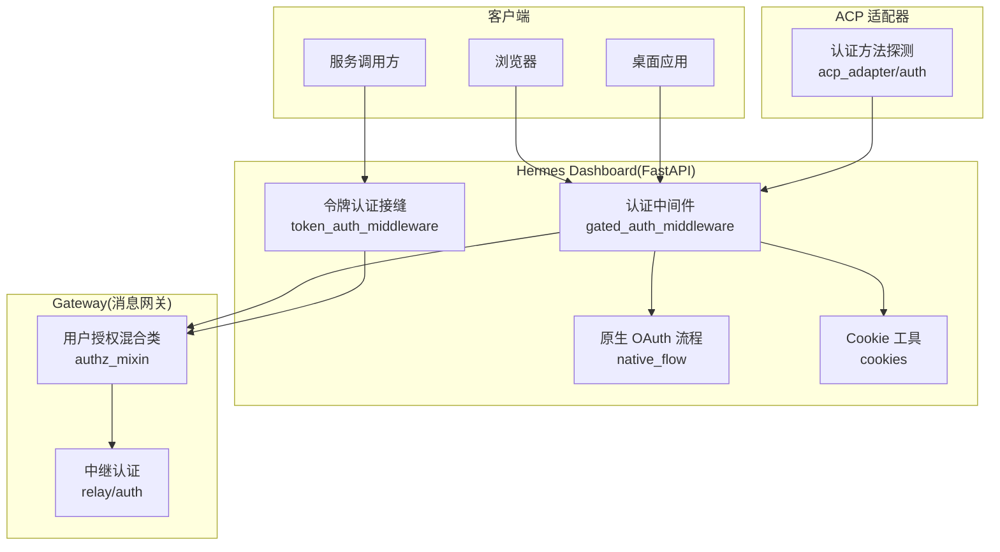
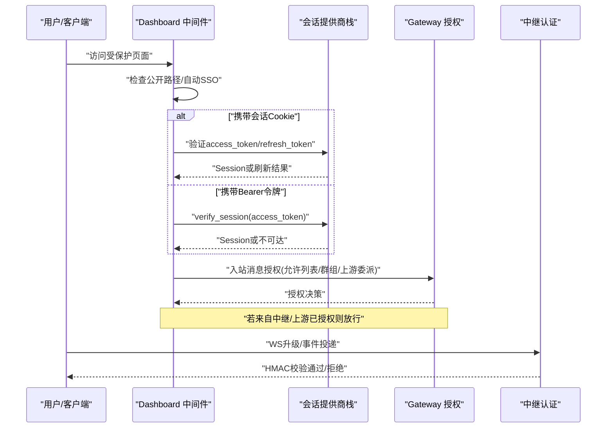
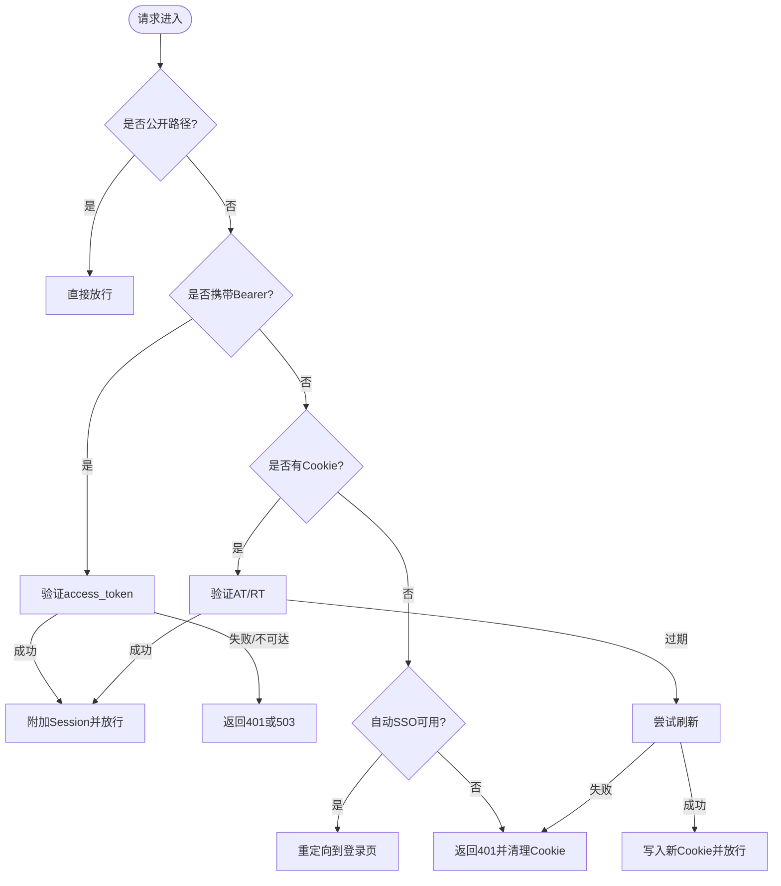
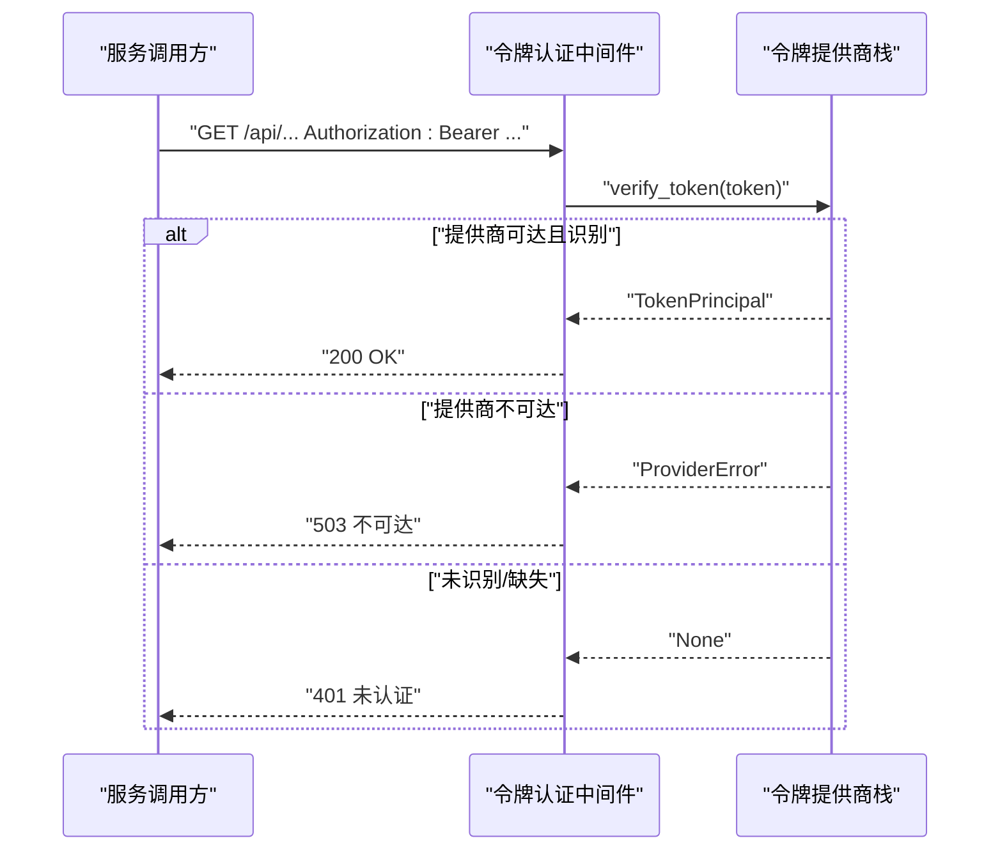
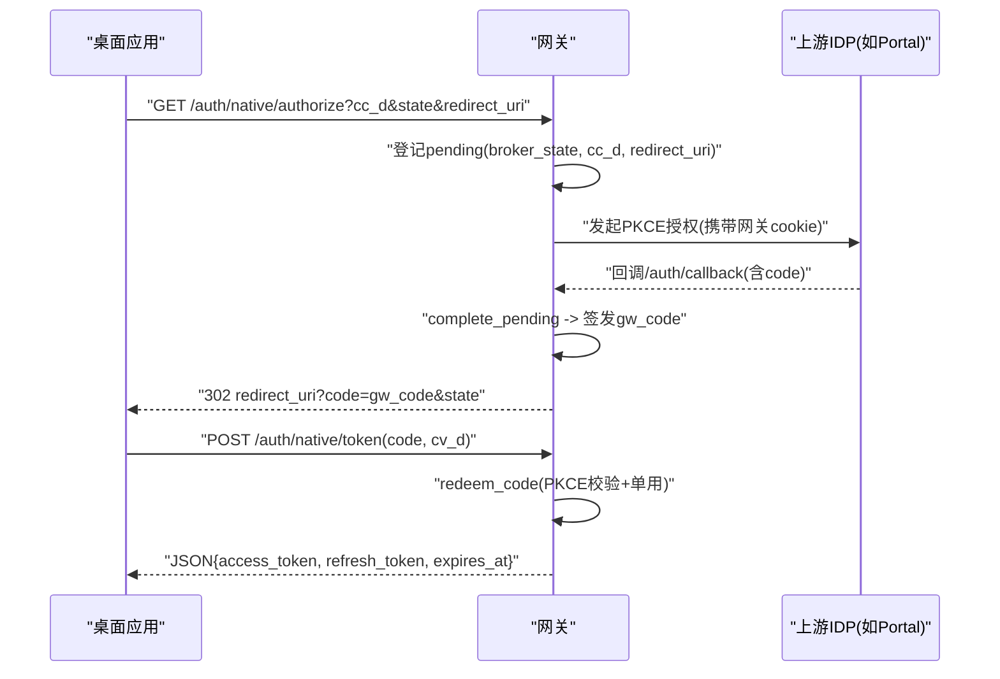
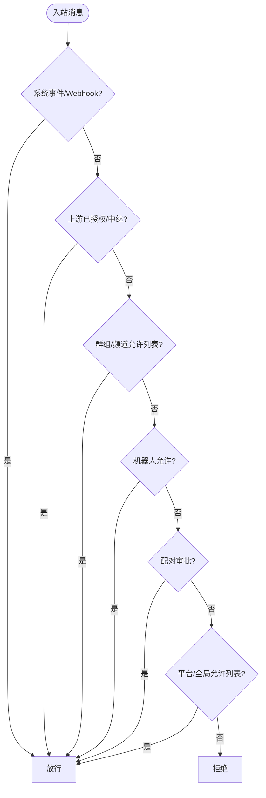
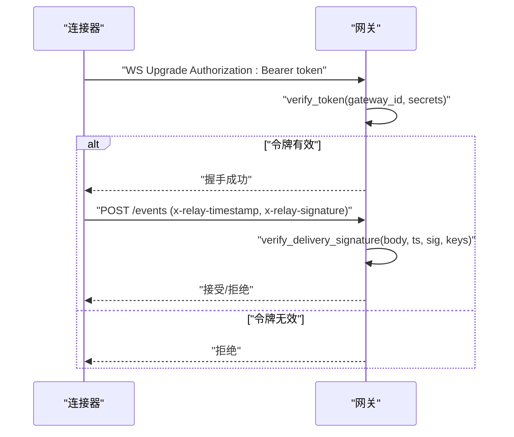
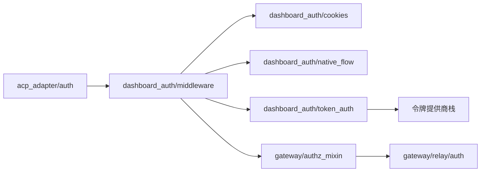

# 认证授权

<cite>
**本文引用的文件**
- [acp_adapter/auth.py](file://acp_adapter/auth.py)
- [gateway/authz_mixin.py](file://gateway/authz_mixin.py)
- [gateway/relay/auth.py](file://gateway/relay/auth.py)
- [hermes_cli/auth.py](file://hermes_cli/auth.py)
- [hermes_cli/dashboard_auth/middleware.py](file://hermes_cli/dashboard_auth/middleware.py)
- [hermes_cli/dashboard_auth/token_auth.py](file://hermes_cli/dashboard_auth/token_auth.py)
- [hermes_cli/dashboard_auth/native_flow.py](file://hermes_cli/dashboard_auth/native_flow.py)
- [hermes_cli/dashboard_auth/cookies.py](file://hermes_cli/dashboard_auth/cookies.py)
</cite>

## 目录
1. [简介](#简介)
2. [项目结构](#项目结构)
3. [核心组件](#核心组件)
4. [架构总览](#架构总览)
5. [详细组件分析](#详细组件分析)
6. [依赖关系分析](#依赖关系分析)
7. [性能与安全考量](#性能与安全考量)
8. [故障排查指南](#故障排查指南)
9. [结论](#结论)
10. [附录：配置与集成示例](#附录配置与集成示例)

## 简介
本文件系统性梳理 Hermes Agent 的认证与授权机制，覆盖多种认证模式（会话 Cookie、OAuth、Bearer Token、平台接入网关 HMAC）、权限控制策略（环境白名单、配对审批、上游信任委派）、令牌生命周期管理（刷新、轮换、过期处理）、跨域与安全头实践，以及多租户/多实例部署下的安全边界设计。文档面向不同技术背景的读者，提供从高层架构到代码级流程的渐进式说明，并附带可操作的配置与集成指引。

## 项目结构
认证授权相关能力分布在以下模块：
- CLI 层：多提供商认证、OAuth 设备码/外部流程、令牌解析与缓存、Dashboard 登录与会话管理
- Dashboard 中间件：请求级鉴权门控、Cookie/Bearer 双通道、自动 SSO、刷新与审计
- Gateway 层：平台消息入站授权（允许列表、群组策略、上游委派）、中继连接 HMAC 认证
- ACP 适配器：运行时提供者检测与认证方法通告

图表来源
- [hermes_cli/dashboard_auth/middleware.py:1-120](file://hermes_cli/dashboard_auth/middleware.py#L1-L120)
- [hermes_cli/dashboard_auth/token_auth.py:1-120](file://hermes_cli/dashboard_auth/token_auth.py#L1-L120)
- [hermes_cli/dashboard_auth/native_flow.py:1-120](file://hermes_cli/dashboard_auth/native_flow.py#L1-L120)
- [hermes_cli/dashboard_auth/cookies.py:1-120](file://hermes_cli/dashboard_auth/cookies.py#L1-L120)
- [gateway/authz_mixin.py:1-120](file://gateway/authz_mixin.py#L1-L120)
- [gateway/relay/auth.py:1-60](file://gateway/relay/auth.py#L1-L60)
- [acp_adapter/auth.py:1-80](file://acp_adapter/auth.py#L1-L80)

章节来源
- [hermes_cli/dashboard_auth/middleware.py:1-120](file://hermes_cli/dashboard_auth/middleware.py#L1-L120)
- [hermes_cli/dashboard_auth/token_auth.py:1-120](file://hermes_cli/dashboard_auth/token_auth.py#L1-L120)
- [hermes_cli/dashboard_auth/native_flow.py:1-120](file://hermes_cli/dashboard_auth/native_flow.py#L1-L120)
- [hermes_cli/dashboard_auth/cookies.py:1-120](file://hermes_cli/dashboard_auth/cookies.py#L1-L120)
- [gateway/authz_mixin.py:1-120](file://gateway/authz_mixin.py#L1-L120)
- [gateway/relay/auth.py:1-60](file://gateway/relay/auth.py#L1-L60)
- [acp_adapter/auth.py:1-80](file://acp_adapter/auth.py#L1-L80)

## 核心组件
- 多提供商认证与令牌解析：支持 OAuth 设备码、外部 OAuth、API Key、云厂商 SDK 等；统一解析、缓存与刷新策略。
- Dashboard 认证中间件：基于 Cookie/Bearer 的请求级鉴权，支持自动 SSO、透明刷新、审计日志。
- 令牌认证接缝：为服务间调用提供非交互 Bearer 认证，按路由注册最小化暴露面。
- 原生 OAuth 流程（RFC 8252）：桌面端通过网关代理完成 PKCE 授权码交换，无 Cookie 传输敏感信息。
- 平台消息授权：基于环境变量/配置的允许列表、群组策略、配对审批、上游信任委派。
- 中继连接认证：WS 升级令牌与入站交付签名双重 HMAC 校验，支持密钥轮换窗口。
- ACP 认证方法通告：向 ACP 注册中心声明可用的认证方式（终端设置或运行时凭据）。

章节来源
- [hermes_cli/auth.py:1-120](file://hermes_cli/auth.py#L1-L120)
- [hermes_cli/dashboard_auth/middleware.py:1-120](file://hermes_cli/dashboard_auth/middleware.py#L1-L120)
- [hermes_cli/dashboard_auth/token_auth.py:1-120](file://hermes_cli/dashboard_auth/token_auth.py#L1-L120)
- [hermes_cli/dashboard_auth/native_flow.py:1-120](file://hermes_cli/dashboard_auth/native_flow.py#L1-L120)
- [gateway/authz_mixin.py:1-120](file://gateway/authz_mixin.py#L1-L120)
- [gateway/relay/auth.py:1-60](file://gateway/relay/auth.py#L1-L60)
- [acp_adapter/auth.py:1-80](file://acp_adapter/auth.py#L1-L80)

## 架构总览
下图展示从客户端到后端各层的认证与授权路径，包括 Web 登录、桌面原生 OAuth、服务令牌、平台消息与中继连接。

图表来源
- [hermes_cli/dashboard_auth/middleware.py:323-531](file://hermes_cli/dashboard_auth/middleware.py#L323-L531)
- [hermes_cli/dashboard_auth/token_auth.py:144-195](file://hermes_cli/dashboard_auth/token_auth.py#L144-L195)
- [gateway/authz_mixin.py:386-783](file://gateway/authz_mixin.py#L386-L783)
- [gateway/relay/auth.py:83-169](file://gateway/relay/auth.py#L83-L169)

## 详细组件分析

### 组件A：Dashboard 认证中间件（会话与自动 SSO）
- 功能要点
  - 公共路径白名单：登录、回调、静态资源等免鉴权
  - 自动 SSO：当仅有一个交互式提供商且未携带会话时，尝试静默重定向至门户
  - 双通道鉴权：优先 Bearer（桌面/服务），其次 Cookie（Web）
  - 透明刷新：Access Token 过期时利用 Refresh Token 无感续期
  - 失败处理：IDP 不可达返回 503，避免误判为“错误凭证”
  - 审计：记录登录、刷新、验证失败等关键事件

图表来源
- [hermes_cli/dashboard_auth/middleware.py:68-163](file://hermes_cli/dashboard_auth/middleware.py#L68-L163)
- [hermes_cli/dashboard_auth/middleware.py:166-241](file://hermes_cli/dashboard_auth/middleware.py#L166-L241)
- [hermes_cli/dashboard_auth/middleware.py:323-531](file://hermes_cli/dashboard_auth/middleware.py#L323-L531)
- [hermes_cli/dashboard_auth/cookies.py:166-213](file://hermes_cli/dashboard_auth/cookies.py#L166-L213)

章节来源
- [hermes_cli/dashboard_auth/middleware.py:1-592](file://hermes_cli/dashboard_auth/middleware.py#L1-L592)
- [hermes_cli/dashboard_auth/cookies.py:1-339](file://hermes_cli/dashboard_auth/cookies.py#L1-L339)

### 组件B：令牌认证接缝（服务间 Bearer 认证）
- 功能要点
  - 路由级注册：仅对显式注册的路径启用令牌认证，最小化暴露面
  - 提供商堆叠：按注册顺序尝试多个令牌提供商，任一成功即放行
  - 失败语义：不可达返回 503，未识别返回 401，不泄露内部细节
  - 审计：记录失败原因、IP、路径等

图表来源
- [hermes_cli/dashboard_auth/token_auth.py:60-141](file://hermes_cli/dashboard_auth/token_auth.py#L60-L141)
- [hermes_cli/dashboard_auth/token_auth.py:144-195](file://hermes_cli/dashboard_auth/token_auth.py#L144-L195)

章节来源
- [hermes_cli/dashboard_auth/token_auth.py:1-195](file://hermes_cli/dashboard_auth/token_auth.py#L1-L195)

### 组件C：原生 OAuth 流程（RFC 8252 桌面端）
- 功能要点
  - 网关代理上游 PKCE 流程，桌面端仅持有 code_challenge/code_verifier
  - 一次性授权码绑定 code_challenge，短 TTL，防重放
  - 成功后返回 access_token/refresh_token/expires_at，由桌面端本地存储
  - 后续 REST 使用 Bearer 认证，WebSocket 使用票据（ws-tickets）

图表来源
- [hermes_cli/dashboard_auth/native_flow.py:14-59](file://hermes_cli/dashboard_auth/native_flow.py#L14-L59)
- [hermes_cli/dashboard_auth/native_flow.py:163-298](file://hermes_cli/dashboard_auth/native_flow.py#L163-L298)

章节来源
- [hermes_cli/dashboard_auth/native_flow.py:1-298](file://hermes_cli/dashboard_auth/native_flow.py#L1-L298)

### 组件D：平台消息授权（允许列表/群组策略/上游委派）
- 功能要点
  - 优先级：系统事件/Webhook 直接放行 → 上游委派/中继标记 → 群组/频道允许列表 → 机器人允许 → 配对审批 → 平台/全局允许列表 → 默认拒绝
  - 适配自有策略的平台：仅在策略为 allowlist 时信任其入站决定
  - 兼容历史配置：Telegram 群组 chat-id 向后兼容
  - 多租户隔离：multiplex 模式下按 profile 读取允许列表与配对存储

图表来源
- [gateway/authz_mixin.py:386-783](file://gateway/authz_mixin.py#L386-L783)

章节来源
- [gateway/authz_mixin.py:1-800](file://gateway/authz_mixin.py#L1-L800)

### 组件E：中继连接认证（WS 升级与入站签名）
- 功能要点
  - WS 升级令牌：payload=gateway_id，带可选过期时间，base64url编码
  - 入站交付签名：x-relay-timestamp + x-relay-signature，对原始请求体进行 HMAC-SHA256
  - 多密钥验证：支持主密钥与次密钥轮换窗口，防止旋转期间失效
  - 重放防护：时间戳偏差限制

图表来源
- [gateway/relay/auth.py:83-169](file://gateway/relay/auth.py#L83-L169)

章节来源
- [gateway/relay/auth.py:1-169](file://gateway/relay/auth.py#L1-L169)

### 组件F：ACP 认证方法通告
- 功能要点
  - 检测当前运行时提供者（字符串 API Key 或可调用的令牌提供者）
  - 通告终端设置方法与运行时凭据方法，供 ACP 注册中心在初始握手时使用

章节来源
- [acp_adapter/auth.py:1-80](file://acp_adapter/auth.py#L1-L80)

## 依赖关系分析
- Dashboard 中间件依赖：Cookie 工具、提供商栈、前缀解析、审计
- 令牌认证接缝依赖：提供商栈、审计
- 原生 OAuth 依赖：会话对象、PKCE 工具、容量与 TTL 控制
- 平台授权依赖：平台枚举、会话源、WhatsApp 标识规范化、配对存储
- 中继认证依赖：HMAC 工具、时间戳、密钥轮换列表

图表来源
- [hermes_cli/dashboard_auth/middleware.py:1-120](file://hermes_cli/dashboard_auth/middleware.py#L1-L120)
- [hermes_cli/dashboard_auth/token_auth.py:1-120](file://hermes_cli/dashboard_auth/token_auth.py#L1-L120)
- [hermes_cli/dashboard_auth/native_flow.py:1-120](file://hermes_cli/dashboard_auth/native_flow.py#L1-L120)
- [hermes_cli/dashboard_auth/cookies.py:1-120](file://hermes_cli/dashboard_auth/cookies.py#L1-L120)
- [gateway/authz_mixin.py:1-120](file://gateway/authz_mixin.py#L1-L120)
- [gateway/relay/auth.py:1-60](file://gateway/relay/auth.py#L1-L60)
- [acp_adapter/auth.py:1-80](file://acp_adapter/auth.py#L1-L80)

章节来源
- [hermes_cli/dashboard_auth/middleware.py:1-120](file://hermes_cli/dashboard_auth/middleware.py#L1-L120)
- [hermes_cli/dashboard_auth/token_auth.py:1-120](file://hermes_cli/dashboard_auth/token_auth.py#L1-L120)
- [hermes_cli/dashboard_auth/native_flow.py:1-120](file://hermes_cli/dashboard_auth/native_flow.py#L1-L120)
- [hermes_cli/dashboard_auth/cookies.py:1-120](file://hermes_cli/dashboard_auth/cookies.py#L1-L120)
- [gateway/authz_mixin.py:1-120](file://gateway/authz_mixin.py#L1-L120)
- [gateway/relay/auth.py:1-60](file://gateway/relay/auth.py#L1-L60)
- [acp_adapter/auth.py:1-80](file://acp_adapter/auth.py#L1-L80)

## 性能与安全考量
- 性能
  - 令牌刷新与提供商堆叠采用短路逻辑，首个匹配即返回，降低延迟
  - 原生 OAuth 使用内存存储与 TTL 清理，避免持久化开销
  - 平台授权对群组/频道允许列表进行快速集合匹配
- 安全
  - Cookie 使用 HttpOnly、SameSite=Lax，HTTPS 下启用 Secure，并根据部署选择 __Host-/__Secure- 前缀
  - 原生 OAuth 严格 PKCE 校验与一次性授权码，防止拦截重放
  - 中继连接使用 HMAC 签名与时间戳窗口，支持密钥轮换
  - 平台授权默认拒绝，需显式配置允许列表或启用上游委派
  - 审计日志记录登录、刷新、验证失败等关键事件，便于追踪

[本节为通用指导，不直接分析具体文件]

## 故障排查指南
- 常见问题
  - 401 未认证：检查是否携带有效 Bearer 或 Cookie；确认路由是否注册为令牌认证路径
  - 503 不可达：某提供商/IDP 不可达，稍后重试；检查网络与证书
  - 自动 SSO 循环：检查是否存在 SSO 尝试标记；确保门户会话存在
  - 平台消息被拒：检查对应平台的允许列表、群组策略、配对审批
  - 中继事件被拒：核对时间戳偏差、签名算法与密钥列表
- 定位建议
  - 查看审计日志中的事件类型（登录开始、刷新成功/失败、会话验证失败、令牌认证失败）
  - 检查 Cookie 名称变体与 Path 是否匹配（__Host-/__Secure- 与代理前缀）
  - 核对上游提供商状态与 JWKS/发现文档可达性

章节来源
- [hermes_cli/dashboard_auth/middleware.py:112-163](file://hermes_cli/dashboard_auth/middleware.py#L112-L163)
- [hermes_cli/dashboard_auth/middleware.py:166-241](file://hermes_cli/dashboard_auth/middleware.py#L166-L241)
- [hermes_cli/dashboard_auth/token_auth.py:144-195](file://hermes_cli/dashboard_auth/token_auth.py#L144-L195)
- [gateway/authz_mixin.py:386-783](file://gateway/authz_mixin.py#L386-L783)
- [gateway/relay/auth.py:142-169](file://gateway/relay/auth.py#L142-L169)

## 结论
Hermes Agent 的认证授权体系以“最小暴露面、默认拒绝、可组合扩展”为原则，结合 Web 会话、桌面原生 OAuth、服务令牌与平台消息授权，形成多层防御。通过严格的 Cookie 安全属性、PKCE、HMAC 签名与审计日志，满足多租户与生产部署的安全要求。建议在部署中明确配置允许列表、启用上游委派、合理设置超时与刷新策略，并结合监控与审计持续优化。

[本节为总结，不直接分析具体文件]

## 附录：配置与集成示例
- 会话 Cookie 与自动 SSO
  - 启用 auth_required，配置至少一个交互式提供商
  - 设置 HTTPS 与反向代理前缀，确保 Secure 与 Path 正确
  - 参考：[hermes_cli/dashboard_auth/middleware.py:1-120](file://hermes_cli/dashboard_auth/middleware.py#L1-L120)、[hermes_cli/dashboard_auth/cookies.py:107-145](file://hermes_cli/dashboard_auth/cookies.py#L107-L145)
- 服务间 Bearer 认证
  - 注册目标路由为令牌认证路径
  - 实现令牌提供商 verify_token，返回 TokenPrincipal
  - 参考：[hermes_cli/dashboard_auth/token_auth.py:60-141](file://hermes_cli/dashboard_auth/token_auth.py#L60-L141)
- 桌面端原生 OAuth
  - 生成 code_challenge，打开 /auth/native/authorize
  - 监听 loopback 回调，提交 code 与 code_verifier 换取令牌
  - 参考：[hermes_cli/dashboard_auth/native_flow.py:163-298](file://hermes_cli/dashboard_auth/native_flow.py#L163-L298)
- 平台消息授权
  - 配置平台允许列表与环境变量（如 TELEGRAM_ALLOWED_USERS、DISCORD_ALLOW_ALL_USERS）
  - 对于自有策略平台，确保 dm_policy/group_policy 为 allowlist 才信任其入站
  - 参考：[gateway/authz_mixin.py:454-783](file://gateway/authz_mixin.py#L454-L783)
- 中继连接认证
  - 配置 gateway_id 与密钥列表，WS 升级携带 Authorization: Bearer
  - 入站事件携带 x-relay-timestamp 与 x-relay-signature
  - 参考：[gateway/relay/auth.py:83-169](file://gateway/relay/auth.py#L83-L169)
- ACP 认证方法
  - 确保运行时提供者已配置（字符串 API Key 或可调用的令牌提供者）
  - 参考：[acp_adapter/auth.py:11-80](file://acp_adapter/auth.py#L11-L80)

章节来源
- [hermes_cli/dashboard_auth/middleware.py:1-120](file://hermes_cli/dashboard_auth/middleware.py#L1-L120)
- [hermes_cli/dashboard_auth/cookies.py:107-145](file://hermes_cli/dashboard_auth/cookies.py#L107-L145)
- [hermes_cli/dashboard_auth/token_auth.py:60-141](file://hermes_cli/dashboard_auth/token_auth.py#L60-L141)
- [hermes_cli/dashboard_auth/native_flow.py:163-298](file://hermes_cli/dashboard_auth/native_flow.py#L163-L298)
- [gateway/authz_mixin.py:454-783](file://gateway/authz_mixin.py#L454-L783)
- [gateway/relay/auth.py:83-169](file://gateway/relay/auth.py#L83-L169)
- [acp_adapter/auth.py:11-80](file://acp_adapter/auth.py#L11-L80)