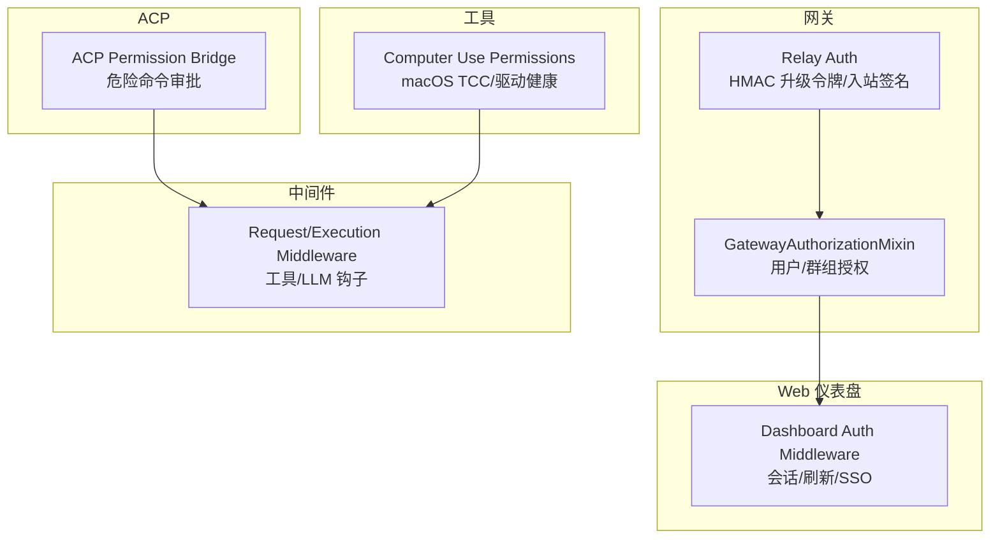
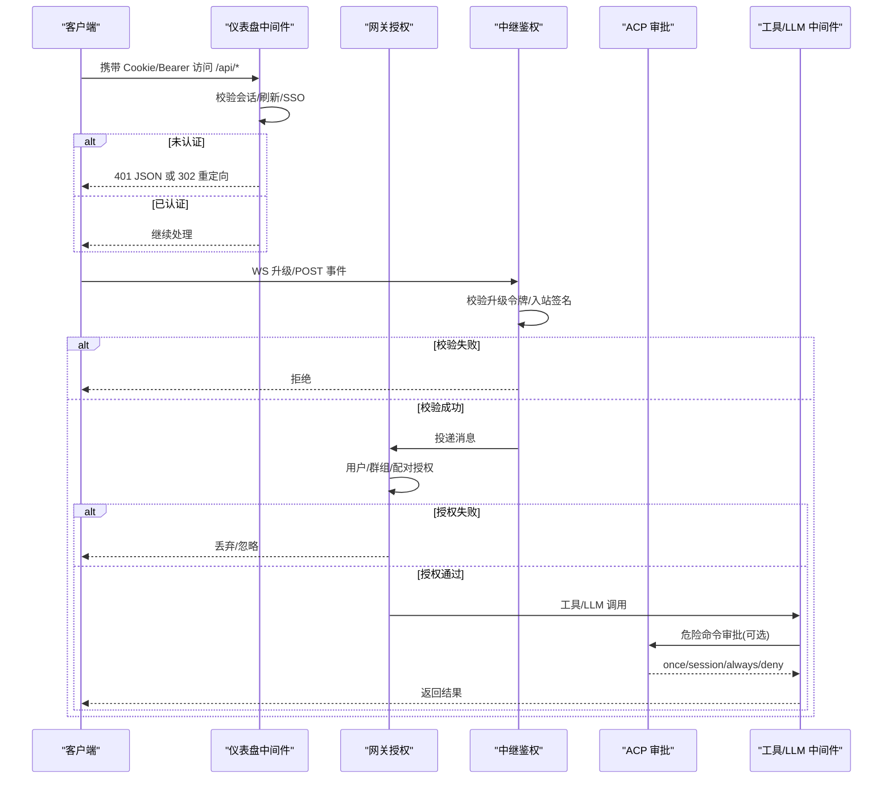
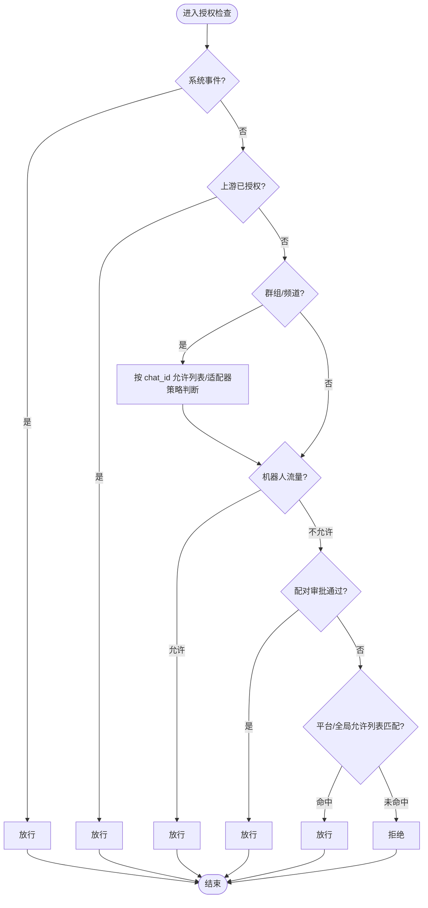
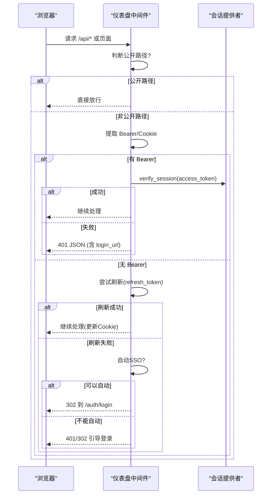
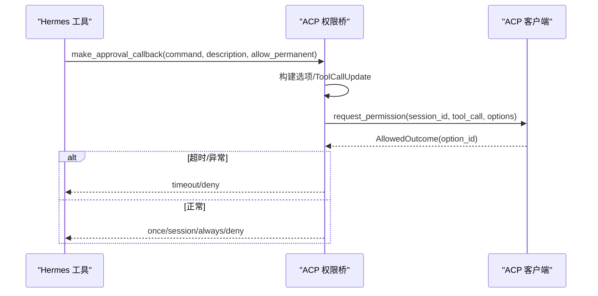
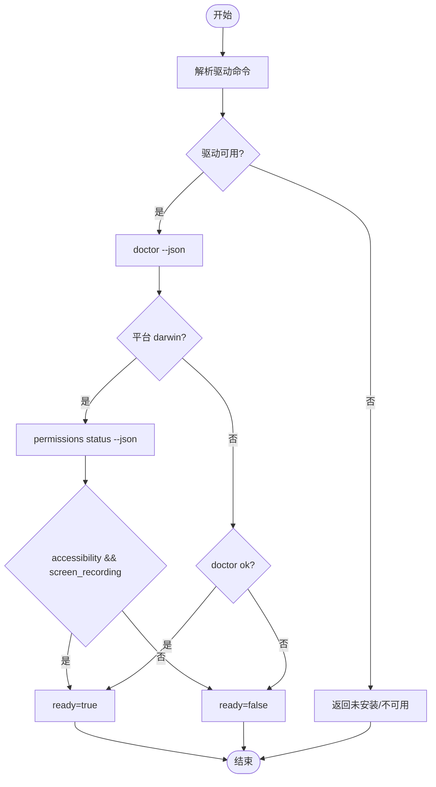
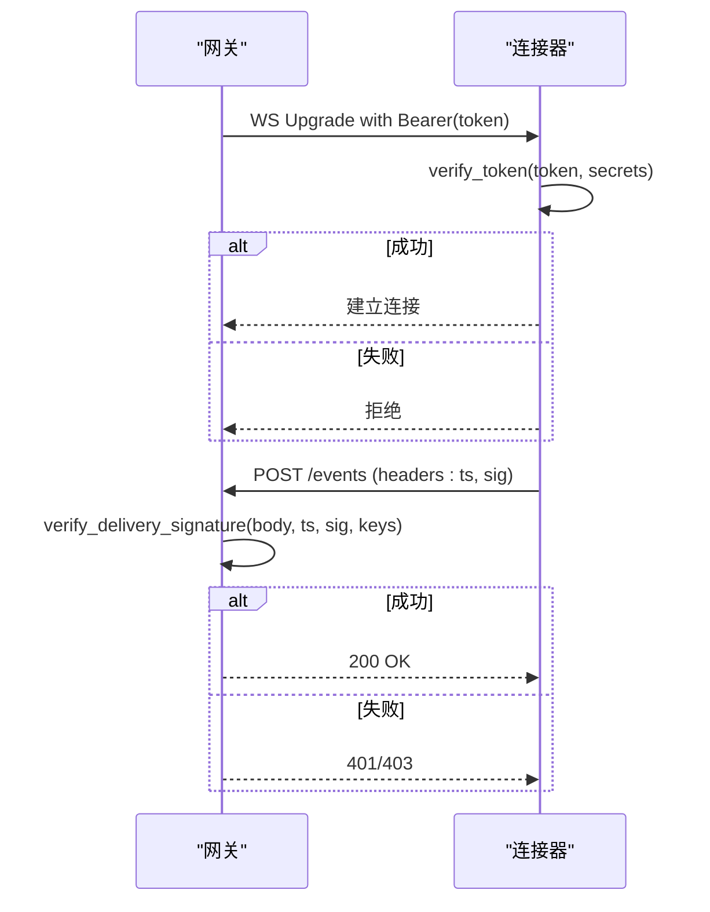
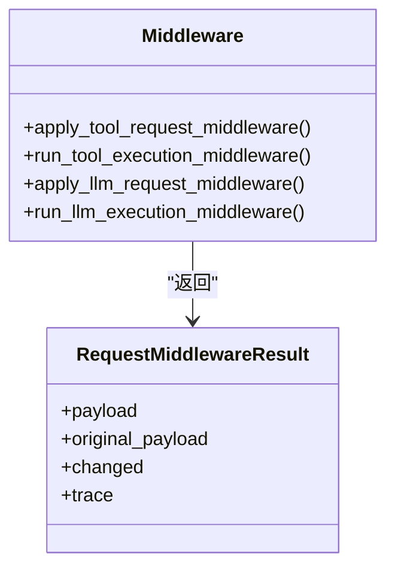
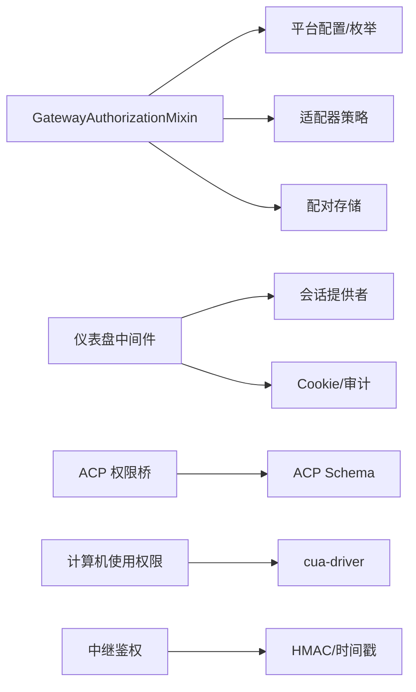

# 访问控制

<cite>
**本文引用的文件**
- [gateway/authz_mixin.py](file://gateway/authz_mixin.py)
- [hermes_cli/dashboard_auth/middleware.py](file://hermes_cli/dashboard_auth/middleware.py)
- [acp_adapter/permissions.py](file://acp_adapter/permissions.py)
- [tools/computer_use/permissions.py](file://tools/computer_use/permissions.py)
- [gateway/relay/auth.py](file://gateway/relay/auth.py)
- [hermes_cli/middleware.py](file://hermes_cli/middleware.py)
</cite>

## 目录
1. [简介](#简介)
2. [项目结构](#项目结构)
3. [核心组件](#核心组件)
4. [架构总览](#架构总览)
5. [详细组件分析](#详细组件分析)
6. [依赖关系分析](#依赖关系分析)
7. [性能考虑](#性能考虑)
8. [故障排查指南](#故障排查指南)
9. [结论](#结论)
10. [附录](#附录)

## 简介
本文件系统性说明 Hermes Agent 的访问控制机制，覆盖基于角色的访问控制、资源权限管理、中间件拦截与动态授权。重点包括：
- 网关侧用户/群组授权策略（允许列表、配对审批、上游信任）
- Web 仪表盘认证中间件（会话、刷新、SSO 自动跳转）
- ACP 危险命令审批桥接（一次性/会话级/永久/拒绝）
- 计算机使用能力平台权限检测与授予
- 中继通道双向 HMAC 鉴权（升级令牌与入站签名）
- 请求/执行链路中间件扩展点（工具与 LLM 请求/执行钩子）

## 项目结构
访问控制相关代码主要分布在以下模块：
- 网关授权：gateway/authz_mixin.py
- Web 仪表盘认证：hermes_cli/dashboard_auth/middleware.py
- ACP 权限桥接：acp_adapter/permissions.py
- 计算机使用权限：tools/computer_use/permissions.py
- 中继鉴权：gateway/relay/auth.py
- 通用中间件契约：hermes_cli/middleware.py

图表来源
- [gateway/authz_mixin.py:90-783](file://gateway/authz_mixin.py#L90-L783)
- [hermes_cli/dashboard_auth/middleware.py:323-531](file://hermes_cli/dashboard_auth/middleware.py#L323-L531)
- [acp_adapter/permissions.py:110-183](file://acp_adapter/permissions.py#L110-L183)
- [tools/computer_use/permissions.py:121-161](file://tools/computer_use/permissions.py#L121-L161)
- [gateway/relay/auth.py:51-169](file://gateway/relay/auth.py#L51-L169)
- [hermes_cli/middleware.py:77-328](file://hermes_cli/middleware.py#L77-L328)

章节来源
- [gateway/authz_mixin.py:90-783](file://gateway/authz_mixin.py#L90-L783)
- [hermes_cli/dashboard_auth/middleware.py:323-531](file://hermes_cli/dashboard_auth/middleware.py#L323-L531)
- [acp_adapter/permissions.py:110-183](file://acp_adapter/permissions.py#L110-L183)
- [tools/computer_use/permissions.py:121-161](file://tools/computer_use/permissions.py#L121-L161)
- [gateway/relay/auth.py:51-169](file://gateway/relay/auth.py#L51-L169)
- [hermes_cli/middleware.py:77-328](file://hermes_cli/middleware.py#L77-L328)

## 核心组件
- 网关用户授权（GatewayAuthorizationMixin）
  - 支持按平台/群组/DM 的多源允许列表与环境变量开关
  - 支持“上游已授权”信任（中继或适配器声明）
  - 支持配对审批（PairingStore）作为独立授权凭证
  - 对“开放策略”的默认拒绝，避免失败开放
- Web 仪表盘认证中间件
  - 支持 Bearer Token 与 Cookie 会话
  - 支持刷新令牌透明续期
  - 支持单提供者自动 SSO 跳转
  - 公共路径白名单与审计日志
- ACP 危险命令审批桥接
  - 将 Hermes 的 once/session/always/deny 映射到 ACP 选项
  - 超时与异常安全降级为拒绝或超时
- 计算机使用权限
  - macOS TCC 权限检测与授予；其他平台以驱动健康为准
- 中继鉴权
  - WS 升级令牌与入站消息 HMAC 签名校验
  - 多密钥轮换验证窗口
- 中间件扩展点
  - 工具/LLM 的请求与执行链式中间件，支持参数改写与追踪

章节来源
- [gateway/authz_mixin.py:90-783](file://gateway/authz_mixin.py#L90-L783)
- [hermes_cli/dashboard_auth/middleware.py:323-531](file://hermes_cli/dashboard_auth/middleware.py#L323-L531)
- [acp_adapter/permissions.py:110-183](file://acp_adapter/permissions.py#L110-L183)
- [tools/computer_use/permissions.py:121-161](file://tools/computer_use/permissions.py#L121-L161)
- [gateway/relay/auth.py:51-169](file://gateway/relay/auth.py#L51-L169)
- [hermes_cli/middleware.py:77-328](file://hermes_cli/middleware.py#L77-L328)

## 架构总览
访问控制贯穿“入口认证—通道鉴权—资源授权—执行拦截”四层：
- 入口认证：Web 仪表盘通过中间件校验会话/Bearer，必要时刷新或引导登录
- 通道鉴权：中继连接使用 HMAC 令牌与入站签名保证可信
- 资源授权：网关根据平台/群组/用户/配对状态决定消息是否进入代理
- 执行拦截：工具/LLM 调用经中间件链进行参数改写、审计、审批

图表来源
- [hermes_cli/dashboard_auth/middleware.py:323-531](file://hermes_cli/dashboard_auth/middleware.py#L323-L531)
- [gateway/relay/auth.py:51-169](file://gateway/relay/auth.py#L51-L169)
- [gateway/authz_mixin.py:386-783](file://gateway/authz_mixin.py#L386-L783)
- [acp_adapter/permissions.py:110-183](file://acp_adapter/permissions.py#L110-L183)
- [hermes_cli/middleware.py:77-328](file://hermes_cli/middleware.py#L77-L328)

## 详细组件分析

### 网关用户授权（GatewayAuthorizationMixin）
- 角色与资源
  - 角色：用户 ID、机器人标识、群组/频道成员
  - 资源：平台 DM、群组/论坛/频道、全局网关
- 授权流程要点
  - 系统事件（Home Assistant/Webhook）直接放行
  - 若来自受信任上游（中继或适配器声明），直接放行
  - 群组/频道可基于 chat_id 允许列表放行
  - 机器人流量可按平台环境变量放行
  - 配对审批（PairingStore）作为强授权
  - 平台/全局允许列表合并匹配（支持通配符）
  - 无配置时默认拒绝，除非显式开启“允许全部”
- 关键方法
  - _is_user_authorized：综合判定用户是否被授权
  - _adapter_dm_policy/_adapter_group_policy：读取适配器有效策略
  - _pairing_store_for：多租户隔离的配对存储选择

图表来源
- [gateway/authz_mixin.py:386-783](file://gateway/authz_mixin.py#L386-L783)

章节来源
- [gateway/authz_mixin.py:90-783](file://gateway/authz_mixin.py#L90-L783)

### Web 仪表盘认证中间件
- 功能
  - 公共路径白名单（登录、回调、静态资源等）
  - 支持 Bearer Token 与 Cookie 会话
  - 支持刷新令牌透明续期
  - 单提供者自动 SSO 跳转（防循环）
  - 未认证时 API 返回 401 JSON，HTML 返回 302 重定向
  - 审计日志记录登录、刷新、失败事件
- 关键流程
  - 提取 Bearer → 验证 → 成功则注入 Session
  - 无 Bearer → 尝试 Cookie → 验证/刷新 → 失败则引导登录
  - 自动 SSO：仅当唯一且为 OAuth 类型时静默跳转

图表来源
- [hermes_cli/dashboard_auth/middleware.py:323-531](file://hermes_cli/dashboard_auth/middleware.py#L323-L531)

章节来源
- [hermes_cli/dashboard_auth/middleware.py:323-531](file://hermes_cli/dashboard_auth/middleware.py#L323-L531)

### ACP 危险命令审批桥接
- 目标：在 Hermes 中发起危险命令前，向 ACP 客户端申请许可
- 选项映射：once/session/always/deny ↔ ACP 选项
- 行为：
  - 构建 ToolCallUpdate 并调用 request_permission
  - 线程安全调度到 ACP 事件循环
  - 超时返回 timeout，异常返回 deny
  - 未知 option_id 记录警告并拒绝

图表来源
- [acp_adapter/permissions.py:110-183](file://acp_adapter/permissions.py#L110-L183)

章节来源
- [acp_adapter/permissions.py:110-183](file://acp_adapter/permissions.py#L110-L183)

### 计算机使用权限（跨平台）
- macOS：需要 Accessibility + Screen Recording（TCC）
- Windows/Linux：以驱动健康为准
- 统一接口：computer_use_status 返回 ready、checks、can_grant 等
- 授予：request_permissions_grant 仅在 macOS 生效

图表来源
- [tools/computer_use/permissions.py:121-161](file://tools/computer_use/permissions.py#L121-L161)

章节来源
- [tools/computer_use/permissions.py:121-161](file://tools/computer_use/permissions.py#L121-L161)

### 中继鉴权（HMAC）
- 升级令牌：WS 升级时携带 Authorization: Bearer <token>
- 入站签名：POST 头 x-relay-timestamp + x-relay-signature
- 多密钥轮换：verify 列表依次比对，避免旋转期间失效
- 时间窗：入站签名校验最大偏差秒数

图表来源
- [gateway/relay/auth.py:51-169](file://gateway/relay/auth.py#L51-L169)

章节来源
- [gateway/relay/auth.py:51-169](file://gateway/relay/auth.py#L51-L169)

### 中间件扩展点（工具/LLM）
- 钩子类型：tool_request、tool_execution、llm_request、llm_execution
- 能力：
  - 请求阶段改写参数/上下文
  - 执行阶段包装调用，捕获异常与追踪
  - 与 Nemo Relay 集成，支持会话级拦截
- 错误处理：下游单次调用保护，异常透传与日志

图表来源
- [hermes_cli/middleware.py:37-328](file://hermes_cli/middleware.py#L37-L328)

章节来源
- [hermes_cli/middleware.py:77-328](file://hermes_cli/middleware.py#L77-L328)

## 依赖关系分析
- 网关授权依赖：
  - 平台枚举与配置（Platform、config）
  - 会话来源（SessionSource）
  - 各平台适配器的策略属性（dm_policy/group_policy/enforces_own_access_policy）
  - 配对存储（PairingStore）
- 仪表盘中间件依赖：
  - 会话提供者栈（list_session_providers）
  - Cookie 读写、审计日志、前缀解析
- ACP 权限桥依赖：
  - acp.schema（AllowedOutcome、PermissionOption）
  - 异步调度与超时控制
- 计算机使用权限依赖：
  - cua-driver 二进制与子进程环境清理
- 中继鉴权依赖：
  - HMAC-SHA256、base64url、时间戳校验

图表来源
- [gateway/authz_mixin.py:90-783](file://gateway/authz_mixin.py#L90-L783)
- [hermes_cli/dashboard_auth/middleware.py:323-531](file://hermes_cli/dashboard_auth/middleware.py#L323-L531)
- [acp_adapter/permissions.py:110-183](file://acp_adapter/permissions.py#L110-L183)
- [tools/computer_use/permissions.py:121-161](file://tools/computer_use/permissions.py#L121-L161)
- [gateway/relay/auth.py:51-169](file://gateway/relay/auth.py#L51-L169)

章节来源
- [gateway/authz_mixin.py:90-783](file://gateway/authz_mixin.py#L90-L783)
- [hermes_cli/dashboard_auth/middleware.py:323-531](file://hermes_cli/dashboard_auth/middleware.py#L323-L531)
- [acp_adapter/permissions.py:110-183](file://acp_adapter/permissions.py#L110-L183)
- [tools/computer_use/permissions.py:121-161](file://tools/computer_use/permissions.py#L121-L161)
- [gateway/relay/auth.py:51-169](file://gateway/relay/auth.py#L51-L169)

## 性能考虑
- 网关授权
  - 优先短路路径：系统事件、上游授权、群组 chat_id 允许列表、机器人流量快速放行
  - 允许列表解析为集合，减少重复拆分与比较
  - 适配器策略读取优先于配置回退，降低额外 I/O
- 仪表盘中间件
  - 刷新令牌路径避免全量重新认证，提升用户体验
  - 自动 SSO 仅在单一提供者时启用，减少交互开销
- ACP 审批
  - 超时与异常快速失败，避免阻塞主流程
  - 线程安全调度到 ACP 事件循环，避免死锁
- 计算机使用权限
  - 子进程调用带超时与最小化环境变量，防止泄露与卡死
- 中继鉴权
  - 常量时间比较与长度预检，避免时序攻击与无效计算

[本节提供一般性指导，不直接分析具体文件]

## 故障排查指南
- 网关授权失败
  - 检查平台/群组允许列表环境变量是否正确设置
  - 确认适配器 dm_policy/group_policy 是否为 allowlist（而非 open/pairing）
  - 核对配对存储是否包含该用户/平台
  - 关注上游中继标记 delivered_via_upstream_relay 与适配器标志位
- 仪表盘 401/302
  - 确认 Cookie/Bearer 是否存在且有效
  - 检查刷新令牌是否过期或被撤销
  - 查看审计日志中的 SESSION_VERIFY_FAILURE/REFRESH_FAILURE
- ACP 审批超时/拒绝
  - 检查 request_permission 是否成功调度到事件循环
  - 确认超时阈值与客户端响应
- 计算机使用不可用
  - 运行 cua-driver doctor 查看检查项
  - macOS 需手动批准 TCC 权限
- 中继鉴权失败
  - 校验时间戳是否在允许偏差内
  - 确认密钥轮换期间 verify 列表包含旧密钥

章节来源
- [gateway/authz_mixin.py:386-783](file://gateway/authz_mixin.py#L386-L783)
- [hermes_cli/dashboard_auth/middleware.py:323-531](file://hermes_cli/dashboard_auth/middleware.py#L323-L531)
- [acp_adapter/permissions.py:110-183](file://acp_adapter/permissions.py#L110-L183)
- [tools/computer_use/permissions.py:121-161](file://tools/computer_use/permissions.py#L121-L161)
- [gateway/relay/auth.py:51-169](file://gateway/relay/auth.py#L51-L169)

## 结论
Hermes 的访问控制采用分层设计：入口认证、通道鉴权、资源授权与执行拦截相互协作，既保证了安全性（默认拒绝、上游信任、HMAC 签名），又兼顾了可用性（配对审批、刷新令牌、自动 SSO）。通过中间件扩展点与 ACP 审批桥接，系统可在不侵入业务逻辑的前提下实现细粒度的权限控制与审计。

[本节为总结性内容，不直接分析具体文件]

## 附录
- 权限配置建议
  - 明确每个平台的允许列表环境变量，避免空配置导致默认拒绝
  - 对群组/频道使用 chat_id 允许列表，减少误放行
  - 启用配对审批用于临时授权，配合允许列表形成双重保障
  - 中继部署务必配置密钥轮换与时间窗，确保高可用
- 权限设计模式
  - 上游信任模式：由可信前置系统完成认证与授权，网关直接放行
  - 允许列表模式：显式白名单，严格限制访问主体
  - 配对审批模式：运营侧人工审批，适合临时或外部用户
  - 组合模式：允许列表与配对审批取并集，灵活而安全
- 多用户环境最佳实践
  - 按平台隔离允许列表与配对存储
  - 使用群组级别策略限制广播/匿名消息
  - 定期审计仪表盘登录与刷新日志
  - 对危险命令启用 ACP 审批，限制自动化滥用

[本节提供概念性指导，不直接分析具体文件]