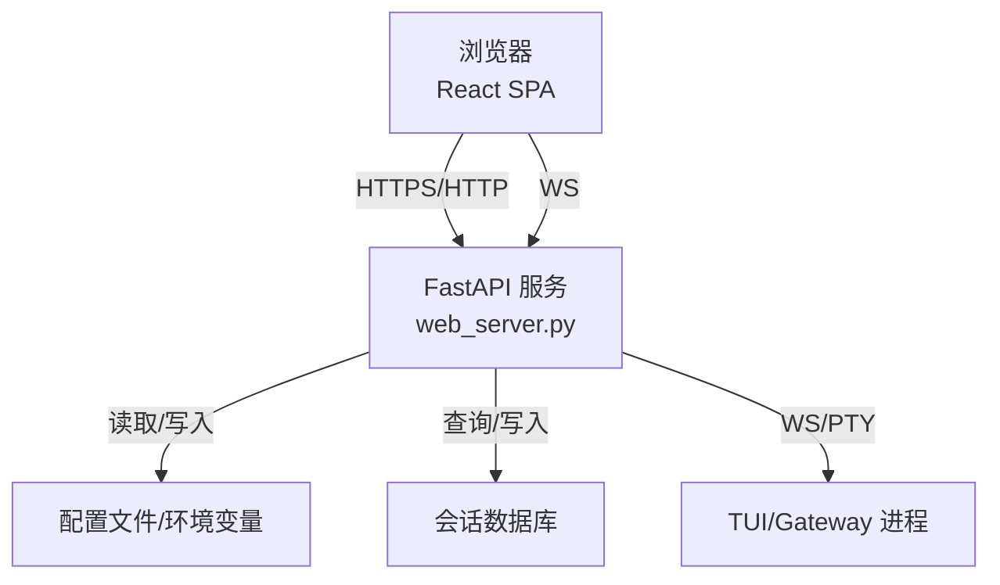
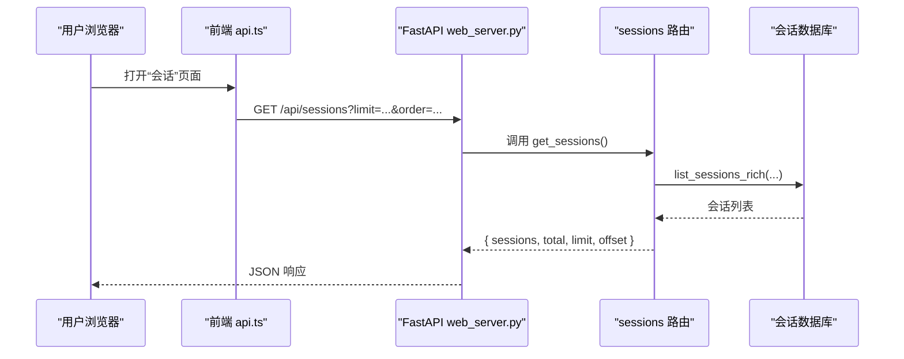
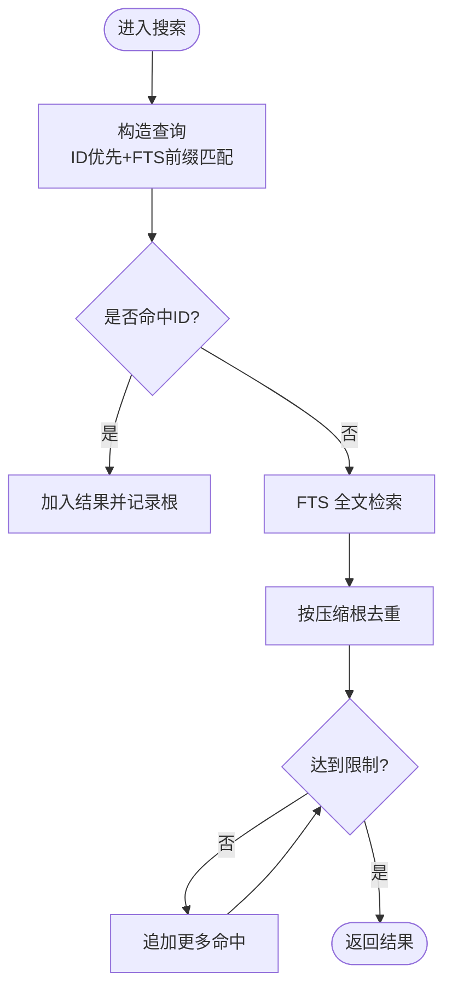
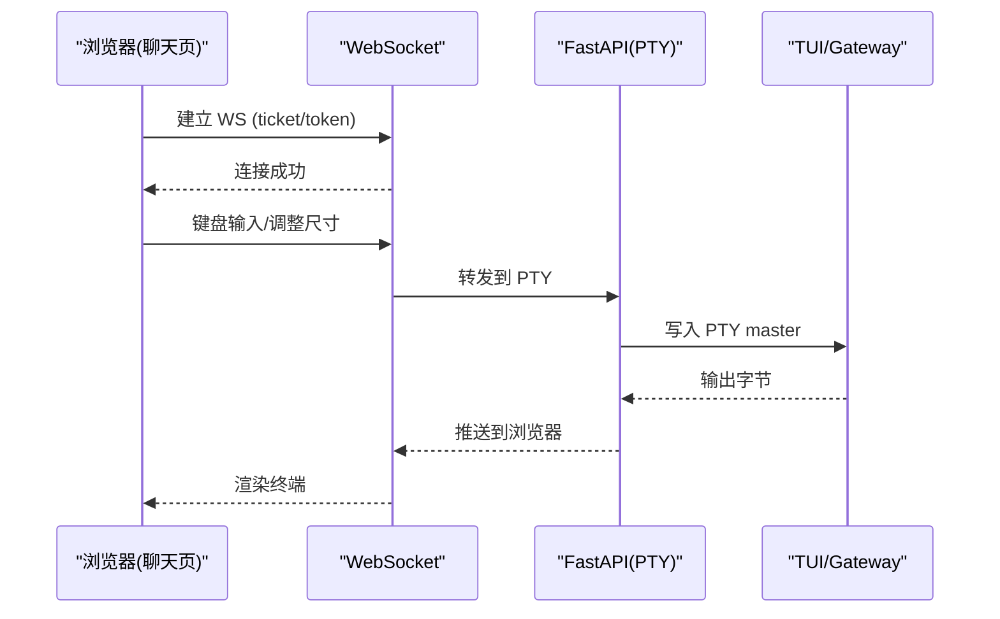
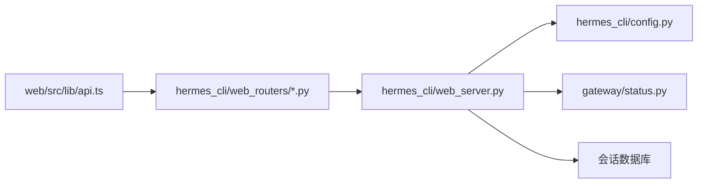

# Web 仪表板

<cite>
**本文引用的文件**
- [README.md](file://README.md)
- [web/README.md](file://web/README.md)
- [hermes_cli/web_server.py](file://hermes_cli/web_server.py)
- [hermes_cli/web_routers/sessions.py](file://hermes_cli/web_routers/sessions.py)
- [web/src/lib/api.ts](file://web/src/lib/api.ts)
- [web/src/pages/ChatPage.tsx](file://web/src/pages/ChatPage.tsx)
- [web/src/pages/ConfigPage.tsx](file://web/src/pages/ConfigPage.tsx)
</cite>

## 目录
1. [简介](#简介)
2. [项目结构](#项目结构)
3. [核心组件](#核心组件)
4. [架构总览](#架构总览)
5. [详细组件分析](#详细组件分析)
6. [依赖关系分析](#依赖关系分析)
7. [性能考虑](#性能考虑)
8. [故障排查指南](#故障排查指南)
9. [结论](#结论)
10. [附录：REST API 规范](#附录rest-api-规范)

## 简介
本文件面向基于 React 的 Hermes Agent Web 仪表板，覆盖功能介绍、配置管理、API 文档、部署与安全、实时通信（WebSocket）、流式响应、性能优化与高可用建议，以及系统集成与远程管理的实践指导。Web 仪表板提供会话监控、状态查看、配置管理、环境变量管理、计划任务、技能与工具集管理等能力，并通过 REST 与 WebSocket 与后端交互。

## 项目结构
- 前端（React + Vite + TypeScript）
  - 页面：会话、配置、聊天、日志、模型、技能、工具集、计划任务、MCP、配对等
  - API 客户端：统一封装 fetch 与 WebSocket URL 构建、认证头注入、错误处理与重定向
- 后端（FastAPI）
  - 静态 SPA 托管与 /api/* REST 路由
  - 安全中间件：Host 校验、CORS、OAuth/令牌认证、插件启用态拦截
  - 会话数据库访问、搜索、导出、批量删除、统计等
  - PTY 终端桥接与事件通道（用于聊天页嵌入 TUI）

图表来源
- [web/README.md:1-36](file://web/README.md#L1-L36)
- [hermes_cli/web_server.py:103-133](file://hermes_cli/web_server.py#L103-L133)
- [hermes_cli/web_routers/sessions.py:53-166](file://hermes_cli/web_routers/sessions.py#L53-L166)

章节来源
- [web/README.md:1-36](file://web/README.md#L1-L36)
- [hermes_cli/web_server.py:103-133](file://hermes_cli/web_server.py#L103-L133)

## 核心组件
- 会话管理
  - 列表、分页、过滤、排序、搜索（FTS）、详情、消息分页、导出、批量删除、清理、统计
- 配置与环境变量
  - 动态表单渲染（基于 schema）、原始 YAML 编辑、默认值展示、保存、键值对增删改查
- 聊天与终端
  - 通过 WebSocket 连接 PTY，将 xterm 终端嵌入仪表板，支持断线重连、移动端输入适配、恢复加载
- 认证与安全
  - 回环模式（注入会话令牌）与门控模式（OAuth Cookie），Host 头校验，CORS 限制本地域，插件启用态拦截
- 实时事件与流式输出
  - 事件通道注册表、健康自检、自动归档计时器、会话导出流式 JSON

章节来源
- [hermes_cli/web_routers/sessions.py:53-166](file://hermes_cli/web_routers/sessions.py#L53-L166)
- [hermes_cli/web_routers/sessions.py:169-392](file://hermes_cli/web_routers/sessions.py#L169-L392)
- [hermes_cli/web_routers/sessions.py:395-788](file://hermes_cli/web_routers/sessions.py#L395-L788)
- [web/src/pages/ConfigPage.tsx:104-200](file://web/src/pages/ConfigPage.tsx#L104-L200)
- [web/src/pages/ChatPage.tsx:1-200](file://web/src/pages/ChatPage.tsx#L1-L200)
- [hermes_cli/web_server.py:217-271](file://hermes_cli/web_server.py#L217-L271)
- [hermes_cli/web_server.py:373-378](file://hermes_cli/web_server.py#L373-L378)
- [hermes_cli/web_server.py:431-467](file://hermes_cli/web_server.py#L431-L467)
- [hermes_cli/web_server.py:538-565](file://hermes_cli/web_server.py#L538-L565)
- [hermes_cli/web_server.py:644-685](file://hermes_cli/web_server.py#L644-L685)

## 架构总览
- 前端通过 api.ts 统一发起请求，自动附加会话令牌或走 OAuth Cookie；在门控模式下为 WS 升级获取一次性 ticket
- 后端使用 FastAPI 提供 REST 与 WebSocket；中间件链负责 Host 校验、CORS、OAuth/令牌认证、插件启用态检查与健康计数
- 会话数据通过 SQLite 存储，提供 FTS 全文检索与压缩链路去重；导出采用 StreamingResponse 分块输出
- 聊天页通过 PTY WebSocket 桥接到 TUI/Gateway，实现嵌入式终端体验

图表来源
- [web/src/lib/api.ts:372-385](file://web/src/lib/api.ts#L372-L385)
- [hermes_cli/web_routers/sessions.py:53-166](file://hermes_cli/web_routers/sessions.py#L53-L166)

章节来源
- [web/src/lib/api.ts:102-183](file://web/src/lib/api.ts#L102-L183)
- [hermes_cli/web_routers/sessions.py:53-166](file://hermes_cli/web_routers/sessions.py#L53-L166)

## 详细组件分析

### 会话管理（列表/搜索/详情/消息/导出/批量操作）
- 列表与分页
  - 支持 limit/offset、min_messages、archived、order(created/recent)、source/sources/exclude_sources、cwd_prefix、full、profile
  - 自动归档在读取路径中执行一次维护性写操作，随后以只读连接列出
- 搜索
  - 先按 session_id 精确匹配，再按 FTS 全文匹配；按压缩根去重，返回 lineage_root 与 tip
- 详情与消息
  - 解析 session_id，返回列表时标注 is_active/profile/pinned/archived
  - 消息分页默认最新一页，最大 500；支持 oldest/latest 顺序
- 导出
  - 流式 JSON 输出，键集分页避免 OFFSET O(n^2)
- 批量删除与清理
  - 批量删除限制 ids 数量上限；清理空会话仅删除已结束且未归档的条目

图表来源
- [hermes_cli/web_routers/sessions.py:169-392](file://hermes_cli/web_routers/sessions.py#L169-L392)

章节来源
- [hermes_cli/web_routers/sessions.py:53-166](file://hermes_cli/web_routers/sessions.py#L53-L166)
- [hermes_cli/web_routers/sessions.py:169-392](file://hermes_cli/web_routers/sessions.py#L169-L392)
- [hermes_cli/web_routers/sessions.py:395-788](file://hermes_cli/web_routers/sessions.py#L395-L788)

### 配置与环境变量管理
- 动态配置编辑器
  - 从后端获取 schema、category_order、defaults，渲染分类与字段；支持搜索、YAML 模式切换与保存
- 环境变量
  - 提供增删改查与“显示明文”接口；敏感操作受认证保护

章节来源
- [web/src/pages/ConfigPage.tsx:104-200](file://web/src/pages/ConfigPage.tsx#L104-L200)
- [web/src/lib/api.ts:511-588](file://web/src/lib/api.ts#L511-L588)

### 聊天与终端（嵌入 TUI）
- 通过 WebSocket 连接到 /api/pty，将 xterm 终端嵌入仪表板
- 支持断线重连、移动端输入适配、恢复加载遮罩、频道隔离与自动回收
- 在门控模式下，WS 升级使用一次性 ticket；回环模式使用注入的会话令牌

图表来源
- [web/src/pages/ChatPage.tsx:1-200](file://web/src/pages/ChatPage.tsx#L1-L200)
- [web/src/lib/api.ts:190-283](file://web/src/lib/api.ts#L190-L283)

章节来源
- [web/src/pages/ChatPage.tsx:1-200](file://web/src/pages/ChatPage.tsx#L1-L200)
- [web/src/lib/api.ts:190-283](file://web/src/lib/api.ts#L190-L283)

### 认证与安全
- 两种模式
  - 回环模式：服务端注入会话令牌到 HTML，前端通过 X-Hermes-Session-Token 或 Authorization: Bearer 发送
  - 门控模式：使用 OAuth Cookie，WS 升级需先获取一次性 ticket
- Host 头校验：防止 DNS Rebinding；CORS 仅允许 localhost/127.0.0.1
- 插件启用态拦截：运行时禁用插件时立即生效

章节来源
- [hermes_cli/web_server.py:330-336](file://hermes_cli/web_server.py#L330-L336)
- [hermes_cli/web_server.py:373-378](file://hermes_cli/web_server.py#L373-L378)
- [hermes_cli/web_server.py:431-467](file://hermes_cli/web_server.py#L431-L467)
- [hermes_cli/web_server.py:538-565](file://hermes_cli/web_server.py#L538-L565)
- [hermes_cli/web_server.py:568-632](file://hermes_cli/web_server.py#L568-L632)
- [hermes_cli/web_server.py:644-685](file://hermes_cli/web_server.py#L644-L685)

### 实时事件与流式响应
- 事件通道注册表：按 channel id 管理订阅者，自动回收
- 健康自检：周期性内省认证端点，暴露组件健康状态
- 自动归档：后台定时任务清理过期会话
- 会话导出：StreamingResponse 分块输出 JSON，避免大对象内存峰值

章节来源
- [hermes_cli/web_server.py:138-148](file://hermes_cli/web_server.py#L138-L148)
- [hermes_cli/web_server.py:771-800](file://hermes_cli/web_server.py#L771-L800)
- [hermes_cli/web_routers/sessions.py:722-781](file://hermes_cli/web_routers/sessions.py#L722-L781)

## 依赖关系分析
- 前端依赖
  - @hermes/shared 中的 WebSocket URL 构建函数
  - 本地 api.ts 封装所有 /api/* 调用与鉴权逻辑
- 后端依赖
  - FastAPI/Starlette 中间件链
  - hermes_cli.config 配置读写
  - gateway.status 运行状态探测
  - 会话数据库抽象（SQLite）

图表来源
- [web/src/lib/api.ts:1-47](file://web/src/lib/api.ts#L1-L47)
- [hermes_cli/web_server.py:60-100](file://hermes_cli/web_server.py#L60-L100)
- [hermes_cli/web_routers/sessions.py:1-51](file://hermes_cli/web_routers/sessions.py#L1-L51)

章节来源
- [web/src/lib/api.ts:1-47](file://web/src/lib/api.ts#L1-L47)
- [hermes_cli/web_server.py:60-100](file://hermes_cli/web_server.py#L60-L100)
- [hermes_cli/web_routers/sessions.py:1-51](file://hermes_cli/web_routers/sessions.py#L1-L51)

## 性能考虑
- 列表与搜索
  - 限制 limit（默认 20，上限 100），避免全量拉取
  - 搜索使用 FTS 与前缀匹配，并按压缩根去重，减少重复结果
- 消息分页
  - 默认返回最新一页（最多 500），避免超大会话导致内存压力
- 导出
  - 使用 StreamingResponse 与键集分页，降低内存占用与网络阻塞
- 启动预热
  - 预导入重型模块，减少首次请求延迟（尤其在 Windows Defender 扫描场景）
- 并发与锁
  - 聊天 argv 解析加锁，避免并发触发 npm install/build
- 建议
  - 反向代理缓存静态资源；开启 Gzip/Brotli
  - 数据库 WAL 模式与定期 VACUUM
  - 合理设置 Uvicorn workers 与超时；大文件上传/下载使用流式传输

[本节为通用性能建议，不直接引用具体文件]

## 故障排查指南
- 401 未授权
  - 检查是否携带正确的会话令牌或 Cookie；确认 Host 头与绑定地址一致
  - 门控模式下 WS 升级需先获取 ticket
- 400 无效 Host
  - 确保请求 host 与服务绑定地址一致（localhost/127.0.0.1/[::1]）
- 搜索无结果
  - 确认 FTS 索引已构建；检查 query 是否包含引号或通配符
- 导出失败或超时
  - 检查网络代理大小限制；确认使用流式下载
- 聊天页无法连接
  - 检查 WS ticket/token；确认浏览器同源策略与 CORS 配置

章节来源
- [hermes_cli/web_server.py:431-467](file://hermes_cli/web_server.py#L431-L467)
- [hermes_cli/web_server.py:538-565](file://hermes_cli/web_server.py#L538-L565)
- [web/src/lib/api.ts:123-183](file://web/src/lib/api.ts#L123-L183)
- [web/src/lib/api.ts:190-283](file://web/src/lib/api.ts#L190-L283)

## 结论
Hermes Web 仪表板以 React + FastAPI 为核心，提供完整的会话管理、配置与环境变量管理、聊天终端嵌入、认证与安全、实时事件与流式导出能力。通过严格的认证中间件、Host 校验与 CORS 限制，保障本地与门控部署的安全性。配合分页、流式导出与启动预热等优化手段，可在生产环境中稳定运行。建议结合反向代理、数据库调优与合理的 worker 配置，实现高可用与高性能。

[本节为总结性内容，不直接引用具体文件]

## 附录：REST API 规范

说明
- 基础路径：由后端注入 window.__HERMES_BASE_PATH__，前端自动拼接
- 认证
  - 回环模式：请求头 X-Hermes-Session-Token 或 Authorization: Bearer <token>
  - 门控模式：Cookie 认证；WS 升级需先 POST /api/auth/ws-ticket 获取 ticket
- 公共路径：部分只读端点在 PUBLIC_API_PATHS 中无需认证

会话相关
- GET /api/sessions
  - 查询参数：limit, offset, min_messages, archived(exclude|only|include), order(created|recent), source, sources, exclude_sources, cwd_prefix, full, profile
  - 响应：{ sessions[], total, limit, offset }
- GET /api/sessions/search
  - 查询参数：q, limit, profile, source, sources, exclude_sources
  - 响应：{ results[] }
- GET /api/sessions/{session_id}
  - 响应：会话详情（含 profile, is_default_profile, archived, pinned 等）
- GET /api/sessions/{session_id}/messages
  - 查询参数：limit, offset, order(oldest|latest), profile
  - 响应：{ session_id, messages[], pagination }
- DELETE /api/sessions/{session_id}
  - 响应：{ ok }
- PATCH /api/sessions/{session_id}
  - 请求体：{ title?, archived?, pinned?, profile? }
  - 响应：{ ok, title?, archived?, pinned? }
- GET /api/sessions/{session_id}/export
  - 流式 JSON 导出（metadata + messages）
- POST /api/sessions/bulk-delete
  - 请求体：{ ids[], profile? }
  - 响应：{ ok, deleted }
- GET /api/sessions/empty/count
  - 响应：{ count }
- DELETE /api/sessions/empty
  - 响应：{ ok, deleted }
- GET /api/sessions/stats
  - 响应：{ total, active_store, archived, messages, by_source }

配置与环境变量
- GET /api/config
  - 响应：当前配置对象
- PUT /api/config
  - 请求体：{ config }
  - 响应：{ ok }
- GET /api/config/defaults
  - 响应：默认配置
- GET /api/config/schema
  - 响应：{ fields, category_order }
- GET /api/config/raw
  - 响应：{ yaml, path? }
- PUT /api/config/raw
  - 请求体：{ yaml_text }
  - 响应：{ ok }
- GET /api/env
  - 响应：{ key: EnvVarInfo }
- PUT /api/env
  - 请求体：{ key, value }
  - 响应：{ ok }
- DELETE /api/env
  - 请求体：{ key }
  - 响应：{ ok }
- POST /api/env/reveal
  - 请求体：{ key }
  - 响应：{ key, value }

聊天与终端
- WS /api/pty
  - 查询参数：token（回环）或 ticket（门控）
  - 双向二进制帧，映射 PTY 输入/输出

认证
- POST /api/auth/ws-ticket
  - 响应：{ ticket, ttl_seconds }
- GET /api/auth/me
  - 门控模式下返回当前会话信息；回环模式可能 401

文件与日志
- GET /api/files
  - 查询参数：path?
  - 响应：文件列表
- GET /api/files/read
  - 查询参数：path
  - 响应：文件内容
- POST /api/files/upload-stream
  - multipart/form-data：path, overwrite, file
  - 响应：写入结果
- POST /api/files/mkdir
  - 请求体：{ path }
  - 响应：创建结果
- DELETE /api/files
  - 请求体：{ path, recursive? }
  - 响应：{ ok, path }
- GET /api/logs
  - 查询参数：file?, lines?, level?, component?
  - 响应：日志条目

模型与工具集
- GET /api/model/info
  - 响应：模型信息
- GET /api/model/options
  - 查询参数：profile?, refresh?, include_unconfigured=1
  - 响应：模型选项
- PUT /api/model/moa
  - 请求体：MOA 配置
  - 响应：更新后的配置
- GET /api/tools/toolsets
  - 查询参数：profile?
  - 响应：工具集列表
- PUT /api/tools/toolsets/{name}
  - 请求体：{ enabled, profile? }
  - 响应：{ ok, name, platform, enabled }
- GET /api/tools/toolsets/{name}/config
  - 查询参数：profile?
  - 响应：工具集配置
- PUT /api/tools/toolsets/{name}/provider
  - 请求体：{ provider, profile? }
  - 响应：{ ok, name, provider }
- PUT /api/tools/toolsets/{name}/env
  - 请求体：{ env, profile? }
  - 响应：环境设置结果

技能
- GET /api/skills
  - 查询参数：profile?
  - 响应：技能列表
- PUT /api/skills/toggle
  - 请求体：{ name, enabled, profile? }
  - 响应：{ ok }
- GET /api/skills/content
  - 查询参数：name, profile?
  - 响应：技能内容
- POST /api/skills
  - 请求体：{ name, content, category?, profile? }
  - 响应：创建结果
- PUT /api/skills/content
  - 请求体：{ name, content, profile? }
  - 响应：更新结果

计划任务
- GET /api/cron/jobs
  - 查询参数：profile
  - 响应：任务列表
- POST /api/cron/jobs
  - 请求体：任务定义
  - 响应：创建的任务
- POST /api/cron/jobs/{id}/pause
  - 响应：暂停后的任务
- PUT /api/cron/jobs/{id}
  - 请求体：{ updates }
  - 响应：更新后的任务
- POST /api/cron/jobs/{id}/resume
  - 响应：恢复后的任务
- POST /api/cron/jobs/{id}/trigger
  - 响应：触发后的任务
- DELETE /api/cron/jobs/{id}
  - 响应：{ ok }
- GET /api/cron/delivery-targets
  - 响应：{ targets }
- GET /api/cron/blueprints
  - 响应：{ blueprints }
- POST /api/cron/blueprints/instantiate
  - 请求体：{ blueprint, values }
  - 响应：实例化的任务

个人资料
- GET /api/profiles
  - 响应：{ profiles }
- GET /api/profiles/active
  - 响应：{ active }
- POST /api/profiles/active
  - 请求体：{ name }
  - 响应：{ ok, active }
- POST /api/profiles
  - 请求体：创建资料所需字段
  - 响应：创建结果
- PUT /api/profiles/{name}/description
  - 请求体：{ description }
  - 响应：{ ok, description, description_auto }
- POST /api/profiles/{name}/describe-auto
  - 请求体：{ overwrite }
  - 响应：自动描述结果
- PUT /api/profiles/{name}/model
  - 请求体：{ provider, model }
  - 响应：{ ok, provider, model }
- PATCH /api/profiles/{name}
  - 请求体：{ new_name }
  - 响应：{ ok, name, path }
- DELETE /api/profiles/{name}
  - 响应：{ ok }
- GET /api/profiles/{name}/setup-command
  - 响应：{ command }
- GET /api/profiles/{name}/soul
  - 响应：{ content, exists }
- PUT /api/profiles/{name}/soul
  - 请求体：{ content }
  - 响应：{ ok }

分析
- GET /api/analytics/usage
  - 查询参数：days, profile?
  - 响应：用量统计
- GET /api/analytics/models
  - 查询参数：days, profile?
  - 响应：模型用量统计

章节来源
- [web/src/lib/api.ts:337-800](file://web/src/lib/api.ts#L337-L800)
- [hermes_cli/web_routers/sessions.py:53-788](file://hermes_cli/web_routers/sessions.py#L53-L788)
- [hermes_cli/web_server.py:373-378](file://hermes_cli/web_server.py#L373-L378)
- [hermes_cli/web_server.py:431-467](file://hermes_cli/web_server.py#L431-L467)
- [hermes_cli/web_server.py:538-565](file://hermes_cli/web_server.py#L538-L565)
- [hermes_cli/web_server.py:644-685](file://hermes_cli/web_server.py#L644-L685)