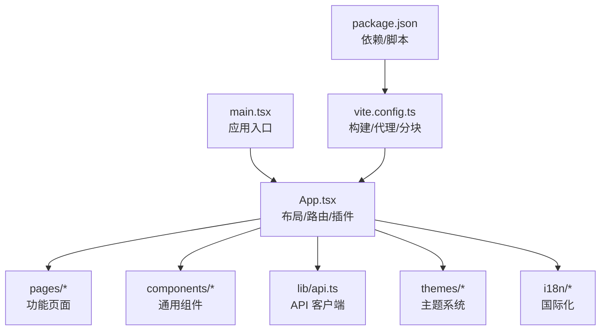
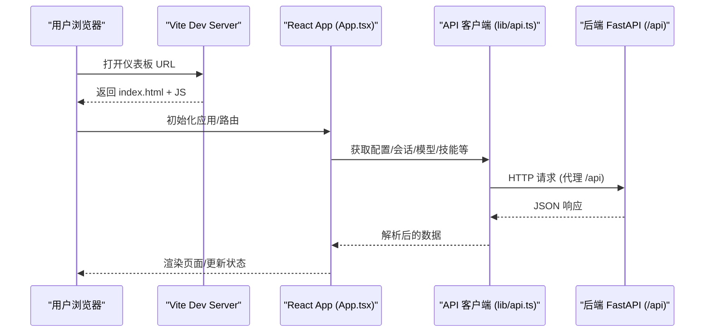
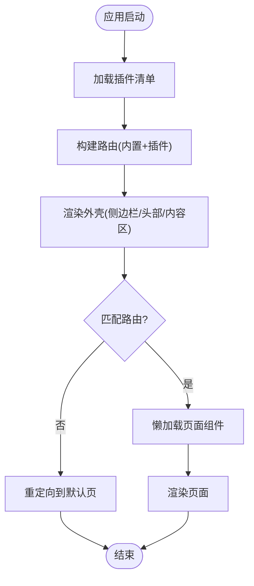
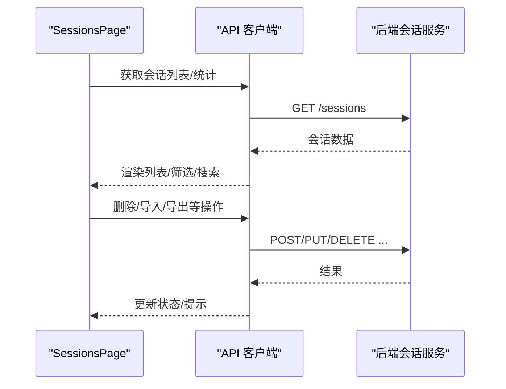
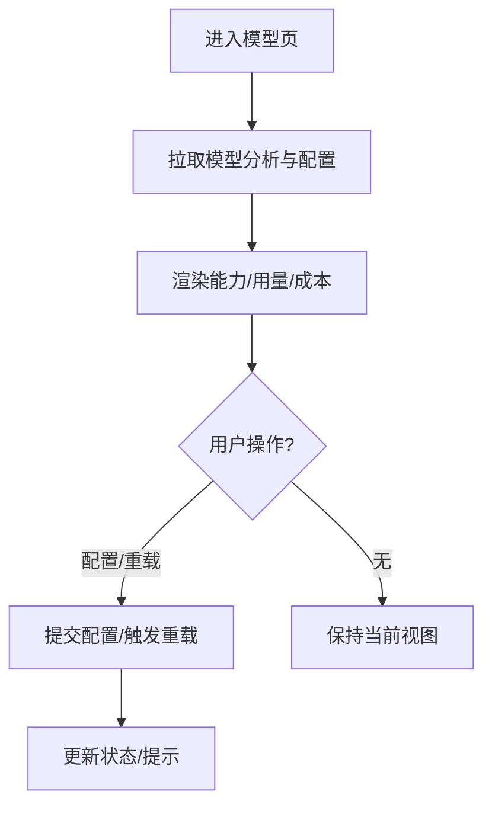
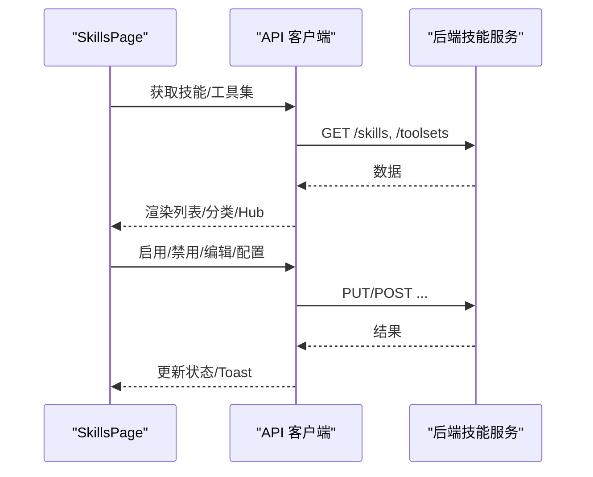
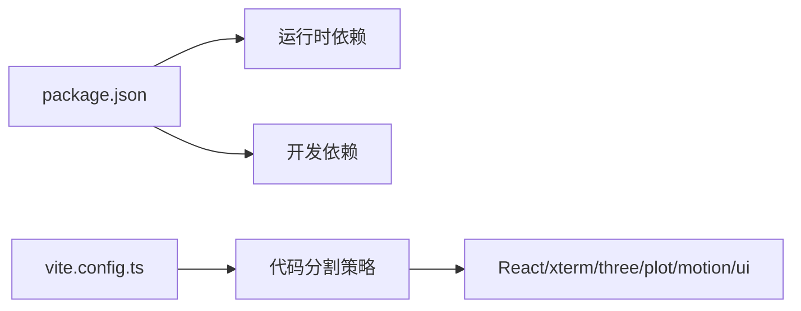

# 仪表板概览

<cite>
**本文引用的文件**
- [web/README.md](file://web/README.md)
- [web/package.json](file://web/package.json)
- [web/vite.config.ts](file://web/vite.config.ts)
- [web/src/main.tsx](file://web/src/main.tsx)
- [web/src/App.tsx](file://web/src/App.tsx)
- [web/src/pages/SessionsPage.tsx](file://web/src/pages/SessionsPage.tsx)
- [web/src/pages/ModelsPage.tsx](file://web/src/pages/ModelsPage.tsx)
- [web/src/pages/SkillsPage.tsx](file://web/src/pages/SkillsPage.tsx)
</cite>

## 目录
1. [简介](#简介)
2. [项目结构](#项目结构)
3. [核心组件](#核心组件)
4. [架构总览](#架构总览)
5. [详细组件分析](#详细组件分析)
6. [依赖分析](#依赖分析)
7. [性能考虑](#性能考虑)
8. [故障排查指南](#故障排查指南)
9. [结论](#结论)
10. [附录](#附录)

## 简介
本文件面向基于 React 的 Web 仪表板，提供整体架构与核心功能概览。该仪表板用于管理 Hermes Agent 的配置、API 密钥、监控活跃会话等。技术栈采用 Vite + React 19 + TypeScript，样式使用 Tailwind CSS v4 并内置深色主题，UI 组件为自研 shadcn/ui 风格（无 CLI 依赖）。开发时通过 Vite 启动前端，并将 /api 请求代理到后端 FastAPI 服务；生产构建产物由 Python 侧 dashboard 静态托管。

## 项目结构
- 入口与路由
  - main.tsx：应用根渲染，挂载 I18n、Theme、SystemActions 等全局上下文，并暴露插件 SDK。
  - App.tsx：主布局、侧边栏导航、路由注册、插件扩展点、嵌入式聊天持久化宿主等。
- 页面与功能模块
  - pages/*：按功能划分的页面，如会话、模型、技能、配置、日志、分析、系统、渠道、Webhook、MCP、配对、定时任务、配置文件、环境变量、文档等。
- 工具与库
  - lib/api.ts：类型化的 API 客户端封装。
  - lib/utils.ts：类名合并等通用工具。
- 主题与国际化
  - themes/*：主题系统与布局变体。
  - i18n/*：多语言资源与切换。
- 构建与开发
  - vite.config.ts：Vite 配置，含开发令牌注入、代码分割、代理规则、输出目录等。
  - package.json：脚本、依赖与版本。

图表来源
- [web/src/main.tsx:1-26](file://web/src/main.tsx#L1-L26)
- [web/src/App.tsx:1-120](file://web/src/App.tsx#L1-L120)
- [web/vite.config.ts:1-148](file://web/vite.config.ts#L1-L148)
- [web/package.json:1-55](file://web/package.json#L1-L55)

章节来源
- [web/README.md:1-105](file://web/README.md#L1-L105)
- [web/package.json:1-55](file://web/package.json#L1-L55)
- [web/vite.config.ts:1-148](file://web/vite.config.ts#L1-L148)
- [web/src/main.tsx:1-26](file://web/src/main.tsx#L1-L26)
- [web/src/App.tsx:1-120](file://web/src/App.tsx#L1-L120)

## 核心组件
- 应用壳与导航
  - 响应式侧边栏，支持折叠与移动端抽屉；内置导航项与插件动态注入的标签页。
  - 路由懒加载，首屏仅加载壳与必要依赖，重依赖（如 xterm）按需加载。
- 会话管理
  - 会话列表、搜索、筛选（聊天/自动化）、导入导出、删除确认、平台信息展示等。
- 模型选择与分析
  - 模型能力标签、用量与成本可视化、辅助任务槽位配置、模型重载确认等。
- 技能编辑与管理
  - 技能与工具集列表、启用/禁用、分类过滤、Hub 浏览、编辑器弹窗、配置抽屉。
- 配置与环境
  - 动态配置编辑器（读取后端 schema）、API Key 管理与保存/清理。
- 其他功能
  - 日志、分析、定时任务、渠道、Webhook、MCP、配对、系统、文档等页面。

章节来源
- [web/src/App.tsx:137-223](file://web/src/App.tsx#L137-L223)
- [web/src/pages/SessionsPage.tsx:1-200](file://web/src/pages/SessionsPage.tsx#L1-L200)
- [web/src/pages/ModelsPage.tsx:1-200](file://web/src/pages/ModelsPage.tsx#L1-L200)
- [web/src/pages/SkillsPage.tsx:1-200](file://web/src/pages/SkillsPage.tsx#L1-L200)

## 架构总览
前端以 React 为视图层，通过 react-router 进行路由管理；所有页面通过统一的 API 客户端访问后端接口。Vite 负责开发与构建，并在开发模式下将 /api 请求代理至后端。构建产物输出到 Python 包数据目录，由 dashboard 静态托管。主题与国际化通过 Provider 注入全局状态。

图表来源
- [web/vite.config.ts:6-148](file://web/vite.config.ts#L6-L148)
- [web/src/App.tsx:768-782](file://web/src/App.tsx#L768-L782)

## 详细组件分析

### 应用壳与路由（App.tsx）
- 路由与导航
  - 内置路由映射与懒加载，未知路由重定向到默认页。
  - 侧边栏导航项根据插件清单动态扩展，支持位置控制（before/after/end）。
- 嵌入式聊天
  - 当启用嵌入式聊天时，ChatPage 作为持久宿主在路由外渲染，避免 PTY/WebSocket/xterm 实例随路由切换被卸载。
- 权限与可见性
  - 通过配置开关控制“分析”导航项显示；插件可覆盖 /chat 路由。
- 主题与国际化
  - 通过 ThemeProvider 与 I18nProvider 提供全局主题与语言切换。

图表来源
- [web/src/App.tsx:155-367](file://web/src/App.tsx#L155-L367)
- [web/src/App.tsx:768-782](file://web/src/App.tsx#L768-L782)

章节来源
- [web/src/App.tsx:137-367](file://web/src/App.tsx#L137-L367)
- [web/src/App.tsx:411-474](file://web/src/App.tsx#L411-L474)
- [web/src/App.tsx:768-800](file://web/src/App.tsx#L768-L800)

### 会话管理（SessionsPage）
- 功能要点
  - 会话列表、搜索、按来源分类（聊天/自动化）、导入/导出、删除确认、平台信息卡片。
  - 对自动化来源（cron、tool、webhook 等）进行区分展示。
- 交互流程
  - 进入页面后拉取会话数据，支持刷新策略；操作触发后更新本地状态并反馈 Toast。

图表来源
- [web/src/pages/SessionsPage.tsx:1-200](file://web/src/pages/SessionsPage.tsx#L1-L200)

章节来源
- [web/src/pages/SessionsPage.tsx:1-200](file://web/src/pages/SessionsPage.tsx#L1-L200)

### 模型选择与分析（ModelsPage）
- 功能要点
  - 模型能力标签（工具/视觉/推理/家族）、用量与成本可视化、辅助任务槽位配置、模型重载确认。
- 数据流
  - 拉取模型分析与配置，渲染堆叠条形图与能力徽章，用户操作后提交配置或触发重载。

图表来源
- [web/src/pages/ModelsPage.tsx:1-200](file://web/src/pages/ModelsPage.tsx#L1-L200)

章节来源
- [web/src/pages/ModelsPage.tsx:1-200](file://web/src/pages/ModelsPage.tsx#L1-L200)

### 技能编辑与管理（SkillsPage）
- 功能要点
  - 技能与工具集列表、启用/禁用、分类过滤、Hub 浏览、编辑器弹窗、配置抽屉。
- 交互流程
  - 根据当前 Profile 范围拉取数据；切换技能时即时更新本地状态并提示；打开编辑器进行创建/编辑。

图表来源
- [web/src/pages/SkillsPage.tsx:1-200](file://web/src/pages/SkillsPage.tsx#L1-L200)

章节来源
- [web/src/pages/SkillsPage.tsx:1-200](file://web/src/pages/SkillsPage.tsx#L1-L200)

## 依赖分析
- 运行时依赖
  - React 19、react-router、Tailwind CSS v4、@nous-research/ui 组件库、xterm、three、plot、motion 等。
- 构建与开发
  - Vite 8、TypeScript、Vitest、ESLint。
- 插件与共享
  - @hermes/shared 共享类型与工具。
- 代码分割
  - 将 React、xterm、three、plot、motion、ui 等拆分为独立 chunk，降低首屏体积。

图表来源
- [web/package.json:1-55](file://web/package.json#L1-L55)
- [web/vite.config.ts:86-133](file://web/vite.config.ts#L86-L133)

章节来源
- [web/package.json:1-55](file://web/package.json#L1-L55)
- [web/vite.config.ts:86-133](file://web/vite.config.ts#L86-L133)

## 性能考虑
- 首屏优化
  - 路由级懒加载与重型依赖按需引入，减少初始包大小。
  - 代码分割将第三方库分组，避免无关 chunk 阻塞首屏。
- 网络与缓存
  - 开发模式通过代理转发 /api，避免跨域问题；生产构建由后端静态托管。
- 渲染性能
  - 使用轻量 UI 组件与语义化样式，避免过度重绘；列表与表格分页/虚拟滚动可按需扩展。

[本节为通用指导，不直接分析具体文件]

## 故障排查指南
- 开发环境 401 未授权
  - 现象：/api 调用返回 401。
  - 原因：Vite 开发服务器未注入后端提供的会话令牌。
  - 解决：确保后端 dashboard 已运行，或设置 HERMES_DASHBOARD_URL 指向正确的后端地址；插件会自动从后端 index.html 抓取令牌并注入。
- 插件脚本 404
  - 现象：/dashboard-plugins 路径无法访问。
  - 原因：Vite 未代理该路径。
  - 解决：确认 vite.config.ts 中已配置 /dashboard-plugins 代理到后端。
- 构建产物未生效
  - 现象：修改 web/src 后 dashboard 未更新。
  - 原因：dashboard 服务的是 hermes_cli/web_dist 下的构建产物。
  - 解决：执行 npm run build 并重启 dashboard，或使用 Vite 开发服务器配合后端。

章节来源
- [web/vite.config.ts:8-57](file://web/vite.config.ts#L8-L57)
- [web/vite.config.ts:135-145](file://web/vite.config.ts#L135-L145)
- [web/README.md:11-36](file://web/README.md#L11-L36)

## 结论
该 Web 仪表板以 React + Vite + TypeScript 为核心，结合 Tailwind 与自研 UI 组件，提供了会话管理、模型选择、技能编辑、配置与环境管理等关键能力。通过插件体系与路由懒加载，系统在可扩展性与性能之间取得平衡。遵循本文档的部署与使用建议，可快速上手并逐步深入架构细节。

[本节为总结，不直接分析具体文件]

## 附录
- 快速上手
  - 启动后端：python -m hermes_cli.main web --no-open
  - 启动前端：cd web && npm install && npm run dev
  - 访问 Vite 输出的 URL（通常为 http://localhost:5173）
- 部署与访问
  - 构建：npm run build，产物输出到 ../hermes_cli/web_dist
  - 生产托管：由 Python dashboard 静态托管构建产物
  - 访问方式：通过 hermes dashboard 服务访问
- 权限控制
  - 开发模式通过后端注入的会话令牌鉴权；生产环境遵循后端认证策略
- 浏览器兼容性
  - 现代浏览器即可；如需旧版兼容，可在构建阶段添加相应 polyfill
- 基本使用
  - 会话：查看/搜索/导入导出/删除
  - 模型：查看能力与用量、配置辅助任务、重载模型
  - 技能：启用/禁用、编辑、配置工具集
  - 配置与环境：动态编辑配置、管理 API Key

章节来源
- [web/README.md:11-36](file://web/README.md#L11-L36)
- [web/vite.config.ts:86-148](file://web/vite.config.ts#L86-L148)
- [web/package.json:6-15](file://web/package.json#L6-L15)