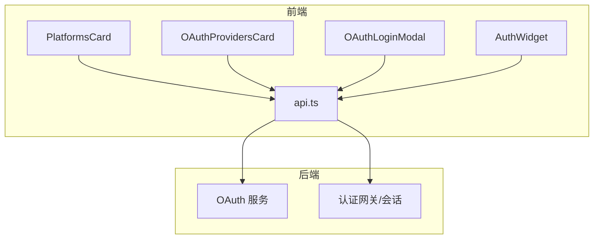
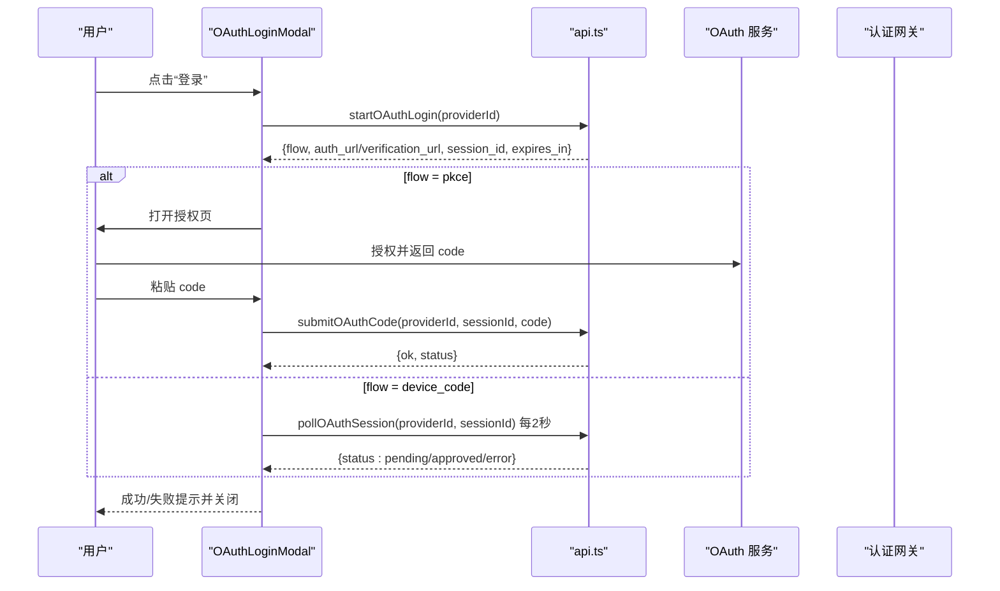
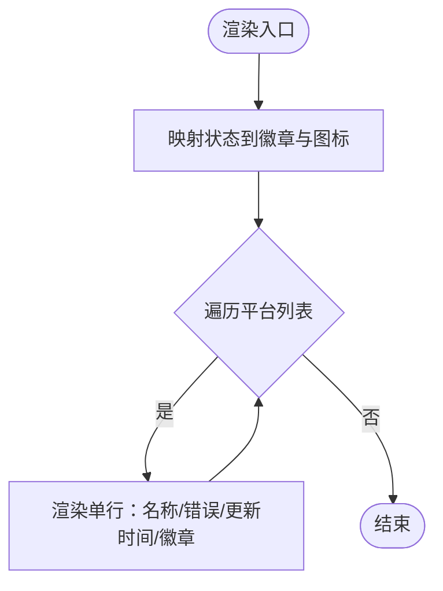
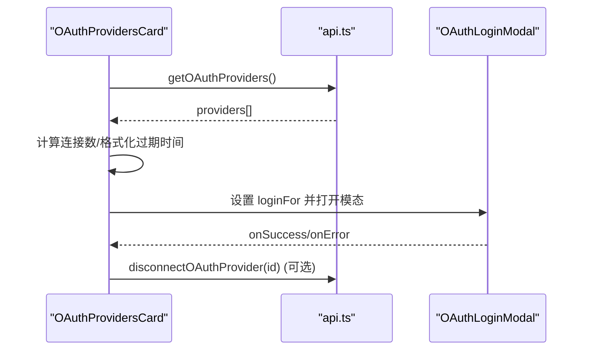
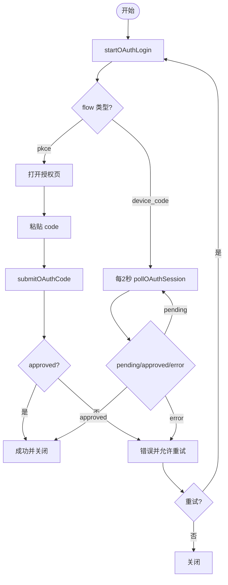
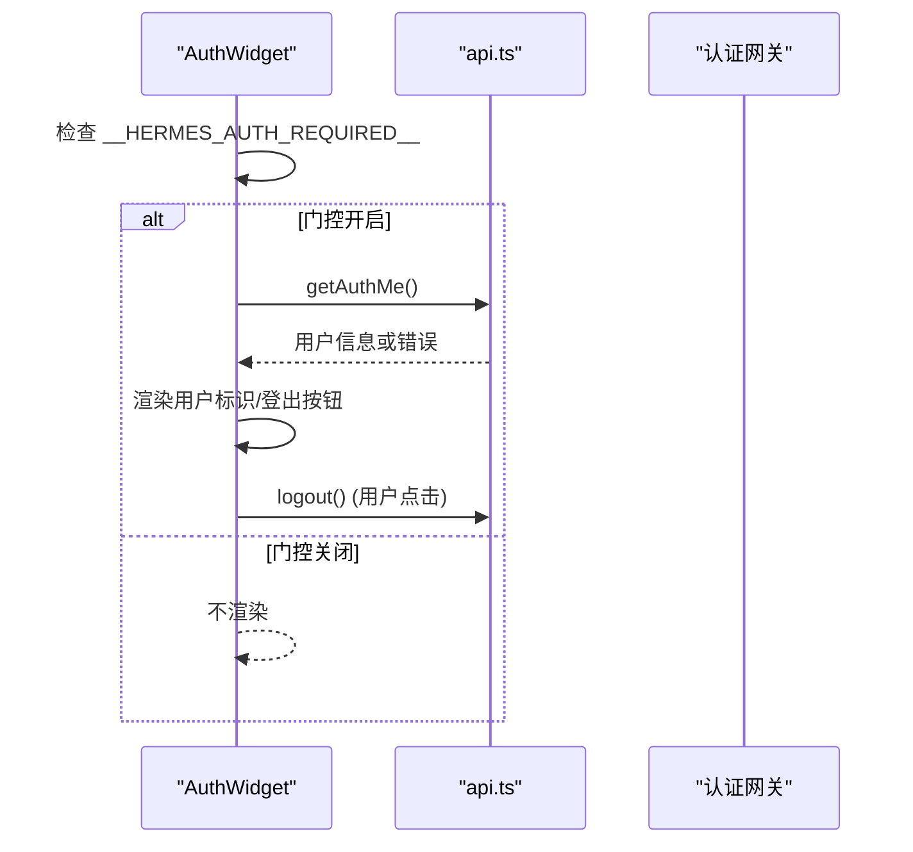
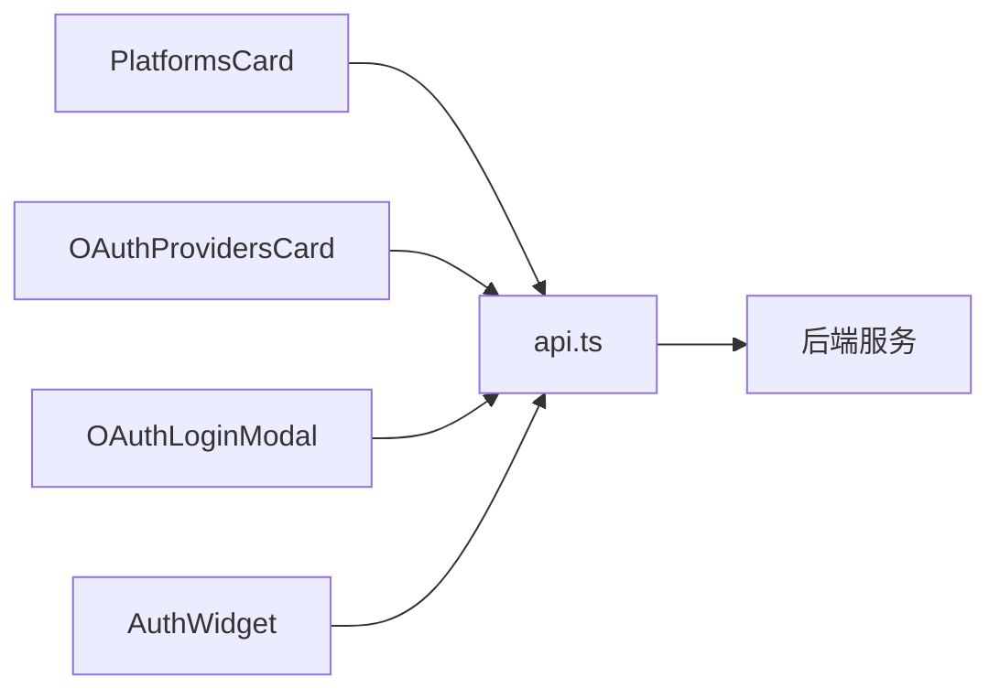

# 平台和认证组件

<cite>
**本文引用的文件**
- [PlatformsCard.tsx](file://web/src/components/PlatformsCard.tsx)
- [OAuthLoginModal.tsx](file://web/src/components/OAuthLoginModal.tsx)
- [OAuthProvidersCard.tsx](file://web/src/components/OAuthProvidersCard.tsx)
- [AuthWidget.tsx](file://web/src/components/AuthWidget.tsx)
- [api.ts](file://web/src/lib/api.ts)
</cite>

## 目录
1. [简介](#简介)
2. [项目结构](#项目结构)
3. [核心组件](#核心组件)
4. [架构总览](#架构总览)
5. [详细组件分析](#详细组件分析)
6. [依赖关系分析](#依赖关系分析)
7. [性能与可用性](#性能与可用性)
8. [故障排查指南](#故障排查指南)
9. [结论](#结论)
10. [附录：集成与扩展指南](#附录：集成与扩展指南)

## 简介
本文件聚焦平台与认证相关的 UI 组件，系统性说明 PlatformsCard、OAuthLoginModal、OAuthProvidersCard 和 AuthWidget 的功能、实现细节、数据流与安全考量。文档覆盖平台连接状态展示、OAuth 登录流程（PKCE 与设备码）、认证提供者选择与状态显示、会话保持与令牌管理、错误处理与权限控制，并提供最佳实践与扩展指南，帮助开发者安全地集成自定义认证提供商与平台。

## 项目结构
- 前端组件位于 web/src/components，负责渲染平台状态、OAuth 登录交互、认证提供者列表与当前用户身份展示。
- API 封装位于 web/src/lib/api.ts，统一处理请求头注入、会话令牌、401/403 处理、重定向与 WebSocket 票据机制。
- 组件通过 api.ts 调用后端 OAuth 与认证接口，完成登录、轮询、提交授权码、断开连接等操作。

图表来源
- [PlatformsCard.tsx:1-109](file://web/src/components/PlatformsCard.tsx#L1-L109)
- [OAuthProvidersCard.tsx:1-288](file://web/src/components/OAuthProvidersCard.tsx#L1-L288)
- [OAuthLoginModal.tsx:1-396](file://web/src/components/OAuthLoginModal.tsx#L1-L396)
- [AuthWidget.tsx:1-161](file://web/src/components/AuthWidget.tsx#L1-L161)
- [api.ts:102-183](file://web/src/lib/api.ts#L102-L183)

章节来源
- [PlatformsCard.tsx:1-109](file://web/src/components/PlatformsCard.tsx#L1-L109)
- [OAuthProvidersCard.tsx:1-288](file://web/src/components/OAuthProvidersCard.tsx#L1-L288)
- [OAuthLoginModal.tsx:1-396](file://web/src/components/OAuthLoginModal.tsx#L1-L396)
- [AuthWidget.tsx:1-161](file://web/src/components/AuthWidget.tsx#L1-L161)
- [api.ts:102-183](file://web/src/lib/api.ts#L102-L183)

## 核心组件
- PlatformsCard：展示已连接平台的实时状态（已连接/未连接/禁用/致命错误），含图标、错误消息与最后更新时间。
- OAuthProvidersCard：列出所有 OAuth 提供者，显示登录状态、过期时间、CLI 命令、文档链接；支持登录、断开连接与刷新。
- OAuthLoginModal：实现 PKCE 与设备码两种 OAuth 流程，包含倒计时、轮询、提交授权码、错误重试与关闭清理。
- AuthWidget：在侧边栏显示“已登录为 …”，支持登出；在未启用认证门控时不渲染。

章节来源
- [PlatformsCard.tsx:8-109](file://web/src/components/PlatformsCard.tsx#L8-L109)
- [OAuthProvidersCard.tsx:52-288](file://web/src/components/OAuthProvidersCard.tsx#L52-L288)
- [OAuthLoginModal.tsx:28-396](file://web/src/components/OAuthLoginModal.tsx#L28-L396)
- [AuthWidget.tsx:43-161](file://web/src/components/AuthWidget.tsx#L43-L161)

## 架构总览
整体认证与平台连接由前端组件驱动，通过 api.ts 统一发起 HTTP 请求，后端提供 OAuth 流程与认证会话管理。关键路径包括：
- 获取 OAuth 提供者列表与状态
- 启动 OAuth 登录（PKCE 或设备码）
- 轮询设备码审批结果
- 提交 PKCE 授权码换取令牌
- 断开 OAuth 连接
- 查询当前用户信息并支持登出

图表来源
- [OAuthLoginModal.tsx:42-120](file://web/src/components/OAuthLoginModal.tsx#L42-L120)
- [api.ts:825-852](file://web/src/lib/api.ts#L825-L852)

## 详细组件分析

### PlatformsCard 组件
- 功能：以卡片形式展示各平台的状态（connected/disabled/fatal/其他），显示错误消息与最后更新时间，使用不同图标与徽章颜色区分状态。
- 数据模型：接收 [name, PlatformStatus][] 数组，PlatformStatus 包含 state、error_message、updated_at 等字段。
- 交互：只读展示，无直接操作。
- 可访问性：使用语义化布局与文本，便于屏幕阅读器理解。

图表来源
- [PlatformsCard.tsx:8-109](file://web/src/components/PlatformsCard.tsx#L8-L109)

章节来源
- [PlatformsCard.tsx:8-109](file://web/src/components/PlatformsCard.tsx#L8-L109)

### OAuthProvidersCard 组件
- 功能：加载并展示 OAuth 提供者列表，显示登录状态、过期时间、CLI 命令、文档链接；支持登录、断开连接与刷新。
- 数据流：
  - 初始化时调用 getOAuthProviders 获取列表。
  - 计算已连接数量与总数用于描述文案。
  - 格式化 expires_at 为剩余时间或“已过期”。
- 交互：
  - 未登录且非 external 流程：触发 OAuthLoginModal。
  - 已登录且非 external 流程：弹出确认对话框后调用 disconnectOAuthProvider。
  - external 流程：仅显示“外部管理”提示。
- 错误处理：加载失败通过 onError 回调上报。

图表来源
- [OAuthProvidersCard.tsx:64-89](file://web/src/components/OAuthProvidersCard.tsx#L64-L89)
- [OAuthProvidersCard.tsx:134-259](file://web/src/components/OAuthProvidersCard.tsx#L134-L259)
- [OAuthProvidersCard.tsx:263-284](file://web/src/components/OAuthProvidersCard.tsx#L263-L284)
- [api.ts:825-833](file://web/src/lib/api.ts#L825-L833)

章节来源
- [OAuthProvidersCard.tsx:52-288](file://web/src/components/OAuthProvidersCard.tsx#L52-L288)
- [api.ts:825-833](file://web/src/lib/api.ts#L825-L833)

### OAuthLoginModal 组件
- 功能：实现 PKCE 与设备码两种 OAuth 流程，包含倒计时、轮询、提交授权码、错误重试与关闭清理。
- 生命周期：
  - 挂载时调用 startOAuthLogin，根据 flow 决定后续步骤。
  - 设备码模式：每 2 秒轮询 pollOAuthSession，直到 approved/pending/error。
  - PKCE 模式：打开授权页，等待用户粘贴 code 并提交 submitOAuthCode。
  - 倒计时：expires_in 每秒递减，超时进入 error。
  - 关闭：若未完成则调用 cancelOAuthSession 清理会话。
- 错误处理：网络异常、轮询失败、提交失败均进入 error 阶段，支持重试。
- 用户体验：复制设备码、重新打开验证链接、倒计时提示、成功自动关闭。

图表来源
- [OAuthLoginModal.tsx:42-120](file://web/src/components/OAuthLoginModal.tsx#L42-L120)
- [OAuthLoginModal.tsx:122-158](file://web/src/components/OAuthLoginModal.tsx#L122-L158)
- [OAuthLoginModal.tsx:171-187](file://web/src/components/OAuthLoginModal.tsx#L171-L187)
- [OAuthLoginModal.tsx:236-390](file://web/src/components/OAuthLoginModal.tsx#L236-L390)

章节来源
- [OAuthLoginModal.tsx:28-396](file://web/src/components/OAuthLoginModal.tsx#L28-L396)
- [api.ts:834-852](file://web/src/lib/api.ts#L834-L852)

### AuthWidget 组件
- 功能：在侧边栏显示“已登录为 …”，支持登出；在未启用认证门控时不渲染。
- 行为：
  - 检测 window.__HERMES_AUTH_REQUIRED__ 决定是否请求 /api/auth/me。
  - 401/403 时隐藏组件；网络错误显示“auth status unavailable”。
  - 显示 display_name/email/user_id（截断）与 provider。
  - 登出调用 logout。
- 安全性：仅在门控开启时请求用户信息，避免不必要的 401 日志噪音。

图表来源
- [AuthWidget.tsx:48-83](file://web/src/components/AuthWidget.tsx#L48-L83)
- [AuthWidget.tsx:116-158](file://web/src/components/AuthWidget.tsx#L116-L158)
- [api.ts:102-183](file://web/src/lib/api.ts#L102-L183)

章节来源
- [AuthWidget.tsx:43-161](file://web/src/components/AuthWidget.tsx#L43-L161)
- [api.ts:102-183](file://web/src/lib/api.ts#L102-L183)

## 依赖关系分析
- 组件对 api.ts 的依赖：
  - OAuthProvidersCard：getOAuthProviders、disconnectOAuthProvider
  - OAuthLoginModal：startOAuthLogin、pollOAuthSession、submitOAuthCode、cancelOAuthSession
  - AuthWidget：getAuthMe、logout
- api.ts 的职责：
  - 注入会话令牌头 X-Hermes-Session-Token
  - 统一处理 401/403：结构化响应重定向到登录页；循环模式下尝试一次刷新令牌
  - 支持带 profile 参数的受保护端点族
  - 提供 WebSocket 票据获取（gated 模式）

图表来源
- [api.ts:102-183](file://web/src/lib/api.ts#L102-L183)
- [api.ts:825-852](file://web/src/lib/api.ts#L825-L852)

章节来源
- [api.ts:102-183](file://web/src/lib/api.ts#L102-L183)
- [api.ts:825-852](file://web/src/lib/api.ts#L825-L852)

## 性能与可用性
- 轮询优化：设备码模式每 2 秒轮询，避免频繁请求；在 approved/error 时立即停止定时器。
- 倒计时与清理：使用 setInterval 与 clearInterval 管理倒计时与轮询，组件卸载时清理资源，防止内存泄漏。
- 防抖与节流：复制设备码状态短暂反馈，避免重复操作。
- 可访问性：模态框使用 role="dialog" 与 aria-modal，按钮具备 aria-label，提升无障碍体验。
- 首屏渲染：PlatformsCard 与 OAuthProvidersCard 在加载时显示占位与加载指示，减少布局抖动。

[本节为通用指导，无需特定文件引用]

## 故障排查指南
- OAuth 登录失败：
  - 检查 startOAuthLogin 是否返回有效 flow、session_id、expires_in。
  - 设备码模式：确认 pollOAuthSession 返回 pending/approved/error；若 error，查看 error_message。
  - PKCE 模式：确认用户正确粘贴 code；submitOAuthCode 返回 ok 与 status。
- 会话过期：
  - 倒计时归零进入 error，提示“会话已过期”；建议重试。
  - 全局 401 处理会携带 login_url 并重定向到登录页，保留 lastLocation 以便登录后返回。
- 断开连接失败：
  - disconnectOAuthProvider 抛出异常时通过 onError 上报；确认网络与服务端状态。
- 认证门控：
  - AuthWidget 在未启用门控时不渲染；若出现 401/403，组件隐藏以避免干扰。

章节来源
- [OAuthLoginModal.tsx:90-120](file://web/src/components/OAuthLoginModal.tsx#L90-L120)
- [OAuthLoginModal.tsx:122-158](file://web/src/components/OAuthLoginModal.tsx#L122-L158)
- [OAuthLoginModal.tsx:336-390](file://web/src/components/OAuthLoginModal.tsx#L336-L390)
- [api.ts:123-183](file://web/src/lib/api.ts#L123-L183)

## 结论
本平台与认证组件通过清晰的职责划分与统一的 API 封装，实现了安全的 OAuth 登录流程（PKCE 与设备码）、直观的平台状态展示与便捷的认证提供者管理。结合会话令牌注入、401/403 处理与门控模式，确保了用户体验与安全性。建议在生产环境中严格配置 OAuth 提供商、合理设置过期时间与轮询间隔，并完善错误提示与重试机制。

[本节为总结，无需特定文件引用]

## 附录：集成与扩展指南

### 认证协议支持与令牌管理
- 支持的 OAuth 流程：
  - PKCE：适用于浏览器环境，安全交换授权码。
  - 设备码：适用于受限输入场景，轮询审批结果。
- 令牌管理：
  - 会话令牌通过 X-Hermes-Session-Token 注入到所有 /api/ 请求。
  - 401 时尝试一次刷新令牌；若仍失败，重定向到登录页。
  - gated 模式下 WebSocket 升级使用一次性 ticket，避免泄露长期令牌。

章节来源
- [api.ts:28-47](file://web/src/lib/api.ts#L28-L47)
- [api.ts:102-183](file://web/src/lib/api.ts#L102-L183)

### 会话保持机制
- 门控模式：通过 cookie 与结构化 401 响应维持会话；SPA 保存 lastLocation 以便登录后返回。
- 循环模式：每次服务器重启后令牌轮换，首次 401 触发页面刷新以获取新令牌。
- WebSocket：gated 模式使用 ticket 进行一次性认证，提高安全性。

章节来源
- [api.ts:123-183](file://web/src/lib/api.ts#L123-L183)

### 安全配置与用户体验优化
- 安全配置：
  - 使用 HTTPS 与严格的 CORS 策略。
  - 限制 OAuth 回调域与重定向 URL。
  - 最小化暴露敏感信息（如 token_preview）。
- 用户体验：
  - 提供清晰的状态提示与错误信息。
  - 支持复制设备码与重新打开验证链接。
  - 倒计时与自动关闭提升流畅度。

[本节为通用指导，无需特定文件引用]

### 故障恢复策略
- 重试机制：OAuth 登录失败支持一键重试，重新发起 startOAuthLogin。
- 轮询容错：设备码轮询捕获异常并进入 error，允许用户重试。
- 网络异常：全局 fetchJSON 将状态码与文本组合为错误消息，便于定位问题。

章节来源
- [OAuthLoginModal.tsx:336-390](file://web/src/components/OAuthLoginModal.tsx#L336-L390)
- [api.ts:178-183](file://web/src/lib/api.ts#L178-L183)

### 自定义认证提供商与平台集成
- 添加新的 OAuth 提供商：
  - 在后端注册提供商元数据（id、name、flow、cli_command、docs_url）。
  - 确保 startOAuthLogin 返回正确的 flow 与必要字段。
  - 实现 pollOAuthSession 与 submitOAuthCode 的语义。
- 平台集成：
  - 在平台状态中补充 state、error_message、updated_at 字段。
  - 在前端 PlatformsCard 中映射新状态到徽章与图标。
- 测试建议：
  - 覆盖 PKCE 与设备码流程的正反用例。
  - 模拟 401/403 与网络异常，验证重定向与错误提示。
  - 验证断开连接与令牌清理。

[本节为通用指导，无需特定文件引用]