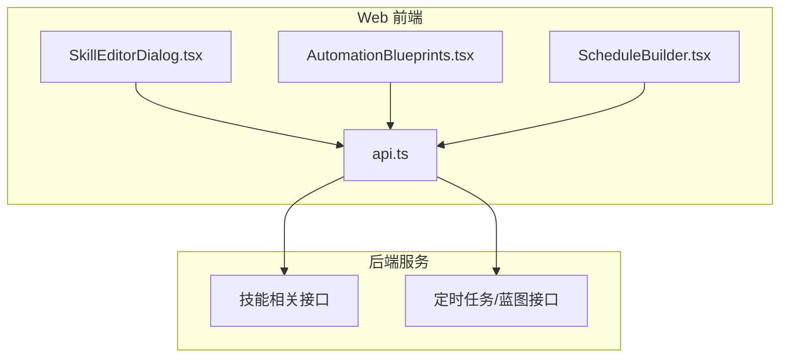
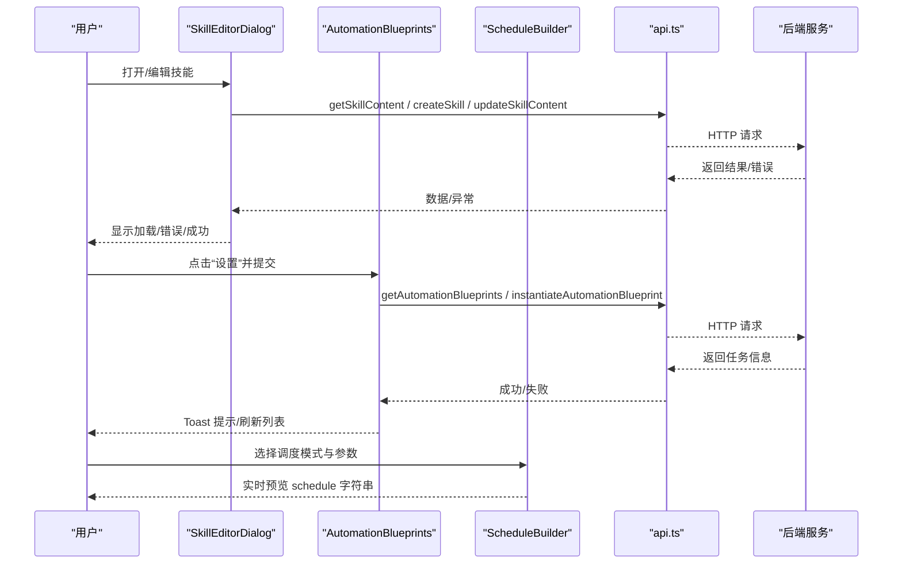
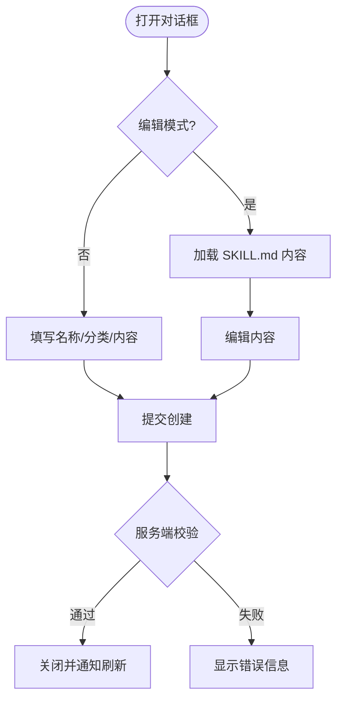
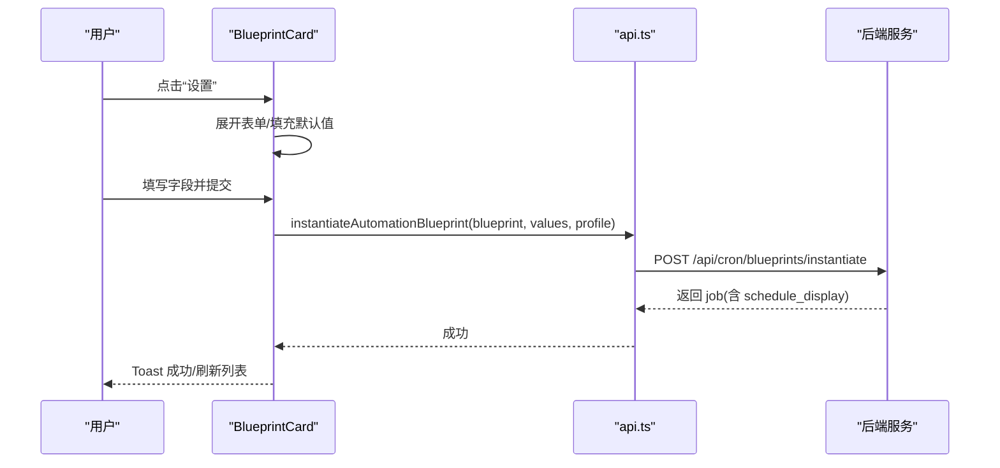
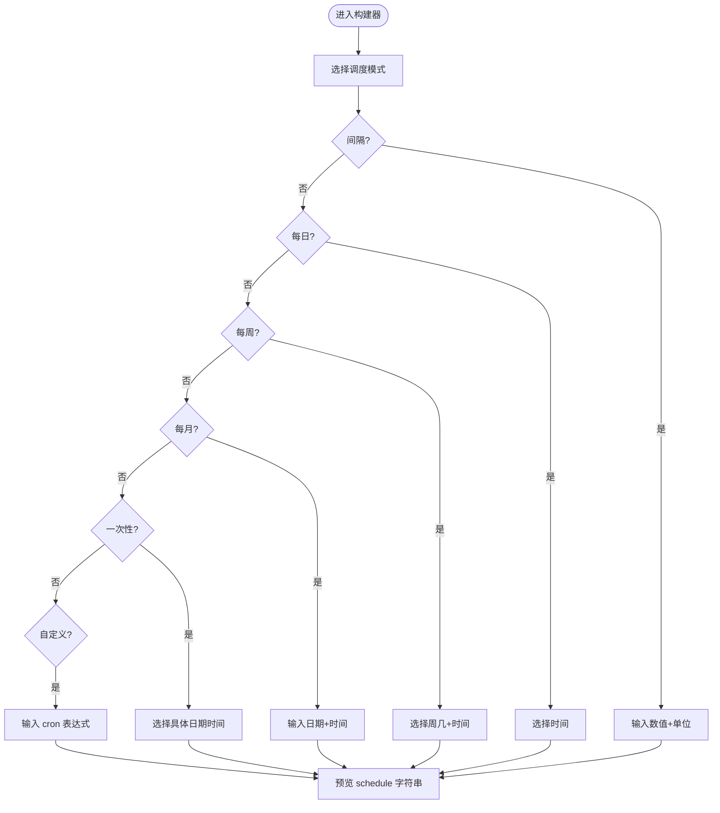
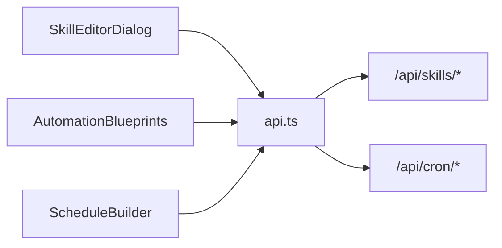

# 技能和自动化组件

<cite>
**本文引用的文件**
- [SkillEditorDialog.tsx](file://web/src/components/SkillEditorDialog.tsx)
- [AutomationBlueprints.tsx](file://web/src/components/AutomationBlueprints.tsx)
- [ScheduleBuilder.tsx](file://web/src/components/ScheduleBuilder.tsx)
- [api.ts](file://web/src/lib/api.ts)
</cite>

## 目录
1. [简介](#简介)
2. [项目结构](#项目结构)
3. [核心组件](#核心组件)
4. [架构总览](#架构总览)
5. [详细组件分析](#详细组件分析)
6. [依赖关系分析](#依赖关系分析)
7. [性能考虑](#性能考虑)
8. [故障排查指南](#故障排查指南)
9. [结论](#结论)
10. [附录：最佳实践与开发指引](#附录：最佳实践与开发指引)

## 简介
本文件聚焦于技能与自动化相关的三个前端 UI 组件：技能编辑器对话框（SkillEditorDialog）、自动化蓝图管理（AutomationBlueprints）和定时任务构建器（ScheduleBuilder）。文档从系统架构、组件职责、数据流、处理逻辑、集成点、错误处理和性能特性等维度进行系统化说明，并给出技能配置验证、蓝图模板系统与调度规则设置的工作流程。同时提供技能开发与自动化工作流设计的最佳实践，包括代码规范、测试策略与部署流程建议。

## 项目结构
这三个组件位于 Web 前端应用中，统一通过 API 客户端模块与后端交互，完成技能的创建/编辑、蓝图的实例化以及调度规则的可视化配置。

图表来源
- [SkillEditorDialog.tsx:1-216](file://web/src/components/SkillEditorDialog.tsx#L1-L216)
- [AutomationBlueprints.tsx:1-226](file://web/src/components/AutomationBlueprints.tsx#L1-L226)
- [ScheduleBuilder.tsx:1-274](file://web/src/components/ScheduleBuilder.tsx#L1-L274)
- [api.ts:337-400](file://web/src/lib/api.ts#L337-L400)

章节来源
- [SkillEditorDialog.tsx:1-216](file://web/src/components/SkillEditorDialog.tsx#L1-L216)
- [AutomationBlueprints.tsx:1-226](file://web/src/components/AutomationBlueprints.tsx#L1-L226)
- [ScheduleBuilder.tsx:1-274](file://web/src/components/ScheduleBuilder.tsx#L1-L274)
- [api.ts:337-400](file://web/src/lib/api.ts#L337-L400)

## 核心组件
- 技能编辑器对话框（SkillEditorDialog）
  - 功能：在仪表板中创建或编辑 SKILL.md；支持名称、可选分类与内容编辑；保存时由服务端校验 frontmatter、名称与大小等。
  - 关键交互：打开时根据 editName 决定“新建”或“编辑”模式；编辑模式下加载现有内容；提交时调用创建或更新接口。
  - 状态：name、category、content、loading、saving、error。

- 自动化蓝图管理（AutomationBlueprints）
  - 功能：展示可用自动化蓝图卡片；展开后按字段渲染表单；提交后实例化并创建定时任务。
  - 关键交互：加载蓝图列表；点击“设置”展开表单；提交后显示成功提示并可刷新父级任务列表。
  - 状态：blueprints、loadError、各卡片的 open/values/submitting/error。

- 定时任务构建器（ScheduleBuilder）
  - 功能：以可视化方式选择调度模式（间隔、每日、每周、每月、一次性、自定义），生成后端兼容的 schedule 字符串。
  - 关键交互：切换模式保留各自子状态；时间选择使用原生 time/datetime-local；实时预览生成的表达式。
  - 状态：mode、intervalValue/intervalUnit、timeOfDay、weekdays、dayOfMonth、onceAt、custom。

章节来源
- [SkillEditorDialog.tsx:15-216](file://web/src/components/SkillEditorDialog.tsx#L15-L216)
- [AutomationBlueprints.tsx:22-165](file://web/src/components/AutomationBlueprints.tsx#L22-L165)
- [ScheduleBuilder.tsx:17-235](file://web/src/components/ScheduleBuilder.tsx#L17-L235)

## 架构总览
组件通过统一的 API 客户端与后端通信，遵循受控组件模式：父组件持有状态并通过回调更新，组件仅负责渲染与事件派发。

图表来源
- [SkillEditorDialog.tsx:89-135](file://web/src/components/SkillEditorDialog.tsx#L89-L135)
- [AutomationBlueprints.tsx:85-102](file://web/src/components/AutomationBlueprints.tsx#L85-L102)
- [ScheduleBuilder.tsx:44-80](file://web/src/components/ScheduleBuilder.tsx#L44-L80)
- [api.ts:630-636](file://web/src/lib/api.ts#L630-L636)
- [api.ts:751-761](file://web/src/lib/api.ts#L751-L761)

## 详细组件分析

### 技能编辑器对话框（SkillEditorDialog）
- 职责
  - 新建：填写名称、可选分类与 SKILL.md 内容，调用创建接口。
  - 编辑：加载现有 SKILL.md 文本，修改后调用更新接口。
  - 校验：前端做基础非空校验；服务端对 frontmatter、名称、大小等进行校验并返回可操作错误消息。
- 数据流
  - 打开编辑模式时读取内容；保存时根据模式调用不同 API；成功后关闭并通知父组件刷新。
- 错误处理
  - 捕获网络/服务端错误并展示；保存过程中禁用按钮并显示加载态。
- 性能
  - 使用 key 重置内部状态避免跨次打开的状态污染；懒加载编辑内容。

图表来源
- [SkillEditorDialog.tsx:89-135](file://web/src/components/SkillEditorDialog.tsx#L89-L135)
- [SkillEditorDialog.tsx:137-216](file://web/src/components/SkillEditorDialog.tsx#L137-L216)

章节来源
- [SkillEditorDialog.tsx:15-216](file://web/src/components/SkillEditorDialog.tsx#L15-L216)

### 自动化蓝图管理（AutomationBlueprints）
- 职责
  - 拉取蓝图列表并渲染卡片；每张卡片按字段类型渲染输入控件；提交后实例化蓝图并创建定时任务。
- 数据流
  - 初始化时获取蓝图；展开卡片填充默认值；提交时调用实例化接口；成功后提示并可选择刷新父级任务列表。
- 错误处理
  - 加载失败显示错误；提交失败解析服务端 422 的 slot 级校验消息并展示。
- 性能
  - 卡片内局部状态；提交时短暂禁用按钮防止重复提交。

图表来源
- [AutomationBlueprints.tsx:85-102](file://web/src/components/AutomationBlueprints.tsx#L85-L102)
- [api.ts:630-636](file://web/src/lib/api.ts#L630-L636)

章节来源
- [AutomationBlueprints.tsx:22-165](file://web/src/components/AutomationBlueprints.tsx#L22-L165)
- [AutomationBlueprints.tsx:167-226](file://web/src/components/AutomationBlueprints.tsx#L167-L226)

### 定时任务构建器（ScheduleBuilder）
- 职责
  - 提供多种调度模式的可视化选择：间隔、每日、每周、每月、一次性、自定义。
  - 将用户输入转换为后端兼容的 schedule 字符串，并在界面实时预览。
- 数据流
  - 受控组件：父组件维护 ScheduleBuilderState；onChange 推送增量更新；buildScheduleString 在渲染时生成最终字符串。
- 交互细节
  - 时间选择使用原生 input[type=time] 与 datetime-local，保证格式与后端一致。
  - 周几选择为多选按钮组；自定义模式直接输入 cron 表达式。
- 错误处理
  - 数值输入限制范围；非法值回退到默认值；预览为空时显示占位提示。

图表来源
- [ScheduleBuilder.tsx:44-235](file://web/src/components/ScheduleBuilder.tsx#L44-L235)

章节来源
- [ScheduleBuilder.tsx:17-235](file://web/src/components/ScheduleBuilder.tsx#L17-L235)

## 依赖关系分析
- 组件依赖
  - SkillEditorDialog 依赖 api.ts 的技能接口（获取/创建/更新）。
  - AutomationBlueprints 依赖 api.ts 的蓝图接口（获取/实例化）。
  - ScheduleBuilder 依赖本地 schedule 工具函数（构建 schedule 字符串）与 i18n 文案。
- API 客户端
  - 统一封装 fetchJSON/authedFetch，自动附加会话令牌、处理 401 重定向、追加 profile 参数等。
  - 暴露 getAutomationBlueprints、instantiateAutomationBlueprint、getSkillContent、createSkill、updateSkillContent 等方法。

图表来源
- [api.ts:337-400](file://web/src/lib/api.ts#L337-L400)
- [api.ts:630-636](file://web/src/lib/api.ts#L630-L636)
- [api.ts:751-761](file://web/src/lib/api.ts#L751-L761)

章节来源
- [api.ts:337-400](file://web/src/lib/api.ts#L337-L400)
- [api.ts:630-636](file://web/src/lib/api.ts#L630-L636)
- [api.ts:751-761](file://web/src/lib/api.ts#L751-L761)

## 性能考虑
- 组件级优化
  - 使用 key 重置编辑器状态，避免跨次打开时的残留状态。
  - 仅在编辑模式加载内容，减少不必要的网络请求。
  - 提交期间禁用按钮并显示加载指示，防止重复提交。
- 网络与渲染
  - 蓝图卡片采用局部状态，避免整页重渲染。
  - 调度构建器使用原生输入控件，减少自定义解析开销。
- 可访问性与国际化
  - 使用语义化标签与 aria 属性提升可访问性。
  - 通过 i18n 文案降低硬编码成本，便于多语言扩展。

[本节为通用指导，不直接分析具体文件]

## 故障排查指南
- 技能编辑器
  - 问题：保存时报错。排查前端非空校验与服务端返回的错误消息；确认名称与内容是否满足要求。
  - 现象：编辑模式无内容。检查 getSkillContent 是否被调用及返回状态。
- 自动化蓝图
  - 问题：实例化失败。查看 422 响应中的 slot 级校验消息；确认必填字段是否完整。
  - 现象：无法加载蓝图。检查 getAutomationBlueprints 的网络状态与错误分支。
- 调度构建器
  - 问题：预览为空或格式不正确。检查当前模式对应的必填项；自定义模式需符合后端解析规则。
  - 现象：切换模式后数据丢失。确认父组件是否正确合并增量状态。

章节来源
- [SkillEditorDialog.tsx:102-135](file://web/src/components/SkillEditorDialog.tsx#L102-L135)
- [AutomationBlueprints.tsx:85-102](file://web/src/components/AutomationBlueprints.tsx#L85-L102)
- [ScheduleBuilder.tsx:193-235](file://web/src/components/ScheduleBuilder.tsx#L193-L235)

## 结论
SkillEditorDialog、AutomationBlueprints 与 ScheduleBuilder 共同构成了技能与自动化工作流的可视化入口。它们通过统一的 API 客户端与后端协作，实现了技能内容的在线编辑、蓝图的快速实例化以及调度规则的友好配置。遵循受控组件模式、清晰的错误反馈与良好的性能设计，使开发者与用户能够高效地完成技能开发与自动化流程编排。

[本节为总结性内容，不直接分析具体文件]

## 附录：最佳实践与开发指引
- 代码规范
  - 保持组件受控：状态由父组件管理，组件只负责渲染与回调。
  - 明确职责边界：UI 组件不直接处理业务校验，交由后端与集中式校验逻辑。
  - 使用 i18n 与可访问性标签，确保多语言与无障碍体验。
- 测试策略
  - 单元测试：对调度构建器的状态转换与预览输出进行断言。
  - 集成测试：模拟 API 响应，验证蓝图实例化与技能保存流程。
  - 错误路径：覆盖 401/422 等异常分支，确保错误提示正确。
- 部署流程
  - 前端构建产物与后端服务解耦部署；确保 BASE_PATH 与认证头正确注入。
  - 灰度发布：先小范围启用新蓝图或调度模式，观察日志与指标后再全量。
- 技能开发与自动化工作流设计
  - 技能编写：遵循 frontmatter 规范，描述清晰的使用场景与步骤；注意敏感信息脱敏。
  - 蓝图设计：字段定义应最小化用户输入成本，提供合理默认值与帮助文案。
  - 调度规则：优先使用内置模式；复杂场景再使用自定义表达式，并提供预览与校验提示。

[本节为通用指导，不直接分析具体文件]