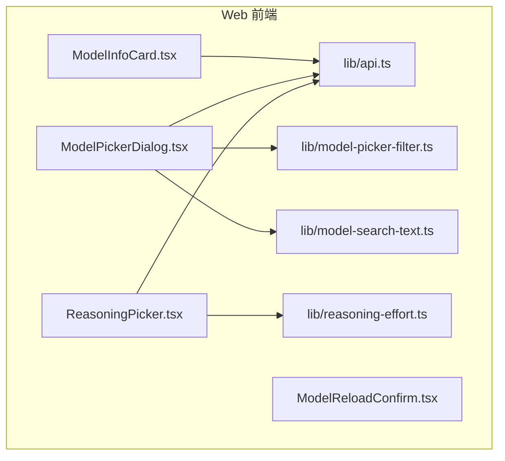
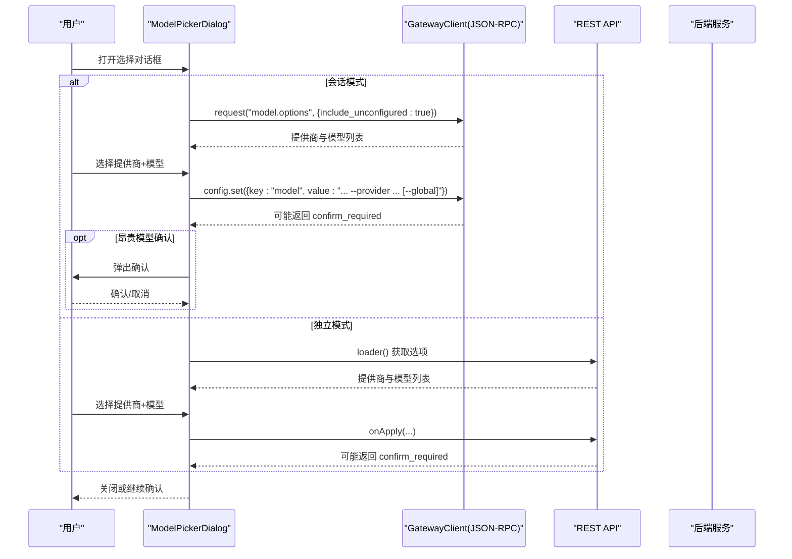
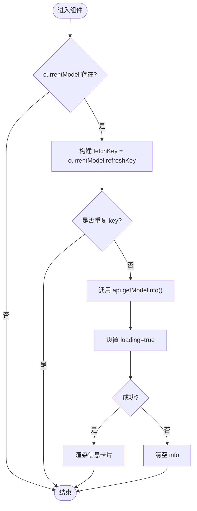
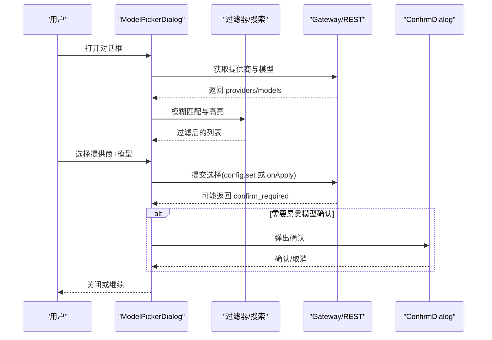
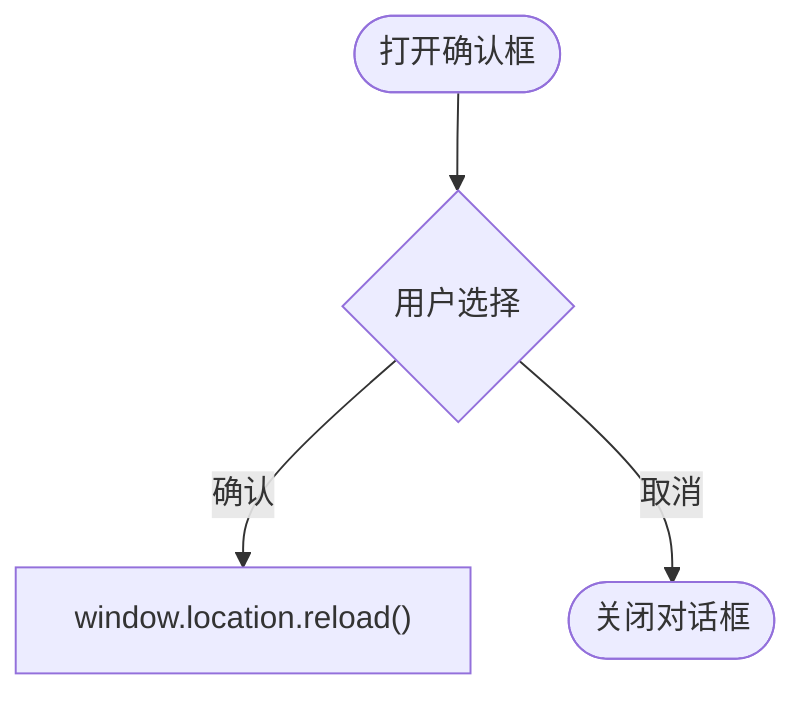
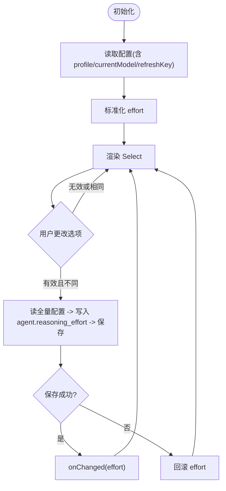
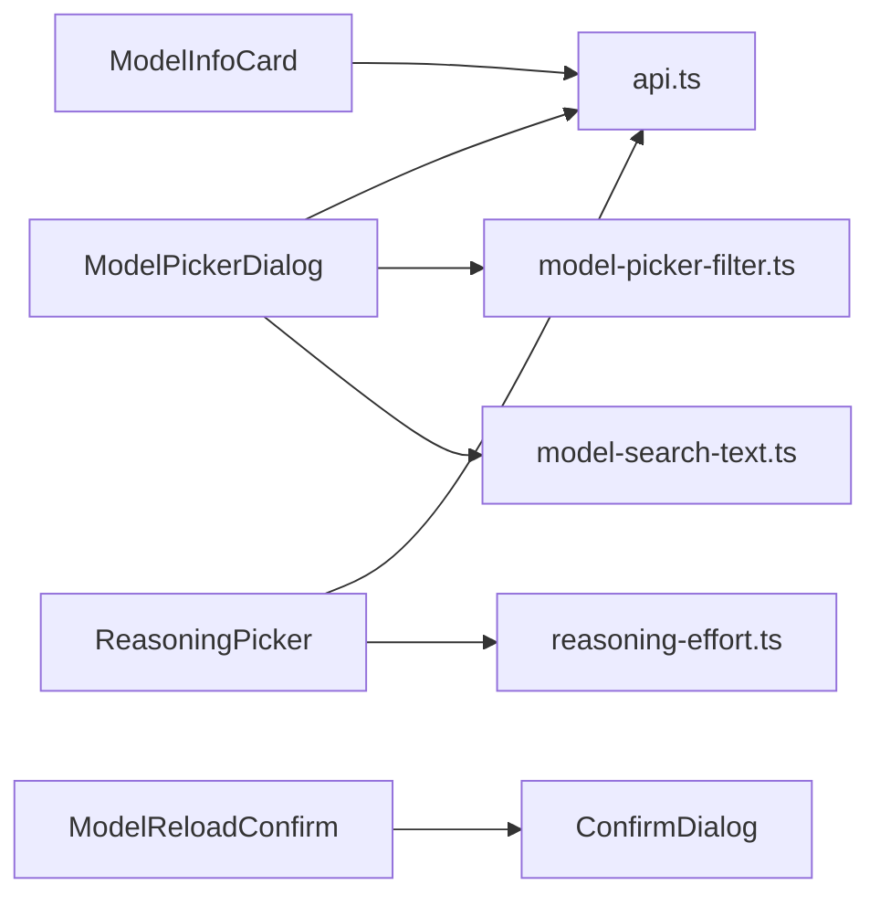

# 模型管理组件

<cite>
**本文引用的文件**
- [ModelInfoCard.tsx](file://web/src/components/ModelInfoCard.tsx)
- [ModelPickerDialog.tsx](file://web/src/components/ModelPickerDialog.tsx)
- [ModelReloadConfirm.tsx](file://web/src/components/ModelReloadConfirm.tsx)
- [ReasoningPicker.tsx](file://web/src/components/ReasoningPicker.tsx)
- [api.ts](file://web/src/lib/api.ts)
- [reasoning-effort.ts](file://web/src/lib/reasoning-effort.ts)
- [model-picker-filter.ts](file://web/src/lib/model-picker-filter.ts)
- [model-search-text.ts](file://web/src/lib/model-search-text.ts)
</cite>

## 目录
1. [简介](#简介)
2. [项目结构](#项目结构)
3. [核心组件](#核心组件)
4. [架构总览](#架构总览)
5. [详细组件分析](#详细组件分析)
6. [依赖关系分析](#依赖关系分析)
7. [性能考虑](#性能考虑)
8. [故障排查指南](#故障排查指南)
9. [结论](#结论)
10. [附录：API 参考与最佳实践](#附录api-参考与最佳实践)

## 简介
本文件面向开发者，系统化梳理模型管理相关的四个前端 UI 组件：ModelInfoCard、ModelPickerDialog、ModelReloadConfirm、ReasoningPicker。内容覆盖功能说明、实现要点、数据流、错误处理、用户交互流程、API 参考、配置选项、事件回调，以及扩展与集成建议。目标是帮助读者快速理解并安全地扩展模型管理能力。

## 项目结构
这些组件位于 Web 前端工程内，围绕“模型信息展示”“模型选择对话框”“重新加载确认”“推理模式选择器”四大职责组织。它们通过统一的 API 层与后端交互，复用通用工具（模糊匹配、搜索文本、推理努力值规范化等）。

图表来源
- [ModelInfoCard.tsx:1-113](file://web/src/components/ModelInfoCard.tsx#L1-L113)
- [ModelPickerDialog.tsx:1-681](file://web/src/components/ModelPickerDialog.tsx#L1-L681)
- [ModelReloadConfirm.tsx:1-41](file://web/src/components/ModelReloadConfirm.tsx#L1-L41)
- [ReasoningPicker.tsx:1-126](file://web/src/components/ReasoningPicker.tsx#L1-L126)
- [api.ts](file://web/src/lib/api.ts)
- [reasoning-effort.ts](file://web/src/lib/reasoning-effort.ts)
- [model-picker-filter.ts](file://web/src/lib/model-picker-filter.ts)
- [model-search-text.ts](file://web/src/lib/model-search-text.ts)

章节来源
- [ModelInfoCard.tsx:1-113](file://web/src/components/ModelInfoCard.tsx#L1-L113)
- [ModelPickerDialog.tsx:1-681](file://web/src/components/ModelPickerDialog.tsx#L1-L681)
- [ModelReloadConfirm.tsx:1-41](file://web/src/components/ModelReloadConfirm.tsx#L1-L41)
- [ReasoningPicker.tsx:1-126](file://web/src/components/ReasoningPicker.tsx#L1-L126)

## 核心组件
- ModelInfoCard：根据当前模型动态拉取并展示能力与上下文窗口等信息。
- ModelPickerDialog：两阶段模型选择（先选提供商，再选模型），支持会话模式与独立模式，内置昂贵模型确认与全局持久化开关。
- ModelReloadConfirm：在切换模型后提示刷新页面以应用新配置。
- ReasoningPicker：设置推理努力级别，读写 agent.reasoning_effort 配置项。

章节来源
- [ModelInfoCard.tsx:8-113](file://web/src/components/ModelInfoCard.tsx#L8-L113)
- [ModelPickerDialog.tsx:17-91](file://web/src/components/ModelPickerDialog.tsx#L17-L91)
- [ModelReloadConfirm.tsx:3-40](file://web/src/components/ModelReloadConfirm.tsx#L3-L40)
- [ReasoningPicker.tsx:1-44](file://web/src/components/ReasoningPicker.tsx#L1-L44)

## 架构总览
整体交互遵循“读取配置/能力 → 用户选择 → 写回配置 → 必要时刷新会话”的闭环。关键路径如下：
- 模型信息：按 currentModel + refreshKey 触发获取，避免重复请求。
- 模型选择：支持两种调用模式（会话模式走 JSON-RPC；独立模式走 REST），统一封装为 applySelection。
- 推理模式：读全量配置，修改 agent.reasoning_effort 后写回，乐观更新并在失败时回滚。

图表来源
- [ModelPickerDialog.tsx:121-148](file://web/src/components/ModelPickerDialog.tsx#L121-L148)
- [ModelPickerDialog.tsx:268-338](file://web/src/components/ModelPickerDialog.tsx#L268-L338)

## 详细组件分析

### ModelInfoCard：模型信息卡片
- 功能：展示当前模型的上下文窗口、最大输出、能力标签（工具、视觉、推理、模型家族）等。
- 数据源：通过 api.getModelInfo 获取，依赖 currentModel 与 refreshKey 变化触发拉取。
- 状态：loading、info、lastFetchKeyRef（防抖去重）。
- 交互：无直接用户操作，仅被动刷新。
- 错误处理：请求失败时将 info 置空，不中断渲染。

图表来源
- [ModelInfoCard.tsx:23-46](file://web/src/components/ModelInfoCard.tsx#L23-L46)
- [ModelInfoCard.tsx:48-110](file://web/src/components/ModelInfoCard.tsx#L48-L110)

章节来源
- [ModelInfoCard.tsx:8-113](file://web/src/components/ModelInfoCard.tsx#L8-L113)

### ModelPickerDialog：模型选择对话框
- 功能：两阶段选择（提供商→模型），支持模糊搜索、高亮匹配、当前模型标记、昂贵模型确认、全局持久化。
- 模式：
  - 会话模式：通过 GatewayClient 的 JSON-RPC 接口 model.options 与 config.set。
  - 独立模式：通过外部传入的 loader 与 onApply 回调。
- 关键逻辑：
  - 首次加载 providers/models，支持 include_unconfigured。
  - 过滤与排序：fuzzyRank + modelSearchText，对提供商与模型分别进行模糊匹配。
  - 应用选择：applySelection 统一处理两种模式，支持昂贵模型二次确认。
  - 键盘与可访问性：Esc 关闭、aria-modal、role="dialog"。
  - 弹窗定位：createPortal 到 document.body 解决层级问题。
- 错误处理：网络或后端错误显示 error 状态；关闭时清理引用防止内存泄漏。

图表来源
- [ModelPickerDialog.tsx:121-148](file://web/src/components/ModelPickerDialog.tsx#L121-L148)
- [ModelPickerDialog.tsx:216-264](file://web/src/components/ModelPickerDialog.tsx#L216-L264)
- [ModelPickerDialog.tsx:268-338](file://web/src/components/ModelPickerDialog.tsx#L268-L338)
- [ModelPickerDialog.tsx:473-488](file://web/src/components/ModelPickerDialog.tsx#L473-L488)

章节来源
- [ModelPickerDialog.tsx:17-91](file://web/src/components/ModelPickerDialog.tsx#L17-L91)
- [ModelPickerDialog.tsx:121-148](file://web/src/components/ModelPickerDialog.tsx#L121-L148)
- [ModelPickerDialog.tsx:216-264](file://web/src/components/ModelPickerDialog.tsx#L216-L264)
- [ModelPickerDialog.tsx:268-338](file://web/src/components/ModelPickerDialog.tsx#L268-L338)
- [ModelPickerDialog.tsx:345-491](file://web/src/components/ModelPickerDialog.tsx#L345-L491)

### ModelReloadConfirm：重新加载确认
- 功能：在切换模型后提示用户刷新页面以应用新配置，避免部分热替换不可靠的问题。
- 行为：点击确认后执行 window.location.reload()；取消则关闭对话框。
- 使用场景：聊天侧边栏选择器与模型页面共用，保持一致体验。

图表来源
- [ModelReloadConfirm.tsx:17-40](file://web/src/components/ModelReloadConfirm.tsx#L17-L40)

章节来源
- [ModelReloadConfirm.tsx:3-40](file://web/src/components/ModelReloadConfirm.tsx#L3-L40)

### ReasoningPicker：推理模式选择器
- 功能：设置 agent.reasoning_effort，提供低/中/高等级选项。
- 数据流：
  - 读取：根据 currentModel/profile/refreshKey 组合键拉取配置，normalizeEffort 标准化。
  - 写入：读全量配置，修改 agent.reasoning_effort 后 PUT 保存，失败时回滚到上一个值。
- 交互：Select 控件，禁用态保护加载中/保存中；成功后触发 onChanged 回调。
- 错误处理：读取失败保持上次已知值；写入失败回滚并停止保存态。

图表来源
- [ReasoningPicker.tsx:57-72](file://web/src/components/ReasoningPicker.tsx#L57-L72)
- [ReasoningPicker.tsx:74-103](file://web/src/components/ReasoningPicker.tsx#L74-L103)

章节来源
- [ReasoningPicker.tsx:1-44](file://web/src/components/ReasoningPicker.tsx#L1-L44)
- [ReasoningPicker.tsx:57-103](file://web/src/components/ReasoningPicker.tsx#L57-L103)

## 依赖关系分析
- ModelInfoCard 依赖 api.getModelInfo 与格式化函数。
- ModelPickerDialog 依赖 GatewayClient(JSON-RPC) 或外部 loader/onApply，以及模糊匹配与搜索文本工具。
- ModelReloadConfirm 依赖 ConfirmDialog 与浏览器刷新能力。
- ReasoningPicker 依赖 api.getConfig/saveConfig 与 reasoning-effort 工具。

图表来源
- [ModelInfoCard.tsx:1-6](file://web/src/components/ModelInfoCard.tsx#L1-L6)
- [ModelPickerDialog.tsx:1-15](file://web/src/components/ModelPickerDialog.tsx#L1-L15)
- [ModelReloadConfirm.tsx:1-2](file://web/src/components/ModelReloadConfirm.tsx#L1-L2)
- [ReasoningPicker.tsx:22-31](file://web/src/components/ReasoningPicker.tsx#L22-L31)

章节来源
- [ModelInfoCard.tsx:1-113](file://web/src/components/ModelInfoCard.tsx#L1-L113)
- [ModelPickerDialog.tsx:1-681](file://web/src/components/ModelPickerDialog.tsx#L1-L681)
- [ModelReloadConfirm.tsx:1-41](file://web/src/components/ModelReloadConfirm.tsx#L1-L41)
- [ReasoningPicker.tsx:1-126](file://web/src/components/ReasoningPicker.tsx#L1-L126)

## 性能考虑
- 去重请求：ModelInfoCard 使用 lastFetchKeyRef 避免重复拉取；ReasoningPicker 同样基于组合键缓存。
- 懒加载与最小化渲染：对话框仅在打开时加载数据；列表采用虚拟滚动友好的 ListItem 渲染。
- 网络重试与刷新：ModelPickerDialog 提供手动刷新按钮，便于在网络抖动后恢复。
- 本地优化：模糊匹配与高亮计算在 useMemo 中缓存，减少重算。

[本节为通用指导，无需具体文件引用]

## 故障排查指南
- 无法加载模型信息：检查 currentModel 是否为空；查看 api.getModelInfo 是否返回有效数据；确认 refreshKey 是否正确递增。
- 模型选择失败：
  - 会话模式：确认 GatewayClient 可用，config.set 返回值是否包含 confirm_required。
  - 独立模式：确认 loader 与 onApply 实现正确，处理 confirm_required 分支。
- 昂贵模型未提示：检查后端返回 confirm_required 字段；确认 ConfirmDialog 已挂载。
- 推理模式保存失败：确认 getConfig 能读到完整配置；saveConfig 写入 agent.reasoning_effort 后是否成功；失败会回滚到上一值。
- 页面刷新未生效：确保在切换模型后触发了 ModelReloadConfirm 的刷新；或在新的 /new 会话中生效。

章节来源
- [ModelPickerDialog.tsx:150-167](file://web/src/components/ModelPickerDialog.tsx#L150-L167)
- [ModelPickerDialog.tsx:268-338](file://web/src/components/ModelPickerDialog.tsx#L268-L338)
- [ReasoningPicker.tsx:74-103](file://web/src/components/ReasoningPicker.tsx#L74-L103)

## 结论
这四个组件构成了模型管理的核心前端能力：展示、选择、确认与应用。通过统一的 API 层与工具库，实现了良好的可维护性与可扩展性。建议在新增模型或提供商时，优先复用现有选择与确认流程，保证一致的用户体验。

[本节为总结，无需具体文件引用]

## 附录：API 参考与最佳实践

### 组件 API 参考
- ModelInfoCard
  - Props
    - currentModel: string — 当前模型标识，用于触发信息拉取
    - refreshKey?: number — 保存后递增以强制刷新
  - 事件/副作用
    - 内部调用 api.getModelInfo()
    - 成功渲染能力与上下文窗口信息
  - 参考路径
    - [ModelInfoCard.tsx:8-113](file://web/src/components/ModelInfoCard.tsx#L8-L113)

- ModelPickerDialog
  - Props
    - gw?: GatewayClient — 会话模式下使用
    - sessionId?: string — 会话 ID
    - onSubmit?(slashCommand: string): void — 会话模式下的命令提交
    - loader?(options?): Promise<ModelOptionsResponse> — 独立模式的数据加载
    - onApply?(args): Promise<ExpensiveModelConfirmResponse | void> | ExpensiveModelConfirmResponse | void — 独立模式的提交回调
    - onClose(): void — 关闭回调
    - title?: string — 标题
    - alwaysGlobal?: boolean — 隐藏“全局持久化”复选框
  - 事件/副作用
    - 调用 model.options 或 loader 获取提供商与模型
    - 调用 config.set 或 onApply 提交选择
    - 可能弹出昂贵模型确认
  - 参考路径
    - [ModelPickerDialog.tsx:17-91](file://web/src/components/ModelPickerDialog.tsx#L17-L91)
    - [ModelPickerDialog.tsx:121-148](file://web/src/components/ModelPickerDialog.tsx#L121-L148)
    - [ModelPickerDialog.tsx:268-338](file://web/src/components/ModelPickerDialog.tsx#L268-L338)

- ModelReloadConfirm
  - Props
    - model: string | null — 待切换的模型名
    - description?: string — 自定义描述文案
    - onCancel: () => void — 取消回调
  - 事件/副作用
    - 确认后执行 window.location.reload()
  - 参考路径
    - [ModelReloadConfirm.tsx:17-40](file://web/src/components/ModelReloadConfirm.tsx#L17-L40)

- ReasoningPicker
  - Props
    - currentModel: string — 当前模型，影响配置读取
    - profile?: string — 配置文件作用域
    - refreshKey?: number — 保存后递增以同步
    - onChanged?: (effort: string) => void — 成功变更回调
  - 事件/副作用
    - 读取并写入 agent.reasoning_effort
    - 失败时回滚
  - 参考路径
    - [ReasoningPicker.tsx:33-44](file://web/src/components/ReasoningPicker.tsx#L33-L44)
    - [ReasoningPicker.tsx:57-103](file://web/src/components/ReasoningPicker.tsx#L57-L103)

### 配置选项与验证
- 推理努力值
  - 存储键：agent.reasoning_effort
  - 取值范围：由 VALID_EFFORTS 定义，并通过 normalizeEffort 标准化
  - 参考路径
    - [reasoning-effort.ts](file://web/src/lib/reasoning-effort.ts)
    - [ReasoningPicker.tsx:27-31](file://web/src/components/ReasoningPicker.tsx#L27-L31)

- 模型选择
  - 会话模式：通过 config.set 写入 model 与 provider，可选 --global
  - 独立模式：通过 onApply 回调完成写入，支持昂贵模型确认
  - 参考路径
    - [ModelPickerDialog.tsx:305-336](file://web/src/components/ModelPickerDialog.tsx#L305-L336)

### 事件回调
- ModelPickerDialog
  - onSubmit：生成 /model <model> --provider <slug> [--global] 命令
  - onApply：接收 {confirmExpensiveModel, provider, model, persistGlobal}
  - onClose：关闭对话框
  - 参考路径
    - [ModelPickerDialog.tsx:69-91](file://web/src/components/ModelPickerDialog.tsx#L69-L91)
    - [ModelPickerDialog.tsx:333-337](file://web/src/components/ModelPickerDialog.tsx#L333-L337)

- ReasoningPicker
  - onChanged：在成功保存后通知上层，便于显示“下次新建或刷新生效”的提示
  - 参考路径
    - [ReasoningPicker.tsx:41-44](file://web/src/components/ReasoningPicker.tsx#L41-L44)
    - [ReasoningPicker.tsx:94-96](file://web/src/components/ReasoningPicker.tsx#L94-L96)

### 最佳实践
- 性能监控
  - 记录模型信息拉取耗时与失败率
  - 统计昂贵模型确认的触发比例
- 缓存策略
  - 复用 lastFetchKeyRef 避免重复请求
  - 合理递增 refreshKey 以触发必要刷新
- 用户反馈设计
  - 明确区分“会话内生效”与“需重启/刷新生效”的场景
  - 昂贵模型切换前给出清晰警告与确认
- 自定义集成
  - 扩展提供商：在 loader 或后端 model.options 中增加提供商与模型列表
  - 扩展能力标签：在 ModelInfoCard 中依据 capabilities 字段渲染新标签
  - 扩展推理模式：在 reasoning-effort 中添加新等级并更新 UI

[本节为通用指导，无需具体文件引用]