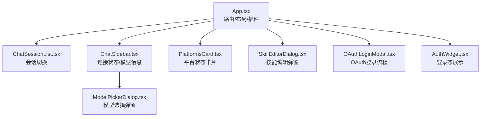
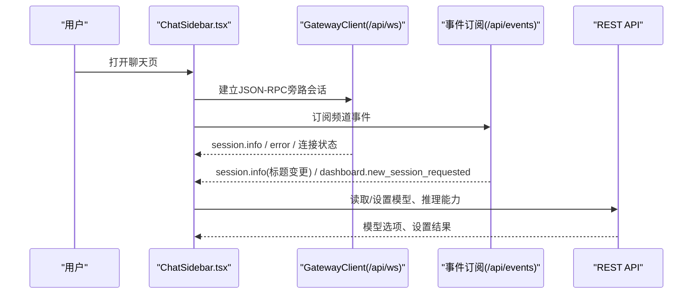
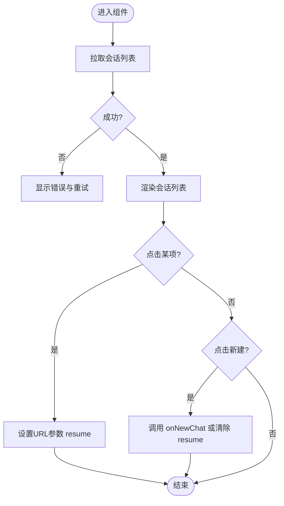
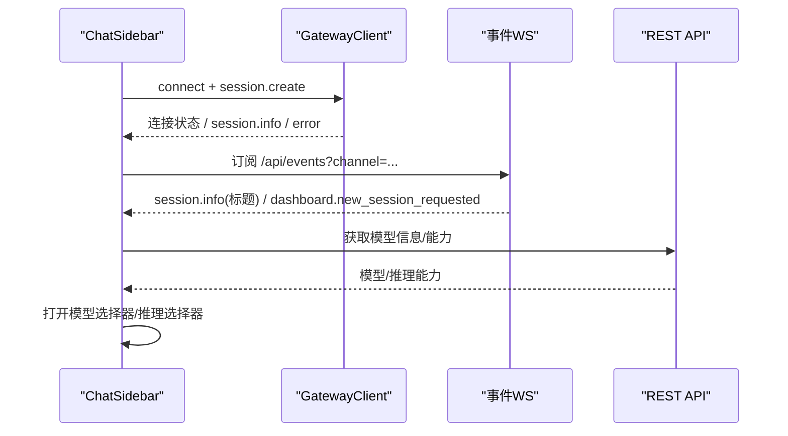
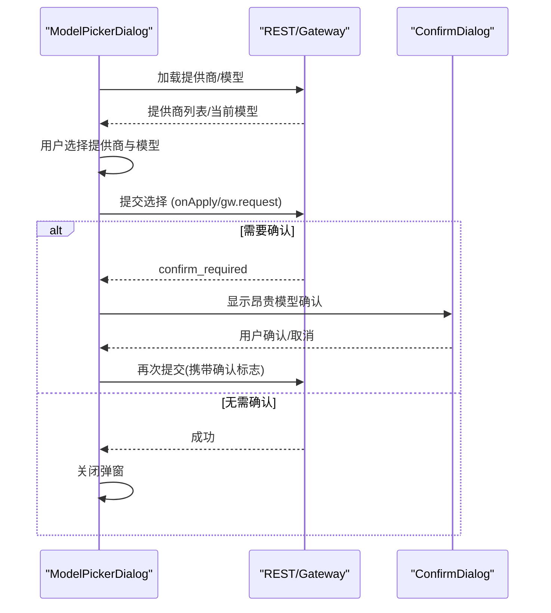
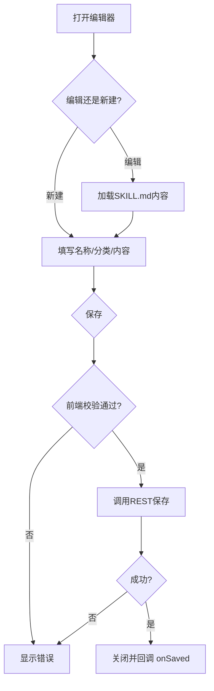
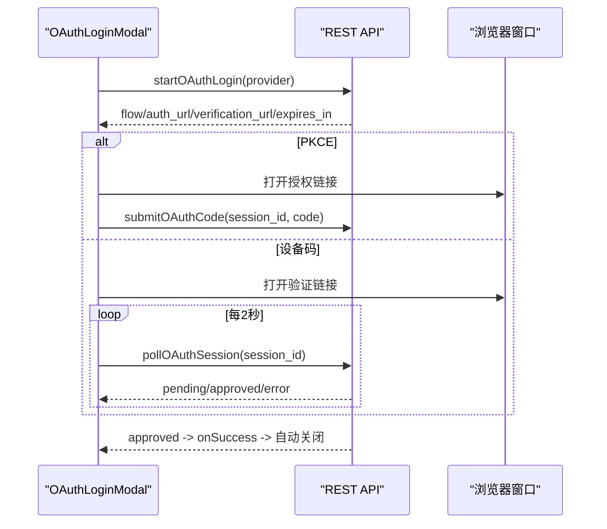
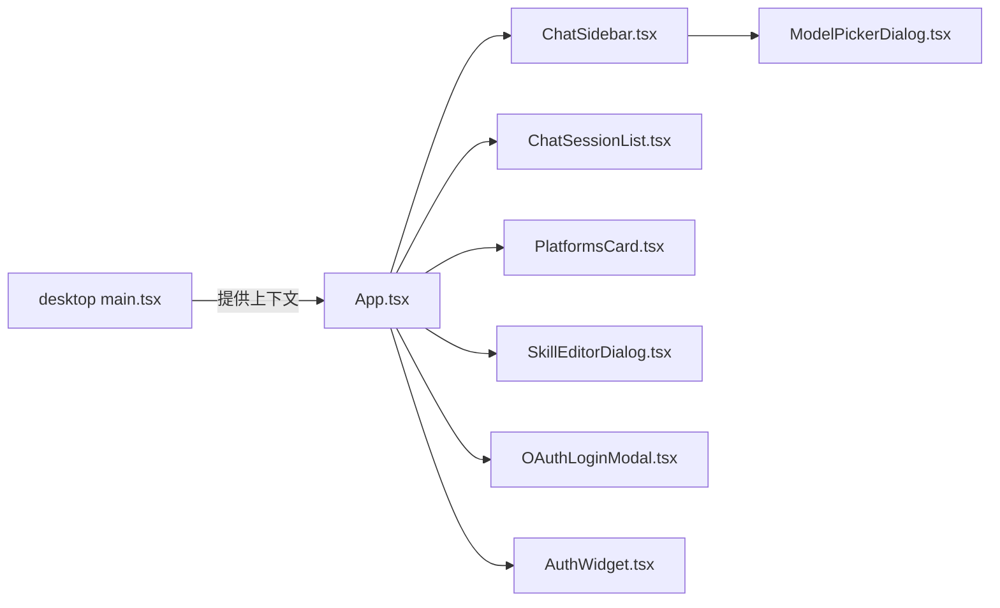

# 用户界面组件

<cite>
**本文引用的文件**
- [web/src/App.tsx](file://web/src/App.tsx)
- [apps/desktop/src/main.tsx](file://apps/desktop/src/main.tsx)
- [web/src/components/ChatSessionList.tsx](file://web/src/components/ChatSessionList.tsx)
- [web/src/components/ChatSidebar.tsx](file://web/src/components/ChatSidebar.tsx)
- [web/src/components/ModelPickerDialog.tsx](file://web/src/components/ModelPickerDialog.tsx)
- [web/src/components/PlatformsCard.tsx](file://web/src/components/PlatformsCard.tsx)
- [web/src/components/SkillEditorDialog.tsx](file://web/src/components/SkillEditorDialog.tsx)
- [web/src/components/OAuthLoginModal.tsx](file://web/src/components/OAuthLoginModal.tsx)
- [web/src/components/AuthWidget.tsx](file://web/src/components/AuthWidget.tsx)
</cite>

## 目录
1. [简介](#简介)
2. [项目结构](#项目结构)
3. [核心组件](#核心组件)
4. [架构总览](#架构总览)
5. [详细组件分析](#详细组件分析)
6. [依赖关系分析](#依赖关系分析)
7. [性能考量](#性能考量)
8. [故障排查指南](#故障排查指南)
9. [结论](#结论)
10. [附录：组件API参考与使用示例](#附录组件api参考与使用示例)

## 简介
本文件面向Web仪表板（Dashboard）的UI组件，聚焦聊天会话列表、模型选择器、平台卡片、技能编辑器、OAuth登录模态框等核心组件。文档说明各组件的职责、属性、事件、数据流、样式定制要点、响应式行为、可访问性实践以及性能优化建议，并提供自定义开发与集成指导。

## 项目结构
Web仪表板的入口在 web/src/App.tsx，负责路由、侧边栏、主题与国际化、插件扩展点、嵌入式聊天宿主挂载等；桌面应用入口 apps/desktop/src/main.tsx 提供全局上下文（查询客户端、主题、i18n、错误边界、工具提示等）。

图表来源
- [web/src/App.tsx:155-367](file://web/src/App.tsx#L155-L367)
- [apps/desktop/src/main.tsx:16-79](file://apps/desktop/src/main.tsx#L16-L79)

章节来源
- [web/src/App.tsx:1-120](file://web/src/App.tsx#L1-L120)
- [apps/desktop/src/main.tsx:1-83](file://apps/desktop/src/main.tsx#L1-L83)

## 核心组件
- 聊天会话列表（ChatSessionList）：列出最近会话，支持新建会话与切换会话，通过URL参数控制终端恢复。
- 聊天侧边栏（ChatSidebar）：维护JSON-RPC旁路会话与事件订阅通道，显示连接状态、当前模型、推理能力与通知横幅。
- 模型选择器（ModelPickerDialog）：两阶段选择（提供商→模型），支持模糊搜索、昂贵模型确认、持久化到配置或仅当前会话。
- 平台卡片（PlatformsCard）：展示已连接平台的状态、错误信息与最后更新时间。
- 技能编辑器（SkillEditorDialog）：创建/编辑 SKILL.md，含表单校验与后端验证反馈。
- OAuth登录模态框（OAuthLoginModal）：支持PKCE与设备码两种流程，倒计时、轮询、复制代码、重试与关闭清理。
- 认证小部件（AuthWidget）：在受管模式下展示登录身份与登出操作。

章节来源
- [web/src/components/ChatSessionList.tsx:1-261](file://web/src/components/ChatSessionList.tsx#L1-L261)
- [web/src/components/ChatSidebar.tsx:1-536](file://web/src/components/ChatSidebar.tsx#L1-L536)
- [web/src/components/ModelPickerDialog.tsx:1-681](file://web/src/components/ModelPickerDialog.tsx#L1-L681)
- [web/src/components/PlatformsCard.tsx:1-109](file://web/src/components/PlatformsCard.tsx#L1-L109)
- [web/src/components/SkillEditorDialog.tsx:1-216](file://web/src/components/SkillEditorDialog.tsx#L1-L216)
- [web/src/components/OAuthLoginModal.tsx:1-396](file://web/src/components/OAuthLoginModal.tsx#L1-L396)
- [web/src/components/AuthWidget.tsx:1-161](file://web/src/components/AuthWidget.tsx#L1-L161)

## 架构总览
仪表板采用“布局+页面+组件”的分层组织：
- 布局与路由：App.tsx 管理侧边栏、路由、插件插槽、嵌入式聊天宿主挂载策略。
- 数据通信：REST API（/api/*）用于配置、模型、会话、技能等；WebSocket（/api/ws 与 /api/events）用于实时状态与事件。
- 状态管理：组件内状态为主，结合上下文（ProfileProvider、PageHeaderProvider）与全局查询客户端（React Query）进行跨组件共享。
- 可扩展性：通过插件清单动态注入导航项与页面覆盖。

图表来源
- [web/src/components/ChatSidebar.tsx:187-383](file://web/src/components/ChatSidebar.tsx#L187-L383)
- [web/src/components/ModelPickerDialog.tsx:121-192](file://web/src/components/ModelPickerDialog.tsx#L121-L192)

## 详细组件分析

### 聊天会话列表 ChatSessionList
职责
- 拉取并展示最近会话，支持“新建会话”和“切换会话”。
- 通过URL参数 resume 控制终端恢复目标会话。

关键属性
- activeSessionId: 当前终端正在使用的会话ID。
- profile: 管理范围（可选）。
- className: 样式类名。
- onPicked: 选中行回调（如关闭移动端抽屉）。
- onNewChat: 新建会话回调（优先由父级处理以确保PTY重建）。

交互与数据流
- 首次加载调用 REST 获取会话列表；失败时显示错误与重试按钮。
- 选择会话时更新URL参数 resume；若与当前activeSessionId相同则跳过。
- “新建会话”优先调用 onNewChat，否则删除resume参数以触发新PTY。

可访问性与响应式
- 列表项使用 aria-current 标识当前活动项。
- 加载/错误/空状态均有明确文案与图标。

图表来源
- [web/src/components/ChatSessionList.tsx:83-150](file://web/src/components/ChatSessionList.tsx#L83-L150)
- [web/src/components/ChatSessionList.tsx:152-220](file://web/src/components/ChatSessionList.tsx#L152-L220)

章节来源
- [web/src/components/ChatSessionList.tsx:1-261](file://web/src/components/ChatSessionList.tsx#L1-L261)

### 聊天侧边栏 ChatSidebar
职责
- 维护两个连接：JSON-RPC旁路会话（连接状态、凭证警告）与事件订阅通道（会话标题、新建会话请求）。
- 展示当前模型、推理能力开关、连接状态徽章与错误横幅。

关键属性
- channel: 事件订阅频道ID（绑定到具体聊天页的PTY子进程）。
- profile: 作用域（可选）。
- onDashboardNewSessionRequest: 收到新建会话请求时的回调。
- onSessionTitleChange: 会话标题变化回调。

交互与数据流
- 创建 GatewayClient 并监听连接状态与 session.info/error。
- 建立事件订阅WebSocket，自动重连（指数退避），处理认证拒绝与超时。
- 通过REST读取模型信息与能力，驱动 ReasoningPicker 与 ModelPickerDialog。

图表来源
- [web/src/components/ChatSidebar.tsx:187-383](file://web/src/components/ChatSidebar.tsx#L187-L383)
- [web/src/components/ChatSidebar.tsx:385-536](file://web/src/components/ChatSidebar.tsx#L385-L536)

章节来源
- [web/src/components/ChatSidebar.tsx:1-536](file://web/src/components/ChatSidebar.tsx#L1-L536)

### 模型选择器 ModelPickerDialog
职责
- 两阶段选择：先选提供商，再选模型；支持模糊搜索与高亮匹配位置。
- 支持昂贵模型二次确认；可选择“仅当前会话”或“全局持久化”。

关键属性
- gw/sessionId/onSubmit: 聊天模式（通过网关RPC提交）。
- loader/onApply: 独立模式（通过REST加载与提交）。
- onClose/title/alwaysGlobal: 关闭回调、标题、是否强制全局保存。

交互与数据流
- 打开时加载提供商与模型列表；支持刷新。
- 选择后根据模式调用 onApply 或 gw.request("config.set")。
- 若后端返回 confirm_required，弹出昂贵模型确认对话框。

图表来源
- [web/src/components/ModelPickerDialog.tsx:121-192](file://web/src/components/ModelPickerDialog.tsx#L121-L192)
- [web/src/components/ModelPickerDialog.tsx:268-338](file://web/src/components/ModelPickerDialog.tsx#L268-L338)
- [web/src/components/ModelPickerDialog.tsx:340-491](file://web/src/components/ModelPickerDialog.tsx#L340-L491)

章节来源
- [web/src/components/ModelPickerDialog.tsx:1-681](file://web/src/components/ModelPickerDialog.tsx#L1-L681)

### 平台卡片 PlatformsCard
职责
- 展示各平台的连接状态、错误消息与最后更新时间。

关键属性
- platforms: 平台名称与状态元组数组。

交互与数据流
- 根据状态映射不同徽章颜色与图标；错误消息与时间戳辅助诊断。

章节来源
- [web/src/components/PlatformsCard.tsx:1-109](file://web/src/components/PlatformsCard.tsx#L1-L109)

### 技能编辑器 SkillEditorDialog
职责
- 创建或编辑 SKILL.md；编辑模式加载现有内容，创建模式提供模板。
- 前端基础校验，后端完整校验（frontmatter、名称、大小）。

关键属性
- open/editName/profile/onClose/onSaved: 控制显隐、编辑目标、作用域、关闭与保存回调。

交互与数据流
- 编辑模式：加载SKILL.md内容；创建模式：填写名称与分类。
- 保存时调用REST接口；成功后回调 onSaved 刷新列表。

图表来源
- [web/src/components/SkillEditorDialog.tsx:75-135](file://web/src/components/SkillEditorDialog.tsx#L75-L135)
- [web/src/components/SkillEditorDialog.tsx:137-216](file://web/src/components/SkillEditorDialog.tsx#L137-L216)

章节来源
- [web/src/components/SkillEditorDialog.tsx:1-216](file://web/src/components/SkillEditorDialog.tsx#L1-L216)

### OAuth登录模态框 OAuthLoginModal
职责
- 启动OAuth流程（PKCE或设备码），引导用户在外部窗口完成授权，轮询或提交验证码，最终连接成功。

关键属性
- provider: OAuth提供方。
- onClose/onSuccess/onError: 关闭、成功与错误回调。

交互与数据流
- 启动时调用REST获取会话与流程类型；PKCE直接打开授权链接，设备码打开验证链接并轮询。
- 倒计时过期自动报错；支持复制设备码、重试与关闭时清理会话。

图表来源
- [web/src/components/OAuthLoginModal.tsx:42-120](file://web/src/components/OAuthLoginModal.tsx#L42-L120)
- [web/src/components/OAuthLoginModal.tsx:122-183](file://web/src/components/OAuthLoginModal.tsx#L122-L183)
- [web/src/components/OAuthLoginModal.tsx:189-396](file://web/src/components/OAuthLoginModal.tsx#L189-L396)

章节来源
- [web/src/components/OAuthLoginModal.tsx:1-396](file://web/src/components/OAuthLoginModal.tsx#L1-L396)

### 认证小部件 AuthWidget
职责
- 在受管模式下展示当前登录身份与提供者，并提供登出操作。

关键属性
- className: 样式类名。

交互与数据流
- 仅在受管模式下请求 /api/auth/me；401/403隐藏组件；网络错误显示不可用提示。
- 登出调用REST并导航回登录页。

章节来源
- [web/src/components/AuthWidget.tsx:1-161](file://web/src/components/AuthWidget.tsx#L1-L161)

## 依赖关系分析
- App.tsx 作为根布局，组合各页面与组件，并通过插件机制扩展导航与页面。
- ChatSidebar 依赖 GatewayClient 与事件订阅，同时与 REST API 交互以获取/设置模型。
- ModelPickerDialog 既可与 GatewayClient 协作（聊天模式），也可完全基于REST（独立模式）。
- OAuthLoginModal 与 REST API 紧密耦合，负责完整的OAuth生命周期。
- 桌面入口 main.tsx 提供全局上下文（QueryClient、Theme、I18n、Tooltip、错误边界），确保一致的运行时环境。

图表来源
- [web/src/App.tsx:155-367](file://web/src/App.tsx#L155-L367)
- [apps/desktop/src/main.tsx:16-79](file://apps/desktop/src/main.tsx#L16-L79)

章节来源
- [web/src/App.tsx:1-120](file://web/src/App.tsx#L1-L120)
- [apps/desktop/src/main.tsx:1-83](file://apps/desktop/src/main.tsx#L1-L83)

## 性能考量
- 懒加载路由：App.tsx 对页面组件使用 lazy()，减少首屏体积。
- 事件重连与节流：ChatSidebar 的事件订阅具备指数退避重连与最大尝试次数，避免雪崩。
- 防抖/去抖：会话列表使用单调请求令牌防止竞态；模型选择器在关闭时清理副作用。
- 渲染优化：大量列表项使用 memoized 计算（filteredProviders/filteredModels）与稳定键值。
- 弹窗层级：模型选择器使用 createPortal 至 document.body，避免被侧边栏遮挡导致的重绘问题。
- 过渡优先级：桌面入口禁用路由过渡以避免在高负载下阻塞主线程。

[本节为通用性能建议，不直接分析具体文件]

## 故障排查指南
- 会话列表加载失败：检查网络与权限；使用内置“重试”按钮重新拉取。
- 事件订阅断开：查看侧边栏横幅，点击“重连事件源”；若认证拒绝，需重新登录。
- 模型选择失败：确认提供商已配置；若昂贵模型，按提示二次确认；必要时刷新页面使运行中的聊天生效。
- OAuth流程异常：检查外部窗口是否拦截弹窗；若设备码过期，点击“重试”重新发起；复制失败会提示。
- 认证小部件不可见：确认处于受管模式；若401/403将隐藏；网络错误会显示不可用提示。

章节来源
- [web/src/components/ChatSessionList.tsx:152-171](file://web/src/components/ChatSessionList.tsx#L152-L171)
- [web/src/components/ChatSidebar.tsx:240-383](file://web/src/components/ChatSidebar.tsx#L240-L383)
- [web/src/components/ModelPickerDialog.tsx:268-338](file://web/src/components/ModelPickerDialog.tsx#L268-L338)
- [web/src/components/OAuthLoginModal.tsx:189-396](file://web/src/components/OAuthLoginModal.tsx#L189-L396)
- [web/src/components/AuthWidget.tsx:48-80](file://web/src/components/AuthWidget.tsx#L48-L80)

## 结论
上述组件构成了仪表板的核心交互面：会话切换、模型与推理能力管理、平台状态可视、技能创作与OAuth接入。它们通过REST与WebSocket协同工作，兼顾了可用性、可访问性与性能。遵循本文档的API与最佳实践，可快速集成与扩展新的功能模块。

[本节为总结性内容，不直接分析具体文件]

## 附录：组件API参考与使用示例

### ChatSessionList
- 属性
  - activeSessionId: string | null
  - profile?: string
  - className?: string
  - onPicked?: () => void
  - onNewChat?: () => void
- 事件
  - 选择会话：更新URL参数 resume
  - 新建会话：调用 onNewChat 或清除 resume
- 使用示例
  - 在聊天页中传入 activeSessionId 与 onNewChat，实现无缝切换与PTY重建。

章节来源
- [web/src/components/ChatSessionList.tsx:33-48](file://web/src/components/ChatSessionList.tsx#L33-L48)
- [web/src/components/ChatSessionList.tsx:115-150](file://web/src/components/ChatSessionList.tsx#L115-L150)

### ChatSidebar
- 属性
  - channel: string
  - profile?: string
  - className?: string
  - onDashboardNewSessionRequest?: () => void
  - onSessionTitleChange?: (title: string | null) => void
- 事件
  - 连接状态变化：通过内部状态驱动徽章
  - 事件订阅：session.info（标题）、dashboard.new_session_requested
- 使用示例
  - 为每个聊天页生成唯一 channel，并传入 profile 以限定作用域。

章节来源
- [web/src/components/ChatSidebar.tsx:87-94](file://web/src/components/ChatSidebar.tsx#L87-L94)
- [web/src/components/ChatSidebar.tsx:187-383](file://web/src/components/ChatSidebar.tsx#L187-L383)

### ModelPickerDialog
- 属性
  - gw?: GatewayClient
  - sessionId?: string
  - onSubmit?(slashCommand: string): void
  - loader?(options?): Promise<ModelOptionsResponse>
  - onApply?(args): Promise<ExpensiveModelConfirmResponse | void> | ExpensiveModelConfirmResponse | void
  - onClose(): void
  - title?: string
  - alwaysGlobal?: boolean
- 事件
  - 选择模型：调用 onApply 或 gw.request("config.set")
  - 昂贵模型确认：弹出 ConfirmDialog 二次确认
- 使用示例
  - 在独立模式下提供 loader 与 onApply，复用同一UI进行模型管理。

章节来源
- [web/src/components/ModelPickerDialog.tsx:69-91](file://web/src/components/ModelPickerDialog.tsx#L69-L91)
- [web/src/components/ModelPickerDialog.tsx:121-192](file://web/src/components/ModelPickerDialog.tsx#L121-L192)
- [web/src/components/ModelPickerDialog.tsx:268-338](file://web/src/components/ModelPickerDialog.tsx#L268-L338)

### PlatformsCard
- 属性
  - platforms: [string, PlatformStatus][]
- 使用示例
  - 从系统状态接口获取平台列表，直接传入渲染。

章节来源
- [web/src/components/PlatformsCard.tsx:106-109](file://web/src/components/PlatformsCard.tsx#L106-L109)

### SkillEditorDialog
- 属性
  - open: boolean
  - editName: string | null
  - profile?: string
  - onClose: () => void
  - onSaved: (name: string) => void
- 事件
  - 保存：调用REST接口，成功后回调 onSaved
- 使用示例
  - 在技能页面中打开编辑器，保存后刷新技能列表。

章节来源
- [web/src/components/SkillEditorDialog.tsx:37-46](file://web/src/components/SkillEditorDialog.tsx#L37-L46)
- [web/src/components/SkillEditorDialog.tsx:102-135](file://web/src/components/SkillEditorDialog.tsx#L102-L135)

### OAuthLoginModal
- 属性
  - provider: OAuthProvider
  - onClose: () => void
  - onSuccess: (msg: string) => void
  - onError: (msg: string) => void
- 事件
  - 启动流程：startOAuthLogin
  - PKCE：submitOAuthCode
  - 设备码：pollOAuthSession
- 使用示例
  - 在认证入口触发，根据返回的flow决定后续步骤。

章节来源
- [web/src/components/OAuthLoginModal.tsx:12-17](file://web/src/components/OAuthLoginModal.tsx#L12-L17)
- [web/src/components/OAuthLoginModal.tsx:42-120](file://web/src/components/OAuthLoginModal.tsx#L42-L120)

### AuthWidget
- 属性
  - className?: string
- 事件
  - 登出：POST /auth/logout
- 使用示例
  - 置于侧边栏底部，在受管模式下显示登录态。

章节来源
- [web/src/components/AuthWidget.tsx:31-33](file://web/src/components/AuthWidget.tsx#L31-L33)
- [web/src/components/AuthWidget.tsx:116-118](file://web/src/components/AuthWidget.tsx#L116-L118)