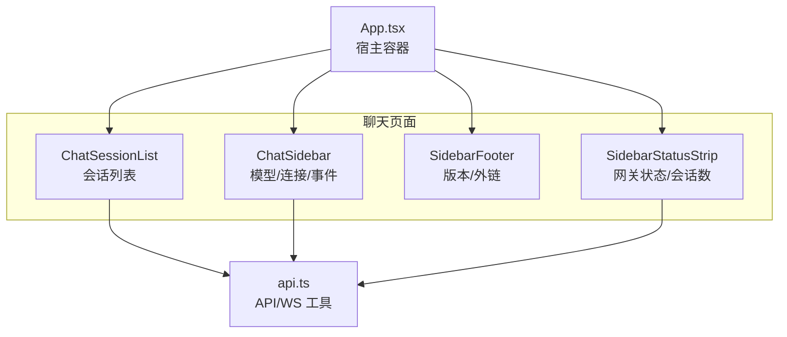
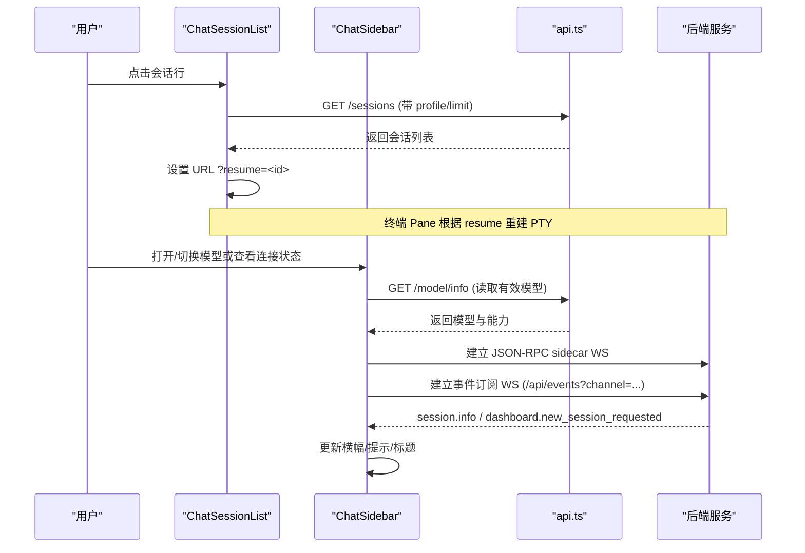
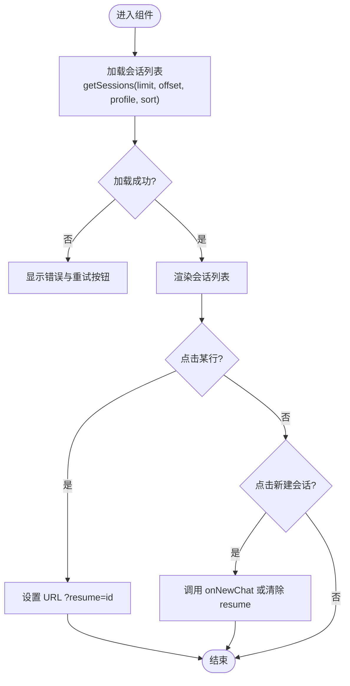
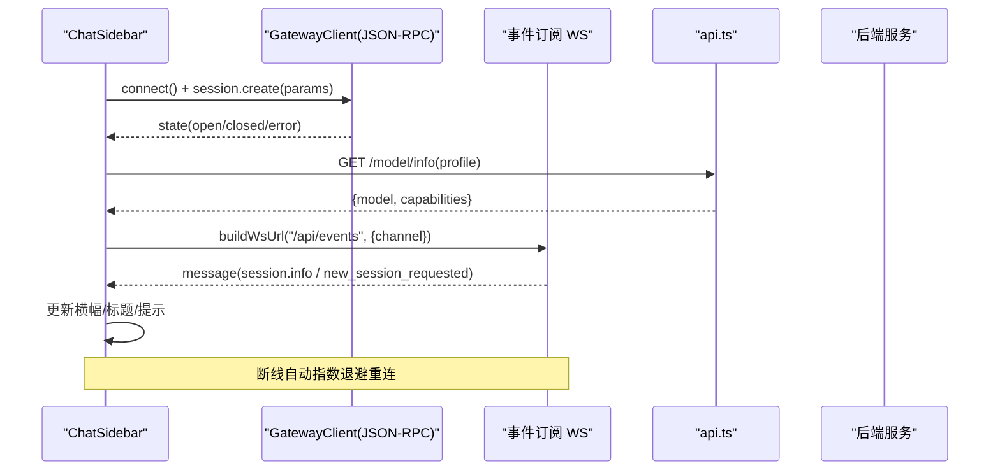
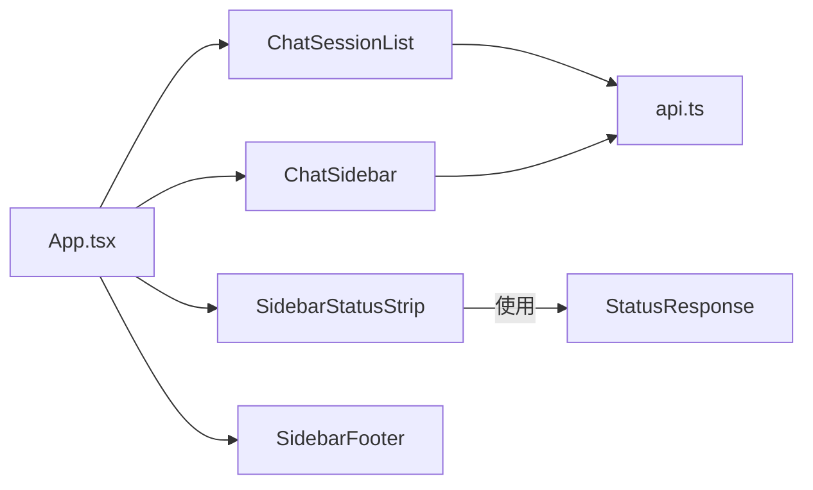

# 聊天组件

<cite>
**本文引用的文件**
- [ChatSessionList.tsx](file://web/src/components/ChatSessionList.tsx)
- [ChatSidebar.tsx](file://web/src/components/ChatSidebar.tsx)
- [SidebarFooter.tsx](file://web/src/components/SidebarFooter.tsx)
- [SidebarStatusStrip.tsx](file://web/src/components/SidebarStatusStrip.tsx)
- [api.ts](file://web/src/lib/api.ts)
- [App.tsx](file://web/src/App.tsx)
- [ChatSidebar.test.tsx](file://web/src/components/ChatSidebar.test.tsx)
</cite>

## 目录
1. [简介](#简介)
2. [项目结构](#项目结构)
3. [核心组件](#核心组件)
4. [架构总览](#架构总览)
5. [详细组件分析](#详细组件分析)
6. [依赖关系分析](#依赖关系分析)
7. [性能考量](#性能考量)
8. [故障排查指南](#故障排查指南)
9. [结论](#结论)
10. [附录](#附录)

## 简介
本文件面向开发者，系统化说明聊天相关 UI 组件 ChatSessionList、ChatSidebar、SidebarFooter 与 SidebarStatusStrip 的功能、实现与集成方式。重点覆盖：
- 会话列表的渲染逻辑、搜索过滤（当前为按最近会话排序与筛选）、会话切换与状态管理
- 侧边栏布局结构、导航能力、响应式行为
- 组件属性配置、事件处理机制、样式定制选项
- 会话管理最佳实践：性能优化、内存管理与用户体验改进
- 自定义聊天界面与扩展功能的开发指南

## 项目结构
这些组件位于 Web 前端应用目录中，围绕“聊天”页面组织：
- ChatSessionList：会话列表面板，提供会话选择与新建会话入口
- ChatSidebar：右侧信息面板，展示模型、连接状态、推理能力等，并维护两条 WebSocket 通道（JSON-RPC sidecar 与事件订阅）
- SidebarFooter：底部页脚，显示版本信息与外部链接
- SidebarStatusStrip：系统状态条，展示网关状态与活跃会话数，可跳转至会话管理页
- App.tsx：作为宿主容器，组合上述组件并提供全局上下文（如状态数据）
- api.ts：统一的 API 封装，负责请求头注入、鉴权、路径前缀处理、WebSocket URL 构建等



图表来源
- [App.tsx:65-74](file://web/src/App.tsx#L65-L74)
- [ChatSessionList.tsx:21-30](file://web/src/components/ChatSessionList.tsx#L21-L30)
- [ChatSidebar.tsx:28-53](file://web/src/components/ChatSidebar.tsx#L28-L53)
- [SidebarFooter.tsx:1-5](file://web/src/components/SidebarFooter.tsx#L1-L5)
- [SidebarStatusStrip.tsx:1-5](file://web/src/components/SidebarStatusStrip.tsx#L1-L5)
- [api.ts:102-183](file://web/src/lib/api.ts#L102-L183)

章节来源
- [App.tsx:65-74](file://web/src/App.tsx#L65-L74)
- [ChatSessionList.tsx:1-48](file://web/src/components/ChatSessionList.tsx#L1-L48)
- [ChatSidebar.tsx:1-94](file://web/src/components/ChatSidebar.tsx#L1-L94)
- [SidebarFooter.tsx:1-42](file://web/src/components/SidebarFooter.tsx#L1-L42)
- [SidebarStatusStrip.tsx:1-73](file://web/src/components/SidebarStatusStrip.tsx#L1-L73)
- [api.ts:102-183](file://web/src/lib/api.ts#L102-L183)

## 核心组件
- ChatSessionList
  - 功能：列出最近会话，支持切换会话与新建会话；失败时提供重试；不执行删除/重命名等管理操作
  - 关键特性：按 profile 作用域加载；单调请求令牌避免竞态；通过 URL 参数 resume 切换会话
- ChatSidebar
  - 功能：展示模型、连接状态、推理能力；维护 JSON-RPC sidecar 与事件订阅两条 WS；处理认证失败、断线重连
  - 关键特性：profile/channel 变化重建客户端；指数退避重连；错误横幅统一呈现
- SidebarFooter
  - 功能：显示服务端版本与组织链接
- SidebarStatusStrip
  - 功能：展示网关状态与活跃会话数，点击跳转会话管理页

章节来源
- [ChatSessionList.tsx:33-48](file://web/src/components/ChatSessionList.tsx#L33-L48)
- [ChatSidebar.tsx:87-94](file://web/src/components/ChatSidebar.tsx#L87-L94)
- [SidebarFooter.tsx:39-42](file://web/src/components/SidebarFooter.tsx#L39-L42)
- [SidebarStatusStrip.tsx:70-73](file://web/src/components/SidebarStatusStrip.tsx#L70-L73)

## 架构总览
聊天侧边区域由多个子组件协作完成：
- 数据层：api.ts 提供 REST 与 WS 工具，统一鉴权、路径前缀、会话令牌注入
- 视图层：四个组件分别承担会话列表、信息面板、页脚、状态条职责
- 宿主层：App.tsx 聚合组件，传递状态与回调



图表来源
- [ChatSessionList.tsx:83-100](file://web/src/components/ChatSessionList.tsx#L83-L100)
- [ChatSessionList.tsx:115-150](file://web/src/components/ChatSessionList.tsx#L115-L150)
- [ChatSidebar.tsx:156-168](file://web/src/components/ChatSidebar.tsx#L156-L168)
- [ChatSidebar.tsx:214-235](file://web/src/components/ChatSidebar.tsx#L214-L235)
- [ChatSidebar.tsx:297-371](file://web/src/components/ChatSidebar.tsx#L297-L371)
- [api.ts:102-183](file://web/src/lib/api.ts#L102-L183)

## 详细组件分析

### ChatSessionList（会话列表）
- 属性
  - activeSessionId：当前激活会话 ID
  - profile：管理资料作用域，影响会话列表范围
  - className：样式类名
  - onPicked：选中某行后的回调（常用于关闭移动端抽屉）
  - onNewChat：新建会话回调（优先由父级处理，否则回退到清除 resume）
- 渲染逻辑
  - 首次加载与 scope 变化时拉取最近会话（限制数量），使用单调请求令牌避免竞态
  - 列表项显示标题/预览、最后活跃时间、消息数、来源
  - 选中项高亮，点击设置 URL 参数 resume，触发终端 Pane 重建
- 搜索与过滤
  - 当前实现未包含文本搜索框；可通过在父级增加输入框与本地过滤扩展
- 错误与重试
  - 加载失败显示错误与重试按钮；刷新按钮可手动触发重新加载
- 样式定制
  - 通过 className 传入外层 aside；内部使用 Tailwind 类进行排版与交互反馈



图表来源
- [ChatSessionList.tsx:83-100](file://web/src/components/ChatSessionList.tsx#L83-L100)
- [ChatSessionList.tsx:115-150](file://web/src/components/ChatSessionList.tsx#L115-L150)
- [ChatSessionList.tsx:152-220](file://web/src/components/ChatSessionList.tsx#L152-L220)

章节来源
- [ChatSessionList.tsx:33-48](file://web/src/components/ChatSessionList.tsx#L33-L48)
- [ChatSessionList.tsx:83-100](file://web/src/components/ChatSessionList.tsx#L83-L100)
- [ChatSessionList.tsx:115-150](file://web/src/components/ChatSessionList.tsx#L115-L150)
- [ChatSessionList.tsx:152-220](file://web/src/components/ChatSessionList.tsx#L152-L220)

### ChatSidebar（信息面板与事件订阅）
- 属性
  - channel：事件订阅通道标识，绑定到当前聊天 Tab 的 PTY 子进程
  - profile：作用域，影响模型信息读取与 sidecar 会话创建
  - className：样式类名
  - onDashboardNewSessionRequest：收到新会话请求时的回调
  - onSessionTitleChange：会话标题变更回调
- 连接与状态
  - JSON-RPC sidecar：用于连接状态与凭据警告；独立于 PTY 会话
  - 事件订阅 WS：接收 session.info、dashboard.new_session_requested 等事件
  - 模型信息：通过 REST 获取有效模型与能力（是否支持推理）
- 重连策略
  - 指数退避重连，达到最大尝试次数后给出放弃提示
  - 认证拒绝与循环模式下的特殊处理（可能触发页面重载以刷新令牌）
- 模型切换
  - 通过对话框写入配置，可选择立即生效或提示后续应用
- 错误横幅
  - 统一展示 sidecar 错误、事件订阅错误、凭据警告



图表来源
- [ChatSidebar.tsx:156-168](file://web/src/components/ChatSidebar.tsx#L156-L168)
- [ChatSidebar.tsx:214-235](file://web/src/components/ChatSidebar.tsx#L214-L235)
- [ChatSidebar.tsx:297-371](file://web/src/components/ChatSidebar.tsx#L297-L371)
- [api.ts:102-183](file://web/src/lib/api.ts#L102-L183)

章节来源
- [ChatSidebar.tsx:87-94](file://web/src/components/ChatSidebar.tsx#L87-L94)
- [ChatSidebar.tsx:156-168](file://web/src/components/ChatSidebar.tsx#L156-L168)
- [ChatSidebar.tsx:214-235](file://web/src/components/ChatSidebar.tsx#L214-L235)
- [ChatSidebar.tsx:297-371](file://web/src/components/ChatSidebar.tsx#L297-L371)
- [ChatSidebar.test.tsx:126-200](file://web/src/components/ChatSidebar.test.tsx#L126-L200)

### SidebarFooter（页脚）
- 属性
  - status：服务端状态对象（包含 version）
- 功能
  - 显示版本号与组织链接
- 样式
  - 使用基础排版与边框分隔，适配主题色

章节来源
- [SidebarFooter.tsx:6-42](file://web/src/components/SidebarFooter.tsx#L6-L42)

### SidebarStatusStrip（状态条）
- 属性
  - status：服务端状态对象（包含 gateway_state、active_sessions 等）
- 功能
  - 展示网关状态与活跃会话数，点击跳转到 /sessions
- 辅助函数
  - gatewayLine：将后端状态映射为可读标签与颜色

```mermaid
classDiagram
class SidebarStatusStrip {
+status : StatusResponse | null
}
class gatewayLine {
+(status, t) : { label, tone }
}
SidebarStatusStrip --> gatewayLine : "调用"
```

图表来源
- [SidebarStatusStrip.tsx:7-48](file://web/src/components/SidebarStatusStrip.tsx#L7-L48)
- [SidebarStatusStrip.tsx:51-68](file://web/src/components/SidebarStatusStrip.tsx#L51-L68)

章节来源
- [SidebarStatusStrip.tsx:7-48](file://web/src/components/SidebarStatusStrip.tsx#L7-L48)
- [SidebarStatusStrip.tsx:51-68](file://web/src/components/SidebarStatusStrip.tsx#L51-L68)

## 依赖关系分析
- 组件对 api.ts 的依赖
  - ChatSessionList：getSessions、buildWsUrl（若需要）
  - ChatSidebar：getModelInfo、setModelAssignment、buildWsUrl
  - SidebarStatusStrip：直接使用传入的 status（通常由上层从 /api/status 获取）
- 宿主 App.tsx
  - 引入并组合四个组件，提供状态与回调
- 测试用例
  - ChatSidebar.test.tsx 验证事件 socket 的重连与认证失败处理路径



图表来源
- [App.tsx:65-74](file://web/src/App.tsx#L65-L74)
- [ChatSessionList.tsx:21-30](file://web/src/components/ChatSessionList.tsx#L21-L30)
- [ChatSidebar.tsx:28-53](file://web/src/components/ChatSidebar.tsx#L28-L53)
- [SidebarStatusStrip.tsx:1-5](file://web/src/components/SidebarStatusStrip.tsx#L1-L5)
- [api.ts:102-183](file://web/src/lib/api.ts#L102-L183)

章节来源
- [App.tsx:65-74](file://web/src/App.tsx#L65-L74)
- [ChatSessionList.tsx:21-30](file://web/src/components/ChatSessionList.tsx#L21-L30)
- [ChatSidebar.tsx:28-53](file://web/src/components/ChatSidebar.tsx#L28-L53)
- [SidebarStatusStrip.tsx:1-5](file://web/src/components/SidebarStatusStrip.tsx#L1-L5)
- [api.ts:102-183](file://web/src/lib/api.ts#L102-L183)

## 性能考量
- 列表渲染
  - 会话列表限制数量（SESSION_LIMIT），避免一次性渲染过多节点
  - 使用 useMemo 缓存内容计算，减少重复渲染
- 网络请求
  - 使用单调请求令牌（reqRef）避免旧请求覆盖新状态
  - 仅当 scope（profile）变化时重新拉取，降低无效请求
- WebSocket 管理
  - 事件订阅采用指数退避重连，避免频繁重连造成压力
  - 在组件卸载时清理定时器与连接，防止内存泄漏
- 模型信息
  - 通过 REST 获取最新模型与能力，避免 stale 状态
- 建议
  - 在父级加入防抖搜索与虚拟滚动（若会话量增长）
  - 对长列表考虑分页或懒加载
  - 对 WebSocket 消息批处理与节流，减少高频更新

[本节为通用指导，无需具体文件引用]

## 故障排查指南
- 会话列表加载失败
  - 现象：显示错误与重试按钮
  - 排查：检查 getSessions 调用与网络状态；确认 profile 作用域正确
  - 参考：[ChatSessionList.tsx:83-100](file://web/src/components/ChatSessionList.tsx#L83-L100)、[ChatSessionList.tsx:160-171](file://web/src/components/ChatSessionList.tsx#L160-L171)
- 事件订阅断开
  - 现象：横幅提示断开或重连中
  - 排查：检查 buildWsUrl 生成的 URL；确认 channel 正确；观察重连计时器
  - 参考：[ChatSidebar.tsx:297-371](file://web/src/components/ChatSidebar.tsx#L297-L371)
- 认证失败（循环模式）
  - 现象：close 码 4401 触发页面重载以刷新令牌
  - 排查：确认 maybeReloadForLoopbackWsAuthFailure 行为
  - 参考：[ChatSidebar.test.tsx:126-143](file://web/src/components/ChatSidebar.test.tsx#L126-L143)
- 模型信息不更新
  - 现象：模型徽章陈旧
  - 排查：确认 refreshEffectiveModel 被调用；检查 /api/model/info 返回
  - 参考：[ChatSidebar.tsx:156-168](file://web/src/components/ChatSidebar.tsx#L156-L168)

章节来源
- [ChatSessionList.tsx:83-100](file://web/src/components/ChatSessionList.tsx#L83-L100)
- [ChatSessionList.tsx:160-171](file://web/src/components/ChatSessionList.tsx#L160-L171)
- [ChatSidebar.tsx:297-371](file://web/src/components/ChatSidebar.tsx#L297-L371)
- [ChatSidebar.test.tsx:126-143](file://web/src/components/ChatSidebar.test.tsx#L126-L143)
- [ChatSidebar.tsx:156-168](file://web/src/components/ChatSidebar.tsx#L156-L168)

## 结论
- ChatSessionList 提供简洁高效的会话切换体验，适合嵌入聊天页面
- ChatSidebar 通过双通道 WebSocket 与 REST 协同，保证模型与连接状态的实时性与准确性
- SidebarFooter 与 SidebarStatusStrip 提供必要的系统与版本信息，增强可观测性
- 建议在数据层与视图层继续加强搜索、分页与虚拟化，以提升大规模会话场景下的性能与体验

[本节为总结，无需具体文件引用]

## 附录
- 组件属性速查
  - ChatSessionList：activeSessionId、profile、className、onPicked、onNewChat
  - ChatSidebar：channel、profile、className、onDashboardNewSessionRequest、onSessionTitleChange
  - SidebarFooter：status
  - SidebarStatusStrip：status
- 事件与回调
  - 会话切换：设置 URL ?resume=id
  - 新建会话：调用 onNewChat 或清除 resume
  - 事件订阅：session.info、dashboard.new_session_requested
- 样式定制
  - 通过 className 控制外层容器；内部使用 Tailwind 类，可按需覆盖
- 扩展建议
  - 在 ChatSessionList 上方添加搜索框，结合本地过滤与防抖
  - 在 ChatSidebar 中增加更多会话元信息卡片（如工具集、技能）
  - 在 SidebarStatusStrip 中增加更多系统指标（CPU/内存/磁盘）

[本节为补充信息，无需具体文件引用]