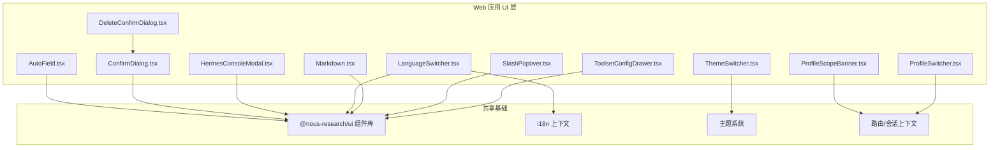
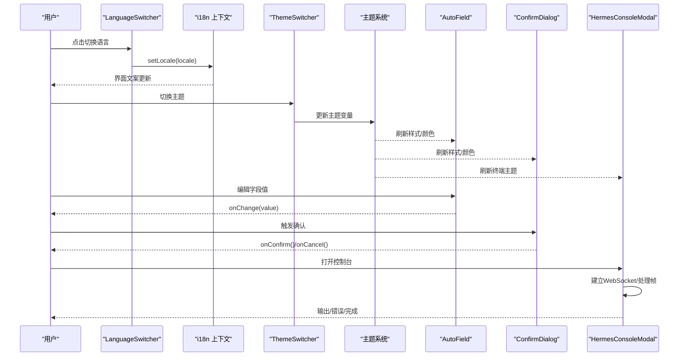
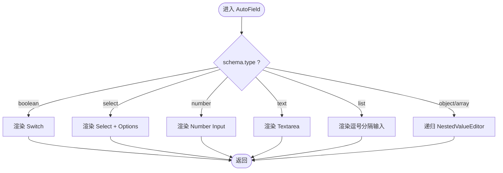
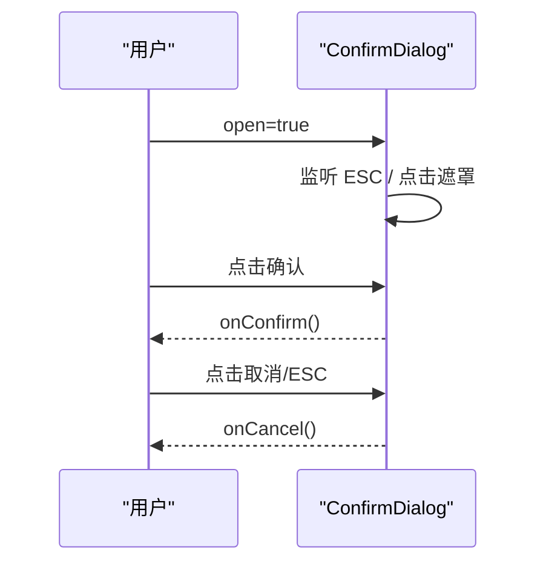
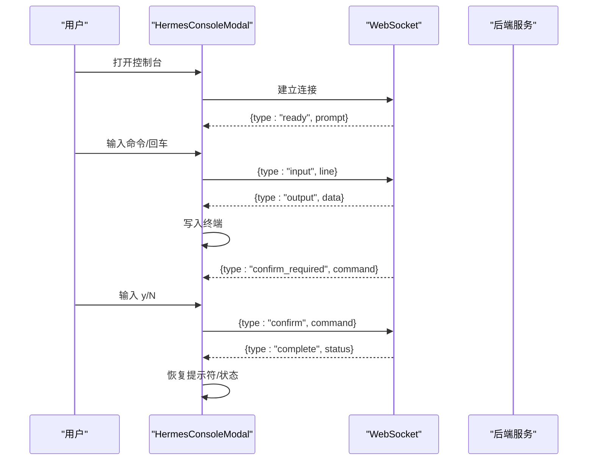
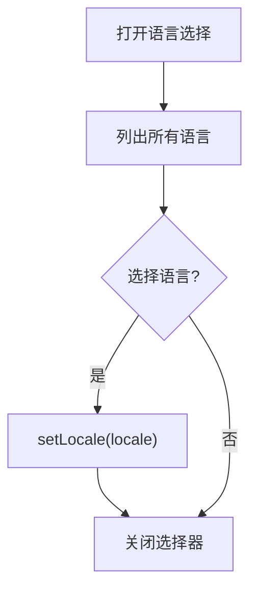
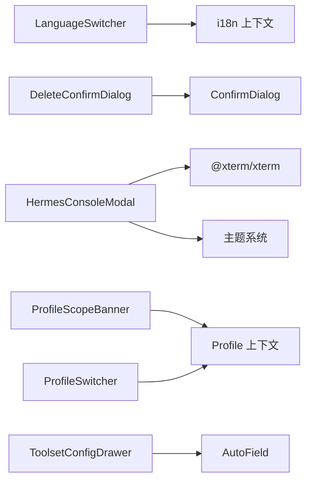

# 通用工具组件

<cite>
**本文引用的文件**
- [AutoField.tsx](file://web/src/components/AutoField.tsx)
- [ConfirmDialog.tsx](file://web/src/components/ConfirmDialog.tsx)
- [DeleteConfirmDialog.tsx](file://web/src/components/DeleteConfirmDialog.tsx)
- [HermesConsoleModal.tsx](file://web/src/components/HermesConsoleModal.tsx)
- [LanguageSwitcher.tsx](file://web/src/components/LanguageSwitcher.tsx)
- [Markdown.tsx](file://web/src/components/Markdown.tsx)
- [ProfileScopeBanner.tsx](file://web/src/components/ProfileScopeBanner.tsx)
- [ProfileSwitcher.tsx](file://web/src/components/ProfileSwitcher.tsx)
- [SlashPopover.tsx](file://web/src/components/SlashPopover.tsx)
- [ThemeSwitcher.tsx](file://web/src/components/ThemeSwitcher.tsx)
- [ToolsetConfigDrawer.tsx](file://web/src/components/ToolsetConfigDrawer.tsx)
</cite>

## 目录
1. [简介](#简介)
2. [项目结构](#项目结构)
3. [核心组件](#核心组件)
4. [架构总览](#架构总览)
5. [详细组件分析](#详细组件分析)
6. [依赖关系分析](#依赖关系分析)
7. [性能考量](#性能考量)
8. [故障排查指南](#故障排查指南)
9. [结论](#结论)
10. [附录：API 参考与最佳实践](#附录api-参考与最佳实践)

## 简介
本文件面向开发者，系统化梳理并文档化以下通用工具组件的功能、实现要点、可复用设计、样式定制选项、国际化支持以及集成方式。覆盖的组件包括：AutoField、ConfirmDialog、DeleteConfirmDialog、HermesConsoleModal、LanguageSwitcher、Markdown、ProfileScopeBanner、ProfileSwitcher、SlashPopover、ThemeSwitcher、ToolsetConfigDrawer。重点说明表单字段自动生成、确认对话框、语言切换器、Markdown 渲染、主题切换等能力，并提供 API 参考、使用示例、最佳实践与扩展指南。

## 项目结构
这些组件位于前端 Web 应用的 UI 层，统一通过共享 UI 库与本地 i18n、主题、上下文进行协作。整体组织以“功能组件”为单位，每个文件聚焦单一职责，便于独立测试与复用。

图表来源
- [AutoField.tsx:1-207](file://web/src/components/AutoField.tsx#L1-L207)
- [ConfirmDialog.tsx:1-123](file://web/src/components/ConfirmDialog.tsx#L1-L123)
- [DeleteConfirmDialog.tsx:1-41](file://web/src/components/DeleteConfirmDialog.tsx#L1-L41)
- [HermesConsoleModal.tsx:1-538](file://web/src/components/HermesConsoleModal.tsx#L1-L538)
- [LanguageSwitcher.tsx:1-186](file://web/src/components/LanguageSwitcher.tsx#L1-L186)
- [Markdown.tsx:1-200](file://web/src/components/Markdown.tsx#L1-L200)
- [ProfileScopeBanner.tsx:1-200](file://web/src/components/ProfileScopeBanner.tsx#L1-L200)
- [ProfileSwitcher.tsx:1-200](file://web/src/components/ProfileSwitcher.tsx#L1-L200)
- [SlashPopover.tsx:1-200](file://web/src/components/SlashPopover.tsx#L1-L200)
- [ThemeSwitcher.tsx:1-200](file://web/src/components/ThemeSwitcher.tsx#L1-L200)
- [ToolsetConfigDrawer.tsx:1-200](file://web/src/components/ToolsetConfigDrawer.tsx#L1-L200)

章节来源
- [AutoField.tsx:1-207](file://web/src/components/AutoField.tsx#L1-L207)
- [ConfirmDialog.tsx:1-123](file://web/src/components/ConfirmDialog.tsx#L1-L123)
- [DeleteConfirmDialog.tsx:1-41](file://web/src/components/DeleteConfirmDialog.tsx#L1-L41)
- [HermesConsoleModal.tsx:1-538](file://web/src/components/HermesConsoleModal.tsx#L1-L538)
- [LanguageSwitcher.tsx:1-186](file://web/src/components/LanguageSwitcher.tsx#L1-L186)

## 核心组件
本节概述各组件的职责与关键特性，后续章节将深入分析实现细节与 API。

- AutoField：根据 schema 动态生成表单字段（文本、数字、布尔、选择、列表、嵌套对象/数组），提供提示与格式化。
- ConfirmDialog：通用确认对话框，支持破坏性操作、加载态、键盘交互与无障碍属性。
- DeleteConfirmDialog：基于 ConfirmDialog 的删除专用封装，内置国际化文案。
- HermesConsoleModal：终端控制台模态框，基于 xterm 与 WebSocket 实时交互，支持历史命令、确认流程、状态指示与主题适配。
- LanguageSwitcher：多语言切换器，移动端底部弹窗/桌面端下拉菜单，持久化到 i18n 上下文。
- Markdown：Markdown 渲染组件（具体实现见对应文件）。
- ProfileScopeBanner：当前资料档案范围提示横幅（具体实现见对应文件）。
- ProfileSwitcher：资料档案切换器（具体实现见对应文件）。
- SlashPopover：斜杠命令弹出面板（具体实现见对应文件）。
- ThemeSwitcher：主题切换器（具体实现见对应文件）。
- ToolsetConfigDrawer：工具集配置抽屉（具体实现见对应文件）。

章节来源
- [AutoField.tsx:1-207](file://web/src/components/AutoField.tsx#L1-L207)
- [ConfirmDialog.tsx:1-123](file://web/src/components/ConfirmDialog.tsx#L1-L123)
- [DeleteConfirmDialog.tsx:1-41](file://web/src/components/DeleteConfirmDialog.tsx#L1-L41)
- [HermesConsoleModal.tsx:1-538](file://web/src/components/HermesConsoleModal.tsx#L1-L538)
- [LanguageSwitcher.tsx:1-186](file://web/src/components/LanguageSwitcher.tsx#L1-L186)

## 架构总览
组件之间通过共享 UI 库、i18n、主题与上下文解耦协作。典型交互如下：

图表来源
- [LanguageSwitcher.tsx:1-186](file://web/src/components/LanguageSwitcher.tsx#L1-L186)
- [ThemeSwitcher.tsx:1-200](file://web/src/components/ThemeSwitcher.tsx#L1-L200)
- [AutoField.tsx:1-207](file://web/src/components/AutoField.tsx#L1-L207)
- [ConfirmDialog.tsx:1-123](file://web/src/components/ConfirmDialog.tsx#L1-L123)
- [HermesConsoleModal.tsx:1-538](file://web/src/components/HermesConsoleModal.tsx#L1-L538)

## 详细组件分析

### AutoField：表单字段自动生成
- 功能要点
  - 根据 schema.type 渲染不同控件：boolean（开关）、select（下拉）、number（数字输入）、text（多行文本）、list（逗号分隔）、object/array（递归嵌套编辑器）。
  - 自动从 schemaKey 派生标签名，支持 description 作为字段提示。
  - 对空值、类型转换、数组项编辑进行安全处理。
- 可复用性与扩展
  - 新增类型时只需在分支中增加渲染逻辑；可通过外层容器自定义样式。
  - 通过 value/onChange 受控模式，易于与上层表单状态管理集成。
- 样式定制
  - 使用 Tailwind 类名组合，可通过主题色与布局类覆盖。
- 国际化
  - 字段提示与标签由 schema 控制；如需国际化文案，可在调用方传入描述或使用 i18n 包装。

图表来源
- [AutoField.tsx:85-199](file://web/src/components/AutoField.tsx#L85-L199)

章节来源
- [AutoField.tsx:1-207](file://web/src/components/AutoField.tsx#L1-L207)

### ConfirmDialog：通用确认对话框
- 功能要点
  - 支持标题、描述、破坏性样式、加载态、ESC 关闭、点击遮罩关闭。
  - 使用 createPortal 挂载至 body，避免层级问题。
  - 无障碍：role="dialog"、aria-modal、aria-labelledby/desc。
- 事件与状态
  - open 控制显隐；onCancel/onConfirm 回调；loading 禁用按钮。
- 样式定制
  - 通过 themedBody 与 Tailwind 类名适配主题；destructive 改变主按钮风格。

图表来源
- [ConfirmDialog.tsx:19-123](file://web/src/components/ConfirmDialog.tsx#L19-L123)

章节来源
- [ConfirmDialog.tsx:1-123](file://web/src/components/ConfirmDialog.tsx#L1-L123)

### DeleteConfirmDialog：删除确认对话框
- 功能要点
  - 基于 ConfirmDialog 的删除场景封装，默认 destructive，并使用 i18n 文案。
- 使用建议
  - 适合危险操作的二次确认；通过 loading 控制异步提交。

章节来源
- [DeleteConfirmDialog.tsx:1-41](file://web/src/components/DeleteConfirmDialog.tsx#L1-L41)

### HermesConsoleModal：终端控制台模态框
- 功能要点
  - 基于 xterm 构建终端，支持 Unicode 11、链接、自适应尺寸。
  - 通过 WebSocket 与后端通信，处理 ready/output/error/confirm_required/complete/clear/pong 帧。
  - 支持命令历史、撤销、清屏、Ctrl+C 取消、Enter 提交。
  - 连接状态指示（connecting/ready/running/closed/error）与主题联动。
- 数据流
  - 输入 -> 发送 input 帧 -> 服务端输出 output 帧 -> 渲染到终端。
  - 需要确认的命令会切换到 confirm_required 状态，等待 y/N 响应。
- 生命周期
  - 打开时创建终端实例、附加插件、监听数据、建立 WS；关闭时清理资源。

图表来源
- [HermesConsoleModal.tsx:101-538](file://web/src/components/HermesConsoleModal.tsx#L101-L538)

章节来源
- [HermesConsoleModal.tsx:1-538](file://web/src/components/HermesConsoleModal.tsx#L1-L538)

### LanguageSwitcher：语言切换器
- 功能要点
  - 展示当前语言名称（endonym），点击后显示所有可用语言列表。
  - 移动端使用 BottomSheet，桌面端使用下拉菜单；dropUp 模式下向上展开以避免遮挡。
  - 通过 i18n 上下文持久化语言选择。
- 可访问性
  - role="listbox"/option，aria-selected，ESC 关闭。
- 样式定制
  - 通过 Tailwind 类名与主题色覆盖；collapsed 模式用于侧边栏紧凑布局。

图表来源
- [LanguageSwitcher.tsx:30-186](file://web/src/components/LanguageSwitcher.tsx#L30-L186)

章节来源
- [LanguageSwitcher.tsx:1-186](file://web/src/components/LanguageSwitcher.tsx#L1-L186)

### Markdown：Markdown 渲染
- 功能要点
  - 将 Markdown 内容渲染为 HTML，通常结合安全过滤与语法高亮。
- 集成建议
  - 与主题系统集成，确保代码块与表格样式一致。
  - 若需外链或图片，注意安全策略与 CSP。

章节来源
- [Markdown.tsx:1-200](file://web/src/components/Markdown.tsx#L1-L200)

### ProfileScopeBanner：资料档案范围横幅
- 功能要点
  - 显示当前资料档案范围提示，帮助用户感知上下文。
- 集成建议
  - 与 ProfileSwitcher 配合使用，切换档案时同步更新横幅。

章节来源
- [ProfileScopeBanner.tsx:1-200](file://web/src/components/ProfileScopeBanner.tsx#L1-L200)

### ProfileSwitcher：资料档案切换器
- 功能要点
  - 提供资料档案的选择与切换，影响全局上下文。
- 集成建议
  - 与路由、会话、权限等上下文联动，确保切换后状态一致。

章节来源
- [ProfileSwitcher.tsx:1-200](file://web/src/components/ProfileSwitcher.tsx#L1-L200)

### SlashPopover：斜杠命令弹出面板
- 功能要点
  - 在输入框中触发斜杠命令，展示可用命令列表并执行。
- 集成建议
  - 与编辑器/输入框的焦点管理、键盘导航、命令注册表集成。

章节来源
- [SlashPopover.tsx:1-200](file://web/src/components/SlashPopover.tsx#L1-L200)

### ThemeSwitcher：主题切换器
- 功能要点
  - 切换主题（如明/暗/自定义），更新全局 CSS 变量与组件主题。
- 集成建议
  - 与 HermesConsoleModal 的终端主题联动，保证一致性。

章节来源
- [ThemeSwitcher.tsx:1-200](file://web/src/components/ThemeSwitcher.tsx#L1-L200)

### ToolsetConfigDrawer：工具集配置抽屉
- 功能要点
  - 以抽屉形式展示并编辑工具集配置，支持保存与校验。
- 集成建议
  - 与 AutoField 结合，按 schema 自动生成配置表单；与后端 API 同步。

章节来源
- [ToolsetConfigDrawer.tsx:1-200](file://web/src/components/ToolsetConfigDrawer.tsx#L1-L200)

## 依赖关系分析
- 组件耦合度低，主要依赖：
  - @nous-research/ui 组件库（Button、Input、Select、Badge 等）
  - i18n 上下文（LanguageSwitcher、DeleteConfirmDialog）
  - 主题系统（HermesConsoleModal、ThemeSwitcher）
  - 上下文（ProfileScopeBanner、ProfileSwitcher）
- 外部依赖
  - xterm 及其插件（HermesConsoleModal）
  - React DOM Portal（ConfirmDialog、LanguageSwitcher、HermesConsoleModal）

图表来源
- [LanguageSwitcher.tsx:1-186](file://web/src/components/LanguageSwitcher.tsx#L1-L186)
- [DeleteConfirmDialog.tsx:1-41](file://web/src/components/DeleteConfirmDialog.tsx#L1-L41)
- [ConfirmDialog.tsx:1-123](file://web/src/components/ConfirmDialog.tsx#L1-L123)
- [HermesConsoleModal.tsx:1-538](file://web/src/components/HermesConsoleModal.tsx#L1-L538)
- [ProfileScopeBanner.tsx:1-200](file://web/src/components/ProfileScopeBanner.tsx#L1-L200)
- [ProfileSwitcher.tsx:1-200](file://web/src/components/ProfileSwitcher.tsx#L1-L200)
- [ToolsetConfigDrawer.tsx:1-200](file://web/src/components/ToolsetConfigDrawer.tsx#L1-L200)
- [AutoField.tsx:1-207](file://web/src/components/AutoField.tsx#L1-L207)

章节来源
- [LanguageSwitcher.tsx:1-186](file://web/src/components/LanguageSwitcher.tsx#L1-L186)
- [ConfirmDialog.tsx:1-123](file://web/src/components/ConfirmDialog.tsx#L1-L123)
- [DeleteConfirmDialog.tsx:1-41](file://web/src/components/DeleteConfirmDialog.tsx#L1-L41)
- [HermesConsoleModal.tsx:1-538](file://web/src/components/HermesConsoleModal.tsx#L1-L538)

## 性能考量
- AutoField
  - 嵌套对象/数组采用递归渲染，注意深层级时的重渲染开销；必要时对子节点进行 memo 优化。
  - 列表输入使用字符串分割与过滤，避免频繁解析大数组。
- ConfirmDialog/DeleteConfirmDialog
  - 使用 Portal 减少 DOM 层级影响；loading 态禁用交互防止重复提交。
- HermesConsoleModal
  - xterm 实例按需创建与销毁，ResizeObserver 节流调整尺寸；WebSocket 断线重连与错误提示。
  - 历史命令限制长度，避免内存增长。
- LanguageSwitcher
  - 移动端使用 BottomSheet 减少布局抖动；下拉菜单仅在桌面端渲染。
- 主题与国际化
  - 主题切换批量更新 CSS 变量，避免逐组件重绘；i18n 切换仅更新文案，不重建组件树。

[本节为通用指导，无需特定文件引用]

## 故障排查指南
- ConfirmDialog
  - 现象：ESC 无效或遮罩点击无效
    - 检查 open 状态是否正确传递；确认 useEffect 中的事件监听是否被正确移除。
- DeleteConfirmDialog
  - 现象：文案未国际化
    - 确认 useI18n 已正确注入；检查 t.common.delete/cancel 是否存在。
- HermesConsoleModal
  - 现象：连接失败或无输出
    - 检查 WebSocket URL 构建与鉴权；查看 onerror/onclose 日志；确认后端 /api/console 可用。
    - 若出现认证失败，可能触发自动重载逻辑。
- LanguageSwitcher
  - 现象：移动端列表被遮挡
    - 使用 dropUp 或在窄屏下启用 BottomSheet；确保容器未被 overflow:hidden 截断。
- AutoField
  - 现象：数值输入异常
    - 检查 onChange 中对空字符串的处理；确保父组件状态类型为 number。
- 主题与终端
  - 现象：终端颜色不正确
    - 确认主题对象包含 terminalBackground/terminalForeground；检查 buildTerminalTheme 调用时机。

章节来源
- [ConfirmDialog.tsx:32-56](file://web/src/components/ConfirmDialog.tsx#L32-L56)
- [DeleteConfirmDialog.tsx:14-27](file://web/src/components/DeleteConfirmDialog.tsx#L14-L27)
- [HermesConsoleModal.tsx:400-447](file://web/src/components/HermesConsoleModal.tsx#L400-L447)
- [LanguageSwitcher.tsx:38-59](file://web/src/components/LanguageSwitcher.tsx#L38-L59)
- [AutoField.tsx:133-155](file://web/src/components/AutoField.tsx#L133-L155)
- [HermesConsoleModal.tsx:357-360](file://web/src/components/HermesConsoleModal.tsx#L357-L360)

## 结论
上述通用工具组件围绕“可复用、可定制、可访问”的原则设计，通过统一的 UI 库、i18n 与主题系统实现跨页面一致性。AutoField 提供强大的表单自动化能力；ConfirmDialog 系列保障关键操作的安全性；HermesConsoleModal 提供强大的终端交互体验；LanguageSwitcher 与 ThemeSwitcher 提升国际化与个性化体验。建议在项目中优先复用这些组件，并通过 props 与样式覆盖满足业务需求。

[本节为总结，无需特定文件引用]

## 附录：API 参考与最佳实践

### AutoField
- Props
  - schemaKey: string — 字段路径键
  - schema: Record<string, unknown> — 字段元信息（type、options、description 等）
  - value: unknown — 当前值
  - onChange: (v: unknown) => void — 值变更回调
- 使用示例
  - 在配置表单中，将工具集配置的 schema 与状态绑定到 AutoField，实现动态表单。
- 最佳实践
  - 为复杂对象/数组提供清晰的 schema 描述；对必填字段在调用方做校验。
  - 对 number 类型，确保父组件状态初始化为数字或处理空串。

章节来源
- [AutoField.tsx:85-207](file://web/src/components/AutoField.tsx#L85-L207)

### ConfirmDialog / DeleteConfirmDialog
- Props（ConfirmDialog）
  - open: boolean
  - title: string
  - description?: string
  - destructive?: boolean
  - loading?: boolean
  - cancelLabel?: string
  - confirmLabel?: string
  - onCancel: () => void
  - onConfirm: () => void
- 使用示例
  - 删除操作：使用 DeleteConfirmDialog，传入 loading 与回调；提交前二次确认。
- 最佳实践
  - 始终设置 aria 属性；在 loading 时禁用按钮；对长描述使用换行。

章节来源
- [ConfirmDialog.tsx:7-123](file://web/src/components/ConfirmDialog.tsx#L7-L123)
- [DeleteConfirmDialog.tsx:4-41](file://web/src/components/DeleteConfirmDialog.tsx#L4-L41)

### HermesConsoleModal
- Props
  - open: boolean
  - onClose: () => void
- 行为
  - 打开时建立 WebSocket，处理多种帧类型；支持命令历史、确认流程、清屏与退出。
- 使用示例
  - 在设置页或调试入口打开控制台，观察后端输出与错误。
- 最佳实践
  - 合理设置滚动回退行数；对错误信息进行用户友好提示；关注连接状态变化。

章节来源
- [HermesConsoleModal.tsx:53-538](file://web/src/components/HermesConsoleModal.tsx#L53-L538)

### LanguageSwitcher
- Props
  - collapsed?: boolean
  - dropUp?: boolean
- 行为
  - 切换语言并持久化；移动端使用底部弹窗，桌面端下拉菜单。
- 使用示例
  - 置于侧边栏底部，与 ThemeSwitcher 并列。
- 最佳实践
  - 在小屏幕使用 dropUp 或 BottomSheet；确保键盘 ESC 可关闭。

章节来源
- [LanguageSwitcher.tsx:30-186](file://web/src/components/LanguageSwitcher.tsx#L30-L186)

### Markdown
- 使用建议
  - 与主题系统集成；对外链与图片进行安全过滤；按需启用语法高亮。
- 最佳实践
  - 对长文档分页或懒加载；避免一次性渲染超大内容。

章节来源
- [Markdown.tsx:1-200](file://web/src/components/Markdown.tsx#L1-L200)

### ProfileScopeBanner / ProfileSwitcher
- 使用建议
  - 在切换资料档案时，同步更新横幅与上下文；确保权限与会话一致。
- 最佳实践
  - 切换前进行必要校验；提供明确的反馈与撤销机制。

章节来源
- [ProfileScopeBanner.tsx:1-200](file://web/src/components/ProfileScopeBanner.tsx#L1-L200)
- [ProfileSwitcher.tsx:1-200](file://web/src/components/ProfileSwitcher.tsx#L1-L200)

### SlashPopover
- 使用建议
  - 与输入框焦点管理集成；提供命令搜索与快捷键。
- 最佳实践
  - 对命令进行分组与分类；提供常用命令快捷入口。

章节来源
- [SlashPopover.tsx:1-200](file://web/src/components/SlashPopover.tsx#L1-L200)

### ThemeSwitcher
- 使用建议
  - 切换主题时更新全局变量；与终端主题联动。
- 最佳实践
  - 提供预览与即时生效；记录用户偏好。

章节来源
- [ThemeSwitcher.tsx:1-200](file://web/src/components/ThemeSwitcher.tsx#L1-L200)

### ToolsetConfigDrawer
- 使用建议
  - 与 AutoField 结合，按 schema 生成配置表单；保存前进行校验。
- 最佳实践
  - 对敏感字段进行掩码与权限控制；提供重置与导入导出功能。

章节来源
- [ToolsetConfigDrawer.tsx:1-200](file://web/src/components/ToolsetConfigDrawer.tsx#L1-L200)