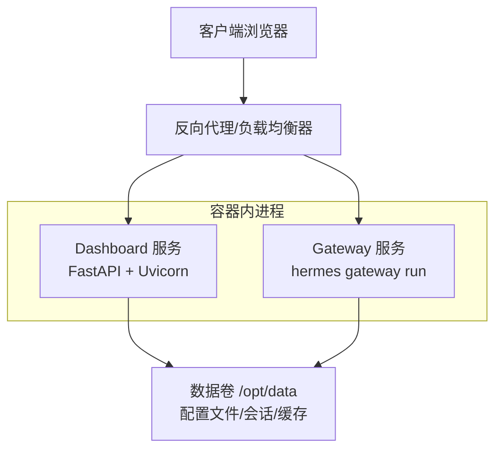
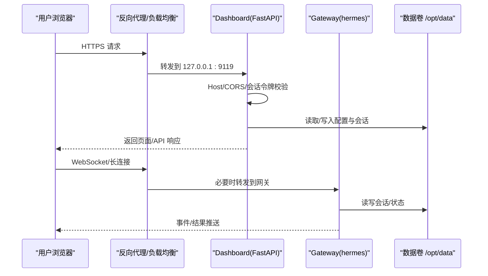
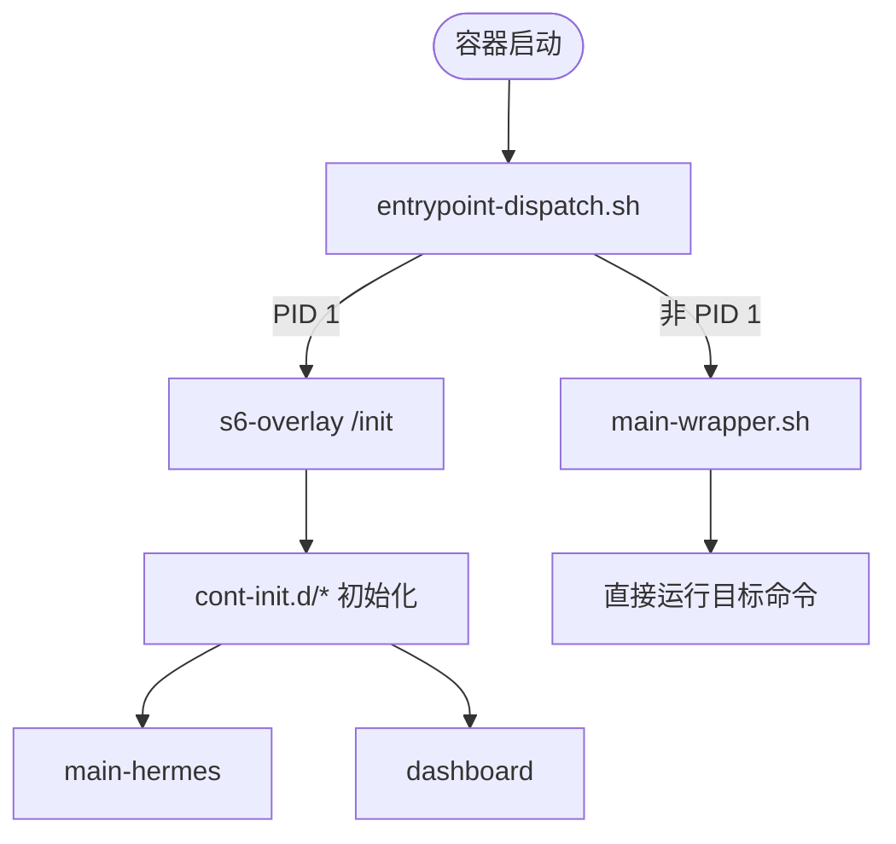
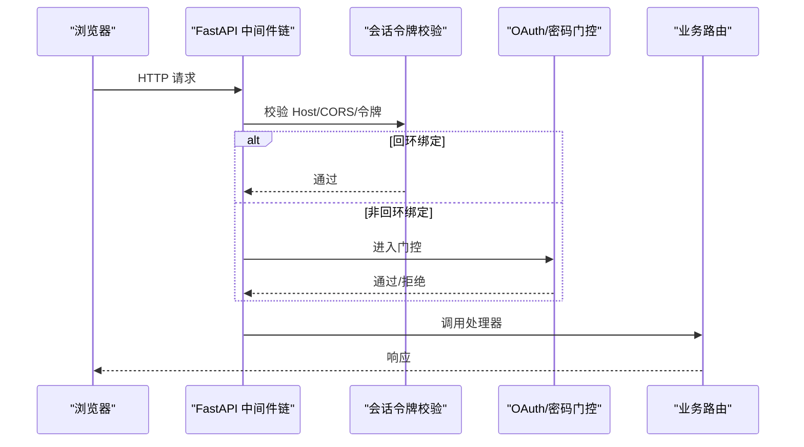
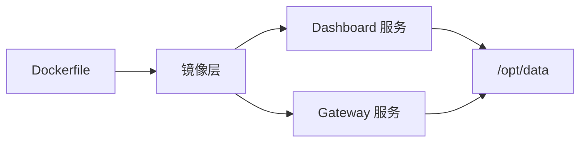
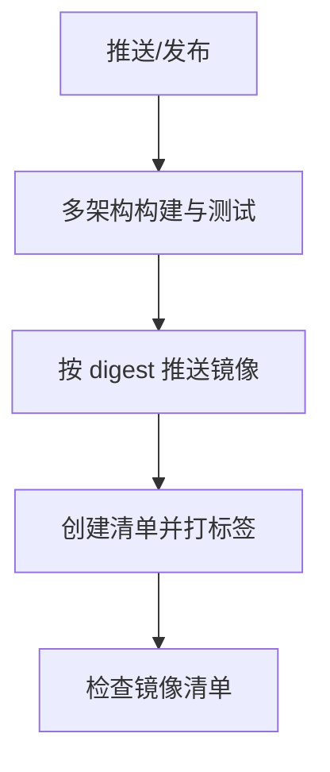

# 部署指南

<cite>
**本文引用的文件**   
- [Dockerfile](file://Dockerfile)
- [docker-compose.yml](file://docker-compose.yml)
- [hermes_cli/web_server.py](file://hermes_cli/web_server.py)
- [.github/workflows/docker.yml](file://.github/workflows/docker.yml)
- [docker/entrypoint-dispatch.sh](file://docker/entrypoint-dispatch.sh)
- [docker/stage2-hook.sh](file://docker/stage2-hook.sh)
- [docker/main-wrapper.sh](file://docker/main-wrapper.sh)
- [docker/s6-rc.d/dashboard](file://docker/s6-rc.d/dashboard)
- [docker/s6-rc.d/main-hermes](file://docker/s6-rc.d/main-hermes)
</cite>

## 目录
1. [简介](#简介)
2. [项目结构](#项目结构)
3. [核心组件](#核心组件)
4. [架构总览](#架构总览)
5. [详细组件分析](#详细组件分析)
6. [依赖关系分析](#依赖关系分析)
7. [性能与资源限制](#性能与资源限制)
8. [安全与访问控制](#安全与访问控制)
9. [监控、日志与健康检查](#监控日志与健康检查)
10. [CI/CD 与版本管理](#cicd-与版本管理)
11. [故障排查指南](#故障排查指南)
12. [结论](#结论)

## 简介
本指南面向生产环境的 Web 仪表板（Dashboard）部署与运维，覆盖容器化打包、反向代理接入、负载均衡、SSL/TLS 证书与安全头、访问控制策略、性能优化、缓存策略、资源限制、监控日志、健康检查、故障恢复以及自动化部署与版本管理等主题。文档基于仓库中的 Dockerfile、Compose 配置、Web 服务实现与 CI/CD 流水线进行说明，确保可操作且与代码一致。

## 项目结构
- 容器镜像构建：通过多阶段 Dockerfile 构建前端静态资源、Python 运行时与 s6-overlay 进程管理器，并将源码与依赖以只读方式固化到镜像中，数据持久化在 /opt/data。
- 编排与服务：docker-compose.yml 提供 gateway 与 dashboard 两个服务，默认使用 host 网络并挂载 ~/.hermes 到 /opt/data。
- Web 服务：FastAPI 实现的 Dashboard 后端，内置会话令牌认证、CORS 限制、Host 校验、插件路由门控与健康自检等能力。
- 进程管理：s6-overlay 作为 PID 1，负责启动 main-hermes 与 dashboard 等服务，并通过 cont-init.d 脚本完成初始化。

图表来源
- [docker-compose.yml:29-77](file://docker-compose.yml#L29-L77)
- [Dockerfile:336-457](file://Dockerfile#L336-L457)

章节来源
- [docker-compose.yml:1-77](file://docker-compose.yml#L1-L77)
- [Dockerfile:1-458](file://Dockerfile#L1-L458)

## 核心组件
- 容器镜像与运行环境
  - 多阶段构建：固定 SQLite 版本、安装 Node/npm、预构建前端、安装 Python 依赖、安装 s6-overlay。
  - 非 root 用户运行：默认 hermes 用户，UID/GID 可通过 HERMES_UID/HERMES_GID 映射。
  - 数据卷：/opt/data 为唯一可写持久化目录，所有状态落盘于此。
- 进程管理与入口
  - ENTRYPOINT 指向 entrypoint-dispatch.sh，根据是否由平台接管 PID 1 选择走 s6-overlay 或直连 main-wrapper.sh。
  - s6-overlay 管理服务：main-hermes（网关）、dashboard（Web UI）。
  - cont-init.d 初始化：stage2-hook.sh 负责 UID/GID 重映射、权限修复、配置种子与技能同步等。
- Web 服务
  - FastAPI 应用，提供 REST 与 WebSocket 接口，内置会话令牌认证、CORS、Host 校验、插件路由门控、健康自检。
  - 默认绑定 127.0.0.1:9119（compose 示例），生产建议置于反向代理之后。

章节来源
- [Dockerfile:52-457](file://Dockerfile#L52-L457)
- [docker/entrypoint-dispatch.sh](file://docker/entrypoint-dispatch.sh)
- [docker/stage2-hook.sh](file://docker/stage2-hook.sh)
- [docker/main-wrapper.sh](file://docker/main-wrapper.sh)
- [docker/s6-rc.d/dashboard](file://docker/s6-rc.d/dashboard)
- [docker/s6-rc.d/main-hermes](file://docker/s6-rc.d/main-hermes)
- [hermes_cli/web_server.py:1-800](file://hermes_cli/web_server.py#L1-L800)

## 架构总览
下图展示生产环境下典型的数据流与控制流：客户端经反向代理访问 Dashboard，Dashboard 与 Gateway 共享 /opt/data 数据卷；s6-overlay 统一生命周期管理。

图表来源
- [docker-compose.yml:29-77](file://docker-compose.yml#L29-L77)
- [hermes_cli/web_server.py:369-565](file://hermes_cli/web_server.py#L369-L565)
- [Dockerfile:336-457](file://Dockerfile#L336-L457)

## 详细组件分析

### 容器化与进程模型
- 构建产物
  - 前端静态资源在构建期预编译，避免运行时 npm 安装。
  - Python 依赖通过 uv sync 安装，生产镜像仅包含必要 extra。
  - s6-overlay 作为进程管理器，替代 tini，提供可靠的重启与监督。
- 启动流程
  - 容器启动时 entrypoint-dispatch.sh 决定走 s6-overlay 或直接执行 main-wrapper.sh。
  - s6-overlay 执行 cont-init.d 初始化脚本，再拉起 main-hermes 与 dashboard。
  - 每个服务以 hermes 用户运行，具备最小权限。

图表来源
- [Dockerfile:424-457](file://Dockerfile#L424-L457)
- [docker/entrypoint-dispatch.sh](file://docker/entrypoint-dispatch.sh)
- [docker/stage2-hook.sh](file://docker/stage2-hook.sh)
- [docker/main-wrapper.sh](file://docker/main-wrapper.sh)

章节来源
- [Dockerfile:93-147](file://Dockerfile#L93-L147)
- [Dockerfile:336-457](file://Dockerfile#L336-L457)

### Web 仪表板服务
- 绑定与访问
  - 默认监听 127.0.0.1:9119，生产应通过反向代理暴露。
  - CORS 限制为 localhost/127.0.0.1，防止跨站读取。
- 认证与授权
  - 本地回环模式：注入会话令牌到前端，通过 X-Hermes-Session-Token 或 Authorization Bearer 校验。
  - 非回环模式：启用 OAuth/密码门控，禁止 --insecure 绕过。
  - Host 头校验：防御 DNS Rebinding。
- 健康自检
  - 后台定时对受保护端点发起内部请求，记录健康状态。
  - 中间件统计未处理异常与 5xx 响应，供 /api/status 暴露。

图表来源
- [hermes_cli/web_server.py:369-565](file://hermes_cli/web_server.py#L369-L565)
- [hermes_cli/web_server.py:644-685](file://hermes_cli/web_server.py#L644-L685)
- [hermes_cli/web_server.py:751-800](file://hermes_cli/web_server.py#L751-L800)

章节来源
- [hermes_cli/web_server.py:1-800](file://hermes_cli/web_server.py#L1-L800)

### 反向代理与负载均衡
- 推荐方案
  - 使用 Nginx/Caddy/Apache 等作为 TLS 终止与反向代理，将 https://your.domain 转发至 http://127.0.0.1:9119。
  - 开启 gzip/brotli、HTTP/2、缓存静态资源、限流与 IP 白名单。
- 关键要点
  - 必须设置正确的 Host 头，否则会被 Dashboard 的 Host 校验拒绝。
  - 若需多实例，可在代理层做轮询或一致性哈希，注意 WebSocket 保持粘性会话。
  - 将敏感 API 路径限制在内网或仅允许特定来源。

[本节为通用实践说明，不直接引用具体文件]

### SSL/TLS 证书与安全头
- 证书管理
  - 在反向代理侧申请并续期证书（ACME/Let’s Encrypt），避免在容器内直接管理证书。
- 安全头
  - 建议添加：Strict-Transport-Security、X-Content-Type-Options、X-Frame-Options、Referrer-Policy、Permissions-Policy。
  - 结合代理层的速率限制与 WAF 规则提升安全性。

[本节为通用实践说明，不直接引用具体文件]

### 访问控制策略
- 本地回环模式
  - 适合单机或 SSH 隧道场景，自动注入会话令牌。
- 非回环模式
  - 强制启用 OAuth/密码门控，禁止通过 --insecure 关闭认证。
- Host 校验
  - 仅接受与绑定地址匹配的 Host 头，抵御 DNS Rebinding。

章节来源
- [hermes_cli/web_server.py:461-565](file://hermes_cli/web_server.py#L461-L565)
- [hermes_cli/web_server.py:644-685](file://hermes_cli/web_server.py#L644-L685)

### 性能优化与缓存策略
- 构建期优化
  - 前端资源预构建，避免运行时 npm install。
  - Python 依赖分层缓存，减少冷启动时间。
- 运行时优化
  - 禁用 Python 输出缓冲，保证日志实时性。
  - 预热关键模块，降低首次请求延迟。
  - 合理设置 Uvicorn worker 数与超时参数（由代理与容器资源共同决定）。
- 缓存策略
  - 在代理层缓存静态资源与短 TTL 的只读 API。
  - 数据库与文件系统层面利用 /opt/data 的持久化与索引。

章节来源
- [Dockerfile:54-91](file://Dockerfile#L54-L91)
- [Dockerfile:171-276](file://Dockerfile#L171-L276)
- [hermes_cli/web_server.py:171-234](file://hermes_cli/web_server.py#L171-L234)

### 资源限制与隔离
- 容器资源
  - 通过编排工具限制 CPU/内存，避免争用。
- 进程隔离
  - s6-overlay 统一管理子进程，异常退出自动重启。
- 数据隔离
  - 仅 /opt/data 可写，其余目录只读，降低误改风险。

章节来源
- [Dockerfile:288-313](file://Dockerfile#L288-L313)
- [Dockerfile:336-457](file://Dockerfile#L336-L457)

## 依赖关系分析
- 镜像依赖
  - Debian 基础镜像、SQLite 固定版本、Node/npm、Python 运行时、s6-overlay。
- 服务依赖
  - Dashboard 依赖 FastAPI/Uvicorn 与前端静态资源。
  - Gateway 依赖 Python 环境与外部 LLM/平台适配器。
- 数据依赖
  - 两者共享 /opt/data，存放配置、会话、缓存与技能。

图表来源
- [Dockerfile:52-457](file://Dockerfile#L52-L457)
- [docker-compose.yml:29-77](file://docker-compose.yml#L29-L77)

章节来源
- [Dockerfile:52-457](file://Dockerfile#L52-L457)
- [docker-compose.yml:29-77](file://docker-compose.yml#L29-L77)

## 性能与资源限制
- 构建与启动
  - 使用多阶段构建与分层缓存，缩短构建时间。
  - 预热关键模块，降低首包延迟。
- 运行时
  - 在代理层启用压缩与缓存。
  - 调整 Uvicorn worker 数为 CPU 核数或略高，结合容器资源限制。
  - 对大附件上传提高 Uvicorn 最大消息大小（如需要）。
- 资源配额
  - 为容器设置 CPU/Memory 上限，避免影响宿主与其他服务。
  - 定期清理 /opt/data 中的临时文件与过期会话。

[本节为通用实践说明，不直接引用具体文件]

## 安全与访问控制
- 网络暴露
  - 默认仅绑定 127.0.0.1，生产务必通过反向代理暴露。
- 认证
  - 回环模式使用会话令牌；非回环模式强制 OAuth/密码门控。
- 主机校验
  - 严格校验 Host 头，防止 DNS Rebinding。
- 插件路由
  - 运行时动态禁用插件 API，避免未启用插件被探测。
- 日志脱敏
  - 错误输出与终端输出进行敏感信息脱敏，避免密钥泄露。

章节来源
- [hermes_cli/web_server.py:369-565](file://hermes_cli/web_server.py#L369-L565)
- [hermes_cli/web_server.py:568-632](file://hermes_cli/web_server.py#L568-L632)

## 监控、日志与健康检查
- 健康检查
  - Dashboard 内置健康自检，周期性调用受保护端点，记录状态。
  - 中间件统计未处理异常与 5xx，用于 /api/status。
- 日志
  - 容器内禁用 Python 输出缓冲，便于实时采集。
  - 建议将 /opt/data 下的日志目录挂载到宿主机或集中日志系统。
- 指标导出
  - 如需 OTLP 导出，可在镜像中包含对应 extra，并在 Gateway 中启用。

章节来源
- [hermes_cli/web_server.py:688-800](file://hermes_cli/web_server.py#L688-L800)
- [Dockerfile:54-91](file://Dockerfile#L54-L91)

## CI/CD 与版本管理
- 构建与测试
  - GitHub Actions 在多架构上构建镜像，加载到本地守护进程后运行集成测试。
  - 构建参数注入 Git SHA，便于追溯。
- 发布
  - 按 digest 推送各架构镜像，随后合并为多架构清单，打上 main/latest 或 release 标签。
- 版本策略
  - 主分支推送到 :main 与 :latest，发布打 tag。
  - 镜像元数据包含 revision 标签，便于审计。

图表来源
- [.github/workflows/docker.yml:30-134](file://.github/workflows/docker.yml#L30-L134)
- [.github/workflows/docker.yml:139-290](file://.github/workflows/docker.yml#L139-L290)

章节来源
- [.github/workflows/docker.yml:1-290](file://.github/workflows/docker.yml#L1-L290)

## 故障排查指南
- 无法访问 Dashboard
  - 确认反向代理正确转发 Host 头，且未被 Host 校验拒绝。
  - 检查是否绑定 127.0.0.1，生产需通过代理暴露。
- 认证失败
  - 回环模式需携带 X-Hermes-Session-Token 或 Authorization Bearer。
  - 非回环模式需启用 OAuth/密码门控。
- 插件路由 404
  - 检查插件是否已启用，运行时禁用会立即生效。
- 健康自检失败
  - 查看 /api/status 中的 selftest 状态与最近错误计数。
- 容器启动失败
  - 检查 s6-overlay 服务状态与 cont-init.d 初始化日志。
  - 确认 /opt/data 权限与 UID/GID 映射正确。

章节来源
- [hermes_cli/web_server.py:461-565](file://hermes_cli/web_server.py#L461-L565)
- [hermes_cli/web_server.py:688-800](file://hermes_cli/web_server.py#L688-L800)
- [Dockerfile:336-457](file://Dockerfile#L336-L457)

## 结论
本指南基于仓库提供的容器化与 Web 服务实现，给出了生产环境部署的关键步骤与最佳实践。通过反向代理暴露 Dashboard、启用强认证与 Host 校验、合理配置缓存与资源限制、完善监控与健康检查，并结合 CI/CD 流水线实现自动化发布与版本管理，可显著提升系统的稳定性、安全性与可维护性。建议在上线前进行端到端演练与压测，确保满足业务 SLA。