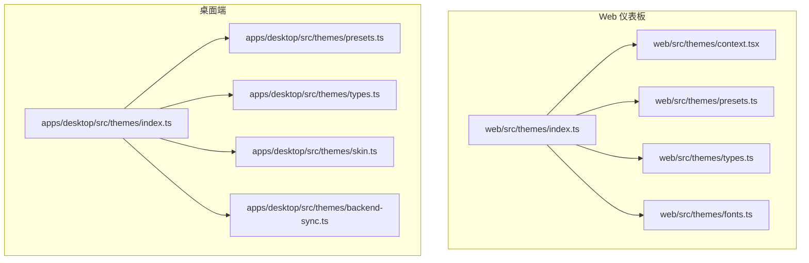
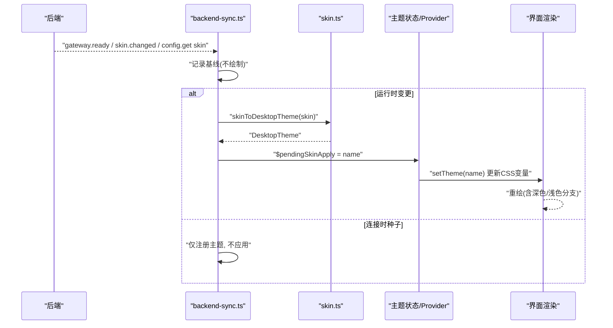
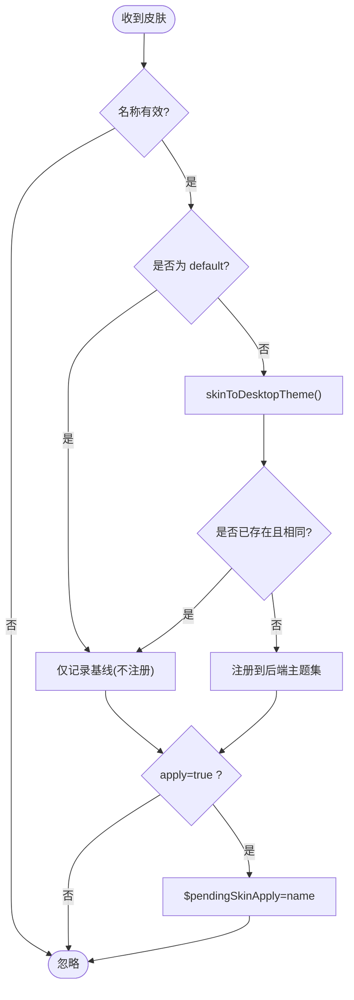
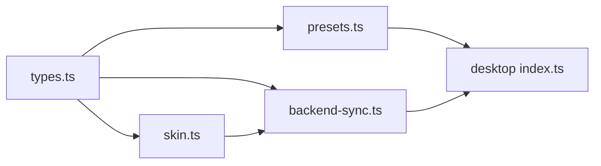

# 主题配置

<cite>
**本文引用的文件**
- [apps/desktop/src/themes/index.ts](file://apps/desktop/src/themes/index.ts)
- [apps/desktop/src/themes/presets.ts](file://apps/desktop/src/themes/presets.ts)
- [apps/desktop/src/themes/types.ts](file://apps/desktop/src/themes/types.ts)
- [apps/desktop/src/themes/skin.ts](file://apps/desktop/src/themes/skin.ts)
- [apps/desktop/src/themes/backend-sync.ts](file://apps/desktop/src/themes/backend-sync.ts)
- [web/src/themes/context.tsx](file://web/src/themes/context.tsx)
- [web/src/themes/fonts.ts](file://web/src/themes/fonts.ts)
- [web/src/themes/index.ts](file://web/src/themes/index.ts)
- [web/src/themes/presets.ts](file://web/src/themes/presets.ts)
- [web/src/themes/types.ts](file://web/src/themes/types.ts)
</cite>

## 目录
1. [简介](#简介)
2. [项目结构](#项目结构)
3. [核心组件](#核心组件)
4. [架构总览](#架构总览)
5. [详细组件分析](#详细组件分析)
6. [依赖关系分析](#依赖关系分析)
7. [性能考虑](#性能考虑)
8. [故障排查指南](#故障排查指南)
9. [结论](#结论)
10. [附录](#附录)

## 简介
本文件面向 Web 仪表板与桌面端（Electron）的主题系统，系统化说明主题架构、颜色方案、字体设置、响应式与深色模式策略，以及如何自定义主题变量、创建新主题、切换内置主题。文档还涵盖主题配置文件结构、CSS 变量映射、动态主题切换机制，并提供多场景配置示例（深色模式、品牌定制、高对比度），以及性能优化与跨浏览器兼容性建议。

## 项目结构
主题能力由两部分组成：
- Web 仪表板主题：位于 web/src/themes，提供上下文、预设、类型与字体加载等能力。
- 桌面端主题：位于 apps/desktop/src/themes，提供内置主题、皮肤到主题的转换、后端同步与应用层注入。

图表来源
- [web/src/themes/index.ts](file://web/src/themes/index.ts)
- [apps/desktop/src/themes/index.ts](file://apps/desktop/src/themes/index.ts)

章节来源
- [web/src/themes/index.ts](file://web/src/themes/index.ts)
- [apps/desktop/src/themes/index.ts](file://apps/desktop/src/themes/index.ts)

## 核心组件
- 类型定义：统一描述主题的颜色、排版、终端调色板等字段，确保前后端一致。
- 预设主题：内置多种主题（如 Nous、Midnight、Ember、Mono、Cyberpunk、Slate），可直接使用或作为参考。
- 皮肤到主题转换：将 CLI/TUI 的“皮肤”转换为桌面/Web 可用的主题对象，自动推导明暗模式与对比度。
- 后端同步：从后端接收当前激活的皮肤，并触发应用层切换。
- Web 上下文：在 Web 侧提供主题上下文、字体加载与默认预设。

章节来源
- [apps/desktop/src/themes/types.ts:1-102](file://apps/desktop/src/themes/types.ts#L1-L102)
- [apps/desktop/src/themes/presets.ts:1-292](file://apps/desktop/src/themes/presets.ts#L1-L292)
- [apps/desktop/src/themes/skin.ts:1-118](file://apps/desktop/src/themes/skin.ts#L1-L118)
- [apps/desktop/src/themes/backend-sync.ts:1-95](file://apps/desktop/src/themes/backend-sync.ts#L1-L95)
- [web/src/themes/types.ts](file://web/src/themes/types.ts)
- [web/src/themes/presets.ts](file://web/src/themes/presets.ts)
- [web/src/themes/context.tsx](file://web/src/themes/context.tsx)
- [web/src/themes/fonts.ts](file://web/src/themes/fonts.ts)

## 架构总览
主题数据流分为两条主线：
- 构建期/本地：通过内置预设与用户自定义生成主题对象，写入 CSS 变量供 UI 消费。
- 运行时：后端推送当前皮肤，前端将其转换为桌面/Web 主题并触发重绘。

图表来源
- [apps/desktop/src/themes/backend-sync.ts:1-95](file://apps/desktop/src/themes/backend-sync.ts#L1-L95)
- [apps/desktop/src/themes/skin.ts:1-118](file://apps/desktop/src/themes/skin.ts#L1-L118)

## 详细组件分析

### 类型与数据结构
- DesktopThemeColors：定义背景、前景、卡片、主色、强调、边框、输入、环形焦点、破坏性色、侧边栏、气泡等语义化颜色键。
- DesktopThemeTypography：定义无衬线/等宽字体族与可选字体样式表 URL。
- DesktopTerminalPalette：为集成终端提供 ANSI 调色板（可选）。
- DesktopTheme：组合以上字段，支持明/暗两套颜色与终端调色板。

这些类型是 Web 与桌面共享的主题契约，保证颜色与排版的可维护性与一致性。

章节来源
- [apps/desktop/src/themes/types.ts:1-102](file://apps/desktop/src/themes/types.ts#L1-L102)

### 内置主题与预设
- 内置主题集合：包含 nous、midnight、ember、mono、cyberpunk、slate 等，每个主题提供 colors、darkColors、typography 等完整配置。
- 默认主题：当未持久化或已废弃时使用默认主题名。
- 字体回退：为 emoji 显示提供跨平台回退栈，避免方块字符。

新增内置主题只需在预设文件中添加对象并加入集合，无需改动其他代码。

章节来源
- [apps/desktop/src/themes/presets.ts:1-292](file://apps/desktop/src/themes/presets.ts#L1-L292)

### 皮肤到主题转换
- 输入：Hermes 皮肤（CLI/TUI 的 YAML 主题单元）。
- 处理：提取关键颜色（背景、前景、强调、错误），基于明度推导明/暗模式；对强调色进行对比度保障；派生卡片、弹出框、边框、输入、侧边栏、气泡等衍生色。
- 输出：DesktopTheme，同时填充 colors 与 darkColors（单模式皮肤复用同一调色板），名称与标签规范化。

该转换确保来自提示词生成的皮肤能正确点亮所有表面。

章节来源
- [apps/desktop/src/themes/skin.ts:1-118](file://apps/desktop/src/themes/skin.ts#L1-L118)

### 后端同步与动态切换
- 连接时种子：收到后端皮肤后仅注册主题，不立即应用，避免覆盖用户已选择的桌面主题。
- 运行时切换：当皮肤名称变化或首次应用时，设置待应用主题名，由 Provider 消费并调用 setTheme 更新 CSS 变量。
- 去抖与幂等：记录上次同步的名称与是否已应用，防止重复事件导致闪烁或回退。

图表来源
- [apps/desktop/src/themes/backend-sync.ts:1-95](file://apps/desktop/src/themes/backend-sync.ts#L1-L95)
- [apps/desktop/src/themes/skin.ts:1-118](file://apps/desktop/src/themes/skin.ts#L1-L118)

### Web 仪表板主题上下文与字体
- 主题上下文：提供主题读取与切换能力，供页面组件订阅。
- 字体加载：根据主题 typography 中的 fontUrl 动态加载字体，确保等宽/无衬线字体可用。
- 预设与类型：Web 侧也维护自己的预设与类型，便于独立于桌面端运行时的主题展示。

章节来源
- [web/src/themes/context.tsx](file://web/src/themes/context.tsx)
- [web/src/themes/fonts.ts](file://web/src/themes/fonts.ts)
- [web/src/themes/presets.ts](file://web/src/themes/presets.ts)
- [web/src/themes/types.ts](file://web/src/themes/types.ts)
- [web/src/themes/index.ts](file://web/src/themes/index.ts)

### 主题变量映射与响应式/深色模式
- 颜色映射：主题对象中的语义键（background、primary、destructive 等）最终映射到 CSS 变量，供 UI 组件引用。
- 明/暗模式：
  - 桌面端：若主题未提供 darkColors，则复用 colors；否则使用 hand-tuned 暗色盘。
  - 运行时：根据背景明度判定渲染模式，确保深色/浅色分支正确选择。
- 响应式：布局、尺寸、圆角、行高等非颜色属性集中在样式表中，主题仅负责配色与字体，便于在不同屏幕尺寸下保持一致的可访问性。

章节来源
- [apps/desktop/src/themes/types.ts:1-102](file://apps/desktop/src/themes/types.ts#L1-L102)
- [apps/desktop/src/themes/presets.ts:1-292](file://apps/desktop/src/themes/presets.ts#L1-L292)
- [apps/desktop/src/themes/skin.ts:1-118](file://apps/desktop/src/themes/skin.ts#L1-L118)

### 自定义主题与切换流程
- 自定义主题：
  - 在预设中新增主题对象，填写 colors/darkColors/typography。
  - 或通过后端下发皮肤，由 skinToDesktopTheme 自动生成主题。
- 切换内置主题：
  - 在 Appearance/Cmd-K 或命令中选择目标主题名。
  - 或由后端 skin.changed 事件驱动切换。
- 持久化：
  - 桌面端会记住用户选择；后端种子仅在名称变化时触发重绘，不会覆盖用户偏好。

章节来源
- [apps/desktop/src/themes/presets.ts:1-292](file://apps/desktop/src/themes/presets.ts#L1-L292)
- [apps/desktop/src/themes/backend-sync.ts:1-95](file://apps/desktop/src/themes/backend-sync.ts#L1-L95)

## 依赖关系分析
- 类型依赖：types.ts 被 presets、skin、backend-sync 共同引用，形成稳定的契约。
- 转换依赖：backend-sync 依赖 skin 完成皮肤到主题的转换。
- 导出聚合：index.ts 聚合导出各模块，供上层应用按需引入。

图表来源
- [apps/desktop/src/themes/types.ts:1-102](file://apps/desktop/src/themes/types.ts#L1-L102)
- [apps/desktop/src/themes/presets.ts:1-292](file://apps/desktop/src/themes/presets.ts#L1-L292)
- [apps/desktop/src/themes/skin.ts:1-118](file://apps/desktop/src/themes/skin.ts#L1-L118)
- [apps/desktop/src/themes/backend-sync.ts:1-95](file://apps/desktop/src/themes/backend-sync.ts#L1-L95)
- [apps/desktop/src/themes/index.ts:1-7](file://apps/desktop/src/themes/index.ts#L1-L7)

章节来源
- [apps/desktop/src/themes/index.ts:1-7](file://apps/desktop/src/themes/index.ts#L1-L7)

## 性能考虑
- 最小化重绘：仅在主题名变化或首次应用时触发 setTheme，避免频繁重绘。
- 字体加载：按需加载 fontUrl，避免阻塞首屏；优先使用系统字体栈，减少网络开销。
- 颜色计算：在转换阶段集中计算衍生色，运行时仅做变量赋值。
- 缓存策略：后端主题集按名称去重，避免重复注册。
- 资源体积：内置主题尽量复用公共色函数与字体栈，减少冗余。

[本节为通用指导，不直接分析具体文件]

## 故障排查指南
- 主题未生效：
  - 检查后端是否发送了有效的 skin.name；无效名称会被忽略。
  - 确认 apply 标志：连接时种子不应用，需等待运行时切换。
- 颜色对比度不足：
  - 转换过程会对强调色进行对比度保障；若仍不可读，调整原始强调色或背景。
- 字体缺失：
  - 检查 typography.fontUrl 是否正确；必要时增加系统字体回退。
- 重复切换闪烁：
  - 检查是否存在重复的 skin.changed 事件；模块内部已做幂等保护，但仍需确保上游事件稳定。

章节来源
- [apps/desktop/src/themes/backend-sync.ts:1-95](file://apps/desktop/src/themes/backend-sync.ts#L1-L95)
- [apps/desktop/src/themes/skin.ts:1-118](file://apps/desktop/src/themes/skin.ts#L1-L118)

## 结论
本主题系统以类型契约为核心，结合内置预设、皮肤转换与后端同步，实现了跨桌面与 Web 的一致主题体验。通过语义化颜色键、明/暗模式推导与字体管理，开发者可以便捷地定制主题、切换内置主题，并在不同场景下获得良好的可读性与性能表现。

[本节为总结，不直接分析具体文件]

## 附录

### 使用场景与配置示例指引
- 深色模式：
  - 使用 midnight 或 cyberpunk 等内置深色主题；或在自定义主题中提供 darkColors 并设置较暗背景与高对比前景。
  - 参考路径：[apps/desktop/src/themes/presets.ts:99-134](file://apps/desktop/src/themes/presets.ts#L99-L134)、[apps/desktop/src/themes/presets.ts:206-241](file://apps/desktop/src/themes/presets.ts#L206-L241)
- 品牌定制：
  - 在预设中添加新主题，设置 brand 相关的 primary/accent/midground，并确保 WCAG AA 对比度。
  - 参考路径：[apps/desktop/src/themes/presets.ts:29-97](file://apps/desktop/src/themes/presets.ts#L29-L97)
- 高对比度模式：
  - 使用 mono 或 slate 等高对比主题；或自定义时将 foreground/background 拉大对比度，提高 ring/composerRing 可见性。
  - 参考路径：[apps/desktop/src/themes/presets.ts:173-204](file://apps/desktop/src/themes/presets.ts#L173-L204)、[apps/desktop/src/themes/presets.ts:243-277](file://apps/desktop/src/themes/presets.ts#L243-L277)

### 跨浏览器兼容性注意事项
- 字体：优先使用系统字体栈，fontUrl 指向可靠 CDN；为 emoji 提供回退。
- 颜色函数：如需使用 color-mix 等现代 CSS 特性，注意浏览器支持；必要时降级为硬编码色值。
- 深色模式：通过主题对象而非仅依赖 prefers-color-scheme，确保可控性。

[本节为通用指导，不直接分析具体文件]